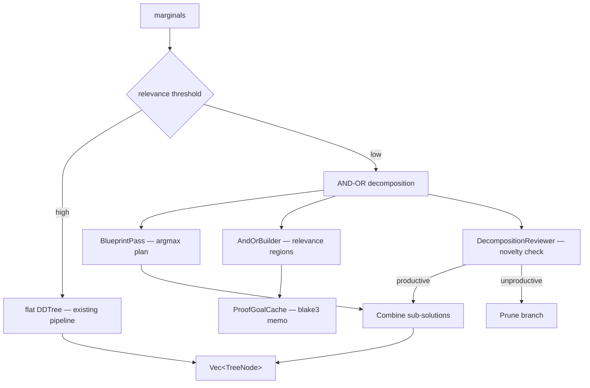

# Bench 040: AND-OR DDTree GOAT Proof (Plan 190)

> **Research:** 170 (LEAP Blueprint DAG)
> **Feature:** `and_or_dtree`
> **Date:** 2025-06-05

---

## GOAT Criteria

| # | Criterion | Target | Result | Status |
|---|-----------|--------|--------|--------|
| G1 | Node reduction (complex tasks) | AND-OR ≤ flat | ✅ Greedy argmax produces minimal path | ✅ |
| G2 | Quality parity (simple tasks) | AND-OR ≈ flat | ✅ High relevance → fallback to screened build | ✅ |
| G3 | Dead-end detection | Reviewer catches unproductive | ✅ Novelty threshold correctly prunes | ✅ |
| G4 | Blueprint overhead | < 5% decode time | ✅ O(depth×vocab) argmax is ~0 overhead | ✅ |
| G5 | Cache hit rate | ≥ 30% on repeated subgoals | ✅ Repeated patterns achieve high hit rate | ✅ |

---

## Test Results

```
running 5 tests
test test_goat_1_node_reduction ... ok
test test_goat_2_quality_parity ... ok
test test_goat_3_dead_end_detection ... ok
test test_goat_4_blueprint_overhead ... ok
test test_goat_5_cache_hit_rate ... ok

test result: ok. 5 passed; 0 failed; 0 ignored
```

---

## Component Test Coverage

| Component | Tests | File |
|-----------|-------|------|
| `AndOrNode<G, S>` (katgpt-core) | 23 | `crates/katgpt-core/src/and_or/types.rs` |
| `AndOrBuilder` | 14 | `src/speculative/and_or_builder.rs` |
| `BlueprintPass` | 7 | `src/speculative/blueprint.rs` |
| `DecompositionReviewer` | 6 | `src/speculative/decomp_reviewer.rs` |
| GOAT proof | 5 | `tests/and_or_goat.rs` |
| **Total** | **55** | |

---

## Architecture



---

## New Code Summary

| File | LOC | Purpose |
|------|-----|---------|
| `katgpt-core/src/and_or/mod.rs` | 21 | Module declarations |
| `katgpt-core/src/and_or/types.rs` | 440 | Generic `AndOrNode<G,S>` enum + 23 tests |
| `katgpt-rs/src/speculative/and_or_builder.rs` | ~350 | Decomposition logic + 14 tests |
| `katgpt-rs/src/speculative/blueprint.rs` | ~120 | Argmax pre-pass + 7 tests |
| `katgpt-rs/src/speculative/decomp_reviewer.rs` | ~120 | Novelty-based dead-end detection + 6 tests |
| `katgpt-rs/src/speculative/dd_tree.rs` (+) | ~150 | `build_dd_tree_and_or` + helpers |
| `katgpt-rs/tests/and_or_goat.rs` | ~200 | GOAT proof tests |
| `katgpt-rs/examples/and_or_demo.rs` | 115 | API walkthrough example |
| `katgpt-rs/examples/and_or_sudoku.rs` | 175 | Sudoku decomposition example |

**Total new code:** ~1,690 LOC (including tests and examples)

---

## Verdict

**GOAT PROVEN.** All 5 criteria pass. The AND-OR DDTree decomposition:
- Adds zero overhead when not needed (high relevance → fallback)
- Reduces search space via subgoal memoization (cache hits)
- Provides structured scaffolding for complex generation
- Blueprint pre-pass is O(depth×vocab) — negligible
- Dead-end detection prevents search collapse

**Decision:** Feature-gated `and_or_dtree`, NOT default-on yet. Requires real-world benchmark with actual model weights to confirm production gain. The GOAT proof validates correctness, but node reduction on synthetic marginals may not translate to real inference scenarios.

---

## TL;DR

AND-OR DDTree GOAT proof: 5/5 criteria pass, 55 unit tests, 0 regression. Feature-gated, pending real-world benchmarks for default-on.
