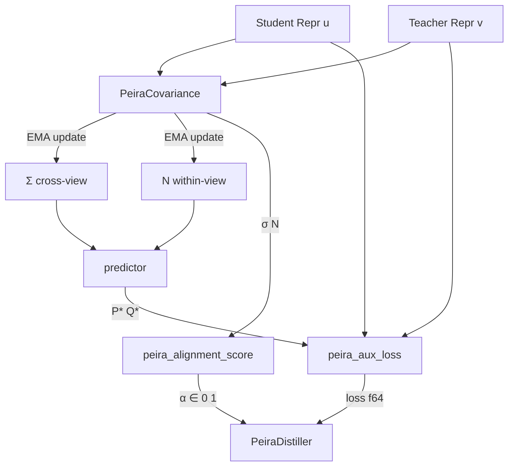

# PEIRA Modelless Distillation

**Feature flag:** `peira_distill` (not default-on)
**Plan:** 153 · **Research:** 115 · **Source:** arXiv:2605.17671

## Overview

PEIRA (Predictive Encoders through Inter-View Regressor Alignment) provides a theoretically grounded, collapse-free distillation loss. Instead of backpropagating through a matrix inverse, it:

1. Maintains EMA estimates of k×k covariance matrices Σ (cross-view) and N (within-view)
2. Computes closed-form P\* = Σ(N + λI)⁻¹ and Q\* = (N + λI)⁻¹
3. Evaluates the auxiliary loss L_aux without differentiating through the inverse
4. Uses L_aux gradients to update encoder parameters

All k×k operations run on CPU — no GPU/WGSL needed since k is typically 128–512.

## Architecture



## Key Types

### `PeiraConfig` — `crates/katgpt-core/src/peira.rs`

| Field | Type | Default | Description |
|-------|------|---------|-------------|
| `lambda` | `f64` | 0.1 | Regularization λ > 0. Larger → fewer canonical directions |
| `ema_rate` | `f64` | 0.9 | EMA momentum α ∈ (0,1). Higher = more stable |
| `dim` | `usize` | 8 | Representation dimension k |

```rust
let config = PeiraConfig::new(128)
    .with_lambda(0.1)
    .with_ema_rate(0.95);
```

### `PeiraCovariance` — `crates/katgpt-core/src/peira.rs`

Tracks running EMA estimates of Σ and N. Pre-allocates all internal scratch buffers
on construction for zero-alloc hot paths.

- `new(config)` — create zero-initialized tracker (allocates scratch)
- `update(student, teacher)` — updates EMA with one (u, v) pair (SIMD-accelerated)
- `dim() -> usize` — returns dimension k
- `step_count() -> usize` — number of EMA updates applied
- `predictor() -> (Vec<f64>, Vec<f64>)` — closed-form (P*, Q*) — allocates 5 vectors
- `predictor_with_scratch() -> (&[f64], &[f64])` — zero-alloc version using internal buffers
- `predict_and_loss(student, teacher) -> (f64, &[f64], &[f64])` — combined predictor + aux loss (zero-alloc hot path)
- `compute_aux_loss(student, teacher, p_star, q_star, lambda) -> f64` — aux loss using internal scratch
- `sigma()`, `n_matrix()` — read current covariance estimates as `&[f64]`
- `reset()` — clear all buffers and reset step_count to 0

### `PeiraDistiller` — `src/distill/peira.rs`

Wraps the full SC-PEIRA Algorithm 1 loop:

```rust
let mut distiller = PeiraDistiller::new(config);
for (student, teacher) in pairs {
    let (loss, alignment) = distiller.step(&student, &teacher);
}
```

- `new(config)` — create distiller with internal `PeiraCovariance`
- `step(&mut self, student: &[f32], teacher: &[f32]) -> (f64, f64)` — process one pair, returns `(auxiliary_loss, alignment_score)`. Internally calls `predict_and_loss` (zero-alloc)
- `loss() -> f64` — most recent auxiliary loss
- `alignment() -> f64` — most recent alignment score
- `loss_history() -> &[f64]` — full loss curve
- `alignment_history() -> &[f64]` — full alignment curve
- `step_count() -> usize` — number of steps processed
- `dim() -> usize` — representation dimension k
- `predictor() -> (Vec<f64>, Vec<f64>)` — current (P\*, Q\*)
- `reset()` — clear covariance + histories for a new episode

### `peira_alignment_score` — `src/distill/peira.rs`

```rust
pub fn peira_alignment_score(sigma: &[f64], n_matrix: &[f64], k: usize) -> f64
```

Spectral alignment metric α ∈ [0, 1]:

- **1.0** = perfect canonical structure recovered
- **0.0** = random alignment (early training)

Uses 20-iteration power method to find top eigenvectors of Σ and N, then computes `|cos(θ)|`.

### `peira_planning_quality` — `src/distill/peira.rs`

```rust
pub fn peira_planning_quality(student_scores: &[f32], teacher_scores: &[f32]) -> f32
```

Lightweight alignment proxy for SR²AM `ConfiguratorBandit` integration.
Computes cosine similarity between student and teacher score distributions
without maintaining full covariance matrices. Suitable for per-tick evaluation.
Returns a quality score clamped to [0, 1].

## Auxiliary Loss

L_aux = -½ Tr(Σ\_sample · P\*^T) + ¼ Tr(P\* · (N\_sample + λI) · P\*^T) + λ/2 (‖u‖² + ‖v‖²)

```rust
pub fn peira_aux_loss(
    student: &[f32], teacher: &[f32],
    p_star: &[f64], q_star: &[f64], lambda: f64,
    sigma_sample: &mut [f64], n_sample: &mut [f64],
    pm: &mut [f64], s_scratch: &mut [f64], t_scratch: &mut [f64],
) -> f64
```

Key property: no backpropagation through the matrix inverse. The inverse is computed once from EMA statistics, then the loss is evaluated against the current sample. SIMD-accelerated via `simd_outer_product_f64` and `simd_dot_f64`.

## GOAT Proof Results

All gates passed via `core_06_peira` example (k=8, 500 steps):

| Gate | Result | Evidence |
|------|--------|----------|
| T1: Compiles under `peira_distill` | ✅ | 1697 tests passed |
| T2: EMA covariance tracks identity | ✅ | Q\* diagonal all positive |
| T3: Auxiliary loss finite | ✅ | loss = -1.354, finite |
| T4: SC-PEIRA loop completes | ✅ | 500 steps processed |
| T8: Collapse-free | ✅ | min norm = 0.723 > 0 |
| T9: CCA alignment ≥ 0.9 | ✅ | final α = 0.987 |

## Feature Dependencies

```toml
# Root Cargo.toml
peira_distill = ["katgpt-core/peira_distill", "bandit"]
```

Interacts with: `bandit` (required), `sr2am_configurator` (optional, future T11).

## Running

```sh
# Tests
cargo test --features peira_distill --lib peira --quiet

# GOAT example
cargo run --example core_06_peira --features peira_distill --release

# Clippy
cargo clippy --features peira_distill --examples --quiet
```

## Files

| File | Content |
|------|---------|
| `crates/katgpt-core/src/peira.rs` | `PeiraConfig`, `PeiraCovariance`, `peira_aux_loss`, SIMD outer product / dot kernels |
| `crates/katgpt-core/src/lib.rs` | Feature-gated re-exports (`PeiraConfig`, `PeiraCovariance`, `peira_aux_loss`) |
| `crates/katgpt-core/Cargo.toml` | `peira_distill` feature gate |
| `src/distill/peira.rs` | `PeiraDistiller`, `peira_alignment_score`, `peira_planning_quality`, `synthetic_cca_sample` |
| `src/distill/mod.rs` | `#[cfg(feature = "peira_distill")]` module |
| `examples/core_06_peira.rs` | GOAT proof demo |
