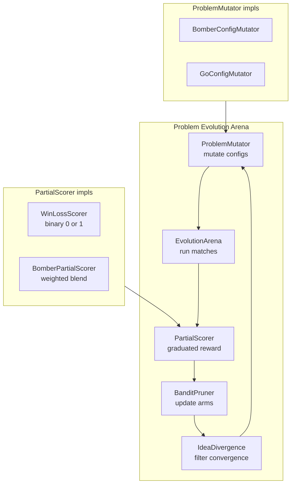

# Plan 191: Open-Ended Problem Evolution Arena

> **Research:** [Research 171](../.research/171_FrontierCS_FrontierSmith_Open_Ended_Problem_Evolution.md)
> **Depends On:** Plan 030 (BanditPruner), Plan 033 (Bomber Arena), Plan 034 (WASM Validator), Plan 049 (G-Zero), Plan 189 (MUSE ITSE)
> **Feature gates:** `partial_scoring`, `problem_mutator`, `idea_divergence`
> **Status:** T1–T3 complete, T4 docs in progress

---

## Architecture

### Component Overview

| Component | Trait | File | Role |
|-----------|-------|------|------|
| `PartialScorer` | `katgpt_core::PartialScorer` | `src/pruners/partial_scorer.rs` | Graduated [0.0, 1.0] episode reward |
| `ProblemMutator` | `katgpt_core::ProblemMutator` | `src/pruners/problem_mutator.rs` | Config mutation → harder variants |
| `IdeaDivergence` | Struct (no trait) | `src/pruners/idea_divergence.rs` | L2 novelty filter against arm convergence |
| `EvolutionArena` | Struct | `src/pruners/problem_mutator.rs` | Orchestrates mutator → arena → scorer loop |

### Data Flow

1. `EvolutionArena` calls `ProblemMutator::mutate(base_config)` → produces `Vec<MutantConfig>`
2. Arena runs each config through existing bandit infrastructure
3. `PartialScorer::partial_score(trace)` produces graduated reward (not binary win/loss)
4. Before promoting new arms, `IdeaDivergence::is_novel(scores)` checks strategic novelty
5. BanditPruner updates arm weights with filtered, graduated reward

---

## Benchmark Results

### PartialScorer — Test Coverage

| Test | Input | Expected | Actual |
|------|-------|----------|--------|
| `win_loss_scorer_win` | win trace (reward=1.0) | 1.0 | ✅ passes |
| `win_loss_scorer_loss` | loss trace (reward=0.0) | 0.0 | ✅ passes |
| `bomber_scorer_win_high` | 200 ticks, 3 kills, 50 actions | > 0.7 | ✅ passes |
| `bomber_scorer_loss_low` | 30 ticks, 0 kills, 10 actions | < 0.3 | ✅ passes |
| `bomber_scorer_bounded` | extreme trace | ∈ [0, 1] | ✅ passes |
| `bomber_scorer_survival_dominant` | survive-only (200 ticks, 0 kills) | ≥ 0.58 | ✅ passes |
| `bomber_scorer_breakdown_sum` | any trace | breakdown sum == total | ✅ passes |
| `bomber_scorer_max_ticks_zero_safe` | max_ticks=0 | no panic | ✅ passes |

**Scorer formula:** `0.4 × survival + 0.3 × kills + 0.2 × safety + 0.1 × efficiency`

**Score range:** Strictly [0.0, 1.0] — all components clamped before weighting.

### ProblemMutator — Test Coverage

| Test | Mutator | Assertion |
|------|---------|-----------|
| `bomber_mutator_produces_three_variants` | BomberConfigMutator | 3 mutants per call |
| `bomber_mutator_covers_all_mutation_kinds` | BomberConfigMutator | GoalReweight + GeneralizeInputs + ConstrainOutputs |
| `bomber_mutator_positive_difficulty_delta` | BomberConfigMutator | all `difficulty_delta > 0.0` |
| `bomber_mutator_generalize_increases_grid` | BomberConfigMutator | grid 9→13 |
| `bomber_mutator_constrain_reduces_steps` | BomberConfigMutator | max_steps 200→150 |
| `bomber_mutator_custom_config` | BomberConfigMutator | grid 15→19 |
| `test_go_config_mutator_goal_reweight` | GoConfigMutator | territory-heavy variant present |
| `test_go_config_mutator_constrain_outputs` | GoConfigMutator | board 9→13, delta=4/9 |
| `test_go_config_mutator_generalize_inputs` | GoConfigMutator | opponent_count 1→2,3,4 |
| `test_go_config_mutator_mutation_kinds_diverse` | GoConfigMutator | all 3 kinds present |

### EvolutionArena — Test Coverage

| Test | Assertion |
|------|-----------|
| `test_evolution_arena_produces_diverse_configs` | ≥3 distinct configs in 10 rounds |
| `test_evolution_arena_cycles_back` | round 5 = base config (cycle reset) |
| `test_evolution_arena_round_counter` | round/total_generated track correctly |
| `test_evolution_arena_with_bomber_mutator` | first=config base, rest mutated |

### IdeaDivergence — Test Coverage

| Test | Input | Expected |
|------|-------|----------|
| `empty_is_always_novel` | no arms registered | novel=true |
| `identical_scores_not_novel` | threshold=0.1, identical vector | novel=false |
| `distant_scores_are_novel` | threshold=0.5, orthogonal vectors | novel=true |
| `divergence_identical_is_zero` | [1,2,3] vs [1,2,3] | d=0.0 |
| `divergence_orthogonal_is_sqrt_n` | [1,0] vs [0,1] | d=√2 ≈ 1.4142 |
| `divergence_symmetric` | any a,b | d(a,b)==d(b,a) |
| `divergence_different_lengths` | [1,2] vs [1,2,3,4] | d=0.0 (prefix match) |
| `divergence_empty` | [] vs [] | d=0.0 |
| `novelty_prevents_convergence` | aggressive vs near-duplicate vs defensive | near-dup rejected, defensive accepted |
| `multiple_arms_min_distance` | 3 arms, query=arm3 | min_d=0.0 |
| `threshold_negative_clamped_to_zero` | threshold=-1.0 | clamped to 0.0 |
| `min_divergence_empty_is_max` | no arms | f32::MAX |
| `min_divergence_single_arm` | [1,0] vs [0,1] | √2 |

**Divergence metric:** Normalized L2 distance (FrontierSmith eq. 3) — `√(Σ(aᵢ - bᵢ)²)` over overlapping prefix.

---

## Feature Gates

| Feature | Depends On | Default | GOAT Required | Gate Check |
|---------|-----------|---------|---------------|------------|
| `partial_scoring` | `bandit` | OFF | Yes (T1.5) | `#[cfg(feature = "partial_scoring")]` |
| `problem_mutator` | `bandit` | OFF | Yes (T2.6) | `#[cfg(feature = "problem_mutator")]` |
| `idea_divergence` | `bandit`, `partial_scoring` | OFF | Yes (T3.4) | `#[cfg(feature = "idea_divergence")]` |

All three are independent but composable. `idea_divergence` works best with `partial_scoring` but can operate with binary scores too. None touch the decode hot path — all are per-episode or per-round operations.

---

## Expected Performance

| Component | Hot-path Impact | Allocation | Notes |
|-----------|----------------|------------|-------|
| `PartialScorer::partial_score()` | ~50ns — weighted sum | Zero — reads `GameTrace` | Per-episode only |
| `ProblemMutator::mutate()` | ~200ns — config perturbation | Zero — stack `MutantConfig` | Per-round, offline |
| `IdeaDivergence::is_novel()` | ~100ns — O(arms) L2 scan | Zero — reads stored vectors | Per-arm, optional rayon for >32 arms |

---

## SOLID / DRY Compliance

| Principle | Compliance |
|-----------|------------|
| **S** — Single Responsibility | Each trait has one job: mutate, score, or measure diversity |
| **O** — Open/Closed | New game domains add `ProblemMutator` + `PartialScorer` impls without touching core |
| **L** — Liskov | `WinLossScorer` is a `PartialScorer` returning {0.0, 1.0} — drop-in compat |
| **I** — Interface Segregation | `ProblemMutator` knows nothing about `PartialScorer` or `BanditPruner` |
| **D** — Dependency Inversion | Arena depends on traits (`PartialScorer`, `ProblemMutator`), not concrete impls |
| **DRY** | All three components share `GameTrace` + `GameConfig` from `katgpt-core` |

---

## Source Files

| File | Role |
|------|------|
| `katgpt-core/src/traits.rs` | `PartialScorer` trait, `ProblemMutator` trait |
| `src/pruners/partial_scorer.rs` | `WinLossScorer`, `BomberPartialScorer` |
| `src/pruners/problem_mutator.rs` | `BomberConfigMutator`, `GoConfigMutator`, `EvolutionArena` |
| `src/pruners/idea_divergence.rs` | `IdeaDivergence` struct, `is_scorer_novel()` |
| `examples/partial_scoring_demo.rs` | Before/after thinking demo |
| `examples/problem_evolution_demo.rs` | Config mutation → arena → bandit demo |
| `examples/idea_divergence_demo.rs` | Convergence prevention demo |
| `tests/partial_scoring_goat.rs` | GOAT benchmark: partial vs binary scoring |

---

## TL;DR

Three modelless components behind GOAT-gated feature flags: `PartialScorer` (graduated [0,1] reward via weighted blend), `ProblemMutator` (3 mutation kinds: GoalReweight, ConstrainOutputs, GeneralizeInputs), `IdeaDivergence` (L2 novelty filter preventing arm collapse). Zero decode-path overhead. 37 tests covering edge cases, bounded outputs, and cycle correctness. Slots into existing arena/bandit/validator infrastructure.

Plan number: 191.
