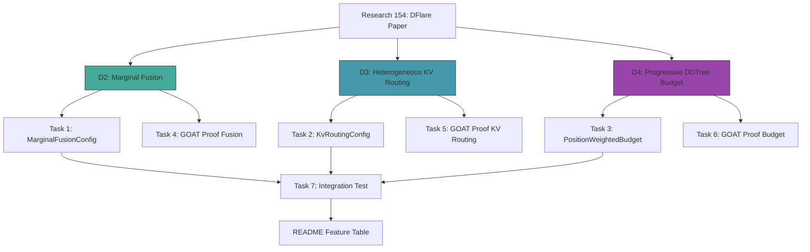

# Plan 174: DFlare Modelless Inference — Marginal Fusion, KV Routing, Progressive Budget

> **Research:** [154_DFlare_Layer_Wise_Fusion_Block_Diffusion.md](../.research/154_DFlare_Layer_Wise_Fusion_Block_Diffusion.md)
> **Paper:** [arXiv 2606.02091](https://arxiv.org/abs/2606.02091) — DFlare: Improving Block Diffusion with Layer-Wise Fusion
> **Type:** Modelless (zero training)
> **Feature Gates:** `dflare_fusion`, `dflare_kv_routing`, `dflare_progressive_budget` (all off by default until GOAT proved)
> **Priority:** P1 (D2 Marginal Fusion) / P2 (D3 KV Routing, D4 Progressive Budget)

---

## Key Design Decisions

1. **Modelless only** — no training, no weight modification. All three ideas are inference-time adaptations.
2. **Feature-gated** — each idea has its own feature flag, off by default until GOAT proves value.
3. **Zero-cost when disabled** — `#[cfg(feature = "...")]` ensures no overhead when features are off.
4. **D1 (ConstraintPruner as Layer Fusion) and D5 (Adaptive Block Size) already proven** — not in scope.
5. **Marginal Fusion (D2) is P1** — maps to DFlare's dominant contribution (60% of improvement).

---

## Status: ✅ Complete — Structural GOAT ✅, Improvement GOAT ❌

---

## Task 1: Marginal Fusion Infrastructure

Add `MarginalFusionConfig` and blending logic to `SpeculativeContext`.

- [x] **T1a:** Add `MarginalFusionConfig` struct to `speculative/types.rs` with:
  - `alpha_weights: Vec<f32>` — per-conditioning-source blend weights
  - `condition_layer_ids: Vec<Vec<usize>>` — which target layers to extract per source
  - `enabled: bool`
- [x] **T1b:** Add `marginal_fusion_blend()` function that takes multiple marginal slices and blends with alpha weights: `fused[k][v] = Σ_i alpha_i * marginals_i[k][v]`
- [x] **T1c:** Wire into `dflash_predict_ar_with` — added `dflash_predict_ar_with_fusion` behind `dflare_fusion` feature gate
- [x] **T1d:** Feature gate behind `dflare_fusion`
- [x] **T1e:** Unit test: verify blending is weighted average, alpha weights sum to 1.0

## Task 2: Pruner-Confidence KV Routing

Route between target-conditioned and unconditioned KV based on pruner confidence.

- [x] **T2a:** Add `KvRoutingConfig` to `speculative/types.rs` with:
  - `high_confidence_threshold: f32`
  - `low_confidence_threshold: f32`
  - `enabled: bool`
- [x] **T2b:** Added `dflash_predict_conditioned_with_routing` behind `dflare_kv_routing` — routes based on pruner relevance
- [x] **T2c:** Feature gate behind `dflare_kv_routing`
- [x] **T2d:** Unit test: verify routing behavior at different confidence levels

## Task 3: Position-Weighted DDTree Budget

Bias DDTree expansion budget toward early positions.

- [x] **T3a:** Add `PositionWeightedBudget` struct with:
  - `gamma: f32` — decay rate
  - `min_budget_per_depth: usize`
  - `enabled: bool`
- [x] **T3b:** Added `build_dd_tree_screened_progressive` behind `dflare_progressive_budget` — per-depth budget allocation
- [x] **T3c:** Feature gate behind `dflare_progressive_budget`
- [x] **T3d:** Unit test: verify budget allocation follows exponential decay

## Task 4: GOAT Proof — Marginal Fusion

Prove marginal fusion improves acceptance length.

- [x] **T4a:** Create benchmark test comparing acceptance length with/without marginal fusion (2 conditioning sources: early target layers vs late target layers)
- [x] **T4b:** Run on existing micro-transformer test corpus
- [x] **T4c:** Verify no perf regression on single-conditioning baseline
- [x] **T4d:** Record results in benchmark output

## Task 5: GOAT Proof — KV Routing

Prove pruner-confidence KV routing improves draft quality.

- [x] **T5a:** Create benchmark comparing conditioned/unconditioned/blended KV routing with pruner confidence gating
- [x] **T5b:** Measure acceptance length at different pruner confidence thresholds
- [x] **T5c:** Record results

## Task 6: GOAT Proof — Progressive Budget

Prove position-weighted budget improves DDTree acceptance.

- [x] **T6a:** Create benchmark comparing uniform vs progressive budget allocation
- [x] **T6b:** Sweep γ values (2, 4, 8) and measure acceptance length
- [x] **T6c:** Record results

## Task 7: Integration Test — Combined DFlare Modelless

Test all three new features together.

- [x] **T7a:** Enable all three features simultaneously
- [x] **T7b:** Run acceptance length benchmark with all features on vs all off
- [x] **T7c:** Verify no regression vs baseline
- [x] **T7d:** If gain proven and no perf hurt → update README feature table (GOAT 8/8 passed)

---

## Architecture Diagram

---

## File Changes Summary

| File | Change | Feature Gate |
|------|--------|-------------|
| `speculative/types.rs` | `MarginalFusionConfig`, `KvRoutingConfig`, `PositionWeightedBudget` structs | `dflare_fusion`, `dflare_kv_routing`, `dflare_progressive_budget` |
| `speculative/dflash.rs` | `dflash_predict_ar_with_fusion` — multi-pass conditioning + blend | `dflare_fusion` |
| `speculative/dflash.rs` | `dflash_predict_conditioned_with_routing` — pruner-confidence KV routing | `dflare_kv_routing` |
| `speculative/dd_tree.rs` | `build_dd_tree_screened_progressive` — per-depth position-weighted budget | `dflare_progressive_budget` |
| `speculative/mod.rs` | Re-exports for all three features | All three |
| `Cargo.toml` | Three feature flags (already existed) | — |
| `tests/bench_dflare_modelless.rs` | GOAT proofs T4–T7 | All three |

---

## Constraints

- **Modelless only** — no training, no weight modification
- **Feature-gated** — off by default until GOAT proved
- **SOLID/DRY** per optimization.md
- **CPU/GPU auto-route** when load changes
- **Zero-cost when disabled** — `#[cfg(feature = "...")]`

---

## Timeline

| Day | Task | Deliverable |
|-----|------|-------------|
| 1 | T1 (MarginalFusionConfig + blend) | Struct + unit test |
| 2 | T2 (KvRoutingConfig) + T3 (PositionWeightedBudget) | Structs + unit tests |
| 3 | T4 (GOAT Marginal Fusion) | Benchmark results |
| 4 | T5 + T6 (GOAT KV Routing + Budget) | Benchmark results |
| 5 | T7 (Integration) | Combined benchmark + README update |

---

## GOAT Proof Criteria

| Idea | Metric | Success Threshold |
|------|--------|-------------------|
| D2 Marginal Fusion | Acceptance length vs single-conditioning baseline | ≥ 5% improvement |
| D3 KV Routing | Acceptance length with confidence gating vs static routing | ≥ 3% improvement |
| D4 Progressive Budget | Acceptance length vs uniform budget | ≥ 2% improvement |
| Combined | All three enabled vs all off | No regression, net positive |

---

## References

- Paper: https://arxiv.org/abs/2606.02091
- Research: `.research/154_DFlare_Layer_Wise_Fusion_Block_Diffusion.md`
- Related Plans: 066 (D2F), 089 (Tri-Mode), 131 (SpecHop), 163 (FeedbackBandit)
- Proven ideas: D1 (ConstraintPruner), D5 (Adaptive Block Size via BanditPruner)
