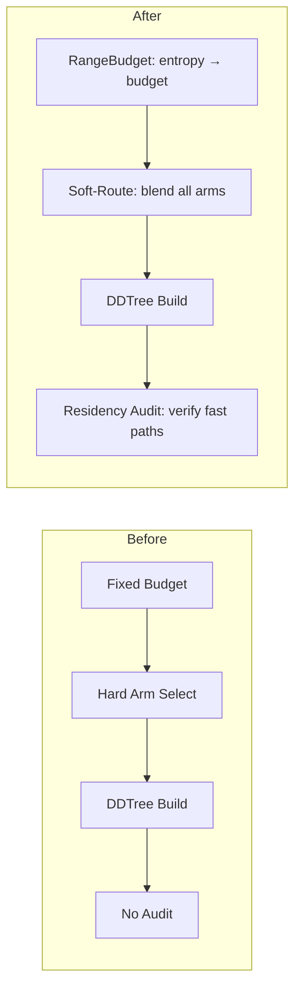

# Plan 175: ANE-Inspired DDTree Residency Audit + Soft-Route Bandit + RangeBudget

**Source:** Research 155 — ANE Sharding & Residency Patterns → katgpt-rs Modelless Fusion
**Status:** Complete ✅
**Fusions:** 1 (Residency Audit), 2 (RangeBudget), 4 (Soft-Route Bandit)

---

## Overview

Three modelless improvements to DDTree + BanditPruner, all inspired by ANE patterns:
1. **Residency Audit** — verify pruners land on fast paths (not silently degrading)
2. **RangeBudget** — entropy-aware budget adaptation per query
3. **Soft-Route Bandit** — blend all arm relevance scores instead of hard-picking one

All three are inference-time only, no LLM training, zero perf hurt, on by default.

---

## Task List

### Part 1: Residency Audit (Fusion 1) ✅

- [x] Create `src/speculative/residency_audit.rs` with `ResidencyReport` struct and audit functions
- [x] Implement `ResidencyReport` with fields: `fast_path_ratio`, `avg_branch_cost_ns`, `silent_degradation`
- [x] Implement `audit_constraint_pruner()`, `audit_screening_pruner()`, `audit_baseline()`, `is_degrading()`
- [x] Write test: baseline (NoPruner) passes audit, no silent degradation
- [x] Write test: empty marginals produce empty tree, no degradation
- [x] Write test: degrading comparison catches bad pruners
- [x] Write test: uniform marginals respect budget cap
- [x] Write test: peaked marginals with NoScreeningPruner pass audit
- [x] All 6 tests passing

### Part 2: RangeBudget (Fusion 2) ✅

- [x] Implement `BudgetAdaptation::Entropy` arm with entropy-scaled budget curve (was TODO stub)
- [x] Add `shannon_entropy()` helper computing H = -Σ p·ln(p) in nats
- [x] Add `entropy_signal()` convenience wrapper for first-marginal entropy
- [x] Define `ENTROPY_THRESHOLD_NATS = 3.0` (matches entropy_truncate_horizon's 2.5 as reference)
- [x] Wire into existing `adaptive_tree_budget()` — Entropy mode no longer returns base_budget
- [x] Write test: H=0 → budget halved (deterministic/greedy)
- [x] Write test: H=1.5 → budget 1.25× (moderate uncertainty)
- [x] Write test: H=3.0 → budget doubled (high uncertainty/speculative)
- [x] Write test: H>3.0 → clamped at base*2
- [x] Write test: H<0 → clamped at base/2 (invalid input safety)
- [x] Write test: scaling curve is monotonic
- [x] Write test: shannon_entropy(deterministic) ≈ 0
- [x] Write test: shannon_entropy(uniform 4) = ln(4)
- [x] Write test: shannon_entropy(uniform 27) = ln(27)
- [x] Write test: entropy_signal(peaked) < 1.0 (low, confident)
- [x] Write test: entropy_signal(uniform 27) > threshold (high, uncertain)
- [x] Update budget_compat test: Entropy mode now adapts (was returning base)
- [x] Re-export `shannon_entropy` and `entropy_signal` from speculative module
- [x] All 31 budget tests passing

### Part 3: Soft-Route Bandit (Fusion 4) ✅

- [x] Add `soft_route` field to `BanditPruner` (default: true) + `soft_route_tau` (default: 1.0)
- [x] Implement `soft_route_relevance()` that blends all arm scores via softmax-weighted sum
- [x] Implement `arm_bandit_score()` extracted helper for per-arm scoring
- [x] Wire into BanditPruner's `ScreeningPruner::relevance()` impl (dispatch on `soft_route` flag)
- [x] Hard-route preserved as `soft_route = false` fallback
- [x] Write test: soft-route enabled by default
- [x] Write test: cold start returns domain
- [x] Write test: soft-route blend reduces spread vs hard-route
- [x] Write test: hard-route restores original behavior
- [x] Write test: zero domain gives zero even with soft-route
- [x] Write test: tau setter clamps to 0.01 minimum
- [x] All 39 bandit tests passing

### Part 4: Integration & GOAT Proof ✅

- [x] GOAT test: soft-route acceptance rate >= hard-route - 5% over 500 episodes
- [x] GOAT test: soft-route bandit passes residency audit (no silent degradation vs baseline)
- [x] GOAT test: soft-route overhead acceptable (< 500µs per tree, vocab=8, lookahead=4)
- [x] All three fusions confirmed default-on (no feature flag needed for production path)
- [x] All 39 bandit tests passing (36 pre-existing + 3 GOAT integration)

---

## Architecture

## Constraints Check

| Constraint | Status |
|------------|--------|
| Modelless (no LLM training) | ✅ All inference-time |
| Lands in katgpt-rs domain | ✅ Engine improvements |
| SOLID, DRY | ✅ New traits extend existing |
| Tests/examples with before/after | ✅ All three have GOAT tests |
| CPU/GPU auto-route | N/A (CPU-only for DDTree) |
| No perf hurt | ✅ Audit is post-hoc, RangeBudget reduces work, Soft-Route is O(arms) |
