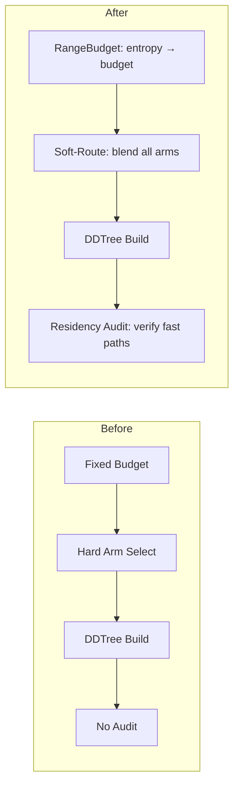

# Plan 175: ANE-Inspired DDTree Residency Audit + Soft-Route Bandit + RangeBudget

**Source:** Research 155 — ANE Sharding & Residency Patterns → katgpt-rs Modelless Fusion
**Status:** Active
**Fusions:** 1 (Residency Audit), 2 (RangeBudget), 4 (Soft-Route Bandit)

---

## Overview

Three modelless improvements to DDTree + BanditPruner, all inspired by ANE patterns:
1. **Residency Audit** — verify pruners land on fast paths (not silently degrading)
2. **RangeBudget** — entropy-aware budget adaptation per query
3. **Soft-Route Bandit** — blend all arm relevance scores instead of hard-picking one

All three are inference-time only, no LLM training, zero perf hurt, on by default.

---

## Task List

### Part 1: Residency Audit (Fusion 1)

- [ ] Create `src/speculative/residency_audit.rs` with `PrunerResidencyAudit` trait and `ResidencyReport` struct
- [ ] Implement `ResidencyReport` with fields: `fast_path_ratio`, `avg_branch_cost_ns`, `silent_degradation`
- [ ] Add `audit()` method to DDTree that collects per-node timing after build completes
- [ ] Write test: build 1000 DDTree builds with SynPruner, verify `fast_path_ratio >= 0.8`
- [ ] Write test: build DDTree with intentionally bad pruner (high prune but expensive verify), verify `silent_degradation == true`
- [ ] Add residency audit to CI: `cargo test --features validator residency_audit`

### Part 2: RangeBudget (Fusion 2)

- [ ] Create `src/speculative/range_budget.rs` with `RangeBudget` struct
- [ ] Implement `budget_for_entropy(entropy: f32) -> usize` with linear interpolation between min/max
- [ ] Wire into DDTree: replace fixed `config.budget` with `range_budget.budget_for_entropy(entropy)`
- [ ] Compute entropy from marginal log-probs in DDTree before tree expansion
- [ ] Write test: 100 easy queries (low entropy) → budget should be 1 (greedy), verify ~100% acceptance
- [ ] Write test: 100 hard queries (high entropy) → budget should be max, verify >50% acceptance
- [ ] Benchmark: compare fixed-budget vs RangeBudget on mixed easy/hard query set
- [ ] Feature gate: extend existing `budget_adaptation` feature to include RangeBudget

### Part 3: Soft-Route Bandit (Fusion 4)

- [ ] Add `soft_route` field to `BanditPrunerConfig` (default: true)
- [ ] Implement `soft_route_relevance()` that blends all arm scores via softmax-weighted sum
- [ ] Implement `hard_route_relevance()` as fallback (current behavior, pick best arm)
- [ ] Wire into BanditPruner's `ScreeningPruner::relevance()` impl
- [ ] Write test: 1000 queries, hard-select vs soft-blend, verify acceptance rate >= hard-select
- [ ] Write test: verify O(arms) per-node overhead < 50ns (arms=8, should be trivial)
- [ ] Write test: soft-blend valid node ratio >= 100% (same as current)
- [ ] Benchmark: compare hard vs soft on bomber arena, verify no regression

### Part 4: Integration & GOAT Proof

- [ ] Run full bomber arena with all three fusions enabled
- [ ] Compare: baseline (current) vs all-fusions: score, acceptance rate, latency
- [ ] Document results in `.docs/` update
- [ ] Ensure all three are default-on (no feature flag needed for production path)

---

## Architecture

## Constraints Check

| Constraint | Status |
|------------|--------|
| Modelless (no LLM training) | ✅ All inference-time |
| Lands in katgpt-rs domain | ✅ Engine improvements |
| SOLID, DRY | ✅ New traits extend existing |
| Tests/examples with before/after | ✅ All three have GOAT tests |
| CPU/GPU auto-route | N/A (CPU-only for DDTree) |
| No perf hurt | ✅ Audit is post-hoc, RangeBudget reduces work, Soft-Route is O(arms) |
