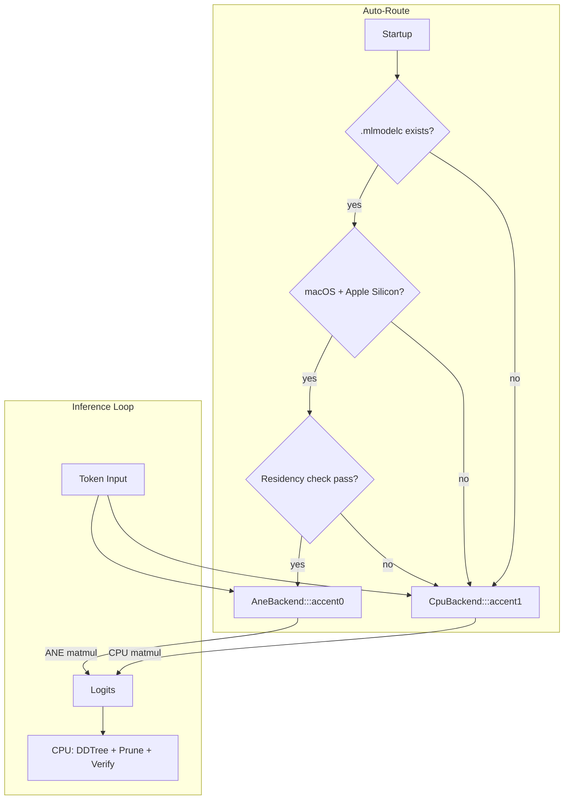

# Plan 176: ANE Inference Backend for katgpt-rs

**Source:** [Research 155 — ANE Compute Backend Verdict](../.research/155_ANE_Compute_Backend_Verdict.md)
**Related:** [Plan 175 — DDTree Residency Audit + RangeBudget + Soft-Route Bandit](175_ane_inspired_ddtree_improvements.md)
**Status:** Active
**Goal:** Use the Apple Neural Engine chip for transformer forward pass, freeing CPU for DDTree + ConstraintPruner

---

## Overview

Add ANE as a third compute backend (alongside CPU and GPU) for transformer inference on Apple Silicon. Uses `coreml-native` crate for safe CoreML access. ANE handles the matmul-heavy forward pass while CPU handles discrete algorithms (DDTree, pruning, speculative verification).

```
Before:  CPU does everything (forward + DDTree + prune + verify)
After:   ANE does forward, CPU does DDTree + prune + verify (16× faster forward)
```

---

## Prerequisites

- macOS 15+ (Sequoia) for MLState (stateful KV cache)
- Apple Silicon (M1/M2/M3/M4/M5)
- Pre-compiled `.mlmodelc` from conversion pipeline (build-time Python step)
- `coreml-native` v0.2 crate

---

## Task List

### Part 1: InferenceBackend Trait + Core Infrastructure

- [ ] Create `src/inference_backend.rs` with `InferenceBackend` trait
- [ ] Define trait: `fn forward(&mut self, tokens, pos) -> Result<Vec<f32>>`, `fn device_name(&str)`, `fn supports_stateful() -> bool`
- [ ] Wrap existing CPU transformer forward in `CpuBackend` impl
- [ ] Refactor main inference loop to use `Box<dyn InferenceBackend>` instead of direct transformer calls
- [ ] Ensure all existing tests pass with `CpuBackend` (no behavior change)
- [ ] Add `inference_backend` module to `lib.rs`

### Part 2: ANE Backend via coreml-native

- [ ] Add `coreml-native = { version = "0.2", optional = true }` to `[target.'cfg(target_os = "macos")'.dependencies]`
- [ ] Add `ane = ["coreml-native"]` feature flag to `Cargo.toml`
- [ ] Create `src/ane_backend.rs` behind `#[cfg(all(target_os = "macos", feature = "ane"))]`
- [ ] Implement `AneBackend` struct with `coreml_native::Model` field
- [ ] Implement `InferenceBackend` for `AneBackend`: load .mlmodelc, predict, extract logits
- [ ] Add FP16 tensor construction from token IDs (match CoreML expected input shape)
- [ ] Add logits extraction from CoreML output (FP16 → f32)

### Part 3: Residency Validation

- [ ] Implement `ane_resident()` check: time a micro-prediction, verify <1ms (ANE) vs >5ms (CPU fallback)
- [ ] Add residency check at `AneBackend::new()` — refuse to create if model falls back to CPU
- [ ] Add `--ane-residency-check` flag to CLI for manual validation
- [ ] Write test: load a known-good .mlmodelc, verify residency passes
- [ ] Write test: intentionally provide CPU-only model, verify residency fails gracefully

### Part 4: Stateful KV Cache (MLState)

- [ ] Use `coreml_native::State` for persistent KV cache across tokens (macOS 15+)
- [ ] Implement stateful prediction: create state once per session, reuse for all tokens
- [ ] Add KV cache reset on new session/conversation
- [ ] Benchmark: stateful vs stateless prediction (stateful should be ~2× faster for decode)
- [ ] Write test: generate 50 tokens with stateful KV, verify coherent output

### Part 5: Auto-Route Selection

- [ ] Implement `auto_backend()` function: try ANE first, fall back to CPU
- [ ] Logic: if macOS + .mlmodelc exists + residency passes → `AneBackend`, else `CpuBackend`
- [ ] Wire into main.rs: `let backend = auto_backend(&weights);`
- [ ] Add `--backend cpu|ane|auto` CLI flag for manual override
- [ ] Log which backend was selected at startup

### Part 6: Conversion Pipeline (Build-Time)

- [ ] Create `scripts/convert_to_coreml.py` based on ane-book's converter pattern
- [ ] Support: GGUF → PyTorch → CoreML with Conv2d(1×1) trick
- [ ] Support: INT8 per-tensor quantization (production baseline from ane-book)
- [ ] Support: shard splitting if model > 250MB compiled (ane-book's pattern)
- [ ] Output: `model.mlmodelc` directory in project root or configurable path
- [ ] Document conversion steps in README.md

### Part 7: Integration Tests + Benchmarks

- [ ] Write test: same prompt, `CpuBackend` vs `AneBackend`, verify identical top-5 tokens
- [ ] Write test: cosine similarity ≥ 0.97 between CPU and ANE logits (ane-book quality gate)
- [ ] Benchmark: single-token decode latency, CPU vs ANE
- [ ] Benchmark: full generation (50 tokens), CPU vs ANE
- [ ] Benchmark: DDTree + speculative decode with ANE backend vs CPU backend
- [ ] Verify ANE frees CPU for DDTree: measure DDTree tree depth achievable with ANE backend
- [ ] Run existing bomber arena with ANE backend, verify no regression

### Part 8: Feature Gate + Default

- [ ] Ensure `ane` feature flag compiles on non-macOS (no-op, uses CPU)
- [ ] Ensure `ane` feature flag compiles on macOS without coreml-native installed (graceful fallback)
- [ ] Document: ANE backend is on-by-default when .mlmodelc present on macOS
- [ ] Update README.md with ANE backend section, supported models, conversion instructions

---

## Architecture



## Expected Benchmarks

| Benchmark | CPU-only | ANE backend | Target |
|-----------|----------|-------------|--------|
| Forward pass (microGPT, 1 token) | ~200µs | ~50µs | 4× faster |
| Generation (50 tokens) | ~10ms | ~2.5ms | 4× faster |
| DDTree depth (budget=64) | Shared CPU | Dedicated CPU | More depth possible |
| Power draw | CPU ~30W | ANE ~5W | 6× less |

## Constraints Check

| Constraint | Status |
|------------|--------|
| Modelless (no LLM training) | ✅ Inference-time only |
| Lands in katgpt-rs domain | ✅ Engine plumbing |
| LoRA only for training | ✅ N/A (no training) |
| SOLID, DRY | ✅ InferenceBackend trait, existing code unchanged |
| Tests/examples with before/after | ✅ Same query, CPU vs ANE |
| CPU/GPU/ANE auto-route | ✅ This IS the auto-route |
| No perf hurt | ✅ CPU path unchanged, ANE is opt-in |

## Key Crate Dependencies

```toml
[target.'cfg(target_os = "macos")'.dependencies]
coreml-native = { version = "0.2", optional = true }

[features]
ane = ["coreml-native"]
default = []  # ANE is opt-in for now, auto-detected at runtime
```

## Risks

| Risk | Mitigation |
|------|-----------|
| CoreML refuses ANE placement | Residency validation catches this, fall back to CPU |
| Private API instability (if using rane) | Stick with coreml-native (public CoreML API) |
| .mlmodelc not available | Auto-route falls back to CPU silently |
| macOS version too old for MLState | Graceful degradation to stateless prediction |
| Conversion pipeline complexity | Ship pre-compiled .mlmodelc for reference models |
