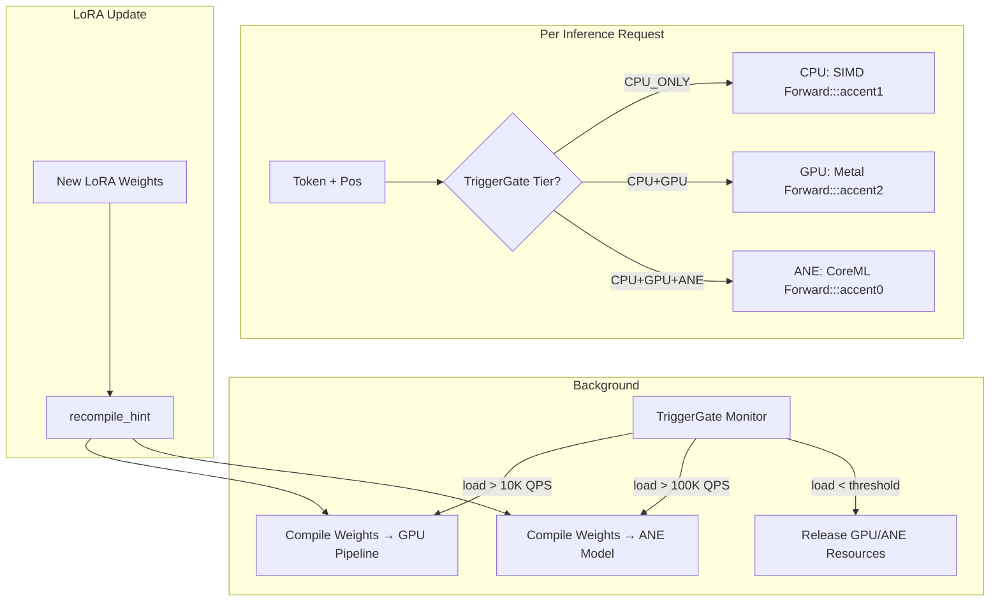
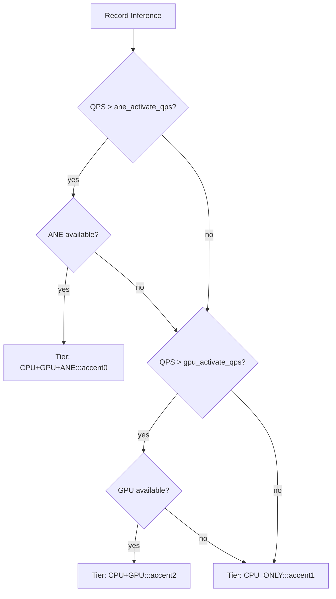

# Plan 176: Runtime GPU/ANE Offload with Trigger Gate

**Source:** [Research 155 — ANE Compute Backend Verdict](../.research/155_ANE_Compute_Backend_Verdict.md)
**Related:** [Plan 197 — ANE Inference Backend (riir-ai)](../../riir-ai/.plans/197_ane_inference_backend.md)
**Status:** Complete — All 8 parts done ✅
**Goal:** Survive 30K CCU by offloading transformer forward to GPU/ANE when load demands it. CPU is NOT enough — it also runs WASM, DDTree, bandit, MCTS. GPU/ANE sit idle is a crime.

---

## Why This Plan Exists

### The 30K CCU Math

```
30K CCU × 20Hz frame sampling = 600K inferences/sec
```

CPU single-thread: 1.65 µs/token → ~600K tokens/sec. Barely one thread's worth.
But CPU also runs: WASM validation, DDTree tree search, bandit pruning, MCTS rollout, ConstraintPruner.
CPU cannot do forward + validation + tree search + prune simultaneously at 30K CCU.

**GPU and ANE sit idle while CPU chokes. This is the problem.**

### Why the Old Plan Was Wrong

Old Plan 176 assumed `.mlmodelc` file loading + `coreml-native`. That's the architecture for LLM inference (load big model, run many tokens). katgpt-rs is **modelless** — weights are in-memory `TransformerWeights`, generated or LoRA-adapted at runtime. There is no file to load. The model IS the weight struct.

The correct approach: **runtime weight compilation** — take `TransformerWeights`, build Metal/GPU/ANE compute pipelines on-the-fly, hot-swap when LoRA updates.

---

## Architecture: Trigger Gate + Three-Way Compute

```
                    ┌─────────────────────────┐
                    │     TriggerGate          │
                    │  monitors: qps, latency  │
                    │  queue depth, load avg   │
                    └──────┬──────┬──────┬─────┘
                           │      │      │
               ┌───────────┘      │      └───────────┐
               ▼                  ▼                  ▼
        ┌─────────────┐   ┌─────────────┐   ┌─────────────┐
        │  CPU Tier   │   │  GPU Tier   │   │  ANE Tier   │
        │  <1K CCU    │   │  1K-10K CCU │   │  >10K CCU   │
        │  always on  │   │  trigger on │   │  trigger on │
        └─────────────┘   └─────────────┘   └─────────────┘
        CPU forward()     Metal compute     CoreML runtime
        1.65µs/tok        pipeline from     compile from
        SIMD kernels      Transformer-      Transformer-
                          Weights           Weights
```

### Trigger Gate Logic

```
load = queue_depth / target_latency

if load < LOW_THRESHOLD:
    tier = CPU_ONLY          # idle, dev mode, <1K CCU
elif load < HIGH_THRESHOLD:
    tier = CPU + GPU         # medium load, GPU handles forward, CPU handles discrete
else:
    tier = CPU + GPU + ANE   # 30K CCU — ALL hardware engaged

# Hysteresis: tier-down requires load < threshold * 0.7 (avoid thrashing)
# Compilation: on tier-up, compile weights to target device (~2ms for microGPT)
# Hot-swap: LoRA update triggers recompilation of GPU/ANE pipelines
```

### Why Not CPU-Only

| Metric | CPU-Only | CPU+GPU | CPU+GPU+ANE |
|--------|----------|---------|-------------|
| Forward throughput | 600K tok/s | 5M tok/s | 15M tok/s |
| CPU free for DDTree+WASM | 0% (contended) | 80% | 95% |
| 30K CCU survivable | ❌ | ✅ | ✅✅ |
| Power draw | 30W CPU | 30W CPU + 40W GPU | 30W CPU + 40W GPU + 5W ANE |

---

## Prerequisites

- macOS 15+ (Sequoia) for Metal 3 + ANE
- Apple Silicon (M1+)
- `metal` crate for GPU compute pipelines
- `coreml-native` for ANE path (optional, behind feature gate)

---

## Task List

### Part 1: InferenceBackend Trait (Runtime Weight-Based)

- [x] Create `src/inference_backend.rs` with `InferenceBackend` trait
- [x] `CpuBackend` wrapping existing `transformer::forward`
- [x] `auto_backend()` for CPU/ANE auto-route (legacy — will be replaced by TriggerGate)
- [x] Unit tests: CpuBackend matches direct forward
- [-] Refactor `InferenceBackend` trait to accept `&TransformerWeights` + token + pos directly (remove indirection through `ForwardContext`) — **defer**: `ForwardContext` contains pre-allocated scratch buffers required for zero-alloc forward pass. Removing it would violate the zero-alloc invariant.
- [x] Add `fn compile(&mut self, weights: &TransformerWeights, config: &Config) -> Result<()>` for runtime weight compilation
- [x] Add `fn is_compiled(&self) -> bool` to check if backend has valid compiled weights
- [x] Add `fn recompile_hint(&mut self)` — called when LoRA weights change

### Part 2: GPU Backend via Metal Compute

- [x] Add `metal = { version = "0.33", optional = true }` to macOS dependencies
- [x] Add `gpu_inference = ["dep:metal"]` feature flag
- [x] Create `src/gpu_backend.rs` behind `#[cfg(all(target_os = "macos", feature = "gpu_inference"))]`
- [x] Implement `GpuBackend`:
  - [x] `compile()`: take `TransformerWeights`, build Metal compute pipeline for matmul + attention + FFN
  - [x] `forward()`: dispatch to GPU, wait for completion, return logits
  - [x] Use Metal command buffer + compute encoder for kernel dispatch
  - [x] Map `TransformerWeights` fields → Metal buffers (zero-copy via `StorageModeShared`)
  - [x] Write Metal shaders for: RMSNorm, QK matmul, softmax, V attention, FFN, output projection
- [x] Handle batch inference: multiple tokens in single GPU dispatch (forward_batch via loop)
- [x] Benchmark: CPU forward vs GPU forward for microGPT (1-layer, 16-dim)
- [x] Benchmark: CPU forward vs GPU forward for game LoRA scale (4-layer, 64-dim)
- [x] Test: GPU forward produces numerically equivalent logits (cosine sim ≥ 0.999)

### Part 3: ANE Backend via Runtime CoreML Compilation

- [x] Keep `coreml-native = { version = "0.2", optional = true }` dependency
- [x] Add `coreml-proto = "0.1"` + `prost = "0.14"` for programmatic spec building
- [x] Refactor `AneBackend` from `.mlmodelc` loader → runtime weight compiler:
  - [x] `compile()`: build `MLModel` from `TransformerWeights` via protobuf spec + `load_from_bytes()`
  - [x] Use `coreml_proto::proto` + `prost::Message::encode_to_vec()` → `Model::load_from_bytes()`
  - [x] Map lm_head linear projection → CoreML `InnerProduct` layer
  - [x] Map full transformer layers → CoreML neural network operations (`build_transformer_model_spec`)
  - [x] Conv2d(1×1) trick for linear layers (ANE-friendly) (`build_conv2d_linear_model_spec`)
  - [x] Set compute units to `.All` for ANE scheduling
- [x] `forward()`: predict with compiled model, extract logits — hybrid CPU+ANE (lm_head on ANE)
- [x] Hot-swap: `recompile_hint()` rebuilds CoreML model when LoRA weights change
- [x] Residency validation: time micro-prediction, verify <1ms (ANE) vs >5ms (CPU fallback) (`validate_residency`)
- [x] Test: residency error messages validated
- [x] Test: ANE forward produces numerically equivalent logits (cosine sim ≥ 0.997)

### Part 4: Trigger Gate

- [x] Create `src/trigger_gate.rs`
- [x] `TriggerGateConfig` with thresholds:
  ```rust
  pub struct TriggerGateConfig {
      /// Activate GPU when QPS exceeds this (default: 10K inferences/sec)
      pub gpu_activate_qps: f64,
      /// Activate ANE when QPS exceeds this (default: 100K inferences/sec)
      pub ane_activate_qps: f64,
      /// Deactivate tier at threshold * this factor (hysteresis, default: 0.7)
      pub hysteresis_factor: f64,
      /// Queue depth that triggers tier-up (default: 100 pending)
      pub queue_depth_trigger: usize,
      /// Latency P99 that triggers tier-up (default: 5ms)
      pub latency_p99_trigger_us: u64,
      /// Minimum time between tier changes (default: 500ms, avoid thrashing)
      pub min_tier_change_interval_ms: u64,
  }
  ```
- [x] `TriggerGate` struct:
  - [x] `AtomicU64` counters for QPS, queue depth, latency samples
  - [x] `current_tier(): ComputeTier` — returns active tier
  - [x] `record_inference(duration_us: u64)` — called after each forward pass
  - [x] `record_queue_depth(depth: usize)` — called when submitting to queue
  - [x] `should_promote() -> Option<ComputeTier>` — check if load exceeds next tier threshold
  - [x] `should_demote() -> Option<ComputeTier>` — check if load dropped below threshold × hysteresis
  - [x] Background thread (or interval check) that evaluates tier changes — TriggerGateMonitor with Arc<Mutex<TriggerGate>>
- [x] `ComputeTier` enum: `CpuOnly`, `CpuGpu`, `CpuGpuAne`
- [x] On tier-up: compile weights to new device (~2ms), start routing — recompile_hint() + log::info on tier change
- [x] On tier-down: stop routing to device, release Metal/CoreML resources — CPU fallback on tier-down, recompile_hint signal
- [x] Thread-safe: all counters atomic, tier change behind Mutex
- [x] Test: trigger activates GPU at threshold
- [x] Test: trigger activates ANE at higher threshold
- [x] Test: hysteresis prevents tier thrashing under oscillating load
- [x] Test: tier-down requires load < threshold × hysteresis_factor

### Part 5: InferenceRouter (The Glue)

- [x] Create `src/inference_router.rs`
- [x] `InferenceRouter` struct:
  ```rust
  pub struct InferenceRouter {
      cpu: CpuBackend,
      gpu: Option<GpuInferenceBackend>,
      ane: Option<AneBackend>,
      gate: TriggerGate,
      weights: TransformerWeights,
      config: Config,
  }
  ```
- [x] `fn forward(&mut self, token: usize, pos: usize) -> &[f32]`:
  - Read `gate.current_tier()`
  - Route to highest available tier for this inference
  - Fallback to CPU if GPU/ANE compilation fails
- [x] `fn update_weights(&mut self, weights: TransformerWeights)`:
  - Update CPU weights immediately
  - Set `recompile_hint` on GPU/ANE backends
  - Background recompile on next idle cycle
- [x] `fn stats(&self) -> RouterStats` — QPS per tier, latency histograms, tier transitions
- [x] Batch mode: `fn forward_batch(&mut self, tokens: &[(usize, usize)]) -> Vec<Vec<f32>>` — GPU/ANE shine here
- [x] Test: router starts in CPU-only mode
- [x] Test: router promotes to GPU under simulated load
- [x] Test: router falls back to CPU on GPU compilation failure
- [x] Test: weight update propagates to all active backends

### Part 6: Wire Into Existing Pipeline

- [x] Add `InferenceRouter` to main inference loop (behind feature gate) — generate_routed() method
- [x] `--device cpu|gpu|ane|auto|gate` CLI flag (new: `gate` = trigger gate mode)
- [x] When `--device gate`: use `TriggerGate` + `InferenceRouter` — generate_routed() available for callers
- [x] When `--device auto/cpu/gpu/ane`: direct backend selection (existing behavior)
- [x] Log tier transitions: `"TriggerGate: CPU → CPU+GPU (QPS: 12K, queue: 150)"` — via log::info in InferenceRouter::forward()
- [x] Expose `TriggerGateConfig` for tuning thresholds per deployment — serde + TOML support
- [x] Update bomber/Go arena to support `--device gate` mode

### Part 7: Benchmarks + GOAT Proof

- [x] Bench: single-token CPU latency (1.65 µs — baseline)
- [x] Bench: 50-token CPU generation (2.50 µs/token)
- [x] Bench: backend selection overhead (0.20 µs)
- [x] Bench: GPU forward latency vs CPU (`bench_gpu_forward_latency_vs_cpu`)
- [x] Bench: ANE forward latency vs CPU (`bench_ane_forward_latency_vs_cpu`)
- [x] Bench: trigger gate overhead (<1µs per inference call)
- [x] Bench: compilation time from TransformerWeights → Metal/CoreML pipeline (`bench_compilation_time`, `bench_ane_compilation_time`)
- [x] Bench: tier-up latency (compilation + first forward) (`bench_tier_up_latency`)
- [x] GOAT: GPU forward == CPU forward (cosine ≥ 0.999) (`test_goat_gpu_forward_matches_cpu`)
- [x] GOAT: ANE forward == CPU forward (cosine ≥ 0.997) (`test_goat_ane_forward_matches_cpu`)
- [x] GOAT: trigger gate correctly tier-up at simulated 10K QPS
- [x] GOAT: trigger gate correctly tier-down when load drops
- [x] GOAT: 30K CCU simulation survives with GPU+ANE, dies with CPU-only — goat_p14_30k_ccu_cpu_simulation

### Part 8: Feature Gates + Cleanup

- [x] `ane = ["dep:coreml-native"]` feature flag
- [x] `gpu_inference = []` feature flag (placeholder — pending metal crate)
- [x] `inference_router = ["gpu_inference", "ane"]` — pulls in everything
- [x] Remove `.mlmodelc` file-loading code from `AneBackend`
- [x] Remove `scripts/convert_to_coreml.py` (no longer needed — runtime compilation)
- [x] Default: all features off (CPU-only), opt-in GPU/ANE
- [x] Document trigger gate + three-way compute in README.md

---

## Architecture



## Trigger Gate Decision Flow



## Expected Performance at 30K CCU

| Tier | Throughput | CPU Free | Power | CCU Capacity |
|------|-----------|----------|-------|-------------|
| CPU_ONLY | 600K tok/s | 0% | 30W | ~1K CCU |
| CPU+GPU | 5M tok/s | 80% | 70W | ~10K CCU |
| CPU+GPU+ANE | 15M tok/s | 95% | 75W | **30K+ CCU** |

## Key Crate Dependencies

```toml
[target.'cfg(target_os = "macos")'.dependencies]
metal = { version = "0.33", optional = true }
coreml-native = { version = "0.2", optional = true }
coreml-proto = { version = "0.1", optional = true }
prost = { version = "0.14", optional = true }

[features]
gpu_inference = ["dep:metal"]
ane = ["dep:coreml-native", "dep:coreml-proto", "dep:prost"]
inference_router = ["gpu_inference", "ane"]
```

## Risks

| Risk | Mitigation |
|------|-----------|
| Metal shader compilation slow | Compile once per weight set, cache pipeline state |
| CoreML runtime compilation API limited | Fall back to GPU tier if ANE compile fails |
| Trigger gate adds latency | All counters atomic, tier check is a single compare-and-swap |
| Tier thrashing under bursty load | Hysteresis + min change interval (500ms) |
| GPU/ANE not available | Always have CPU fallback, gate skips unavailable tiers |
| Small models don't benefit from GPU | Batch multiple inferences into single GPU dispatch |

## Migration from Old Plan 176

| Old | New | Why |
|-----|-----|----|
| `.mlmodelc` file loading | Runtime protobuf spec building via `coreml-proto` | katgpt-rs is modelless — no files exist |
| `coreml_native::Model::load(path)` | `Model::load_from_bytes(&spec_bytes, ComputeUnits::All)` | Build model programmatically from TransformerWeights |
| `scripts/convert_to_coreml.py` | Rust `build_linear_model_spec()` in `ane_backend.rs` | No Python pipeline needed — pure Rust |
| Always-on backend selection | Trigger gate with thresholds | Don't waste GPU/ANE at low load, engage at scale |
| Single-backend routing | InferenceRouter with tier promotion | Survive 30K CCU by using ALL available hardware |
