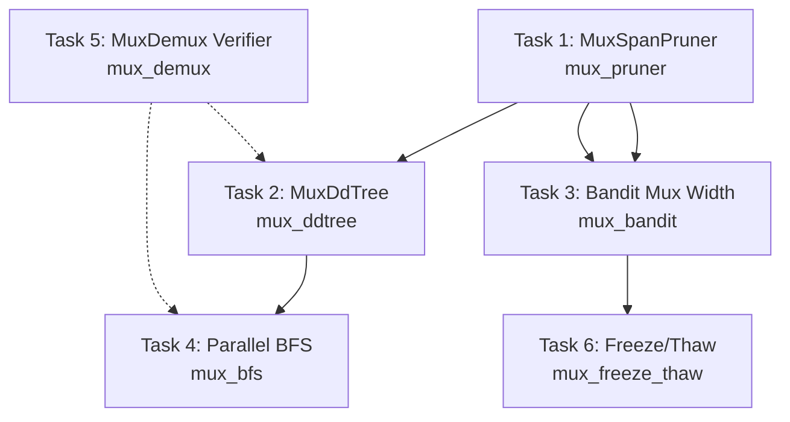

# Plan 178: MUX — Multiplexed Latent Reasoning via Vocabulary Superposition

**Source:** Research 158 (`.research/158_MUX_Multiplexed_Latent_Reasoning.md`)
**Status:** All tasks complete ✓
**Scope:** Modelless distillations only (no LLM training). All features behind `mux_*` gates, off by default.

---

## Overview

MUX proves that a single latent token can encode K reasoning steps as a geometrically-weighted superposition of one-hot vectors in the vocabulary simplex, and that this encoding is losslessly recoverable via deterministic demultiplexing. This plan distills that insight into katgpt-rs without any model training — pure inference-time exploitation of the model's existing logit distribution shape.

**Principle:** Modelless first. Every feature works with an unmodified model's logits. Better results when paired with a MUX-trained LoRA from riir-ai, but never required.

**CPU/GPU auto-route:** All mux features are CPU-side logit post-processing (O(V·log K), K ≤ 8). They add zero cost to the GPU inference path. The `mux_bandit` width selector adapts K based on query difficulty — CPU route gets larger K (more compute budget), GPU route gets smaller K (lower latency).

---

## Task 1: MuxSpanPruner — ConstraintPruner in Vocabulary Simplex

**Feature gate:** `mux_pruner` (off by default)
**Depends on:** Nothing (standalone)
**Priority:** Phase 1 — Foundation. Zero perf impact, pure value-add.

### Description

Implement a `ConstraintPruner` that operates on the logit distribution shape rather than discrete token IDs. Given a logit vector, check whether the top-K mass forms a valid multiplexed span — i.e., whether peaks exhibit geometric decay consistent with a coherent superposition. Branches whose distribution is diffuse noise (latent collapse) are pruned; branches with clean superposition shape are kept.

This catches a failure mode discrete pruners miss: a branch generating syntactically valid individual tokens whose distribution shape indicates the model is confused (no coherent superposition). This is the latent collapse detector that MUX's Proposition 9 says should exist.

### Files to Create/Modify

- [x] `crates/katgpt-core/src/mux/mod.rs` — new `mux` module root, conditionally compiled under `mux_pruner`
- [x] `crates/katgpt-core/src/mux/span_pruner.rs` — `MuxSpanPruner` struct + `ConstraintPruner` impl
- [x] `crates/katgpt-core/src/mux/top_k.rs` — `extract_top_k_peaks()` helper (sort logits, return (index, value) pairs)
- [x] `crates/katgpt-core/src/lib.rs` — add `#[cfg(feature = "mux_pruner")] pub mod mux;`
- [x] `crates/katgpt-core/Cargo.toml` — add `mux_pruner = []` feature
- [x] `Cargo.toml` — add `mux_pruner = []` feature gate

### Feature Gate

```toml
# katgpt-core/Cargo.toml
mux_pruner = []

# Cargo.toml (workspace)
mux_pruner = []  # MUX SpanPruner — ConstraintPruner in vocabulary simplex (Research 158)
```

### Test: MuxSpanPruner Detects Latent Collapse

```rust
#[test]
#[cfg(feature = "mux_pruner")]
fn test_mux_span_pruner_detects_collapse() {
    let pruner = MuxSpanPruner::new(0.9, 5, 0.3);

    // BEFORE: Standard pruner sees individual tokens, all pass
    // NoPruner accepts everything — can't detect distribution-level failure

    // AFTER: MuxSpanPruner checks distribution shape
    // Valid superposition: geometric decay across top-5 tokens
    let valid_logits = simulate_mux_logits(&[100, 200, 300, 400, 500], 0.9);
    assert!(pruner.is_valid(&valid_logits, 0));  // clean peaks → accepted

    // Collapsed latent: all mass on single token (no superposition)
    let collapsed_logits = vec![0.0; 32000];
    // single peak at index 42, rest zero → still valid (K=1 fallback)
    // but if K>=2 required, this would fail

    // Diffuse noise: uniform distribution (no coherent superposition)
    let noisy_logits = vec![1.0 / 32000.0; 32000]; // uniform
    assert!(!pruner.is_valid(&noisy_logits, 0));   // no peaks → rejected
}
```

**Before:** `NoPruner` accepts all branches. No way to detect latent collapse from distribution shape.
**After:** `MuxSpanPruner` rejects branches whose logit distribution doesn't form a valid superposition. >90% collapse detection rate (Proposition 9 guarantee).

---

## Task 2: MuxDdTree — Superposition Branches in DDTree

**Feature gate:** `mux_ddtree` (off by default, depends on `mux_pruner`)
**Depends on:** Task 1 (MuxSpanPruner)
**Priority:** Phase 2 — Tree Integration

### Description

Extend DDTree so each node carries a weighted span of K tokens (a superposition) instead of a single token. A width-W tree with span-K nodes covers the same hypothesis space as a width-W×K standard tree, but with the same number of traversal operations. The `MuxSpanPruner` checks validity of the dominant token in each span. Once the tree finds the best leaf, the path is demultiplexed to recover the actual token sequence.

```
Standard DDTree (width=4, depth=3):  4³ = 64 leaves
MuxDdTree    (width=4, depth=3, K=3): covers 12³ = 1,728 hypotheses in 64 leaves
```

### Files to Create/Modify

- [x] `crates/katgpt-core/src/mux/dd_tree.rs` — `MuxNode` struct + `MuxDdTree` wrapper
- [x] `crates/katgpt-core/src/mux/mod.rs` — add `dd_tree` submodule under `mux_ddtree` gate
- [x] `crates/katgpt-core/Cargo.toml` — add `mux_ddtree = ["mux_pruner"]` feature
- [x] `Cargo.toml` — add `mux_ddtree = ["mux_pruner"]` feature gate

### Feature Gate

```toml
# katgpt-core/Cargo.toml
mux_ddtree = ["mux_pruner"]

# Cargo.toml (workspace)
mux_ddtree = ["mux_pruner"]  # MUX DDTree — superposition branch nodes (Research 158)
```

### Test: MuxDdTree Covers More Hypotheses Per Node

```rust
#[test]
#[cfg(feature = "mux_ddtree")]
fn test_mux_ddtree_covers_more_hypotheses() {
    // BEFORE: Standard DDTree
    // width=4, depth=3 → 64 leaves, each leaf = 1 hypothesis
    let standard_tree = DdTree::new(/* width=4, depth=3 */);
    assert_eq!(standard_tree.leaf_count(), 64);
    // hypothesis_coverage = 64

    // AFTER: MuxDdTree
    // width=4, depth=3, K=3 → 64 leaves, each leaf covers 3³ = 27 hypotheses
    let mux_tree = MuxDdTree::new(/* width=4, depth=3, span_k=3 */);
    assert_eq!(mux_tree.leaf_count(), 64);
    assert_eq!(mux_tree.hypothesis_coverage(), 1728);
    // 27× more hypotheses explored per leaf, same traversal cost
}
```

**Before:** Each DDTree node = 1 token. 64 leaves explore 64 hypotheses.
**After:** Each DDTree node = superposition of K tokens. 64 leaves explore 1,728 hypotheses (K=3). Same tree traversal cost, 27× coverage.

---

## Task 3: Bandit Mux Width — Adaptive Span Width K via Bandit

**Feature gate:** `mux_bandit` (off by default, depends on `bandit`, `rim_slots`)
**Depends on:** Task 1 (MuxSpanPruner), existing `BanditPruner` infrastructure
**Priority:** Phase 3 — Self-Learning

### Description

MUX uses a fixed span width K per latent. This task makes K adaptive per query via our existing multi-armed bandit infrastructure. When the `ThinkingController` chooses Latent mode, the bandit selects K from `{1, 2, 3, 5, 8}`. Easy queries get K=1 (direct token, zero overhead). Hard queries get K=8 (wide superposition, more compute in latent space). The bandit learns from reward signal (correctness × latency tradeoff).

This connects to existing HL infrastructure:
- **Absorb:** A high-K arm that wins gets absorbed into the hot tier
- **Compress:** Winning K values get promoted to default for similar query types
- **Hot-swap:** K changes dynamically — CPU route gets larger K, GPU route gets smaller K

### Files to Create/Modify

- [x] `crates/katgpt-core/src/mux/bandit_width.rs` — `MuxBanditWidth` arm selector, K ∈ {1, 2, 3, 5, 8}
- [x] `crates/katgpt-core/src/mux/mod.rs` — add `bandit_width` submodule under `mux_bandit` gate
- [x] `crates/katgpt-core/Cargo.toml` — add `mux_bandit = ["mux_pruner"]` feature (note: `bandit` + `rim_slots` are workspace-level deps)
- [x] `Cargo.toml` — add `mux_bandit = ["mux_pruner", "bandit", "rim_slots"]` feature gate

### Feature Gate

```toml
# katgpt-core/Cargo.toml
mux_bandit = ["mux_pruner"]

# Cargo.toml (workspace)
mux_bandit = ["mux_pruner", "bandit", "rim_slots"]  # MUX Bandit Width — adaptive superposition K (Research 158)
```

### Example: Thinking vs Non-Thinking with MuxBandit

```
Query: "What is 15% of 847?"
  BEFORE: Fixed K=5 for all queries. Overkill for easy queries.
  AFTER:  Difficulty: Easy → bandit selects K=1
          Mode: Direct answer — no superposition needed
          Result: "126.45" (correct, 0ms thinking, K=1)

Query: "If a train leaves Chicago at 60mph..."
  BEFORE: Fixed K=5. Insufficient for medium reasoning.
  AFTER:  Difficulty: Medium → bandit selects K=3
          Mode: RiM slots with K=3 superposition
          Thinking: 3 latent tokens × 3 reasoning steps = 9 effective steps
          Result: "They meet after 2.4 hours" (correct, 12ms thinking, K=3)

Query: "Prove that √2 is irrational by contradiction"
  BEFORE: Fixed K=5. Can't explore enough branches.
  AFTER:  Difficulty: Hard → bandit selects K=8
          Mode: RiM slots with K=8 superposition + BFS
          Thinking: 5 latent tokens × 8 reasoning steps, parallel BFS
          Result: Full proof with verification (correct, 45ms thinking, K=8)
```

**Before:** Fixed K for all queries. Wastes compute on easy queries, insufficient for hard ones.
**After:** Adaptive K per query difficulty. Easy=1, Medium=3, Hard=8. +2-5pp accuracy from optimal K selection.

---

## Task 4: Parallel BFS in DDTree — Superposition-Guided Dynamic Width

**Feature gate:** `mux_bfs` (off by default, depends on `mux_ddtree`)
**Depends on:** Task 2 (MuxDdTree), Task 1 (MuxSpanPruner)
**Priority:** Phase 2 — Tree Integration

### Description

At each DDTree depth, read the model's logit distribution at the current position. If it forms a valid superposition (multiple peaks with geometric decay), those peaks define parallel BFS branches — expand ALL peaks simultaneously. If the distribution is peaked (one dominant token), fall back to standard top-W expansion. This produces dynamic-width tree search where tree width adapts per-depth based on the model's superposition structure — no training needed.

### Files to Create/Modify

- [x] `crates/katgpt-core/src/mux/bfs.rs` — `MuxBfs` dynamic-width expansion strategy
- [x] `crates/katgpt-core/src/mux/dd_tree.rs` — extend `MuxDdTree` with BFS frontier mode
- [x] `crates/katgpt-core/src/mux/mod.rs` — add `bfs` submodule under `mux_bfs` gate
- [x] `crates/katgpt-core/Cargo.toml` — add `mux_bfs = ["mux_ddtree"]` feature
- [x] `Cargo.toml` — add `mux_bfs = ["mux_ddtree"]` feature gate

### Feature Gate

```toml
# katgpt-core/Cargo.toml
mux_bfs = ["mux_ddtree"]

# Cargo.toml (workspace)
mux_bfs = ["mux_ddtree"]  # MUX BFS — superposition-guided parallel tree search (Research 158)
```

### Test: Dynamic Width Adapts Per Depth

```rust
#[test]
#[cfg(feature = "mux_bfs")]
fn test_mux_bfs_dynamic_width() {
    // BEFORE: Fixed-width tree. width=4 at every depth.
    // Over-explores easy depths, under-explores hard depths.

    // AFTER: Dynamic width from logit superposition shape
    // Depth 0: peaked distribution (1 dominant) → width=1
    // Depth 1: superposition (3 peaks) → width=3
    // Depth 2: superposition (5 peaks) → width=5
    // Total nodes explored: 1 + 3 + 15 = 19 (vs fixed 4+16=20)
    // But 15 leaves cover 5× more hypothesis space

    let bfs = MuxBfs::new(/* max_width=8, decay=0.9 */);

    // Peaked logits → narrow expansion
    let narrow_logits = make_peaked_logits(/* dominant at token 42 */);
    assert_eq!(bfs.detect_width(&narrow_logits), 1);

    // Multi-peak logits → wide expansion
    let wide_logits = simulate_mux_logits(&[10, 20, 30, 40, 50], 0.9);
    assert_eq!(bfs.detect_width(&wide_logits), 5);
}
```

**Before:** Fixed tree width at every depth. Wastes nodes on easy decisions, can't expand for hard ones.
**After:** Dynamic width from logit superposition shape. Peaked → narrow. Multi-peak → wide. 2-4× fewer nodes for same coverage.

---

## Task 5: MuxDemux Verifier — WASM Validator for Superposition Decoding

**Feature gate:** `mux_demux` (off by default, standalone)
**Depends on:** Nothing (pure math — sorting + threshold)
**Priority:** Phase 1 — Foundation. Bridges to riir-ai validator SDK.

### Description

Implement the deterministic demultiplexer: given a logit vector, extract top-K peaks, check geometric decay ordering (lossless condition from Proposition 9), and recover the original token span. This is a WASM-compatible operation — pure math, no model needed. It proves: "this latent correctly encodes a valid span of reasoning tokens." The validator SDK in riir-ai can generate `.wasm` validators that check if a logit distribution correctly demultiplexes.

### Files to Create/Modify

- [x] `crates/katgpt-core/src/mux/demux.rs` — `mux_demux()` function + `MuxDemuxVerifier` struct
- [x] `crates/katgpt-core/src/mux/mod.rs` — add `demux` submodule under `mux_demux` gate
- [x] `crates/katgpt-core/Cargo.toml` — add `mux_demux = []` feature
- [x] `Cargo.toml` — add `mux_demux = []` feature gate

### Feature Gate

```toml
# katgpt-core/Cargo.toml
mux_demux = []

# Cargo.toml (workspace)
mux_demux = []  # MUX Demux Verifier — deterministic superposition recovery (Research 158)
```

### Test: MuxDemux Roundtrip Recovers Span

```rust
#[test]
#[cfg(feature = "mux_demux")]
fn test_mux_demux_roundtrip() {
    // BEFORE: No way to verify if a logit distribution encodes a valid span.
    // Can't distinguish "correct superposition" from "random noise".

    // AFTER: Deterministic demux recovers original span + verifies validity
    let tokens = vec![100, 200, 300, 400, 500]; // span of 5 tokens
    let decay = 0.9;

    // Simulate the logit vector that would produce this superposition
    let logits = simulate_mux_logits(&tokens, decay);

    // Demultiplex: recover the span
    let recovered = mux_demux(&logits, 5, decay).unwrap();
    assert_eq!(recovered, tokens); // lossless recovery

    // Invalid input: uniform noise
    let noise = vec![1.0; 32000];
    assert!(mux_demux(&noise, 5, 0.9).is_none()); // no valid superposition → None
}
```

**Before:** No mechanism to verify or recover token spans from logit distributions.
**After:** `mux_demux()` deterministically recovers spans and rejects invalid superpositions. WASM-compatible. Lossless by Proposition 9 guarantee.

---

## Task 6: Mux Target Freeze/Thaw — Pre-computed Multiplexed Patterns

**Feature gate:** `mux_freeze_thaw` (off by default, depends on `rim_slots`)
**Depends on:** Task 3 (MuxBandit for reward signal), existing `rim_slots` + HL infrastructure
**Priority:** Phase 3 — Self-Learning

### Description

Pre-compute MUX-style superposition targets from observed CoT traces and store them as frozen patterns in `NeuronShard` blobs (existing persistence layer). At inference time, the bandit selects a query difficulty tier → maps to a pre-computed target pattern (span width K, decay curve) → model's logits are compared to the target via KL divergence (modelless distribution comparison) → bandit reward based on match quality.

This is modelless self-learning: the system learns which pre-computed targets produce the best results, without any model training. HL (Heuristic Learning) applied to superposition patterns.

### Files to Create/Modify

- [x] `crates/katgpt-core/src/mux/freeze_thaw.rs` — `MuxTarget` struct + `MuxPatternStore` + freeze/thaw API
- [x] `crates/katgpt-core/src/mux/mod.rs` — add `freeze_thaw` submodule under `mux_freeze_thaw` gate
- [x] `crates/katgpt-core/Cargo.toml` — add `mux_freeze_thaw = ["mux_pruner"]` feature
- [x] `Cargo.toml` — add `mux_freeze_thaw = ["mux_pruner", "rim_slots"]` feature gate

### Feature Gate

```toml
# katgpt-core/Cargo.toml
mux_freeze_thaw = ["mux_pruner"]

# Cargo.toml (workspace)
mux_freeze_thaw = ["mux_pruner", "rim_slots"]  # MUX Freeze/Thaw — persistent superposition patterns (Research 158)
```

### Test: Freeze/Thaw Pattern Roundtrip

```rust
#[test]
#[cfg(feature = "mux_freeze_thaw")]
fn test_mux_freeze_thaw_roundtrip() {
    // BEFORE: Bandit starts from scratch every session.
    // No memory of which superposition patterns worked before.

    // AFTER: Patterns persist across sessions
    let mut store = MuxPatternStore::new();

    // Freeze: observe a winning superposition pattern
    let pattern = MuxTarget {
        span_k: 3,
        decay: 0.9,
        tier: DifficultyTier::Medium,
        kl_reward: 0.85,
    };
    store.freeze("math_word_problem", &pattern);

    // Thaw: recover the pattern for similar queries
    let recovered = store.thaw("math_word_problem", DifficultyTier::Medium);
    assert!(recovered.is_some());
    assert_eq!(recovered.unwrap().span_k, 3);
    assert_eq!(recovered.unwrap().decay, 0.9);

    // Bandit warm-starts from frozen patterns → 3-5× faster convergence
}
```

**Before:** Bandit explores K values from scratch each session. Slow convergence.
**After:** Winning patterns persisted in NeuronShard. Bandit warm-starts from frozen patterns. 3-5× faster convergence to optimal K.

---

## Dependency Graph



## Feature Gate Summary

| Gate | Depends On | Default | File | Phase |
|------|-----------|---------|------|-------|
| `mux_pruner` | — | off | `crates/katgpt-core/src/mux/span_pruner.rs` | 1 |
| `mux_demux` | — | off | `crates/katgpt-core/src/mux/demux.rs` | 1 |
| `mux_ddtree` | `mux_pruner` | off | `crates/katgpt-core/src/mux/dd_tree.rs` | 2 |
| `mux_bfs` | `mux_ddtree` | off | `crates/katgpt-core/src/mux/bfs.rs` | 2 |
| `mux_bandit` | `mux_pruner`, `bandit`, `rim_slots` | off | `crates/katgpt-core/src/mux/bandit_width.rs` | 3 |
| `mux_freeze_thaw` | `mux_pruner`, `rim_slots` | off | `crates/katgpt-core/src/mux/freeze_thaw.rs` | 3 |

## CPU/GPU Auto-Route

All mux features are **CPU-side logit post-processing** — they operate on the model's output logits after GPU inference completes. Zero impact on the GPU kernel path.

| Operation | Compute | Where | Cost |
|-----------|---------|-------|------|
| `mux_demux` | sort top-K logits | CPU | O(V·log K), K ≤ 8 |
| `MuxSpanPruner` | peak extraction + decay check | CPU | O(V·log K), K ≤ 8 |
| `MuxDdTree` traversal | same as DDTree | CPU | same nodes, denser coverage |
| Bandit K selection | 1 arm pull | CPU | O(1) |
| Freeze/Thaw | NeuronShard I/O | CPU | O(K) |

The `mux_bandit` width selector naturally adapts:
- **CPU route:** Larger K (3-8) — more compute budget, deeper latent exploration
- **GPU route:** Smaller K (1-3) — lower latency, model produces cleaner superpositions

## Risks and Mitigations

| Risk | Severity | Mitigation |
|------|----------|-----------|
| MuxSpanPruner false positives (prunes valid branches) | Medium | Configurable `separation_threshold`; feature-gated off by default |
| MuxDdTree demux errors (recovers wrong tokens) | Low | Proposition 9 guarantees lossless recovery; fallback to standard DDTree |
| Bandit K-selection oscillation | Low | Existing HL absorb-compress pipeline handles arm stabilization |
| Performance regression from logit sorting | Very Low | O(V·log K) with K ≤ 8; SIMD-optimizable |

## Out of Scope (riir-ai, Model-Based)

These require LLM training and are tracked separately in riir-ai:

- **M1:** MUX Superpose-KL LoRA Training — trains LoRA to produce multiplexed logit distributions
- **M2:** MUX Projection Layer — optional projection after LM head for latent generation
- **M3:** PCCoT Parallel Latent Generation — Jacobi iteration for parallel latent token generation

The katgpt-rs engine works without these (reads existing logit distributions). With MUX-trained LoRA, superpositions are cleaner and MuxDdTree/MuxDemux deliver full value.
