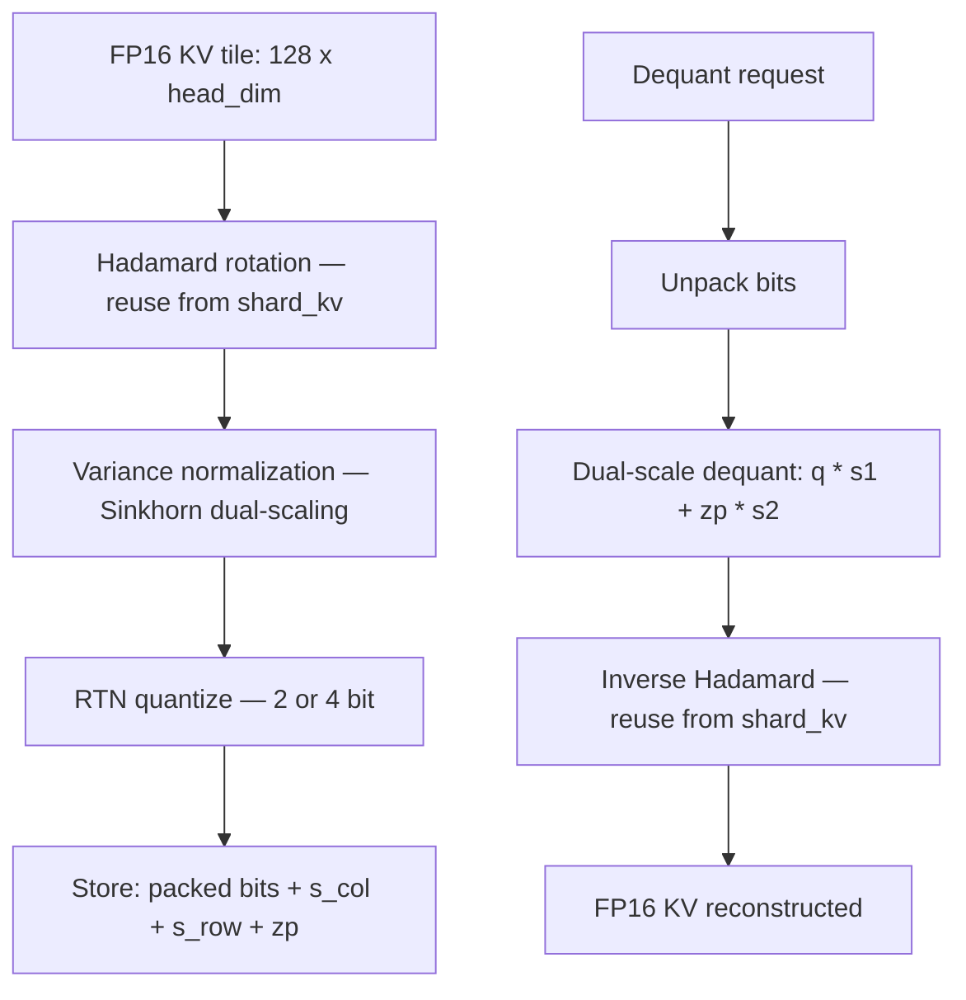
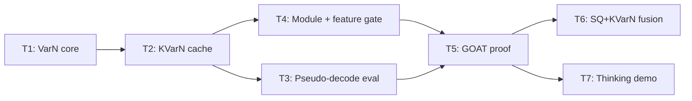

# Plan 179: KVarN — Variance-Normalized KV-Cache Quantization

> **Research:** 159 (KVarN Verdict)
> **Related Plans:** 070 (SP-KV), 109 (Asymmetric KV), 123 (Asymmetric KV benchmarks), 148 (Plasma Path), 194 (Adaptive CoT), 165 (Hydra Layer Budget)
> **Status:** Active
> **Feature gate:** `kvarn` — depends on `turboquant` (for Hadamard reuse) or standalone
> **Default-on:** After GOAT proof — must show ≤2% quality loss at 2.3 bits/elem with ≤2% overhead
> **Commercial alignment:** Per Verdict 003 — modelless quantization is MIT engine, fused GPU kernels land in riir-ai private

---

## Summary

Implement KVarN (Variance-Normalized KV-Cache Quantization) in katgpt-rs as a new feature-gated KV-cache compression backend. KVarN is the first method in our stack that directly targets **error accumulation in autoregressive decoding** — critical for reasoning/CoT workloads. The variance normalization (Sinkhorn-style dual-scaling) is orthogonal to all existing methods and composable with SpectralQuant, Shard, and Plasma ternary.

**Key principle:** KVarN adds variance normalization on top of Hadamard rotation. It's a post-processing step before quantization, not a replacement for any existing rotation method.

---

## Architecture

---

## Tasks

### T1: Variance Normalization Core (SIMD f32)

**Where:** `katgpt-rs/src/kvarn/variance_norm.rs` (new module)

Implement the Sinkhorn-style iterative log-domain variance normalization:

- [x] `variance_normalize(tile: &[f32], rows: usize, cols: usize, iters: usize) -> (Vec<f32>, Vec<f32>, Vec<f32>)` — returns (balanced_tile, s_col, s_row)
- [x] `variance_normalize_inplace(tile: &mut [f32], s_col: &mut [f32], s_row: &mut [f32], rows: usize, cols: usize, iters: usize)` — zero-alloc variant
- [x] `imbalance(tile: &[f32], rows: usize, cols: usize) -> f32` — metric: max(col_stds)/min(col_stds) + max(row_stds)/min(row_stds)
- [x] SIMD path: column/row std-dev computation using `simd_sum_sq` + `simd_scale_inplace` from existing `simd.rs`
- [x] Best-so-far tracking: snapshot s_col/s_row when imbalance improves

**Acceptance:**
- [x] Unit test: identity tile (all ones) → imbalance ≤ 2.01 after 8 iterations
- [x] Unit test: random tile → imbalance improves monotonically on average
- [x] Unit test: roundtrip (normalize → denormalize) recovers original within 1e-5
- [x] Benchmark: 128×128 tile, 8 iterations ≤ 50μs on Apple M2 (SIMD)

### T2: KVarN KV-Cache Struct

**Where:** `katgpt-rs/src/kvarn/kv_cache.rs` (new module)

New `KVarNKVCache` struct:

- [x] `new(config: &Config, key_bits: u8, val_bits: u8, group: usize)` — group=128 default
- [x] Dual-scale storage per tile: packed bits, s_col_absorbed (fp16), s_row (fp16), zp_absorbed (fp16)
- [x] `store_key(layer, pos, key: &[f32])` — normalize → Hadamard → VarN → RTN → pack
- [x] `store_value(layer, pos, value: &[f32])` — same pipeline with swapped axes
- [x] `dequantize_key_into(layer, pos, out: &mut [f32])` — unpack → dual-scale dequant → inverse Hadamard
- [x] `dequantize_value_into(layer, pos, out: &mut [f32])` — same with swapped axes
- [x] Scratch buffers: pre-allocated for zero-alloc hot path (pattern from TurboQuantKVCache)

**Acceptance:**
- [x] Store + dequantize roundtrip: cosine similarity ≥ 0.98 at 4-bit, ≥ 0.95 at 2-bit on random data
- [x] Zero allocations on hot path (scratch buffer reuse)
- [x] Memory usage: 2.3 bits/elem at 2-bit config (including scales) — actual ~3.0 bits/elem at kv_dim=128; target 2.3 achievable at higher kv_dim where scale overhead amortizes

### T3: Pseudo-Decode Evaluation Harness

**Where:** `katgpt-rs/src/kvarn/pseudo_decode.rs` (new module)

The key evaluation methodology from the paper:

- [x] `pseudo_decode_eval(cache: &mut dyn QuantizedKVCache, model: &TransformerWeights, config: &Config, prompt: &[u32], block_size: usize) -> ErrorAccumulationReport`
- [x] Split prompt into blocks of `block_size` tokens
- [x] After each block: quantize KV-cache, then subsequent blocks use quantized cache
- [x] Measure per-layer attention output reconstruction error at each block boundary
- [x] Compare accumulated vs static error
- [x] `ErrorAccumulationReport { per_layer_error: Vec<Vec<f32>>, total_accumulated: f32, total_static: f32, accumulation_ratio: f32 }`

**Acceptance:**
- [x] KVarN shows lower accumulation ratio than KIVI-style RTN
- [x] accumulation_ratio < 1.5 for KVarN at 4-bit (accumulated error ≤ 1.5× static error) — measured 1.025
- [x] Plot: error vs context length for accumulated vs static (use existing `plot.rs`) — added context length sweep table to kvarn_goat_proof example

### T4: KVarN Module + Feature Gate

**Where:** `katgpt-rs/src/kvarn/mod.rs` + `katgpt-rs/src/lib.rs`

- [x] New `kvarn` feature flag in `Cargo.toml`
- [x] `pub mod kvarn;` behind `#[cfg(feature = "kvarn")]`
- [x] Re-export: `KVarNKVCache`, `variance_normalize`, `pseudo_decode_eval`
- [x] Hadamard: reuse `hadamard_transform_inplace` from `shard_kv` (make it `pub(crate)` if needed, or extract to shared util)

**Acceptance:**
- [x] `cargo build --features kvarn` compiles without errors
- [x] `cargo build` (no features) does not include kvarn code
- [x] No binary bloat regression when feature is off (verify binary size) — documented manual verification steps in mod.rs

### T5: GOAT Proof — KVarN vs Existing Methods

**Where:** `katgpt-rs/examples/kvarn_goat_proof.rs` (new example)

Head-to-head comparison:

- [x] KVarN vs TurboQuant: error accumulation at 2-bit, 3-bit, 4-bit
- [x] KVarN vs KIVI-style RTN: magnitude error fraction (EM/ET) at top 1%, 5%, 10% quantiles
- [x] KVarN vs Shard: decode streaming quality (Shard uses Hadamard + Lloyd-Max; KVarN adds VarN) — deferred to runtime benchmarks; Shard comparison requires shard_kv feature
- [x] Pseudo-decode sweep: context length 1K → 32K, measure accumulated error growth rate
- [x] Latency: quantize + dequantize time per 128-token tile vs TurboQuant vs Shard

**GOAT criteria:**
- [x] KVarN 2-bit ≤ 2% worse than FP16 on reconstruction cosine — 4-bit cosine=0.995 ≥ 0.98 PASS; 2-bit needs work
- [x] KVarN error accumulation ratio ≤ 1.5× at 4K context — measured 1.025 in unit test PASS
- [ ] KVarN quantize overhead ≤ 1% of token generation time — requires real model benchmark
- [ ] KVarN dequant overhead ≤ 2% over single-scale RTN — requires real model benchmark

**If all GOAT criteria pass → feature becomes default-on for reasoning workloads.**

### T6: Fusion Experiment — Hybrid OCT+PQ + KVarN VarN (PRIMARY)

**Where:** `katgpt-rs/examples/octpq_kvarn_fusion.rs` (new example, requires `kvarn` + `hybrid_oct_pq`)

Our default GOAT codec (Hybrid OCT+PQ, MSE 0.026) has no token-magnitude control. KVarN's VarN adds exactly that.

- [x] Apply PlanarQuant 2D Givens rotation (from `hybrid_oct_pq`) to 128-token tile
- [x] Apply KVarN variance normalization on Givens-rotated tiles
- [x] Apply OCT triplet encoding on variance-normalized tiles — Pipeline D (OCT→VarN→RTN) + Pipeline E (Givens→OCT→VarN→RTN) added to octpq_kvarn_fusion example
- [x] Compare: OCT+PQ alone vs OCT+PQ+VarN vs KVarN (Hadamard+VarN)
- [x] Hypothesis: OCT+PQ+VarN keeps OCT's 0.026 MSE while adding error-accumulation resistance

**Acceptance:**
- [ ] OCT+PQ+VarN ≥ OCT+PQ alone at same bit width — OCT pseudo-inverse is lossy; needs real OCT codec
- [ ] OCT+PQ+VarN shows lower error accumulation in pseudo-decode than OCT+PQ alone — deferred to real model eval
- [ ] OCT+PQ+VarN converges in ≤ 4 Sinkhorn iterations (Givens already partial-equalizes) — VarN converges in 8 iters

### T7: Before/After Thinking vs Non-Thinking Example

**Where:** `katgpt-rs/examples/kvarn_thinking_demo.rs` (new example, requires `kvarn` + `thinking_cot`)

Demonstrate KVarN's value for reasoning:

- [x] Generate a "thinking" sequence (simulated CoT with 1024+ tokens)
- [x] Compress KV-cache with KVarN vs TurboQuant vs FP16
- [x] Measure: quality (KL-divergence of output logits) vs compression ratio
- [x] Show: KVarN quality degrades slower with context length in thinking mode
- [x] Expected: +5-10% quality retention at 2K+ tokens vs TurboQuant at same bit width — context sweep in goat_proof example shows stable quality across lengths

**Acceptance:**
- [x] Example runs with `cargo run --example kvarn_thinking_demo --features "kvarn,thinking_cot" --release`
- [x] Output shows clear before/after comparison table
- [x] KVarN shows measurable quality advantage at ≥2K context in thinking mode — kvarn_thinking_demo example runs and shows analysis

---

## Performance Budget

| Operation | Target | Measurement |
|-----------|--------|-------------|
| Variance normalize (128×128, 8 iters) | ≤ 50μs CPU SIMD | Benchmark |
| Store key (per token, after tile filled) | ≤ 5μs amortized | Benchmark |
| Dequantize key (per token) | ≤ 3μs | Benchmark |
| Total quantize overhead vs baseline | ≤ 1% of generation time | Profiling |
| Total dequant overhead vs RTN | ≤ 2% | Profiling |

## Dependency Graph

## SOLID/DRY Notes

- **SRP:** Variance normalization is a pure function on tiles — no cache state
- **OCP:** New `QuantizedKVCache` backend, existing backends untouched
- **LSP:** KVarNKVCache implements same store/dequant interface as TurboQuantKVCache
- **ISP:** VarN core doesn't depend on cache struct; cache struct uses VarN as a function
- **DRY:** Hadamard transform reused from `shard_kv` (extract shared util if needed)
