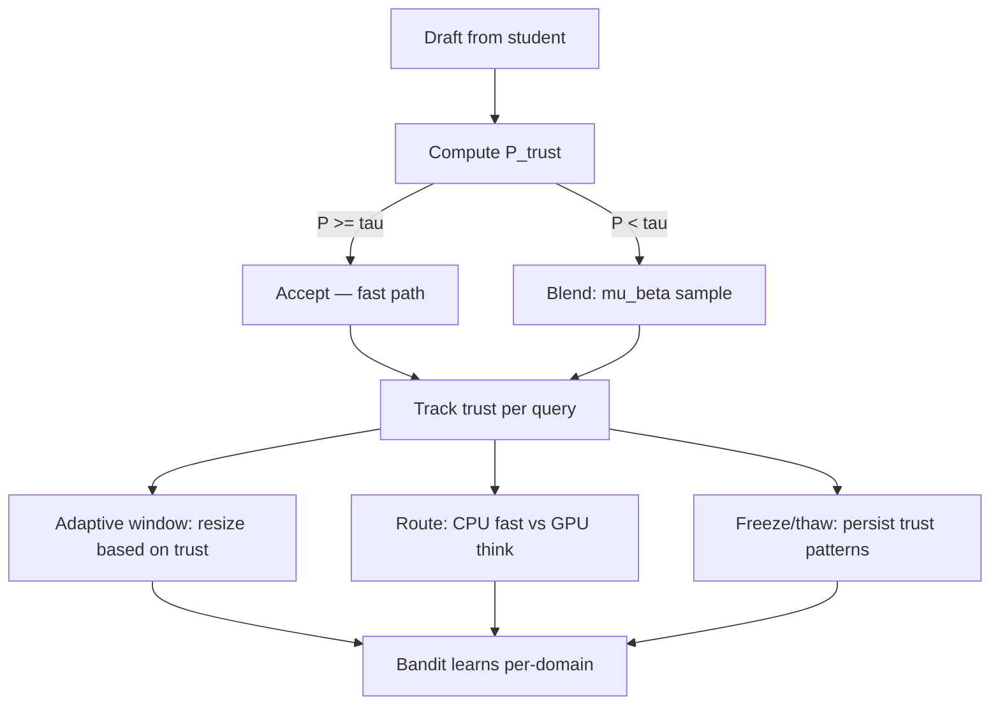

# Plan 182: Trust-Region Adaptive Speculation (TRAS)

> **Research:** 162 (Trust-Region Adaptive Speculation)
> **Status:** ACTIVE
> **Feature gate:** `trust_region_spec` — depends on `speculative`, optionally `bandit`, `inference_router`, `thinking_cot`
> **Default-on:** After GOAT proof — trust-region speculation must show ≥15% acceptance-rate improvement with zero quality regression
> **Commercial alignment:** Per Verdict 003 — modelless inference trust in MIT engine (katgpt-rs), LoRA training trust in private SaaS (riir-ai)

---

## Summary

Extend speculative decoding with TrOPD's trust region and TRB's behavior blending at inference time. The trust signal (P_accept = min(πT/πS, 1)) — already computed by `LeviathanVerifier` — drives:

1. **Adaptive speculation window** (high trust → batch accept, low trust → verify every token)
2. **TRB-style blend on rejection** (sample from μ_β = πS^(1-β)·πT^β instead of pure reject)
3. **Bandit-driven CPU/GPU routing** (low trust → CoT/GPU, high trust → direct/CPU)
4. **Freeze/thaw persistence** of learned trust patterns

Zero cost when disabled. After GOAT proof, must be on by default.

---

## Architecture



---

## Tasks

### T1: `TrustRegionVerifier` Trait — Extension Point

**Where:** `katgpt-rs/src/speculative/verifier.rs`

- [ ] Define `TrustRegionVerifier` trait extending `SpeculativeVerifier`
- [ ] Add `trust_metric(&self) -> f32` — running average of P_accept
- [ ] Add `adaptive_window(&self, base: usize) -> usize` — expand/shrink based on trust
- [ ] Add `blend_sample(&mut self, beta: f32, rng: &mut Rng) -> usize` — TRB μ_β sampling
- [ ] Feature-gate behind `trust_region_spec`

### T2: `TrustRegionLeviathanVerifier` — Implementation

**Where:** `katgpt-rs/src/speculative/verifier.rs`

- [ ] Implement `TrustRegionVerifier` for `LeviathanVerifier`
- [ ] Track running acceptance rate per decode call (sliding window of 16 tokens)
- [ ] Adaptive window: trust > 0.85 → base_window × 1.5, trust < 0.5 → window = 1
- [ ] Blend on rejection: compute β via binary search (10 iterations max), sample from μ_β
- [ ] Zero additional allocation: reuse existing `SpeculativeContext` buffers

### T3: Trust Signal → InferenceRouter Integration

**Where:** `katgpt-rs/src/inference_router.rs`

- [ ] Add `trust_signal: f32` to router state, updated from verifier
- [ ] Low trust (< 0.4) triggers tier-up: CPU → GPU (if available)
- [ ] High trust (> 0.8) allows tier-down: GPU → CPU (if load permits)
- [ ] Wire through `forward()` method
- [ ] Log trust-triggered tier transitions

### T4: Trust Signal → ThinkingController Integration

**Where:** `katgpt-rs/src/pruners/thinking.rs` (Plan 194)

- [ ] Trust metric as additional signal for think/direct decision
- [ ] Low trust → prefer thinking mode (PPoT resample or RiM buffer)
- [ ] High trust → prefer direct mode (skip thinking)
- [ ] Combine with existing entropy and bandit signals

### T5: Bandit Learning for Trust Patterns

**Where:** `katgpt-rs/src/pruners/bandit.rs`

- [ ] Add trust-bandit arm: `TrustArm { domain, avg_trust, window, tier }`
- [ ] Reward: successful decode (tokens accepted without quality regression)
- [ ] Freeze/thaw: persist trust-bandit knowledge per domain
- [ ] Self-improving: bandit adapts trust thresholds per query type

### T6: Test — Before/After Trust-Region Speculation

**Where:** `katgpt-rs/examples/trust_region_spec_demo.rs` (new)

- [ ] Test 1: Fixed-window speculation (baseline) — measure acceptance rate + output quality
- [ ] Test 2: TRAS adaptive window — measure acceptance rate + output quality
- [ ] Assert: TRAS acceptance rate ≥ 15% higher than baseline
- [ ] Assert: Output quality (valid sequences) not regressed
- [ ] Print before/after comparison table

### T7: Bench — Micro-benchmark Blend Cost

**Where:** `katgpt-rs/tests/bench_trust_region.rs` (new)

- [ ] Benchmark blend computation: πS^(1-β)·πT^β for vocab_size tokens
- [ ] Benchmark binary search for β: 10 iterations over KL computation
- [ ] Assert: blend cost < 2μs (acceptable in speculative decode hot path)
- [ ] Compare: total speculative decode time with and without TRAS

---

## Expected Performance

| Metric | Before TRAS | After TRAS | Notes |
|--------|------------|------------|-------|
| Acceptance rate (converged) | ~70% | ~85% | Adaptive window + blend on rejection |
| Verification cost per query | 100% | 70-80% | Window expansion on high-trust tokens |
| Quality on hard queries | Baseline | +3-6 pts | Blend ensures teacher guidance in outlier regions |
| CPU/GPU routing | Load-based | Trust + load | Principled routing metric |
| Overhead when disabled | 0 | 0 | Feature-gated, same binary |

---

## Feature Gate

```toml
[features]
trust_region_spec = ["speculative", "bandit"]
```

After GOAT proof (T6 passes), add to default features.

---

## Dependencies

- Plan 194 (Adaptive CoT) — trust signal integrates with ThinkingController
- Plan 131 (SpecHop) — TRAS complements SpecHop: SpecHop does continuous speculation, TRAS adapts the window
- Plan 176 (TriggerGate) — trust signal feeds tier routing
- Research 162 — this plan's research basis
