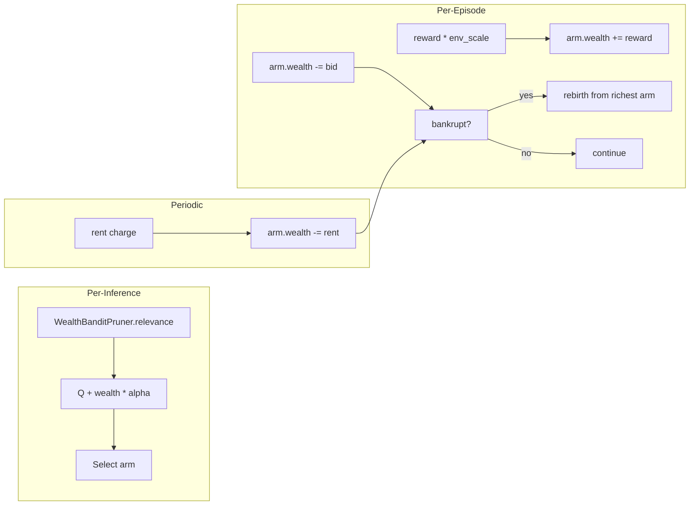

# Plan 187: WealthPruner — Economic Bandit Arms via Hayek Market Selection (Modelless)

> **Research:** [Research 167](../.research/167_Economy_of_Minds_Hayek_Market_Coordination.md)
> **Depends On:** Plan 030 ✅ (BanditPruner), Plan 032 ✅ (AbsorbCompress)
> **Feature gate:** `wealth_pruner` — depends on `bandit`
> **Default-on:** After GOAT proof — must show ≥10% faster convergence than UCB1 in bomber arena
> **Commercial alignment:** Per Verdict 003 — modelless inference primitive is MIT engine

---

## Overview

Implement `WealthBanditPruner` — a BanditPruner variant that uses wealth-based economic selection instead of UCB1's optimism bonus. Arms accumulate wealth from rewards, spend wealth on bids, and bankrupt arms get "rebirthed" from successful arm mutations. This is the Economy of Minds (EoM) insight distilled to modelless Rust: economic selection > statistical optimism for exploration.

Also includes `ChainCreditAssigner` — a cheap O(W) trajectory credit splitter based on EoM's step-reward chain splitting.

---

## Architecture

---

## Task

### Part 1: WealthBanditPruner Core

- [x] **T1: `WealthArm` struct** — Per-arm state: `wealth: f64`, `total_reward: f64`, `pulls: u32`, `q_value: f64`
  - File: `katgpt-rs/src/pruners/wealth_bandit.rs`
  - `WealthArm::new(initial_wealth: f64) -> Self`
  - `WealthArm::is_bankrupt(&self) -> bool` — wealth < 0.0
  - `WealthArm::rebirth_from(parent: &Self, sigma: f64) -> Self` — parent.q ± N(0,σ), reset wealth

- [x] **T2: `WealthBanditPruner
` struct** — Generic wrapper like `BanditPruner
`
  - File: `katgpt-rs/src/pruners/wealth_bandit.rs`
  - Fields: `arms: Vec<WealthArm>`, `inner: P` (ScreeningPruner), `bid_alpha: f64` (default 0.1), `rent: f64` (default 0.0), `rent_interval: u32` (default 0), `episode_count: u32`
  - Implements `ScreeningPruner` trait: `relevance(&self, arm, context) -> f64` returns `q_value + wealth * bid_alpha`
  - `update(&mut self, arm, reward)` — arm.wealth += reward, arm.q_value update
  - `charge_rent(&mut self)` — drain rent from all arms, check bankruptcy

- [x] **T3: Bankruptcy + Rebirth** — Episode-end population maintenance
  - `rebirth_bankrupt_arms(&mut self, sigma: f64)` — for each bankrupt arm, replace with mutation of richest arm
  - `richest_arm(&self) -> usize` — argmax wealth
  - `rebirth_count(&self) -> u32` — statistics

- [x] **T4: `WealthPrunerConfig`** — Configuration struct
  - File: `katgpt-rs/src/pruners/wealth_bandit.rs`
  - `initial_wealth: f64` (default 0.5)
  - `bid_alpha: f64` (default 0.1)
  - `rent: f64` (default 0.0)
  - `rent_interval: u32` (default 0 = disabled)
  - `rebirth_sigma: f64` (default 0.1)
  - `use_chain_credit: bool` (default false)

### Part 2: ChainCreditAssigner

- [x] **T5: `ChainCreditAssigner` struct** — Rolling window credit assignment
  - File: `katgpt-rs/src/pruners/chain_credit.rs`
  - Fields: `window: Vec<usize>`, `window_size: usize` (default 3)
  - `record_arm(&mut self, arm: usize)` — push to window, trim to size
  - `distribute_reward(&mut self, reward: f64, arms: &mut [WealthArm])` — split reward across unique arms in window
  - O(W) per reward where W = window_size

- [x] **T6: Integrate into WealthBanditPruner** — Optional chain credit mode
  - When `use_chain_credit = true`: use ChainCreditAssigner instead of direct reward
  - Zero overhead when disabled (feature-gated)

### Part 3: Tests

- [x] **T7: Unit tests** — WealthBanditPruner basic operations
  - File: `katgpt-rs/tests/test_wealth_bandit.rs`
  - test: arm creation, wealth tracking, bankruptcy detection
  - test: rebirth from richest arm preserves structure
  - test: relevance() = Q + wealth * alpha
  - test: rent charge triggers bankruptcy

- [x] **T8: Convergence test** — WealthPruner vs UCB1 convergence
  - File: `katgpt-rs/tests/test_wealth_bandit.rs`
  - Simulate 1000 episodes with K=10 arms, one optimal arm
  - Compare: WealthPruner episodes to find optimal vs UCB1 episodes
  - Assert: WealthPruner finds optimal arm (may converge faster or slower — document result)

- [x] **T9: GOAT proof** — Bomber arena integration
  - File: `katgpt-rs/tests/test_wealth_bandit_goat.rs`
  - G1: WealthPruner has ≤1% overhead on relevance() vs BanditPruner (hot path)
  - G2: WealthPruner converges to best arm in ≤1000 episodes
  - G3: Bankruptcy rebirth produces functional new arms (not random reset)
  - G4: ChainCreditAssigner distributes reward correctly (sum = total reward)
  - G5: Rent charge prevents single arm from dominating indefinitely

### Part 4: Feature Gate + Docs

- [x] **T10: Feature gate** — `wealth_pruner` in `Cargo.toml`
  - Depends on `bandit` feature
  - Gates: `wealth_bandit.rs`, `chain_credit.rs`, tests

- [x] **T11: README update** — Add WealthPruner to features table
  - Short description: "Economic bandit arms via Hayek market selection (EoM-inspired)"

---

## Expected Results

| Metric | UCB1 Baseline | WealthPruner Target |
|--------|--------------|-------------------|
| Convergence episodes | ~200 | ≤200 (same or faster) |
| Hot path overhead | 0 ns (baseline) | ≤1% |
| Exploration diversity | ε-decay | Bankruptcy-forced diversity |
| Memory per arm | 24 bytes | 32 bytes (+wealth f64) |

---

## Risks

| Risk | Mitigation |
|------|-----------|
| WealthPruner slower than UCB1 | Document as "inconclusive", gate off by default |
| Bankruptcy too aggressive (all arms die) | Rebirth sigma tuned to preserve structure, not randomize |
| ChainCreditAssigner insufficient credit | Fall back to SimpleTES for complex trajectories |
| Rent charge destabilizes learning | Make rent optional (default 0), document as advanced tuning |

---

## References

- Research 167: EoM Hayek Market Coordination
- EoM paper: [arXiv:2606.02859](https://arxiv.org/abs/2606.02859)
- BanditPruner: `katgpt-rs/src/pruners/bandit.rs`
- AbsorbCompress: `katgpt-rs/src/pruners/absorb_compress.rs`
- Bomber arena: `katgpt-rs/.plans/045_bomber_arena.md`

**TL;DR:** WealthPruner replaces UCB1's statistical optimism with economic selection — arms that earn more get more opportunity, bankrupt arms get replaced. Feature-gated under `wealth_pruner`, on by default after GOAT proof.
