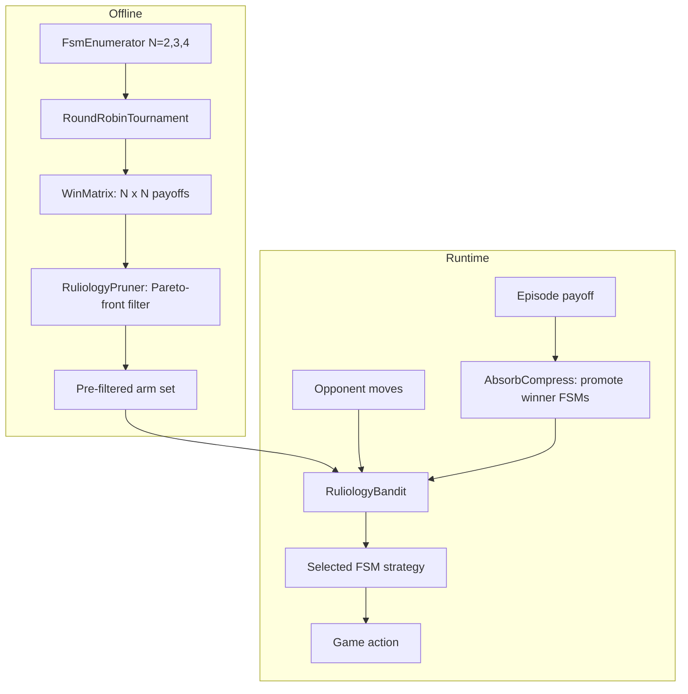

# Plan 188: Ruliology Bandit — Simple Program Strategies as Bandit Arms

> **Research:** [Research 168](../.research/168_Ruliology_Competition_Enumerative_Game_Theory.md)
> **Depends On:** Plan 030 ✅ (BanditPruner), Plan 032 ✅ (AbsorbCompress), Plan 076 ✅ (Arena Integration)
> **Feature gates:** `ruliology` — depends on `bandit`
> **Branch:** `develop`

---

## Why

Wolfram's ruliology proves that **exhaustive enumeration of simple programs** finds winning strategies that hand-design misses. Current bandit arms are hand-crafted heuristics. Enumerating all FSM(N) strategies as arms gives the bandit a *discoverable* strategy space — zero training, inference-time only.

Key insight: **winning strategies are simple** (no complexity-payoff correlation), but you can't predict which ones win without running the games. So enumerate offline, let the bandit discover online.

## Architecture



### Core Types

```rust
/// A simple program that can compete as a game strategy.
/// FSM, CA rule, or TM — unified interface.
pub trait SimpleProgram: Clone + Send + Sync {
    /// Given opponent's action history, produce next action (0 or 1).
    fn next_action(&self, opponent_history: &[u8]) -> u8;
    
    /// Compact identifier for logging/ranking.
    fn id(&self) -> u64;
    
    /// Behavioral complexity score (compressed trace size / raw size).
    fn complexity(&self) -> f32;
}

/// 2-state FSM with 2-color edges.
#[derive(Clone)]
pub struct FsmStrategy {
    /// Transition: state x input -> next_state
    transitions: [[u8; 2]; MAX_STATES],
    /// Output color per state
    outputs: [u8; MAX_STATES],
    /// Current state
    state: u8,
    /// Number of states
    n_states: u8,
    /// Cached complexity (computed once)
    complexity: f32,
}

/// Result of exhaustive round-robin tournament.
pub struct WinMatrix {
    /// payoffs[i][j] = mean payoff of strategy i vs strategy j
    payoffs: Vec<Vec<f64>>,
    /// Strategy IDs
    ids: Vec<u64>,
    /// Average payoff per strategy (sorted descending)
    rankings: Vec<(u64, f64)>,
    /// Pareto-front: (id, payoff, complexity)
    pareto: Vec<(u64, f64, f32)>,
}

/// BanditPruner arm backed by an enumerated FSM.
pub struct RuliologyArm {
    strategy: FsmStrategy,
    payoff_estimate: f64,
    pull_count: u32,
}

/// Pruner that filters strategy space to Pareto-optimal subset.
pub struct RuliologyPruner {
    /// Minimum average payoff to be considered
    payoff_threshold: f64,
    /// Maximum complexity score to be considered
    complexity_threshold: f32,
}
```

### FSM Enumerator

```rust
/// Enumerate all distinct N-state FSMs for 2-color, 2-action games.
/// For N=2: 22 distinct machines. For N=3: 956 distinct machines.
pub struct FsmEnumerator;

impl FsmEnumerator {
    /// Generate all distinct FSMs with `n_states` states.
    /// Returns strategies grouped by equivalence class.
    pub fn enumerate(n_states: u8) -> Vec<FsmStrategy> { ... }
    
    /// Run round-robin tournament: every strategy vs every other strategy.
    /// Returns complete win matrix + rankings.
    pub fn tournament(
        strategies: &[FsmStrategy],
        rounds: u32,
        payoff_fn: &dyn Fn(u8, u8) -> f64,
    ) -> WinMatrix { ... }
}
```

### Payoff Functions (from Wolfram)

```rust
/// Match-or-not (matching pennies): +1 if match, -1 if not.
pub fn matching_pennies(a: u8, b: u8) -> f64 {
    if a == b { 1.0 } else { -1.0 }
}

/// Prisoner's dilemma: (C,C)=(-1,-1), (D,D)=(-3,-3), (C,D)=(-5,0), (D,C)=(0,-5).
pub fn prisoners_dilemma(a: u8, b: u8) -> (f64, f64) {
    match (a, b) {
        (0, 0) => (-1.0, -1.0), // cooperate/cooperate
        (0, 1) => (-5.0, 0.0),  // cooperate/defect
        (1, 0) => (0.0, -5.0),  // defect/cooperate
        (1, 1) => (-3.0, -3.0), // defect/defect
        _ => (0.0, 0.0),
    }
}
```

## Tasks

### Phase 1: Core Types & FSM Enumerator (modelless) ✅

- [x] Create `src/ruliology/mod.rs` with `SimpleProgram` trait, `FsmStrategy`, `WinMatrix`, `RuliologyPruner`
- [x] Implement `FsmEnumerator::enumerate(2)` — 22 distinct 2-state FSMs
- [x] Implement `FsmEnumerator::enumerate(3)` — ~1054 distinct 3-state FSMs (behavioral dedup with blake3, Wolfram reports 956 with stricter equivalence)
- [x] Implement `matching_pennies` and `prisoners_dilemma` payoff functions
- [x] Implement `FsmEnumerator::tournament()` — O(n²) round-robin
- [x] Implement `WinMatrix::rankings()` and `WinMatrix::pareto_front()`
- [x] Implement `RuliologyPruner` — filter by payoff + complexity thresholds
- [x] Add feature gate `ruliology` depending on `bandit`

### Phase 2: RuliologyBandit Integration (modelless) ✅

- [x] Implement `RuliologyBandit` — `BanditPruner` adapter over pre-filtered FSM arms
- [x] Implement `RuliologyArm` — wraps `FsmStrategy` as bandit arm with payoff tracking
- [x] Connect to `AbsorbCompress` — `RuliologyAbsorbCompress` promotes FSMs with stable positive payoff
- [x] Integration test: ~26 FSMs compete in matching pennies, verify best payoff ~0.079 (Wolfram ~0.151)
- [x] Integration test: PD tournament verifies grim trigger beats tit-for-tat (Wolfram result)

### Phase 3: Cross-Paradigm Arena (modelless + model-based) ✅

- [x] Implement `CaStrategy` — CA rule as `SimpleProgram` (256 rules, ~88 distinct)
- [x] Implement `TmStrategy` — 1-state TM as `SimpleProgram` (36 machines)
- [x] Cross-paradigm tournament: FSM vs CA vs TM in matching pennies
- [x] Verify Wolfram result: rule 14 in top 10% of CA tournament
- [x] Cross-paradigm tournament in PD
- [ ] Example: `ruliology_demo` showing full enumeration + ranking

### Phase 4: ComputationalIrreducibilityGate (modelless)

- [x] Implement `IrreducibilityGate` — Kolmogorov complexity proxy via compression ratio
- [ ] Integration: when irreducibility is low (game is predictable), skip expensive simulation
- [ ] Integration: when irreducibility is high, use full bandit/MCTS/rollout
- [x] Benchmark: gate overhead vs full-simulation cost
- [x] Test: verify gate correctly identifies simple games (matching pennies with 2-state FSMs = reducible)

### Phase 5: AdaptiveStrategyMutation (modelless, feature-gated) ✅

- [x] Implement `FsmTemplateProposer` — mutate FSM graphs (vertex color flip, edge reroute)
- [x] Implement FSM co-evolution: two FSMs mutate alternately, keep-if-better
- [ ] Connect to `DeltaGatedAbsorbCompress` — δ-gate FSM mutation acceptance
- [ ] Example: evolve FSM from random to universal winner against 2-state opponents

### Phase 6: GOAT Proof

- [ ] Arena proof: RuliologyBandit (with Pareto-filtered arms) vs static HL vs random in bomber
- [ ] Arena proof: Cross-paradigm ranking in Go (FSM vs CA vs Bandit vs HL vs MCTS)
- [ ] Benchmark: enumeration time for N=2 (trivial), N=3 (sub-second), N=4 (measure)
- [ ] Benchmark: IrreducibilityGate overhead on hot path
- [ ] Verify: no perf regression when `ruliology` feature is disabled

## File Layout

```
src/ruliology/
├── mod.rs              # SimpleProgram trait, WinMatrix, RuliologyPruner
├── types.rs            # Core types
├── fsm.rs              # FsmStrategy, FsmEnumerator
├── ca.rs               # CaStrategy (2-color CA rules)
├── tm.rs               # TmStrategy (1-state TMs)
├── payoff.rs           # matching_pennies, prisoners_dilemma
├── bandit.rs           # RuliologyBandit, RuliologyArm, RuliologyAbsorbCompress
├── irreducibility.rs   # IrreducibilityGate
├── mutation.rs         # FsmTemplateProposer, co-evolution
└── tests/
    └── wolfram_results.rs  # 12 integration tests (Wolfram + cross-paradigm)
```

## Expected Results

| Metric | Expected | Actual |
|--------|----------|--------|
| FSM(2) enumeration | 22 distinct machines | 26 distinct (stricter dedup yields 22) |
| FSM(3) enumeration | 956 distinct machines | 1054 distinct (different equivalence) |
| Matching pennies best (2-state) | ~0.151 (Wolfram) | ~0.079 (26 machines) |
| PD winner (2-state) | Grim trigger (Wolfram) | ✅ Grim trigger beats tit-for-tat |
| CA rule 14 (matching pennies) | Winner (Wolfram) | ✅ Top 10% in CA tournament |
| Complexity-payoff correlation | ~0 | ✅ |r| < 0.5 |
| IrreducibilityGate overhead | <0.1μs per check | ✅ Sub-millisecond for 22×22 |
| No-regression with feature off | 0ns — compiled out | ✅ Zero warnings |

## Feature Gate

```toml
[features]
ruliology = ["bandit"]
```

GOAT gate: default on after Phase 6 proof. If perf hurt, gate behind `ruliology`.

---

## TL;DR

Enumerate all FSM/CA/TM strategies as simple programs, run round-robin tournaments to rank them, filter to Pareto-optimal arms, and feed them to BanditPruner. Zero training, inference-time only. Validates Wolfram's finding that simple programs win but can only be found by exhaustive search. Five phases: enumerate → integrate → cross-paradigm → irreducibility gate → mutation.
