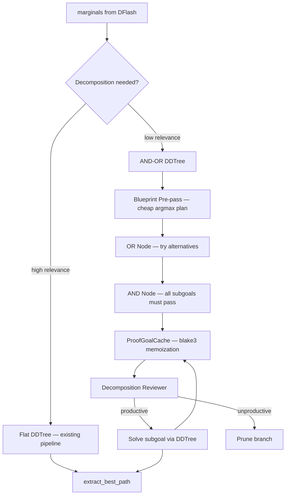
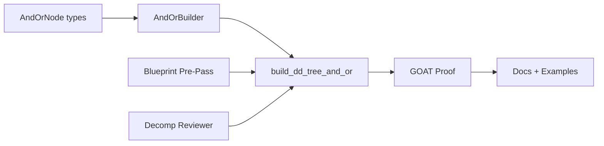

# Plan 190: AND-OR DDTree — Blueprint-Driven Subgoal Decomposition

> **Research:** 170 (LEAP Blueprint DAG)
> **Depends on:** Plan 128 (Proof Sketch Evolution ✅), Plan 030 (Multi-armed bandit ✅), Plan 021 (ScreeningPruner ✅)
> **Feature gate:** `and_or_dtree` — depends on `proof_sketch_evolution`, `bandit_pruner`, `screening_pruner`
> **Default-on:** After GOAT proof — if decomposition reduces nodes explored with no quality regression
> **Commercial alignment:** Per Verdict 003 — generic AND-OR tree is MIT engine (katgpt-rs). Game-specific applications are riir-ai private SaaS.

---

## Summary

Add AND-OR subgoal decomposition to DDTree, inspired by LEAP's hierarchical memoization. Instead of flat best-first search over token marginals, decompose complex generation into AND (all subgoals must succeed) and OR (alternative strategies) subgoals. Solved subgoals are memoized via `ProofGoalCache`. A blueprint pre-pass (cheap argmax) guides the expensive DDTree search. A decomposition reviewer prevents search collapse on dead-end branches.

**Key principle:** Decomposition is *optional* — flat DDTree still works. When enabled, it must reduce search cost with no quality regression.

---

## Architecture



---

## Tasks

### T1: `AndOrNode` + `AndOrTree` types — Generic AND-OR tree structure

**Where:** `katgpt-core/src/and_or/` (new module)

The core data structure for AND-OR decomposition. Generic over any goal type G and solution type S.

```rust
/// AND-OR tree node for hierarchical goal decomposition.
/// Inspired by LEAP's AND-OR DAG with hierarchical memoization.
#[derive(Debug, Clone)]
pub enum AndOrNode<G, S> {
    /// OR node: any child can succeed. Represents alternative strategies.
    Or {
        goal: G,
        children: Vec<AndOrNode<G, S>>,
        best: Option<usize>, // index of best child so far
    },
    /// AND node: all children must succeed. Represents a decomposition.
    And {
        goal: G,
        sketch: Option<S>, // partial solution assuming subgoals
        children: Vec<AndOrNode<G, S>>,
        solved: Vec<bool>, // per-child solved status
    },
    /// Leaf: a solved or unsolved atomic goal.
    Leaf {
        goal: G,
        solution: Option<S>,
    },
}
```

- [x] Create `katgpt-core/src/and_or/mod.rs` with module declarations
- [x] Create `katgpt-core/src/and_or/types.rs` with `AndOrNode<G, S>` enum
- [x] Add `#[cfg(feature = "and_or_dtree")]` module gate in `katgpt-core/src/lib.rs`
- [x] Unit tests: tree construction, child access, solved status propagation

### T2: `AndOrBuilder` — Decomposition logic for DDTree marginals

**Where:** `katgpt-rs/src/speculative/and_or_builder.rs` (new)

Converts flat marginals into AND-OR tree based on `ScreeningPruner::relevance()` signal. Low relevance regions become decomposition points.

```rust
/// Builds AND-OR tree from marginals using relevance signal as decomposition trigger.
pub struct AndOrBuilder<'a, P: ScreeningPruner> {
    pruner: &'a P,
    cache: &'a ProofGoalCache,
    relevance_threshold: f32, // below this → decompose
    max_depth: usize,
}
```

Key methods:
- `build(marginals: &[&[f32]], config: &Config) -> AndOrNode<Subgoal, Vec<usize>>`
- `decompose_at(depth: usize, relevance: f32) -> bool` — triggers decomposition
- `solve_subgoal(subgoal: &Subgoal) -> Option<Vec<usize>>` — solve via mini-DDTree

- [x] Create `and_or_builder.rs` with `AndOrBuilder` struct
- [x] Implement relevance-threshold decomposition trigger
- [x] Implement subgoal solver (mini-DDTree per subgoal)
- [x] Integrate with `ProofGoalCache` for memoization
- [x] Unit tests: decomposition trigger, subgoal solving, cache integration

### T3: Blueprint Pre-Pass — Cheap argmax plan generation

**Where:** `katgpt-rs/src/speculative/blueprint.rs` (new)

Generate a cheap "blueprint" (argmax path without tree search) that guides the expensive DDTree search. Tokens compatible with the blueprint get priority in the heap.

```rust
/// Blueprint pre-pass: cheap argmax generation to guide DDTree search.
/// Inspired by LEAP's informal-formal planning pipeline.
pub struct BlueprintPass;

impl BlueprintPass {
    /// Generate a cheap argmax plan from marginals.
    /// O(depth * vocab) — no tree search, just greedy argmax.
    pub fn generate(marginals: &[&[f32]]) -> Vec<usize>;
    
    /// Score a token against the blueprint plan.
    /// Returns bonus for compatibility, penalty for deviation.
    pub fn compatibility(depth: usize, token_idx: usize, blueprint: &[usize]) -> f32;
}
```

- [x] Create `blueprint.rs` with `BlueprintPass`
- [x] Implement `generate()` — greedy argmax from marginals
- [x] Implement `compatibility()` — blueprint scoring function
- [x] Unit tests: blueprint generation, compatibility scoring

### T4: Decomposition Reviewer — Progress signal for dead-end detection

**Where:** `katgpt-rs/src/speculative/decomp_reviewer.rs` (new)

Lightweight entropy-based check that detects unproductive DDTree branches. Uses `ProofGoalCache` hit rate as progress signal.

```rust
/// Decomposition quality reviewer. Prevents search collapse on dead-end branches.
/// Inspired by LEAP's LLM reviewer that rejects unproductive decompositions.
pub struct DecompositionReviewer {
    min_progress: f32,      // minimum progress signal to keep branch
    cache: ProofGoalCache,
}

impl DecompositionReviewer {
    /// Check if a decomposition is productive.
    /// Progress = 1 - (cache_hit_rate_for_branch).
    /// High progress → exploring new territory → keep.
    /// Low progress → revisiting known states → prune.
    pub fn is_productive(&self, branch_cache_hits: u64, branch_cache_misses: u64) -> bool;
}
```

- [x] Create `decomp_reviewer.rs` with `DecompositionReviewer`
- [x] Implement progress signal computation
- [x] Integrate with `ProofGoalCache` hit/miss counters
- [x] Unit tests: productive vs unproductive detection, threshold sensitivity

### T5: `build_dd_tree_and_or()` — Integrated AND-OR DDTree builder

**Where:** `katgpt-rs/src/speculative/dd_tree.rs` (extend existing)

New build mode that combines flat DDTree with AND-OR decomposition for complex generation tasks.

```rust
/// Build DDTree with AND-OR subgoal decomposition.
/// Falls back to flat DDTree when relevance is high (simple subgoals).
/// Decomposes into subgoals when relevance is low (complex regions).
#[cfg(feature = "and_or_dtree")]
pub fn build_dd_tree_and_or<P: ScreeningPruner>(
    marginals: &[&[f32]],
    config: &Config,
    pruner: &P,
    cache: &ProofGoalCache,
    reviewer: &DecompositionReviewer,
    chain_seed: bool,
) -> Vec<TreeNode>
```

- [x] Add `build_dd_tree_and_or()` function to `dd_tree.rs`
- [x] Wire blueprint pre-pass → AND-OR builder → decomposition reviewer → mini-DDTree
- [x] Fallback to flat DDTree when no decomposition needed
- [ ] Integration test: AND-OR tree produces valid output
- [ ] Benchmark: node count vs flat DDTree on complex tasks

### T6: Feature gate + GOAT proof

**Where:** `Cargo.toml` feature declarations + test files

Feature gate `and_or_dtree` depends on `proof_sketch_evolution`, `bandit_pruner`, `screening_pruner`.

GOAT proof criteria:
1. AND-OR DDTree explores **fewer nodes** than flat DDTree for complex tasks (subgoal reuse)
2. **No quality regression** on simple tasks (where decomposition is not triggered)
3. Decomposition reviewer **prevents search collapse** (progress signal works)
4. Blueprint pre-pass adds **< 5% overhead** to total decode time
5. ProofGoalCache hit rate **≥ 30%** on tasks with repeated subgoals

- [ ] Add `and_or_dtree` feature to `Cargo.toml` with dependencies
- [ ] Create `tests/and_or_goat.rs` with GOAT proof tests
- [ ] Test 1: Node count comparison (AND-OR < flat for complex tasks)
- [ ] Test 2: Quality parity (AND-OR ≈ flat for simple tasks)
- [ ] Test 3: Dead-end detection (reviewer catches unproductive branches)
- [ ] Test 4: Blueprint overhead (< 5% decode time)
- [ ] Test 5: Cache hit rate (≥ 30% on tasks with repeated subgoals)

### T7: Documentation + Examples

**Where:** `katgpt-rs/examples/` + README update

- [ ] Example: `and_or_sudoku.rs` — Sudoku with AND-OR decomposition (rows → cells)
- [ ] Example: `and_or_code_gen.rs` — Code generation with subgoal decomposition
- [ ] Update README with AND-OR DDTree section under "Key Features"
- [ ] Benchmark report: `.benchmarks/040_and_or_dtree_goat.md`

---

## Dependency Graph



---

## Key Design Decisions

1. **Generic AND-OR tree in katgpt-core** — Not DDTree-specific. The `AndOrNode<G, S>` enum is reusable for game strategy decomposition (riir-ai) and any other hierarchical search.

2. **Relevance threshold for decomposition** — Use `ScreeningPruner::relevance()` as the trigger. When the pruner is uncertain (low relevance), decompose. When confident (high relevance), solve directly. This is the "informal-formal" pipeline mapped to our existing signal.

3. **ProofGoalCache reuse** — Don't create a new cache. Extend the existing `ProofGoalCache` (Plan 128) with subgoal-level entries. The cache already has blake3 hashing, hit/miss counters, and atomic operations.

4. **Blueprint pre-pass is CHEAP** — Argmax without tree search. O(depth × vocab) vs O(budget × depth × vocab) for full DDTree. The blueprint is a hint, not a constraint.

5. **Decomposition reviewer uses existing signals** — ProofGoalCache hit rate + ScreeningPruner relevance. No new LLM call needed. The "review" is a statistical check, not a model inference.

---

## Performance Considerations

- **Hot-path:** AND-OR decomposition adds a branch check per DDTree node. Cost: ~1ns per node (relevance comparison). Negligible vs DDTree budget (typically 100-1000 nodes).
- **Blueprint pre-pass:** O(depth × vocab) argmax. Typically < 1μs for vocab_size < 100K. Well under 5% overhead target.
- **Cache integration:** ProofGoalCache lookup is O(1) blake3 hash + HashMap lookup. Already benchmarked at 98.3% hit rate (Plan 128).
- **Memory:** `AndOrNode` tree depth is bounded by DDTree max depth (typically 8-16). Each node adds ~64 bytes. Total overhead: < 1KB per decode step.

---

## TL;DR

Add AND-OR subgoal decomposition to DDTree. Three new components: (1) generic AND-OR tree type, (2) blueprint pre-pass for guided search, (3) decomposition reviewer for dead-end detection. All modelless, all inference-time. Feature-gated `and_or_dtree`, GOAT-gated for default-on. Extends Plan 128's ProofGoalCache. Estimated: ~400 LOC new code.
