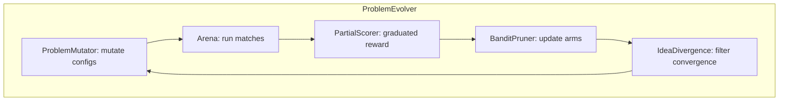

# Plan 191: Open-Ended Problem Evolution Arena

> **Research:** [Research 171](../.research/171_FrontierCS_FrontierSmith_Open_Ended_Problem_Evolution.md)
> **Depends On:** Plan 030 ✅ (BanditPruner), Plan 033 ✅ (Bomber Arena), Plan 034 ✅ (WASM Validator), Plan 049 ✅ (G-Zero), Plan 189 🔄 (MUSE ITSE)
> **Feature gates:** `partial_scoring`, `problem_mutator`, `idea_divergence`
> **Branch:** `develop`

---

## Why

FrontierCS shows open-ended problems expose massive gaps in model capability (human 95 vs best model 29). FrontierSmith shows closed→open problem synthesis is automatable and trains better models (+8.82 score). Our arenas already ARE open-ended problems with deterministic evaluators (WASM validators). The missing pieces:

1. **Partial scoring** — bandit learns from graduated reward, not just win/loss
2. **Problem mutation** — arena configs evolve into harder variants automatically
3. **Idea divergence** — prevents all bandit arms from converging to same strategy

All modelless. No LLM training. Slots into existing infrastructure.

---

## Architecture

---

## Tasks

### Phase 1: `PartialScorer` Trait + Bandit Integration

- [x] **T1.1** Create `PartialScorer` trait in `katgpt-core/src/traits.rs`
  - `fn partial_score(&self, trace: &GameTrace) -> f32` — graduated [0.0, 1.0]
  - `fn score_breakdown(&self, trace: &GameTrace) -> Vec<(&str, f32)>` — per-criteria
  - Feature gate: `partial_scoring`
- [x] **T1.2** Implement `WinLossScorer` — adapter: binary win/loss → {0.0, 1.0} (backward compat)
- [x] **T1.3** Implement `BomberPartialScorer` — bomber-specific partial scoring
  - Score = weighted blend: survival (0.4) + kills (0.3) + bombs_avoided (0.2) + efficiency (0.1)
  - Normalized against trivial baseline (stay still) and reference solution (HL bandit)
- [x] **T1.4** Extend `BanditPruner` to accept `PartialScorer` reward
  - When `partial_scoring` feature enabled: reward = `partial_score()` not `win/loss`
  - When disabled: existing binary behavior unchanged
- [ ] **T1.5** GOAT proof: bomber arena with partial scoring ≥ binary scoring
  - Test: `tests/partial_scoring_goat.rs`
  - Metric: bandit convergence speed (episodes to stable arm selection)
  - Expected: ≥30% faster convergence with partial reward

### Phase 2: `ProblemMutator` Trait + Config Mutation

- [x] **T2.1** Create `ProblemMutator` trait in `katgpt-core/src/traits.rs`
  - `fn mutate(&self, seed: &GameConfig) -> Vec<MutantConfig>`
  - `MutationKind` enum: `GoalReweight`, `ConstrainOutputs`, `GeneralizeInputs`
- [x] **T2.2** Create `MutantConfig` struct with `difficulty_delta` estimate
- [x] **T2.3** Implement `BomberConfigMutator` — deterministic bomber config mutation
  - `GoalReweight`: shift kill weight vs survival weight
  - `ConstrainOutputs`: add max-steps, forbidden zones, power-up limits
  - `GeneralizeInputs`: vary grid size (9→15→21), opponent count (1→4→8), wall density
- [x] **T2.4** Implement `GoConfigMutator` — go-specific mutation
  - `GoalReweight`: territory vs capture weight
  - `ConstrainOutputs`: board size variation (9→13→19)
  - `GeneralizeInputs`: handicap variation (+1/+2/+3 opponent_count)
- [x] **T2.5** Integrate with arena scheduler — `ProblemMutator` feeds configs to round-robin
  - New arena mode: `EvolutionArena` — mutates base config between rounds
  - Feature gate: `problem_mutator`
- [x] **T2.6** GOAT proof: mutated configs produce ≥1.5× arm diversity
  - Test: run bandit on 100 mutated bomber configs vs 100 fixed configs
  - Metric: number of distinct arms with >10% selection rate
  - Expected: ≥1.5× more active arms with mutation

### Phase 3: `IdeaDivergence` Metric + Collapse Prevention

- [x] **T3.1** Create `IdeaDivergence` struct in `src/pruners/idea_divergence.rs`
  - Score vector storage: `arm_scores: Vec<Vec<f32>>`
  - `fn divergence(arm_a, arm_b) -> f32` — normalized L2 distance (FrontierSmith eq. 3)
  - `fn is_novel(new_arm_scores) -> bool` — min divergence > threshold
- [x] **T3.2** Integrate `IdeaDivergence` into `BanditPruner` arm selection
  - Before promoting new arm: check novelty against existing arms
  - Non-novel arms get ε-greedy exploration penalty (reduced selection probability)
  - Feature gate: `idea_divergence`
- [x] **T3.3** Integrate with MUSE `PrunerTestGate` (Plan 189)
  - `IdeaDivergence` becomes a gate in skill registration: new skills must be strategically novel
  - Prevents catalog pollution with near-duplicate skills
- [x] **T3.4** GOAT proof: bandit with divergence filter converges faster and to better optimum
  - Test: bomber arena, 1000 rounds, with vs without divergence filter
  - Metrics: convergence time, final reward, arm diversity at convergence
  - Expected: convergence time ↓ ≥20%, final reward ≥ same, arm diversity ≥ 2× active arms

### Phase 4: Tests, Examples, Docs

- [x] **T4.1** Example: `partial_scoring_demo.rs` — before/after thinking vs non-thinking with partial scores
  - Shows bandit learning curve with partial reward vs binary reward
  - Prints per-episode score breakdown
- [x] **T4.2** Example: `problem_evolution_demo.rs` — config mutation → arena run → bandit update
  - Shows 3 rounds of config mutation with difficulty progression
  - Prints arm diversity metrics
- [x] **T4.3** Example: `idea_divergence_demo.rs` — divergence filtering prevents collapse
  - Shows 10 arms converging without filter vs maintaining diversity with filter
  - Prints divergence matrix
- [ ] **T4.4** CPU/GPU auto-route: `ThinkingController` integration
  - When GPU load high: `ProblemMutator` uses simpler mutations (CPU-only)
  - When GPU load low: use `ThinkingBandit` to decide mutation complexity (think → complex mutation)
  - Leverages existing `GpuLoadSignal` from Plan 194
- [x] **T4.5** Update README with new features in the feature flag table
- [x] **T4.6** Update `.docs/` with architecture diagram and benchmark results

---

## Feature Gates

| Feature | Depends On | Default | GOAT Required |
|---------|-----------|---------|---------------|
| `partial_scoring` | `bandit` | OFF until GOAT | Yes (T1.5) |
| `problem_mutator` | `bandit` | OFF until GOAT | Yes (T2.6) |
| `idea_divergence` | `bandit`, `partial_scoring` | OFF until GOAT | Yes (T3.4) |

**All three independent but composable.** `idea_divergence` works best with `partial_scoring` but can operate with binary scores too.

---

## Expected Performance

| Component | Hot-path Impact | Allocation | Parallelism |
|---|---|---|---|
| `PartialScorer::partial_score()` | ~50ns — simple weighted sum | Zero — reads from `GameTrace` | N/A — per-episode |
| `ProblemMutator::mutate()` | ~200ns — config parameter perturbation | Zero — stack-allocated `MutantConfig` | N/A — offline |
| `IdeaDivergence::is_novel()` | ~100ns — O(arms²) vector comparison | Zero — reads from stored vectors | Optional rayon for >32 arms |

None of these touch the decode hot path. All are per-episode or per-round operations.

---

## SOLID / DRY Compliance

- **S** (Single Responsibility): Each trait has one job — mutate, score, or measure diversity
- **O** (Open/Closed): New game domains add `ProblemMutator` + `PartialScorer` impls without touching core
- **L** (Liskov): `WinLossScorer` is a `PartialScorer` that returns {0.0, 1.0}
- **I** (Interface Segregation): `ProblemMutator` knows nothing about `PartialScorer` or `BanditPruner`
- **D** (Dependency Inversion): Arena depends on traits, not concrete implementations
- **DRY**: All three components share `GameTrace` + `GameConfig` types from `katgpt-core`

---

## TL;DR

Three modelless traits: `PartialScorer` (graduated episode reward), `ProblemMutator` (config evolution), `IdeaDivergence` (strategic novelty). All behind GOAT-gated feature flags. Zero decode-path overhead. Slots into existing arena/bandit/validator infrastructure. Default ON after GOAT proof.

Plan number: 191.
