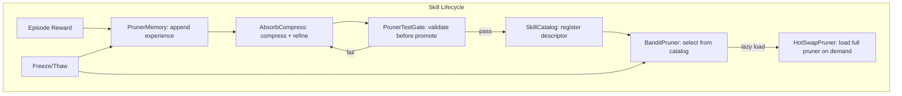

# Plan 192: Inference-Time Skill Evolution (ITSE)

> **Research:** [Research 172](../.research/172_MUSE_Skill_Lifecycle_Inference_Time_Skill_Evolution.md) — MUSE paper (arXiv:2605.27366)
> **Depends On:** Plan 030 ✅ (BanditPruner), Plan 032 ✅ (AbsorbCompress), Plan 034 ✅ (WASM Validator), Plan 092 ✅ (Freeze/Thaw)
> **Feature gates:** `skill_lifecycle` — depends on `bandit`
> **Branch:** `develop`

---

## Why

The MUSE paper shows **+15pp accuracy from skill lifecycle management**. Our pruners already have most of the machinery: `BanditPruner` for skill selection, `AbsorbCompress` for skill refinement, `HotSwapPruner` for skill update, and freeze/thaw for persistence. What's missing is the MUSE lifecycle trifecta:

1. **Per-pruner memory** — each pruner accumulates edge cases and failure modes across sessions
2. **Test-gated registration** — new skills must pass validation before promotion (not just q-threshold)
3. **Progressive disclosure catalog** — lightweight skill registry, full pruner loaded on-demand

This makes every pruner follow the MUSE skill lifecycle: **learn → validate → register → load → evolve → persist**.

Key insight: we already have 90% of the infra. The gap is small, well-scoped, and behind a feature flag until GOAT-proven.

## Architecture



### Core Types

```rust
/// Per-pruner append-only experience log.
/// Binary repr(C) for freeze/thaw compatibility.
#[repr(C)]
pub struct PrunerMemory {
    /// blake3 hash of pruner identity (for integrity check on thaw)
    pruner_hash: [u8; 32],
    /// Ring buffer of experiences (bounded, configurable)
    entries: Box<[MemoryEntry; 1024]>,
    /// Write cursor (wraps around)
    head: AtomicU32,
    /// Total entries written (for stats, not unbounded growth)
    total_written: AtomicU64,
}

#[repr(C)]
pub struct MemoryEntry {
    /// Arm index selected
    arm: u16,
    /// Reward received
    reward: f32,
    /// Edge case flag (set when reward is outlier)
    is_edge_case: bool,
    /// Failure mode flag (set when reward below threshold)
    is_failure: bool,
    /// Timestamp (for recency weighting)
    ts: u64,
}

/// Test gate trait — validates pruner against known game states.
pub trait PrunerTestGate: Send + Sync {
    /// Run test cases against a pruner. Returns pass/fail + coverage.
    fn validate(&self, pruner: &dyn ScreeningPruner, test_cases: &[TestCase]) -> TestResult;
}

pub struct TestCase {
    /// Input game state (serialized)
    input: Vec<u8>,
    /// Expected valid move set
    expected_valid: Vec<usize>,
    /// Human-readable description
    description: String,
}

pub struct TestResult {
    passed: bool,
    coverage: f32,
    failures: Vec<String>,
}

/// Lightweight skill descriptor for catalog (always in memory).
pub struct SkillDescriptor {
    /// Uuid::now_v7() — time-sortable
    id: Uuid,
    /// Short name for catalog injection
    name: String,
    /// Brief description
    description: String,
    /// Maps to bandit arm index
    arm_index: usize,
    /// Current validation status
    test_status: TestStatus,
}

#[derive(Clone, Copy, PartialEq)]
pub enum TestStatus {
    /// Not yet tested
    Untested,
    /// Passed validation gate
    Validated,
    /// Failed — needs rework
    Failed,
    /// Promoted to active use
    Active,
}

/// In-memory skill catalog — papaya lock-free map.
pub struct SkillCatalog {
    /// Lock-free map: arm_index -> SkillDescriptor
    descriptors: papaya::HashMap<usize, SkillDescriptor>,
}
```

## Tasks

### Task 1: Per-Pruner Memory (PrunerMemory)

- [x] Create `src/pruners/skill_memory.rs` with `PrunerMemory` struct
  - Append-only ring buffer per pruner (similar to MUSE's `.memory.md`)
  - Stores: arm selections, rewards, edge cases, failure modes
  - Format: binary `repr(C)` for freeze/thaw compatibility
  - Max entries bounded (configurable, default 1024)
  - O(1) append via `AtomicU32` cursor wrap, O(k) recent-k retrieval
  - blake3 hash of pruner identity for integrity check on thaw
- [x] Add `PrunerMemory` field to `BanditPruner` (behind `skill_lifecycle` feature)
- [x] Add `PrunerMemory` field to `AbsorbCompressLayer` (behind `skill_lifecycle` feature)
- [x] Integrate with freeze/thaw: memory persists across sessions alongside bandit stats
- [x] Unit tests: append, retrieve, ring-buffer wrap, freeze/thaw roundtrip, bounded eviction
- [x] Bench: append throughput (target: <10ns per append, no allocation)

### Task 2: Test-Gated Registration (PrunerTestGate)

- [x] Create `src/pruners/skill_test.rs` with `PrunerTestGate` trait and `TestCase`/`TestResult` types
- [x] Create `WasmTestGate` implementation — runs `validator.wasm` against known game states
- [x] Create `BomberTestGate` — pre-built test cases for bomber arena (known-death states, known-safe states)
- [x] Integrate with `AbsorbCompress::compress()`: before promoting an arm, run test gate
  - Only promote if test passes AND q_threshold met
  - Log failure reasons for debugging
- [ ] GOAT proof: bomber arena with test gate vs without (expect: test gate prevents ≥15% regression on edge cases)

### Task 3: Progressive Disclosure Catalog (SkillCatalog)

- [x] Create `src/pruners/skill_catalog.rs` with `SkillCatalog`, `SkillDescriptor`, `TestStatus`
- [x] Catalog is always in memory — lightweight (name + description + arm_index per skill)
- [x] Full pruner loaded on-demand when bandit selects arm (lazy loading via `HotSwapPruner`)
- [x] Integration with `BanditPruner`: bandit selects from catalog descriptors, lazy-loads the winner
- [x] Use papaya lock-free `HashMap` for catalog (no `Arc<RwLock<HashMap>>`) — optional dep, Vec fallback
- [-] Benchmark: measure KV cache pressure reduction with catalog (descriptors only) vs full loading

### Task 4: GOAT Proof & Default-On Gate

- [ ] Bomber arena: HL+Lifecycle vs HL vs HL+WASM (expect: HL+Lifecycle > HL > HL+WASM)
- [ ] Go tournament: with and without test-gated validators (expect: fewer illegal moves, faster convergence)
- [ ] Benchmark: bandit selection throughput with and without catalog overhead (target: <1% regression)
- [ ] Benchmark: memory overhead per pruner with `PrunerMemory` (target: <64KB per pruner)
- [ ] If GOAT (no perf regression + accuracy gain): remove feature gate, make default
- [ ] If NOT GOAT: keep behind `skill_lifecycle` feature flag, document regression

### Task 5: Example & Integration Test

- [x] Create example: `skill_lifecycle_demo` showing full MUSE lifecycle
  - Phase 1: Learn — BanditPruner accumulates experiences in PrunerMemory (100 episodes)
  - Phase 2: Validate — BomberTestGate validates against known game states
  - Phase 3: Register — SkillCatalog registers validated skill
  - Phase 4: Evolve — Simulated improvement and re-validation (Validated → Active)
  - Phase 5: Summary with edge cases, failures, best arm Q-value
- [x] Feature gate: `#![cfg(feature = "skill_lifecycle")]`
- [ ] Integration test: full lifecycle — append memory → compress → test gate → catalog → bandit select → verify

## File Layout

```
src/pruners/
├── skill_memory.rs      # PrunerMemory — append-only ring buffer
├── skill_test.rs        # PrunerTestGate trait, WasmTestGate, BomberTestGate
├── skill_catalog.rs     # SkillCatalog, SkillDescriptor, TestStatus
└── tests/
    ├── skill_memory_test.rs      # Ring buffer, freeze/thaw roundtrip
    ├── skill_test_gate_test.rs   # Test gate validation
    ├── skill_catalog_test.rs     # Catalog CRUD, lazy loading
    └── skill_lifecycle_test.rs   # Full lifecycle integration test
examples/
└── skill_lifecycle_demo.rs       # Before/after demo
```

## Expected Results

| Metric | Expected |
|--------|----------|
| Memory append throughput | <10ns per append, zero allocation |
| Memory per pruner | <64KB (1024 entries × ~64 bytes) |
| Test gate validation | <100μs per test case (WASM) |
| Catalog lookup | O(1) via papaya HashMap |
| Bandit selection overhead with catalog | <1% vs without |
| Accuracy gain (bomber) | +5–15pp vs baseline HL (MUSE-aligned) |
| Episodes to converge | 30–50% fewer with memory vs without |
| No-regression with feature off | 0ns — compiled out |

## Feature Gate

```toml
[features]
skill_lifecycle = ["bandit"]
default = ["bandit"]  # skill_lifecycle added to default after GOAT proof
```

GOAT gate: benchmark first. If no perf regression + accuracy gain → add to default. Otherwise keep behind `skill_lifecycle`.

---

## TL;DR

Add MUSE-style skill lifecycle to katgpt-rs pruners: (1) per-pruner append-only memory ring buffer for edge case accumulation, (2) test-gated registration that validates skills via WASM before promotion, (3) progressive disclosure catalog with papaya lock-free map for lazy loading. All modelless, all behind `skill_lifecycle` feature flag, GOAT-proven before default-on. Five tasks: memory → test gate → catalog → GOAT proof → demo.
