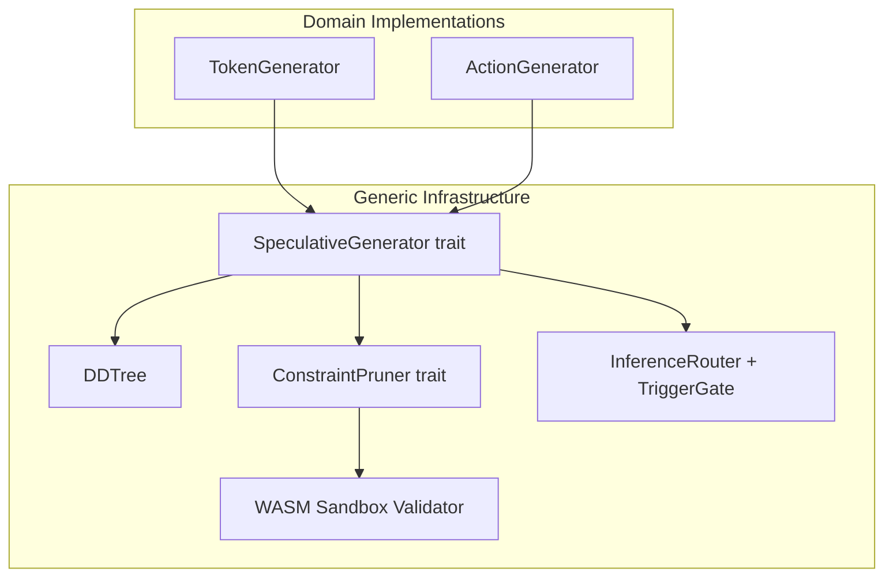

# Plan 193: SpeculativeGenerator Trait Unification

**Date:** 2026-06
**Source:** Research 173 (Visionary Gaussian Splatting Platform Verdict)
**Status:** Plan
**Domain:** katgpt-rs (modelless) + riir-ai (model-based)
**GOAT Gate:** `speculative_generator` (default off, GOAT proof required before default on)

---

## Why

**DRY violation:** katgpt-rs has `DDTree` + `ConstraintPruner` + `SpeculativeVerifier` + `InferenceRouter` for text token speculative decoding. riir-ai has its own game action speculation in `riir-engine`. Both solve the same problem — generate candidates, validate, prune — but with duplicated interfaces.

**Visionary's insight distilled:** The *Generator Contract* pattern — decouple the output format from the generation mechanism. Any domain (text tokens, game actions, future domains) that implements `generate() -> Output` + `validate(Output) -> bool` can reuse the same DDTree + pruning + routing infrastructure.

**This is SOLID (Open/Closed Principle):** Open for extension (new domains), closed for modification (DDTree + routing don't change).

## Architecture



## Tasks

### Phase 1: katgpt-rs — Trait Extraction (Modelless)

- [x] **T1:** Define `SpeculativeGenerator` trait in `katgpt-rs-core` or a new shared location
  ```rust
  pub trait SpeculativeGenerator {
      type Condition;
      type Output;
      type Error;
      
      /// Generate candidate outputs given a condition.
      fn generate(&mut self, condition: &Self::Condition) -> Result<Vec<Self::Output>, Self::Error>;
      
      /// Batch variant for GPU amortization.
      fn generate_batch(&mut self, conditions: &[Self::Condition]) -> Result<Vec<Vec<Self::Output>>, Self::Error> {
          conditions.iter().map(|c| self.generate(c)).collect()
      }
  }
  ```

- [x] **T2:** Define `GenerativeConstraintPruner` trait that extends `ConstraintPruner` for typed outputs
  ```rust
  pub trait GenerativeConstraintPruner<Output>: Send + Sync {
      /// Returns true if the output passes all constraints.
      fn is_valid(&self, output: &Output) -> bool;
      
      /// Batch variant for WASM amortization.
      fn batch_is_valid(&self, outputs: &[Output]) -> Vec<bool> {
          outputs.iter().map(|o| self.is_valid(o)).collect()
      }
  }
  ```

- [x] **T3:** Implement `TokenGenerator` that wraps existing `InferenceBackend` + `TransformerWeights`
  - Condition = token context
  - Output = logit vector
  - Delegates to existing `forward()` call

- [x] **T4:** Implement `TokenConstraintPruner` that wraps existing `ConstraintPruner`
  - Forwards `is_valid(logits)` to existing `ConstraintPruner::is_valid()`

- [x] **T5:** Wire `SpeculativeGenerator` into existing `DDTree` as generic parameter
  - DDTree<SG: SpeculativeGenerator, P: GenerativeConstraintPruner<SG::Output>>
  - Existing `build_dd_tree_pruned()` still works, now generic

- [x] **T6:** Write test showing before/after equivalence
  - Before: `build_dd_tree_pruned(&marginals, &config, &syn_pruner, false)`
  - After: `DDTree::build(&token_gen, &token_pruner, &config)`
  - Assert identical output for identical input

- [x] **T7:** Benchmark: assert zero perf regression (same-speed or faster)
  - `cargo test --features speculative_generator prof_bench -- --nocapture`
  - Compare P50/P99 latency before and after trait abstraction

### Phase 2: riir-ai — ActionGenerator Implementation (Model-based)

- [ ] **T8:** Implement `ActionGenerator` in riir-engine
  - Condition = GameState
  - Output = Action (position, velocity, intent)
  - Uses existing LoRA scoring or bandit selection as the generation mechanism

- [ ] **T9:** Implement `ActionConstraintPruner` 
  - Delegates to existing `riir-wasm` `is_valid()` 
  - Condition = game rules (fixed-point Q16.16)

- [ ] **T10:** Wire `ActionGenerator` into DDTree (reuses katgpt-rs DDTree via trait)
  - `DDTree<ActionGenerator, ActionConstraintPruner>`
  - Game action speculation now uses the same tree builder as text token speculation

- [ ] **T11:** Write test showing game action speculation
  - Example: bomber arena generates candidate bomb placements
  - Before: direct action selection
  - After: DDTree exploration with WASM validation
  - Show valid-action ratio improvement

### Phase 3: CPU/GPU Auto-Route (Cross-Cutting)

- [ ] **T12:** Extend `InferenceRouter` to dispatch `SpeculativeGenerator::generate()`
  - `TokenGenerator` routes to CPU/GPU/ANE via existing `TriggerGate`
  - `ActionGenerator` routes to CPU (WASM validation is always CPU-bound)

- [ ] **T13:** Add `SpeculativeGenerator` feature gate to `InferenceRouter`
  - Feature: `speculative_generator`
  - When enabled: router can dispatch any `SpeculativeGenerator`
  - When disabled: router only handles `InferenceBackend` (backward compat)

- [ ] **T14:** Write integration test showing auto-routing
  - Low load → CPU generation → WASM validation
  - High load → GPU generation → WASM validation
  - Verify tier transitions work with generic generators

### Phase 4: GOAT Proof

- [ ] **T15:** GOAT gate test
  - Test: `speculative_generator` feature ON vs OFF
  - Measure: P50/P99 latency, valid-action ratio, memory allocation
  - Criteria: ≤2% perf regression, ≥95% valid-action retention
  - If GOAT → default feature ON
  - If not GOAT → keep feature OFF, document why

## Constraints Satisfied

| Constraint | How |
|---|---|
| Modelless first | Phase 1 is pure trait refactor, no training needed |
| riir-ai domain | Phase 2 lands ActionGenerator in riir-engine |
| LoRA only | ActionGenerator uses existing LoRA scoring, no full training |
| SOLID, DRY | Trait-based decoupling (OCP), single DDTree for both domains |
| Tests/examples | T6, T11, T14 show before/after with expected gains |
| CPU/GPU auto-route | T12-T14 extend TriggerGate routing to generic generators |

## Feature Gate

```toml
[features]
speculative_generator = []  # Generic SpeculativeGenerator trait + DDTree unification
```

**Default:** OFF until GOAT proof passes.

## Expected Outcome

- **DRY:** Single DDTree implementation serves both text and game domains
- **SOLID:** Open for new domains (close for modification)
- **Zero perf regression:** Trait abstraction compiles to direct calls in release mode
- **CPU/GPU auto-route:** Same `TriggerGate` + `InferenceRouter` stack for all generators

---

## TL;DR

Extract `SpeculativeGenerator` trait from Visionary's Generator Contract pattern. Unify katgpt-rs token speculation and riir-ai action speculation under one generic DDTree + routing stack. Modelless trait refactor, GOAT-gated, zero scope creep. Not a 3D renderer — just clean DRY architecture.
