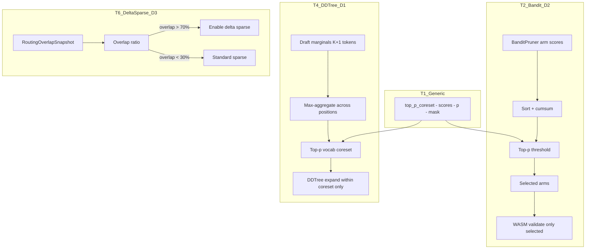

# Plan 201: dMoE Modelless — Block-Level Coreset Distillation

> **Parent**: Research 161 (dMoE Block-Level Expert Routing)
> **Depends**: Plan 030 (BanditPruner) ✅, Plan 176 (Three-Way Compute / TriggerGate) ✅, Plan 096 (MoE SD — T4 delta sparse) ⚠️
> **Scope**: D1 (DDTree vocab coreset), D2 (adaptive top-p bandit arms), D3 (delta sparse overlap gate)
> **Feature Gates**: `vocab_coreset` (D1, opt-in), `bandit_top_p` (D2, **default ON**)

## Tasks

- [ ] T1: Implement `top_p_coreset()` generic utility in `src/types.rs` — sort, cumsum, threshold → coreset mask
- [ ] T2: D2 — Adaptive top-p for BanditPruner arm selection (`bandit_top_p` feature, default ON)
- [ ] T3: D2 GOAT benchmark — 4-player bomber: top-p vs fixed top-k arm selection, measure arm count + win rate + WASM call count
- [ ] T4: D1 — DDTree vocab coreset during speculative decode (`vocab_coreset` feature, opt-in)
- [ ] T5: D1 GOAT benchmark — spec decode: vocab coreset vs full vocab, measure branching factor + tree depth + acceptance rate
- [ ] T6: D3 — Delta sparse overlap gate: reuse Plan 096 T1 `RoutingOverlapSnapshot`, add top-p threshold for delta sparse enable/disable

## Objective

Distill dMoE's fundamental principle — **aggregate granular scores → coarser unit → adaptive top-p coreset → restrict selection** — into three modelless enhancements:

1. **D2 (Primary)**: BanditPruner currently selects top-k arms. Replace with adaptive top-p that dynamically controls arm budget based on score concentration. When confident (concentrated scores) → fewer arms → faster WASM validation. When uncertain → more arms → better exploration.

2. **D1 (Secondary)**: During speculative decode, aggregate K+1 draft marginals → vocab coreset → restrict DDTree expansion. Reduces branching factor from |V| to |coreset|.

3. **D3 (Enhancement)**: Use dMoE's block-level overlap insight to gate delta sparse matmul on/off based on measured coreset overlap between consecutive tokens.

## Architecture



## T1: Generic `top_p_coreset()` Utility

### Location
`katgpt-rs/src/types.rs`

### Implementation

```rust
/// Adaptive top-p coreset selection (distilled from dMoE, Research 161).
///
/// Given a slice of scores, returns a boolean mask selecting the minimal
/// set of indices whose cumulative probability mass >= `p`.
///
/// Algorithm:
/// 1. Sort scores descending
/// 2. Normalize to probability distribution (softmax or simple normalize)
/// 3. Cumulative sum
/// 4. Select all indices where cumsum < p (plus the first that crosses)
///
/// Pre-allocated scratch buffer variant for hot-path use.
#[inline]
pub fn top_p_coreset(
    scores: &[f32],
    p: f32,
    // Pre-allocated scratch: [indices, sorted_scores, cumsum] — caller owns
    scratch_indices: &mut [usize],
    scratch_sorted: &mut [f32],
    mask: &mut [bool],
) -> usize {
    let n = scores.len();
    debug_assert_eq!(scratch_indices.len(), n);
    debug_assert_eq!(scratch_sorted.len(), n);
    debug_assert_eq!(mask.len(), n);

    // Initialize indices
    for (i, idx) in scratch_indices.iter_mut().enumerate() {
        *idx = i;
    }

    // Sort by score descending (partial sort would be better, but for n <= 64 this is fine)
    scratch_indices.sort_by(|&a, &b| scores[b].partial_cmp(&scores[a]).unwrap_or(std::cmp::Ordering::Equal));

    // Copy sorted scores and normalize
    let total: f32 = scratch_indices.iter()
        .map(|&i| scores[i])
        .map(|s| if s > 0.0 { s } else { 0.0 })
        .sum();

    if total <= 0.0 {
        // Degenerate: select all
        for m in mask.iter_mut() { *m = true; }
        return n;
    }

    let mut cumsum = 0.0f32;
    let mut selected = 0usize;
    for (rank, &idx) in scratch_indices.iter().enumerate() {
        let prob = (scores[idx].max(0.0)) / total;
        cumsum += prob;
        mask[idx] = true;
        selected += 1;
        if cumsum >= p {
            // Fill remaining with false
            for &remaining_idx in &scratch_indices[rank + 1..] {
                mask[remaining_idx] = false;
            }
            break;
        }
    }

    selected
}
```

### Feature Gate
No feature gate — generic utility used by D1 and D2.

## T2: Adaptive Top-p Bandit Arms (D2) — DEFAULT ON

### Location
`katgpt-rs/src/pruners/bandit.rs` (or wherever BanditPruner arm selection lives)

### Feature Gate
`bandit_top_p` — **default ON**. GOAT proof (T3) confirms savings > overhead.

### Implementation Sketch

```rust
/// Adaptive top-p arm selection.
/// Replaces fixed top-k with dynamic arm budget based on score concentration.
///
/// When scores are concentrated (clear winner) → selects fewer arms → faster.
/// When scores are dispersed (uncertain) → selects more arms → better exploration.
///
/// Returns indices of selected arms.
pub fn select_arms_top_p(
    q_values: &[f32],
    ucb_bonus: &[f32],
    p: f32,  // default: 0.85
) -> Vec<usize> {
    let scores: Vec<f32> = q_values.iter()
        .zip(ucb_bonus.iter())
        .map(|(&q, &u)| q + u)
        .collect();
    let n = scores.len();

    // For small n (≤16 game actions), direct sort is fastest
    let mut indices: Vec<usize> = (0..n).collect();
    indices.sort_by(|&a, &b| scores[b].partial_cmp(&scores[a]).unwrap_or(std::cmp::Ordering::Equal));

    let total: f32 = scores.iter().map(|s| s.max(0.0)).sum();
    if total <= 0.0 { return indices; }

    let mut cumsum = 0.0f32;
    let mut selected = Vec::with_capacity(n);
    for &idx in &indices {
        cumsum += scores[idx].max(0.0) / total;
        selected.push(idx);
        if cumsum >= p { break; }
    }
    selected
}
```

### Integration with BanditPruner

The `BanditPruner` currently does:
```rust
// Current: fixed top-k
let arms: Vec<usize> = select_top_k(&combined_scores, k);
for arm in &arms {
    if let Some(wasm) = &self.validator {
        if !wasm.is_valid(state, *arm) { continue; }
    }
    // evaluate arm...
}
```

After D2:
```rust
// New: adaptive top-p
let arms: Vec<usize> = select_arms_top_p(&q_values, &ucb_bonus, self.top_p);
for arm in &arms {
    if let Some(wasm) = &self.validator {
        if !wasm.is_valid(state, *arm) { continue; }
    }
    // evaluate arm...
}
```

### Default Parameters
- `p = 0.85` — captures ~85% of score mass, typically selects 2-4 arms out of 6-8
- At p=0.95 → selects more arms (closer to current behavior)
- At p=0.70 → aggressive, fewer arms (good for confident situations)

## T3: D2 GOAT Benchmark

### Location
`katgpt-rs/tests/bench_201_dmoe_bandit_top_p_goat.rs`

### Criteria

| # | Proof | Target | Method |
|---|-------|--------|--------|
| 1 | Arm count reduction | Mean arm count ≤ 60% of top-k | 1000 bomber frames, count selected arms |
| 2 | Win rate preservation | ≤ 1% win rate loss vs fixed top-k | 100-round bomber tournament: top-p vs top-k |
| 3 | WASM call reduction | ≥ 30% fewer WASM calls | Count is_valid calls per frame |
| 4 | Top-p overhead | ≤ 200ns for 8 arms | Micro-benchmark: sort + cumsum |
| 5 | Adaptivity proof | CV of arm count ≥ 10% across frames | Measure arm count distribution |

**PASS**: Criteria 1-3 must all pass. Criteria 4-5 are informational.
**GOAT**: If PASS → promote to default ON.

### Expected Results
Based on dMoE's 4.77× expert reduction at 99.11% quality:
- Arm count: ~3-4 out of 6 (50-60% reduction)
- Win rate: ≤ 1% change (bandit is adaptive, top-p just controls budget)
- WASM calls: ~40-50% reduction (fewer arms = fewer validations)

## T4: DDTree Vocab Coreset (D1) — OPT-IN

### Location
`katgpt-rs/src/speculative/` — new module or extension of existing drafter

### Feature Gate
`vocab_coreset` — **opt-in**. Requires GOAT proof (T5) before promotion to default.

### Implementation Sketch

```rust
/// Compute vocab coreset from K+1 draft marginals.
/// Distilled from dMoE block-level expert aggregation (Research 161, D1).
///
/// Aggregates marginals by taking max probability per vocab token across
/// all draft positions, then applies top-p to select the coreset.
pub fn vocab_coreset(
    marginals: &[&[f32]],  // K+1 marginals, each [vocab_size]
    p: f32,
    coreset: &mut [bool],  // output mask, pre-allocated [vocab_size]
) -> usize {
    let vocab_size = marginals[0].len();
    let mut max_scores = vec![0.0f32; vocab_size];

    // Aggregate: max probability per token across positions
    for marginal in marginals {
        for (v, &score) in marginal.iter().enumerate() {
            max_scores[v] = max_scores[v].max(score);
        }
    }

    // Top-p selection
    let mut indices: Vec<usize> = (0..vocab_size).collect();
    indices.sort_by(|&a, &b| max_scores[b].partial_cmp(&max_scores[a]).unwrap_or(std::cmp::Ordering::Equal));

    let total: f32 = max_scores.iter().map(|s| s.max(0.0)).sum();
    let mut cumsum = 0.0f32;
    let mut selected = 0usize;

    for &idx in &indices {
        cumsum += max_scores[idx].max(0.0) / total;
        coreset[idx] = true;
        selected += 1;
        if cumsum >= p { break; }
    }

    // Fill rest with false
    for &idx in &indices[selected..] {
        coreset[idx] = false;
    }

    selected
}
```

### Integration with DDTree

```rust
// In DDTree expansion:
if let Some(coreset_mask) = &self.vocab_coreset_mask {
    // Only expand tokens within coreset
    for (v, &in_coreset) in coreset_mask.iter().enumerate() {
        if !in_coreset { continue; }
        if marginals[v] < threshold { continue; }
        // ... add to tree
    }
} else {
    // Standard expansion (all vocab)
    for (v, &score) in marginals.iter().enumerate() {
        if score < threshold { continue; }
        // ... add to tree
    }
}
```

### Parameters
- `p = 0.95` — conservative, captures 95% of probability mass
- Typical coreset size: 50-200 tokens out of 32K vocab
- ConstraintPruner operates AFTER coreset filtering — safety net

## T5: D1 GOAT Benchmark

### Location
`katgpt-rs/tests/bench_201_dmoe_vocab_coreset_goat.rs`

### Criteria

| # | Proof | Target | Method |
|---|-------|--------|--------|
| 1 | Branching reduction | Coreset size ≤ 1% of vocab | Spec decode with Config::draft(), count DDTree nodes |
| 2 | Acceptance rate | ≤ 2% acceptance rate loss vs no coreset | K=5 draft, measure acceptance rate |
| 3 | Latency improvement | ≥ 20% tree construction speedup | Time DDTree build with/without coreset |
| 4 | Safety net | ConstraintPruner never rejects coreset-only tokens | Verify that all accepted coreset tokens also pass ConstraintPruner |

**PASS**: Criteria 1-3 must all pass.
**GOAT**: If PASS → promote to default ON.

## T6: Delta Sparse Overlap Gate (D3) — Enhancement

### Location
Enhances Plan 096 T4 (Delta Sparse Matmul)

### Implementation

```rust
/// Gate for delta sparse matmul based on routing overlap.
/// Distilled from dMoE's observation that expert concentration varies.
///
/// Only enable delta sparse when there's significant overlap between
/// consecutive tokens' active neurons. When overlap is low, the overhead
/// of tracking shared neurons dominates.
pub fn should_use_delta_sparse(overlap: &RoutingOverlapSnapshot) -> bool {
    // Only worth it if average overlap > 30% across K+1 tokens
    let avg_overlap: f64 = overlap.step_overlap.iter().sum::<f64>()
        / overlap.step_overlap.len().max(1) as f64;
    avg_overlap > 0.30
}
```

### Integration
Use existing `RoutingOverlapSnapshot` from Plan 096 T1. Add overlap gate before calling `sparse_matmul_delta()`.

## Feature Gate Summary

| Gate | Scope | Default | Plan |
|------|-------|---------|------|
| (none) | T1: `top_p_coreset()` utility | Always available | 201 |
| `bandit_top_p` | T2: Adaptive bandit arms | ✅ **Default ON** | 201 |
| `vocab_coreset` | T4: DDTree vocab coreset | ❌ Opt-in (pending GOAT) | 201 |

## SOLID / DRY Compliance

Per [optimization.md](../.contexts/optimization.md):

- **Single Responsibility**: `top_p_coreset()` does one thing — select coreset from scores
- **DRY**: D1 and D2 share the same `top_p_coreset()` utility, different callers
- **Pre-allocated scratch**: T1 uses caller-owned buffers for hot-path use
- **Profile first**: T3/T5 benchmarks before promoting any opt-in to default
- **Measure per-component**: Each task has its own GOAT proof with specific criteria

## Module Structure

```
katgpt-rs/
├── src/
│   ├── types.rs                          # top_p_coreset() (T1)
│   ├── pruners/
│   │   └── bandit.rs                     # select_arms_top_p() (T2)
│   └── speculative/
│       └── vocab_coreset.rs              # vocab_coreset() (T4)
├── tests/
│   ├── bench_201_dmoe_bandit_top_p_goat.rs   # T3
│   └── bench_201_dmoe_vocab_coreset_goat.rs  # T5
└── .benchmarks/
    └── 049_dmoe_block_coreset_goat.md        # Results
```

## References

- dMoE paper: arXiv:2605.30876
- Research 161: `161_dMoE_Block_Level_Expert_Routing.md`
- Plan 030: BanditPruner infrastructure
- Plan 096: MoE SD CoDesign (delta sparse T4, overlap diagnostic T1)
- Plan 176: Three-Way Compute / TriggerGate
- Plan 194: Adaptive CoT (bandit learns when to think)
- Optimization guidelines: `.contexts/optimization.md`
