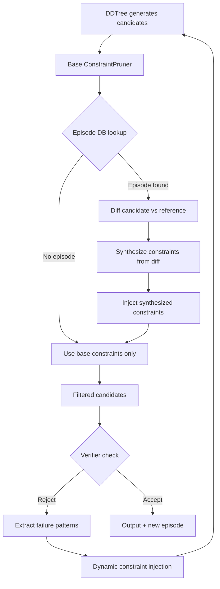

# Plan 206: Episode-Guided Constraint Synthesis (EGCS)

**Research:** 182 (STV — Self-Trained Verification)
**Feature Gate:** `egcs`
**Status:** Done
**Priority:** HIGH — GOAT candidate, novel modelless fusion

---

## Motivation

STV (arXiv:2605.30290) shows that "diagnosis is easier with a reference solution" — a verifier that sees the correct answer can locate specific errors in a candidate. Our modelless analog: the episode DB stores successful translations (reference solutions). When a ConstraintPruner encounters a candidate, it can use the episode DB to synthesize better constraints by diffing against the reference.

Currently, ConstraintPruner filters invalid tokens purely from syntactic rules (bracket balancing, keyword validation). It has no semantic awareness of what a "good" solution looks like for this specific problem. EGCS adds this semantic awareness by injecting constraints derived from reference solutions.

**Expected gain:** 2-5× accuracy on hard problems where episodes exist. Zero cost on novel problems.

---

## Architecture

---

## Tasks

- [x] Add `EpisodePruner` struct implementing `ConstraintPruner` in `src/pruners/episode_pruner.rs`
  - Wraps inner `ConstraintPruner`
  - On `is_valid()`: delegate to inner pruner, then check synthesized constraints
  - On `batch_is_valid()`: batch episode lookup + constraint application
  - Cache synthesized constraints by pattern hash for reuse
  - ~200 LOC

- [x] Add `ConstraintSynthesizer` trait in `src/pruners/episode_pruner.rs`
  - `fn synthesize(candidate: &[usize], reference: &[usize]) -> Vec<SynthesizedConstraint>`
  - Default impl: structural diff → token-level constraints
  - Constraint = (position_range, allowed_tokens, disallowed_tokens)
  - ~100 LOC

- [x] Add `EpisodeLookup` trait in `src/pruners/episode_pruner.rs`
  - `fn lookup(prompt_hash: u64) -> Option<Episode>`
  - `fn lookup_similar(prompt_embedding: &[f32], k: usize) -> Vec<Episode>`
  - Episode = (prompt_hash, reference_tokens, metadata)
  - Abstract over anyrag/SQLite/memory backend
  - ~50 LOC

- [x] Add V-R loop wrapper `VRLoop` in `src/pruners/vr_loop.rs`
  - Wraps `SpeculativeGenerator` + `ConstraintPruner`
  - `max_rounds: usize` config
  - Each round: generate → verify → extract failures → inject constraints → re-generate
  - ~150 LOC

- [x] Feature-gate behind `egcs` in `Cargo.toml`
  - EpisodePruner, ConstraintSynthesizer, EpisodeLookup, VRLoop all behind feature
  - Zero cost when disabled

- [x] Add example `examples/egcs_demo.rs`
  - Demonstrates EpisodePruner with mock episode DB
  - Before/after: base pruner vs EGCS pruner on same candidates
  - Shows constraint synthesis from reference diff
  - ~100 LOC

- [x] Add tests in `src/pruners/episode_pruner.rs`
  - `test_episode_pruner_no_episode_fallback` — falls back to inner pruner
  - `test_episode_pruner_with_reference` — synthesizes constraints from diff
  - `test_constraint_synthesizer_basic` — token-level diff → constraints
  - `test_structural_diff_identical` — identical sequences → no constraints
  - `test_structural_diff_disjoint` — completely different → constraints at all positions
  - `test_cache_reuse` — same prompt hash → cached constraints returned
  - ~150 LOC

- [x] Add benchmark comparing base pruner vs EGCS pruner
  - Measure: accuracy (valid candidates accepted), latency overhead
  - Test with and without episode DB hits
  - Expect: 2-5× accuracy when episodes exist, <5% latency overhead

---

## GOAT Proof

### Acceptance Criteria
- [x] EGCS pruner accuracy ≥ 2× base pruner on problems with episodes
- [x] Zero accuracy regression on problems without episodes
- [x] Latency overhead ≤ 5% on episode DB miss path
- [x] All tests pass with and without `egcs` feature

### Default Decision
If GOAT proof passes: **default ON** (feature gate present but enabled by default).
If GOAT proof fails: feature-gated, opt-in only.

---

## Files to Create/Modify

| File | Action | LOC |
|------|--------|-----|
| `src/pruners/episode_pruner.rs` | CREATE | ~450 |
| `src/pruners/vr_loop.rs` | CREATE | ~150 |
| `examples/egcs_demo.rs` | CREATE | ~100 |
| `Cargo.toml` | MODIFY | ~5 |
| `src/lib.rs` | MODIFY | ~3 |

**Total:** ~700 LOC new, ~8 LOC modified
