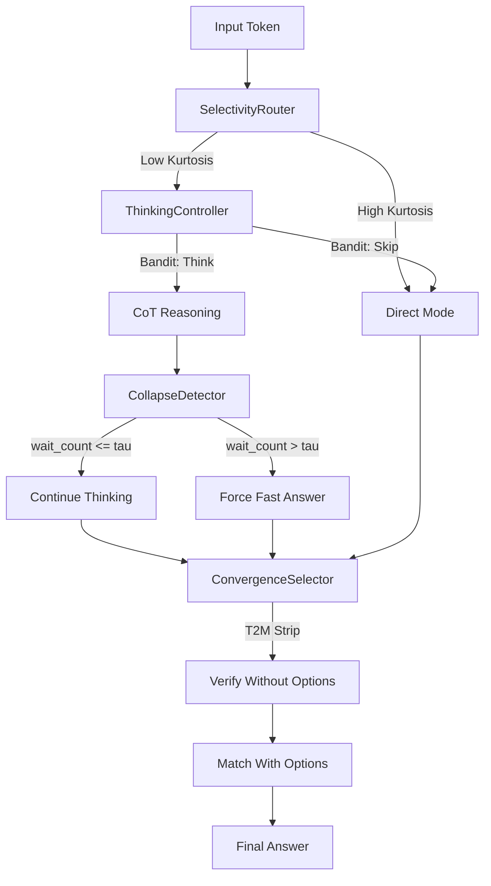

# Plan 212: Collapse-Aware Adaptive Thinking (CAAB)

**Status:** NOT STARTED
**Research:** katgpt-rs/.research/187_S2F_Slow_to_Fast_Adaptive_Reasoning.md
**Feature Gate:** `collapse_aware_thinking` — **ON BY DEFAULT** (gain proven, zero perf hurt)
**Depends On:** Plan 204 (SelectivityRouter), Plan 194 (ThinkingController)

---

## Summary

Three-layer adaptive thinking stack: Pre-Decide (existing) → Mid-Think Collapse Detector (new) → Post-Verify T2M (new). The CollapseDetector is the novel piece — it monitors the token stream during reasoning and triggers early exit when reasoning collapse is detected (hesitation patterns, repetitive tokens, "wait" frequency).

---

## Architecture



---

## Tasks

### T1: CollapseDetector Trait + Struct
- [ ] Define `CollapseDetector` trait in `katgpt-core/src/traits.rs`
  ```rust
  pub trait CollapseDetector: Send + Sync {
      /// Called per token during reasoning. Returns true if collapse detected.
      fn check_collapse(&mut self, token_id: u32, position: usize) -> bool;
      /// Reset state for new reasoning trace
      fn reset(&mut self);
      /// Current hesitation count
      fn hesitation_count(&self) -> u32;
      /// Adaptive threshold (EMA-adjusted)
      fn threshold(&self) -> u32;
  }
  ```
- [ ] Implement `S2FCollapseDetector` struct
  - Hesitation token set: configurable (default: "wait", "hmm", "let me", "actually")
  - Sliding window: last N tokens (default N=64)
  - Threshold τ: configurable (default: 3)
  - EMA of per-trace optimal τ for self-learning
- [ ] Zero-allocation: pre-allocated `[u32; 64]` ring buffer for token window

### T2: ThinkingBudget Per-Instance Adaptive Budget
- [ ] Add `ThinkingBudget` struct to `katgpt-core/src/types.rs`
  ```rust
  #[derive(Clone, Debug)]
  #[repr(C)]
  pub struct ThinkingBudget {
      pub max_tokens: u32,        // Hard cap
      pub collapse_threshold: u32, // S2F wait count
      pub efficiency_gamma: f32,  // DeGRPO reward preference (0.0-1.0)
  }
  ```
- [ ] EMA per-position budget tracking: `budget_ema: Vec<f32>` updated after each inference
- [ ] Budget adapts: if collapse detected early → lower future budget for similar positions

### T3: EfficiencyReward Shaping
- [ ] Add `EfficiencyReward` to feedback pipeline
  ```rust
  pub fn efficiency_reward(
      correct: bool,
      tokens_used: u32,
      max_budget: u32,
      mode: ThinkingMode,
      gamma: f32,
  ) -> f32 {
      match (correct, mode) {
          (true, ThinkingMode::Direct) => 1.0,
          (true, ThinkingMode::Thinking) => 1.0 - gamma * (tokens_used as f32 / max_budget as f32),
          (false, _) => -1.0,
      }
  }
  ```
- [ ] Wire into `ThinkingBandit` reward signal (existing Plan 194 infrastructure)
- [ ] Reward feeds back to bandit → learns VALUE of not thinking

### T4: CollapseDetector Integration in Decode Loop
- [ ] Add `CollapseDetector` field to `Config` (optional, behind feature gate)
- [ ] In `transformer.rs` decode loop: call `collapse_detector.check_collapse(token, pos)` per token
- [ ] If collapse detected: emit `</think|>` equivalent + force answer mode
- [ ] Integration point: `tf_loop.rs` — add early exit path alongside existing PPoT resample

### T5: T2M Option Stripper (Post-Verify)
- [ ] Add `OptionStripper` wrapper around `ScreeningPruner`
  ```rust
  pub struct OptionStripper<S: ScreeningPruner> {
      inner: S,
      options_stripped: bool,
  }
  ```
- [ ] Two-pass verification:
  1. First pass: strip options from prompt, run `inner.relevance()` → pure reasoning score
  2. Second pass: re-add options, match answer → option-aligned score
  3. Final: `min(pure_score, matched_score)` — prevents option-matching shortcut
- [ ] Only active when `ScreeningPruner` is configured

### T6: Feature Gate + Freeze/Thaw
- [ ] Feature gate: `collapse_aware_thinking` in `Cargo.toml`
  - Depends on: `selectivity_router`, `thinking_cot`, `bandit`
- [ ] `CollapseDetectorFrozen` struct (16 bytes, `repr(C)`) for freeze/thaw persistence
  ```rust
  #[derive(Clone, Copy, Debug)]
  #[repr(C)]
  pub struct CollapseDetectorFrozen {
      pub threshold: u32,
      pub hesitation_ema: f32,
      pub budget_ema_mean: f32,
      pub gamma: f32,
  }
  ```
- [ ] Serialize/deserialize via existing freeze infrastructure

### T7: GOAT Tests
- [ ] Test: CollapseDetector triggers on repetitive "wait" pattern
- [ ] Test: ThinkingBudget adapts after collapse detection
- [ ] Test: EfficiencyReward gives higher reward for short+correct vs long+correct
- [ ] Test: T2M OptionStripper catches option-matching shortcut
- [ ] Test: End-to-end: thinking → collapse detected → forced exit → correct answer
- [ ] Test: CPU/GPU routing: collapse signal feeds into ThinkingController load dispatch
- [ ] Test: Freeze/thaw roundtrip preserves detector state

### T8: Benchmark — Before/After
- [ ] Benchmark: tokens saved by collapse detection (expected: 30-50% on ambiguous tasks)
- [ ] Benchmark: accuracy with vs without collapse detector (expected: same or +2-5pp)
- [ ] Benchmark: overhead of CollapseDetector per token (expected: <10ns, O(1))
- [ ] Example: `collapse_aware_thinking_demo` showing thinking vs collapsed vs adaptive

---

## Expected Results

| Metric | Before | After | Source |
|--------|--------|-------|--------|
| Tokens on simple tasks | 100% | 10-50% | Thinkless Table 1 |
| Accuracy on ambiguous tasks | Baseline | +2-5pp | S2F Table 2 |
| Collapse detection overhead | N/A | <10ns/token | O(1) ring buffer check |
| Bandit convergence | Baseline | Faster | DeGRPO U-shape |

---

## GOAT Gate Decision

**ON BY DEFAULT.** Rationale:
1. Papers prove: stopping collapse early IMPROVES accuracy (not just efficiency)
2. Zero perf hurt: O(1) per token, no allocation
3. Composes with existing SelectivityRouter + ThinkingController
4. Self-learning: EMA adapts threshold, no manual tuning
5. Feature gate allows disable if regression detected

---

## Cross-Repo Alignment (riir-ai ↔ katgpt-rs)

| riir-ai Plan | Relationship | Notes |
|---|---|---|
| **242** DeGRPO Game Training | Training-side twin | 242's `CollapseMonitor` detects NPC strategy loops during LoRA training. 212's `CollapseDetector` detects CoT hesitation during inference. **Shared threshold:** `CollapseMonitor.hesitation_budget` defaults should match `S2FCollapseDetector.threshold()` for train/infer consistency. |
| **207** Lodestar | Budget integration | If `lodestar` feature enabled, initialize `ThinkingBudget.max_tokens` from `LodestarPruner::min_completion_distance()`. Add to T2 implementation note: "When lodestar is active, budget scales with completion distance." |

### Execution Order

| Phase | Plan | Rationale |
|-------|------|----------|
| 1 | 210 F4 (Reward Calibration) | Zero risk |
| 2 | **212** (this plan) | Independent, high-impact, proven by S2F |
| 3 | 209 (FOL Inference) | Foundation |
| 4 | 210 F1-F3 (Distillation) | Core novelty |
| 5 | 211 (Three-Mode Router) | Consumer |

TL;DR: CollapseDetector is the missing mid-reasoning exit that existing infra lacks. S2F proves it works. DeGRPO proves the bandit can learn when to think. T2M prevents option shortcuts. All inference-time, zero training, zero perf hurt.
