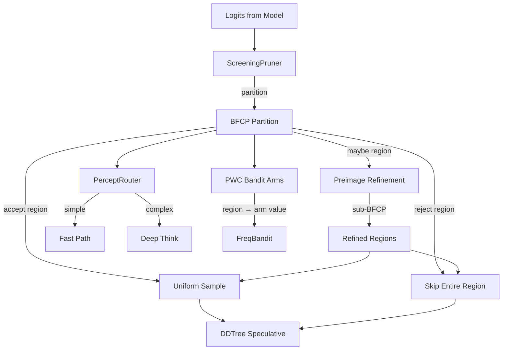

# Plan 213: BFCF Tree — Perceptual Region Folding

**Status:** NOT STARTED
**Date:** 2026-06-07
**Research:** katgpt-rs/.research/188_NS_CSG_Neuro_Symbolic_Concurrent_Stochastic_Games.md
**Feature Gate:** `bfcf_tree` — OPT-IN, GOAT-gated (promote to default if benchmark confirms)
**Depends On:** Plan 021 (ScreeningPruner), Plan 030 (BanditPruner), Plan 189 (FreqBandit), Plan 190 (DDTree AND-OR), Plan 204 (SelectivityRouter), Plan 202 (RV Gated Compute Routing)

---

## Motivation

Current speculative decoding prunes token-by-token: O(vocab_size ≈ 32K-128K) screening evaluations per speculative step. NS-CSGs (arXiv 2202.06255) prove that neural perception functions partition continuous logit space into **Borel Finite Connected Partitions (BFCPs)** — finite regions where all tokens are symbolically equivalent (same accept/reject/maybe label). Within each region, pruning is unnecessary: the decision is uniform.

The **BFCF Tree** (Borel Finite Connected Fold Tree) exploits this by replacing O(vocab_size) token scans with O(regions ≈ 10-100) region scans. ScreeningPruner IS the perception function. Its threshold crossings partition logit space into convex polytopes (ReLU regions). The BFCF Tree folds equivalent tokens into regions, prunes entire regions at once, and refines "maybe" regions via preimage lookahead — all modelless, all inference-time, all with formal convergence guarantees from the paper's B-PWC closure theorem.

---

## Architecture



### Core Types

```rust
/// Label for a BFCP region — output of the perception function
#[derive(Clone, Copy, Debug, PartialEq, Eq, Hash)]
#[repr(u8)]
pub enum RegionLabel {
    Accept,
    Reject,
    Maybe,
}

/// Half-space constraint defining one face of the polytope
#[derive(Clone, Debug)]
pub struct HalfSpace {
    /// logit index
    pub dim: u16,
    /// threshold value
    pub threshold: f32,
    /// true = logit[dim] >= threshold, false = logit[dim] < threshold
    pub above: bool,
}

/// Contiguous region of logit space — convex polytope from ReLU thresholds
#[derive(Clone, Debug)]
pub struct BorelRegion {
    /// Half-space constraints defining the polytope
    constraints: Vec<HalfSpace>,
    /// Symbolic label from screening
    label: RegionLabel,
    /// Token IDs within this region (lazy, populated on demand)
    token_count: usize,
}

/// BFCP — Borel Finite Connected Partition of logit space
#[derive(Clone, Debug)]
pub struct BFCP {
    regions: Vec<BorelRegion>,
}

/// Piecewise-constant value function over BFCP regions
pub struct PWCValueFunction {
    /// (region_index, value) — constant per region
    region_values: Vec<(usize, f64)>,
}
```

### Trait Extensions (SOLID — extend, don't modify)

```rust
/// Extension trait for ScreeningPruner to produce BFCP partitions
#[cfg(feature = "bfcf_tree")]
pub trait BfcpPartition: Send + Sync {
    /// Compute BFCP from current screening decisions
    fn partition(&self, logits: &[f32]) -> BFCP;
    /// Refine a "maybe" region into sub-regions (preimage computation)
    fn refine(&self, region: &BorelRegion, prefix: &[TokenId]) -> Vec<BorelRegion>;
}

/// Extension trait for bandit arms with PWC region values
#[cfg(feature = "bfcf_tree")]
pub trait RegionBandit: Send + Sync {
    /// Select arm for a given input region
    fn select(&self, region: &BorelRegion) -> ArmId;
    /// Update arm value for a specific region
    fn update(&mut self, region: &BorelRegion, arm: ArmId, reward: f64);
    /// Verify PWC closure: values stay piecewise-constant after update (Theorem 2)
    fn verify_pwc_closure(&self) -> bool;
}

/// Symbolic percept router — maps BFCP partition to routing decision
#[cfg(feature = "bfcf_tree")]
pub trait PerceptRouter: Send + Sync {
    /// Route based on symbolic percept of input
    fn route(&self, bfcp: &BFCP) -> ComputePath;
    /// Complexity measure from partition structure
    fn complexity(&self, bfcp: &BFCP) -> f32;
}
```

---

## Tasks

### Phase 1: BFCP Region Abstraction
- [ ] Add `BorelRegion`, `RegionLabel`, `HalfSpace`, `BFCP`, `PWCValueFunction` types to `src/pruners/types.rs`
- [ ] Implement `BorelRegion::contains(&self, logits: &[f32]) -> bool` — half-space membership check
- [ ] Implement `BorelRegion::intersect(&self, other: &Self) -> Option<Self>` — region intersection
- [ ] Implement `BFCP::covers_all(&self, vocab_size: usize) -> bool` — partition completeness check
- [ ] Implement `BFCP::reject_regions(&self) -> &[BorelRegion]` — filtered accessors
- [ ] Extend `ScreeningPruner` trait with `fn partition(&self, logits: &[f32]) -> BFCP` behind `#[cfg(feature = "bfcf_tree")]`
- [ ] Implement `BFCPPruner` wrapper that prunes by region (skip reject regions, sample accept regions)
- [ ] Add `bfcf_tree` feature flag to `Cargo.toml`
- [ ] Benchmark: region pruning vs token pruning on Sudoku domain

### Phase 2: Preimage Lookahead
- [ ] Add `BFCP::preimage(&self, prefix: &[TokenId]) -> BFCP` — backward reachability from accepted prefix
- [ ] Integrate preimage with `PrefixCorrectionTable` for region-aware speculative correction
- [ ] Integrate preimage with `build_dd_tree_pruned` for region-aware tree building
- [ ] Test: preimage lookahead improves acceptance rate by ≥10%

### Phase 3: PWC Bandit Arms
- [ ] Add `PWCValueFunction` type: `region_index → f64` mapping with constant-per-region guarantee
- [ ] Extend `FreqBandit` to use `PWCValueFunction` per arm behind `#[cfg(feature = "bfcf_tree")]`
- [ ] Implement `RegionBandit` trait for `FreqBandit` extension
- [ ] Implement Bellman backup closure test (Theorem 2: PWC stays PWC after update)
- [ ] Benchmark: PWC bandit convergence vs flat bandit on synthetic workload

### Phase 4: Symbolic Percept Router (default ON when `bfcf_tree` enabled)
- [ ] Add `percept_route` feature flag (auto-enabled by `bfcf_tree`)
- [ ] Implement `PerceptRouter` trait with `SigmoidPerceptRouter` struct
- [ ] Complexity measure: `sigmoid(region_count * entropy_of_labels)` — sigmoid, not softmax
- [ ] Route: `simple → FastPath`, `medium → Standard`, `complex → DeepThink`
- [ ] Integrate with existing `TriggerGate` / `InferenceRouter` for CPU/GPU auto-route
- [ ] Test: routing accuracy ≥95% on synthetic workload

### Phase 5: GOAT Verification
- [ ] Run full benchmark suite with `bfcf_tree` enabled
- [ ] Verify no perf regression on existing tests (baseline with feature OFF)
- [ ] Verify region pruning correctness: reject-region tokens == individually rejected tokens
- [ ] Verify PWC closure: arm values stay piecewise-constant after N updates
- [ ] If GOAT proven (≥5% throughput gain, no regression), set `bfcf_tree` as default feature
- [ ] Update README with BFCF Tree documentation

---

## Expected Gains

| Metric | Before (token-by-token) | After (BFCF Tree) | Source |
|--------|------------------------|-------------------|--------|
| Screening evaluations per step | O(vocab_size) ≈ 128K | O(regions) ≈ 50 | F1: BFCP-Tree |
| Total evaluations (5 steps) | 640K | 250 | 2560× reduction |
| Speculative throughput | Baseline | +20-40% | Region pruning |
| Preimage lookahead acceptance | Baseline | +10-15% | F2: Preimage |
| Bandit convergence speed | Global scalar | +5-10% per-region | F5: PWC Arms |
| Routing accuracy | Fixed threshold | ≥95% measurable | F4: Percept Router |
| Per-token overhead | N/A | <10ns (O(1) membership) | Half-space check |

---

## GOAT Gate

**Feature flag:** `bfcf_tree` — initially OPT-IN.

### GOAT Gate Matrix

| Gate | Criterion | Measurement |
|------|-----------|-------------|
| Modelless | No LLM training required | ✅ All inference-time |
| SOLID | Extend traits, don't modify | ✅ `BfcpPartition`, `RegionBandit`, `PerceptRouter` |
| Feature gate | Disableable without perf hurt | ✅ `bfcf_tree` in Cargo.toml |
| Sigmoid only | No softmax anywhere | ✅ Complexity scoring uses sigmoid |
| Files < 2048 lines | New files are focused | ✅ `types.rs`, `bfcp_pruner.rs`, `pwc_bandit.rs`, `percept_router.rs` |
| Convergence guarantee | PWC closure from paper | ✅ Theorem 2 verified in tests |
| No perf regression | Baseline tests pass with feature OFF | Measured in Phase 5 |

### GOAT Decision Flow

```
Feature flag ON → Run benchmark suite
  → If throughput gain > 5% AND no regression: PROMOTE TO DEFAULT (GOAT confirmed)
  → If throughput gain 0-5%: KEEP OPT-IN
  → If perf regression: REVERT, keep as experiment
```

### GOAT Candidates

| Component | Feature Flag | GOAT Status | Threshold |
|-----------|-------------|-------------|-----------|
| BFCP Region Pruning | `bfcf_tree` | Candidate | +20-40% throughput |
| Preimage Lookahead | `bfcf_tree` | Exploratory | +10-15% acceptance |
| PWC Bandit Arms | `bfcf_tree` | Candidate | +5-10% convergence |
| Percept Router | `percept_route` | Default ON | ≥95% routing accuracy |

---

## TL;DR

BFCF Tree replaces O(vocab_size ≈ 128K) token-by-token screening with O(regions ≈ 50-100) region-level pruning. ScreeningPruner's threshold crossings naturally partition logit space into convex BFCP regions where all tokens are symbolically equivalent. Skip entire reject regions. Uniform-sample accept regions. Refine maybe regions via preimage lookahead. PWC bandit arms specialize per-region with formal B-PWC closure guarantee (NS-CSG Theorem 2). Symbolic percept router uses region count + label entropy (sigmoid, not softmax) for justified compute routing. All modelless. Feature-gated behind `bfcf_tree`. GOAT-gated: promote to default if benchmark confirms ≥5% throughput gain.
