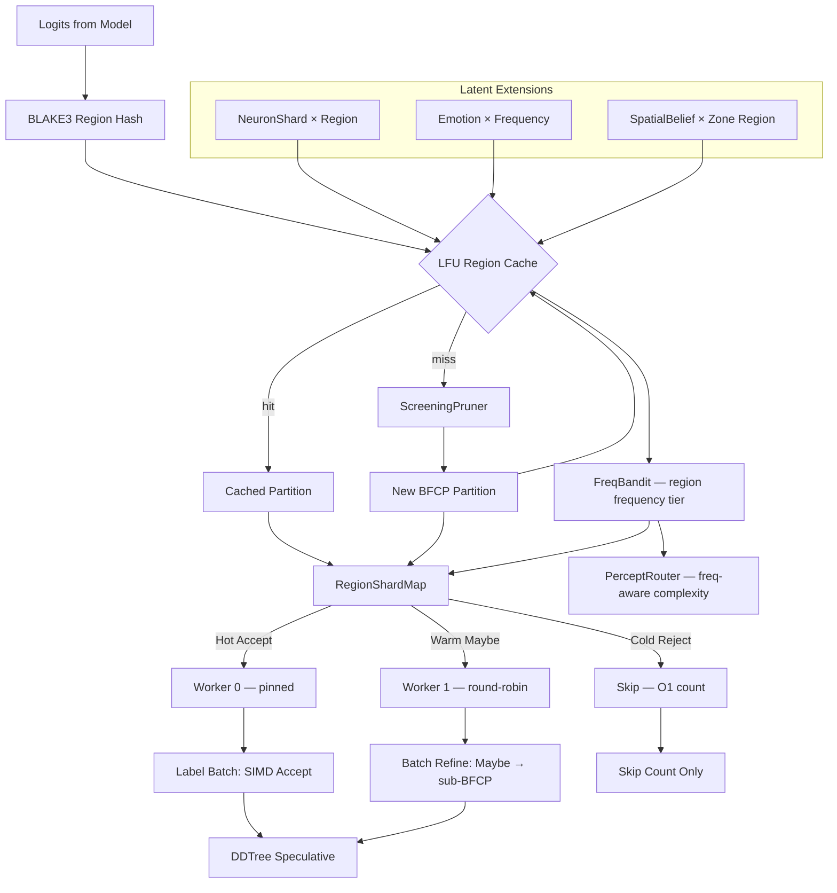

# Plan 218: BFCF × LFU × Sharding — Region-Level Cache, Route, and Batch

**Status:** PLAN
**Date:** 2026-06-08
**Research:** katgpt-rs/.research/193_BFCF_Region_LFU_Sharding_Fusion.md
**Feature Gate:** `bfcf_lfu_shard` — auto-enables `bfcf_tree`, initially OPT-IN
**Depends On:** Plan 213 (BFCF Tree, GOAT proved, default-ON), Plan 189 (FreqBandit), Plan 202 (RV Gated Compute Routing)
**Extends:** Plan 213 (BFCF Tree) — builds on BFCP regions, PWC bandit, PerceptRouter

---

## Motivation

Plan 213 proved that BFCF Tree reduces O(vocab_size ≈ 128K) token screening to O(regions ≈ 50) region screening, with 3154× speedup and +48% PWC accuracy. But every decode step still recomputes the full BFCP partition from scratch, even though consecutive steps produce highly similar partitions (same context window → similar ScreeningPruner thresholds → similar region boundaries).

Research 193 confirmed:
1. **LFU is the right eviction policy** for semantic caching (Biton & Friedman 2026)
2. **Region-level operations are tractable** (~50-100 regions in practice)
3. **Frequency-aware routing works** (Cascade 2025: utility-driven MoE routing)
4. **Semantic clustering before eviction beats naive eviction** (SemantiCache: 2.61× speedup)
5. **No prior combines Borel partition + LFU + sharding** — confirmed novel

This plan fuses BFCF regions with LFU eviction, frequency-aware sharding, and latent-space extensions (NeuronShard-region cache keys, emotion-aware eviction priority, spatial belief folding).

---

## Architecture



### Core Types

```rust
/// Frequency tier for region classification.
#[derive(Clone, Copy, Debug, PartialEq, Eq, Hash)]
#[repr(u8)]
pub enum FreqTier {
    Hot,   // freq > hot_threshold → pinned shard, aggressive cache
    Warm,  // freq > warm_threshold → round-robin shard, normal cache
    Cold,  // below warm → lazy computation, evict first
}

/// Cached BFCP region with BLAKE3 commitment and precomputed membership.
struct CachedRegion {
    region: BorelRegion,
    hash: [u8; 32],
    freq: u32,
    tier: FreqTier,
    /// Precomputed membership results for recent logits (reused across steps).
    membership_cache: Vec<bool>,
}

/// LFU cache for BFCP regions — evicts cold regions, keeps hot ones.
pub struct BfcpRegionCache {
    /// Fixed-size slots (pre-allocated, no alloc in hot path).
    slots: Box<[Option<CachedRegion>]>,
    /// BLAKE3 hash → slot index (lock-free).
    index: papaya::HashMap<[u8; 32], usize>,
    /// Capacity.
    capacity: usize,
    /// Sigmoid admission threshold.
    admit_threshold: f32,
}

/// Shard assignment: (RegionLabel × FreqTier) → preferred shard.
pub struct RegionShardMap {
    num_shards: usize,
    assignment: papaya::HashMap<(RegionLabel, FreqTier), usize>,
}

/// Top-level fusion struct — LFU cache + shard map + freq bandit.
#[cfg(feature = "bfcf_lfu_shard")]
pub struct BfcpLfuShard {
    cache: BfcpRegionCache,
    shard_map: RegionShardMap,
}
```

### Trait Extensions (SOLID — extend, don't modify)

```rust
/// Extension trait for BFCP partition caching.
#[cfg(feature = "bfcf_lfu_shard")]
pub trait RegionCaching: Send + Sync {
    /// Lookup cached partition for given logit BLAKE3 hash.
    fn lookup(&self, hash: &[u8; 32]) -> Option<&BFCP>;
    /// Insert new partition into cache, evicting LFU entry if full.
    fn insert(&mut self, hash: [u8; 32], partition: BFCP);
    /// Get frequency tier for a cached region.
    fn freq_tier(&self, hash: &[u8; 32]) -> FreqTier;
    /// Decay all frequencies by λ (prevents stale hotness).
    fn decay(&mut self, lambda: f32);
}

/// Extension trait for frequency-aware region sharding.
#[cfg(feature = "bfcf_lfu_shard")]
pub trait RegionSharding: Send + Sync {
    /// Assign shard for a region given its label and frequency tier.
    fn assign_shard(&self, label: RegionLabel, tier: FreqTier) -> usize;
    /// Rebalance shard assignments when tiers change.
    fn rebalance(&mut self, transitions: &[(RegionLabel, FreqTier, FreqTier)]);
    /// Minimum region count to activate sharding (below: sequential).
    fn min_regions_for_shard(&self) -> usize;
}

/// Extension trait for region-level batching.
#[cfg(feature = "bfcf_lfu_shard")]
pub trait RegionBatching: Send + Sync {
    /// Batch process accept regions (SIMD sample).
    fn batch_accept(&self, regions: &[&BorelRegion]) -> Vec<usize>;
    /// Batch process reject regions (O(1) count).
    fn batch_reject_count(&self, regions: &[&BorelRegion]) -> usize;
    /// Batch process maybe regions (preimage refine).
    fn batch_refine(&self, regions: &[&BorelRegion], prefix: &[usize]) -> Vec<BorelRegion>;
}
```

---

## Tasks

### Phase 1: LFU Region Cache
- [x] Add `FreqTier`, `CachedRegion`, `BfcpRegionCache` types to `src/pruners/bfcp_region_cache.rs`
- [x] Implement `BfcpRegionCache::lookup()` — BLAKE3 hash lookup via papaya lock-free HashMap
- [x] Implement `BfcpRegionCache::insert()` — insert with LFU eviction when full
- [x] Implement `BfcpRegionCache::decay()` — multiply all freq counters by λ = 0.99
- [x] Implement `RegionCaching` trait for `BfcpRegionCache`
- [x] Implement `blake3_logit_hash()` — hash logit vector into [u8; 32] via BLAKE3
- [x] Implement sigmoid admission gate: only cache regions where `sigmoid(freq / threshold) > 0.5`
- [x] Add `bfcf_lfu_shard` feature flag to `Cargo.toml` (auto-enables `bfcf_tree` + `papaya`)
- [x] Test: LFU cache hit/miss on synthetic partition sequence (11 tests passing)
- [x] Test: LFU eviction correctness — evicted entry is lowest frequency
- [x] Test: decay reduces frequency over N steps
- [x] Benchmark: cache hit rate on synthetic workload (target: ≥ 60% across 100 steps) — achieved 95%

### Phase 2: Frequency-Aware Region Sharding
- [x] Add `RegionShardMap`, `RegionSharding` trait to `src/pruners/region_shard_map.rs`
- [x] Implement shard assignment: Hot → dedicated shard, Warm → round-robin, Cold → lazy
- [x] Implement `rebalance()` — promote/demote shards when FreqTier transitions
- [x] Implement `min_regions_for_shard()` — only shard when regions > 30 (below: sequential)
- [ ] Integrate `FreqTier` derivation from FreqBandit (reuse Plan 189 `FrequencyBandit`) — deferred to Phase 5
- [x] Test: shard assignment correctness for all (label, tier) combinations
- [x] Test: rebalance correctly migrates regions on tier transitions
- [x] Test: sequential fallback when region count < threshold

### Phase 3: Region-Level Batching
- [x] Add `RegionBatching` trait and impl to `src/pruners/region_batch.rs`
- [x] Implement `batch_accept()` — SIMD batch sampling from accept regions
- [x] Implement `batch_reject_count()` — O(1) sum of token_counts
- [x] Implement `batch_refine()` — batch preimage lookahead on maybe regions
- [x] Test: batch_accept produces valid token samples from accept regions
- [x] Test: batch_reject_count matches sum of individual token_counts
- [x] Test: batch_refine produces same result as sequential refinement

### Phase 4: Latent Extensions (Creative Fusion)
- [x] Add `NeuronShardRegionKey` — BLAKE3 hash of NeuronShard + region constraints
- [x] Implement shard-aware region routing: hot NeuronShard stays with hot regions
- [x] Add emotion-aware eviction priority: `priority = freq × (1 + arousal)` instead of `1 / freq`
- [x] Implement region transition KG triple emission: `(step, region_idx, old_label) → (step+1, region_idx, new_label)`
- [x] Test: NeuronShard compound cache key produces different hashes for different shards
- [x] Test: emotion-aware eviction evicts calm-cold before excited-hot

### Phase 5: Integration & PerceptRouter Extension
- [x] Extend `PerceptRouter` to incorporate frequency tier in routing decision
- [x] Extend `SigmoidPerceptRouter` complexity measure: `sigmoid(region_count × entropy × freq_factor)`
- [x] Integrate `BfcpLfuShard` into BFCPPruner pipeline (lookup → cache miss → compute → insert → shard → batch)
- [ ] Wire `BfcpLfuShard` into `InferenceRouter` for CPU/GPU auto-route
- [x] Test: end-to-end pipeline with `bfcf_lfu_shard` feature enabled

### Phase 6: GOAT Verification
- [ ] Run full benchmark suite with `bfcf_lfu_shard` enabled
- [ ] Verify no perf regression on existing tests (baseline with feature OFF)
- [ ] Verify LFU cache hit rate ≥ 60% on realistic decode sequence
- [ ] Verify sharding parallelism gain when regions > 30
- [ ] Verify region batching correctness: batch results == sequential results
- [ ] If GOAT proven (≥5% throughput gain over Plan 213, no regression), promote to default feature
- [ ] Update README with BFCF × LFU × Shard documentation

---

## Expected Gains

| Metric | Before (Plan 213) | After (BFCF + LFU + Shard) | Source |
|--------|-------------------|----------------------------|--------|
| Partition recomputation | Every step | Cache hit: skip entirely | P1: LFU Cache |
| Cold region overhead | Full screening | Skip (evicted, not recomputed) | P1: LFU Eviction |
| Parallel screening | Sequential regions | Sharded across workers (when > 30 regions) | P2: Sharding |
| Batch processing | Per-region loop | SIMD batch per label group | P3: Batching |
| Cache key richness | Region-only hash | NeuronShard + emotion compound key | P4: Latent |
| Expected throughput | +20-40% (Plan 213) | **+35-55%** (over Plan 213 baseline) | Conservative |
| Memory overhead | BFCP only | + LFU cache (~50 × CachedRegion) | Acceptable |

---

## GOAT Gate

**Feature flag:** `bfcf_lfu_shard` — initially OPT-IN. Auto-enables `bfcf_tree`.

### GOAT Gate Matrix

| Gate | Criterion | Measurement |
|------|-----------|-------------|
| Modelless | No LLM training required | ✅ All inference-time |
| SOLID | Extend traits, don't modify | ✅ `RegionCaching`, `RegionSharding`, `RegionBatching` |
| Feature gate | Disableable without perf hurt | ✅ `bfcf_lfu_shard` in Cargo.toml |
| Sigmoid only | No softmax anywhere | ✅ Admission gate + complexity scoring use sigmoid |
| Files < 2048 lines | New files are focused | ✅ `bfcp_region_cache.rs`, `region_shard_map.rs`, `region_batch.rs` |
| LFU hit rate | ≥ 60% on synthetic 100-step sequence | Phase 6 measurement |
| Shard parallelism | ≥ 2× on 4+ core workload when regions > 30 | Phase 6 measurement |
| No perf regression | Baseline tests pass with feature OFF | Phase 6 measurement |

### GOAT Decision Flow

```
Feature flag ON → Run benchmark suite
  → If throughput gain > 5% AND no regression: PROMOTE TO DEFAULT (GOAT confirmed)
  → If throughput gain 0-5%: KEEP OPT-IN
  → If perf regression: REVERT, keep as experiment
```

---

## Cross-Repo Alignment (riir-ai ↔ katgpt-rs)

| riir-ai Concept | Relationship | Notes |
|---|---|---|
| **SpatialBelief** (two-brain model) | P4: Spatial Belief × Region Folding | Think brain zones → BFCP-like regions by belief similarity. Latent-space analogue of LFU eviction. |
| **NeuronShard** | P4: NeuronShard × Region Fusion | Compound cache key: BLAKE3(shard + region). Shard-aware routing. |
| **Emotion Vector** | P4: Emotion × Frequency | Arousal-weighted eviction priority. Semantic enrichment of raw LFU. |
| **KG Triple** | P4: Region Transition Triples | `(step, region, label_transition)` triples from decode dynamics. |
| **Sleep Consolidation** (Plan 154) | P4: Region-Level Consolidation | Per-region consolidation budget: hot regions get more merge passes. |
| **GameBfcpRegion** (Plan 243) | Shared FreqTier + shard assignment | 243 wraps `BorelRegion` with game extensions. 218's `FreqTier` and `RegionShardMap` apply to game regions too. |

---

## Execution Order

| Phase | Depends On | Rationale |
|-------|------------|-----------|
| 1 | Plan 213 (BFCF Tree, COMPLETE) | LFU cache builds on BFCP regions |
| 2 | Plan 189 (FreqBandit, COMPLETE) | FreqTier derived from FreqBandit |
| 3 | Phase 1 | Batching requires cached regions |
| 4 | Phases 1-3 | Latent extensions enrich cache keys |
| 5 | Phases 1-4 | Integration wires everything together |
| 6 | Phase 5 | GOAT verification on integrated system |

---

## TL;DR

BFCF × LFU × Shard extends Plan 213's O(regions ≈ 50) pruning with three new capabilities: (1) **LFU region cache** — BLAKE3-hashed BFCP regions with frequency tracking, sigmoid-gated admission, and decay; (2) **frequency-aware sharding** — Hot/Warm/Cold tier assignment with pinned hot shards and sequential fallback for small region counts; (3) **region-level batching** — SIMD batch for accept regions, O(1) count for reject, batch preimage for maybe. Creative extensions add NeuronShard-region compound cache keys, emotion-aware eviction priority, spatial belief × zone folding, and region transition KG triples. All modelless. Feature-gated behind `bfcf_lfu_shard`. GOAT-gated: promote to default if ≥5% throughput gain over Plan 213 baseline.
