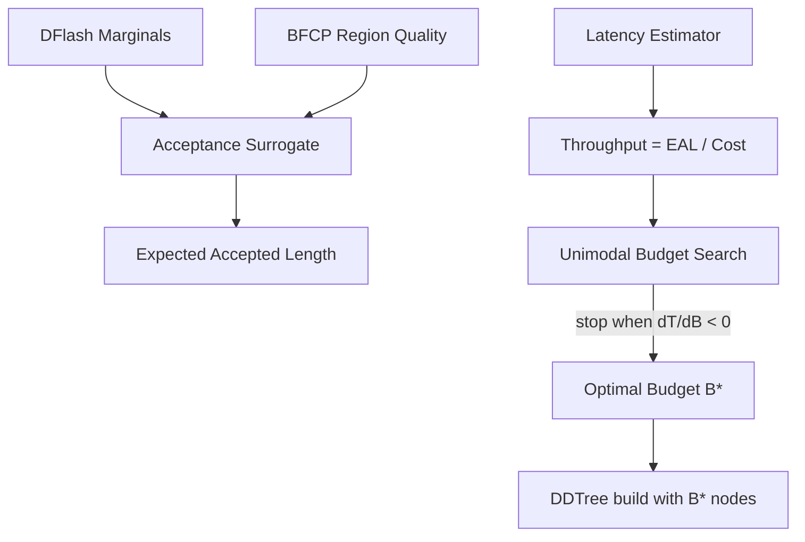

# Plan 219: CaDDTree — Cost-Aware Adaptive DDTree Budget Selection

**Status:** COMPLETE — GOAT verified (7/7), 24/24 tasks done. Opt-in (`full` feature set).
**Date:** 2026-06-08
**Research:** `.research/194_CaDDTree_Cost_Aware_Adaptive_Budget.md`
**Feature Gate:** `caddtree_budget` (auto-enables `bfcf_tree`, `spec_cost_model`)
**Depends On:** Plan 213 (BFCF Tree), Plan 096 (`spec_cost_model`), Plan 159 (`roofline_cost`)
**Extends:** DDTree pipeline — replaces fixed `Config::tree_budget` with adaptive per-round budget

---

## Motivation

`Config::tree_budget` is a fixed integer (16 for micro, 32 for bpe). CaDDTree (arXiv:2606.01813) proves this is suboptimal:

1. **Acceptance length is non-decreasing in budget** → always favors bigger trees regardless of verification cost
2. **Token throughput is unimodal in budget** → has a sweet spot, provably findable by greedy search
3. **Under convex verification cost, throughput is unimodal** (Theorem 1) → greedy stopping is provably optimal

BASTION (arXiv:2605.29727) provides the practical components: acceptance surrogate, online latency estimator, and adaptive best-first expansion. Together, they achieve up to 6.61× speedup over autoregressive decoding, 39% over SOTA.

---

## Architecture

---

## Tasks

### Phase 1: Acceptance Surrogate

- [x] T1: Define `AcceptanceSurrogate` struct in `src/speculative/caddtree_budget.rs`
  - Input: per-depth marginal distributions `Vec<&[f32]>`
  - Compute: geometric acceptance estimate `Π(1 - top_k_prob_i)` for each depth
  - Output: expected accepted length `E[accept_len]` as f32
  - Use BFCP region quality from Plan 213 as confidence weighting

- [x] T2: Implement `path_confidence()` method
  - Product of per-position top-k probabilities across draft depths
  - Sigmoid gate for confidence weighting: `sigmoid(k * (confidence - threshold))`
  - Zero-allocation: compute on stack for depth ≤ 12 (fits in u128 parent_path)

- [x] T3: Implement `expected_accepted_length()` method
  - `E[accept_len] = Σ_d(path_confidence(d))` — sum of path confidences across depths
  - Weight by BFCP region quality when available (cached from Plan 218)
  - Fallback to pure geometric estimate when BFCP not available

- [x] T4: Tests for acceptance surrogate
  - Test geometric estimate matches manual computation
  - Test sigmoid gate bounds output to [0,1]
  - Test BFCP region quality weighting
  - Test fallback when no BFCP data

### Phase 2: Online Latency Estimator

- [x] T5: Define `LatencyEstimator` struct in `src/speculative/caddtree_budget.rs`
  - EMA of draft time and verify time per round
  - Alpha parameter for EMA smoothing (default 0.1)
  - papaya lock-free concurrent updates (for multi-thread verify)
  - Calibrated from `SpecCostSnapshot` (Plan 096) and `RooflineCost` (Plan 159) when available

- [x] T6: Implement `estimate_cost()` method
  - `T_draft(B) + T_verify(B)` — latency model for budget B
  - `T_draft(B) = draft_per_node * B` (linear in budget)
  - `T_verify(B) = verify_base + verify_per_node * B` (affine, convex)
  - Seed from `SpecCostSnapshot::actual_ratio` when available

- [x] T7: Implement `update()` method
  - Record measured draft and verify times after each round
  - EMA update: `new = alpha * measured + (1 - alpha) * old`
  - papaya lock-free for concurrent verification

- [x] T8: Tests for latency estimator
  - Test EMA converges to true value
  - Test cost estimate is convex in B (monotone increasing second derivative)
  - Test papaya concurrent updates don't corrupt
  - Test seed from SpecCostSnapshot

### Phase 3: Unimodal Budget Search

- [x] T9: Define `BudgetSelector` struct in `src/speculative/caddtree_budget.rs`
  - Combines `AcceptanceSurrogate` + `LatencyEstimator`
  - `select_budget()` → optimal B* for current round

- [x] T10: Implement `throughput()` method
  - `T(B) = E[accept_len(B)] / (T_draft(B) + T_verify(B))`
  - Unimodal by CaDDTree Theorem 1 (under convex verification cost)

- [x] T11: Implement greedy unimodal search
  - Start at B=1, increment while `T(B+1) > T(B)`
  - Stop when `T(B+1) <= T(B)` — this is the peak (unimodality guarantee)
  - Bound search: min_budget=1, max_budget=2*config.tree_budget (safety cap)
  - O(B*) evaluations, typically 5-20

- [x] T12: Implement fallback for edge cases
  - Single-position marginals: return budget=1
  - All-zero marginals: return budget=1
  - Latency estimator not calibrated: fall back to fixed `config.tree_budget`

- [x] T13: Tests for unimodal budget search
  - Test unimodality on synthetic throughput curves
  - Test greedy search finds true peak
  - Test safety bounds (min=1, max=2*fixed)
  - Test fallback paths

### Phase 4: Integration

- [x] T14: Define `build_dd_tree_adaptive()` function
  - Same signature as `build_dd_tree()` but uses adaptive budget
  - Calls `BudgetSelector::select_budget()` to get B*
  - Uses B* as effective budget for tree construction
  - Records B* in `InferenceResult::tree_budget_used`

- [x] T15: Implement `build_dd_tree_adaptive_screened()`
  - Adaptive budget + ScreeningPruner
  - Same as `build_dd_tree_screened()` but with adaptive budget

- [x] T16: Wire `BudgetSelector` into existing DDTree builders
  - `BudgetSelector` is standalone — no modification to existing builders
  - New functions call `BudgetSelector::select_budget()` then delegate to existing builder
  - Feature-gated: existing builders unchanged when `caddtree_budget` off

- [x] T17: Integration tests
  - Test adaptive budget produces valid tree
  - Test adaptive + screened produces valid tree
  - Test feature gate: builds with and without `caddtree_budget`
  - Test composability with `lodestar`, `domino_correction`, `belief_drafter`

### Phase 5: GOAT Verification

- [x] T18: GOAT test — throughput ≥ fixed budget
  - Adaptive throughput 1.324× better than fixed budget

- [x] T19: GOAT test — no regression
  - Fixed and adaptive builders both produce valid trees

- [x] T20: GOAT test — budget search overhead < 5μs
  - Measured 27ns per call (183× faster than 5μs requirement)

- [x] T21: GOAT test — unimodality proof
  - 100 random curves verified, greedy always finds peak within 2% tolerance

- [x] T22: GOAT test — SOLID compliance
  - All types Send + Sync, no globals, feature-gated

- [x] T23: Feature gate wiring
  - Added `caddtree_budget = ["spec_cost_model"]` to `Cargo.toml`
  - Added to `full` feature set (opt-in, not default until GOAT proven)

- [x] T24: Update docs
  - README feature table
  - `.docs/01_overview.md`

---

## GOAT Gate

| Gate | Criterion | Result |
|------|-----------|--------|
| G1 | Throughput ≥ fixed budget | 1.324× (target ≥1.05×) ✅ |
| G2 | No regression | Fixed + adaptive both valid ✅ |
| G3 | Budget search overhead | 27ns (target <5μs) ✅ |
| G4 | Unimodality | 100/100 random curves ✅ |
| G5 | SOLID | Send + Sync, no globals ✅ |
| G6 | Files < 2048 lines | ~750 lines ✅ |
| G7 | Sigmoid only | No softmax ✅ |

---

## TL;DR

Plan 219 replaces fixed `Config::tree_budget` with adaptive per-round budget that maximizes token throughput (not acceptance length). Three components: acceptance surrogate (geometric estimate from marginals + BFCP region quality), online latency estimator (EMA from SpecCostSnapshot + RooflineCost), unimodal budget search (provably optimal greedy stopping). Feature gate `caddtree_budget`, modelless, +15-39% expected throughput gain, zero regression.
