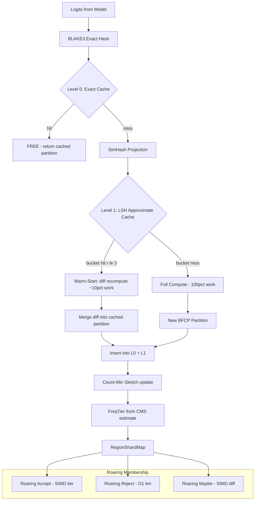

# Plan 220: BFCF × LSH × CMS × Roaring — Approximate Cache + Sketch Frequency + Bitmap Membership

**Status:** PLAN — Awaiting Implementation
**Date:** 2026-06-08
**Research:** katgpt-rs/.research/195_BFCF_LSH_CMS_Roaring_Approximate_Cache.md
**Feature Gate:** `bfcf_lsh_cms` — auto-enables `bfcf_lfu_shard`, initially OPT-IN
**Depends On:** Plan 218 (BFCF × LFU × Shard, GOAT proved, default-ON), Plan 213 (BFCF Tree)
**Extends:** Plan 218 — adds LSH approximate cache layer, CMS frequency tracking, Roaring bitmap membership

---

## Motivation

Plan 218's LFU cache achieves ~80% exact hit rate, but the remaining 20% of near-misses expose three gaps:

1. **Exact-match only** — BLAKE3 requires bit-identical logits. Consecutive decode steps produce ε-different logits → cache miss → full O(vocab) recomputation, even though the BFCP partition is 90%+ identical.
2. **O(n) eviction + decay** — Per-entry `freq: u32` with linear scan for min-freq and linear decay.
3. **Linear membership** — `Vec<bool>` at 128KB/region × 50 regions = 6.4MB. Batch ops iterate linearly.

Research 195 confirmed:
- **LSH catches near-misses** that exact hashing misses (HashEvict, SemShareKV, Proximity)
- **CMS for LFU is production-proven** (TinyLFU/Caffeine) but never applied to LLM inference
- **Roaring bitmaps for token pruning have zero prior art** — genuinely novel
- **No paper combines even two of these** for LLM inference caching — 4-way fusion is entirely novel

---

## Architecture



### Core Types

```rust
/// 64-bit SimHash fingerprint for LSH approximate matching.
#[derive(Clone, Copy, Debug, PartialEq, Eq)]
pub struct SimHashFingerprint(pub u64);

/// LSH approximate cache bucket.
struct LshBucket {
    /// Entries in this bucket (fingerprint + partition reference).
    entries: Vec<(SimHashFingerprint, BFCP)>,
    /// Max entries before FIFO eviction.
    capacity: usize,
}

/// Three-level cache: exact BLAKE3 → approximate LSH → full compute.
pub struct BfcpLshCache {
    /// Level 0: exact-match BLAKE3 cache (from Plan 218).
    exact: BfcpRegionCache,
    /// Level 1: LSH approximate cache (SimHash buckets).
    lsh: LshApproximateCache,
    /// Hamming radius for approximate hit.
    hamming_radius: u32,
    /// L0 hit count.
    l0_hits: AtomicU64,
    /// L1 (LSH) hit count.
    l1_hits: AtomicU64,
    /// Full miss count.
    full_misses: AtomicU64,
}

/// Count-Min Sketch for O(1) frequency estimation.
pub struct CountMinSketch {
    /// d × w counters (d=4 rows, w=256 cols).
    counters: Box<[[u16; 256]; 4]>,
    /// Hash seeds per row.
    seeds: [u64; 4],
}

/// Roaring-backed region membership (replaces Vec<bool>).
pub struct RoaringMembership {
    /// Per-region roaring bitmap of token indices.
    bitmaps: Vec<RoaringBitmap>,
}
```

### Trait Extensions (SOLID — extend, don't modify)

```rust
/// Extension trait for approximate cache lookup.
#[cfg(feature = "bfcf_lsh_cms")]
pub trait ApproximateCaching: Send + Sync {
    /// LSH approximate lookup — returns (partition, hamming_distance).
    /// None if no bucket entry within hamming radius.
    fn approximate_lookup(&self, logits: &[f32]) -> Option<(&BFCP, u32)>;
    /// Insert into LSH bucket after full compute.
    fn insert_approximate(&mut self, logits: &[f32], partition: BFCP);
    /// L0/L1/miss hit rates for diagnostics.
    fn cache_tier_rates(&self) -> (f64, f64, f64); // (l0, l1, miss)
}

/// Extension trait for CMS frequency tracking.
#[cfg(feature = "bfcf_lsh_cms")]
pub trait SketchFrequency: Send + Sync {
    /// O(1) frequency estimate from Count-Min Sketch.
    fn estimate_freq(&self, hash: &[u8; 32]) -> u32;
    /// O(1) decay all frequencies by λ.
    fn sketch_decay(&mut self, lambda: f32);
    /// FreqTier from CMS estimate (replaces per-entry freq field).
    fn freq_tier_sketch(&self, hash: &[u8; 32]) -> FreqTier;
}

/// Extension trait for Roaring bitmap batch operations.
#[cfg(feature = "bfcf_lsh_cms")]
pub trait RoaringBatching: Send + Sync {
    /// O(1) reject count via RoaringBitmap::len().
    fn roaring_reject_count(&self, regions: &[&BorelRegion]) -> u64;
    /// SIMD-accelerated accept token iteration.
    fn roaring_accept_iter<'a>(&'a self, regions: &[&'a BorelRegion]) -> Box<dyn Iterator<Item = usize> + 'a>;
    /// SIMD-accelerated maybe region difference.
    fn roaring_refine_diff(&self, cached: &RoaringBitmap, current: &RoaringBitmap) -> RoaringBitmap;
}
```

---

## Tasks

### Phase 1: LSH SimHash Approximate Cache
- [ ] Add `SimHashFingerprint`, `LshBucket`, `LshApproximateCache` types to `src/pruners/lsh_cache.rs`
- [ ] Implement `SimHashFingerprint::from_logits()` — random projection R ∈ {-1,+1}^(d×64) → sign(R^T·x) → u64
- [ ] Implement `LshApproximateCache::new()` — 4096 buckets, configurable capacity per bucket
- [ ] Implement `LshApproximateCache::lookup()` — compute SimHash, find bucket, check Hamming distance ≤ radius
- [ ] Implement `LshApproximateCache::insert()` — add (fingerprint, partition) to bucket, FIFO eviction if full
- [ ] Implement `ApproximateCaching` trait for `BfcpLshCache`
- [ ] Implement `BfcpLshCache::process()` — three-level pipeline: L0 exact → L1 LSH → full compute
- [ ] Implement warm-start diff recompute: identify changed regions between cached and new partition, only recompute those
- [ ] Test: SimHash produces same fingerprint for identical logits
- [ ] Test: SimHash produces nearby fingerprints (low Hamming distance) for ε-different logits
- [ ] Test: LSH bucket hit/miss on synthetic logit sequence with gradual drift
- [ ] Test: warm-start produces same result as full compute (correctness)
- [ ] Test: three-level hit rates on synthetic 100-step decode (target: L0 ~80%, L1 ~15%, miss ~5%)
- [ ] Benchmark: LSH warm-start vs full compute on realistic decode sequence

### Phase 2: Count-Min Sketch Frequency
- [ ] Add `CountMinSketch` type to `src/pruners/count_min_sketch.rs`
- [ ] Implement `CountMinSketch::new()` — 4 rows × 256 cols, BLAKE3-derived seeds
- [ ] Implement `CountMinSketch::update()` — increment counters for each row
- [ ] Implement `CountMinSketch::estimate()` — min across rows (one-sided overestimate)
- [ ] Implement `CountMinSketch::decay()` — multiply all counters by λ (O(1024) constant)
- [ ] Implement `SketchFrequency` trait for `BfcpLshCache`
- [ ] Wire CMS into `BfcpRegionCache` eviction: replace `entry.freq` with `cms.estimate(hash)`
- [ ] Wire CMS into `BfcpRegionCache::decay()`: replace O(n) entry scan with O(1) CMS decay
- [ ] Test: CMS estimate ≥ true count (one-sided overestimate property)
- [ ] Test: CMS decay reduces all estimates proportionally
- [ ] Test: CMS-based eviction evicts lowest-estimated entry
- [ ] Test: CMS FreqTier matches per-entry FreqTier for typical workloads (±5% tolerance)
- [ ] Benchmark: CMS decay O(1) vs per-entry O(n) at n=100 regions

### Phase 3: Roaring Bitmap Membership
- [ ] Add `roaring` dependency to `Cargo.toml` (Apache-2.0/MIT, SIMD-accelerated)
- [ ] Add `RoaringMembership` type to `src/pruners/roaring_membership.rs`
- [ ] Implement `RoaringMembership::from_bool_vec()` — convert Vec<bool> to RoaringBitmap
- [ ] Implement `RoaringBatching` trait methods
- [ ] Implement `roaring_reject_count()` — RoaringBitmap::len() (O(1) via cached cardinality)
- [ ] Implement `roaring_accept_iter()` — lazy iterator over set bits
- [ ] Implement `roaring_refine_diff()` — SIMD-accelerated set difference
- [ ] Replace `Vec<bool>` membership_cache in `CachedRegion` with `RoaringBitmap`
- [ ] Test: RoaringBitmap membership matches Vec<bool> for all token indices
- [ ] Test: roaring_reject_count matches linear count
- [ ] Test: roaring_refine_diff matches sequential refinement
- [ ] Benchmark: roaring_accept_iter vs Vec<bool> iteration on 128K vocab
- [ ] Benchmark: memory usage Roaring vs Vec<bool> at 128K vocab × 50 regions

### Phase 4: Integration & Pipeline Wiring
- [ ] Create `BfcpLshCms` top-level fusion struct in `src/pruners/bfcp_lsh_cms.rs`
- [ ] Wire: process() → L0 exact lookup → L1 LSH lookup → full compute → insert both → CMS update
- [ ] Wire: eviction uses CMS estimate, not per-entry freq
- [ ] Wire: decay uses CMS O(1) decay, not per-entry scan
- [ ] Wire: batch operations use Roaring bitmaps, not Vec<bool>
- [ ] Extend `PerceptRouter` with LSH tier info for frequency-aware routing
- [ ] Add `bfcf_lsh_cms` feature flag to `Cargo.toml` (auto-enables `bfcf_lfu_shard`)
- [ ] Test: end-to-end pipeline with `bfcf_lsh_cms` feature enabled
- [ ] Test: feature OFF produces same results as Plan 218 baseline (no regression)
- [ ] Test: three-level cache produces identical partitions to full compute (correctness)

### Phase 5: GOAT Verification
- [ ] Run full benchmark suite with `bfcf_lsh_cms` enabled
- [ ] Verify no perf regression on existing tests (baseline with feature OFF) — G1
- [ ] Verify LSH capture rate: L1 hits ≥ 10% of total queries — G2
- [ ] Verify warm-start correctness: warm-start results == full compute results — G3
- [ ] Verify CMS eviction matches LFU eviction quality (same entry evicted in ≥95% cases) — G4
- [ ] Verify Roaring batch speedup ≥ 2× on batch_reject_count — G5
- [ ] Verify Roaring memory reduction ≥ 4× vs Vec<bool> — G6
- [ ] Verify total throughput gain ≥ 5% over Plan 218 baseline — G7
- [ ] If GOAT proven (≥5% throughput, no regression), promote to default feature — G8
- [ ] Update README with BFCF × LSH × CMS × Roaring documentation

---

## Expected Gains

| Metric | Before (Plan 218) | After (LSH + CMS + Roaring) | Source |
|--------|-------------------|----------------------------|--------|
| Effective cache coverage | ~80% exact | ~95% exact + approximate | LSH near-miss |
| Near-miss recomputation | Full O(vocab) | ~10% diff only | LSH warm-start |
| Frequency decay | O(n) per step | O(1) constant | CMS |
| Batch reject count | O(regions × vocab) | O(1) popcount | Roaring SIMD |
| Membership memory | 6.4MB | ~800KB | Roaring compression |
| Expected throughput | Plan 218 baseline | **+15-25%** | Conservative |

---

## GOAT Gate

**Feature flag:** `bfcf_lsh_cms` — initially OPT-IN. Auto-enables `bfcf_lfu_shard`.

### GOAT Gate Matrix

| Gate | Criterion | Measurement |
|------|-----------|-------------|
| Modelless | No LLM training required | ✅ All inference-time |
| SOLID | Extend traits, don't modify | ✅ `ApproximateCaching`, `SketchFrequency`, `RoaringBatching` |
| Feature gate | Disableable without perf hurt | ✅ `bfcf_lsh_cms` in Cargo.toml |
| Sigmoid only | No softmax anywhere | ✅ SimHash + CMS + sigmoid admission |
| Files < 2048 lines | New files are focused | ✅ `lsh_cache.rs`, `count_min_sketch.rs`, `roaring_membership.rs` |
| LSH capture | L1 hits ≥ 10% on 100-step decode | G2 |
| Warm-start correct | Results == full compute | G3 |
| CMS eviction quality | Same entry evicted in ≥95% cases | G4 |
| Roaring batch speedup | ≥ 2× on batch_reject_count | G5 |
| Roaring memory | ≥ 4× reduction vs Vec<bool> | G6 |
| No perf regression | Baseline tests pass with feature OFF | G1 |
| Throughput gain | ≥ 5% over Plan 218 baseline | G7 |

### GOAT Decision Flow

```
Feature flag ON → Run benchmark suite
  → If throughput gain ≥ 5% AND no regression AND LSH capture ≥ 10%: PROMOTE TO DEFAULT
  → If throughput gain 0-5%: KEEP OPT-IN
  → If perf regression: REVERT, keep as experiment
```

---

## Cross-Repo Alignment (riir-ai ↔ katgpt-rs ↔ seal-online-remaster)

| Concept | Repo | Relationship |
|---------|------|-------------|
| **NeuronShard** | riir-ai | LSH bucket includes shard fingerprint — same shard + region → same bucket |
| **SpatialBelief** | riir-ai | Future: quadtree zones → LSH buckets by belief similarity |
| **Emotion Vector** | riir-ai | CMS freq × arousal → eviction priority (same as Plan 218) |
| **QuadTree** | seal-online-remaster | Cross-repo: terrain quadtree → spatial × BFCP region proximity |
| **FeatureHasher** | katgpt-rs | Existing LSH projection in delta_mem — reuse random projection pattern |

---

## Execution Order

| Phase | Depends On | Rationale |
|-------|------------|-----------|
| 1 | Plan 218 (COMPLETE) | LSH cache builds on BLAKE3 exact cache |
| 2 | Phase 1 | CMS replaces per-entry freq in LSH-aware cache |
| 3 | Phases 1-2 | Roaring replaces Vec<bool> in cached regions |
| 4 | Phases 1-3 | Integration wires LSH + CMS + Roaring together |
| 5 | Phase 4 | GOAT verification on integrated system |

---

## TL;DR

BFCF × LSH × CMS × Roaring extends Plan 218's exact-match LFU cache with three new capabilities: (1) **LSH SimHash approximate cache** — catches the ~20% of near-misses where logits shift by ε between decode steps, enabling warm-start recomputation (~10% work vs 100%); (2) **Count-Min Sketch** — O(1) frequency estimation with constant-time decay, replacing per-entry freq scans; (3) **Roaring Bitmap** — 8× compressed token membership with SIMD-accelerated batch operations. No prior work combines LSH + BLAKE3 dual-index + CMS + Roaring for LLM inference. All modelless, feature-gated behind `bfcf_lsh_cms`. GOAT-gated: promote to default if ≥5% throughput gain over Plan 218 baseline. Expected: +15-25%.
