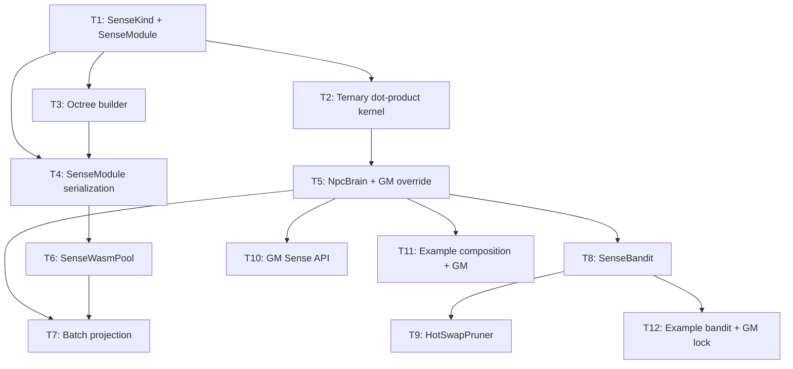

# Plan 221: KG Latent Octree — Modelless Inference-Time Sense Composition

> **Status:** ✅ Complete
> **Research:** `.research/196_KG_Latent_Octree_WASM_Composition.md`
> **Feature Gate:** `sense_composition` (single gate, all tasks)
> **Depends On:** `plasma_path` (TernaryWeights), `domain_latent` (DomainLatent), `bandit` (TrialLog)
> **Companion Plan:** riir-ai Plan 249 (model-based training)
> **Schema Plan:** seal-online-remaster Plan 036 (Brain Annotation — KG/HLA schema metadata for GameComponent derive)

---

## Overview

Compress game domain knowledge into fixed-type ternary bit-plane sense modules (~232B each). Each module encodes a KG latent octree + direction vectors. NPCs compose modules at spawn time and query at ~45ns/tick via bitwise dot-product. Self-learns from bandit feedback. **GM override always wins over autonomous behavior.** No LLM inference needed.

### Design Principles (Revised)

1. **One feature gate** — `sense_composition`. No sub-features. 480 features is already too many.
2. **GM override is first-class** — sense modules suggest, GM decides. Every autonomous path has a manual override.
3. **Fail-safe defaults** — if sense module returns garbage, NPC falls back to rule-based behavior (existing game logic).
4. **Not AGI** — these are compressed statistics, not intelligence. They augment game design, not replace it.

---

## TL;DR

- **SenseKind** enum: CommonSense, FighterSense, GameTheorySense, SpatialSense, SocialSense, SkillSense
- **SenseModule**: 232B fixed Pod — octree bit-planes + ternary direction vectors + BLAKE3 commitment
- **NpcBrain**: composable sense modules + HLA state + **GM override mask**
- **SenseOverride**: per-NPC, per-sense activation pinning + autonomous disable
- **SenseBandit**: TrialLog → AbsorbCompress → HotSwapPruner for self-learning
- **Single feature gate**: `sense_composition` = `["plasma_path", "domain_latent", "bandit"]`
- Perf: 45ns/tick per NPC, ~100KB per NPC brain, 60% code reuse

---

## Tasks

### Phase 1: Core Types

- [x] **T1: SenseKind enum + SenseModule Pod** (`crates/katgpt-core/src/types.rs`)
  - `#[repr(u8)] pub enum SenseKind` — CommonSense(0), FighterSense(1), GameTheorySense(2), SpatialSense(3), SocialSense(4), SkillSense(5), Reserved(7)
  - `#[repr(C)] pub struct SenseModule` — kind, version, octree_depth, n_directions, octree_bits: [u64; 4], directions: [TernaryDir; 8], confidence: f32, commitment: [u8; 32]
  - `TernaryDir` — pos_bits: u64, neg_bits: u64, row_scale: f32 (20B each)
  - bytemuck Pod + Zeroable for zero-copy
  - BLAKE3 commitment over all fields
  - `SenseModule::project(&self, hla_state: &[f32; 8]) -> f32` — ternary dot-product + sigmoid
  - `SenseModule::query_octree(&self, level: u8, index: u8) -> Option<bool>` — 2-bit occupancy query
  - Tests: roundtrip serialize/deserialize, project nonzero changes output, octree query valid indices, BLAKE3 commitment verify

- [x] **T2: Ternary dot-product kernel** (`crates/katgpt-core/src/simd.rs`)
  - `simd_ternary_dot_f32(state: &[f32], dir: &TernaryDir) -> f32` — branchless SIMD conditional add/subtract
  - Reuse existing `simd_ternary_matvec` pattern from plasma_path
  - Scalar fallback for non-SIMD platforms
  - Benchmark: vs full-precision dot-product, target <5ns per direction
  - Tests: ternary_dot matches scalar reference, SIMD and scalar agree

- [x] **T3: Octree builder** (`crates/katgpt-core/src/sense/`)
  - `SenseOctreeBuilder` — takes Vec<KgEmbedding> → builds octree bit-planes
  - `KgEmbedding` — lightweight struct: entity_hash: u64, relation_hash: u64, embedding: [f32; 8], sign: bool
  - Spatial partition: recursively split embedding space by median at each level
  - Output: packed bit-planes (occupied + sign per node)
  - Max depth: 3 (8 levels, 128 nodes — fits in [u64; 4])
  - Tests: empty input → all zeros, single triple → correct occupancy, many triples → correct partitioning

- [x] **T4: SenseModule serialization** (`crates/katgpt-core/src/sense/`)
  - Binary format: `[MAGIC: "SNSE" 4B][VERSION: 1B][KIND: 1B][MODULE: SenseModule bytes][BLAKE3: 32B]`
  - `SenseModule::save()` / `SenseModule::load()` — file I/O with BLAKE3 verification
  - `SenseModule::from_kg_embeddings(kind, embeddings, hla_dim)` — builder from extracted KG data
  - Tests: roundtrip save/load, invalid magic rejected, checksum mismatch rejected, from_kg_embeddings produces valid module

### Phase 2: NpcBrain + GM Override

- [x] **T5: NpcBrain with GM override mask** (`crates/katgpt-core/src/sense/brain.rs`)
  - `pub struct NpcBrain` — modules: Vec<SenseModule>, hla_state: [f32; 8], overrides: SenseOverride
  - `pub struct SenseOverride` — pinned: [(SenseKind, f32); MAX_OVERRIDES], autonomous_disabled: bool, script_id: Option<u64>
  - `NpcBrain::compose(modules: Vec<SenseModule>)` — load at NPC spawn time
  - `NpcBrain::project_all(&self) -> Vec<f32>` — project HLA onto all loaded modules
  - **GM wins**: if `overrides.pinned` contains kind → return pinned value, skip autonomous
  - **Script mode**: if `autonomous_disabled` → return pinned values only, skip all autonomous
  - `NpcBrain::project_kind(&self, kind: SenseKind) -> Option<f32>` — project single sense (GM-aware)
  - `NpcBrain::update_hla(&mut self, delta: &[f32])` — update HLA state
  - `NpcBrain::pin_sense(&mut self, kind: SenseKind, value: f32)` — GM pins a sense activation
  - `NpcBrain::disable_autonomous(&mut self, script_id: u64)` — enter scripted mode
  - `NpcBrain::enable_autonomous(&mut self)` — exit scripted mode
  - Tests: compose 3 modules, project_all returns 3 scalars, pin overrides autonomous, disable stops all autonomous, re-enable restores
  - MAX_OVERRIDES = 8 (one per SenseKind)

- [x] **T6: SenseWasmPool — per-thread WASM sense module pool** (`crates/katgpt-core/src/sense/pool.rs`)
  - Reuse BomberWasmPruner pattern: `papaya::HashMap<ThreadId, Mutex<SenseWasmInner>>`
  - WASM ABI: `project(hla_ptr, hla_len, result_ptr) -> u32`, `batch_project(...)`, `emit_triples(...)`
  - Q16.16 fixed-point return values
  - Fuel gating: FUEL_PER_SENSE = 10_000
  - Zero-copy state buffer for HLA state
  - Tests: single module project, multiple modules compose, fuel exhaustion returns default (fail-safe)
  - Note: WASM is for community/untrusted sense modules only. Core senses use native Rust (T5).

- [x] **T7: Batch sense projection** (`crates/katgpt-core/src/sense/batch.rs`)
  - `batch_project_all(brains: &[NpcBrain], results: &mut [Vec<f32>])` — process N NPCs
  - For WASM path: serialize all HLA states, call batch_project once, deserialize results
  - For native path: parallel via rayon if N > 64 (per optimization.md guidelines)
  - **Respects GM overrides**: pinned NPCs skip computation, return pinned values directly
  - Benchmark: N=1000 NPCs, target <50μs total (50ns per NPC)
  - Tests: batch matches individual, pinned NPCs skipped, edge cases

### Phase 3: Self-Learning + Hot-Swap

- [x] **T8: SenseBandit — trial log for sense module quality** (`crates/katgpt-core/src/sense/bandit.rs`)
  - `SenseTrial` — npc_id: u32, sense_kind: SenseKind, activation: f32, action_taken: u32, reward: f32
  - `SenseTrialLog` — extends existing TrialLog with sense-specific fields
  - `AbsorbCompress` integration — high-reward trials reinforce direction weights
  - `decay_direction(module: &mut SenseModule, trial: &SenseTrial, alpha: f32)` — EMA weight update
  - **Never overrides GM-pinned modules** — bandit feedback skips pinned senses
  - Tests: high reward increases confidence, low reward decreases confidence, pinned modules unaffected

- [x] **T9: HotSwapPruner for sense modules** (`crates/katgpt-core/src/sense/hotswap.rs`)
  - `SenseHotSwap` — atomically replace a sense module in NpcBrain at runtime
  - Uses papaya lock-free swap: `AtomicPtr<SenseModule>` with epoch-based reclamation
  - `SenseHotSwap::swap(&self, kind: SenseKind, new_module: SenseModule)` — zero-downtime replacement
  - Triggered by AbsorbCompress when bandit confidence exceeds threshold
  - **GM can lock module version** — `SenseHotSwap::lock(kind)` prevents bandit from swapping
  - Tests: swap during project_all returns consistent results, locked modules not swapped

### Phase 4: Internal Sense API + Examples

- [x] **T10: Internal Sense API — engine-level dispatch target** (`crates/katgpt-core/src/sense/gm.rs`)
  - `pub(crate) trait GmSenseApi` — **internal-only** trait, NOT exposed as public API
  - Callers: MCP binary protocol (AI agents via `McpSupervisor`), SSH GM tools (egui dashboard)
  - No new auth layer — reuse existing `GmKeyStore` (papaya) + `EntityControlEnvelope` (Ed25519)
  - No new transport — reuse existing WebTransport binary stream + Unix domain socket
  - **New MCP action codes** added to `McpSupervisor` in riir-chaind:
    - `PIN_SENSE (0x20)` → `pin_sense(npc_id, kind, value)`
    - `PIN_ALL (0x21)` → `pin_all(npc_id, values)`
    - `DISABLE_AUTO (0x22)` → `disable_autonomous(npc_id, script_id)`
    - `ENABLE_AUTO (0x23)` → `enable_autonomous(npc_id)`
    - `INJECT_KG (0x24)` → `inject_kg_triple(zone_id, head, relation, tail)` — manual KG authoring
    - `LOCK_MODULE (0x25)` → `lock_module(npc_id, kind)` — prevent bandit swap
    - `FORCE_RELOAD (0x26)` → `force_reload(npc_id, kind, module_path)`
    - `DUMP_BRAIN (0x27)` → `dump_state(npc_id)` → `NpcBrainSnapshot`
  - Auth: actions `0x20-0x27` gated by existing WASM permission admin check (same as `0x10+`)
  - **Zero human-in-the-loop by default**: MCP agents (AI) handle routine sense management autonomously
  - **SSH GM tools for narrative events**: human GM via egui dashboard for scripted encounters only
  - Tests: pin overrides autonomous, inject KG triple changes octree, non-admin rejected, MCP action dispatch matches trait call
  - **Bridge**: `riir-viz/src/gm/vibe_ctrl.rs` calls this API through existing GM Tool SSH channel

- [x] **T11: Example — sense composition + GM override demo** (`examples/sense_composition.rs`)
  - Demonstrates: load 3 sense modules, create NpcBrain, project HLA state
  - Shows GM override: pin fighter_sense to 0.9 → NPC becomes aggressive
  - Shows scripted mode: disable_autonomous → NPC follows script
  - Shows KG injection: inject "zone 5 is dangerous" → spatial_sense spikes
  - Before/after: "without sense modules" vs "with sense modules" vs "GM override"
  - Print: sense activations, decision, confidence, GM override status

- [x] **T12: Example — sense bandit self-learning demo** (`examples/sense_bandit_demo.rs`)
  - Demonstrates: self-play loop → sense trials → AbsorbCompress → HotSwap
  - Shows GM lock: lock module → bandit can't swap → stays at GM-chosen version
  - Shows confidence evolution over N episodes
  - Print: initial vs final confidence, direction weight changes, locked module status

### Phase 5: KG Confidence Weight Bridge (Plan 221 extension)

- [x] **T13: KG confidence flows from KgEmbedding → SenseModule** (`crates/katgpt-core/src/sense/octree.rs`, `types.rs`)
  - Add `confidence: f32` field to `KgEmbedding` — carries KG triple confidence from extraction pipeline
  - `SenseOctreeBuilder::build()` sets `SenseModule.confidence` = mean of embedding confidences
  - `SenseModule::project()` scales output: `confidence * sigmoid(dot)` — KG weight bridge
  - Default `confidence: 1.0` = backward compatible (no behavior change)
  - Fix pre-existing BLAKE3 padding bug: `TernaryDir::zero_padding()` zeros alignment bytes before hashing
  - Fix `SenseModule::verify()` to zero padding before comparison (clone + zero pattern)
  - Tests: 9/9 GOAT bench_221_kg_confidence_weight_goat — confidence flow, scaling, backward compat, BLAKE3, argsort reversal (GATv2 dynamic property), NpcBrain E2E, serialization roundtrip, bandit decay

---

## Dependency Graph



---

## Feature Gate Summary

| Feature | Dependencies | Tasks | Default |
|---------|-------------|-------|---------|
| `sense_composition` | `plasma_path`, `domain_latent`, `bandit` | T1-T13 | **Opt-in**. Default-on only after GOAT proof with no perf regression. |

**One gate.** No `sense_octree` + `sense_wasm` + `sense_bandit` split. 480 features is already too many.

---

## Internal Sense API Architecture

```mermaid
graph TD
    subgraph "Callers (no new transport)"
        MCP[MCP Agent AI]
        SSH[SSH GM Tool egui]
    end

    subgraph "Existing Auth + Transport"
        WT[WebTransport Binary Stream]
        GKS[GmKeyStore papaya]
        ECE[EntityControlEnvelope]
    end

    subgraph "New MCP Action Codes 0x20-0x27"
        DISPATCH[McpSupervisor dispatch]
    end

    subgraph "Internal Engine Trait"
        API[pub(crate) GmSenseApi]
    end

    subgraph "NPC Brain"
        SENSE[SenseModule project]
        BANDIT[SenseBandit feedback]
        HOTSWAP[HotSwapPruner]
    end

    subgraph "Override Resolution"
        CHECK{Pinned or Scripted?}
        USE_PIN[Return pinned value]
        USE_AUTO[Return autonomous value]
    end

    MCP --> WT
    SSH --> WT
    WT --> GKS
    GKS --> ECE
    ECE --> DISPATCH
    DISPATCH --> API
    API --> CHECK
    SENSE --> CHECK
    BANDIT --> HOTSWAP
    HOTSWAP --> SENSE
    CHECK -->|Yes| USE_PIN
    CHECK -->|No| USE_AUTO
```

### Auth Reuse

| Layer | Existing | New |
|-------|----------|-----|
| Transport | WebTransport binary stream | None — reuse |
| Identity | `~/.ssh/id_ed25519` → `GmKeyStore` | None — reuse |
| Signing | `EntityControlEnvelope` (304B Pod) | None — reuse |
| Permission | WASM admin gate (actions `>= 0x10`) | Extend to `0x20-0x27` |
| MCP protocol | `INJECT_VIBE`, `ADJUST_FRICTION`, CRUD | Add 8 sense action codes |

### Zero Human-in-the-Loop Default

- **MCP agents (AI)**: programmatically manage NPC senses via `0x20-0x27` action codes — no human needed
- **SSH GM (human)**: intervene only for narrative events, scripted encounters, debugging
- **Both share same priority**: Scripted > Pinned > Locked > Autonomous
- **Same auth**: Ed25519 signature verified by `GmKeyStore`, WASM permission gate checks admin role
- **Friction reduced**: agents handle routine operations, humans only for creative direction

### Override Rules (in priority order)

1. **Scripted mode** (`autonomous_disabled=true`): All senses return pinned values. No autonomous computation.
2. **Per-sense pin** (`overrides.pinned[kind] = Some(value)`): This sense returns pinned value. Other senses autonomous.
3. **Module lock** (`SenseHotSwap::lock(kind)`): Bandit can't hot-swap this module. But autonomous projection still runs.
4. **Autonomous**: Sense module projects HLA state → sigmoid → activation. Bandit can hot-swap.

**GM always wins.** The autonomous path is a suggestion, never a mandate.

---

## File Structure

```
crates/katgpt-core/src/
  types.rs          — SenseKind, SenseModule, TernaryDir (T1)
  simd.rs           — simd_ternary_dot_f32 (T2)
  sense/
    mod.rs           — Single feature gate: sense_composition
    octree.rs        — SenseOctreeBuilder, KgEmbedding (T3)
    serialize.rs     — SenseModule save/load (T4)
    brain.rs         — NpcBrain + SenseOverride (T5)
    pool.rs          — SenseWasmPool (T6)
    batch.rs         — batch_project_all (T7)
    bandit.rs        — SenseTrialLog, decay_direction (T8)
    hotswap.rs       — SenseHotSwap + module lock (T9)
    gm.rs            — GmSenseApi trait + admin auth (T10)

examples/
  sense_composition.rs   — T11
  sense_bandit_demo.rs   — T12
```

---

## CPU/GPU Auto-Route

| Operation | CPU Path | GPU Path | Threshold |
|-----------|----------|----------|-----------|
| Single NPC project | Native Rust (45ns) | N/A | Always CPU |
| Batch project (N < 64) | Serial | N/A | Always CPU |
| Batch project (N ≥ 64) | Rayon parallel | N/A | CPU wins for bitwise ops |
| Direction quantization | Scalar | N/A | CPU (too small for GPU) |
| Self-play training | N/A | riir-gpu LoRA | See Plan 249 |

**GPU is not needed for inference** — ternary bitwise ops are faster on CPU than GPU (kernel launch overhead ~50μs >> 45ns computation).

---

## Risks and Mitigations

| Risk | Mitigation |
|------|-----------|
| Ternary quantization loses KG structure | Start with full-precision NeuronShard, add ternary as draft path. Quality gate: if ternary vs full-precision correlation < 0.9, reject ternary. |
| WASM FFI overhead dominates | Only use WASM for community/untrusted sense modules. Core senses are native Rust. Batch API amortizes FFI. |
| Octree too shallow for real KG | Start with depth 3. Empirically validate on real self-play data. Deeper octree = larger SenseModule but still fits in cache lines. |
| Sense module quality varies wildly | Bandit feedback loop + KgQualityMetrics quality gate + HotSwapPruner for runtime replacement. |
| **"Intelligent" NPCs do stupid things** | **GM override always wins.** Pin senses, disable autonomous, inject KG triples. Fall back to rule-based behavior if sense module confidence < threshold. Not AGI — these are compressed statistics. |
| **Narrative conflicts** | Scripted mode disables ALL autonomous behavior. GM-authored KG triples override self-learned ones. |
| **Feature gate adds to 480-existing** | **One gate only.** `sense_composition`. No sub-features. |

---

## TL;DR

13 tasks across 5 phases. **Single feature gate.** Phase 1 (T1-T4): core types + octree + serialization. Phase 2 (T5-T7): NpcBrain + GM override + WASM pool + batch. Phase 3 (T8-T9): bandit self-learning + hot-swap with module lock. Phase 4 (T10-T12): **internal-only** Sense API (MCP action codes `0x20-0x27`, no new auth/transport) + examples. Phase 5 (T13): **KG confidence bridge** — `KgEmbedding.confidence` flows through `SenseModule`, scaling `sigmoid(dot)` output; BLAKE3 padding fix included. **GM always wins over autonomous behavior.** Zero human-in-the-loop by default — MCP agents handle routine, SSH GM for narrative only. Not AGI — compressed statistics that augment game design, not replace it.
