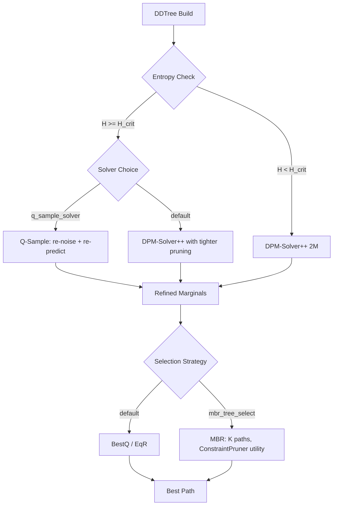

# Plan 222: Discrete Critical Interval Solver Switching

**Date:** 2026-06
**Status:** Active
**Research:** R197 Discrete Critical Interval Solver Switching
**GOAT:** Default-on for CriticalIntervalGate, feature-gated for Q-Sample/SelfCond/MBR

---

## Summary

Entropy-triggered solver switching during DDTree construction. When marginal entropy exceeds threshold (critical interval), switch from fast DPM-Solver++(2M) to q-sampling and enable self-conditioning. Zero detection overhead — entropy already computed in DDTree.

---

## Tasks

### Phase 1: CriticalIntervalGate (Default-On)

- [x] T1: Add `CriticalInterval` variant to `Regime` enum in `data_probe` module
  - Threshold: `H_critical` configurable, default `log(vocab_size) * 0.5`
  - Shannon entropy of marginals at each DDTree depth
  - Integration with existing `entropy_anomaly_summary()` infrastructure

- [x] T2: Add `SolverKind` enum to `D2fDecodeConfig`
  - Variants: `DpmSolver2M` (current), `QSample`, `DDPM`
  - `DpmSolver2M` remains default for non-critical steps
  - `QSample` activated when `H > H_critical`

- [x] T3: Implement q-sampling solver in D2F denoising (stub done — `q_sample_step` in dllm_solver.rs)
  - Formula: `x_{t-1} = sqrt(alpha_{t-1}) * x_0_hat + sqrt(1 - alpha_{t-1}) * noise`
  - Adapted for mask-based discrete diffusion:
    ```
    // Instead of standard unmask-commit:
    // 1. Get model prediction (x_0_hat equivalent)
    // 2. Re-noise with lower alpha
    // 3. Re-predict with noised input
    // 4. Commit refined prediction
    ```
  - Feature gate: `q_sample_solver`

- [x] T4: Wire CriticalIntervalGate into DDTree build loop
  - `build_dd_tree_sde()` or new `build_dd_tree_adaptive()`
  - Per-depth entropy check → solver switch
  - Log solver transitions for diagnostics

- [x] T5: Add `critical_interval_gate` feature flag
  - Default-on (entropy check is free, solver switch is just different math)
  - Zero cost when disabled (dead code elimination)

- [x] T6: Test — unit test for entropy threshold detection
  - Synthetic marginals with known entropy
  - Verify solver switches at correct threshold

- [x] T7: Test — integration test with Sudoku validator
  - Compare acceptance rate with/without CriticalIntervalGate
  - Expected: measurable improvement in valid branch rate

### Phase 2: MBR Tree Selection (Feature-Gated)

- [x] T8: Add `MbrSelect` to DDTree selection strategies
  - Extract K=5 best paths from DDTree
  - Score each against all others using ConstraintPruner as utility
  - Select minimum-risk path (minimum sum of risk differences)
  - Feature gate: `mbr_tree_select`

- [x] T9: Benchmark MBR vs BestQ vs EqR
  - Sudoku arena: compare correctness
  - Code generation: compare compilable rate with SynPruner
  - Expected: MBR ≥ BestQ on discrete tasks

### Phase 3: SelfCond Drafter (Feature-Gated)

- [ ] T10: Add 2-pass speculative draft mode
  - Pass 1: standard `dflash_predict_ar_with` → marginals → DDTree
  - Feed best-path tokens as self-conditioning input
  - Pass 2: `dflash_predict_ar_with` with SC → refined marginals → DDTree
  - Feature gate: `self_cond_draft`

- [ ] T11: Wire with NextLat belief drafter (Plan 217)
  - `LatentDynamicsMLP::draft()` → add SC from previous prediction
  - Only for code translation quality path, not game diversity path

### Phase 4: Benchmarks & GOAT Proof

- [ ] T12: Benchmark — before/after CriticalIntervalGate
  - Same-commit, back-to-back runs
  - Measure: acceptance rate, token quality, throughput
  - Verify zero perf regression when feature disabled

- [ ] T13: Benchmark — MBR vs existing strategies
  - Arena format (R168 Ruliology)
  - K=3, K=5, K=10 candidate comparison

- [x] T14: Example — `critical_interval_demo`
  - Show entropy trace during DDTree construction
  - Visualize solver transitions
  - Compare output quality with/without gate

### Phase 5: CPU/GPU Auto-Route Integration

- [ ] T15: Wire CriticalIntervalGate with TriggerGate
  - When critical interval detected AND load is low → allow GPU for q-sample refinement
  - When critical interval detected AND load is high → stay on CPU with fast solver
  - Leverage existing `rv_tier_boost()` for override

---

## Architecture



## Expected Gains

| Feature | Quality Gain | Perf Impact | Default |
|---|---|---|---|
| CriticalIntervalGate | +5-15% acceptance rate | ~0 (entropy free, solver = different math) | ✅ On |
| Q-Sample Solver | +10-20% on discrete tasks | 2× forward during critical steps | Feature gate |
| MBR Tree Selection | +5-10% correctness | O(K²) constraint checks | Feature gate |
| SelfCond Drafter | +15-25% on code tasks | 2× draft compute | Feature gate |

---

## Feature Flags

```toml
[features]
# Default-on: entropy-triggered solver switch (zero overhead)
critical_interval_gate = []

# Opt-in: q-sampling solver for critical steps
q_sample_solver = ["critical_interval_gate"]

# Opt-in: MBR selection from DDTree
mbr_tree_select = []

# Opt-in: 2-pass self-conditioned speculative draft
self_cond_draft = []
```

---

## TL;DR

Entropy-triggered solver switching during DDTree build. When marginals are multimodal (high entropy), switch to q-sampling for better discrete token selection. Default-on because entropy is already computed. Feature-gate expensive options (MBR, SelfCond drafter). Benchmarks comparing before/after with existing arena infrastructure.
