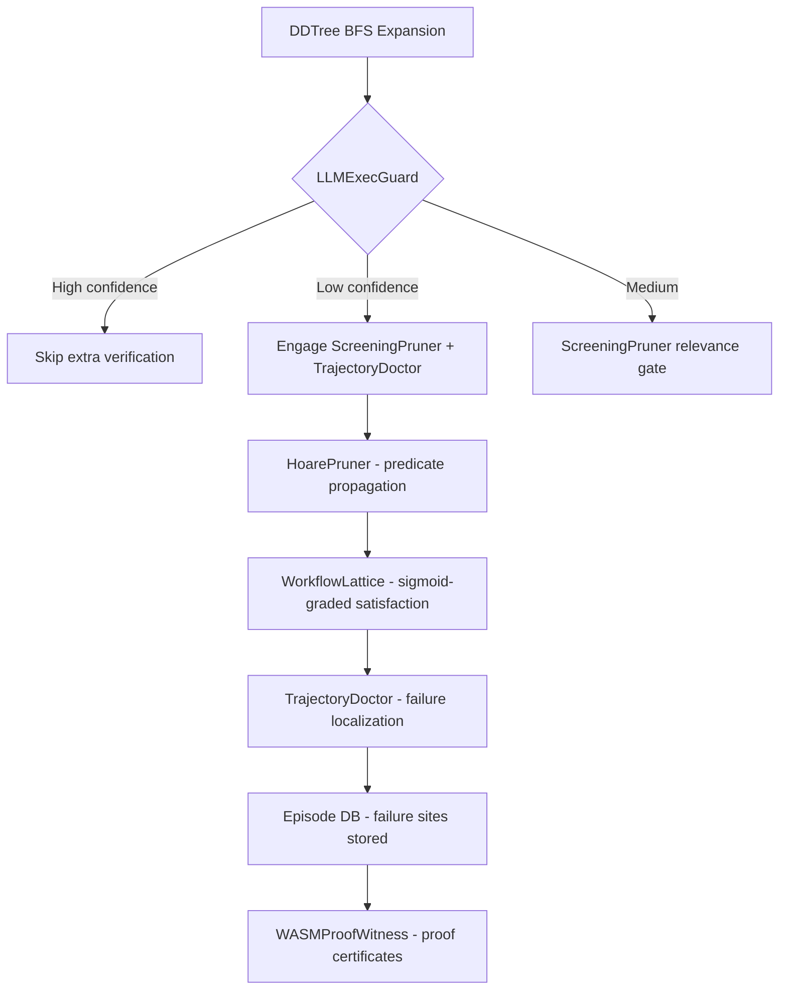

# Plan 223: Lean4Agent Formal Verification Fusion

**Date:** 2026-06-08
**Source:** Research 198 — Lean4Agent Formal Workflow Verification
**Paper:** arXiv:2606.06523
**Status:** Planning

---

## Summary

Distill Lean4Agent's 3-layer formal verification into modelless inference-time components for katgpt-rs. 5 ideas, 1 default-on, 4 feature-gated.

---

## Architecture

---

## Tasks

### Phase 1: LLMExecGuard (Default-On, GOAT)

- [x] Implement `llmexec_confidence(entropy, depth) -> f32` using sigmoid
- [x] Integrate with existing entropy collapse detection (Plan 212)
- [x] Add 3-tier routing: high confidence (skip), low (full verify), medium (screening)
- [x] Add feature gate `llmexec_guard` — **default on**
- [x] Write test: before/after comparison on synthetic entropy distributions
- [ ] Benchmark: measure overhead with guard ON vs OFF on DDTree expansion

### Phase 2: HoarePruner (Feature-Gated)

- [ ] Define `SemanticState` struct with BLAKE3 hash
- [ ] Define `Predicate` enum (base + AND/OR composition + ext via WASM)
- [ ] Add `propagate()` to `ConstraintPruner` trait with default no-op
- [ ] Implement for `SynPruner` — track bracket/keyword predicates across tokens
- [ ] Add feature gate `hoare_pruner`
- [ ] Write test: predicate propagation through multi-step DDTree path
- [ ] Benchmark: measure propagation overhead vs stateless pruner

### Phase 3: TrajectoryDoctor (Feature-Gated)

- [ ] Define `TrajectoryDoctor` trait with `localize_failure()`
- [ ] Define `FailureSite` struct (depth, token_idx, violated_predicate, alternatives)
- [ ] Implement for DDTree replay — trace back from rejected output to first violation
- [ ] Connect to Episode DB — store failure sites for constraint synthesis (Plan 206)
- [ ] Add feature gate `trajectory_doctor`
- [ ] Write test: given rejected trajectory, verify localization finds correct failure depth
- [ ] Example: before (no localization, retry from scratch) vs after (localized repair)

### Phase 4: WorkflowLattice (Feature-Gated)

- [ ] Define `PredicateNode` with implication ordering
- [ ] Build join/meet tables for AND/OR composition
- [ ] Implement `ScreeningPruner` for `WorkflowLattice` with sigmoid-graded relevance
- [ ] Integrate with DDTree BFS — incremental satisfaction propagation
- [ ] Add feature gate `workflow_lattice`
- [ ] Write test: lattice satisfaction incrementally builds across DDTree levels
- [ ] Benchmark: lattice pruner vs flat ScreeningPruner on structured generation

### Phase 5: WASMProofWitness (Feature-Gated, Shared with riir-ai)

- [ ] Extend WASM validator ABI — add `witness_hash` and `violated_rule` to return
- [ ] Implement BLAKE3 witness hash computation in WASM validators
- [ ] Add feature gate `wasm_proof_witness`
- [ ] Write test: witness determinism — same input produces same hash
- [ ] Update WASM batch API template to include witness fields
- [ ] Document ABI change and migration path

---

## Expected Gains

Based on Lean4Agent's results:
- **LLMExecGuard:** 5-15% fewer verification rounds in common case (entropy-gated skip)
- **HoarePruner:** 10-15% improvement in structured generation (predicate propagation catches errors early)
- **TrajectoryDoctor:** 50% reduction in re-generation cost (localized repair vs full retry)
- **WorkflowLattice:** 5-10% improvement in relevance scoring (continuous vs binary)
- **WASMProofWitness:** Enables audit trail for commercial SaaS (qualitative, not quantitative)

---

## Constraints

- **No perf hurt on default path** — LLMExecGuard must be zero-cost or negative-cost when entropy is low
- **SOLID** — each idea is a separate trait/struct, no god objects
- **Feature gates** — 4 of 5 ideas behind feature gates, only LLMExecGuard default-on
- **Tests/examples** showing before/after with expected gains for each phase
- **CPU/GPU auto-route** — LLMExecGuard routing adapts based on load (entropy thresholds)

---

## Dependencies

| Phase | Depends On |
|-------|-----------|
| Phase 1 | Plan 212 (Collapse-Aware Adaptive Thinking) — entropy detection |
| Phase 2 | Phase 1 (LLMExecGuard) — predicate state needs entropy context |
| Phase 3 | Phase 2 (HoarePruner) — localization requires predicate tracking |
| Phase 4 | Phase 2 (HoarePruner) — lattice builds on predicate propagation |
| Phase 5 | None — independent WASM ABI extension |

---

## TL;DR

5 ideas from Lean4Agent distillation. LLMExecGuard (entropy-driven verification budgeting) is GOAT and default-on — zero cost when LLMExec holds, catches failures early when it doesn't. HoarePruner, TrajectoryDoctor, WorkflowLattice are feature-gated exploration. WASMProofWitness extends commercial moat with auditable proof certificates. All modelless, all Rust-native, all feeding Episode DB flywheel.
