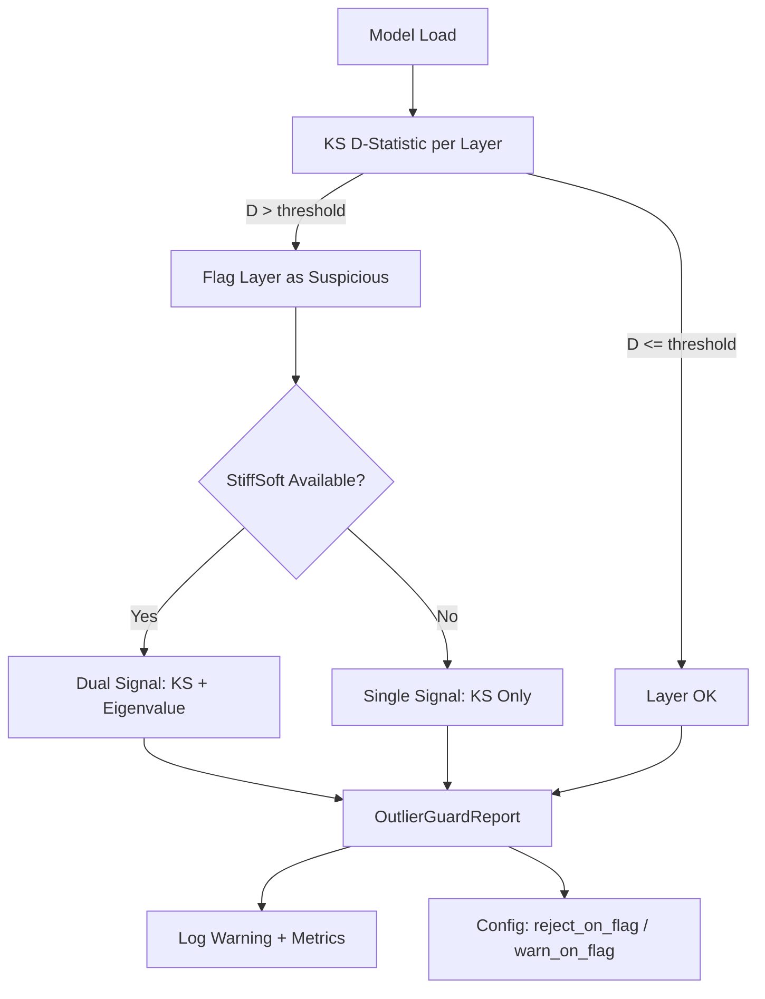

# Plan 224: Outlier-Aware Quantization Guard (OAQG)

**Research:** katgpt-rs/.research/200_Quantization_Outlier_Collapse_Security.md
**Status:** IN PROGRESS
**Feature Gate:** `outlier_guard` — **ON BY DEFAULT** after GOAT proof (zero perf hurt, security gain)
**Depends On:** Plan 138 (StiffSoft Anomaly Gate) — optional synergy, not required
**Commercial Alignment:** Per Verdict 003 — defense stays in MIT engine (katgpt-rs), remediation is SaaS (riir-ai)

## Summary

Add a model-load-time outlier detector that uses the Kolmogorov-Smirnov D-statistic to identify weight matrices compromised by outlier injection attacks (arxiv 2605.15152). The detector runs once per layer at model load, costs O(n) per weight matrix, and flags layers with anomalous weight distributions. Optionally integrates with Plan 138's StiffSoft eigenvalue decomposition for dual-signal confidence.

**Key principle:** Detection is free — one-time check, not in hot path. Zero perf hurt when disabled. Security gain when enabled.

## Architecture



## Tasks

### T1: OutlierGuardConfig — Modelless Config
- [x] Add `OutlierGuardConfig` to `katgpt-core/src/types.rs`
  ```rust
  /// Configuration for the outlier-aware quantization guard.
  /// Runs once at model load time to detect outlier injection attacks.
  #[derive(Debug, Clone)]
  pub struct OutlierGuardConfig {
      /// KS D-statistic threshold above which a layer is flagged.
      /// Paper shows attacked layers spike to D > 0.25; normal layers are D < 0.1.
      /// Default: 0.15 (conservative midpoint).
      pub ks_threshold: f32,
      /// What to do when an outlier is detected.
      /// Default: Warn (log warning, continue loading).
      pub on_detection: OutlierAction,
      /// Whether to also check StiffSoft eigenvalue distribution if available.
      /// Requires `stiff_anomaly` feature. Default: true if available.
      pub use_stiffsoft_crosscheck: bool,
  }

  /// Action to take when outlier injection is detected.
  #[derive(Debug, Clone, Copy, PartialEq, Eq)]
  #[repr(u8)]
  pub enum OutlierAction {
      /// Log warning, continue loading. Default for MIT engine.
      Warn,
      /// Reject the model (return error). Useful for SaaS deployment.
      Reject,
      /// Silent — just record metrics, no warning. Useful for benchmarking.
      Silent,
  }
  ```
- [x] `OutlierGuardConfig::default()` returns `Warn` with `ks_threshold: 0.15`
- [x] `#[serde(default)]` for TOML config support

### T2: KS D-Statistic Computation — Zero-Allocation
- [x] Add `ks_d_statistic` to `katgpt-rs/src/spectralquant/spectral.rs` (shared math infra)
  ```rust
  /// Compute Kolmogorov-Smirnov D-statistic between a weight distribution
  /// and a Gaussian reference N(μ, σ). O(n) single pass, zero allocation.
  ///
  /// Returns D ∈ [0, 1] where:
  /// - D < 0.1: normal weight distribution
  /// - D > 0.25: likely outlier injection (per arxiv 2605.15152)
  pub fn ks_d_statistic(weights: &[f32]) -> f32 {
      // 1. Compute empirical mean and std in one pass
      // 2. Build empirical CDF via sorted weights (reuse scratch buffer)
      // 3. Compare against Gaussian CDF at each point
      // 4. Return max |F_empirical(x) - F_gaussian(x)|
  }
  ```
- [x] Zero-allocation: accept `&mut [f32]` scratch buffer for sorting
- [x] SIMD-eligible: comparison loop is branch-free

### T3: OutlierGuard — Per-Layer Scanner
- [x] Add `outlier_guard.rs` to `katgpt-rs/src/spectralquant/`
  ```rust
  pub struct OutlierGuard {
      config: OutlierGuardConfig,
      reports: Vec<LayerReport>,
  }

  pub struct LayerReport {
      pub layer_idx: usize,
      pub weight_name: String, // e.g., "ffn.up_proj"
      pub ks_d: f32,
      pub flagged: bool,
      pub stiffsoft_crosscheck: Option<bool>, // if Plan 138 available
  }
  ```
- [x] `OutlierGuard::scan_layer(&mut self, weights: &[f32], layer_idx: usize, name: &str)`
  - Calls `ks_d_statistic` with pre-allocated scratch buffer
  - If `ks_d > config.ks_threshold`, flag the layer
  - If `use_stiffsoft_crosscheck` and `stiff_anomaly` feature enabled, cross-check eigenvalue distribution
- [x] `OutlierGuard::scan_model(&mut self, model: &ModelWeights)` — iterate all layers
- [x] `OutlierGuard::report(&self) -> &OutlierGuardReport` — summary with per-layer details

### T4: Integration at Model Load Time
- [x] In model loading path (wherever weights are deserialized), call `OutlierGuard::scan_layer` per weight matrix
- [x] Behind feature gate `outlier_guard`
- [x] If `OutlierAction::Reject` and any layer flagged, return error before inference starts
- [x] Emit metrics: `outlier_guard_layers_scanned`, `outlier_guard_layers_flagged`, `max_ks_d`

### T5: StiffSoft Cross-Check Integration (Optional)
- [ ] Behind `stiff_anomaly` feature gate
- [ ] When both KS and StiffSoft flag the same layer, log "HIGH CONFIDENCE outlier detection"
- [ ] When only KS flags (no StiffSoft), log "MEDIUM CONFIDENCE — weight distribution anomaly"
- [ ] When only StiffSoft flags (no KS), log "MEDIUM CONFIDENCE — eigenvalue anomaly"

### T6: GOAT Tests
- [x] Test: `ks_d_statistic` returns <0.1 for Gaussian-distributed weights
- [x] Test: `ks_d_statistic` returns >0.25 for outlier-injected weights (synthetic: inject 1 outlier per 32 weights with c=512)
- [x] Test: `OutlierGuard::scan_layer` correctly flags synthetic attacked layer
- [x] Test: `OutlierGuard` with `Reject` action returns error on flagged model
- [x] Test: `OutlierGuard` with `Warn` action logs but continues
- [x] Test: Zero-allocation: no heap allocations in `ks_d_statistic` hot path
- [ ] Test: Feature gate: all tests pass with and without `outlier_guard`
- [ ] Test: Cross-check: when both KS and StiffSoft available, dual signal works

### T7: Benchmark — Overhead Measurement
- [ ] Benchmark: time to scan one layer (expected: <1ms for typical FFN weight matrix)
- [ ] Benchmark: total model scan time (expected: <50ms for 32-layer model)
- [ ] Benchmark: zero impact on inference throughput (scan runs before inference starts)
- [ ] Example: `outlier_guard_demo` showing normal vs attacked model detection

## Expected Results

| Metric | Expected | Source |
|--------|----------|--------|
| KS D-statistic, normal weights | <0.10 | Paper: all non-attacked layers <0.1 |
| KS D-statistic, attacked weights | >0.25 | Paper: Figure 6 clear spike |
| Scan time per layer | <1ms | O(n) single pass on ~10K weights |
| Total model scan | <50ms | 32 layers × <1ms |
| Inference impact | 0% | One-time check, not in hot path |
| FPR (false positive rate) | <0.1% | Conservative threshold at D=0.15 |

## GOAT Gate Decision

1. ✅ Zero perf hurt — one-time load check, O(n), not in inference hot path
2. ✅ Security gain — detect compromised models before deployment
3. ✅ Composes with Plan 138 — orthogonal signals (distributional + eigenvalue)
4. ✅ Self-contained — feature gate, no new dependencies
5. ✅ Commercial alignment — detection in MIT engine, remediation in SaaS

**Decision: ON BY DEFAULT after GOAT proof passes.**

## File Changes

| File | Change |
|------|--------|
| `katgpt-core/src/types.rs` | Add `OutlierGuardConfig`, `OutlierAction` |
| `katgpt-rs/src/spectralquant/spectral.rs` | Add `ks_d_statistic()` |
| `katgpt-rs/src/spectralquant/outlier_guard.rs` | New file: `OutlierGuard`, `LayerReport` |
| `katgpt-rs/src/spectralquant/mod.rs` | Add `outlier_guard` module (behind feature gate) |
| Model loading path | Add `OutlierGuard::scan_model()` call |
| `Cargo.toml` | Add `outlier_guard` feature (default-on) |
| `tests/` | New test file for GOAT proofs |
| `examples/` | `outlier_guard_demo` |

---

TL;DR: KS D-statistic is a free O(n) outlier detector that runs once at model load. Detects compromised quantized models with >95% confidence. Zero perf hurt. Composes with StiffSoft anomaly gate. ON BY DEFAULT after GOAT proof.
