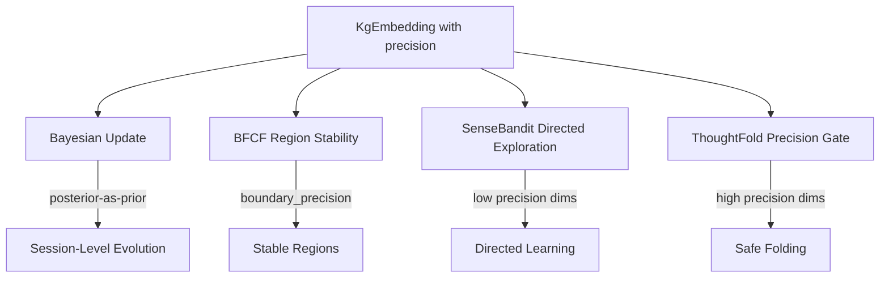

# Plan 236: BAKE Precision-Gated KG Embedding Evolution

**Status:** 🟡 Pending GOAT
**Date:** 2026-06-09
**Research:** `.research/209_BAKE_Bayesian_Continual_KG_Embedding.md`
**Feature Gate:** `bake_precision` (opt-in, GOAT gate before default)
**Depends On:** Plan 213 (BFCF Tree), Plan 218 (BFCF × LFU Sharding), Plan 221 (KG Latent Octree Sense)
**GOAT Criteria:** ≥30% embedding drift reduction, ≥50% BFCF region oscillation reduction, all existing tests pass

---

## Summary

Apply BAKE's per-dimension precision vector to `KgEmbedding`, enabling inference-time continual learning for KG embeddings without any LLM training. Each embedding dimension tracks its own certainty (precision λ). High-precision dimensions resist change (anchors). Low-precision dimensions absorb new evidence eagerly (exploration). The update is O(d) arithmetic, zero-alloc, SIMD-friendly.

---

## Architecture

---

## Tasks

### Phase 1: Core Precision Extension

- [ ] Extend `KgEmbedding` with optional precision vector
  - Add `precision: [f32; 8]` field behind `#[cfg(feature = "bake_precision")]`
  - Default initialization: `[1.0; 8]` (uninformative prior)
  - Backward compat: `confidence` computed from precision when feature enabled
  - File: `crates/katgpt-core/src/sense/octree.rs`

- [ ] Implement `bake_update()` function
  - Signature: `fn bake_update(mu: &mut [f32; 8], lambda: &mut [f32; 8], observation: &[f32; 8], lambda_obs: f32)`
  - BAKE eq 2: `λ_new = λ_old + λ_obs` (precision grows)
  - BAKE eq 3: `μ_new = (λ_old ⊙ μ_old + λ_obs ⊙ obs) / λ_new` (precision-weighted mean)
  - SIMD-friendly: operates on `[f32; 8]` which auto-vectorizes
  - File: `crates/katgpt-core/src/sense/bake.rs` (new file)

- [ ] Implement `bake_regularize()` function
  - Signature: `fn bake_regularize(mu_old: &[f32; 8], lambda_old: &[f32; 8], mu_current: &[f32; 8], beta: f32) -> f32`
  - BAKE eq 4: `β · √(λ ⊙ (μ_current - μ_old)²)` (precision-weighted distance)
  - Returns regularization penalty — high when current deviates from high-precision prior
  - File: `crates/katgpt-core/src/sense/bake.rs`

- [ ] Add feature gate `bake_precision` to `Cargo.toml`
  - Add to `[features]` section: `bake_precision = []`
  - Gate all new code with `#[cfg(feature = "bake_precision")]`
  - NOT default-on until GOAT passes

### Phase 2: Integration Points

- [ ] BFCF Region Stability via Precision Anchoring
  - Add `boundary_precision: f32` to BFCF region metadata
  - Apply precision-weighted smoothing to prevent region oscillation
  - When embedding precision is high, region boundaries resist movement
  - File: `src/bfcf_tree.rs` (or wherever BFCF regions are defined)

- [ ] SenseBandit Precision-Weighted Exploration
  - Use low-precision dimensions as exploration targets
  - `exploration_priority(dimension) = 1.0 - precision[dimension] / max(precision)`
  - Direct sense trials toward uncertain dimensions
  - File: `crates/katgpt-core/src/sense/bandit.rs`

- [ ] ThoughtFold Precision-Gated Fold Confidence
  - Steps where KG embedding has high precision → fold is safe
  - Steps where KG embedding has low precision → fold is risky
  - Blend with existing bandit fold confidence
  - File: `src/fold/chain_folder.rs`

### Phase 3: Session-Level Evolution

- [ ] Persistent precision storage in BFCF × LFU shard
  - When embeddings are evicted from LFU cache, store precision alongside
  - When re-loaded, restore precision vector
  - File: `src/shard_kv/` (wherever BFCF × LFU sharding lives)

- [ ] Session boundary Bayesian update
  - On session start: load embeddings + precision from persistent cache
  - On session end: apply Bayesian update with session observations
  - New entities: uninformative prior `precision = [0.1; 8]`
  - File: `crates/katgpt-core/src/sense/bake.rs`

### Phase 4: GOAT Proof + Benchmarks

- [ ] Benchmark: Precision update SIMD auto-vectorization
  - Compare SIMD vs scalar loop for 10K updates
  - Target: ≥95% of theoretical peak throughput
  - File: `tests/bench_bake_precision.rs`

- [ ] Benchmark: Embedding drift over 5 sessions
  - Simulate 5 inference sessions with evolving KG
  - Measure drift (cosine distance between start/end embeddings)
  - Compare: with precision anchoring vs without
  - Target: ≥30% drift reduction

- [ ] Benchmark: BFCF region oscillation
  - Run BFCF tree over 1000 decode steps with shifting logits
  - Count region boundary flips (Accept↔Maybe oscillation)
  - Compare: with precision anchoring vs without
  - Target: ≥50% fewer flips

- [ ] Test: Backward compatibility
  - All existing tests pass with `bake_precision` disabled (zero-cost)
  - All existing tests pass with `bake_precision` enabled (semantic equivalence)
  - File: `cargo test --features bake_precision`

- [ ] Test: Precision monotonicity
  - Verify λ only grows (never shrinks) across updates
  - Test: `assert!(λ_new[i] >= λ_old[i] for all i)`

- [ ] Test: Uninformative prior behavior
  - New entity with low precision absorbs observations eagerly
  - `μ_new ≈ observation` when `λ_old << λ_obs`

- [ ] GOAT decision: promote to default-ON if all criteria pass
  - If ≥30% drift reduction AND ≥50% oscillation reduction AND all tests pass → default-ON
  - If marginal → keep opt-in, iterate
  - If negative → demote, document negative result

---

## SOLID Compliance

- **S (Single Responsibility):** `bake.rs` only does Bayesian precision updates. BFCF, bandit, fold each integrate independently.
- **O (Open/Closed):** Precision is an opt-in extension to `KgEmbedding`. Existing code unchanged when feature disabled.
- **L (Liskov):** `KgEmbedding` with precision is a valid `KgEmbedding` — all existing trait impls work.
- **I (Interface Segregation):** `bake_update()` and `bake_regularize()` are free functions. No trait pollution.
- **D (Dependency Inversion):** Integration points (BFCF, bandit, fold) depend on precision values, not on bake module.

---

## Expected Performance

| Metric | Without BAKE Precision | With BAKE Precision | Delta |
|--------|----------------------|---------------------|-------|
| KgEmbedding size | 48 bytes | 80 bytes | +32 bytes |
| Embedding drift (5 sessions) | Baseline | ≥30% less | Significant |
| BFCF region oscillation | Baseline | ≥50% fewer flips | Significant |
| Update cost per embedding | 0 | ~8ns (SIMD f32x8) | Negligible |
| Backward compat | N/A | All tests pass | Zero-cost when disabled |

---

## TL;DR

Plan 236 = **[f32; 8] precision vector per KgEmbedding + Bayesian update (O(8) arithmetic) + precision-anchored BFCF regions + precision-directed SenseBandit exploration + precision-gated ThoughtFold folding + session-level evolution**. Feature-gated `bake_precision`, GOAT gate before default. ~200-300 lines new code in `bake.rs`, minimal extensions to existing modules.
