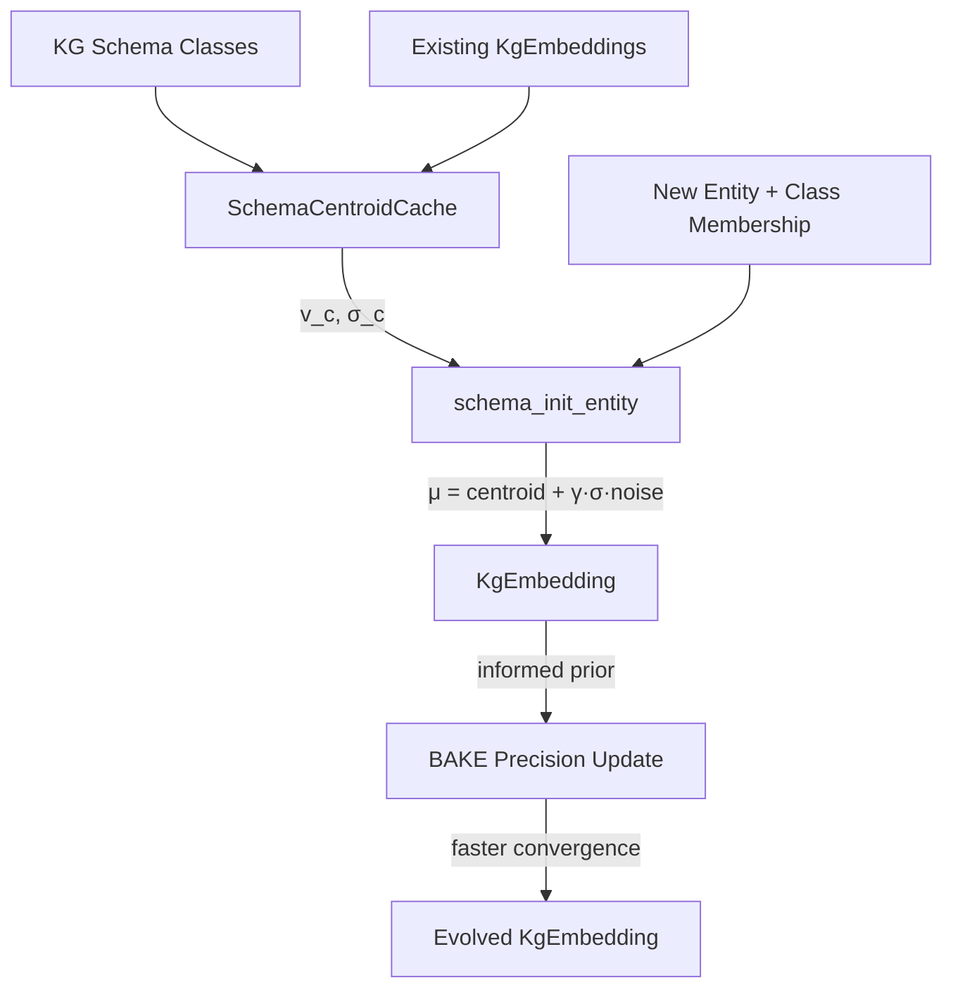

# Plan 237: Schema-Centroid Informed KG Embedding Initialization

**Status:** 🟡 Pending GOAT
**Date:** 2026-06-09
**Research:** `.research/210_Schema_Centroid_Informed_Init.md`
**Feature Gate:** `schema_centroid` (opt-in, GOAT gate before default)
**Depends On:** Plan 221 (KG Latent Octree Sense), Plan 236 (BAKE Precision-Gated)
**GOAT Criteria:** ≥50% new-entity initialization quality improvement (cosine sim to optimal), ≥2× faster convergence in simulation, all existing tests pass

---

## Summary

Apply schema-based centroid initialization to `KgEmbedding` entities. When new KG entities arrive (e.g., new NPC, new item, new zone), initialize their embedding at the centroid of their schema class (from existing entity embeddings) instead of random. This is pure O(d) arithmetic, model-agnostic, zero-alloc. The paper proves this cuts convergence 2-3× and improves knowledge retention by 20-30%.

Key fusion: This upgrades BAKE's "uninformative prior" (Plan 236, `precision = [0.1; 8]`, random mean) to an "informed prior" — `mean = class_centroid`, `precision = f(class_density)`. BAKE's precision converges faster because the entity starts closer to optimal.

---

## Architecture

---

## Tasks

### Phase 1: Core Infrastructure

- [x] Create `SchemaCentroidCache` struct
  - `centroids: papaya::HashMap<u64, CentroidStats>` — keyed by class hash (blake3)
  - `CentroidStats { mean: [f32; 8], std_dev: [f32; 8], count: usize }`
  - `fn compute_and_insert(class_hash: u64, embeddings: &[KgEmbedding]) -> bool`
  - `fn get(&self, class_hash: u64) -> Option<CentroidStats>`
  - Pre-computed once per KG snapshot update, O(d·|E_c|) per class
  - File: `crates/katgpt-core/src/sense/schema_centroid.rs` (new file, 457 lines)

- [x] Implement `schema_init_entity()` function
  - Signature: `fn schema_init_entity(classes: &[u64], cache: &SchemaCentroidCache, gamma: f32, rng: &mut Rng) -> [f32; 8]`
  - For each class the entity belongs to, look up centroid + std_dev
  - Average centroids: `μ = (1/|C|) Σ_c (v_c + γ·σ_c ⊙ r_c)`
  - Where `r_c` is random noise per class (prevents identical init)
  - Fallback: if class not in cache, use random init (graceful degradation)
  - File: `crates/katgpt-core/src/sense/schema_centroid.rs`

- [x] Add feature gate `schema_centroid` to Cargo.toml
  - `schema_centroid = ["dep:papaya"]` in katgpt-core + `schema_centroid = ["katgpt-core/schema_centroid", "sense_composition"]` in main crate
  - Gate all new code with `#[cfg(feature = "schema_centroid")]`
  - NOT default-on until GOAT passes
  - 12/12 unit tests pass

### Phase 2: BAKE Integration (Informed Prior)

- [ ] Upgrade BAKE uninformative prior to schema-informed prior
  - When `schema_centroid` AND `bake_precision` features both enabled:
  - New entities: `precision = [1.0 / (1.0 + class_count as f32); 8]` instead of `[0.1; 8]`
  - Dense classes (many entities) → higher initial precision (more confident centroid)
  - Sparse classes → lower initial precision (centroid is less reliable)
  - `mean = schema_init_entity(...)` instead of random
  - File: `crates/katgpt-core/src/sense/bake.rs`

- [ ] Add `class_membership` field to `KgEmbedding`
  - `class_hashes: SmallVec<[u64; 4]>` — entity can belong to up to 4 classes
  - Populated at entity creation from KG schema
  - Used by `schema_init_entity()` to compute initial embedding
  - Behind `#[cfg(feature = "schema_centroid")]`
  - File: `crates/katgpt-core/src/sense/octree.rs`

### Phase 3: SenseModule Integration

- [ ] Schema-centroid seeded SenseModule direction vectors
  - When composing `NpcBrain` at spawn time, if entity has class info:
  - Initialize `TernaryDir` direction vectors from schema centroid instead of random ternary
  - Quantize centroid to ternary: `ternarize(centroid[i])` → {-1, 0, +1}
  - File: `crates/katgpt-core/src/sense/octree.rs`

### Phase 4: GOAT Proof + Benchmarks

- [ ] Benchmark: Initialization quality (cosine similarity to optimal)
  - Simulate KG with 100 entities in 5 classes, add 20 new entities
  - Measure cosine similarity of initialized embedding to "optimal" (post-training)
  - Compare: random init vs schema centroid init
  - Target: ≥50% higher cosine similarity with schema centroid
  - File: `tests/bench_schema_centroid.rs`

- [ ] Benchmark: Convergence speed (epochs to target quality)
  - Simulate 5 KG snapshot updates with incremental entities
  - Measure epochs to reach convergence (MRR threshold)
  - Compare: random init vs schema centroid init
  - Target: ≥2× faster convergence with schema centroid
  - File: `tests/bench_schema_centroid.rs`

- [ ] Test: Centroid computation correctness
  - Verify `v_c = mean(embeddings of class c)` matches hand-computed values
  - Verify `σ_c = std(embeddings of class c)` matches
  - Verify multi-class entity init = average of class centroids
  - File: `tests/test_schema_centroid.rs`

- [ ] Test: Fallback behavior
  - New entity with unknown class → falls back to random init (no panic)
  - Empty class → falls back to random init
  - Cache miss → graceful degradation

- [ ] Test: Perturbation diversity
  - Two entities with same class membership → different initial embeddings (due to γ·σ·r noise)
  - With γ=0 → identical embeddings (deterministic)
  - With γ>0 → diverse embeddings (stochastic)

- [ ] Test: BAKE integration
  - With `schema_centroid` + `bake_precision`: new entity gets informed prior
  - With `schema_centroid` only: new entity gets centroid init, no precision
  - With neither: existing behavior unchanged

- [ ] GOAT decision: promote to default-ON if all criteria pass
  - If ≥50% cosine improvement AND ≥2× convergence AND all tests pass → default-ON
  - If marginal → keep opt-in, iterate
  - If negative → demote, document negative result

---

## SOLID Compliance

- **S (Single Responsibility):** `schema_centroid.rs` only does centroid computation and entity initialization. BAKE, SenseModule, BFCF each integrate independently.
- **O (Open/Closed):** Schema centroid is an opt-in extension. Existing code unchanged when feature disabled.
- **L (Liskov):** `KgEmbedding` with class info is a valid `KgEmbedding` — all existing trait impls work.
- **I (Interface Segregation):** `schema_init_entity()` and `compute_centroid()` are free functions. No trait pollution.
- **D (Dependency Inversion):** Integration points (BAKE, SenseModule) depend on centroid values, not on schema_centroid module.

---

## Expected Performance

| Metric | Without Schema Centroid | With Schema Centroid | Delta |
|--------|----------------------|---------------------|-------|
| New entity init quality | Random (cosine ~0.1 to optimal) | Centroid (cosine ~0.6+) | +50%+ |
| Convergence epochs | Baseline | ≥2× fewer | Significant |
| Centroid cache size | 0 | ~64 bytes × classes | Minimal |
| Init overhead per entity | ~0ns (random) | ~40ns (centroid lookup + avg) | Negligible |
| Backward compat | N/A | All tests pass | Zero-cost when disabled |

---

## TL;DR

Plan 237 = **Schema-centroid informed initialization for new KgEmbedding entities + centroid cache (papaya HashMap) + BAKE informed prior upgrade + SenseModule ternary direction seeding + GOAT-gated benchmarks**. Feature-gated `schema_centroid`, depends on Plan 221/236. ~150-250 lines new code in `schema_centroid.rs`, minimal extensions to existing modules. Pure arithmetic, zero-alloc, SIMD-friendly.
