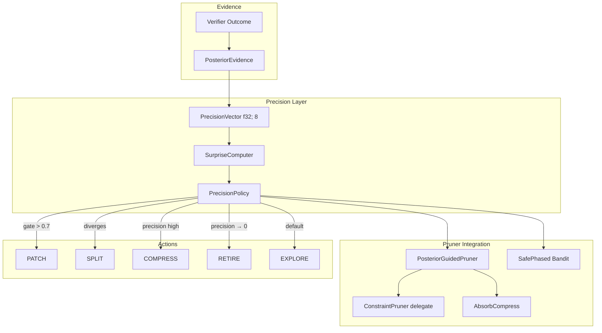

# Plan 238: Posterior-Guided Pruner Evolution (PGPE)

**Status:** Phase 1-4 Complete, Phase 5 Next
**Research:** R211 (Bayesian-Agent distillation), R209 (BAKE precision), R172/P192 (MUSE lifecycle)
**Feature Gate:** `posterior_evolution` (opt-in, default OFF until GOAT proven)

---

## Overview

Fuse BAKE precision vectors with MUSE skill lifecycle to create posterior-guided pruner evolution. Each `ConstraintPruner` arm becomes a Bayesian hypothesis with per-feature precision, enabling precision-gated PATCH/SPLIT/COMPRESS/RETIRE actions.

---

## Tasks

### Phase 1: Core Types & Precision Primitive ✅ COMPLETE (29 tests pass)
- [x] Create `src/pruners/posterior/types.rs` — `PosteriorEvidence` struct (task_id, outcome, context, failure_mode, token_bucket, latency_bucket)
- [x] Create `src/pruners/posterior/precision.rs` — `PrecisionVector<[f32; 8]>` with BAKE-style sequential update (precision += obs, posterior = μ × precision/total)
- [x] Create `src/pruners/posterior/surprise.rs` — `SurpriseComputer` with KL(posterior||prior) per dimension, sigmoid-gated trigger
- [x] Unit tests for precision update correctness (before/after precision values match hand-computed)
- [x] Unit tests for surprise computation (known posterior/prior → known KL divergence)

### Phase 2: Precision Policy (The Five Actions) ✅ COMPLETE (8 tests pass)
- [x] Create `src/pruners/posterior/policy.rs` — `LifecycleAction` enum with 5 actions: Explore, Patch, Split, Compress, Retire
- [x] Implement `PrecisionPolicy::decide(posterior, surprise, observations, failure_modes)` — ordered priority rules with precision thresholds
- [x] Implement `PrecisionPolicy::patch_trigger(surprise, β)` — sigmoid(β × surprise) > 0.7
- [x] Implement `PrecisionPolicy::split_trigger(precision_divergence)` — detect when two arms' precision vectors diverge beyond threshold
- [x] Implement `PrecisionPolicy::compress_trigger(precision)` — precision > λ_compress across merged arms
- [x] Implement `PrecisionPolicy::retire_trigger(precision)` — precision → 0 (converged to uninformative)
- [x] Unit tests for each action trigger with known inputs/expected outputs

### Phase 3: PosteriorGuidedPruner Integration ✅ COMPLETE (15 tests pass)
- [x] Create `src/pruners/posterior/wrapper.rs` — `PosteriorGuidedPruner<P: ScreeningPruner>` decorator that adds precision tracking to any existing pruner
- [x] Implement `ScreeningPruner` for `PosteriorGuidedPruner` — delegates to inner pruner with precision-gated modulation
- [x] Implement `PosteriorGuidedPruner::record_evidence(outcome, context, failure_mode)` — updates precision vector, returns KL surprise
- [x] Implement `PosteriorGuidedPruner::lifecycle_action()` — returns current `PrecisionPolicy` decision
- [x] Implement `PosteriorGuidedPruner::record_structured_evidence()` — accepts full `PosteriorEvidence`
- [x] Implement `PosteriorGuidedPruner::best_arm()` — posterior-guided best arm selection
- [x] Re-export `PosteriorGuidedPruner` and `PrecisionPolicyConfig` from mod.rs and pruners/mod.rs
- [x] Unit tests: cold start, retired arm, evidence recording, best arm convergence, all 5 lifecycle actions, custom config

### Phase 4: Precision-Gated AbsorbCompress ✅ COMPLETE (7 tests pass)
- [x] Add `min_precision_for_compress` and `max_surprise_for_compress` fields to `CompressConfig` (behind `posterior_evolution` feature)
- [x] Add per-arm `PrecisionVector` and `last_surprise` fields to `AbsorbCompressLayer` (behind `posterior_evolution` feature)
- [x] Implement `absorb_with_precision()` — updates both Q-value and precision vector, returns KL surprise
- [x] Implement `compress_candidate_score()` — precision-gated when available, Q-threshold fallback when not
- [x] Modify `compress()` to use precision-gated logic: compress when `precision > λ && surprise < ε && success_prob < 0.5`
- [x] Backward compatible: `#[cfg(feature)]` gates on all new fields, falls back to Q-threshold when precision unavailable
- [x] Fix downstream `CompressConfig` struct literals in `expression_pruner.rs` with `..Default::default()`
- [x] Unit tests: precision-gated compress good/bad arm, Q-threshold fallback, surprise tracking, KL surprise return

### Phase 5: Precision-Gated Safe Exploration
- [ ] Add precision input to `SafePhased` bandit strategy
- [ ] Implement `α = sigmoid(λ × (precision_skill - precision_threshold))` for escalation
- [ ] Backward compatible: if no precision, use phase-gap (existing GOAT behavior)
- [ ] Benchmark: `SafePhased` with precision vs without → verify no regression on existing GOAT tests

### Phase 6: Example / Proof
- [ ] Create `examples/posterior_evolution_demo.rs` — shows before/after precision evolution over 100 tasks
- [ ] Demo scenario: 3 pruner arms, known success rates (0.9, 0.5, 0.1), verify posterior converges correctly
- [ ] Show surprise-triggered PATCH firing on the 0.1 arm
- [ ] Show precision-gated RETIRE on the 0.1 arm after enough evidence
- [ ] Show COMPRESS on the 0.9 arm when precision is high

### Phase 7: GOAT Proof
- [ ] Benchmark: PosteriorGuidedPruner vs baseline BanditPruner on bomber arena (50+ matches)
- [ ] Benchmark: PosteriorGuidedPruner vs baseline on Sudoku arena (100+ boards)
- [ ] Verify precision tracking doesn't regress hot-path perf (<1μs overhead per inference)
- [ ] If GOAT: promote `posterior_evolution` to default feature
- [ ] If NOT GOAT: document why, keep opt-in, investigate failure mode

---

## Architecture

## Dependencies

- R209 (BAKE precision design) — provides precision vector spec
- P192 (Plan 192, skill lifecycle) — provides PrunerMemory + SkillCatalog infra
- P137 (Plan 137, PrudentBanker) — provides SafePhased bandit
- R172 (MUSE research) — provides lifecycle theory

## Constraints

- All posterior math in fixed-size arrays (zero-alloc hot path)
- Use sigmoid not softmax for gating
- Feature-gated behind `posterior_evolution` until GOAT proven
- Backward compatible: no precision → fall back to existing Q-threshold behavior
- SIMD-friendly layout for precision vectors
- Keep files < 2048 lines
