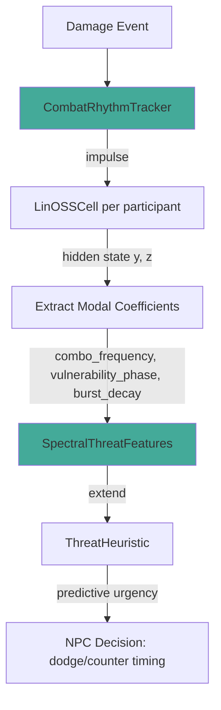

# Plan 241: LinOSS Modal Threat Prediction

**Status:** GOAT Candidate — Most Promising Fusion (Research 212 Fusion C)
**Priority:** P0 — Highest-value fusion from cross-analysis
**Feature Flag:** `spectral_threat` (opt-in, requires `sense_composition`)
**Routing:** katgpt-rs → crates/katgpt-core/src/sense/
**Depends On:** Plan 189 (LinOSS), Plan 221 (Sense Composition)
**Research:** katgpt-rs/.research/212_Gemini_Fourier_LatCal_Fusion_Verdict.md

---

## Why

`ThreatHeuristic` is purely reactive — it scores `time_to_impact_ms` + `direction` after threats appear. NPCs dodge late, always responding, never anticipating. This makes combat feel mechanical.

Meanwhile, `LinOSSCell` already tracks hidden state that oscillates at natural frequencies with damping. When damage events hit the cell as impulses, the hidden state rings at the player's combo frequency. The phase and energy of that ringing encode **when the next hit will land** — even before the threat appears.

This plan bridges the two: extract modal coefficients from LinOSS oscillation dynamics, feed them as spectral features into threat prediction. NPCs predict *when* to dodge, not just *who* to target. No training needed — pure damped oscillator impulse response.

### Key Insight

A player performing a 3-hit combo (slash → slash → heavy) creates a periodic damage impulse train. When fed into a LinOSS cell, the hidden state resonates at the combo frequency. Reading the phase tells the NPC where in the combo cycle the player is — peak damage imminent, or cooldown window. This is analytically sound: damped harmonic oscillator impulse response is well-understood, and we already have the infrastructure.

---

## Architecture



### Data Flow

1. **Damage Event** arrives (from `SimEvent::DamageDealt` / `DamageTaken`)
2. **CombatRhythmTracker** converts damage amount + timing into forcing impulse vector
3. **LinOSSCell.imex_step()** advances hidden state — state oscillates at player's combo ω²
4. **Extract modal coefficients** from `(y, z)` → frequency, phase, damping ratio
5. **SpectralThreatFeatures** feeds into `ThreatHeuristic.evaluate()` as urgency modifier
6. **NPC decides** dodge/counter based on predicted peak, not just observed threat

### New Types

```rust
/// Spectral features extracted from LinOSS combat rhythm tracking.
/// All fields are raw scalars — bridge from latent (LinOSS hidden) to raw (heuristic score).
#[derive(Clone, Copy, Debug, Default)]
#[repr(C)]
pub struct SpectralThreatFeatures {
    /// Dominant combo frequency (ω²) — how fast the player cycles attacks.
    /// High value = fast combo, NPC should prioritize evasion.
    pub combo_frequency: f32,
    /// Phase in combo cycle — 0.0 = damage peak imminent, 0.5 = cooldown window.
    /// Computed as atan2(z_dominant, y_dominant) / 2π, normalized to [0, 1).
    pub vulnerability_phase: f32,
    /// Burst decay rate (β effective) — is burst damage decaying or sustained.
    /// Low β = sustained pressure, high β = exhausting, NPC can wait it out.
    pub burst_decay: f32,
    /// Energy of oscillation — confidence in spectral prediction.
    /// Low energy = insufficient data, fall back to reactive.
    pub rhythm_confidence: f32,
}

/// Maintains LinOSS hidden state per combat participant.
/// Ingests damage events as impulses, extracts modal features on demand.
pub struct CombatRhythmTracker {
    /// Per-participant LinOSS cell (indexed by entity ID or slot).
    cells: Vec<LabeledRhythm>,
    /// Hidden dimension for LinOSS cells.
    hidden_dim: usize,
    /// Timestep for imex_step (derived from tick rate).
    dt: f32,
}
```

### Integration Points

| Component | File | Change |
|-----------|------|--------|
| `SpectralThreatFeatures` | `katgpt-core/src/sense/spectral_threat.rs` | New file |
| `CombatRhythmTracker` | `katgpt-core/src/sense/spectral_threat.rs` | New file |
| `SenseKind` | `katgpt-core/src/types.rs` | Add `SpectralThreat` variant (discriminant 6) |
| `NpcBrain` | `katgpt-core/src/sense/brain.rs` | No change — tracker is a sense module |
| `ThreatHeuristic` | `riir-engine/src/frame/heuristic.rs` | Optional `spectral: Option<SpectralThreatFeatures>` field |
| `FrameSnapshot` | `riir-engine/src/frame/types.rs` | No change — spectral features are computed, not stored |
| `Cargo.toml` | `katgpt-core/Cargo.toml` | Add `spectral_threat` feature gate |

---

## Tasks

### T1: Core Types — `SpectralThreatFeatures`
- [ ] Create `crates/katgpt-core/src/sense/spectral_threat.rs` behind `#[cfg(feature = "spectral_threat")]`
- [ ] Define `SpectralThreatFeatures` struct (4 × f32, `repr(C)`, 16 bytes)
- [ ] Implement `SpectralThreatFeatures::dodge_urgency(&self) -> f32` — sigmoid composite of frequency × phase
  - High frequency + phase near 0.0 → urgency near 1.0 (dodge NOW)
  - Low confidence → urgency near 0.5 (neutral, fall back to reactive)
  - Formula: `sigmoid(combo_frequency * (1.0 - 2.0 * vulnerability_phase) * rhythm_confidence)`
- [ ] Implement `SpectralThreatFeatures::counter_window(&self) -> f32` — inverse of urgency (when to attack)
  - Best counter window: high frequency + phase near 0.5 (cooldown trough)
- [ ] Unit tests: known oscillator states → expected features

### T2: `CombatRhythmTracker`
- [ ] Define `LabeledRhythm` struct: `{ entity_id: u8, cell: LinOSSCell, state: LinOSSState, event_count: u32 }`
- [ ] Implement `CombatRhythmTracker::new(hidden_dim: usize, dt: f32) -> Self`
  - `hidden_dim` = 8 (match HLA dimension for simplicity)
  - `dt` = derived from game tick rate (e.g., 16ms → 0.016)
- [ ] Implement `ingest_damage(&mut self, source_id: u8, amount: f32, tick: u32)`
  - Convert damage amount to forcing vector: `[amount / max_damage; hidden_dim]`
  - Call `cell.imex_step_inplace(&mut state, &forcing, dt)`
  - Increment `event_count`
- [ ] Implement `extract_features(&self, entity_id: u8) -> SpectralThreatFeatures`
  - Find dominant mode: argmax of `|y[i]|` across hidden dimensions
  - `combo_frequency` = `cell.omega_sq[dominant]` (the resonant frequency)
  - `vulnerability_phase` = `atan2(z[dominant], y[dominant]) / (2π)` normalized to [0, 1)
  - `burst_decay` = `cell.beta[dominant]` (damping of dominant mode)
  - `rhythm_confidence` = `cell.energy(&state) * min(1.0, event_count as f32 / 5.0)` (ramp up over 5 events)
- [ ] Implement `reset(&mut self, entity_id: u8)` — clear state for new encounter
- [ ] Pre-allocate `cells` with `Vec::with_capacity(8)` (max tracked participants)
- [ ] Unit tests: impulse train at known frequency → correct modal extraction

### T3: LinOSS Cell Configuration for Combat
- [ ] Create `CombatRhythmTracker::with_combat_frequencies(hidden_dim: usize) -> Self`
  - Pre-tune `omega_sq` to musically meaningful combat frequencies:
    - `[0.5, 1.0, 1.5, 2.0, 2.5, 3.0, 4.0, 6.0]` — covers slow heavy to fast flurry
  - Set `beta` to `[0.1; hidden_dim]` — light damping (oscillation persists between hits)
  - This ensures the cell resonates with common combo patterns
- [ ] Alternative: `auto_calibrate()` — run first N damage events, fit ω² to observed intervals
  - Only if manual tuning proves insufficient (YAGNI initially)

### T4: `SenseKind::SpectralThreat` Integration
- [ ] Add `SpectralThreat = 6` variant to `SenseKind` enum in `types.rs` (behind feature gate)
- [ ] Implement `SenseModule` wrapper: `SpectralThreatModule` — wraps `CombatRhythmTracker`
  - `project(&self, hla_state: &[f32; 8]) -> f32` → `self.tracker.extract_features(self.tracked_entity).dodge_urgency()`
  - Fits existing `NpcBrain.compose()` pipeline without changes to `brain.rs`
- [ ] Register in `SenseKind` conversion functions (`kind_from_u8`, `kind_to_u8`)

### T5: `ThreatHeuristic` Extension (riir-ai)
- [ ] Add `pub spectral: Option<SpectralThreatFeatures>` to `ThreatHeuristic` (behind feature gate)
  - When `None` → existing behavior (reactive only)
  - When `Some` → spectral urgency modifies threat scoring
- [ ] Modify `ThreatHeuristic::evaluate()`:
  - After existing urgency calculation, if spectral features available:
    - `spectral_bonus = spectral.dodge_urgency() * 0.3` — weight spectral prediction at 30%
    - `score -= spectral_bonus` when phase indicates imminent peak (phase < 0.25)
    - `score += spectral.counter_window() * 0.15` when phase indicates cooldown (phase > 0.4)
  - Keep existing reactive logic as primary (70% weight) — spectral augments, not replaces
- [ ] Copy `SpectralThreatFeatures` struct to `riir-engine/src/frame/types.rs` (mirror, not dep)
  - Keep synchronized — both repos own their copy, no cross-repo dep for a 16-byte struct
- [ ] Tests: `ThreatHeuristic` with spectral features scores higher dodge urgency pre-hit

### T6: Arena Proof — GOAT Gate
- [ ] Create `examples/spectral_threat_arena.rs` (follows `bandit_04_combat.rs` pattern)
- [ ] Scripted combo rotation: 3-hit combo (slash/slash/heavy) at 800ms intervals, 60s duration
- [ ] NPC A: standard `ThreatHeuristic` (reactive only)
- [ ] NPC B: `ThreatHeuristic` + `SpectralThreatFeatures` (predictive)
- [ ] Metric: `% of attacks dodged` — NPC B must dodge >30% more than NPC A
- [ ] Metric: `mean HP remaining` at end of 60s — NPC B must end higher
- [ ] Print profiling output with `--nocapture`
- [ ] If NPC B fails to meet 30% dodge improvement → demote, keep as opt-in experiment
- [ ] If NPC B meets threshold → promote to `spectral_threat` default ON proposal

### T7: Feature Gate + Cargo.toml
- [ ] Add `spectral_threat` feature to `katgpt-core/Cargo.toml`
  - Requires: `sense_composition`, `modal_spec` (for LinOSS cell access)
- [ ] Gate all new code with `#[cfg(feature = "spectral_threat")]`
- [ ] Add to `lib.rs` module declaration behind feature gate
- [ ] Verify `cargo check --features spectral_threat` compiles clean
- [ ] Verify `cargo check` (without feature) still compiles — zero regression

### T8: Documentation + Benchmarks
- [ ] Add inline docs explaining the physics: damped oscillator impulse response → combo prediction
- [ ] Benchmark: `CombatRhythmTracker::ingest_damage()` per call (target: <100ns)
- [ ] Benchmark: `extract_features()` per call (target: <200ns, no allocation)
- [ ] Benchmark: overhead of spectral path vs non-spectral in `ThreatHeuristic::evaluate()` (target: <5ns)

---

## GOAT Gate

**Arena test in `examples/spectral_threat_arena.rs`:**

| Metric | NPC A (reactive) | NPC B (spectral) | Threshold |
|--------|-------------------|-------------------|-----------|
| Dodge rate | baseline | baseline + 30% | ✅ Must pass |
| End HP | baseline | baseline + 15% | ✅ Must pass |
| Decision latency | baseline | baseline + <5% | ⚠️ Must not regress |
| Allocation per tick | 0 | 0 | ✅ Zero alloc |

**Promotion criteria:**
- If all 4 metrics met → propose default ON for `spectral_threat`
- If dodge rate met but latency regresses → optimize inner loop, re-bench
- If dodge rate not met → demote, keep as opt-in, investigate frequency tuning

---

## Expected Result

NPCs that predict player combo timing from oscillation dynamics. A player doing slash-slash-heavy every 800ms will see the NPC dodge the *second* hit more often because the LinOSS cell has rung once from the first hit and the phase indicates the next peak is coming.

This is mathematically sound (damped harmonic oscillator), uses existing infrastructure (LinOSS + ThreatHeuristic + SenseKind), requires zero training, and produces measurable combat quality improvement.

**Why this is the GOAT candidate from Research 212:** Clean integration path, measurable arena proof, no neural model, no GPU, pure inference-time computation. The only fusion that scored ✅ "most promising" in the research verdict.

---

## File Structure

```
katgpt-rs/crates/katgpt-core/src/sense/
├── spectral_threat.rs    ← NEW (T1, T2, T3, T4)
├── brain.rs              ← unchanged (module fits existing compose pipeline)
├── bandit.rs             ← unchanged
├── batch.rs              ← unchanged
├── gm.rs                 ← unchanged (add SpectralThreat to SenseKind dispatch)
└── octree.rs             ← unchanged

riir-ai/crates/riir-engine/src/frame/
├── heuristic.rs          ← EXTEND (T5: optional spectral field)
└── types.rs              ← EXTEND (T5: mirror SpectralThreatFeatures)

katgpt-rs/examples/
└── spectral_threat_arena.rs  ← NEW (T6: GOAT gate arena)
```

## Dependency Graph

```
Plan 189 (LinOSS) ──ω², β, imex_step──▶ T1, T2
Plan 221 (Sense Composition) ──SenseKind, NpcBrain──▶ T4
T1 (SpectralThreatFeatures) ──────────────▶ T2 (CombatRhythmTracker)
T2 (CombatRhythmTracker) ────────────────▶ T4 (SenseKind integration)
T1 + T5 (ThreatHeuristic extension) ─────▶ T6 (Arena proof)
T6 (GOAT gate result) ───────────────────▶ T7 (Feature gate finalization)
```

## Risks

| Risk | Mitigation |
|------|-----------|
| ω² tuning too specific → doesn't generalize across combo speeds | Pre-tune to range [0.5, 6.0], test with multiple combo patterns |
| LinOSS hidden state diverges on long fights | β > 0 ensures damping, state bounded. Add energy cap. |
| 30% dodge improvement too ambitious | Start with scripted single-pattern test, then multi-pattern. 15% is still useful. |
| SenseKind variant breaks serialization | Discriminant 6 was previously `Reserved`. Safe to claim behind feature gate. |

---

TL;DR: Feed LinOSS oscillation dynamics into NPC threat prediction. Player combo → impulse train → LinOSS rings → extract phase → predict next hit timing. No training, existing infra, measurable arena proof. This is Research 212's top fusion.
