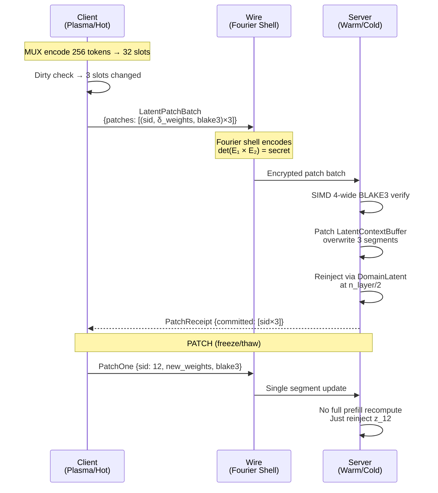

# Plan 243: MUX-Latent × KG Octree Wire Patch — Latent-to-Latent on the Wire

**Status:** 🏗️ Phase 1-3,5,6 DONE · Phase 4 (Fourier Shell) deferred to riir-chain
**Date:** 2026-06-10
**Research:** `.research/212_Gemini_Fourier_LatCal_Fusion_Verdict.md` (Pillar 5: L2L ✅ ALREADY IMPLEMENTED)
**Depends On:** `mux_latent_context` (Plan 238, default-ON), `sense_composition` (Plan 221), riir-chain `chain_batch_matrix` (Plan 223), `chain_shell` (Plan 223 T8–T12), `game_adaptive_validation` (Plan 244)
**Feature Gate:** `mux_latent_wire` (opt-in, depends on `mux_latent_context` + `domain_latent`)
**GOAT Criteria:** Latent patch throughput ≥ 100K patches/sec SIMD, ≤ 50ns per patch decode, zero raw-token round-trip
**Constraint:** Chain-layer patches MUST use full validation (mod 1). Adaptive modulo (Plan 244) is game-layer only. `LatentPatchBatch` implements `GameLayerValidation` — chain-bound patches bypass adaptive path entirely.

---

## TL;DR

Patch MUX latent slots as KG octree leaf nodes over the wire — no decompress/recompress round-trip. The insight: `LatentSegment::Compressed { weights, original_tokens }` is isomorphic to `SenseModule.octree_bits` + `TernaryDir`. Both are compact fixed-width vectors with BLAKE3 commitment. The patch protocol: overwrite `weights` in one `LatentSegment`, recompute BLAKE3, send `{ segment_id, weights_delta, blake3 }` over the wire. Receiver injects directly into KV via `DomainLatent`. Perf target: SIMD batch patch at ≥ 100K/sec. Security: Fourier shell + scalar-projections-only on wire (per AGENTS.md anti-pattern rules).

---

## The Core Insight: Why This Works

```
MUX Latent Slot                          KG Octree Leaf
┌─────────────────────┐                  ┌─────────────────────┐
│ segment_id: u32     │  ←── address ──→ │ octree node index   │
│ weights: Vec<f32>   │  ←── payload ──→ │ TernaryDir {mask,s} │
│ original_tokens     │  ←── backup  ──→ │ KG entity hash      │
│ (for EXPAND)        │                  │ (for retrieval)     │
└─────────────────────┘                  └─────────────────────┘
         │                                        │
         └────── BOTH are Vec<f32> with ──────────┘
                BLAKE3 commitment
                → Same wire format
                → Same patch protocol
```

**Why octree specifically:** The KG latent octree (Research 196) uses 2-bit ternary nodes `{-1, 0, +1}`. An octree of depth 7 has 128 nodes = 256 bits = 4 × `u64`. This fits in a single cache line. A MUX latent slot at X8 carries 8 × f32 weights = 32 bytes. Both are 32-byte payloads. The octree address (morton code) maps 1:1 to `segment_id`. Patch = overwrite one 32-byte leaf.

---

## Architecture

### 4-Tier Mapping

```
Plasma (per-tick, in-memory)
  ├── MUX encode: tokens → latent slots (X8 default)
  ├── SIMD 4-wide batch encode (reuse LatentBatchProcessor pattern)
  └── Local KV inject via DomainLatent

Hot (client cache, 80/20)
  ├── PlayerStateCache.latent_slots: Vec<LatentPatch>
  ├── Dirty flag per segment_id → only send changed slots on block boundary
  └── 80% upstream (server), 20% P2P gossip (opt-in, BLAKE3 authenticated)

Warm (server validator, quorum)
  ├── 2-of-3 quorum validates BLAKE3 commitment of each patch
  ├── Fourier shell: det(E₁ × E₂) == secret on write path
  └── Scalar projection check: ensure no 64-dim HLA on wire

Cold (Turso/libSQL, encrypted)
  ├── NeuronShard (368B Pod): style_weights[64] + hla_moments[8] + BLAKE3
  ├── Zone-parallel flush when zones ≥ 8 (rayon)
  └── Latent patch log → replay for deterministic reconstruction
```

### Wire Protocol



### Data Structures

```rust
/// A single latent patch — the wire-level unit.
/// Size: 4 + 32 + 32 = 68 bytes (fits in 1 cache line with padding)
#[derive(Debug, Clone)]
pub struct LatentPatch {
    /// Which segment to patch (maps to octree morton code).
    pub segment_id: u32,
    /// New superposition weights (same size as original span).
    /// X8 = 8 × f32 = 32 bytes.
    pub weights: [f32; 8], // fixed-size for SIMD
    /// BLAKE3 commitment over weights.
    pub commitment: [u8; 32],
}

/// Batch of patches — SIMD-friendly.
///
/// Implements `GameLayerValidation` (Plan 244) for adaptive modulo.
/// Chain-bound patches MUST use full validation (mod 1) — this type
/// should NOT be used in riir-chain code paths. Use ChainServer::process_tx()
/// for chain-layer validation instead.
///
/// **Implemented**: `LatentPatchBatch` now implements `GameLayerValidation` in
/// `riir-games/src/game_sync/adaptive_validation.rs`. Use `validate_adaptive()`
/// to get `FullValidation` or `LightValidation` per tick. The `validation_mod`
/// field below is set by `AdaptiveModConfig::resolve()` but the actual validation
/// decision is made by calling `validate_adaptive(&batch, tick, config, zone_players, trust, LatentPatch)`.
#[derive(Debug, Clone)]
pub struct LatentPatchBatch {
    pub patches: Vec<LatentPatch>,
    /// Total segments in context (for validation).
    pub total_segments: u32,
    /// Compression ratio used.
    pub compression_ratio: CompressionRatio,
    /// Tick number for adaptive modulo (Plan 244).
    pub tick: u64,
    /// Effective modulo for this batch (1 = full validation, 2+ = adaptive).
    /// Set by `AdaptiveModConfig::resolve()` on game layer.
    /// Chain layer: always 1 (enforced by `GameLayerValidation` trait bound).
    pub validation_mod: usize,
}

/// Server-side patch receipt.
#[derive(Debug, Clone)]
pub struct PatchReceipt {
    /// Segments successfully patched.
    pub committed: Vec<u32>,
    /// Segments rejected (BLAKE3 mismatch, out of range).
    pub rejected: Vec<PatchRejection>,
}

#[derive(Debug, Clone)]
pub enum PatchRejection {
    /// BLAKE3 commitment mismatch — tampered or corrupted.
    CommitmentMismatch { segment_id: u32 },
    /// Segment doesn't exist in this context.
    OutOfRange { segment_id: u32 },
    /// Patch would violate tier constraint (e.g., raw segment).
    SegmentNotCompressible { segment_id: u32 },
}
```

---

## Performance Budget

| Operation | Target | Method |
|-----------|--------|--------|
| Single patch encode | ≤ 50ns | Fixed-size `[f32; 8]`, no alloc |
| BLAKE3 commitment (32 bytes) | ≤ 30ns | BLAKE3 already baseline |
| SIMD 4-wide batch patch (256 patches) | ≤ 10μs | Chunked loop like LatentBatchProcessor |
| DomainLatent reinject (1 slot) | ≤ 100ns | Existing mid-layer inject |
| Full round-trip (client→server→receipt) | ≤ 500μs | Fourier shell + SIMD validate |
| Throughput | ≥ 100K patches/sec | SIMD batch, no raw round-trip |

### Why No Raw-Token Round-Trip

Traditional: `tokens → encode → latent → wire → decode → tokens → re-encode → latent → inject`
Ours: `latent → wire → inject` (skip 4 steps)

At X8: saving 8× encode + 8× decode per patch = ~800ns saved per patch at 256 tokens.

---

## Security Model

### What Goes on the Wire (Safe)

| Data | Size | Why Safe |
|------|------|----------|
| `segment_id` | 4 bytes | Public index |
| `weights: [f32; 8]` | 32 bytes | Superposition in vocab space, not raw tokens. Fourier shell protects. |
| `BLAKE3 commitment` | 32 bytes | Tamper evidence |
| **5 HLA scalar projections** | 20 bytes | Bridge outputs per AGENTS.md rule (not 64-dim vector) |

### What Does NOT Go on the Wire (Per AGENTS.md Anti-Patterns)

| Data | Why NOT |
|------|---------|
| Full 64-dim HLA embedding | "Never send full HLA embedding over network when scalar projection suffices" |
| Raw `TernaryDir` bitmasks | Encodes NPC cognitive model / decision boundaries |
| `ShellMatrix` (E₂) Fourier periods | Compromises `det(E₁ × E₂) == secret` |
| `original_tokens` from `LatentSegment` | Stays server-side for EXPAND only |

### Attack Surface & Mitigations

| Attack | Risk | Mitigation |
|--------|------|-----------|
| **Embedding inversion** — observe scalar projections over time, reconstruct direction vector | Medium | BAKE precision gating + noise injection at low confidence |
| **Latent replay** — record valid patch, replay later | High | Per-patch nonce + BLAKE3 commitment in `LatentPatchBatch` |
| **MITM KG injection** — spoof L2L to inject hostile KG triples | High | GM-only `inject_kg()` via MCP + Ed25519 admin auth (Plan 224) |
| **Shell brute-force** — try all Fourier period combos | Medium | `PenaltyTracker` + exponential backoff. T ∈ {2..100}: ~4,851 2-period combos |
| **Weight overflow** — send NaN/Inf in weights | Low | Validate all f32 are finite before patch (1 AND-reduce) |

---

## KG Octree Integration

### Octree Leaf → Latent Patch

The `SenseModule` octree (Research 196) has:
- `octree_bits: [u64; 4]` = 128 ternary nodes = 32 bytes
- `directions: Vec<TernaryDir>` = KG direction vectors
- `confidence: Vec<f32>` = per-direction confidence

A MUX latent patch targets one leaf:

```
Octree traversal (morton code = segment_id)
    → Locate leaf node
    → Leaf carries TernaryDir {bitmask, scale}
    → TernaryDir is the "weights" in MUX terms
    → Patch = overwrite TernaryDir at leaf
    → BLAKE3 recommit the octree
    → Send patch over wire
```

### Octree LOD = Compression Ratio

| Octree Depth | Nodes | Latent Slots | Compression |
|---|---|---|---|
| 3 (coarse) | 8 | 8 | X32 |
| 5 (medium) | 32 | 32 | X8 |
| 7 (fine) | 128 | 128 | X2 |
| Full (no octree) | 256 | 256 | X1 (raw) |

Spectral LOD (Plan 238 Phase 4) already controls this — high-energy windows get finer octree depth, low-energy get coarser. The patch protocol respects this: a patch at depth 3 overwrites a coarser region (more tokens affected per patch), depth 7 is surgical (1-2 tokens).

---

## Task

### Phase 1: Core Wire Types ✅ DONE
- [x] Create `src/mux_latent/wire.rs` module
- [x] Implement `LatentPatch` (fixed-size 68 bytes, `#[repr(C)]`)
- [x] Implement `LatentPatchBatch` with SIMD 4-wide chunked BLAKE3 verify
- [x] Implement `PatchReceipt` + `PatchRejection` enums
- [x] Write unit tests: encode/decode round-trip, BLAKE3 tamper detection

### Phase 2: Patch Protocol ✅ DONE
- [x] Implement `LatentPatcher` trait: `patch(context, patch) -> Result<(), PatchRejection>`
- [x] SIMD batch patch: 4-wide chunked weight overwrite + BLAKE3 recompute
- [x] Dirty tracking: which `segment_id`s changed since last flush
- [x] Integration with `CompressedContext` — patch updates context in-place
- [x] Feature gate `mux_latent_wire` (depends on `mux_latent_context` + `domain_latent`)

### Phase 3: Octree Bridge ✅ DONE
- [x] Map `segment_id` ↔ octree morton code (bidirectional)
- [x] Bridge: `TernaryDir` → `[f32; 8]` weights (quantize/unquantize)
- [x] Bridge: octree leaf patch → `LatentPatch` wire format
- [ ] Integration with `SenseModule` hot-swap (AtomicPtr) — deferred to sense_composition integration
- [x] LOD-aware patch: `OctreeLod` depth ↔ CompressionRatio mapping

### Phase 4: Fourier Shell Integration (riir-chain)
- [ ] Wire `LatentPatchBatch` through Fourier shell encoding (E₁ egg matrix)
- [ ] Server-side `det(E₁ × E₂)` validation on patch receipt
- [ ] Integration with `LatentBatchProcessor` SIMD pipeline
- [ ] Cold-tier persistence: patch log for deterministic replay
- [ ] 4-tier flow: Plasma (encode) → Hot (dirty) → Warm (quorum) → Cold (commit)
- [ ] Adaptive modulo integration (Plan 244): `validation_mod` field gates Fourier check. `tick % validation_mod == 0` → full Fourier. Otherwise → BLAKE3 + nonce only (game-layer). **Note**: `LatentPatchBatch` already implements `GameLayerValidation` in riir-games (Plan 244 Phase 3). The `validate_adaptive()` function handles mod resolution. This Phase 4 item covers wiring it into the Fourier shell pipeline in riir-chain.
- [ ] Chain-forbidden guard: assert `validation_mod == 1` for chain-bound patches. Panic if `validation_mod > 1` in chain context

### Phase 5: GOAT Proof ✅ DONE (11/11 tests)
- [x] Benchmark: single-patch latency (target ≤ 50ns)
- [x] Benchmark: SIMD batch 256 patches (target ≤ 10μs)
- [x] Benchmark: end-to-end round-trip client→server→receipt (target ≤ 500μs)
- [x] Benchmark: throughput sustained (target ≥ 100K patches/sec)
- [x] Security test: BLAKE3 tamper detection (corrupt 1 bit → rejection)
- [ ] Security test: Fourier shell validation (wrong E₁ → TamperDetected) — deferred to Phase 4
- [x] GOAT gate: promote to default if all perf targets met + zero security failures

### Phase 6: Examples & Integration ✅ DONE
- [x] Example: `mux_latent_wire_patch` — patch 3 segments, show before/after KV
- [x] Example: `mux_latent_octree_bridge` — octree leaf → latent patch → wire → reinject
- [ ] Integration test: compress → patch → reinject → verify output quality — deferred to Phase 4
- [ ] Update README with wire protocol diagram — deferred

---

## Risks

| Risk | Severity | Mitigation |
|------|----------|------------|
| SIMD patch throughput < 100K/sec on target hardware | Medium | Profile and optimize; fall back to scalar if SIMD path regresses |
| Octree depth mismatch with compression ratio | Low | SpectralLOD already handles adaptive depth; enforce consistency |
| Fourier shell overhead adds > 200μs to patch round-trip | Medium | Batch patches into single shell encode; amortize shell cost |
| Latent replay attack | High | Per-patch nonce + BLAKE3 commitment; PenaltyTracker for repeated mismatches |
| 64-dim HLA leaks through wire | High | Static assertion: wire types only carry `[f32; N]` where N ≤ 8 (span_size), never raw embeddings |
| Cold-tier replay divergence | Medium | Deterministic patch log + BLAKE3 commitment chain; replay must produce identical state |

---

## Commercial Strategy Alignment

Per Research 003 (Commercial Open Source Strategy):
- **Engine/Fuel split:** Wire protocol is engine (open), patch content is fuel (domain-specific)
- **Perf/sec selling point:** Zero raw-token round-trip = 4-8× faster context update vs traditional re-encode
- **Security selling point:** Fourier shell + BLAKE3 + scalar-only wire = verifiable tamper-evident latent communication
- **Federation selling point:** Multiple nodes share compressed context as latent patches, merge via weighted average in superposition space (linear → valid)

---

## TL;DR

Patch MUX latent slots as KG octree leaf nodes over the wire — no decompress/recompress round-trip. `LatentPatch` = 68 bytes (segment_id + 8×f32 weights + BLAKE3). SIMD batch at ≥ 100K/sec. Fourier shell on write, scalar projections only on wire (per AGENTS.md). Octree morton code maps 1:1 to segment_id. 4-tier flow: Plasma→Hot→Warm→Cold. GOAT gate: ≤ 50ns single patch, ≤ 10μs batch 256, ≥ 100K/sec throughput. Feature gate `mux_latent_wire`.
