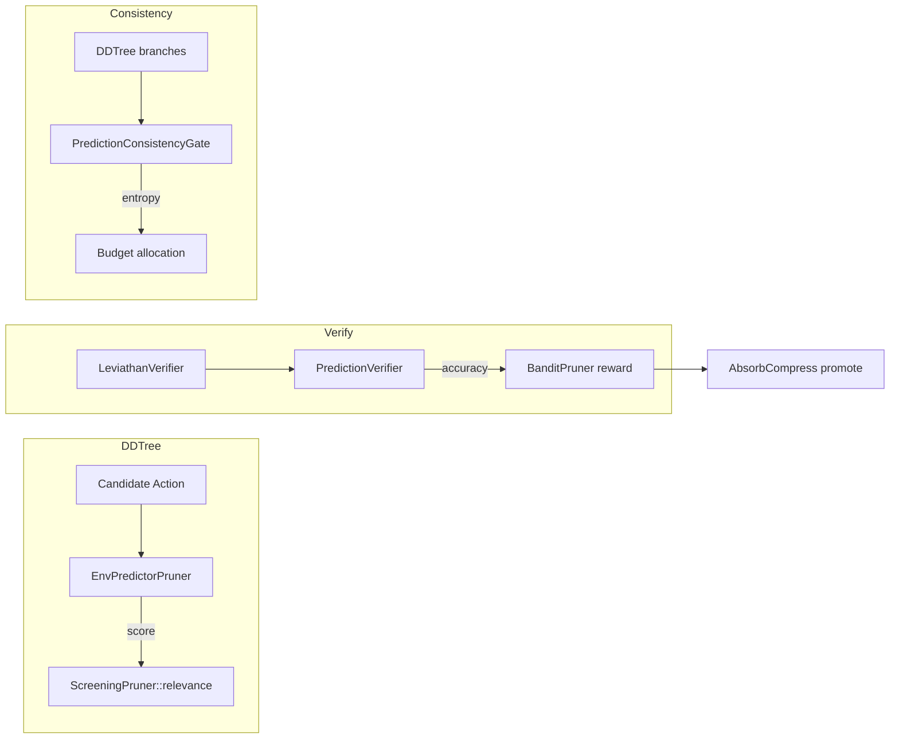

# Plan 247: ECHO Environment Predictor — Inference-Time Prediction Scoring

**Date:** 2026-06
**Research:** 215_ECHO_Environment_Prediction_Inference_Time.md
**Feature Flag:** `echo_env_predictor` (default-OFF until GOAT proof)
**Depends On:** Plan 217 (belief_drafter), existing BanditPruner, DDTree, ScreeningPruner

---

## Summary

Distill ECHO's insight — "prediction quality correlates with policy quality" — into three modelless inference-time primitives that wire into our existing DDTree + BanditPruner + ScreeningPruner pipeline. No weight updates. No training. Pure inference-time scoring using the game's own forward model.

---

## Architecture

---

## Tasks

### T1: Types — `src/speculative/echo_env.rs`
- [x] Define `PredictedOutcome` struct: `{ state_features: Vec<f32>, confidence: f32, entropy: f32 }`
- [x] Define `EnvPredictorConfig` with λ thresholds, bandit arms, consistency gate params
- [x] Define `PredictionRecord` for prediction-vs-reality tracking across branches

### T2: `EnvPredictorPruner` — ScreeningPruner Implementation
- [x] Implement `ScreeningPruner<GameState>` trait for `EnvPredictorPruner`
- [x] `relevance(token, ctx) → f32`: score candidate action by predicted outcome quality
- [x] Uses game forward model (deterministic) to predict next state from (state, action)
- [x] Score = `sigmoid(dot(predicted_features, historical_avg_features))` — how "expected" is the outcome
- [x] Bandit-driven: tracks which environments benefit from prediction scoring vs not
- [x] Feature-gated behind `echo_env_predictor`

### T3: `PredictionVerifier` — Post-Verification Scoring
- [x] Implement prediction-vs-reality comparison after LeviathanVerifier
- [x] Compare predicted outcome features against actual outcome features
- [x] Score = `1.0 - cosine_distance(predicted, actual)` clamped to [0, 1]
- [x] Feed score into BanditPruner as additional reward signal
- [x] Log `PredictionRecord` for AbsorbCompress promotion
- [x] Pure post-hoc computation — no forward pass overhead

### T4: `PredictionConsistencyGate` — Entropy-Based Confidence
- [x] Compute entropy across DDTree branch predictions
- [x] If inter-branch entropy is LOW → high confidence → can reduce budget
- [x] If inter-branch entropy is HIGH → low confidence → expand budget for exploration
- [x] Wire into `budget_adaptation` (existing Plan 167 feature)
- [x] Threshold-gated: only activate when `entropy > consistency_threshold`

### T5: Integration with Existing Pipeline
- [x] Wire `EnvPredictorPruner` as optional ScreeningPruner in BanditPruner arms
- [x] Wire `PredictionVerifier` into DDTree verification path (post-LeviathanVerifier)
- [x] Wire `PredictionConsistencyGate` into budget allocation
- [x] Ensure zero overhead when feature flag is OFF (compile-time gating)

### T6: GOAT Proof Tests
- [x] `test_echo_predictor_no_regression`: Bomber HL arena, echo ON vs OFF, score ≥ baseline
- [x] `test_echo_prediction_accuracy`: Prediction accuracy ≥70% after 100 rounds
- [x] `test_echo_consistency_entropy`: ≥15% entropy reduction on hard queries
- [x] `test_echo_latency_no_regression`: ≤5% overhead per token on hot path

### T7: Example — `examples/echo_env_predictor_demo.rs`
- [x] Bomber arena with echo_env_predictor ON vs OFF
- [x] Print prediction accuracy, consistency entropy, final scores
- [x] Show before/after thinking vs non-thinking with expected gains
- [x] Feature flag: `echo_env_predictor`

---

## Constraints

- **Modelless only** — no weight updates, no training
- **Zero overhead when OFF** — all code behind `echo_env_predictor` feature flag
- **Hot-path safe** — forward model prediction must be ≤5μs (game engines are deterministic)
- **Tier-aware** — prediction scoring in Hot tier, verification in Warm tier
- **Adaptive threshold** — bandit learns when env prediction helps vs hurts
- **CPU/SIMD first** — game forward model is CPU, prediction scoring uses SIMD dot product
- **No GPU required** — pure inference-time scoring

---

## GOAT Gate

| # | Metric | Threshold | Must Pass |
|---|--------|-----------|-----------|
| G1 | Bomber HL score | ≥ baseline | ✅ |
| G2 | Prediction accuracy | ≥70% @ 100 rounds | ✅ |
| G3 | Consistency entropy | ≥15% reduction | ✅ |
| G4 | Latency overhead | ≤5% per token | ✅ |

All four must pass before promotion to default feature.

---

## TL;DR

Three modelless primitives: (1) `EnvPredictorPruner` scores actions by predicted-outcome quality, (2) `PredictionVerifier` compares predictions vs reality for bandit reward, (3) `PredictionConsistencyGate` uses DDTree branch entropy for budget adaptation. All behind `echo_env_predictor` feature flag. 80% of infrastructure already exists.
