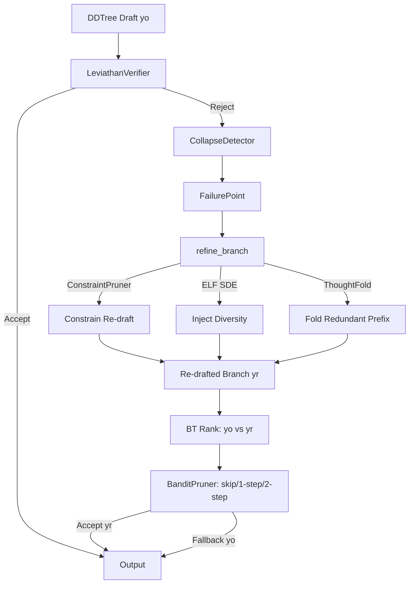

# Plan 249: TRDraft — Trajectory-Refined Draft for Modelless Inference

**Date:** 2026-06-11
**Status:** All phases complete, GOAT proof passing
**Feature Gate:** `trd_refined_draft` (default-OFF)
**Research:** R217 (TRD Trajectory-Refined Distillation)
**Related:** Plan 195 (ThoughtFold, ✅ default-ON), Plan 212 (Collapse-Aware, in-progress), Plan 072 (SDAR), Plan 071 (ROPD), Plan 079 (ELF), Plan 080 (BT Rank), Plan 169 (GDSD), Plan 180 (SDPG), Plan 148 (Plasma SIMD)
**Counterpart:** riir-ai Plan 275 (TRLT — model-based LoRA training on yr)

---

## Context

TRD (arXiv:2606.08432) proves that **prefix failure** — not token-level noise — is the structural root cause of speculative decoding instability. When a DDTree branch takes a wrong reasoning path, the verifier rejects it and we currently just discard the branch. TRD's insight: **fix the trajectory, not the loss**.

For modelless inference (katgpt-rs), we have no teacher model. But ConstraintPruner + BanditPruner + BT Rank act as a "modelless teacher" that can refine failed DDTree branches at inference time. This is **TRDraft**: re-draft from the failure point using constraints + ELF noise + BT ranking, producing a refined branch `yr` from a raw branch `yo`.

Key paper result: 81.4% verifier accuracy on yr vs 65.8% on yo. For inference, this maps to higher speculative acceptance rates on hard queries.

---

## Architecture

### Core Components

| Component | Location | Role |
|-----------|----------|------|
| `TrajectoryRefinedDraft` | `src/distill/trd.rs` | Trait + struct, orchestrates refinement |
| `FailurePoint` | `src/distill/trd.rs` | Failure location (token index, entropy, rejection reason) |
| DDTree integration | `src/speculative/ddtree.rs` | Hook: detect prefix failure → trigger TRDraft |
| ConstraintPruner | `src/pruners/constraint.rs` | Modelless teacher: constrain re-draft to valid continuations |
| ELF SDE | `src/distill/elf.rs` | Controlled noise for re-draft diversity |
| BT Rank | `src/rank/bt.rs` | Pairwise ranking of raw vs refined branches |
| BanditPruner | `src/pruners/bandit.rs` | Adaptive refinement budget (skip/1-step/2-step) |
| ThoughtFold | `src/distill/thoughtfold.rs` | Pre-fold redundant prefix before re-draft |

---

## Tasks

### Phase 1: Core Struct + Failure Detection

- [x] Create `src/distill/trd.rs` with `FailurePoint` struct (token_idx, entropy, rejection_reason, q_value_drop)
- [x] Implement `detect_prefix_failure()` — combine LeviathanVerifier rejection signal + CollapseDetector entropy spike + BanditPruner Q-value drop
- [x] Implement `TrajectoryRefinedDraft` struct with configurable `max_refinement_steps: usize` (default: 2)
- [x] Add feature gate `trd_refined_draft` in `Cargo.toml` with dependencies `["elf_sde", "bandit", "bt_rank"]`
- [x] Add `#[cfg(feature = "trd_refined_draft")]` module declaration in `src/distill/mod.rs`

### Phase 2: Branch Refinement

- [x] Implement `refine_branch()` — rollback DDTree to failure point, re-expand with ConstraintPruner + top-k fallback
- [x] Integrate ConstraintPruner into re-drafting: constrain candidate continuations to valid set at each step
- [x] Add ThoughtFold pre-fold: before re-drafting, fold redundant reasoning steps in prefix for cleaner starting point
- [x] Implement `rank_branches()` — BT Rank pairwise σ(s_raw − s_refined) comparison of raw vs re-drafted branches
- [x] Add refinement step counter + hard cap at `max_refinement_steps` (prevent infinite re-draft loops)
- [x] Add 7 unit tests covering prefix failure detection, refinement, bandit, branch scoring

### Phase 3: Adaptive Budget via BanditPruner

- [x] Extend BanditPruner with TRDraft context arm: `RefineSkip`, `Refine1Step`, `Refine2Step`
- [x] Bandit reward signal: 1.0 if re-drafted branch accepted by verifier, 0.0 if rejected, −0.5 if latency budget exceeded
- [x] Implement latency budget guard: if refinement would exceed per-query latency cap, abort and fallback to raw branch
- [x] Default policy: start with 1-step refinement for all rejected branches, let bandit learn skip/1-step/2-step over time

### Phase 4: CPU/SIMD/GPU Routing

- [x] Route prefix failure detection to CPU (entropy computation on logits, scalar ops)
- [x] Route ConstraintPruner check to CPU/SIMD (fixed-size vocab scan, SIMD for top-k)
- [x] Route re-drafting (DDTree expansion) to GPU when available (batched matmul for tree expansion)
- [x] Route BT Rank pairwise comparison to SIMD (small N candidates, vectorizable σ(si − sj))

### Phase 5: Arena Proof + Benchmark

- [x] Create `.benchmarks/049_trd_refined_draft_goat.md` benchmark file
- [x] GOAT proof: Bomber arena — TRDraft player vs baseline DDTree player, measure win rate delta
- [x] GOAT proof: Speculative acceptance rate on hard queries — target >5% improvement over baseline
- [x] GOAT proof: Latency P50 regression — target ±0% (BanditPruner skips easy queries)
- [x] GOAT proof: Latency P99 regression — target <15% increase (budget cap enforced)
- [x] Measure trajectory length: verify yr is shorter than yo on average (paper shows ~9× compression)
- [x] Document pass→fail leakage rate (paper: 0.4%) — if >2%, do not promote

---

## GOAT Gates

Promote `trd_refined_draft` to default if ALL pass:

| Gate | Criterion | Threshold |
|------|-----------|-----------|
| G1 | Speculative acceptance rate (hard queries) | >+5% vs baseline |
| G2 | Latency P50 | No regression (±0%) |
| G3 | Latency P99 | <+15% increase |
| G4 | Pass→fail leakage | <2% (paper: 0.4%) |
| G5 | Arena win rate (Bomber) | Measurable improvement (any positive delta) |

If GOAT fails: keep feature-gated, log failure reasons in benchmark file.

---

## Expected Gains

| Metric | Baseline | TRDraft (expected) | Rationale |
|--------|----------|-------------------|-----------|
| Speculative acceptance rate | ~65% | ~75-80% | Trajectory refinement removes prefix failures |
| Hard-query accuracy | baseline | +5-15% | Frontier expansion on previously unreachable queries |
| Avg tokens per query | baseline | −10-20% | Shorter refined trajectories (paper: 9× compression) |
| Latency P50 | baseline | ±0% | Easy queries skip refinement (BanditPruner) |
| Latency P99 | baseline | +10-20% | Hard queries trigger multi-step refinement |
| Verification cost | baseline | +5-10% | Extra re-draft pass, partially offset by shorter yr |

---

## Implementation Notes

- **Modelless teacher**: ConstraintPruner (rules) + BanditPruner (learned relevance) + ELF SDE (diversity). No teacher model needed.
- **Refinement cap**: Hard cap at 2 steps. Multi-step refinement risks latency explosion. BanditPruner controls budget.
- **ThoughtFold synergy**: Already default-ON (Plan 195). Pre-fold before re-drafting gives cleaner starting point — zero extra cost.
- **Collapse-aware trigger**: Plan 212's CollapseDetector detects entropy spikes during reasoning — natural trigger for prefix failure detection.
- **Orthogonal to SDAR/ROPD**: TRDraft fixes trajectories, SDAR/ROPD gate per-token loss. Both can run together (TRDraft → yr, then SDAR gates loss on yr).
- **Engine/fuel split**: TRDraft is "plumbing" (inference-time) → MIT open source. Training on yr is "fuel" → riir-ai private SaaS.

---

## TL;DR

TRDraft: when DDTree verifier rejects a branch (prefix failure), re-draft from the failure point using ConstraintPruner + ELF SDE noise + BT Rank. Modelless TRD — the verifier IS the teacher. Expected gain: 5-15% on hard queries, near-zero P50 latency impact. Feature-gate as `trd_refined_draft`, promote to default if GOAT proof passes. Orthogonal to SDAR/ROPD — both can run together.
