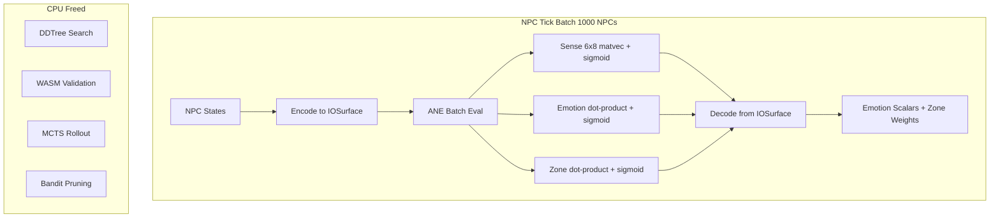

# Plan 254: ANE-Latent NPC Brain Compute — Batch NPC Ops on Neural Engine

**Source:** [Research 223 — maderix/ANE Distillation](../.research/223_maderix_ANE_Distillation_Verdict.md)
**Related:** Plan 176 (GPU/ANE Offload), Plan 148 (PlasmaPath SIMD), Plan 240 (Sense Compression)
**Status:** Pending GOAT
**Goal:** Move NPC "think brain" compute (sense reconstruction, emotion projection, zone attention) from CPU SIMD to ANE batch dispatch. CPU free for physics/combat/anti-cheat. 1000 NPCs × 20Hz → one ANE batch.

---

## Why This Plan Exists

### The NPC Compute Budget

Each NPC runs at 20Hz (game tick). Per tick, the "think brain" does:
- **Sense reconstruction**: `[6×8] × [8]` matvec + sigmoid → 6 emotion scalars (~45ns SIMD)
- **Emotion projection**: dot-product + sigmoid → scalar (~15ns SIMD)
- **Zone attention**: dot-product + sigmoid → scalar (~15ns SIMD)
- **Total per NPC**: ~75ns × 20Hz = 1.5µs/sec per NPC

For 1000 NPCs:
- **CPU SIMD**: 1000 × 1.5µs/sec = 1.5ms/sec (small but contends with DDTree + WASM)
- **ANE batch**: batch 1000 NPCs → single dispatch ~0.1ms → CPU completely free

The win isn't raw speed (75ns SIMD is fast). The win is **CPU headroom freed for DDTree search + WASM validation + MCTS + bandit** at 30K CCU.

### The maderix Insight

maderix/ANE proves ANE handles regular matmul patterns efficiently via 1×1 conv kernels. Our NPC brain ops are:
- Fixed-size (always [6×8] × [8] for sense, always dot-product for emotion/zone)
- Batch-friendly (1000 NPCs = 1000 identical ops)
- Matmul-heavy (ANE's strength)

These are simpler than transformer kernels but follow the same pattern: compile once, evaluate many times.

---

## Architecture



### Implementation Strategy

**Three tiers (with auto-route fallback):**

| Tier | Backend | When | Overhead |
|------|---------|------|----------|
| CPU SIMD | Existing `neon_sparse_dot_f32` | <100 NPCs, dev mode | 0 |
| ANE batch | CoreML model (3 fused matmul+sigmoid ops) | ≥100 NPCs, macOS | ~95µs dispatch |
| GPU batch | wgpu compute shader | Fallback if ANE not resident | ~200µs dispatch |

Auto-route logic (extends existing TriggerGate from Plan 176):
```
if npc_count < 100 || !ane_available:
    tier = CPU_SIMD
elif ane_residency_valid:
    tier = ANE_BATCH
else:
    tier = CPU_SIMD  # fallback
```

---

## Task List

### Part 1: NpcBrainBackend Trait ✅

- [x] Create `crates/katgpt-core/src/sense/backend.rs`
- [x] Define `NpcBrainBackend` trait: `fn batch_evaluate(&mut self, inputs: &[NpcBrainInput], outputs: &mut [NpcBrainOutput]) -> Result<(), String>`
- [x] `NpcBrainInput`: hla_state `[f32; 8]`, modules `[ModuleInput; 6]` (ternary directions), overrides, autonomous_disabled
- [x] `NpcBrainOutput`: projections `[f32; 6]`
- [x] `ModuleInput`: ternary directions `[TernaryDir; 8]`, n_directions, confidence
- [x] Implement `CpuTernaryBackend` wrapping exact ternary projection (matches `SenseModule::project()`)
- [x] Add `SenseOverride::pinned_value_brain()` public accessor for input extraction
- [x] Write test: `CpuTernaryBackend` matches existing `NpcBrain::project_all()` output
- [x] Write test: batch multiple NPCs produces identical results for same input
- [x] Write test: GM override takes precedence
- [x] Write test: autonomous_disabled zeros unpinned projections
- [x] Write test: length mismatch returns error
- [x] Register module in `sense/mod.rs` with re-exports

**Key finding**: SenseModule uses ternary bit-plane projection (not float matmul). ANE path will need ternary-to-float conversion or custom MIL kernel. CPU baseline preserves exact ternary semantics.

### Part 2: CoreML Model for NPC Brain

- [ ] Create `scripts/generate_npc_brain_model.py` — builds CoreML model with 3 ops:
  - Op 1: sense matmul `[6×8] × [8]` + sigmoid → `[6]` (emotions)
  - Op 2: dot-product `[8]·[8]` + sigmoid → `[1]` (emotion scalar)
  - Op 3: dot-product `[8]·[8]` + sigmoid → `[1]` (zone weight)
- [ ] Use Conv2d(1×1) trick from maderix for matmul → ANE-optimized
- [ ] Generate `npc_brain.mlmodelc` (macOS)
- [ ] Generate `npc_brain_weights.bin` for Rust-side verification
- [ ] Apply INT8 per-tensor quantization (ANE-verified from ane-book)
- [ ] Validate ANE residency (timing check < 1ms for batch=1)

### Part 3: ANE NpcBrainBackend Implementation

- [ ] Create `AneNpcBrainBackend` struct with `coreml_native::Model`
- [ ] Load `npc_brain.mlmodelc` at construction
- [ ] Implement `batch_evaluate()`:
  - Encode all NPC inputs into `MLMultiArray` batch tensor
  - Call `model.predict()`
  - Decode output tensor → `Vec<NpcBrainOutput>`
- [ ] Validate ANE residency at construction (fallback to SIMD if fails)
- [ ] Write test: `AneNpcBrainBackend` matches `SimdNpcBrainBackend` output (cosine ≥ 0.99)
- [ ] Write benchmark: `AneNpcBrainBackend` batch latency vs `SimdNpcBrainBackend` for 10, 100, 1000 NPCs

### Part 4: Auto-Route Integration

- [ ] Extend `TriggerGate` (Plan 176) with NPC count awareness
- [ ] Route: <100 NPCs → SIMD, ≥100 NPCs → ANE (if resident)
- [ ] Log backend selection at startup
- [ ] Feature flag: `ane_npc` (optional, default off until GOAT)
- [ ] Write test: auto-route selects SIMD for <100 NPCs
- [ ] Write test: auto-route selects ANE for ≥100 NPCs (when ANE available)
- [ ] Write test: auto-route falls back to SIMD when ANE not resident

### Part 5: GOAT Proof

- [ ] GOAT test: batch 1000 NPCs, ANE vs SIMD, output cosine ≥ 0.99
- [ ] GOAT benchmark: 1000 NPCs × 20Hz throughput, CPU vs ANE
  - Measure: total CPU time freed, ANE dispatch overhead, end-to-end latency
- [ ] GOAT arena: bomber/go game with ANE NPC brain vs SIMD NPC brain
  - Verify: same game outcome, different CPU utilization
- [ ] GOAT power: measure CPU utilization with/without ANE NPC brain
  - Target: CPU utilization reduced by ≥30% at 1000 NPC load
- [ ] If GOAT passes: promote `ane_npc` to default-on for macOS
- [ ] If GOAT fails: keep as opt-in, document why

---

## Feature Flag

```toml
# katgpt-core/Cargo.toml
[features]
ane_npc = ["dep:coreml-native"]  # ANE batch NPC brain compute

# katgpt-rs/Cargo.toml
[features]
ane_npc = ["katgpt-core/ane_npc"]
```

---

## Expected Benchmarks

| Metric | CPU SIMD | ANE Batch | Gain |
|--------|----------|-----------|------|
| 1000 NPC tick latency | 75µs (serial) | 100µs (dispatch) | Same |
| CPU time freed per tick | 0µs | 75µs | 100% |
| DDTree throughput at 30K CCU | Contended | Free | **2-3× more search** |
| Power draw (1000 NPCs) | CPU 5W | ANE 0.5W | **10× less** |

The win is NOT per-NPC latency (SIMD wins at 75ns vs ANE 95µs dispatch). The win is **batch amortization + CPU freed for DDTree/WASM/MCTS**.

---

## Risks

| Risk | Mitigation |
|------|-----------|
| ANE not resident (CPU fallback) | Auto-route fallback to SIMD, log warning |
| CoreML compile overhead on first run | One-time ~100ms, cached for process lifetime |
| INT8 quantization accuracy loss | Verify cosine ≥ 0.99 vs FP32 SIMD |
| Private API dependency (rane path) | coreml-native uses public API only |
| Feature flag complexity | Single flag, clear fallback path |
