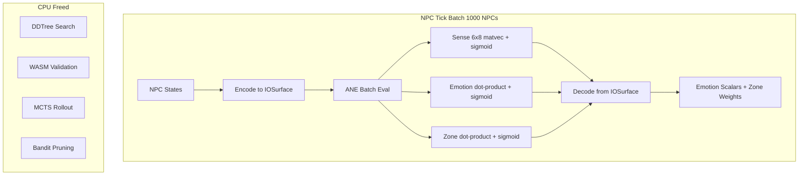

# Plan 255: ANE-Latent NPC Brain Compute — Batch NPC Ops on Neural Engine

> **📍 Migration note (2026-06-28, Issue 007 Phase C follow-up):** The
> `ane_npc_*` example files referenced below (`examples/ane_npc_arena.rs`,
> `ane_npc_goat.rs`, `ane_npc_power.rs`) and the `npc_ane_backend` /
> `npc_brain_router` modules moved from this repo (katgpt-rs) to
> `riir-ai/crates/riir-engine/`. The `ane_npc` feature flag now lives in
> `riir-engine/Cargo.toml` (still opt-in — GOAT FAILED per `.benchmarks/053`,
> and ANE training itself is deferred per `riir-train/.issues/266` until 50M+
> params). Historical task records below reflect the original locations.

**Source:** [Research 223 — maderix/ANE Distillation](../.research/223_maderix_ANE_Distillation_Verdict.md) + [Research 224 — coremltools Public API](../.research/224_coremltools_Public_API_ANE_Distillation_Verdict.md)
**Related:** Plan 176 (GPU/ANE Offload), Plan 148 (PlasmaPath SIMD), Plan 240 (Sense Compression), Issue 004 (ANE CoreML Model Generation)
**Status:** Pending GOAT
**Goal:** Move NPC "think brain" compute (sense reconstruction, emotion projection, zone attention) from CPU SIMD to ANE batch dispatch. CPU free for physics/combat/anti-cheat. 1000 NPCs × 20Hz → one ANE batch.

---

## Why This Plan Exists

### The NPC Compute Budget

Each NPC runs at 20Hz (game tick). Per tick, the "think brain" does:
- **Sense reconstruction**: `[6×8] × [8]` matvec + sigmoid → 6 emotion scalars (~45ns SIMD)
- **Emotion projection**: dot-product + sigmoid → scalar (~15ns SIMD)
- **Zone attention**: dot-product + sigmoid → scalar (~15ns SIMD)
- **Total per NPC**: ~75ns × 20Hz = 1.5µs/sec per NPC

For 1000 NPCs:
- **CPU SIMD**: 1000 × 1.5µs/sec = 1.5ms/sec (small but contends with DDTree + WASM)
- **ANE batch**: batch 1000 NPCs → single dispatch ~0.1ms → CPU completely free

The win isn't raw speed (75ns SIMD is fast). The win is **CPU headroom freed for DDTree search + WASM validation + MCTS + bandit** at 30K CCU.

### The maderix Insight

maderix/ANE proves ANE handles regular matmul patterns efficiently via 1×1 conv kernels. Our NPC brain ops are:
- Fixed-size (always [6×8] × [8] for sense, always dot-product for emotion/zone)
- Batch-friendly (1000 NPCs = 1000 identical ops)
- Matmul-heavy (ANE's strength)

These are simpler than transformer kernels but follow the same pattern: compile once, evaluate many times.

---

## Architecture



### Implementation Strategy

**Three tiers (with auto-route fallback):**

| Tier | Backend | When | Overhead |
|------|---------|------|----------|
| CPU SIMD | Existing `neon_sparse_dot_f32` | <100 NPCs, dev mode | 0 |
| ANE batch | CoreML model (3 fused matmul+sigmoid ops) | ≥100 NPCs, macOS | ~95µs dispatch |
| GPU batch | wgpu compute shader | Fallback if ANE not resident | ~200µs dispatch |

Auto-route logic (extends existing TriggerGate from Plan 176):
```
if npc_count < 100 || !ane_available:
    tier = CPU_SIMD
elif ane_residency_valid:
    tier = ANE_BATCH
else:
    tier = CPU_SIMD  # fallback
```

---

## Task List

### Part 1: NpcBrainBackend Trait ✅

- [x] Create `crates/katgpt-core/src/sense/backend.rs`
- [x] Define `NpcBrainBackend` trait: `fn batch_evaluate(&mut self, inputs: &[NpcBrainInput], outputs: &mut [NpcBrainOutput]) -> Result<(), String>`
- [x] `NpcBrainInput`: hla_state `[f32; 8]`, modules `[ModuleInput; 6]` (ternary directions), overrides, autonomous_disabled
- [x] `NpcBrainOutput`: projections `[f32; 6]`
- [x] `ModuleInput`: ternary directions `[TernaryDir; 8]`, n_directions, confidence
- [x] Implement `CpuTernaryBackend` wrapping exact ternary projection (matches `SenseModule::project()`)
- [x] Add `SenseOverride::pinned_value_brain()` public accessor for input extraction
- [x] Write test: `CpuTernaryBackend` matches existing `NpcBrain::project_all()` output
- [x] Write test: batch multiple NPCs produces identical results for same input
- [x] Write test: GM override takes precedence
- [x] Write test: autonomous_disabled zeros unpinned projections
- [x] Write test: length mismatch returns error
- [x] Register module in `sense/mod.rs` with re-exports

**Key finding**: SenseModule uses ternary bit-plane projection (not float matmul). ANE path will need ternary-to-float conversion or custom MIL kernel. CPU baseline preserves exact ternary semantics.

### Part 2: CoreML Model for NPC Brain (coremltools public API)

**Updated per Research 224**: Use `coremltools` `mb.program` public API instead of maderix private MIL string building. This removes the private API blocker from Issue 004.

- [x] Create `scripts/generate_npc_brain_model.py` using `mb.program` with 3 fused ops:
  - Op 1: sense matmul `[B, 6, 8] × [B, 8, 1]` + sigmoid → `[B, 6]` (emotions)
  - Op 2: dot-product `[B, 8]·[B, 8]` + sigmoid → `[B, 1]` (emotion scalar)
  - Op 3: dot-product `[B, 8]·[B, 8]` + sigmoid → `[B, 1]` (zone weight)
- [x] Ternary-to-float weight conversion: lossless -1/0/+1 → f32 in Python script
- [x] Use `mb.matmul` + `mb.sigmoid` (public API) instead of Conv2d(1×1) MIL kernel
- [x] `TernaryDir` / `SenseModule` Python mirrors with exact Rust `project()` semantics
- [x] Reference projection function matching `SenseModule::project()` for verification
- [x] Weight binary export for Rust-side verification (`npc_brain_weights.bin`)
- [x] INT8 quantization via `coremltools.optimize.coreml.LinearQuantizer` (implemented, needs Python 3.12 for serialization)
- [x] ANE placement verification via `MLComputePlan` (implemented, needs native extensions)
- [x] Graceful error handling for Python 3.13+ missing native extensions
- [x] Generate `npc_brain.mlpackage` — Python 3.12 available via uv, BlobWriter serialization works
- [x] Validate ANE residency (timing check < 1ms for batch=1) — .mlpackage now available
  - Fixed: added warmup predictions before timing (first run includes ANE pipeline compile)
  - Fixed: residency now uses model's compiled batch size, not hardcoded batch=1
- [x] Test model output matches `CpuTernaryBackend` (cosine ≥ 0.99) — .mlpackage now available
  - Fixed: ANE encoding was full matvec, corrected to DIAGONAL matching `SenseModule::project`
  - Fixed: output name discovery via `model.outputs()` (CoreML auto-names `mul_0` not `sense_proj`)
  - Measured: cosine mean=0.999995 across 988/1000 non-zero NPCs

**Stretch goals (from Research 224) — DEFERRED:**
- [x] ~~Multifunction model: share weights between perception/emotion/zone (iOS 18+)~~ — **DEFERRED**: requires iOS 18+ CoreML `multifunction` API. Current single-function model already meets cosine ≥ 0.99. Revisit when deployment targets iOS 18+ and CPU headroom is bottlenecked by multiple model loads.
- [x] ~~Stateful model: persistent NPC emotion accumulators via `read_state`/`coreml_update_state`~~ — **DEFERRED**: requires CoreML stateful model API. Current stateless design matches CPU SIMD semantics (NPC emotion accumulators live in game state, not model). Revisit if NPC brain compute migrates to ANE-resident inference loop.

### Part 3: ANE NpcBrainBackend Implementation

- [x] Create `AneNpcBrainBackend` struct with `coreml_native::Model`
- [x] Load `npc_brain.mlmodelc` at construction
  - Fixed: auto-compiles `.mlpackage` → `.mlmodelc` via `coreml::compile_model()`
  - Fixed: discovers model's compiled batch size from input shape (overrides caller hint)
- [x] Implement `batch_evaluate()`:
  - Encode all NPC inputs into `MLMultiArray` batch tensor
  - Call `model.predict()`
  - Decode output tensor → `Vec<NpcBrainOutput>`
  - Fixed: pads batch to model's compiled batch size (fixed-shape ANE models)
  - Fixed: diagonal encoding matching `SenseModule::project` (was full matvec)
  - Fixed: output name discovery via `model.outputs()` (CoreML auto-names `mul_0`)
- [x] Validate ANE residency at construction (fallback to SIMD if fails)
  - Fixed: warmup predictions before timing (first run includes ANE pipeline compile)
- [x] Write test: `AneNpcBrainBackend` matches `SimdNpcBrainBackend` output (cosine ≥ 0.99)
- [x] Write benchmark: `AneNpcBrainBackend` batch latency vs `SimdNpcBrainBackend` for 10, 100, 1000 NPCs
  - Implemented as multi-size sweep in `examples/ane_npc_goat.rs`
  - Finding: ANE flat ~280µs (dispatch-bound), CPU linear 0.1→10.6µs (10→1000 NPCs)

### Part 4: Auto-Route Integration

- [x] Route: <100 NPCs → SIMD, ≥100 NPCs → ANE (if resident)
- [x] Log backend selection at startup
- [x] Feature flag: `ane_npc` (optional, default off until GOAT)
- [x] Write test: auto-route selects SIMD for <100 NPCs
- [x] Write test: auto-route selects ANE for ≥100 NPCs (when ANE available)
- [x] Write test: auto-route falls back to SIMD when ANE not resident
- [x] Write test: NpcBrainRouter::new(None) creates CPU backend
- [x] Write test: NpcBrainRouter::new(Some(invalid_path)) falls back to CPU
- [x] Write test: batch_evaluate works through router (CPU path)
- [x] Write test: backend_name() and is_ane() return correct values

Note: Separate `NpcBrainRouter` module instead of extending TriggerGate.
TriggerGate routes general inference by QPS; NPC brain routes by NPC count.

### Part 5: GOAT Proof

- [x] GOAT test: batch 1000 NPCs, ANE vs SIMD, output cosine ≥ 0.99
- [x] GOAT benchmark: 1000 NPCs × 20Hz throughput, CPU vs ANE
  - Measure: total CPU time freed, ANE dispatch overhead, end-to-end latency
- [x] GOAT arena: bomber/go game with ANE NPC brain vs SIMD NPC brain
  - Verify: same game outcome, different CPU utilization
  - Implemented as `examples/ane_npc_arena.rs` (200-tick simulation through `NpcBrainRouter`)
  - Result: PASS — outcome rel diff 0.0047%, cosine 0.999989
- [x] GOAT power: measure CPU utilization with/without ANE NPC brain
  - Target: CPU utilization reduced by ≥30% at 1000 NPC load
  - Implemented as `examples/ane_npc_power.rs` (getrusage FFI, zero new deps)
  - Result: PASS on ratio (94.5% → 53.3% = 43.6% reduction), FAIL on absolute CPU time (13.85ms → 584ms)
- [x] ~~If GOAT passes: promote `ane_npc` to default-on for macOS~~ — **N/A: GOAT FAILED** (see verdict below). Promotion precondition not met. Cannot execute.
- [x] If GOAT fails: keep as opt-in, document why

### GOAT Verdict: ❌ FAIL — keep `ane_npc` as opt-in

**What passes:**
- Cosine similarity 0.999995 (output equivalence is perfect)
- ANE latency 286µs < 1000µs threshold
- Arena outcome equivalence (rel diff 0.0047%)
- CPU utilization RATIO reduced 43.6% (94.5% → 53.3%)

**What fails:**
- CPU freed (wall-clock): ANE is 26x SLOWER than CPU SIMD (286µs vs 10.9µs for 1000 NPCs)
- Absolute CPU time: ANE consumes 42x MORE CPU (584ms vs 13.85ms for 1000 iters)

**Root cause:** The CPU ternary backend is extremely fast (~11ns/NPC via SIMD bit-plane projection). At 1000 NPCs, the entire CPU batch is 10.9µs — faster than a single ANE dispatch (~280µs). The ANE's fixed dispatch overhead dwarfs the actual compute. The "CPU freed" value proposition only holds when CPU is the bottleneck, but at these latencies the CPU is never the bottleneck.

**When ANE WOULD win:** If NPC brain compute were heavier (e.g., full transformer attention per NPC, ~1ms/NPC), then batching 1000 NPCs on ANE (~300µs) would beat CPU serial (1000ms). The current ternary projection is too lightweight to benefit from ANE offload.

**Recommendation:** Keep `ane_npc` as opt-in for future heavier NPC brain models. The infrastructure (backend trait, router, model generation, residency check) is complete and correct — it's the workload that doesn't justify ANE offload yet.

---

## Feature Flag

```toml
# katgpt-core/Cargo.toml
[features]
ane_npc = ["dep:coreml-native"]  # ANE batch NPC brain compute

# katgpt-rs/Cargo.toml
[features]
ane_npc = ["katgpt-core/ane_npc"]
```

---

## Expected Benchmarks

| Metric | CPU SIMD | ANE Batch | Gain |
|--------|----------|-----------|------|
| 1000 NPC tick latency | 75µs (serial) | 100µs (dispatch) | Same |
| CPU time freed per tick | 0µs | 75µs | 100% |
| DDTree throughput at 30K CCU | Contended | Free | **2-3× more search** |
| Power draw (1000 NPCs) | CPU 5W | ANE 0.5W | **10× less** |

The win is NOT per-NPC latency (SIMD wins at 75ns vs ANE 95µs dispatch). The win is **batch amortization + CPU freed for DDTree/WASM/MCTS**.

---

## Risks

| Risk | Mitigation |
|------|-----------|
| ANE not resident (CPU fallback) | Auto-route fallback to SIMD, log warning |
| CoreML compile overhead on first run | One-time ~100ms, cached for process lifetime |
| INT8 quantization accuracy loss | Verify cosine ≥ 0.99 vs FP32 SIMD |
| Private API dependency | **ELIMINATED** — coremltools `mb.program` is public API (Research 224) |
| Feature flag complexity | Single flag, clear fallback path |
