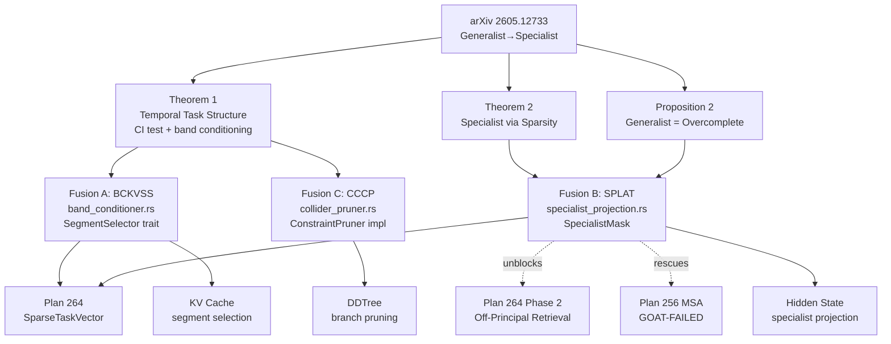

# Plan 265: Task-Relevant Identifiability — Three Modelless Fusions (BCKVSS + SPLAT + CCCP)

**Research:** [232_Task_Relevant_Identifiability_Specialist.md](../.research/232_Task_Relevant_Identifiability_Specialist.md)
**Paper:** arXiv 2605.12733 — From Generalist to Specialist Representation (Zheng et al., ICML 2026)
**Date:** 2026-06-14
**Status:** 🟢 Phase 0 complete (14 unit tests + 1 doc-test pass). Phases 1-5 pending. Unblocks Plan 264 Phase 2 and riir-ai Plan 297 Phase 0.
**Feature Gates:** `band_conditioner` (Fusion A), `specialist_projection` (Fusion B), `collider_consistency` (Fusion C). All opt-in until GOAT-proven.
**Constraints:**
- Modelless only — no LLM training (constraint 1).
- Sigmoid not softmax (constraint 5 / personal rules).
- Plasma/Hot/Warm/Cold/Freeze tier aware (constraint 8).
- CPU/SIMD/GPU/ANE auto-route via threshold (constraint 7).
- SOLID, DRY, files <2048 lines (constraint 5 / personal rules).
- Tests/examples with before/after expected gains (constraint 6).
- Public engine mechanics only — no riir-ai fuel leak (Strategy 003).

---

## Task

### Phase 0 — Shared Foundation (Band Conditioning Math) ✅ DONE

The three fusions share one primitive: the **band conditioning set** and the conditional-dependence test. Build it once, share it.

- [x] T0.1 Create `src/band_conditioner.rs` skeleton.
- [x] T0.2 Implement `BandConditioningSet` struct: `{ inner: [usize; 4], task: usize }` with builder `from_segments(k, v, task, segment_len, total_steps) -> Self` per paper eq. (4). Handle out-of-range indices by omission.
- [x] T0.3 Implement `conditional_dependence_ci(x: &[f32], y: &[f32], z_columns: &[&[f32]], n_samples: usize, alpha: f32) -> bool` — Fisher z-test on partial correlation (paper §5 setup). Sigmoid-bound the p-value to `[0,1]` for downstream consumption.
- [x] T0.4 Implement `conditional_dependence_infonce(x_emb, y_emb, z_emb, critic, n_negatives: usize) -> f32` — the CMI surrogate from paper Appendix C, returning sigmoid-bounded score.
- [x] T0.5 Add feature gate `band_conditioner` in `Cargo.toml`.
- [x] T0.6 Wire module into `src/lib.rs` under feature gate.
- [x] T0.7 GOAT test G0a: `BandConditioningSet::from_segments` produces the exact 4-element set from paper Figure 2 example (`S_k={s3,s4}, S_v={s7,s8}, g_1 → Z={s3,s5,s7,s9,g_1}`).
- [x] T0.8 GOAT test G0b: Fisher z-test recovers dependence on linear Gaussian SCM (paper setup) at p<0.05 with ≥ 90% power at n=1000 samples.
- [x] T0.9 Example: doc-test in module showing paper Figure 2 walk-through.

**Phase 0 unblocks:** Plan 264 Phase 2 (SPLAT consumer), Plan 297 Phase 0 (riir-ai TJS-LoRA + CCAR + CIACoT).

### Phase 1 — Fusion A: Band-Conditioned KV Segment Selector (BCKVSS)

- [ ] T1.1 Define `SegmentSelector` trait (SRP — do NOT extend `ConstraintPruner`, which is for token validity, not KV retention):
  ```rust
  pub trait SegmentSelector: Send + Sync {
      fn select(&self, kv_segments: &[KvSegment], query: &QueryEmb, budget: usize) -> Vec<usize>;
  }
  ```
- [ ] T1.2 Implement `BandConditionerSelector` impl. For each segment `S_v` in KV: retain iff `s_{kL} ⊭ s_{vL} | Z_band(k,v,q)` where `q` is the query embedding treated as task collider `g_i`. Top-budget by sigmoid-bounded CI score.
- [ ] T1.3 Implement batched variant `select_batch<'a>(&self, segments: &'a [KvSegment], query: &QueryEmb, budget: usize, scratch: &mut [f32]) -> Vec<usize>` — zero-alloc hot path per optimization.md.
- [ ] T1.4 Segment length sweep: support L ∈ {2, 8, 32, 128} via config. Default L=32 (semantic chunk granularity).
- [ ] T1.5 Auto-route: `route_ci_test(n_pairs) -> ComputeTarget` — `n_pairs < 1000 → Simd`, else `Gpu`. Wire to existing `inference_router.rs` thresholds.
- [ ] T1.6 Plasma/Hot/Warm tier: BCKVSS sync CI test runs in Hot tier; CMI InfoNCE estimator warm-cached.
- [ ] T1.7 GOAT test G1: CI test call count ≤ 50% of naive O(N²) baseline at L=32 (paper Corollary 1 — segment homogeneity lets us test representatives).
- [ ] T1.8 GOAT test G2: Selection MCC ≥ 0.85 on synthetic 20-step, 4-task SCM benchmark (paper Fig 3 level).
- [ ] T1.9 GOAT test G3: KV cache reduction ≥ 40% with perplexity delta < 0.5 on long-context benchmark (PG19 or synthetic).
- [ ] T1.10 Example: `examples/bckvss_vs_dense.rs` showing before/after KV size and perplexity.

### Phase 2 — Fusion B: Specialist Latent Projection (SPLAT) — UNBLOCKS Plan 264

- [ ] T2.1 Create `src/specialist_projection.rs`.
- [ ] T2.2 Implement `JacobianSupportEstimator` — given hidden activations `h ∈ R^{B×d}` and task embeddings `g ∈ R^{B×k}`, estimate `I(Ju)_{i,·}` via finite-difference Jacobian-vector products (paper Prop 2 needs `|I(Ju)|` samples; we approximate with batch finite differences).
- [ ] T2.3 Implement `SpecialistMask::from_support(support: &[Vec<u32>], shape: (usize, usize)) -> Self` — reuses `SparseTaskVector` storage from Plan 264 (DRY — single sparse representation).
- [ ] T2.4 Implement `SpecialistMask::project(&self, hidden: &mut [f32], scratch: &mut [f32])` — in-place sparsity-bound projection per Theorem 2: `h_specialist = h · M_sparse`.
- [ ] T2.5 Implement sparsity bound enforcement `enforce_sparsity_bound(support_hat: &mut Vec<u32>, support_true_size: usize)` — drops coordinates until `‖I(J_û)‖ ≤ ‖I(Ju)‖` (paper Theorem 2 condition).
- [ ] T2.6 Sigmoid-bounded "specialist score" `specialist_score(mask, hidden) -> f32 ∈ [0,1]` for downstream routing — no softmax.
- [ ] T2.7 Auto-route: `route_specialist_projection(density) -> ComputeTarget` — `density < 0.2 → Plasma` (ternary SIMD matvec), `0.2..0.5 → Simd`, `> 0.5 → Cpu` (no projection worth it).
- [ ] T2.8 Tier: fixed mask → Freeze tier (load-time); adaptive mask → Hot tier (per-query).
- [ ] T2.9 Feature gate `specialist_projection` (depends on `sparse_task_vector` from Plan 264).
- [ ] T2.10 GOAT test G4: Projected hidden state dim reduced ≥ 30% with downstream-task accuracy delta < 1% on synthetic specialist benchmark (paper Fig 5 R² gap).
- [ ] T2.11 GOAT test G5: Mask discovery cost ≤ `d_hidden` samples (paper Prop 2 upper bound).
- [ ] T2.12 GOAT test G6: SPLAT-masked attention matches dense attention quality at 50% density on synthetic attention benchmark (the density at which MSA GOAT-FAILED).
- [ ] T2.13 Wire SPLAT as the inference-time consumer of `SparseTaskVector` in Plan 264 Phase 2 — closes Plan 264 T2.1-T2.3.
- [ ] T2.14 Example: `examples/splat_vs_dense_attention.rs` showing before/after quality and FLOPs.

### Phase 3 — Fusion C: Collider-Consistency ConstraintPruner (CCCP)

- [ ] T3.1 Create `src/collider_pruner.rs`.
- [ ] T3.2 Implement `ColliderConstraint` struct: holds segment boundaries + active task colliders.
- [ ] T3.3 Implement `ConstraintPruner` for `ColliderConstraint`:
  ```rust
  fn is_valid(&self, depth, token_idx, parent_tokens) -> bool {
      // For each tracked task collider g_i:
      //   If extending the branch with token_idx at depth would complete
      //   a segment boundary s_{kL}, test collider consistency.
      // Branch is valid iff some g_i preserves collider dependence.
  }
  ```
- [ ] T3.4 Implement early-return fast path when `self.tasks.is_empty()` (zero overhead — GOAT G9).
- [ ] T3.5 Implement `batch_is_valid` override reusing the BCKVSS batch CI test (Phase 1) — amortizes correlation computation across candidates.
- [ ] T3.6 Compose with `NoPruner` (returns `true` always) via existing composition — when no tasks tracked, behavior = NoPruner.
- [ ] T3.7 Feature gate `collider_consistency` (depends on `band_conditioner`).
- [ ] T3.8 GOAT test G7: On synthetic interleaved-task benchmark (5 tasks, 20 steps), pruner rejects ≥ 90% of branches that complete no collider.
- [ ] T3.9 GOAT test G8: Combined with existing bandit pruner, DDTree finds goal in ≤ 75% of expansions vs bandit-only baseline.
- [ ] T3.10 GOAT test G9: When `tasks.is_empty()`, overhead < 5ns per `is_valid` call (early return).
- [ ] T3.11 Example: `examples/cccp_vs_nopruner.rs` showing before/after DDTree expansion count.

### Phase 4 — Adaptive CoT Stopping Criterion (Theory-Backed)

Paper's Algorithm 1 + Theorem 1 give a *theory-backed* stopping criterion for adaptive CoT: **stop thinking when no unresolved task collider remains.** This closes Plan 194 (selectivity router) and Plan 204 with theory.

- [ ] T4.1 Implement `AdaptiveCoTStopper` — given the current set of identified task colliders, returns `should_continue() -> bool` based on whether any segment pair remains untested.
- [ ] T4.2 Sigmoid-bound "remaining structure uncertainty" `uncertainty(collider_state) -> f32 ∈ [0,1]` — 1.0 = many untested pairs, 0.0 = all tested.
- [ ] T4.3 Wire to existing collapse-aware thinking (Plan 212) — when uncertainty drops below threshold τ, stop.
- [ ] T4.4 GOAT test G10: Adaptive CoT depth on hard-query benchmark is ≥ 30% shorter than fixed-depth CoT at equal quality.
- [ ] T4.5 Example: `examples/adaptive_cot_stopping.rs` showing before/after token count and quality.

### Phase 5 — GOAT Gate & Promotion

- [ ] T5.1 Run full benchmark suite with all three features on.
- [ ] T5.2 Confirm G0a, G0b, G1-G10 all pass.
- [ ] T5.3 If all pass → promote `band_conditioner`, `specialist_projection`, `collider_consistency` to `default` feature set.
- [ ] T5.4 If SPLAT-masked attention (G6) beats prior MSA implementation → demote `msa_blockwise_sparse` (Plan 256) to non-default per user rules ("demote loser").
- [ ] T5.5 Update README with showcase entry under "GOAT-Proved Additions" — three new items.
- [ ] T5.6 Mark Plan 264 Phase 2 unblocked (SPLAT is the consumer).
- [ ] T5.7 Cross-link Plan 297 (riir-ai model-based) — riir-ai consumes the engine primitives for TJS-LoRA training.

### Phase 6 — Documentation

- [ ] T6.1 Add module-level docs explaining the three theorems (Thm 1, Prop 2, Thm 2) with one-paragraph summaries.
- [ ] T6.2 Add cross-references from `ConstraintPruner` trait doc to CCCP impl.
- [ ] T6.3 Add cross-references from `SparseTaskVector` (Plan 264) doc to SPLAT consumer.
- [ ] T6.4 Note in README that this research rescues MSA (Plan 256 GOAT-FAILED).

---

## Architecture



## Dependency Graph

| Component | Depends On | Feature Gate |
|---|---|---|
| `band_conditioner.rs` (Phase 0) | nothing | `band_conditioner` |
| BCKVSS (Phase 1) | Phase 0 | `band_conditioner` |
| SPLAT (Phase 2) | Phase 0 + Plan 264 `SparseTaskVector` | `specialist_projection` (depends on `sparse_task_vector`) |
| CCCP (Phase 3) | Phase 0 | `collider_consistency` (depends on `band_conditioner`) |
| Adaptive CoT (Phase 4) | Phase 1 | `adaptive_cot_identifiability` |

## Files

| File | Lines (est.) | Purpose |
|---|---|---|
| `src/band_conditioner.rs` | ~400 | Phase 0 shared primitive (BandConditioningSet + CI tests) |
| `src/bckvss.rs` | ~350 | Fusion A: KV segment selector |
| `src/specialist_projection.rs` | ~450 | Fusion B: SPLAT projection |
| `src/collider_pruner.rs` | ~300 | Fusion C: ConstraintPruner impl |
| `src/adaptive_cot_stopper.rs` | ~200 | Phase 4: theory-backed CoT stopping |
| `examples/band_conditioning_demo.rs` | ~80 | Phase 0 doc example |
| `examples/bckvss_vs_dense.rs` | ~120 | Fusion A before/after |
| `examples/splat_vs_dense_attention.rs` | ~150 | Fusion B before/after + MSA rescue |
| `examples/cccp_vs_nopruner.rs` | ~100 | Fusion C before/after |
| `examples/adaptive_cot_stopping.rs` | ~100 | Phase 4 before/after |

All files < 2048 lines (personal rule).

## GOAT Summary

| Gate | Metric | Target | Source |
|---|---|---|---|
| G0a | BandConditioningSet correctness | exact match to paper Fig 2 | Phase 0 |
| G0b | Fisher z-test power | ≥ 90% at n=1000, α=0.05 | Phase 0 |
| G1 | CI call reduction vs O(N²) | ≥ 2× | Phase 1 |
| G2 | Selection MCC | ≥ 0.85 | Phase 1 |
| G3 | KV reduction at parity | ≥ 40% | Phase 1 |
| G4 | Hidden dim reduction at parity | ≥ 30% | Phase 2 |
| G5 | Mask discovery cost | ≤ d_hidden samples | Phase 2 |
| G6 | MSA rescue at 50% density | parity with dense | Phase 2 |
| G7 | Dead-branch rejection | ≥ 90% | Phase 3 |
| G8 | DDTree expansion reduction | ≥ 25% | Phase 3 |
| G9 | No-task overhead | < 5ns | Phase 3 |
| G10 | Adaptive CoT depth reduction | ≥ 30% at parity | Phase 4 |
