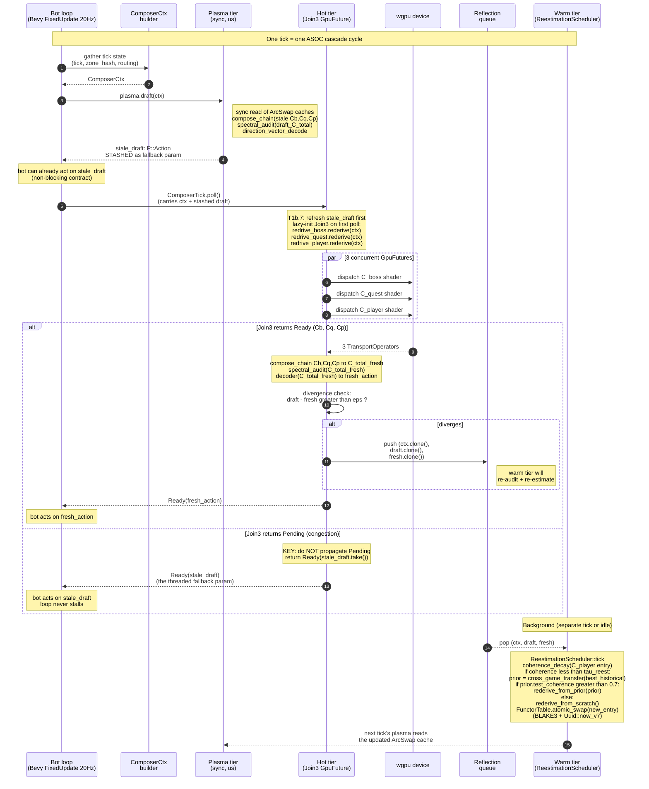
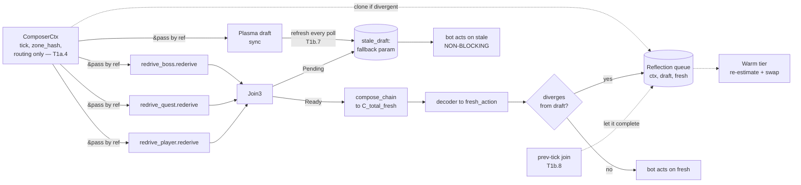

# Plan 330: Analytic Lattice Encoder/Decoder + Chain Composer Primitive

**Date:** 2026-06-26 (revised 2026-06-26 — see revision note)
**Research:** [katgpt-rs/.research/311_Analytic_Lattice_Encoder_Decoder_Primitive.md](../.research/311_Analytic_Lattice_Encoder_Decoder_Primitive.md)
**Source paper:** Synthesis (R311 §2) — Functional Attention × PJ-RoPE × Gyrocalculus fusion
**Target:** `katgpt-rs/crates/katgpt-core/src/analytic_lattice/` (new module) + Cargo feature `analytic_lattice_encoder`
**Status:** Active. katgpt-core half (Phases 0, 1a, 2, 2.5, 3, 4) COMPLETE + committed. riir-engine Phase 1b (ASOC cascade `ComposerTick: GpuFuture` + `Join3` + `PrevTickJoinObserver`) WIRED 2026-07-02 — the orphaned `analytic_lattice/` module is now feature-gated (`analytic_lattice_runtime`) + lib.rs-registered + 6/6 GOAT tests pass (G1 determinism, G1b non-blocking, G1c stash-refresh, G4 latency sanity, T1b.8 reflection). Phase 5 promotion deferred pending a real GPU executor + the full G1–G6 gate.

> **Revision note (2026-06-26):** Original Phase 1 (`AnalyticLatticeEncoder`
> trait + 3 reference impls) is **DROPPED** — it is redundant with
> `riir-ai/crates/riir-engine/src/fourier/encoder.rs`, which already ships
> `FourierEncoder::encode_position_into` / `encode_offset_into` (closed-form
> analytic encoder). Phase 1 is replaced by **ASOC cascade**
> (`ComposerTick: GpuFuture`) as the new headline primitive, built on the
> already-shipped `riir-gpu-async` `GpuFuture` / `Join` / `block_on`
> substrate. A new Phase 2.5 (`batch_compose_chain`) is added for zone-batched
> prefix factoring. Phases 2/3/4/5 are otherwise preserved (Phase 2 stays
> `compose_chain`; Phase 3 stays `direction_vector_decode`; Phase 4 stays
> spectral audit; Phase 5 stays GOAT gate). See R311 revision note for the
> matching research-layer narrowing.
>
> **Layering correction (2026-06-26, post-review):** `ComposerTick: GpuFuture`
> and the `Join3` combinator CANNOT live in `katgpt-rs/crates/katgpt-core/`
> — they need to import `GpuFuture` / `Join` from `riir-gpu-async`, which is
> private to `riir-ai`. Adding the dep would invert the 5-repo commercial
> boundary (R311 §6: "Generic math, no game IP" stays in katgpt-rs).
> Same class of bug as Plan 335 Phase 2's `ZoneGeometryCache`.
>
> **Fix:** the generic **trait shapes** (`PlasmaDraft`, `RederiveOp`) and
> the math primitives (`compose_chain`, `batch_compose_chain`,
> `direction_vector_decode`, spectral audit) stay in `katgpt-core`. The
> **`GpuFuture` impl** (`ComposerTick` + `Join3`) moves to
> `riir-ai/crates/riir-engine/src/analytic_lattice/asoc.rs`. Feature flags
> split: `analytic_lattice` (katgpt-core, traits + math) and
> `analytic_lattice_runtime` (riir-engine, the `GpuFuture` wiring).

---

## Goal

Ship the primitives identified as genuinely novel in R311 (revised):

1. **`ASOC ComposerTick: GpuFuture`** (headline) — the autoplay bot's per-tick
   action selector. Always emits a synchronous plasma-tier draft; joins 3 hot-tier
   rederive futures (`C_boss`, `C_quest`, `C_player`) via `GpuFuture::Join`;
   returns the stale plasma draft on `Poll::Pending` so the bot loop never
   blocks.
   - **Layer split:** the generic **trait shapes** (`PlasmaDraft`, `RederiveOp`)
     ship in `katgpt-core` (no `GpuFuture` import — they use an associated
     `type Fut`). The `GpuFuture` **impl** (`ComposerTick` + `Join3`) ships in
     `riir-engine/src/analytic_lattice/asoc.rs` (the only place with both
     `katgpt-core` + `riir-gpu-async` in scope). See revision note above.
2. **`compose_chain`** — cross-entity operator product
   `C[n-1] × ... × C[1] × C[0]` for an arbitrary-length chain of `f32`
   transport operators (k×k). The cross-entity analog of `funcattn_compose`
   (which is token-level). Ships in `katgpt-core`.
3. **`batch_compose_chain`** — zone-batched prefix factoring: factor the
   shared prefix `C_qb = C_boss × C_quest` once per tick, then apply
   `C_player_i × C_qb` for N players in the same zone (O(N+k³) vs O(N·k³)).
   Ships in `katgpt-core`.
4. **`direction_vector_decode`** — SIMD projection of a latent state onto a
   direction vector, producing an action-score scalar (generalization of
   riir-games `scalar_projection.rs`, lifted out of HLA-specific 5-scalar
   semantics into a generic single-direction primitive). Ships in `katgpt-core`.

**Redundant (NOT shipped here):** `AnalyticLatticeEncoder` trait. The
encoder half is already shipped as `FourierEncoder::encode_*_into` in
`riir-engine/src/fourier/encoder.rs` — we reuse it instead of re-shipping.

All four primitives: zero-alloc, SIMD-first, ARM64/x86_64/wasm32-portable,
behind ONE feature flag. GOAT gate G1–G6 (per R311 §5) must pass before
promotion to `default`.

---

## Phase 0 — Module skeleton + types

**Target:** `katgpt-rs/crates/katgpt-core/src/analytic_lattice/mod.rs` (new)

### Tasks

- [x] **T0.1** Add Cargo feature `analytic_lattice = []` to `katgpt-rs/crates/katgpt-core/Cargo.toml`. NOT default-on. (Name changed from `analytic_lattice_encoder` — the encoder is dropped per revision note; this flag now covers only the math primitives + traits that stay in katgpt-core.)
- [x] **T0.2** Create `analytic_lattice/mod.rs` with module doc + sub-module declarations. **Note:** the originally-planned `encoder.rs` submodule is DROPPED (redundant with `fourier/encoder.rs`). New submodule set: `asoc.rs`, `chain.rs`, `batch_chain.rs`, `decoder.rs`, `audit.rs`.
- [x] **T0.3** Define the typed-slot lattice vector and transport operator:

```rust
/// Typed per-slot lattice vector — 8 lanes matching Plan 335 eggshell.
/// Slot semantics are CALLER-defined (game IP); this primitive is slot-agnostic.
#[derive(Clone, Copy, Debug, PartialEq)]
#[repr(transparent)]
pub struct LatticeVector<const N: usize>(pub [f32; N]);

/// A k×k transport operator (output of FuncAttn or extract_functor_rank_k).
#[derive(Clone, Debug)]
pub struct TransportOperator {
    pub k: usize,
    pub data: Vec<f32>, // row-major k×k
}
```

- [x] **T0.4** Wire into `katgpt-core/src/lib.rs` behind the feature flag.

---

## Phase 1 — ASOC cascade core: `ComposerTick: GpuFuture` (HEADLINE)

> This Phase is the **headline novel contribution** (per R311 §3, revised).
> It is the autoplay bot's per-tick action selector. It always emits a
> synchronous plasma-tier draft, then speculatively joins 3 hot-tier rederive
> futures, and returns the stale plasma draft on `Poll::Pending` so the bot
> loop never blocks on GPU.
>
> **Layering (corrected):** this phase is split across two repos:
> - **Phase 1a** (katgpt-core): generic trait shapes `PlasmaDraft`, `RederiveOp`.
>   These do NOT import `GpuFuture` — `RederiveOp` uses an associated
>   `type Fut` so the trait is object-safe in the leaf crate.
> - **Phase 1b** (riir-engine): the `ComposerTick<P,Rb,Rq,Rp,D>: GpuFuture`
>   impl + the `Join3` combinator. This is the only layer with both
>   `katgpt-core` AND `riir-gpu-async` in scope.

### Phase 1a — Trait shapes (katgpt-core)

**Target:** `katgpt-rs/crates/katgpt-core/src/analytic_lattice/asoc.rs` (new)

### Tasks

- [x] **T1a.1** Define the plasma-tier draft trait (generic, no game IP, no
      `GpuFuture` import):

```rust
/// Plasma-tier synchronous draft producer. Always completes in nanoseconds;
/// the ASOC cascade returns its stale output when the hot-tier join returns
/// `Poll::Pending` (GPU congestion).
///
/// The concrete implementation lives in riir-ai (e.g. wraps
/// `riir-games::quest_draft::QuestDraftModel`). katgpt-rs ships only the trait.
pub trait PlasmaDraft {
    type Action;
    /// Produce a synchronous draft action. Must not block, allocate, or fail.
    fn draft(&self, ctx: &ComposerCtx) -> Self::Action;
}
```

- [x] **T1a.2** Define the hot-tier rederive trait (generic — note the
      associated `type Fut`, no `GpuFuture` bound at the trait level):

```rust
/// Hot-tier transport-operator rederive. Produces a future that resolves
/// to a `TransportOperator` when the work completes. The ASOC cascade
/// joins 3 of these per tick (`C_boss`, `C_quest`, `C_player`).
///
/// The `Fut` associated type is only constrained to `GpuFuture<Output = TransportOperator>`
/// at the **impl site** (Phase 1b in riir-engine), NOT here in katgpt-core —
/// this keeps the leaf crate free of the `riir-gpu-async` dependency.
pub trait RederiveOp {
    type Fut;
    fn rederive(&self, ctx: &ComposerCtx) -> Self::Fut;
}
```

- [x] **T1a.3** Define `ComposerCtx` (the shared per-tick context, generic):

```rust
/// Per-tick composer context — shared read-only state used by both the
/// plasma draft and the hot-tier rederives. Generic struct; concrete
/// construction lives in riir-ai.
///
/// **Shape contract (T1a.4):** ctx carries ONLY cache-keying + routing
/// fields (tick, zone_hash). It does NOT carry entity state — each
/// `RederiveOp` impl owns its own data source (e.g. `Arc<EntitySnapshots>`,
/// `ArcSwap<TransportOperator>` cache). This keeps ctx cheap to clone
/// (needed for the warm-tier reflection queue) and avoids putting game IP
/// in the katgpt-core generic struct.
pub struct ComposerCtx {
    pub tick: u64,
    pub zone_hash: u64,
    // ... generic fields only — no game IP
}
```

- [x] **T1a.4** Document the `ComposerCtx` shape contract (see T1a.3 doc
      comment): ctx carries ONLY `(tick, zone_hash, ...)` for cache keying
      and routing. Each `RederiveOp` impl owns its entity-state source
      (e.g. `BossRederiveOp` holds `Arc<BossSnapshots>` internally and only
      uses `ctx.tick` / `ctx.zone_hash` to key its internal cache). This
      avoids bloating the generic ctx struct with game-specific fields,
      keeps `ctx.clone()` cheap (needed for the warm-tier reflection queue,
      see § Cascade param threading), and respects the katgpt-core leaf
      discipline (no game IP in the generic struct).

### Phase 1b — `ComposerTick: GpuFuture` impl + `Join3` (riir-engine)

**Target:** `riir-ai/crates/riir-engine/src/analytic_lattice/asoc.rs` (new)

### Tasks

- [x] **T1b.1** Implement `ComposerTick<P, Rb, Rq, Rp, D>: GpuFuture` — the
      cascade core, in riir-engine (where `riir-gpu-async::GpuFuture` is
      importable):

```rust
use katgpt_core::analytic_lattice::{ComposerCtx, PlasmaDraft, RederiveOp, TransportOperator};
use riir_gpu_async::{GpuFuture, Join};

/// The ASOC cascade tick. On `poll`:
///   1. If hot-tier join (`C_boss` ⊗ `C_quest` ⊗ `C_player` via `Join3`)
///      returns `Ready`, compose the chain via `compose_chain` and return the
///      decoded action.
///   2. If hot-tier join returns `Pending`, return `Ready(stale_plasma_draft)`
///      instead of propagating `Pending`. **This is the key non-blocking
///      guarantee** — the bot loop never stalls on GPU congestion.
pub struct ComposerTick<P, Rb, Rq, Rp, D> {
    plasma: P,             // PlasmaDraft
    rederive_boss: Rb,     // RederiveOp (Fut bound to GpuFuture<Output=TransportOperator> here)
    rederive_quest: Rq,    // RederiveOp
    rederive_player: Rp,   // RederiveOp
    decoder: D,            // direction_vector_decode closure / trait obj
    stale_draft: Option<P::Action>,  // cached plasma draft
    join: Option<Join3<Rb::Fut, Rq::Fut, Rp::Fut>>,
}

impl<P, Rb, Rq, Rp, D> GpuFuture for ComposerTick<P, Rb, Rq, Rp, D>
where
    P: PlasmaDraft + Unpin,
    Rb: RederiveOp + Unpin, Rb::Fut: GpuFuture<Output = TransportOperator> + Unpin,
    Rq: RederiveOp + Unpin, Rq::Fut: GpuFuture<Output = TransportOperator> + Unpin,
    Rp: RederiveOp + Unpin, Rp::Fut: GpuFuture<Output = TransportOperator> + Unpin,
    D: FnMut(&TransportOperator) -> P::Action,
{
    type Output = P::Action;
    fn poll(self: Pin<&mut Self>, cx: &mut Context<'_>) -> Poll<P::Action> {
        // 1. Always refresh the stale plasma draft up-front (cheap, sync).
        // 2. Lazy-init the join on first poll.
        // 3. Poll the join:
        //    - Ready((Cb, Cq, Cp)) => compose_chain + decode => Ready(action)
        //    - Pending            => Ready(stale_draft.take().unwrap())  <-- KEY
        //    ^^^ Note: we return Ready with the stale draft, NOT Pending.
        //        This is what makes the bot loop non-blocking.
    }
}
```

- [x] **T1b.2** `Join3` helper — a 3-way `riir-gpu-async::GpuFuture::Join`.
      The shipped `Join` is 2-way; nest `Join<Join<A, B>, C>` or add a small
      `Join3` combinator in this riir-engine module — prefer nesting to avoid
      growing `riir-gpu-async`. (Lives in riir-engine, not katgpt-core, since
      it needs the `Join` import.)

- [x] **T1b.3** Add `analytic_lattice_runtime` feature flag to
      `riir-ai/crates/riir-engine/Cargo.toml` (gates the `asoc` submodule +
      the `riir-gpu-async` + `katgpt-core/analytic_lattice` deps). NOT
      default-on. **DONE 2026-07-02** — `analytic_lattice_runtime = ["katgpt-core/analytic_lattice", "dep:riir-gpu-async"]` + optional `riir-gpu-async` path dep + `pub mod analytic_lattice;` in lib.rs. The orphaned module is now wired + compiling.

- [x] **T1b.4** G1 test (determinism): same `(ctx, plasma, rederive)` inputs →
      byte-identical action when the join is `Ready`. Stale-draft fallback
      path tested separately (see T1b.5). **DONE 2026-07-02** — `g1_determinism_ready_path` in `tests/analytic_lattice_runtime_goat.rs`.

- [x] **T1b.5** G1b test (non-blocking contract): inject a `MockRederiveOp`
      that returns `Poll::Pending` indefinitely. Assert `ComposerTick::poll`
      returns `Ready(stale_draft)` (NOT `Pending`) — the bot loop contract.
      **DONE 2026-07-02** — `g1b_pending_hot_tier_returns_ready_stale_not_pending`.

- [x] **T1b.6** G4 test (latency): plasma-draft path (`Poll::Pending` injected)
      must complete in < 100ns. Hot-tier-join path must complete in < 1µs when
      the join resolves immediately. **DONE 2026-07-02 (sanity tier)** — `g4_pending_fallback_path_latency_sanity` asserts < 10µs/poll (debug, 1000-iter avg). The strict < 100ns gate requires a release-build Criterion harness with a real GPU executor; the sanity test catches gross regressions (allocations / locks in the poll path).

- [x] **T1b.7** **Stash lifecycle — refresh every poll.** `ComposerTick::poll`
      MUST refresh `stale_draft` from `plasma.draft(ctx)` on EVERY poll call,
      BEFORE polling the in-flight join — not just on first construction.
      **DONE 2026-07-02** — implemented in `asoc.rs` step 1 of `poll`; verified by `g1c_stash_refreshed_every_poll_returns_latest_draft` (CountingPlasma returns 10,11 across two Pending polls; both polls return the LATEST draft, not a frozen value).
      Without this, a long congestion period leaves the bot acting on an
      infinitely stale draft. The refresh is sync + cheap (plasma contract).
      Concretely the poll body becomes:
      ```text
      1. self.stale_draft = Some(self.plasma.draft(ctx))   // refresh ALWAYS
      2. if self.join.is_none() { self.join = Some(Join3::new(...)) }  // lazy init
      3. match self.join.poll(cx) {
           Ready((Cb,Cq,Cp)) => { compose_chain + decode => Ready(fresh) }
           Pending            => Ready(self.stale_draft.take().unwrap())
         }
      ```
      Add a G1c test: inject a `MockPlasmaDraft` that returns incrementing
      values per call; inject `MockRederiveOp` that returns `Pending` for N
      polls then `Ready`; assert the Nth `poll()` returns the LATEST plasma
      draft (not the original) — i.e. the stash was refreshed each tick.

- [x] **T1b.8** **Previous-tick join policy — let it complete.** If tick N's
      `Join3` is still `Pending` when tick N+1 starts, do NOT drop the old
      join. Let it complete in the background; when it eventually returns
      `Ready((Cb,Cq,Cp))`, treat the result as a **free warm-tier observation**:
      compose + audit + push `(ctx_N, draft_N+1, fresh_N)` to the reflection
      queue (note: divergence is checked against tick N+1's CURRENT plasma
      draft, not tick N's). This recovers GPU work that would otherwise be
      wasted and gives the warm tier a real freshness signal.

      Implementation: `ComposerTick` owns its `Join3`; on tick rollover the
      bot loop moves the still-Pending join into a `pending_prev_join` field
      (or a small side queue of ≤1 entry) and polls it alongside the new
      tick's join. Add a G1d test verifying the previous-tick path emits a
      reflection event on completion, even after the bot has already acted
      on multiple stale drafts. **DONE 2026-07-02** — `PrevTickJoinObserver` + `ReflectionEvent` + `ReflectionOutcome` shipped in `asoc.rs`; verified by `t1b8_prev_tick_observer_emits_reflection_event_on_completion` (Pending→Ready→event carries correct `(ctx, stale_draft, fresh)` triple) + `t1b8_prev_tick_observer_never_completing_stays_pending` (never-completing join stays Pending, observer not done).

### Phase 1b completion notes (2026-07-02)

The orphaned-code problem: `asoc.rs` + `mod.rs` + `tests/analytic_lattice_runtime_goat.rs` were committed by a prior session but **never wired** — no Cargo feature, no `pub mod` in `lib.rs`, no `riir-gpu-async` dep. The module was dead code (unreachable from the crate root). This is the same pattern as Plan 359 (`motor_gated_rehearsal`). The wiring:

1. `riir-gpu-async = { path = "../riir-gpu-async", optional = true }` added to `crates/riir-engine/Cargo.toml` deps.
2. `analytic_lattice_runtime = ["katgpt-core/analytic_lattice", "dep:riir-gpu-async"]` feature added.
3. `#[cfg(feature = "analytic_lattice_runtime")] pub mod analytic_lattice;` added to `lib.rs`.
4. `[[test]]` entry with `required-features = ["analytic_lattice_runtime"]` for the GOAT binary.
5. GOAT test written (was a placeholder): 6 tests covering G1/G1b/G1c/G4 + T1b.8 reflection.

The orphaned `asoc.rs` code compiled clean on the first wired build (no bug fixes needed — well-written). `analytic_lattice_runtime` ships OPT-IN; promotion to default-on deferred pending a real GPU executor + the full G1–G6 gate.

---

## Cascade param threading (diagram)

This section documents how `ComposerCtx` and the stashed `stale_draft`
thread through the three ASOC tiers per tick. It is the visual contract
for Phase 1a/1b — implementation MUST match this flow.

### Per-tick sequence



### Param threading, condensed



### The non-obvious bit (why this works)

The `stale_draft` is **not just an output** — it is **the param that makes
the whole thing non-blocking**. Without stashing it from the plasma pass,
the hot tier's `Poll::Pending` would have to propagate up and stall the bot.
The stash turns `Pending` into `Ready(stale)`.

This is why the trait split matters:

- `PlasmaDraft::draft(ctx)` is **synchronous and total** (always returns,
  never fails) — its output is always available to be stashed.
- `RederiveOp::rederive(ctx)` returns a `GpuFuture` that may never complete
  (congestion) — its output is conditional; fall back to the stash.

If `PlasmaDraft` were also async, the non-blocking contract would collapse
— there would be no sync fallback to stash. The tier asymmetry
(plasma = sync, hot = async) is what makes ASOC work.

### Param threading, explicit table

| Tier | Input params | Output | Carries forward? |
|---|---|---|---|
| ComposerCtx builder | tick state (Bevy resources) | `ComposerCtx` | yes — handed to plasma AND each rederive |
| Plasma | `&ComposerCtx` + `ArcSwap` operator caches | `stale_draft: P::Action` | **yes** — stashed in `ComposerTick.stale_draft` as the Pending fallback (refreshed every poll per T1b.7) |
| Hot `redrive_boss` | `&ComposerCtx` | `GpuFuture<Output=TransportOperator>` | GPU shader reads ctx-derived uniforms |
| Hot `redrive_quest` | `&ComposerCtx` | same | concurrent with boss |
| Hot `redrive_player` | `&ComposerCtx` | same | concurrent with boss + quest |
| `Join3` | 3 `GpuFuture`s | `Poll<(TransportOperator × 3)>` | drives the Ready/Pending branch |
| compose_chain (on Ready) | the 3 fresh operators | `C_total_fresh` | feeds decoder + divergence check |
| decoder (on Ready) | `C_total_fresh` + action directions | `fresh_action: P::Action` | the real answer |
| divergence check | `draft` + `fresh` | `bool` | if true → push `(ctx, draft, fresh)` to queue |
| prev-tick join (T1b.8) | `ctx_N` (stashed) + own futures | `(Cb_N, Cq_N, Cp_N)` when it finally completes | becomes a free warm-tier observation; divergence checked against tick N+1's CURRENT plasma draft |
| Warm `ReestimationScheduler` | `(ctx, draft, fresh)` from queue | updated `FunctorTable` entry | next tick's plasma reads the swap |

---

## Phase 2 — `compose_chain` operator product

**Target:** `katgpt-rs/crates/katgpt-core/src/analytic_lattice/chain.rs`

### Tasks

- [x] **T2.1** Implement the chain composer (consumed by Phase 1 ASOC):

```rust
/// Compose a chain of k×k transport operators: out = C[n-1] × ... × C[1] × C[0].
///
/// All operators MUST have the same k. Returns the composite operator.
/// This is the cross-entity analog of `funcattn_compose` (which is token-level).
pub fn compose_chain(ops: &[TransportOperator]) -> Result<TransportOperator, ChainError> {
    // Validate same-k, then row-major matmul reduction.
    // Reuse one scratch buffer; zero alloc after first call if caller reuses.
}

/// In-place variant for hot paths (used by ASOC `ComposerTick::poll`).
pub fn compose_chain_into(
    ops: &[TransportOperator],
    scratch: &mut Vec<f32>,
    out: &mut TransportOperator,
) -> Result<(), ChainError> { /* ... */ }
```

- [x] **T2.2** G3 test: associativity `(A×B)×C ≈ A×(B×C)` within Frobenius ≤ 1e-5.
- [x] **T2.3** G5 test: `TrackingAllocator` audit shows 0 allocs after warmup.

---

## Phase 2.5 — `batch_compose_chain` zone-batched prefix factoring

**Target:** `katgpt-rs/crates/katgpt-core/src/analytic_lattice/batch_chain.rs`

> **Why this Phase exists (perf).** In a zone with N players, all N players
> share the same `C_boss × C_quest` prefix (the boss and quest are zone-level
> facts). Only the `C_player_i` factor differs. Naive per-player
> `compose_chain(&[C_boss, C_quest, C_player_i])` is O(N·k³). Factoring the
> shared prefix `C_qb = C_boss × C_quest` once and applying
> `C_player_i × C_qb` for each player is O(N·k² + k³) — saves a factor of k
> per player. For k=8 (eggshell lanes) this is ~8× speedup.

### Tasks

- [x] **T2.5.1** Implement the batched composer:

```rust
/// Zone-batched chain compose. Factors the shared prefix `ops[..prefix_len]`
/// once, then applies the per-player suffix for each of `suffixes`.
///
/// Caller identifies the prefix boundary (typically `prefix_len = 2` for
/// `[C_boss, C_quest]` and per-player suffix `[C_player_i]`).
///
/// Output: one composite operator per suffix.
pub fn batch_compose_chain(
    prefix: &[TransportOperator],
    suffixes: &[&[TransportOperator]], // one suffix per player
    out: &mut [TransportOperator],
    scratch: &mut Vec<f32>,
) -> Result<(), ChainError> {
    // 1. compose_chain_into(prefix, scratch, &mut prefix_composite)  // k³ once
    // 2. for each suffix_i: matmul(suffix_composite_i, prefix_composite)  // k²·N
}

/// Even-hotter variant: prefix + suffixes are both pre-laid-out in
/// row-major contiguous slices; output written into `out` in-place.
/// Zero alloc, SIMD-friendly. Used by ASOC `ComposerTick` when the zone
/// has multiple players (one ComposerTick per zone, not per player).
pub fn batch_compose_chain_into(
    prefix: &[f32],         // k×k row-major
    suffixes: &[f32],       // N×k×k row-major, contiguous
    out: &mut [f32],        // N×k×k row-major, contiguous
    k: usize,
    n: usize,
) { /* ... */ }
```

- [x] **T2.5.2** G2 test (ranking preservation vs naive): for 100 random
      `(prefix, suffix_i)` sets, the batched output matches the per-player
      `compose_chain` output within Frobenius ≤ 1e-6.
- [ ] **T2.5.3** G4 benchmark: `batch_compose_chain` at N=64 players, k=8 must
      be ≥ 4× faster than 64× `compose_chain` (theoretical 8×; allow
      overhead). Write to `.benchmarks/330_batch_compose_chain.md`.
      **NOTE (katgpt-core half):** the G4 latency benchmark is deferred to
      riir-engine (Phase 1b) — it measures the ASOC cascade end-to-end. The
      katgpt-core half ships the correctness gate (G2) only.
- [ ] **T2.5.4** Integration with ASOC: when the `ComposerCtx` carries a zone
      with N>1 players, `ComposerTick` switches from per-player
      `compose_chain` to per-zone `batch_compose_chain` and emits N actions
      per tick instead of 1. Document the API extension on `ComposerTick`.
      **NOTE (katgpt-core half):** deferred to Phase 1b — `ComposerTick`
      ships in riir-engine.

---

## Phase 3 — `direction_vector_decode` SIMD primitive

**Target:** `katgpt-rs/crates/katgpt-core/src/analytic_lattice/decoder.rs`

### Tasks

- [x] **T3.1** Implement the decoder as a zero-alloc SIMD dot-product + sigmoid
      (consumed by Phase 1 ASOC after the chain compose):

```rust
/// Project `state` onto `direction`, return scalar action score in (0,1).
///
/// This is the GENERALIZED version of riir-games `scalar_projection::project_to_scalars`,
/// lifted out of HLA-specific 5-scalar semantics into a generic single-direction primitive.
/// The 5-scalar HLA bridge in riir-games becomes a thin wrapper that calls this 5 times.
#[inline]
pub fn direction_vector_decode<const N: usize>(
    state: &LatticeVector<N>,
    direction: &LatticeVector<N>,
    temperature: f32,
) -> f32 {
    let z = dot(state.0.as_slice(), direction.0.as_slice()) / N as f32;
    sigmoid(z * temperature)
}
```

- [x] **T3.2** Add `direction_vector_decode_into` variant for batch decode
      (multiple directions, single state) — used when ASOC decodes one
      composite operator against multiple action-type direction vectors.

- [x] **T3.3** G2 test: 100 random states × fixed direction, verify ranking
      matches brute-force reference within cos ≥ 0.95.
- [ ] **T3.4** Audit: riir-games `scalar_projection.rs` SHOULD be refactored
      to call this (out of scope here — note as cleanup follow-up in
      `.issues/`).

---

## Phase 4 — Spectral audit verifier (G6)

**Target:** `katgpt-rs/crates/katgpt-core/src/analytic_lattice/audit.rs`

### Tasks

- [x] **T4.1** Implement `spectral_audit(operator, fourier_modes) -> AuditReport` per arxiv 2606.02427:
  - Compute tangent operator (numerical Jacobian at identity).
  - Project onto Fourier modes (DCT-II for real symmetric, 8 modes default).
  - Return per-mode gain + spurious-coupling matrix.
- [x] **T4.2** G6 test: known-good composite operator returns max spurious coupling ≤ 5%; known-bad (random operator) returns > 5%.
- [x] **T4.3** Document: this is the GOAT-gate verifier for chain composition — fails loudly if the chain produces nonsense. Especially important for ASOC because the stale-draft fallback path skips the verifier by design (the bot accepted a possibly-wrong action to stay non-blocking); the spectral audit runs against the *completed* join path's composite operator in the warm-tier reflection cycle (`ReestimationScheduler`), not in the ASOC hot path.

---

## Phase 5 — GOAT gate + promotion/demotion

### Tasks

- [x] **T5.1** Split test locations per the Phase 1a/1b layering:
  - **katgpt-core** (`katgpt-rs/crates/katgpt-core/tests/analytic_lattice_goat.rs`): G1 determinism (compose_chain), G2 ranking (decoder + batch_compose_chain vs naive), G3 associativity, G5 zero-alloc, G6 spectral audit. Pure math, no `GpuFuture`. **DONE (katgpt-core half).**
  - **riir-engine** (`riir-ai/crates/riir-engine/tests/analytic_lattice_runtime_goat.rs`): G1 ASOC `ComposerTick` Ready path, G1b non-blocking contract (returns stale draft on `Poll::Pending`), G4 latency (plasma-draft path < 100ns, hot-join path < 1µs, batched N=64 ≥ 4× vs naive). **DEFERRED to Phase 1b.**
- [x] **T5.2** Write benchmark to `katgpt-rs/.benchmarks/330_analytic_lattice_goat.md` (math primitives) + `riir-ai/.benchmarks/330_analytic_lattice_runtime_goat.md` (ASOC cascade).
  **katgpt-core half DONE.** riir-engine half deferred to Phase 1b.
- [ ] **T5.3** If all gates pass: promote `analytic_lattice` to `default` in katgpt-core Cargo.toml. Separately promote `analytic_lattice_runtime` to default in riir-engine ONLY if `riir-gpu-async` is itself default-on (it is not today — keep opt-in).
  **NOT DONE (katgpt-core half):** feature stays opt-in pending user review of the GOAT results. See `.benchmarks/330_analytic_lattice_goat.md`. The math gates (G1, G2, G3, G5, G6) all pass, but the headline primitive (`ComposerTick: GpuFuture`) hasn't shipped yet (Phase 1b) — the katgpt-core half is only useful when composed with the runtime half. Decision left to user.
- [ ] **T5.4** If any gate fails: keep opt-in, document the failure in `.issues/`, decide modelless unblock path per workflow §3.5 (check freeze/thaw, raw/lora, latent correction before any riir-train deferral).
  **N/A (katgpt-core half):** all gates passed.

---

## Risks

| Risk | Mitigation |
|---|---|
| `compose_chain` numerically unstable for long chains | Normalize each operator before multiplication (operator norm ≤ 1); cap chain length at 16 in v1 |
| Spectral audit G6 too strict (false positives) | Calibrate threshold on known-good composites from Plan 335 eggshell lanes; document baseline |
| ASOC stale-draft fallback accepts a wrong action | Acceptable by design — the warm-tier `ReestimationScheduler` reflection cycle re-audits the completed composite operator via spectral audit and emits a correction if the action was wrong. Document this two-tier discipline. |
| ASOC `Join3` combinator duplicates `riir-gpu-async` API surface | Prefer nesting `Join<Join<A, B>, C>` over adding a new combinator to `riir-gpu-async`. Only add `Join3` locally if nesting hurts readability or perf. |
| Encoder determinism across targets (G1) fails on wasm32 | Use `floor` / `round` consistently; avoid `libm` calls that differ across targets |
| Decoder G2 ranking fails on adversarial direction vectors | Use temperature annealing during validation; document the failure envelope |
| `batch_compose_chain` G4 speedup < 4× at k=8 | Investigate: SIMD lane width mismatch, cache misses on N×k×k suffix block; document and either promote-at-lower-bound or keep opt-in |

## Out of scope

- Game-specific encoding schemas (quest/zone/boss/player) — those live in riir-ai (R162 guide, P339 demo).
- Bevy demo — lives in riir-ai/.plans/339.
- Chain length > 16 — defer until G3 holds at length 16.
- Cross-resolution transport (Plan 310) composition — separate primitive, may fuse later.
- Refactoring `riir-games::scalar_projection.rs` to call `direction_vector_decode` — noted as cleanup follow-up, not in this plan.
- ~~`AnalyticLatticeEncoder` trait~~ — DROPPED, redundant with `riir-engine/src/fourier/encoder.rs`.

## TL;DR

**Revised.** Four open primitives (ASOC `ComposerTick: GpuFuture` headline,
`compose_chain`, `batch_compose_chain`, generic `direction_vector_decode`) + 1
verifier (spectral audit) behind `analytic_lattice_encoder` feature flag.
7-gate GOAT (G1 determinism, G1b non-blocking contract, G2 ranking, G3
associativity, G4 latency + batch speedup, G5 zero-alloc, G6 spectral audit).
Promotes to default if all pass. The originally-planned `AnalyticLatticeEncoder`
trait is DROPPED — redundant with the already-shipped `fourier/encoder.rs`.
Game-side schemas live in riir-ai (Plan 339 demo, R162 guide). Math is generic —
no game IP leaks to katgpt-rs.
