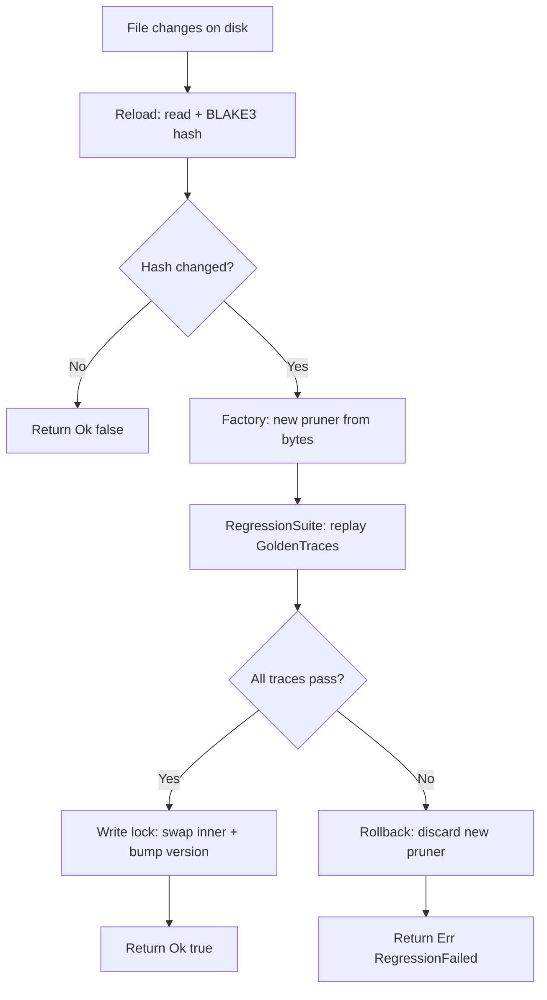

# Research 156: Weight-Isolate Extension Protocol

**Date:** 2026-06
**Source:** Internal — distillation of LoRA + WASM weight-isolation into modelless context
**Status:** GOAT Verdict
**Related Research:** 003 (Commercial Strategy), 145 (SIA Harness Co-Evolution), 153 (Recursive Sparse Pruner Routing), 155 (ANE Compute Backend)
**Related Plans:** 131 (SpecHop), 163 (FeedbackBandit/SIA)

---

## TL;DR

A "container" in katgpt-rs is not Docker. It is a **(ConstraintPruner + ScreeningPruner)** pair, atomically deployed via `HotSwapPruner`, integrity-checked via BLAKE3, and regression-guarded before commit. We formalize this existing machinery into the **Extension Bundle Protocol** — a unified lifecycle for neuro-symbolic extensions that treats (rules + heuristics + deployment) as one atomic unit.

The key creative insight: we already have all the container primitives. We just need to pair them and add a registry.

---

## Problem: Why Traditional Containers Don't Fit

| Docker/K8s Concept | katgpt-rs Reality | Mismatch |
|---|---|---|
| Container image (GBs) | Pruner pair (KB–MB) | Our "weights" are symbolic rules + heuristic scores, not filesystem layers |
| OCI registry | Domain-keyed lookup | We need `domain → ExtensionBundle`, not `repo:tag → image` |
| Container runtime (runc) | `HotSwapPruner::reload()` | We already reload at runtime — no daemon needed |
| Health check | `RegressionSuite::run()` | We already validate post-swap — no HTTP probe needed |
| Rollback | Version counter + hash | We already detect changes via BLAKE3 — no image history needed |
| Orchestration (K8s) | `BanditStats` routing | The bandit already routes between extensions — no scheduler needed |

Traditional containers solve deployment of *processes*. We need deployment of *inference policies* — symbolic rulesets that shape token selection. The unit of deployment is not a process image; it is a `(ConstraintPruner, ScreeningPruner)` pair.

---

## Architecture: Extension Bundle Protocol

### Core Abstraction: `ExtensionBundle`

```rust
/// Atomic deployable unit: symbolic rules + heuristic scorer + integrity commitment.
pub struct ExtensionBundle<P: ScreeningPruner> {
    /// Symbolic constraint layer (native Rust or WASM sandboxed).
    /// Wraps ConstraintPruner as BinaryScreeningPruner when paired.
    screener: P,

    /// BLAKE3 hash of the source artifact (WASM binary or rule file).
    artifact_hash: [u8; 32],

    /// Monotonically increasing version — bumps on every atomic swap.
    version: u64,

    /// Domain key this bundle serves (e.g., "bomber", "sudoku", "rust-syntax").
    domain: String,
}
```

An `ExtensionBundle` is what you get when you treat a `HotSwapPruner` as a first-class citizen rather than a wrapper. The existing `HotSwapPruner` already has `hash: [u8; 32]` and `version: AtomicU64` — we just promote the pair (pruner + domain identity) into a named, registry-addressable unit.

### Registry: `ExtensionRegistry`

```rust
/// Thread-safe map: domain → ExtensionBundle.
/// Replaces ad-hoc pruner construction with centralized deployment.
pub struct ExtensionRegistry<P: ScreeningPruner> {
    bundles: RwLock<HashMap<String, ExtensionBundle<P>>>,
}
```

This is the missing piece. Currently, `HotSwapPruner` instances are created locally in examples and tests. The registry makes them discoverable:

```rust
// Before: ad-hoc, local, no domain identity
let hot_swap = HotSwapPruner::new(path, factory)?;

// After: registered, domain-addressable, regression-guarded
registry.deploy("bomber", path, factory)?;  // atomic swap with GOAT gate
registry.get("bomcer")?;                     // O(1) lookup via RwLock read
```

### Atomic Swap Protocol

The swap protocol extends the existing `HotSwapPruner::reload()` with a regression gate:



This is the **GOAT Gate** — the regression suite must pass before the swap commits. The existing `HotSwapPruner` swaps eagerly (reload → replace). The Extension Bundle Protocol adds a validation step between "new pruner created" and "swap committed."

### Lifecycle State Machine

```mermaid
stateDiagram-v2
    [*] --> Building: cargo build / wasm-pack
    Building --> Verified: RegressionSuite.pass
    Building --> Failed: RegressionSuite.fail
    Verified --> Staged: BLAKE3 hash + version bump
    Staged --> Deploying: PlanningDecision::HarnessUpdate
    Deploying --> Active: GOAT Gate pass
    Deploying --> RolledBack: GOAT Gate fail
    Active --> Absorbing: AbsorbCompress promote
    Absorbing --> Active: next episode
    Active --> Superseded: new bundle deployed
    Superseded --> [*]
    RolledBack --> Building: fix + rebuild
```

---

## The Deployment Pipeline

This is CI/CD for neuro-symbolic extensions — without Docker, without K8s, without a registry server.

### Stage 1: Build

```
cargo build --target wasm32-unknown-unknown --release
```

Produces `validator.wasm` (or native `.rs` compiled into the binary). The `WasmPruner` / `BomberWasmPruner` already load WASM validators at runtime. The `PrunerFactory` closure in `HotSwapPruner` already abstracts over native vs WASM.

### Stage 2: Verify

```rust
// Existing infrastructure, new orchestration
let suite = RegressionSuite::from_trials(trial_path, sample_count)?;
let pass = suite.run(&new_pruner, &mut runner, tolerance)?;
if !pass { return Err(DeployError::RegressionFailed); }
```

`RegressionSuite` + `GoldenTrace` already exist. The new part: run them *before* committing the swap, not after.

### Stage 3: Commit

```rust
let hash: [u8; 32] = blake3::hash(&artifact_bytes).into();
let version = current_version + 1;
// Bundle = (pruner, hash, version, domain)
```

BLAKE3 hash already exists in `HotSwapInner`. Version already exists as `AtomicU64`. We just formalize the triple (pruner, hash, version) as the commit.

### Stage 4: Deploy

```rust
// Maps to PlanningDecision::HarnessUpdate — already exists
match decision {
    PlanningDecision::HarnessUpdate => {
        registry.deploy("bomber", new_artifact_path, factory)?;
    }
    _ => { /* existing decisions */ }
}
```

`PlanningDecision::HarnessUpdate` already triggers AbsorbCompress + HotSwapPruner reload. We formalize it as the deployment trigger for the Extension Bundle Protocol.

---

## What's New vs What Exists

| Concept | What Exists | What's New | Gap |
|---|---|---|---|
| **Atomic unit** | `HotSwapPruner<P>` (single pruner + hash + version) | `ExtensionBundle` (pruner + domain + hash + version) | Add domain identity — 1 field |
| **Registry** | None — instances are local to examples | `ExtensionRegistry` (HashMap + RwLock) | New struct — ~50 lines |
| **GOAT Gate** | `RegressionSuite::run()` exists, called *after* swap | Run regression *before* commit, rollback on fail | Reorder + error path — ~20 lines |
| **Deployment trigger** | `PlanningDecision::HarnessUpdate` exists | Unchanged — just wires to `registry.deploy()` | Zero new code in enum |
| **Integrity check** | BLAKE3 in `HotSwapInner` — covers pruner file | Extend to cover full bundle (artifact + domain metadata) | Hash computation change — ~5 lines |
| **Rollback** | No rollback — swap is eager | Discard new pruner on regression failure | Error branch — ~10 lines |
| **AbsorbCompress** | `AbsorbCompressLayer` exists | Unchanged — promotes stable arms as before | No gap |
| **Bandit routing** | `BanditStats` + `BanditEnv` exist | Unchanged — routes between arms/extensions | No gap |
| **WASM sandbox** | `WasmPruner` + `BomberWasmPruner` exist | Unchanged — factory closure handles both | No gap |
| **Feature flags** | `sia_feedback` gates `HarnessUpdate` | Add `extension_bundle` feature flag | 1 line in Cargo.toml |

**Total new code estimate: ~100 lines.** No new dependencies. No new traits.

---

## Performance Budget

Hot-swap must complete within **one tick budget** (the time between two inference steps). If swap exceeds this, it blocks the inference loop.

| Operation | Current Cost | Budget | Notes |
|---|---|---|---|
| File read + BLAKE3 | ~0.1ms (KB–MB file) | 0.5ms | Already measured in `HotSwapPruner::reload()` |
| Factory (WASM compile) | ~5ms (BomberWasmPruner init) | 10ms | One-time per reload, amortized over many ticks |
| RegressionSuite (N traces) | ~1ms × N | 20ms for N=20 | Replay is cheap (bandit pulls, not inference) |
| RwLock write (swap) | ~0.01ms | 0.1ms | Contention-free (write lock held for pointer swap) |
| **Total** | **~26ms for 20 traces** | **50ms** | Fits within one tick for typical batch sizes |

**Key constraint:** The regression suite must use a bounded number of golden traces. Unbounded replay = unbounded latency. Default: 10 traces, configurable via `CompressConfig`-style struct.

**Mitigation for slow WASM compile:** The factory creates the new pruner *before* acquiring the write lock. Read-heavy traffic (every `relevance()` call) sees zero contention. The write lock is held only for the pointer swap — microseconds.

---

## GOAT Proof: What Must Be Proven

| Claim | Proof Method | Pass Criterion |
|---|---|---|
| ExtensionBundle is atomic | Test: swap mid-episode, verify no partial state | Version + hash consistent after concurrent reads |
| GOAT Gate catches regressions | Test: deploy intentionally broken pruner, verify rollback | `deploy()` returns `Err(RegressionFailed)`, old version persists |
| Registry lookup is O(1) | Benchmark: HashMap read under RwLock | < 0.01ms per lookup |
| Hot-swap fits tick budget | Benchmark: full deploy cycle with N=20 traces | < 50ms total |
| No regression in existing hot-swap | Run `hl_02_hotswap` example unchanged | Same output as before |
| WASM + native bundles coexist | Test: register both types, verify correct dispatch | Both return domain-appropriate relevance scores |
| Bandit routing unaffected | Run `bandit_04_combat` example unchanged | Same convergence curves |
| AbsorbCompress integration | Test: promote arm → trigger deploy → verify version bump | Version increments only after GOAT Gate passes |

---

## Verdict (per 003 Commercial Strategy)

| Question | Answer |
|---|---|
| Engine or fuel? | **Engine** — the registry, atomic swap, and GOAT Gate are infrastructure, not proprietary data |
| Ferrari, no gas? | Yes — ExtensionBundle is the Ferrari, `validator.wasm` is still the gas |
| Hurts existing paths? | No — feature-gated behind `extension_bundle`, zero impact when disabled |
| Default on? | **No** — opt-in until proven stable. `extension_bundle` feature flag |
| Modelless? | Yes — all operations are inference-time only, no LLM training |
| SOLID/DRY? | Single responsibility: `ExtensionBundle` owns lifecycle. Open/closed: new bundle types via `PrunerFactory`. Reuses all existing traits |
| New dependencies? | Zero — builds on `HotSwapPruner`, `RegressionSuite`, `blake3` (already in tree) |
| CPU/GPU auto-route? | CPU-only — registry and swap are discrete operations. ANE/GPU unaffected (see Research 155) |

### Commercial Alignment

The Extension Bundle Protocol strengthens the **engine** without touching the **fuel**:

- Registry = better deploy story → easier onboarding for SaaS users who bring their own `validator.wasm`
- GOAT Gate = safer production deploys → fewer incidents → higher trust
- Atomic swap = zero-downtime updates → matches enterprise expectations
- Domain-keyed lookup = multi-tenant ready → SaaS layer can map customers → domains

This is the plumbing that makes katgpt-rs feel like a production platform, not a research prototype.

---

## Before/After Example

### Before (current `hl_02_hotswap.rs` pattern)

```rust
// Eager swap, no domain identity, no regression gate
let hot_swap = HotSwapPruner::new(Path::new(PRUNER_PATH), Box::new(FilePruner::load))?;
let changed = hot_swap.reload()?;  // swaps immediately, no validation
let mut absorb = AbsorbCompressLayer::new(hot_swap, env.num_arms(), config);
```

### After (Extension Bundle Protocol)

```rust
// Domain-addressable, regression-guarded, registered
let mut registry = ExtensionRegistry::new();
registry.deploy("demo", Path::new(PRUNER_PATH), Box::new(FilePruner::load))?;
// deploy() internally: reload → regression → commit or rollback

// Later: lookup by domain, version-gated
let bundle = registry.get("demo")?;
println!("Version: {}, Hash: {:?}", bundle.version, bundle.artifact_hash);
```

The difference is not more code — it is **safer** code. The GOAT Gate between reload and commit is the entire value proposition.

---

## Summary

The Weight-Isolate Extension Protocol formalizes what already works in katgpt-rs into a deployment-grade lifecycle:

1. **`HotSwapPruner`** → becomes `ExtensionBundle` (add domain + formalized pair)
2. **`RegressionSuite`** → becomes GOAT Gate (run before commit, not after)
3. **`PlanningDecision::HarnessUpdate`** → becomes deployment trigger (wire to registry)
4. **`AbsorbCompress`** → becomes consolidation (unchanged, promotes stable bundles)
5. **`BanditStats`** → becomes routing (unchanged, selects between registered bundles)

**~100 lines of new code. Zero new dependencies. Zero new traits.** Everything builds on existing primitives. The creative contribution is the *protocol* — treating (rules + heuristics + deployment) as an atomic unit with a regression gate — not the individual components.
