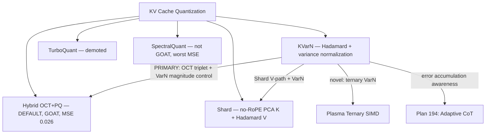

# Research 159: KVarN — Variance-Normalized KV-Cache Quantization

**Paper:** [arXiv:2606.03458](https://arxiv.org/abs/2606.03458) — Müller, Bich, Boretti, Chang, Zhuang, Cavigelli (Huawei), Jun 2026
**Code:** `.raw/KVarN/` (vLLM implementation, Python + Triton)
**Related:** Research 20 (TurboQuant), 39 (SpectralQuant), 63 (OCTOPUS), 65 (RotorQuant), 81 (Asymmetric K/V), 109 (Shard), 194 (Adaptive CoT)
**Date:** 2026-06-04

---

## TL;DR

KVarN identifies that **token magnitude errors** (not directional errors) drive outlier degradation in KV-cache quantization, and that these outliers contribute disproportionally to end-to-end quality despite being a small fraction of MSE. The fix: **Hadamard rotation + iterative log-domain variance normalization (Sinkhorn-style dual-scaling)** on 128-token tiles. At 2-bit (2.3 bits/elem with overhead), KVarN matches or beats all baselines on AIME24, MATH500, HumanEval, IFEval — with only **0.18% quantization overhead** and **≤1.4% dequant overhead**.

**The key insight for us:** KVarN targets the *autoregressive decoding regime* (test-time scaling / reasoning), where KV-cache errors accumulate across timesteps. Our existing stack (TurboQuant, SpectralQuant, Shard) was evaluated mostly in the *prefill regime*. KVarN's error-accumulation analysis and pseudo-decode evaluation methodology are as valuable as the method itself.

---

## 1. Paper Core Findings

### 1.1 Magnitude vs Directional Error Decomposition

For quantized key vector K and dequantized Kdq:

```
||K - Kdq||² = (||K|| - ||Kdq||)² + 2||K||·||Kdq||(1 - cos θ)
                  \___ EM ___/         \________ ED ________/
                  magnitude error       directional error
```

**Finding:** Top 5% largest errors are **overwhelmingly magnitude errors** (EM/ET > 80%). These outlier tokens get their norm wrong, which causes attention score blowups through softmax.

### 1.2 Outlier Dominance

Fixing only the top 5% outlier errors improves end-to-end KL-divergence more than fixing the other 95% — even though the bottom 95% contribute more total MSE. This means:

- **MSE is the wrong metric** for KV-cache quantization quality
- **Outlier suppression** is the right objective
- Standard per-channel or per-token scaling (KIVI) doesn't control outliers

### 1.3 Error Accumulation in Autoregressive Decoding

During test-time scaling (reasoning, CoT), KV-cache is quantized on-the-fly as tokens are generated. Errors from timestep t affect the K/V produced at t+1, compounding through layers and time. KVarN specifically targets this regime.

**Pseudo-decode evaluation:** Split sequence into blocks of 128 tokens. After each block, quantize KV-cache. Subsequent blocks operate on quantized cache. This models real decoding behavior — and shows KVarN's advantage *grows with context length*.

### 1.4 KVarN Method

Pipeline per 128-token tile:

1. **Hadamard rotation** in channel dimension (absorbed into W_K, W_V weights — zero runtime cost after absorption)
2. **Variance normalization** via iterative Sinkhorn-style dual-scaling:
   - Alternate: normalize column std-devs, then row std-devs
   - In log space: `log_s += clamp(log(σ), -0.3, 10.0)`
   - Track best-so-far (lowest imbalance across iterations)
   - 8–16 iterations sufficient
3. **Asymmetric RTN** (round-to-nearest) with dual scales:
   - K: per-channel (RTN scale + Sinkhorn absorbed) × per-token scale
   - V: per-token (RTN scale + Sinkhorn absorbed) × per-channel scale

**Result:** Variance normalization prevents the rounding process from scaling the norm of worst-case tokens. Hadamard equalizes channel outliers. Together, they synergistically suppress magnitude errors.

---

## 2. GOAT Verdict (per Verdict 003)

### 2.1 Direct Fit Assessment

| Aspect | KVarN | Our Stack | Gap |
|--------|-------|-----------|-----|
| Rotation | Hadamard (absorbed) | ✅ 2D Givens (OCT+PQ default, 256 FMAs) | Ours is better |
| Variance normalization | ✅ Novel Sinkhorn dual-scaling | ❌ We don't have this | **Missing** |
| Error accumulation analysis | ✅ Pseudo-decode eval | ❌ We test prefill only | **Missing** |
| Token magnitude control | ✅ Directly addressed | ❌ Implicit only | **Missing** |
| 2-bit quality | SOTA on reasoning benchmarks | ~5% worse | **Gap** |

### 2.2 Fusion Opportunities (Creative, Not Direct Mapping)

KVarN's variance normalization is **orthogonal** to all our rotation methods. The primary fusion target is our GOAT default:

1. **Hybrid OCT+PQ + KVarN VarN (PRIMARY FUSION):** Our default KV codec already uses OCT triplet encoding + PlanarQuant 2D Givens rotation (MSE 0.026, 256 FMAs, zero calibration). KVarN's variance normalization stacks directly on top — after Givens rotation, before RTN quantization. This gives us the token-magnitude error control that OCT+PQ lacks. OCT handles coordinate-level encoding, VarN handles tile-level magnitude equalization. Complementary, not competing.

2. **Shard + KVarN VarN (ASYMMETRIC FUSION):** Shard's no-RoPE PCA for K + Hadamard for V achieves 10× compression but doesn't address token-magnitude errors during decode streaming. Adding VarN to Shard's V-path (Hadamard → VarN → Lloyd-Max) would fix the accumulation that Shard's PCA doesn't address (Shard compresses across rank, not token dimension).

3. **Plasma ternary + KVarN VarN (NOVEL COMBINATION):** Our Plasma path stores weights in ternary (1.58 bits/weight). KVarN's variance normalization concept — equalizing row/column variance before quantization — applied to **ternary KV cache** would be novel: ternary at 1.58 bits/elem with variance-normalized magnitude control.

4. **Adaptive CoT × Error Accumulation (COUPLING):** Plan 194 (Adaptive CoT) decides when to think. KVarN shows that thinking (long sequences) causes KV-cache error accumulation. The adaptive CoT controller should **factor in KV-cache compression quality** — when compression is lossy, long thinking chains accumulate more error, so the optimal thinking budget depends on the compression method. This is a novel coupling.

**NOT pursued:** SpectralQuant fusion — worst MSE (0.038), needs 256-sample calibration, not GOAT. Polishing a loser.

### 2.3 Modelless First Assessment

**KVarN is 100% modelless.** It requires:
- No training data (calibration-free)
- No model weights (uses Hadamard rotation, absorbed into existing W_K/W_V)
- No LLM forward pass for calibration (unlike SpectralQuant's PCA)
- Pure inference-time transformation

**Perfect fit for katgpt-rs MIT engine.**

### 2.4 Commercial Strategy Alignment (Verdict 003)

| Layer | Component | License | Why |
|-------|-----------|---------|-----|
| Engine (MIT) | Hadamard rotation, variance normalization algorithm, dual-scaling dequant | MIT | Core inference plumbing — per Verdict 003, engine is open |
| Engine (MIT) | Pseudo-decode evaluation methodology | MIT | Testing infrastructure |
| Engine (MIT) | Ternary+VarN fusion (if we build it) | MIT | New quantization method |
| Fuel (SaaS) | SpectralQuant+KVarN fusion calibration data | Private | Requires model-specific calibration |
| Fuel (SaaS) | Adaptive CoT × KV-quality coupling | Private | Requires model-specific tuning |

### 2.5 Verdict: 🟢 **GAIN — Must Implement**

**Why gain:**
1. Fills a real gap: we have no error-accumulation-aware KV-cache quantizer
2. 100% modelless — pure inference-time
3. Orthogonal to existing methods — composable, not competing
4. Novel fusion opportunities with Plasma ternary and SpectralQuant
5. The pseudo-decode eval methodology alone is worth implementing

**Why no perf hurt:**
1. Quantization overhead: 0.18% (1.9ms per 128 tokens on Qwen3-4B)
2. Dequantization overhead: ≤1.4% over single-scale RTN
3. Variance normalization is O(R×C×K) where K=8 iterations — negligible vs attention
4. No GPU kernel changes needed for CPU path — just SIMD f32 ops

**Default-on candidate after GOAT proof.**

---

## 3. Relationship to Existing Stack



### Key Differences from Our Methods

| Feature | Hybrid OCT+PQ ⭐ | Shard | KVarN | TurboQuant (demoted) | SpectralQuant (not GOAT) |
|---------|-------------------|-------|-------|---------------------|------------------------|
| Rotation | 2D Givens | PCA (K) / Hadamard (V) | Hadamard (absorbed) | Random | Eigenbasis |
| Calibration | **None** | Prefill SVD | **None** | None | 256 samples |
| MSE (3-bit) | **0.026** | — | — | 0.034 | 0.038 |
| FMAs (d=128) | **256** | — | ~0 (absorbed) | 16,384 | 16,384 |
| Magnitude control | None | Rank truncation | **Sinkhorn dual-scaling** | Per-norm | Water-fill |
| Error accumulation | Not evaluated | Not evaluated | **Directly targeted** | Not evaluated | Not evaluated |
| Bits/elem | 3 | 0.75 (K), 2 (V) | **2.3** | 3–4.6 | ~3 |
| Dequant overhead | OCT triplet lookup | PCA reconstruct | **1 FMA + 1 mul** | Codebook lookup | Codebook lookup |

---

## 4. Key Algorithms for Rust Implementation

### 4.1 Variance Normalization (Sinkhorn-style)

```
Input: tile [R, C], iterations K=8
Output: balanced tile, s_col [1,C], s_row [R,1]

log_s_col = zeros(C)
log_s_row = zeros(R)
cur = tile / exp(log_s_col) / exp(log_s_row)
imb_best = imbalance(cur)  // max(col_stds)/min(col_stds) + max(row_stds)/min(row_stds)
s_col_best = ones(C)
s_row_best = ones(R)

for k in 0..K:
    col_stds = std(cur, dim=0)  // [C]
    log_s_col = clamp(log_s_col + clamp(log(col_stds), -0.3, 10.0), -0.3, 10.0)
    cur = tile / exp(log_s_col) / exp(log_s_row)

    row_stds = std(cur, dim=1)  // [R]
    log_s_row = clamp(log_s_row + clamp(log(row_stds), -0.3, 10.0), -0.3, 10.0)
    cur = tile / exp(log_s_col) / exp(log_s_row)

    imb_cur = imbalance(cur)
    if imb_cur <= imb_best:
        imb_best = imb_cur
        s_col_best = exp(log_s_col)
        s_row_best = exp(log_s_row)

return tile / s_col_best / s_row_best, s_col_best, s_row_best
```

### 4.2 Hadamard Transform (Power-of-2)

Already implemented in `shard_kv/kv_cache.rs::hadamard_transform_inplace()`. KVarN uses the same Walsh-Hadamard transform. Can reuse directly.

### 4.3 Dual-Scale Dequantization

```rust
// K tile: [D, group] — rows=channels, cols=tokens
// Reconstruction: x[ch][tok] = (q[ch][tok] * s_col_absorbed[ch] + zp_absorbed[ch]) * s_row[tok]

// V tile: [group, D] — rows=tokens, cols=channels
// Reconstruction: x[tok][ch] = (q[tok][ch] * s_row_absorbed[tok] + zp_absorbed[tok]) * s_col[ch]
```

One extra multiply vs standard RTN — trivial SIMD fusion.

---

## 5. What We Should Build

### Phase 1: Core KVarN in katgpt-rs (modelless)
- Variance normalization (SIMD f32, no allocations)
- KVarN KV-cache struct (dual-scale storage)
- Pseudo-decode evaluation harness
- GOAT proof: KVarN vs TurboQuant vs Shard on error accumulation

### Phase 2: Fusion experiments
- **Hybrid OCT+PQ + KVarN VarN** (PRIMARY — GOAT default + VarN magnitude control)
- Shard K-path + KVarN VarN (asymmetric codec + variance normalization)
- Plasma ternary + KVarN VarN (ternary quantize on variance-normalized tiles)

### Phase 3: Adaptive CoT coupling
- KV-cache quality metric exposed to ThinkingController
- Longer thinking chains auto-reduce when compression is lossy
- Bandit learns per-method quality decay over sequence length

### Phase 4: riir-ai integration (model-based)
- GPU Triton/WGSL kernels for fused variance-normalize + quantize
- Fused attention on variance-normalized tiles (skip dequant for inner products)
- Training-aware: LoRA adapter quality under KVarN-compressed KV cache
