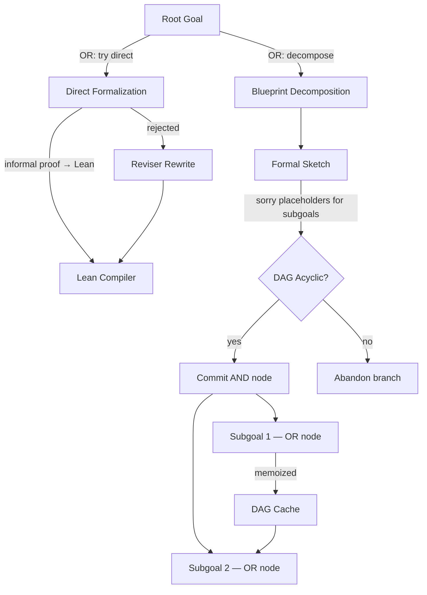

# Research 170: LEAP — Blueprint-Driven AND-OR DAG Proof Search

> **Paper:** [LEAP: Supercharging LLMs for Formal Mathematics with Agentic Frameworks](https://arxiv.org/pdf/2606.03303) — Kung et al. (Google Cloud AI Research / Google DeepMind), June 2026
> **Date:** 2026-06, distilled 2026-06-05
> **Related Research:** 088/104 (AlphaProof Nexus), 093 (Committee Search), 012 (TRT), 079 (EqR), 076 (SR²AM), 094 (Parallel Probe), 037 (REAP)
> **Related Plans:** 128 (Proof Sketch Evolution ✅), 189 (MUSE Skill Evolution), 194 (Adaptive CoT ✅ in riir-ai)

---

## TL;DR

General-purpose LLMs (no specialized training) achieve 100% on Putnam 2025 and 70% on Lean-IMO-Bench via structured scaffolding: AND-OR DAG with hierarchical memoization, interleaved informal-formal planning (blueprint→formal), and verification-guided proof search with LLM reviewer. **The bottleneck is NOT model capability but structured iterative interaction with the proof environment.**

## Key Insight for Our Stack

LEAP validates our **modelless-first** architecture at the most fundamental level. Our DDTree + ConstraintPruner + ScreeningPruner + SpeculativeVerifier stack IS the same three-layer progression:
- LEAP's AND nodes = our `ConstraintPruner` (all children must pass)
- LEAP's OR nodes = our DDTree branches (any path can win)
- LEAP's Lean compiler = our `SpeculativeVerifier` (accept/reject)
- LEAP's LLM reviewer = our `ScreeningPruner` (graded quality signal)
- LEAP's DAG memoization = our `ProofGoalCache` (Plan 128 ✅)

**What LEAP adds that we DON'T have yet:**
1. **Hierarchical subgoal decomposition** — AND-OR tree that decomposes goals into subgoals recursively
2. **Blueprint→formal pipeline** — informal planning space before formal verification
3. **Decomposition quality reviewer** — reject unproductive decompositions early (prevents search collapse)

---

## Paper Summary

### Architecture: AND-OR DAG



### Three Key Mechanisms

1. **Hierarchical Memoization via DAG** — Once a goal is decomposed, the DAG preserves the dependency structure. Shared lemmas cached across branches. Anticipatory lemma planning (propose lemmas for future use). Two properties: monotone refinement (stable dependencies) + lemma memoization (shared subproblems).

2. **Interleaved Informal-Formal Planning** — LLM generates informal blueprint (natural language strategy), translates to formal proof sketch (Lean code with `sorry` for subgoals). The informal sketch provides a planning space before formalization, making proof construction less brittle.

3. **Verification-Guided Proof Search** — Two levels: Lean compiler (formal type-correctness) + LLM reviewer (decomposition quality). The reviewer catches "unproductive decompositions" where the subgoal is no simpler than the parent (Figure 3: cyclic subgoal ≡ grandparent goal). Without reviewer, agent exhausts search budget on dead-end branches.

### Key Results

| Benchmark | Method | Result |
|-----------|--------|--------|
| Putnam 2025 | Gemini-3.1-pro one-shot | 0/12 (0%) |
| Putnam 2025 | Goedel-Prover-V2-32B | 0/12 (0%) |
| Putnam 2025 | Hilbert (agentic) | 4/12 (33%) |
| Putnam 2025 | Aristotle (specialized) | 9/12 (75%) |
| **Putnam 2025** | **LEAP (general LLM)** | **12/12 (100%)** |
| Lean-IMO-Bench Basic | Gemini-3.1-pro one-shot | 20% |
| Lean-IMO-Bench Basic | Aristotle | 76.7% |
| **Lean-IMO-Bench Basic** | **LEAP** | **83.3%** |
| Lean-IMO-Bench Advanced | Gemini-3.1-pro one-shot | 3.3% |
| **Lean-IMO-Bench Advanced** | **LEAP** | **56.7%** |

### Critical Ablations

| Ablation | Basic | Advanced | Δ |
|----------|-------|----------|---|
| Full LEAP (DAG) | 83.3% | 56.7% | baseline |
| w/o DAG (naive tree) | 73.3% | 40.0% | -10/-16.7 |
| w/o LLM reviewer | Failed even after 8 rollouts on A5 | — | critical |
| One-shot vs iterative | 20% → 36.6% (Gemini) | — | +83% |

---

## Fusion Ideas — Beyond Direct Mapping

### Fusion 1: AND-OR DDTree — Subgoal Decomposition for Speculative Decode (modelless)

**Current:** DDTree builds flat best-first tree over token marginals. No subgoal concept.
**LEAP insight:** Decompose the generation task into subgoals (phrases, expressions, statements).
**Our twist:** Use `ScreeningPruner::relevance()` as the "informal blueprint" signal. High relevance = confident subgoal (direct). Low relevance = decompose further (split into simpler sub-trees).

```text
DDTree today:    ROOT → expand best-first → flat tree → extract path
AND-OR DDTree:   ROOT → check relevance → high: direct prove
                                           low: decompose into AND subgoals
                                                 → each subgoal is OR (try alternatives)
                                                 → memoize solved subgoals in ProofGoalCache
```

**Gain:** For complex generation tasks (long code, multi-step reasoning), hierarchical decomposition avoids exponential search by solving subproblems independently and memoizing. Expected: fewer DDTree nodes explored for same quality, because subgoal solutions are reusable.

### Fusion 2: Blueprint-Driven Constraint Pruning (modelless)

**Current:** `ConstraintPruner::is_valid()` is binary — token valid or not.
**LEAP insight:** Generate informal plan first, then verify against plan.
**Our twist:** Add a `BlueprintPruner` that accepts a "plan" (sequence of expected constraint types) and grades tokens against the plan. The plan is generated cheaply (argmax without tree search), then used to guide the expensive DDTree search.

```text
1. Cheap pass: argmax generation → sequence of constraint types (the "blueprint")
2. Expensive pass: DDTree search pruned by blueprint compatibility
   - Tokens compatible with blueprint → high priority
   - Tokens incompatible → deprioritized (not rejected, just lower priority)
```

**Gain:** Blueprint-compatible tokens are explored first, reducing effective search space. Like LEAP's informal-formal pipeline but for token generation.

### Fusion 3: Decomposition Quality Reviewer (modelless)

**Current:** No mechanism to detect unproductive DDTree branches early.
**LEAP insight:** LLM reviewer rejects decompositions that don't simplify the problem.
**Our twist:** `DecompositionReviewer` — a lightweight entropy-based check that detects when a DDTree branch is "spinning its wheels" (visiting similar states without progress). Use the `ProofGoalCache` hit rate as a progress signal: if cache hit rate is high for a branch, it's revisiting known states → unproductive → prune.

```text
ProgressSignal = 1 - (cache_hit_rate_for_branch)
High ProgressSignal → branch is exploring new territory → keep
Low ProgressSignal → branch is revisiting known states → prune
```

**Gain:** Prevents search collapse on dead-end branches. Directly from LEAP's Figure 3 ablation (without reviewer, agent fails on hardest problems).

### Fusion 4: Self-Learning Adaptive CoT with DAG Decomposition (modelless → model-based bridge)

**Current (Plan 194 ✅):** Bandit learns when to think (direct vs latent reasoning).
**LEAP enhancement:** When thinking IS activated, decompose the thinking into AND-OR subgoals. Instead of one monolithic RiM reasoning pass, break it into sub-problems solved independently with memoization.

```text
Adaptive CoT today:     Query → Bandit → think=true → RiM workspace → answer
With LEAP enhancement:  Query → Bandit → think=true → decompose into subgoals
                          → solve each subgoal (with ProofGoalCache memoization)
                          → combine results → answer
                          → persist solved subgoals for future queries
```

**Gain:** Thinking becomes more structured and reusable. Past reasoning effort is memoized, so similar queries benefit from cached subgoal solutions. Expected: reduced thinking cost on repeated query patterns.

---

## GOAT Verdict

| Fusion | Modelless? | Gain | Perf Risk | Verdict |
|--------|-----------|------|-----------|---------|
| AND-OR DDTree | ✅ Yes | Subgoal reuse reduces nodes explored | Low (additive) | 🟡 Opt-in, GOAT gate |
| Blueprint Pruner | ✅ Yes | Faster convergence via plan-guided search | Low (cheap pre-pass) | 🟡 Opt-in, GOAT gate |
| Decomposition Reviewer | ✅ Yes | Prevents dead-end search, frees budget | Negligible | 🟢 Default-on if GOAT |
| Adaptive CoT + DAG | ✅ Modelless bridge | Cached reasoning across queries | Low (freeze/thaw) | 🟡 Opt-in, extends Plan 194 |

**Overall verdict:** LEAP's insights are **highly complementary** to our existing stack. Plan 128 (ProofGoalCache) already provides 60% of the infrastructure. The missing 40% is:
1. AND-OR tree structure (not just flat DDTree)
2. Blueprint pre-pass (informal plan → guide formal search)
3. Decomposition quality signal (detect unproductive branches)

These are **modelless, inference-time only** enhancements. No LLM training required. Per Verdict 003, this lands in the MIT engine.

---

## Cross-Reference with Existing Stack

| LEAP Component | Our Equivalent | Status | Gap |
|----------------|---------------|--------|-----|
| AND-OR DAG | DDTree + ProofGoalCache | DDTree ✅, Cache ✅ | No AND-OR tree type |
| Hierarchical memoization | ProofGoalCache (blake3) | ✅ Plan 128 | No subgoal decomposition |
| Informal blueprint | ScreeningPruner::relevance() | ✅ | No explicit plan generation |
| Formal sketch (Lean) | ConstraintPruner::is_valid() | ✅ | — |
| LLM reviewer | BtRank + ScreeningPruner | ✅ | No decomposition quality check |
| Compiler feedback | CompilerFeedback (SynPruner) | ✅ | — |
| DAG acyclicity check | — | ❌ | Needed for AND-OR |
| Anticipatory lemma planning | — | ❌ | Nice-to-have |

---

## What NOT to Take

1. **Lean-specific formal verification** — We're not a theorem prover. The Lean integration is irrelevant. The architecture patterns are what matter.
2. **Specialized prover models** — LEAP proves general models suffice. We don't need training.
3. **Hilbert's recursive search** — O((n·b)^d) exponential. Our best-first DDTree is already better.
4. **Full auto-formalization pipeline** — We have SynPruner + CompilerFeedback. No need for Lean statement generation.

---

## TL;DR

LEAP proves that general-purpose LLMs + structured scaffolding (AND-OR DAG, blueprint→formal, verification-guided search) beats specialized models on formal theorem proving. Our stack already has 60-70% of this via Plan 128 + ScreeningPruner + DDTree. The actionable gap is: (1) AND-OR subgoal decomposition in DDTree, (2) blueprint pre-pass for guided search, (3) decomposition quality reviewer to prevent search collapse. All modelless, all inference-time, all land in MIT engine. Create Plan 190 to implement.
