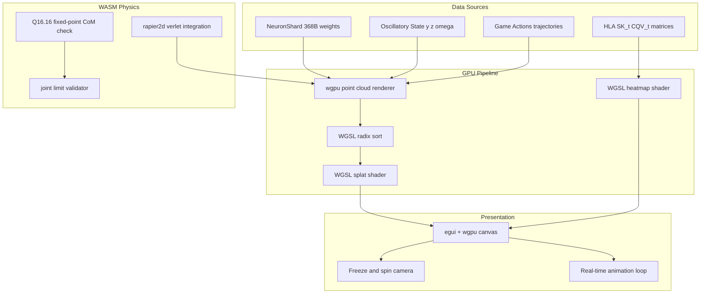

# Research 174: Neuro-Geometric Viz + Physics Playground — Visionary × Oscillatory State-Space Fusion

**Date:** 2026-06
**Source:** Visionary (Gaussian Splatting Platform) + Research 169 (Oscillatory State-Space) + Goodfire Geometric Calculator
**Status:** Research — Creative Fusion

---

## TL;DR

Three separate research threads converge into one playground:
1. **Visionary** teaches: wgpu compute shaders + point cloud rendering is proven at scale
2. **Goodfire** proves: neural geometry viz (circles, manifolds, Fourier features) IS the research presentation
3. **Research 169** (Oscillatory State-Space): eigenvalues on imaginary axis = undamped physics, directly maps to pendulum/bipedal dynamics

Fusion: **render our NeuronShard weights as animated 3D point clouds**, visualize HLA oscillatory dynamics as heatmaps/trajectories, and build a **physics playground** where point clouds fall with real WASM physics. Feature-gated, research mode, proof it works first even if slow.

---

## Why This IS Our Domain

I was wrong in Research 173 to dismiss the visual component. Here's why:

### 1. Goodfire Proves Viz IS Research

Goodfire's "Geometric Calculator Inside a Neural Network" isn't a toy — it's a **discovery tool**. They found Llama's addition module by visualizing Fourier features on circles. Their neuron explorer heatmap shows individual neuron firing patterns across tasks.

**What we have that Goodfire doesn't:** NeuronShard (368-byte `repr(C)` weight blobs), HLA second-moment matrices, five-tier memory, oscillatory state dynamics. Our neuron data is richer than anything Goodfire visualizes. We just can't see it in 3D yet.

### 2. Our Existing Viz is 2D (egui paint)

`riir-viz` has:
- `ShardExplorer` — 8×8 style_weights heat map (egui paint)
- `ManifoldView` — pseudo-3D isometric gradient (egui paint, no GPU shaders)
- `CuriosityPulseView` — NPC curiosity state
- `ChainApp` — LatCal balance viz

**All 2D. All CPU-painted.** No GPU rendering. No point clouds. No 3D rotation. No animation.

The ManifoldView is already trying to be 3D (isometric layers) but constrained by egui's 2D canvas. Visionary shows the architecture for real 3D: wgpu compute shaders + point cloud rendering.

### 3. We Already Have wgpu Infrastructure

`riir-gpu` has:
- **60+ WGSL kernels** (matmul, attention, spectral quant, etc.)
- **wgpu 29** dependency
- **bytemuck** for zero-copy GPU buffer writes
- **CubeCL** for JIT kernel compilation

We're not starting from zero. We have the GPU pipeline. We just need to write rendering kernels instead of training kernels.

### 4. Research 169 Is Literally Physics

The LinOSS cell IS a forced harmonic oscillator:
```
dy/dt = z                    (velocity)
dz/dt = -A·y + B·s(t)        (acceleration = spring + forcing)
```

This IS Newton's second law. The paper proves it solves physical PDEs 219-71,100× better than baselines. If we viz this oscillatory state space, we're visualizing **physics dynamics** — pendulums, springs, bipedal walking patterns.

The connection to bipedal locomotion is direct: walking IS an oscillatory dynamical system (inverted pendulum model). The HLA second-moment matrix $SK_t$ tracking covariances in activation space IS tracking physical momentum when applied to joint states.

---

## Architecture: Three Layers



### Layer 1: Point Cloud Renderer (from Visionary)

**What Visionary teaches us:**
- WGSL radix sort for depth ordering (they have a complete implementation)
- GPU buffer pipeline: data → staging → compute → render, zero CPU round-trip
- Ping-pong buffers for sorting
- Subgroup size detection for optimal workgroup configuration

**Our adaptation:**
- Instead of Gaussian splatting attributes, we render NeuronShard weight vectors as 3D points
- Position = first 3 PCA dimensions of `style_weights[64]` or `hla_moments[8]`
- Color = activation intensity (heat map: blue→red)
- Size = weight magnitude
- Animation = HLA state evolution over time (each frame updates point positions)

**Landing:** `riir-viz` gains wgpu rendering context alongside existing egui. No new crate needed — `riir-viz` already depends on `eframe` which supports wgpu paint callbacks.

### Layer 2: Oscillatory Dynamics Visualization (from Research 169)

**What Research 169 gives us:**
- LinOSS cell: forced harmonic oscillator with learned frequencies
- Modal factorization: decouple spatial (fixed) from temporal (learned modes)
- Parallel scan for O(log N) rollout

**Our adaptation:**
- Render the oscillatory state $(y, z, \omega)$ as animated 3D trajectories
- Each point in the cloud follows $\ddot{y} = -A \cdot y + B \cdot s(t)$ — springs and forcing
- Color encodes which frequency mode dominates (low = blue, high = red)
- The "falling point cloud" visualization: initialize points at HLA state, let them evolve under oscillatory dynamics + gravity, freeze camera to spin around

**This IS the physics playground.** The oscillatory state IS physics. When we add gravity (constant forcing term), points fall. When we add joint constraints (WASM validator), they become bipedal limbs.

### Layer 3: WASM Physics Validation (existing infrastructure)

**What we already have:**
- `riir-wasm` with `WasmPruner` runtime
- `riir-validator-sdk` with `Validator` trait
- Q16.16 fixed-point math in WASM
- Batch API for amortized validation
- Fuel budgeting to prevent infinite loops

**What we add:**
- `rapier2d` compiled to WASM as a physics validator
- `is_valid()` checks center-of-mass support polygon, joint limits, velocity bounds
- For bipedal: hip/knee/ankle joint chains with torque inputs

---

## What We Build — Concrete Deliverables

### NOW

#### D1: ManifoldView 3D + Neuron Cloud

Replace `ManifoldView`'s 2D egui paint with real wgpu 3D rendering. Same data (bedrock/atmosphere/surface), real perspective projection, orbit camera. Add NeuronShard point cloud overlay.

See **Plan 219** for implementation tasks.

#### D2: HLA Heatmap Overlay

Floating texture plane in 3D scene showing SK_t covariance matrix as blue→red gradient. Debug capability for attention state evolution.

#### D3: Box Falling (Simple Physics Proof)

One cube, gravity, floor collision, bounce. CPU Euler integration, no WASM needed. Proves: 3D scene + animation + physics in one loop.

### DEFER

| Item | Why | Revisit When |
|---|---|---|
| Newton's 2nd law spring/forcing viz | Need 3D foundation first | Plan 219 Phase 1 stable |
| Full gravity playground (all points) | Per-point physics loop | Box physics proven |
| Joint constraints / bipedal | Needs rapier2d WASM | Box + WASM physics proven |
| rapier2d WASM eval | Compilation unknown | Custom physics insufficient |
| LinOSS bipedal controller | DDTree + physics integration | Plan 193 done |
| SDPG × RapierWASM | Training loop needed | LoRA pipeline ready |

### D1 (Original): Neuron Cloud — Real-Time Weight Manifold Renderer

```
Input:  NeuronShard array (N × 368 bytes)
        ↓ PCA projection (3 dims)
Output: wgpu point cloud, depth-sorted, camera-rotatable

Controls:
  - Mouse drag: orbit camera
  - Scroll: zoom
  - Color mode: activation / zone_hash / hla_moment / frequency
  - Animation: HLA state evolution (play/pause/scrub)
```

**Why cool:** Like Goodfire's neuron explorer but in 3D with our actual weight data. Researchers can SEE which shards cluster, which drift, which are anomalous.

### D2 (Original): HLA Heatmap — Oscillatory Attention State Gradient

```
Input:  SK_t (d×d symmetric matrix) per layer
        ↓ flatten upper triangle → texture
Output: wgpu texture rendered as 2D gradient overlay

Controls:
  - Layer selector
  - Time scrubber (evolution over tokens)
  - Overlay on point cloud or standalone
```

**Why cool:** Shows which attention dimensions co-vary. The "thinking" visualization — you can SEE the model's attention structure shift as it processes tokens.

### D3 (Original): Physics Playground — Point Cloud with Real Gravity — **DEFERRED**

```
Input:  Point positions from D1/D2
        ↓ rapier2d WASM integration step
Output: Points fall, bounce, collide under real physics

Controls:
  - Toggle gravity on/off
  - Adjust restitution (bounciness)
  - Freeze: stop physics, free-spin camera
  - Add force: click to push points
```

**Why cool:** "Make the point cloud fall to the ground with real physics." It's the "wow" demo. **DEFERRED** — start with single box falling (Plan 219 Phase 4).

### D4 (Original): Bipedal Concept — LinOSS + RapierWASM + DDTree — **DEFERRED**

```
Input:  Joint state (hip, knee, ankle angles + velocities)
        ↓ LinOSS oscillatory evolution (2nd order ODE)
        ↓ DDTree candidate torque branches
        ↓ RapierWASM is_valid() constraint check
Output: Animated 2D biped walking/falling

Controls:
  - Toggle WASM physics constraint
  - Visualize: CoM support polygon overlay
  - DDTree depth: 1 (direct) vs 4 (multi-hop planning)
  - Oscillatory mode: LinOSS vs standard attention
```

**Why cool:** Proves the neuro-symbolic physics concept. **DEFERRED** — needs Plan 219 stable + Plan 193 SpeculativeGenerator trait + rapier2d WASM evaluation. The "Percepta story" still applies — start with box, iterate to bipedal.

---

## Connection to Research 169 (Oscillatory State-Space)

The oscillatory connection is the deepest fusion:

| Component | Research 169 Concept | Viz/Physics Mapping |
|---|---|---|
| **LinOSS cell** | dy/dt = z, dz/dt = -A·y + B·s(t) | Each point has position y and velocity z |
| **Learned ω** | ω = √(ReLU(Ã)) per mode | Point oscillation frequency (visualized as color) |
| **Modal factorization** | Spatial × Temporal decoupling | Fixed point positions × animated temporal modes |
| **Parallel scan** | O(log N) rollout | Animate all N points simultaneously on GPU |
| **Undamped eigenvalues** | ±iω on imaginary axis | Points that keep oscillating forever (energy-preserving) |
| **Forcing B·s(t)** | External input signal | Game action / user interaction as forcing term |

**The physics playground IS the oscillatory state-space viz with gravity added as a constant forcing term.**

For bipedal: walking IS an inverted pendulum with oscillatory dynamics. The hip joint swings like a pendulum. The LinOSS cell with gravity forcing naturally captures this. The WASM validator ensures joint limits and CoM constraints.

---

## Feasibility Check

| Component | Already Have | Need To Build | Effort |
|---|---|---|---|
| wgpu context in egui | eframe has wgpu backend | Wire wgpu paint callback into riir-viz | Small |
| Point cloud data | NeuronShard 368-byte blobs | PCA projection pass (CPU or WGSL) | Small |
| WGSL rendering shaders | 60+ training kernels | 3 new: sort + splat + heatmap | Medium |
| Radix sort WGSL | Visionary has complete reference | Adapt for our point count (~1K-10K) | Small |
| Camera controls | None in riir-viz | Arcball camera (mouse drag + scroll) | Small |
| rapier2d WASM | riir-wasm runtime exists | Compile rapier2d → WASM + Validator impl | Medium |
| LinOSS oscillation | Research 169 theory | Implement in Rust (tiny: dy/dt = z, dz/dt = ...) | Small |
| Bipedal concept | DDTree + Bandit + WASM + Fourier | Joint chain model + torque actions | Medium |

**Total estimate:** ~2-3 weeks for D1-D3 (viz + physics). D4 (bipedal) is research-grade, variable timeline.

---

## Commercial Strategy Alignment

Per Research 003 (Commercial Open Source Strategy):

| Layer | What | License |
|---|---|---|
| **Engine** | wgpu point cloud renderer + WGSL shaders | MIT (open, like Visionary's shaders) |
| **Engine** | Oscillatory state-space animation | MIT (open, modelless) |
| **Fuel** | Per-domain PCA projections of NeuronShard weights | SaaS (private, domain-specific) |
| **Fuel** | Learned frequency profiles per game domain | SaaS (private) |
| **Engine** | rapier2d WASM physics validator | MIT (open, like riir-validator-sdk pattern) |
| **Fuel** | Domain-specific physics parameters (joint limits, CoM bounds) | SaaS (private) |

The viz engine is MIT — attracts researchers. The weight projections and frequency profiles are fuel — SaaS value.

---

## Risk Assessment

| Risk | Mitigation |
|---|---|
| WGSL rendering is new domain for us | Start small: 1000 points, no sorting, just scatter plot |
| wgpu in egui context may be tricky | eframe already has wgpu backend — use `egui::PaintCallback` |
| rapier2d WASM compilation may bloat | Start with custom 2D joint formula, not full rapier |
| Oscillatory dynamics may not look interesting | Start with simple gravity + bounce, iterate |
| Performance may be slow | Feature-gated, research mode. Like Percepta — start slow, optimize later |
| Scope creep | Each D1-D4 is independently deliverable. Ship D1 first |

---

## TL;DR

Three research threads fuse: Visionary's wgpu point cloud rendering + Goodfire's neural geometry viz + Research 169's oscillatory physics. Build D1 (Neuron Cloud viz), D2 (HLA heatmap), D3 (physics playground with real WASM gravity), D4 (bipedal concept). All feature-gated, all land in riir-viz (which already has egui + wgpu). Start with D1 — render NeuronShard as 3D point cloud. "Proof it works first even if slow, then twist to 6000× like Percepta."
