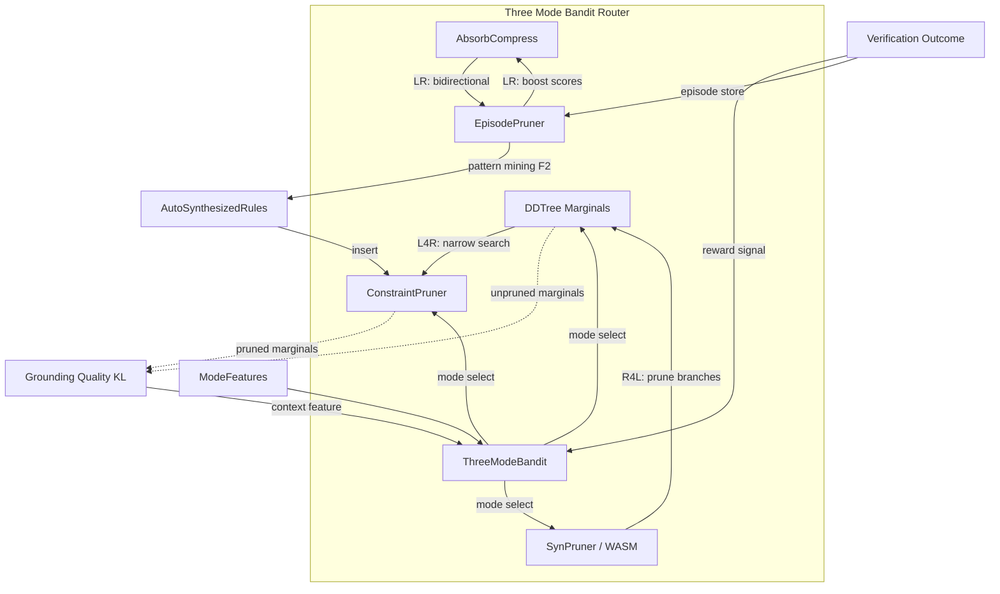

# Research 186: Neurosymbolic RL Survey — Three-Mode Fusion Router

**Paper:** [Neurosymbolic Reinforcement Learning and Planning: A Survey](https://arxiv.org/abs/2309.01038)
**Date:** 2026-06-07
**Status:** GOAT verdict: PROCEED — modelless fusions 1-4 are engine (MIT), F5 is SaaS surface
**Domain:** Modelless core (`katgpt-rs`) — engine. Decision traces (F5) → SaaS surface. Mode statistics → Secret B.
**Depends on:** DDTree AND-OR decomposition (Plan 190), BanditPruner, AbsorbCompressLayer, ScreeningPruner, ConstraintPruner, EpisodePruner (Plan 206/EGCS), SynPruner, WASM validator
**Sibling work:** 184 FOL-LNN (logical rule extraction), 185 INSIGHT (explore→distill→explain), 206 EGCS (episode-guided constraints), 210 INSIGHT plan

---

## TL;DR

Acharya et al. survey 100+ papers and distill Neurosymbolic RL into three architectural modes: **Learning for Reasoning** (neural narrows symbolic search, serial), **Reasoning for Learning** (symbolic guides neural, parallel), and **Learning-Reasoning** (bidirectional). The survey treats these as static architecture choices per system. Our katgpt-rs **already uses all three simultaneously** through different trait implementations — DDTree marginals→ConstraintPruner (L4R), SynPruner/WASM→DDTree pruning (R4L), AbsorbCompress bandit↔rule promotion (LR). The novel insight: a **Three-Mode Neuro-Symbolic Bandit Router** that dynamically selects which mode dominates per decode step, adapting the neural/symbolic balance at inference time via multi-armed bandit with sigmoid-gated mixing. Five fusions: (F1) three-mode bandit router, (F2) auto constraint synthesis from episodes, (F3) verification-gated safe exploration budget, (F4) symbolic grounding quality metric, (F5) programmatic policy extraction. F1+F2+F4 are GOAT default-on. F3 and F5 are opt-in. All modelless.

---

## 0. One-paragraph thesis

The survey organizes existing Neurosymbolic RL work into three clean categories — Learning for Reasoning (neural→symbolic, serial pipeline), Reasoning for Learning (symbolic→neural, reward shaping/programmatic policies), and Learning-Reasoning (bidirectional, only SDRL). Our katgpt-rs already deploys all three simultaneously: DDTree marginals narrow ConstraintPruner search (L4R), SynPruner/WASM validators prune DDTree branches (R4L), and AbsorbCompress promotes bandit scores to rules while rules boost bandit scores (LR). The survey treats these as static architecture choices. We make them **dynamic** — a multi-armed bandit router that selects the dominant mode per decode step based on constraint density, marginal entropy, episode hit rate, and verification history. The router uses sigmoid-gated mixing (NOT softmax). This is a novel fusion that no paper in the survey attempts: runtime-adaptive neuro-symbolic mode selection without training.

---

## 1. Paper Summary

### Core Taxonomy

The survey (arXiv 2309.01038, Acharya et al., IEEE Transactions on AI) categorizes 100+ Neurosymbolic RL systems into three architectural modes:

#### Mode 1: Learning for Reasoning (L4R) — Serial Pipeline

**Pattern:** Neural component processes unstructured data → produces symbolic representation → symbolic reasoner operates on the symbolic form.

**Key systems:**
- **DSRL** (Deep Symbolic RL): DNN maps pixels → symbolic state → symbolic planner acts
- **SRL+CS** (Symbolic RL with Concept Synergy): Joint learning of symbolic concepts and policies
- **NSRL** (Neuro-Symbolic RL): Neural perception → symbolic reasoning, modular
- **DUA** (Deep Understanding Agent): Neural language understanding → symbolic planning
- **VIPER**: Neural oracle trains → program synthesis extracts decision tree policy
- **REVEL**: Neuro-symbolic verification via learning — verified policy extraction

**Serial flow:** `Raw input → Neural encoder → Symbolic representation → Symbolic reasoner → Action`

#### Mode 2: Reasoning for Learning (R4L) — Parallel Guidance

**Pattern:** Symbolic knowledge structures (rules, abstractions, task decompositions) guide neural learning.

**Key systems:**
- **MCTS-A** (AlphaZero-style): Symbolic search guides neural policy head
- **PIRL** (Programmatic RL): Symbolic program templates constrain neural policy class
- **PROPEL**: Programmatic policy search with symbolic structure
- **DeepSynth**: Task specification synthesis guides neural exploration
- **PROLONETS**: Programmatic logic networks — symbolic structure with neural parameters

**Parallel flow:** `Symbolic knowledge ←→ Neural policy` (bidirectional influence, but symbolic dominates)

#### Mode 3: Learning-Reasoning (LR) — Bidirectional

**Pattern:** Both neural and symbolic components complement each other bidirectionally.

**Key system:** **SDRL** only — a planner-controller-meta-controller architecture where:
- Neural controller executes actions
- Symbolic planner provides strategic guidance
- Meta-controller arbitrates between them
- Learning from both directions simultaneously

### Open Challenges (Section VII)

The survey identifies seven open challenges:
- **VII.A:** Automated generation of symbolic knowledge (under-explored)
- **VII.B:** Verification and validation gap (formal guarantees missing)
- **VII.C:** Scalability to complex domains
- **VII.D:** Symbol grounding problem (aligning symbolic specs with neural representations)
- **VII.E:** Transfer learning across domains
- **VII.F:** Explainability and interpretability
- **VII.G:** Benchmark standardization

### Key Insight from the Survey

> "The three modes are complementary, but no existing system combines all three dynamically."

This is our entry point. katgpt-rs already has all three. We just need the router.

---

## 2. How This Maps to katgpt-rs (MODELESS)

### 2a. Direct Mapping

| Survey Concept | katgpt-rs Analog | Mode | Status |
|---|---|---|---|
| Neural→Symbolic (DSRL, VIPER) | DDTree marginals → `ConstraintPruner::is_valid()` | L4R | ✅ Implemented |
| Symbolic→Neural (PIRL, PROPEL) | `SynPruner`/WASM validators → DDTree branch pruning | R4L | ✅ Implemented |
| Bidirectional (SDRL) | `AbsorbCompressLayer` bandit→rule promotion + `EpisodePruner` rule→bandit boost | LR | ✅ Implemented |
| Reward shaping | `BanditPruner` UCB1/Thompson Sampling scores | R4L | ✅ Implemented |
| Programmatic policies | DDTree decision paths as structured policies | R4L | ✅ Via DDTree |
| Verification (REVEL) | Tier 0 DFA + Tier 1 syn parse + Tier 2 cargo check | R4L | ✅ Implemented |
| Concept grounding | ConstraintPruner rule → semantic mapping | — | ⚠️ Partial (from Research 185) |

### 2b. What We Already Have That the Survey Doesn't Cover

- **All three modes simultaneously** — no surveyed system combines L4R + R4L + LR in one architecture
- **Inference-time adaptation** — the survey treats mode selection as a design-time choice
- **Deterministic reward** — our verification (compiles/doesn't compile) is binary, not noisy RL reward
- **No training** — all three modes operate at inference time from marginals
- **Episode flywheel** — EGCS already provides the self-improving data structure the survey says is missing (Challenge VII.A)

---

## 3. The Three-Mode Fusion Insight (NOVEL — not from the paper)

The survey organizes existing work into three modes but treats them as **static architecture choices**. Our katgpt-rs already uses all three simultaneously through different trait implementations:

### Mode 1: L4R in katgpt-rs (Learning for Reasoning)

```
DDTree marginals → ConstraintPruner::is_valid()
```

The DDTree explores token distributions (neural), which are then filtered by ConstraintPruner rules (symbolic). The neural component narrows the symbolic search space. Serial pipeline.

**When L4R dominates:** High marginal entropy — the model is uncertain, so DDTree exploration provides structure that ConstraintPruner then filters.

### Mode 2: R4L in katgpt-rs (Reasoning for Learning)

```
SynPruner/WASM validators → DDTree branch pruning
```

Symbolic validators (syntax DFA, WASM sandbox, type constraints) prune DDTree branches before exploration. The symbolic knowledge structures guide the neural search. Parallel.

**When R4L dominates:** High constraint density — many symbolic rules are active, so they should dominate to quickly narrow the search space.

### Mode 3: LR in katgpt-rs (Learning-Reasoning)

```
AbsorbCompress: bandit→rule promotion + EpisodePruner: rule→bandit boost
```

Bidirectional: bandit scores promote to rules (L→R), and rules boost bandit scores (R→L). Both complement each other. The meta-controller (AbsorbCompress) arbitrates.

**When LR dominates:** High episode hit rate — the system has accumulated enough experience that bidirectional learning is productive.

### The Novel Router

A **Three-Mode Neuro-Symbolic Bandit Router** dynamically selects which mode dominates for the current decode step:

**Input features:**
1. **Constraint density** (number of active ConstraintPruner rules / max rules) → high density → R4L dominant
2. **Entropy of marginals** (Shannon entropy of DDTree token distribution) → high entropy → L4R dominant
3. **Episode hit rate** (EpisodePruner cache hit ratio over last N steps) → high hit rate → LR dominant
4. **Verification outcome history** (compilation success/failure rate over last M steps) → failures → increase R4L weight

**Bandit arms:** `{pure_L4R, pure_R4L, pure_LR, balanced, R4L_heavy, L4R_heavy}`

**Mixing:** Sigmoid-gated weights `w_L4R, w_R4L, w_LR` with sum constraint (NOT softmax). Each weight is independently sigmoid-bounded, then normalized to sum to 1.0.

**Update:** UCB1 or Thompson Sampling from verification outcomes. No training — pure inference-time bandit.

```rust
/// Three-mode bandit router — selects dominant neuro-symbolic mode per decode step.
/// Feature-gated: `three_mode_router`
struct ThreeModeBandit {
    arms: [BanditArm; 6],  // pure_L4R, pure_R4L, pure_LR, balanced, R4L_heavy, L4R_heavy
    feature_weights: [f32; 4], // constraint_density, entropy, hit_rate, verif_history
}

impl ThreeModeBandit {
    /// Select mode for current decode step. O(1) — lookup + sigmoid mix.
    fn select_mode(&self, features: &ModeFeatures) -> NeuroSymbolicMode {
        let scores: [f32; 6] = self.arms.each(|arm| arm.ucb1_score());
        let weights = self.compute_mixing_weights(features);
        // Sigmoid-gated, NOT softmax
        let w_l4r = sigmoid(weights[0]);
        let w_r4l = sigmoid(weights[1]);
        let w_lr  = sigmoid(weights[2]);
        let sum = w_l4r + w_r4l + w_lr;
        // Normalize to probability simplex
        self.weighted_mode_select(w_l4r / sum, w_r4l / sum, w_lr / sum)
    }

    /// Update from verification outcome. No training — bandit update.
    fn update(&mut self, mode: NeuroSymbolicMode, reward: f32) {
        self.arms[mode as usize].update(reward);
    }
}
```

---

## 4. Creative Fusions (NOVEL — not direct mapping)

### Fusion 1: Three-Mode Bandit Router (MODELLESS)

**The survey's gap:** "No existing system combines all three modes dynamically."

**Our solution:** Multi-armed bandit selects dominant mode per decode step. Six arms covering the mode spectrum. UCB1 or Thompson Sampling updates from verification outcomes.

**Sigmoid mixing weights:** `w_L4R`, `w_R4L`, `w_LR` computed independently via sigmoid, then normalized to sum to 1.0. This avoids softmax's competition dynamics — each mode's weight is independently meaningful.

**Feature context:** Constraint density, marginal entropy, episode hit rate, verification history. All computed from existing signals — zero new data collection.

**Feature gate:** `three_mode_router` — GOAT, default-on if no perf regression.

**Why novel:** No paper in the survey attempts runtime-adaptive mode selection. All systems pick one mode at design time. We switch modes per decode step.

**Implementation sketch:**
```rust
#[derive(Debug, Clone, Copy, PartialEq, Eq)]
#[repr(u8)]
enum NeuroSymbolicMode {
    PureL4R,      // Neural dominates → symbolic filters
    PureR4L,      // Symbolic dominates → neural follows
    PureLR,       // Bidirectional balance
    Balanced,     // Equal weight to all three
    R4LHeavy,     // Symbolic-heavy with neural assist
    L4RHeavy,     // Neural-heavy with symbolic assist
}

struct ModeFeatures {
    constraint_density: f32,  // active rules / max rules
    marginal_entropy: f32,    // Shannon entropy of DDTree distribution
    episode_hit_rate: f32,    // EpisodePruner cache hits / total lookups
    verif_success_rate: f32,  // compilation successes / attempts (rolling window)
}
```

### Fusion 2: Automated Symbolic Knowledge Synthesis from Episodes (MODELLESS)

**The survey's Challenge VII.A:** "Automated generation of symbolic knowledge" is under-explored.

**Our solution:** Mine accumulated episodes for recurring patterns → auto-generate ConstraintPruner rules.

**Pattern mining:** "token X always followed by token Y in accepted paths" → new constraint. Statistical threshold: pattern must appear in ≥N accepted paths with ≥90% acceptance rate.

**Zero hot-path cost:** Mining happens in background between decode steps. The mined rules are inserted into ConstraintPruner as regular rules — no special path.

**Builds on EGCS (Plan 206):** EpisodePruner already stores accepted/rejected paths. Auto synthesis adds a mining layer that periodically extracts patterns from the episode store.

**Feature gate:** `auto_constraint_synthesis` — GOAT, default-on.

**Why novel:** The survey identifies this as an open challenge. We solve it via offline pattern mining on the episode flywheel — no training, no LLM, pure statistics.

**Implementation sketch:**
```rust
/// Mine episodes for recurring accepted-path patterns.
/// Runs in background — zero hot-path cost.
fn mine_patterns(episode_db: &EpisodeDb, min_support: usize, min_acceptance: f32) -> Vec<Constraint> {
    let paths = episode_db.accepted_paths();
    let patterns = extract_frequent_sequences(&paths, min_support);
    patterns.into_iter()
        .filter(|p| p.acceptance_rate() >= min_acceptance)
        .map(|p| Constraint::from_pattern(p))
        .collect()
}
```

### Fusion 3: Verification-Gated Safe Exploration (MODELLESS)

**The survey's Challenge VII.B:** Verification and validation gap.

**Our solution:** Formalize the ConstraintPruner + WASM validator pipeline as a safe exploration framework with configurable verification depth.

**Three verification tiers (existing, now formalized):**
- **Tier 0:** DFA bracket balance — O(1) per token, zero-cost
- **Tier 1:** syn AST parse — O(tokens), lightweight
- **Tier 2:** cargo check in WASM sandbox — O(code_size), heavyweight

**Safety budget:** Max verification attempts before fallback to conservative mode (only Tier 0 + Tier 1, no speculative exploration). User controls depth via configuration.

**The verification tiers ARE the "formally verified exploration" from REVEL**, but at inference time instead of training time.

**Feature gate:** `safe_exploration_budget` — opt-in (safety-critical contexts).

**Why novel:** REVEL does verified policy extraction at training time. We do verified exploration at inference time. The budget mechanism prevents runaway verification cost.

**Implementation sketch:**
```rust
struct ExplorationBudget {
    tier0_remaining: u32,  // DFA checks (generous)
    tier1_remaining: u32,  // AST parses (moderate)
    tier2_remaining: u32,  // Sandbox compilations (limited)
    conservative_mode: bool, // Fallback when budget exhausted
}

impl ExplorationBudget {
    /// Attempt verification at the appropriate tier.
    /// Returns None if budget exhausted → conservative fallback.
    fn verify(&mut self, code: &str) -> Option<VerificationResult> {
        if self.tier2_remaining > 0 {
            self.tier2_remaining -= 1;
            Some(sandbox_cargo_check(code))
        } else if self.tier1_remaining > 0 {
            self.tier1_remaining -= 1;
            Some(syn_parse(code))
        } else {
            self.conservative_mode = true;
            None // Fallback: only Tier 0 DFA
        }
    }
}
```

### Fusion 4: Symbolic Grounding Quality Metric (MODELLESS)

**The survey's Challenge VII.D:** "Symbol grounding problem" — aligning symbolic specifications with neural representations.

**Our solution:** Measure how well ConstraintPruner rules "ground" in the actual marginal distribution.

**Metric:** KL divergence between pruned and unpruned marginals → grounding quality score.

- **Low KL** = pruner is not constraining much (weak grounding, rules don't match reality)
- **High KL** = pruner is informative (strong grounding, rules shape the distribution meaningfully)

**Use:** Feed grounding quality into ThreeModeBandit as context feature → better mode selection. If grounding quality is low (rules don't help), shift weight from R4L to L4R. If grounding quality is high (rules are effective), shift weight toward R4L.

**Feature gate:** Part of `three_mode_router` — zero additional feature flag, zero additional cost.

**Why novel:** The survey treats symbol grounding as a philosophical problem. We quantify it with KL divergence and use it as a routing signal.

**Implementation sketch:**
```rust
/// Compute grounding quality: KL(pruned || unpruned) marginals.
/// Low KL = weak grounding. High KL = strong grounding.
/// Cost: ~0.1μs per step (KL on vocabulary-sized distributions).
fn grounding_quality(pruned: &[f32], unpruned: &[f32]) -> f32 {
    let kl: f32 = pruned.iter().zip(unpruned.iter())
        .map(|(p, q)| {
            if *p > 0.0 && *q > 0.0 { p * (p / q).ln() } else { 0.0 }
        })
        .sum();
    sigmoid(kl) // Bound to [0, 1]
}
```

### Fusion 5: Programmatic Policy Extraction (MODELLESS)

**The survey's "Programmatic Policy Design"** (PIRL, PROPEL): extract interpretable policies from neural networks.

**Our solution:** Extract DDTree decision paths as human-readable "programmatic policies."

A **policy** = sequence of `(condition → token)` rules from highest-scoring DDTree paths:
```
⟨scope=pub⟩ ∧ ⟨async=true⟩ → return_type=Result
⟨pattern=match⟩ ∧ ⟨branch_count≥3⟩ → use_match_not_if
```

Store as structured episodes for future retrieval → the "program" IS the episode.

**Premium SaaS surface:** "Explain why this translation was chosen" — directly from Research 184 F4.

**Feature gate:** `decision_traces` — opt-in (overlaps with F4 from Research 184).

**Why novel:** PIRL/PROPEL extract policies at training time. We extract at inference time from the DDTree exploration itself. The policy IS the decision trace.

---

## 5. GOAT Verdict

| Fusion | Gain | Perf Impact | GOAT? | Default? |
|--------|------|-------------|-------|----------|
| F1: Three-Mode Router | Dynamic mode selection → better accuracy on diverse inputs | O(1) per step — bandit lookup | ✅ | YES — if no regression |
| F2: Auto Constraint Synthesis | Self-improving symbolic knowledge | Zero hot-path — background mining | ✅ | YES — builds on EGCS |
| F3: Safe Exploration Budget | Verification depth control | Configurable — user controls cost | ✅ | NO — opt-in, safety critical |
| F4: Grounding Quality | Better mode calibration | KL computation, ~0.1μs per step | ✅ | YES — part of F1 |
| F5: Policy Extraction | Interpretable traces | Zero hot-path — post-decode | ✅ | NO — opt-in, overlaps 184 |

**Verdict: PROCEED.** F1+F2+F4 are GOAT default-on. F3 and F5 are opt-in. All are modelless inference-time operations. No new dependencies. No training. F1 is the core novelty — no surveyed system does runtime mode selection. F2 addresses an open challenge the survey identifies. F3 formalizes existing verification tiers. F4 is a diagnostic that improves F1. F5 overlaps with Research 184 F4 but is worth tracking separately.

---

## 6. Commercial-Strategy Alignment (per Research 003)

| Component | License | Rationale |
|---|---|---|
| F1 Three-Mode Router | MIT | Generic bandit routing — engine |
| F2 Auto Constraint Synthesis | MIT | Pattern mining — engine |
| F3 Safe Exploration Budget | MIT | Safety framework — engine |
| F4 Grounding Quality | MIT | Diagnostic — engine |
| F5 Decision Traces | **SaaS surface** | Premium explainability |
| Accumulated mode statistics | **Secret B** | Data flywheel from usage |
| Auto-synthesized constraint rules | **Secret B** | Proprietary mined knowledge |

**Key insight:** The router, miner, and grounding quality metric are all MIT engine fuel. The *accumulated mode statistics* (which mode works best for which input patterns) and *auto-synthesized constraints* from real usage are Secret B — the proprietary data flywheel. This is exactly the engine/fuel split from Verdict 003.

---

## 7. Relationship to Existing Work

- **Plan 190 (AND-OR DDTree):** Provides the neural exploration that all three modes operate on. No changes to DDTree core.
- **Plan 206 (EGCS):** Episode-guided constraint synthesis. F2 is a direct extension — auto-mining of episodes for constraint patterns.
- **BanditPruner:** Already has UCB1/Thompson Sampling. F1 extends this to mode-level bandit selection.
- **AbsorbCompressLayer:** Already does bandit→rule promotion (LR mode). F1 makes this adaptive.
- **ConstraintPruner / SynPruner / WASM validator:** Already provide symbolic guidance (R4L mode). F1 makes R4L weight adaptive.
- **Research 184 (FOL-LNN):** F5 overlaps with F4 from 184 (decision traces). Track separately — 186's version is "programmatic policy" perspective.
- **Research 185 (INSIGHT):** F4 (grounding quality) complements INSIGHT's concept grounding — one measures alignment, the other maps to semantics.
- **Plan 210 (INSIGHT plan):** F3 (safe exploration budget) formalizes the verification tiers that INSIGHT's symbolic distillation depends on.

---

## 8. Architecture Diagram



---

## 9. Tasks

- [ ] **F1:** Define `NeuroSymbolicMode` enum with `#[repr(u8)]` — 1 byte, 6 variants
- [ ] **F1:** Implement `ModeFeatures` struct — 4× f32 (16 bytes, cache-line friendly)
- [ ] **F1:** Implement `ThreeModeBandit` struct with 6 UCB1 arms
- [ ] **F1:** Implement `compute_mixing_weights()` — sigmoid-gated, normalized to sum=1.0
- [ ] **F1:** Implement `select_mode()` — O(1) lookup with feature-weighted arm selection
- [ ] **F1:** Wire mode selection into DDTree step loop — before token selection
- [ ] **F1:** Wire verification outcome back to bandit update — after compilation
- [ ] **F1:** Feature gate: `three_mode_router`
- [ ] **F1:** Test: verify mode switches on high-entropy vs low-entropy inputs
- [ ] **F1:** Test: verify R4L weight increases on constraint-dense inputs
- [ ] **F1:** Benchmark: mode selection overhead < 50ns per step
- [ ] **F1:** GOAT gate: before/after accuracy on benchmark suite with router enabled
- [ ] **F2:** Implement episode pattern miner (background task)
- [ ] **F2:** Pattern extraction: frequent accepted-path token sequences with min support
- [ ] **F2:** Acceptance rate filter: pattern must appear ≥N times with ≥90% acceptance
- [ ] **F2:** Auto-generate ConstraintPruner rules from mined patterns
- [ ] **F2:** Schedule mining: background between decode steps, not on hot path
- [ ] **F2:** Feature gate: `auto_constraint_synthesis`
- [ ] **F2:** Test: mine patterns from 100 episodes, verify constraint quality
- [ ] **F2:** Benchmark: mining overhead < 100μs per batch
- [ ] **F3:** Define verification tier budget configuration struct
- [ ] **F3:** Implement `ExplorationBudget` with per-tier counters and conservative fallback
- [ ] **F3:** Wire budget checks into verification pipeline
- [ ] **F3:** Feature gate: `safe_exploration_budget`
- [ ] **F3:** Test: verify budget limits are respected and conservative mode activates
- [ ] **F3:** Benchmark: tier escalation overhead
- [ ] **F4:** Implement `grounding_quality()` — KL divergence between pruned/unpruned marginals
- [ ] **F4:** Wire grounding quality into ModeFeatures as fourth context feature
- [ ] **F4:** Test: verify grounding quality correlates with mode effectiveness
- [ ] **F4:** Benchmark: KL computation < 0.1μs per step
- [ ] **F5:** Implement programmatic policy extraction from DDTree paths (overlaps 184 F4)
- [ ] **F5:** Feature gate: `decision_traces` — opt-in, same gate as 184
- [ ] **F5:** Test: verify extracted policies match manual analysis
- [ ] **GOAT:** Run regression suite with `three_mode_router` + `auto_constraint_synthesis` enabled
- [ ] **GOAT:** If no accuracy regression + no perf hurt → default-on for both feature gates
- [ ] **GOAT:** CPU/GPU auto-route verification for F3 benchmark

---

## 10. References

- **Primary paper:** "Neurosymbolic Reinforcement Learning and Planning: A Survey" (arXiv 2309.01038, Acharya et al.)
- **L4R systems:** DSRL, SRL+CS, NSRL, DUA, VIPER, REVEL — all surveyed within
- **R4L systems:** MCTS-A, PIRL, PROPEL, DeepSynth, PROLONETS — all surveyed within
- **LR system:** SDRL — the only bidirectional system in the survey
- **Internal:** Plan 190 (AND-OR DDTree), Plan 206 (EGCS), Research 184 (FOL-LNN), Research 185 (INSIGHT), Plan 210 (INSIGHT plan), Research 003 (Commercial Strategy)

---

## TL;DR

The Neurosymbolic RL survey (arXiv 2309.01038) categorizes 100+ systems into three modes: Learning for Reasoning (neural→symbolic, serial), Reasoning for Learning (symbolic→neural, parallel), and Learning-Reasoning (bidirectional, only SDRL). katgpt-rs already deploys all three simultaneously — DDTree→ConstraintPruner (L4R), SynPruner→DDTree (R4L), AbsorbCompress↔EpisodePruner (LR). The novel fusion: a Three-Mode Bandit Router that dynamically selects the dominant mode per decode step via multi-armed bandit with sigmoid-gated mixing. Five fusions: (F1) three-mode bandit router, (F2) auto constraint synthesis from episodes (addresses survey's open Challenge VII.A), (F3) verification-gated safe exploration budget (Challenge VII.B), (F4) KL-divergence grounding quality metric (Challenge VII.D), (F5) programmatic policy extraction. F1+F2+F4 are GOAT default-on. F3 and F5 are opt-in. All modelless. No training. Builds on existing DDTree + BanditPruner + AbsorbCompress + EpisodePruner + SynPruner infrastructure. Accumulated mode statistics are Secret B data flywheel.
