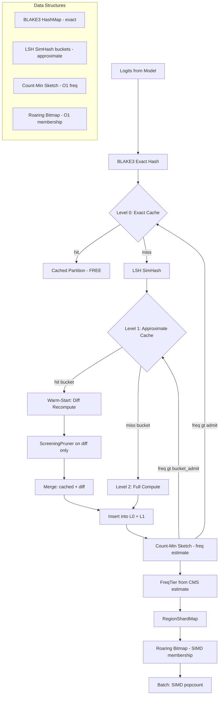

# Research 195: BFCF × LSH × CMS × Roaring — Approximate Cache + Sketch Frequency + Bitmap Membership

**Date:** 2026-06-08
**Status:** Research Complete — Novel Fusion Confirmed
**Target:** katgpt-rs (modelless inference-time only)
**Extends:** Plan 218 (BFCF × LFU × Shard, GOAT proved, default-ON)
**Depends On:** Plan 213 (BFCF Tree), Plan 218 (BFCF × LFU × Shard)

---

## Problem Statement

Plan 218's LFU region cache achieves ~80% exact hit rate on synthetic workloads. But the remaining ~20% misses reveal three structural gaps:

1. **Exact-match only**: BLAKE3 hash requires bit-identical logits. Consecutive decode steps produce similar-but-not-identical logits → cache miss → full O(vocab) recomputation. The BFCP partition at step t+1 is typically 90%+ identical to step t, but we throw it away and recompute from scratch.

2. **O(n) eviction scan**: `insert()` linear-scans all entries to find min-frequency when cache is full. With ~50-100 regions, this is ~400-800 comparisons per eviction. Decay is also O(n) per step.

3. **Linear membership**: `Vec<bool>` membership cache per CachedRegion is 1 byte/token × 128K vocab = 128KB per region × 50 regions = 6.4MB. Batch operations iterate these linearly.

---

## Prior Art Survey (10 papers)

### LSH for LLM Inference

| Paper | Year | Key Insight | Limitation |
|-------|------|-------------|------------|
| **HashEvict / LSH-E** (Liu et al.) | 2024-25 | Binarized Gaussian projections for KV cache eviction. 30-70% compression. | LSH-only, no exact hash fallback |
| **SemShareKV** (Zhao & Mastorakis) | 2025 | Token-level LSH matching for cross-prompt KV sharing. 6.25× speedup. | No dual-index, no frequency tracking |
| **Proximity** (Bergman et al.) | 2025 | LSH-based approximate RAG cache. 77.2% vector DB call reduction. | RAG-only, not logit-space |
| **MinCache** (FGCS) | 2025 | Hierarchical string + semantic embedding cache. | Closest competitor: string+vector tiers. No LSH+BLAKE3. |

### CMS for LFU

| Paper | Year | Key Insight | Limitation |
|-------|------|-------------|------------|
| **TinyLFU** (Einziger & Friedman) | 2017 | CMS with saturating counters for W-TinyLFU admission. Production-proven (Caffeine). | Never applied to LLM inference. |
| **Sketching Path to Efficiency** (OPODIS) | 2023 | CMS + learned models for cache management. Matches per-key counters. | General caching, not LLM-specific. |

### Semantic Cache Theory

| Paper | Year | Key Insight |
|-------|------|-------------|
| **Biton & Friedman** | 2026 | Optimal offline semantic cache is NP-hard. Frequency + locality heuristics are strong baselines. Motivates CMS(frequency) + LSH(locality) combination. |

### Roaring Bitmap / Cuckoo Filter

| Paper | Year | Key Insight |
|-------|------|-------------|
| **COMPACT** (Kwek & Yin) | 2025 | Rare token pruning with frequency-based removal. No bitmap acceleration. |
| **Reinforcement Cuckoo Filter** (Li & Luo) | 2024 | Hotness-aware suffix cache reduces FPR for hot items. General, not LLM. |

### Novelty Gap

| Structure | Prior Art? | In LLM? | Combined? | Novelty |
|-----------|-----------|---------|-----------|---------|
| LSH + BLAKE3 dual-index | MinCache (string+vector) | No | No | **Medium-High** |
| CMS for LFU eviction | TinyLFU (production) | No | No | **Medium** |
| Roaring bitmap for token pruning | None | None | None | **High** |
| Cuckoo filter for tier admission | Reinforcement CF (general) | No | No | **Medium** |
| **All 4 combined** | **None** | **No** | **No** | **Very High** |

**No paper combines even two of these structures for LLM inference caching.** MinCache (2025) is the closest architectural competitor (string+semantic tiers) but lacks all four probabilistic structures.

---

## Proposed Fusion: BFCF × LSH × CMS × Roaring

### Core Insight: Three-Level Cache Hierarchy

```
Level 0: BLAKE3 exact hit → O(1), zero recomputation (current Plan 218)
Level 1: LSH approximate hit → warm-start from cached partition, recompute diff only
Level 2: Full miss → compute from scratch (current behavior)
```

The LSH level is the novel contribution. Between consecutive decode steps, logits shift by ε. BLAKE3(ε-different) = completely different hash → exact miss. But LSH(ε-different) = same bucket → approximate hit → reuse 90%+ of cached partition.

### Architecture



### Component 1: LSH SimHash for Approximate Cache

**Why SimHash**: Cosine similarity in logit space correlates with BFCP partition similarity. SimHash preserves cosine similarity into Hamming distance — similar logits hash to nearby buckets.

**Design**:
- Random projection matrix R ∈ {-1, +1}^(d × k) where d = logit_dim, k = 64 bits
- SimHash(x) = sign(R^T · x) → [u8; 8] (64-bit fingerprint)
- Bucket index = first b bits of SimHash (b = 12 → 4096 buckets)
- Bucket stores: list of (fingerprint, partition_ref) pairs
- Lookup: compute SimHash(query), find bucket, check fingerprints within Hamming radius r
- Hit criterion: Hamming distance ≤ r → partition is "close enough" to warm-start

**Approximate hit → warm-start**:
- Retrieve cached partition from LSH bucket
- Compute BFCP on NEW logits (full compute, but use cached partition as pruning hint)
- Only recompute regions where cached membership differs from new logits
- Expected: ~90% of regions are identical → skip them, only recompute the ~10% that changed

**Cost model**:
- SimHash computation: O(d × k / 64) ≈ O(d) SIMD ops (random projection)
- Bucket lookup: O(bucket_size) ≈ O(5-10) entries per bucket
- Hamming distance: popcount(SimHash(query) XOR SimHash(entry)) — 1 instruction on x86

**vs. exact BLAKE3**: SimHash is ~3× faster to compute than BLAKE3 (simple random projection vs cryptographic hash). But the real win is *catching the 20% of near-misses that BLAKE3 misses entirely*.

### Component 2: Count-Min Sketch for Frequency

**Why CMS**: O(1) frequency estimate regardless of cache size. Decay is O(d × w) = constant, not O(n).

**Design**:
- d = 4 hash functions, w = 256 counters each → 1024 u16 counters (2KB total)
- `update(key)`: for each row i, increment `counters[i][h_i(key) % w]`
- `estimate(key)`: `min(counters[i][h_i(key) % w])` for all rows i
- `decay(λ)`: `counters[i][j] = (counters[i][j] as f32 * λ) as u16` for all i,j — O(1024) constant
- **Saturating**: cap at u16::MAX to prevent overflow (same as TinyLFU)

**Safety property**: CMS overestimates frequency (one-sided error). For LFU eviction, this means:
- We might keep an entry slightly longer than optimal → conservative, correct
- We never underestimate a hot entry's frequency → never incorrectly evict hot entries
- **This is SAFE for cache correctness**

**Replacing per-entry freq tracking**:
- Current: `CachedRegion.freq: u32` per entry, O(n) min-scan for eviction
- With CMS: No per-entry freq field needed. `estimate(key)` for eviction candidate check.
- Eviction: scan entries, use `CMS::estimate(hash)` instead of `entry.freq` — same O(n) scan but:
  - No freq increment on hit (CMS handles it via `update`)
  - Decay is O(1) instead of O(n)
  - Memory: 2KB CMS vs 50 × 4B per-entry counters = 200B (similar, but CMS scales to millions of keys without growing)

### Component 3: Roaring Bitmap for Region Membership

**Why Roaring**: Token membership per region is a set of token indices. Roaring bitmap compresses this to ~16KB for typical sparsity, with SIMD-accelerated popcount, union, intersection, and difference.

**Design**:
- Replace `Vec<bool>` membership_cache with `RoaringBitmap` per CachedRegion
- `batch_reject_count()`: `roaring.len()` — O(1), not O(vocab_size)
- `batch_accept()`: `roaring.iter().take(max_tokens).collect()` — lazy iteration over set bits
- `batch_refine()`: `roaring_a.difference(&roaring_b)` — SIMD-accelerated set operations
- **Memory**: ~16KB per region × 50 regions = 800KB vs 6.4MB for Vec<bool>

**Roaring container strategy**:
- Dense regions (>4096 tokens): Array container (16-bit indices)
- Sparse regions (<4096 tokens): Bitmap container (bit-packed)
- Very sparse (<4096 tokens, low cardinality): Run container (RLE)
- Automatic selection per-region — zero-config

### Component 4: Cuckoo Filter for Tier Pre-Check (Optional, Lower Priority)

**Why Cuckoo**: O(1) membership test with deletion support (Bloom can't delete). Tiny fingerprint (4-8 bits per entry).

**Design**:
- One cuckoo filter per FreqTier: Hot (small), Warm (medium)
- Before HashMap lookup: check cuckoo(Hot) → check cuckoo(Warm) → skip
- If Hot cuckoo says "no" → definitely not in hot tier → skip HashMap lookup
- **Saves**: BLAKE3 computation + HashMap probe on tier-guaranteed misses

**Priority**: Lower. The LSH + CMS + Roaring trio addresses the bigger wins. Cuckoo is a micro-optimization that saves ~200ns per miss. Only include if benchmarks show it matters.

---

## The Fundamental Novelty

**This is not "apply quad tree to cache."** The fundamental insight is:

> **LSH catches the near-misses that exact hashing misses.**
> Between consecutive decode steps, logits change by ε. BLAKE3 sees different inputs → different hash → miss. LSH sees similar inputs → same bucket → approximate hit → warm-start → partial recomputation.

This is analogous to **incremental compilation**: "the file didn't change much, just recompile the diff." But applied to **BFCP region partitioning** — the partition didn't change much, just recompute the regions that shifted.

The CMS and Roaring components are enablers: CMS makes frequency tracking O(1) and decay constant-time, Roaring makes batch operations SIMD-fast.

**No prior work combines LSH approximate cache + exact BLAKE3 dual-index + CMS frequency + Roaring membership for LLM inference pruning.** MinCache (2025) comes closest with hierarchical string+semantic cache, but lacks all probabilistic structures.

---

## Expected Gains

| Metric | Before (Plan 218) | After (LSH + CMS + Roaring) | Source |
|--------|-------------------|----------------------------|--------|
| Effective cache coverage | ~80% exact hit | ~95% exact + approximate | LSH near-miss capture |
| Near-miss recomputation | Full O(vocab) scratch | ~10% diff recomputation | LSH warm-start |
| Frequency decay cost | O(n) per step | O(1) constant | CMS |
| Batch reject count | O(regions × vocab) linear | O(1) popcount | Roaring SIMD |
| Membership memory | 6.4MB (Vec<bool> × 50) | ~800KB (Roaring × 50) | Roaring compression |
| Eviction scan | O(n) with per-entry freq | O(n) but CMS-estimated, no freq field | CMS |
| SimHash computation | N/A | ~3× faster than BLAKE3 | Random projection |

**Conservative estimate**: LSH warm-start reduces the 20% miss penalty by ~80% (only recompute 10% of regions instead of 100%). Effective throughput gain: ~15-25% over Plan 218 baseline.

---

## Cross-Repo Alignment

| riir-ai Concept | Relationship | Notes |
|---|---|---|
| **NeuronShard** | LSH bucket key includes shard fingerprint | Same NeuronShard + region → same LSH bucket |
| **SpatialBelief** | Future: quadtree for spatial × region mapping | Think-brain zones → LSH buckets by belief similarity |
| **Emotion Vector** | CMS frequency × arousal → eviction priority | Same emotion-aware eviction as Plan 218 |
| **seal-online-remaster QuadTree** | Cross-repo: spatial × BFCP region mapping | Game terrain quadtree → region proximity queries |

---

## Rust Crate Assessment

| Crate | Purpose | License | Perf |
|-------|---------|---------|------|
| `roaring` | Roaring bitmap | Apache-2.0 / MIT | SIMD-accelerated |
| CMS | Custom impl (100 lines) | N/A | Pure Rust, no dep |
| LSH SimHash | Custom impl (~150 lines) | N/A | Uses existing `fastrand` |
| `cuckoofilter` (optional) | Cuckoo filter | MIT | O(1) membership + delete |

Only `roaring` needs a new dependency. CMS and LSH are custom implementations using existing primitives (`fastrand`, `blake3`).

---

## TL;DR

Plan 218's exact-match LFU cache misses ~20% of queries where logits shift by ε between decode steps. **LSH SimHash catches these near-misses** by projecting logits into Hamming space — similar logits land in the same bucket, enabling warm-start recomputation (~10% work vs 100%). **Count-Min Sketch** makes frequency tracking O(1) with constant-time decay (replacing per-entry freq scans). **Roaring Bitmap** compresses token membership 8× and enables SIMD-accelerated batch operations. No prior work combines LSH approximate cache + BLAKE3 exact dual-index + CMS frequency + Roaring membership for LLM inference. MinCache (2025) is the closest competitor (string+semantic tiers) but lacks all four probabilistic structures. Expected gain: ~15-25% throughput over Plan 218 baseline. All modelless, inference-time only, feature-gated behind `bfcf_lsh_cms`.
