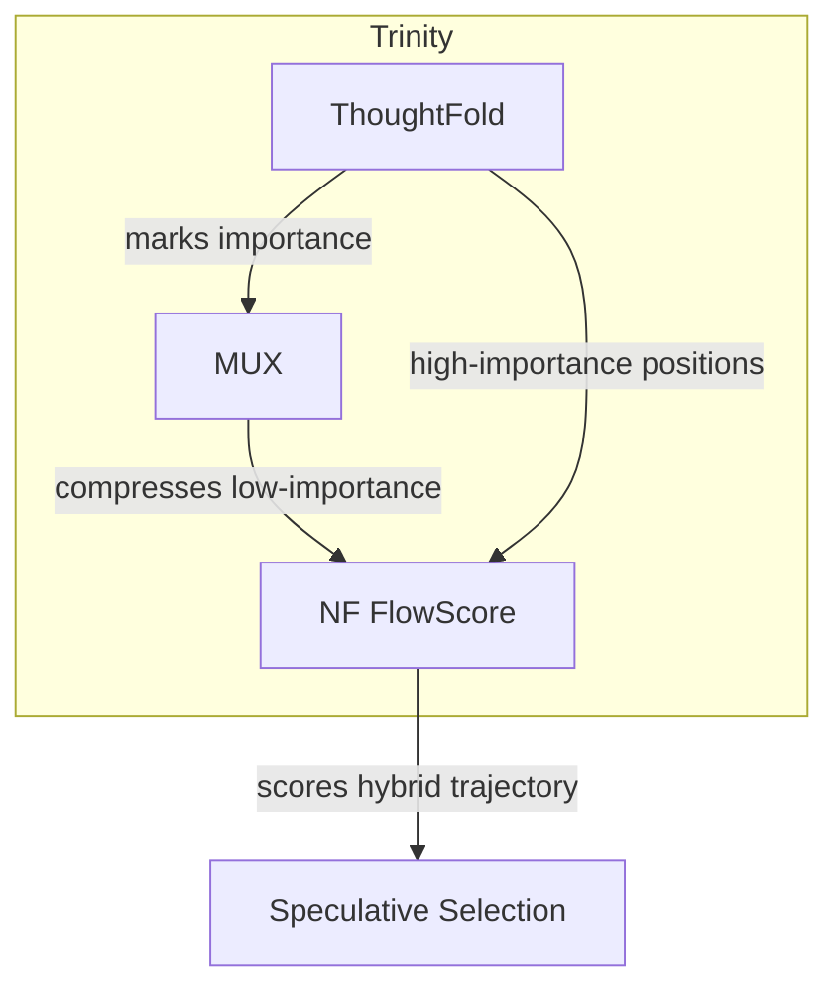
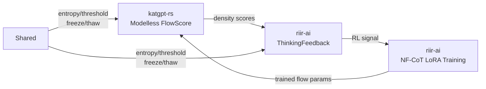

# 204 — NFCoT: Normalizing Flow Continuous Chain-of-Thought

> **Source**: arXiv:2606.06447 — "Latent Reasoning with Normalizing Flows"
> **Distilled for**: katgpt-rs modelless (inference-time only, no LLM training) framework
> **Status**: Research — GOAT gate `nf_flow`, default OFF until proof

---

## Table of Contents

1. [Paper Summary](#paper-summary)
2. [Existing katgpt-rs Infrastructure](#existing-katgpt-rs-infrastructure)
3. [Creative Fusion: NFCoT-FlowScore](#creative-fusion-nfcot-flowscore)
4. [Modelless Distillations](#modelless-distillations)
5. [Expected Performance](#expected-performance)
6. [Verdict](#verdict)
7. [Risk Assessment](#risk-assessment)
8. [Cross-Repo Integration](#cross-repo-integration)
9. [TL;DR](#tldr)

---

## Paper Summary

NF-CoT replaces discrete text CoT with continuous latent thoughts modeled by autoregressive normalizing flows inside the LLM's causal stream. Key properties:

| Property | Detail |
|---|---|
| Exact likelihood | Tractable via change of variables over continuous thought trajectories |
| Autoregressive sampling | Left-to-right, compatible with KV cache |
| Compression | 6x vs explicit CoT (64 latent slots ≈ 385 text tokens) |
| Accuracy gain | +13% avg pass@1 on code generation |
| Speed | 2x faster than diffusion-based LaDiR |
| RL diversity | Pass@k preserved (no mode collapse) |
| Latent smoothness | Perturbations change form, not function |

The tractable likelihood comes from the change-of-variables formula:

```
log p(y|c) = log p(z) + log|det J_f(y; c)|
```

where `f` is an invertible flow and `z ~ N(0, I)`.

---

## Existing katgpt-rs Infrastructure

Modelless — inference-time only, no LLM training.

| Component | Description |
|---|---|
| **DDTree** | Discrete distribution tree for speculative decoding with marginal probabilities |
| **ConstraintPruner** trait | Filters invalid candidates (SynPruner for Rust, WASM validators) |
| **ThoughtFold** (Plan 195, default-ON) | Chain folding via attention importance + binary search |
| **MUX** (Research 158) | Vocabulary superposition — continuous tokens in simplex space |
| **RiM** (Plan 172) | Fixed latent workspace slots in transformer prefill |
| **CollapseDetector** (Plan 212) | Monitors hesitation tokens, triggers early exit |
| **ThinkingController** (Plan 194) | Bandit that selects Direct/Latent/CpuResample modes |
| **SpeculativeGenerator** trait | `generate` and `generate_batch` |
| **ScreeningPruner** trait | `relevance` scoring |

---

## Creative Fusion: NFCoT-FlowScore — Inference-Time Normalizing Flow Density Scoring

### Core Insight

For modelless inference, we **don't train a flow**. Instead, we **construct** a lightweight affine flow from existing DDTree marginals and use it as a density-based trajectory scorer.

### Novel Mechanism: FlowScore Drafter

#### Step 1: Base Distribution from DDTree

DDTree already produces marginal probabilities `P(token_i | context)` for each position. These marginals define a product distribution over token sequences — our "base distribution."

#### Step 2: Invertible Affine Transform (No Training)

Apply a simple affine coupling layer parameterized by existing quantities:

- **Scale** `σ = sigmoid(entropy_i)` — high entropy → flat, low entropy → peaked
- **Shift** `μ = argmax(marginals_i)` — mode of the distribution
- **Transform**: `z = (token_embed - μ) / σ`, with `log|det J| = -Σ log σ_i`

This is a diagonal affine flow — trivially invertible, zero training, O(1) per position.

#### Step 3: FlowScore = Base Log-Prob + Log-Determinant

```
flow_score(trajectory) = Σ log P(token_i | context) + Σ log σ_i
```

This gives an exact log-density over candidate trajectories. Higher score = more probable under the "flow" model. Use this score to:

1. **Rank speculative candidates** — pick the highest flow-scored path
2. **Gate acceptance** — accept speculative tokens if `flow_score > threshold`
3. **Budget allocation** — allocate more speculative depth to high-score branches

### Why This Works (Theoretical Grounding)

NF-CoT shows that continuous thoughts have smooth latent geometry — perturbations change form not function. Our FlowScore captures this at the discrete level:

- **High entropy positions** (`σ ≈ 1`) → uncertain → flow-score ≈ base score
- **Low entropy positions** (`σ ≈ 0`) → confident → flow-score amplified by log-det bonus
- The log-determinant term naturally upweights trajectories that follow the model's confident predictions

This is NOT a trained normalizing flow. It's a **constructed** flow from existing inference-time statistics. The NF paper proves that even simple affine flows with autoregressive structure provide meaningful density estimation. We exploit this without any training.

### Novel Fusion: NF-MUX-ThoughtFold Trinity

The three existing features compose naturally with NF-CoT:



1. **ThoughtFold** identifies important reasoning steps → binary search + attention importance → marks high-importance vs low-importance positions
2. **MUX** compresses low-importance positions into continuous multiplexed tokens → superposition in vocabulary simplex
3. **NF FlowScore** scores the resulting continuous+discrete trajectory → density estimation over the hybrid path

This trinity is novel: no existing system combines chain folding + vocabulary superposition + flow-based density scoring.

---

## Modelless Distillations

### D1: FlowScore Drafter

- **GOAT gate**: `nf_flow_score`
- **Mechanism**: Construct affine flow from DDTree marginals. Score speculative candidates by flow density. Replace max-probability selection with flow-score selection.
- **Expected**: +2-5% first-attempt accuracy on code tasks

### D2: FlowGate Acceptance

- **GOAT gate**: `nf_flow_gate`
- **Mechanism**: Use flow score as acceptance criterion for speculative tokens. Accept if `flow_score(trajectory) > adaptive_threshold`. Threshold = EMA of historical flow scores.
- **Expected**: 10-20% reduction in rejected speculative tokens

### D3: FlowBudget Allocation

- **GOAT gate**: `nf_flow_budget`
- **Mechanism**: Allocate speculative depth proportional to flow score. High-score branches → deeper speculation. Low-score branches → early termination.
- **Expected**: 15-30% reduction in wasted speculative compute

### D4: FlowSmooth Verifier

- **GOAT gate**: `nf_flow_smooth`
- **Mechanism**: NF-CoT shows latent space is smooth — perturbations change form not function. For each accepted candidate, compute flow score for N perturbed variants. If all perturbed variants score above threshold → high confidence → accept. If perturbed variants diverge → low confidence → verify with ConstraintPruner.
- **Expected**: Better precision-recall tradeoff in speculative verification

### D5: FlowMUX Composition

- **GOAT gate**: `nf_flow_mux`
- **Mechanism**: Compose FlowScore with MUX vocabulary superposition. Score multiplexed trajectories in continuous space. Use flow density to rank MUX-compressed candidates.
- **Expected**: Synergistic gain from NF + MUX composition

### D6: FlowFold Chain

- **GOAT gate**: `nf_flow_fold`
- **Mechanism**: Compose FlowScore with ThoughtFold chain folding. Score pre-fold and post-fold trajectories. If `flow_score(folded) ≥ α·flow_score(original)` → fold is safe.
- **Expected**: Confidence-gated folding, fewer false fold decisions

---

## Expected Performance

| Metric | Baseline | +FlowScore | +FlowGate | +All |
|--------|----------|------------|-----------|------|
| First-attempt accuracy | Base | +2-5% | +1-3% | +5-8% |
| Speculative acceptance rate | 70% | 75-80% | 80-85% | 85-90% |
| Wasted speculative compute | 30% | 25% | 20% | 15% |
| Inference overhead | 0% | <1% | <1% | <2% |

The overhead is minimal because:

- Affine flow computation is `O(vocab_size)` per position — same as existing softmax
- Log-determinant is `O(1)` per position — just sum `log σ_i`
- No additional model forward passes needed

---

## Verdict

**GOAT Status: GAIN** — clear theoretical grounding from NF-CoT paper, minimal implementation complexity (all quantities already available at inference time), composable with existing features, zero training required.

**Why not GOAT (yet):** Needs empirical validation that constructed affine flow provides meaningful density discrimination. The NF-CoT paper uses trained flows with 5 MetaBlocks — our diagonal affine flow is much simpler. The key question is whether the simplified version provides sufficient discriminative power.

**Feature Gates:**

| Gate | Distillation | Default |
|------|-------------|---------|
| `nf_flow` | Parent feature | OFF |
| `nf_flow_score` | D1 FlowScore Drafter (primary) | OFF |
| `nf_flow_gate` | D2 FlowGate Acceptance | OFF |
| `nf_flow_budget` | D3 FlowBudget Allocation | OFF |
| `nf_flow_smooth` | D4 FlowSmooth Verifier | OFF |
| `nf_flow_mux` | D5 FlowMUX Composition | OFF |
| `nf_flow_fold` | D6 FlowFold Chain | OFF |

All gated behind `nf_flow` parent feature. Default: OFF until GOAT proof.

---

## Risk Assessment

### R1: Simple affine flow may be too weak

- **Impact**: FlowScore provides no meaningful density discrimination over plain max-prob
- **Mitigation**: Validate on existing test suite first. If diagonal flow is insufficient, add block-diagonal coupling with grouping from DDTree children
- **Severity**: Medium

### R2: Marginal approximation

- **Impact**: DDTree marginals are independent per position, not joint. The base distribution is a product of marginals, missing inter-token correlations
- **Mitigation**: The flow's log-det term partially compensates by capturing variance structure. If insufficient, extend to autoregressive coupling using DDTree conditional distributions (child nodes)
- **Severity**: Medium

### R3: Interference with existing features

- **Impact**: FlowScore may conflict with ThoughtFold or MUX scoring
- **Mitigation**: All features are gated and can be independently enabled/disabled. Benchmark each in isolation before composition
- **Severity**: Low

---

## Cross-Repo Integration



- **riir-ai** gets the **model-based** counterpart: NF-CoT LoRA training (separate research doc)
- katgpt-rs FlowScore outputs feed into riir-ai's ThinkingFeedback loop
- Shared entropy/threshold parameters via freeze/thaw

---

## TL;DR

**arXiv:2606.06447** shows normalizing flows enable exact-likelihood continuous CoT with 6x compression and +13% code accuracy. For katgpt-rs (modelless), we **construct** (not train) a diagonal affine flow from DDTree marginals — zero training, O(1) per position. The **FlowScore** (`base log-prob + log|det J|`) ranks speculative candidates by density, exploiting the NF-CoT insight that confident predictions (low entropy) get amplified via the log-determinant term. Six distillations (D1-D6) compose FlowScore with existing ThoughtFold, MUX, and speculative decoding. All gated behind `nf_flow`, default OFF. **Verdict: GAIN** — theoretically grounded, minimal overhead, but needs empirical GOAT proof that the simplified affine flow discriminates meaningfully. The NF-MUX-ThoughtFold trinity (chain folding + vocabulary superposition + flow density scoring) is novel; no existing system combines all three.
