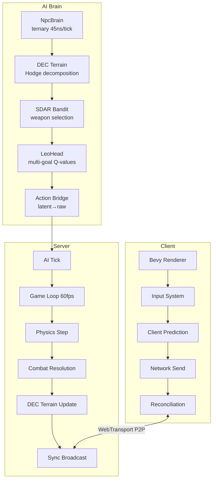

# Research 230: Worms Armageddon × Latent Space Artillery Game

**Date:** 2026-06
**Status:** 🟢 GAIN — Novel fusion of artillery physics AI with latent-space cognition
**Sources:**
- [WAAI — Worms Armageddon AI (Zemke)](https://github.com/Zemke/waai) — CV perception from replays
- [Game-based Platforms for AI Research (arXiv:2304.13269)](https://arxiv.org/abs/2304.13269) — 56+ game AI platforms survey
- [TNO DEC Operators (Research 219)](./219_Topological_Neural_Operators_DEC_Inference.md) — Topological spatial reasoning
**Context:** katgpt-rs modelless + riir-ai model-based, engine/fuel split, GOAT gate validation

---

## TL;DR

No one has combined artillery physics AI with latent-space cognition. WAAI does CV perception only. AIBIRDS does planning only. We'd do **both** with a clean raw/latent boundary using our existing stack: `SpatialBelief` (two-brain fog-of-war), `SDAR` sigmoid bandit (weapon selection), `G-Zero` (modelless self-play), DEC operators (terrain topology), and `BFCP` (zone attention). The game concept: Final Fantasy Tactics character classes playing on Worms Armageddon 2D destructible terrain with real-time multiplayer, chain economy, and AI opponents that *think in latent space*.

---

## 1. What Exists vs What's Needed

### 1.1 Our Stack (Already Built)

| Component | Location | Status | Maps To |
|-----------|----------|--------|---------|
| Bomber Arena | `katgpt-rs/src/pruners/bomber/` | ✅ 19 examples | Core game loop, bombs, 4-player FFA |
| FFT Tactics | `katgpt-rs/src/pruners/fft/` | ✅ Working | Character classes, abilities, terrain |
| `GameState` trait | `katgpt-rs-core/src/traits.rs` | ✅ Working | Forward model for MCTS |
| `SpatialBelief` | `riir-games/src/civ/` | ✅ Working | Two-brain fog-of-war |
| DEC Operators | `katgpt-rs-core/src/dec/` | ✅ Working | Terrain topology, Hodge decomposition |
| Flow Fields | `katgpt-rs-core/src/flow/` | ✅ Working | NPC navigation on terrain |
| `SdarBanditPruner` | `katgpt-rs/src/pruners/` | ✅ 118M calls/sec | Weapon/action selection |
| G-Zero Self-Play | `katgpt-rs/src/pruners/g_zero/` | ✅ 2.4T ops/sec | Modelless AI training |
| Game Sync | `riir-games/src/game_sync/` | ✅ 3-layer | Multiplayer state sync |
| Chain Economy | `riir-chain/` | ✅ Full DeFi | Token/R-token economy, wallets |
| P2P Networking | `riir-chaind/` | ✅ WebTransport | Real-time multiplayer transport |
| WASM Validators | `riir-wasm/` | ✅ Working | Anti-cheat, rule enforcement |
| `NpcBrain` | `katgpt-rs-core/src/sense/` | ✅ 45ns/tick | NPC cognition, ternary bit-plane |
| LeoHead Q-values | `katgpt-rs-core/src/traits.rs` | ✅ Working | Multi-goal evaluation |

### 1.2 Gap Analysis (What's Missing)

| Component | Gap | Effort | Priority |
|-----------|-----|--------|----------|
| Bevy rendering client | No renderer exists | High | P0 — game needs visuals |
| Physics engine (Rapier/Avian) | POC only | Medium | P0 — projectiles, terrain destruction |
| Real-time game loop | Turn-based only | Medium | P0 — 60fps tick |
| Client prediction + reconciliation | No prediction layer | Medium | P1 — multiplayer feel |
| Projectile trajectory sim | No physics sim | Low | P0 — core mechanic |
| Destructible terrain system | Tile maps only | Medium | P0 — core mechanic |
| Character class system | FFT exists as reference | Low | P1 — placeholder first |
| Asset pipeline | None | Low | P2 — placeholders first |

---

## 2. Game Design: Worms × FFT × Latent Space

### 2.1 Core Concept

**Final Fantasy Tactics character classes playing on Worms Armageddon 2D destructible terrain.**

- 2D side-view (like Worms) with destructible terrain
- Characters have FFT-style classes with unique abilities
- Real-time (not turn-based) — players move and act simultaneously
- 4 players, each controlling 1 character (or spectating AI)
- Terrain destruction creates tactical advantages (trenches, covers, bridges)
- Items/money drop at death positions, anyone can loot

### 2.2 Character Classes (Placeholder)

| Class | Primary | Range | Speed | Defense | Special |
|-------|---------|-------|-------|---------|---------|
| **Knight** | Sword (100% close) | Close→Mid (throw sword 50%, retrievable) | Slow | Shield (80% projectile, 20% sword) | 3 throwable knives |
| **Archer** | Bow (100% long range) | Long | Fast | Dodge (80% projectile, 20% sword) | 3 throwable knives |
| **White Mage** | Heal (AoE) | Mid | Medium | Barrier (absorb X damage) | Cure, Raise |
| **Black Mage** | Fire/Ice/Thunder | Mid-Long | Slow | Magic Shield (50% all) | AoE damage spells |
| **Ninja** | Shuriken (90% mid) | Mid | Very Fast | Evasion (70% all) | Smoke bomb, wall climb |
| **Bomber** | Bombs (3s fuse) | Mid (throwable) | Medium | Armor (60% explosion) | Place bomb, throw bomb |

### 2.3 Core Mechanics

1. **Projectile physics**: Wind affects trajectory. Gravity pulls. Terrain collision = destruction
2. **Destructible terrain**: Explosions and heavy attacks modify the landscape in real-time
3. **Bombs**: 3-second fuse (Bomberman-style). Players can throw them. Explosion destroys terrain
4. **Death → Loot**: Dead players drop R-tokens at death position. Anyone can pick up
5. **Real-time movement**: WASD/joystick for movement, mouse for aiming
6. **Class abilities**: Each class has unique primary + secondary abilities with cooldowns

### 2.4 Latent Space AI Design

Each AI-controlled character uses our existing latent-space cognition:

```
┌─────────────────────────────────────────────────┐
│                 NPC Latent Brain                 │
│                                                  │
│  ┌──────────┐  ┌──────────┐  ┌───────────────┐ │
│  │ Info Brain│  │Think Brain│  │ Action Bridge │ │
│  │ (raw MapPos│  │(SpatialBelief│ │ raw→latent→raw│ │
│  │  synced)   │  │ confidence  │  │ sigmoid gate  │ │
│  └──────┬─────┘  │ decay)      │  └───────┬───────┘ │
│         │        └──────┬──────┘          │         │
│         ▼               ▼                 ▼         │
│  ┌──────────────────────────────────────────┐      │
│  │         DEC Terrain Reasoning            │      │
│  │  d₀=gradient  d₁=curl  δ₁=divergence    │      │
│  │  Hodge: exact→goal coexact→patrol        │      │
│  │         harmonic→strategic routes         │      │
│  └──────────────────┬───────────────────────┘      │
│                     ▼                              │
│  ┌──────────────────────────────────────────┐      │
│  │      SDAR Bandit Weapon Selection         │      │
│  │  σ(β·gap) → sigmoid gate per ability     │      │
│  │  Reward: damage/position/survival         │      │
│  └──────────────────┬───────────────────────┘      │
│                     ▼                              │
│  ┌──────────────────────────────────────────┐      │
│  │      LeoHead Multi-Goal Evaluation        │      │
│  │  Goals: kill, survive, loot, positional   │      │
│  │  Q-values per goal, blended by priority   │      │
│  └──────────────────────────────────────────┘      │
└─────────────────────────────────────────────────┘
```

---

## 3. Novel Fusion Ideas

### 3.1 DEC Terrain Reasoning for Destructible Landscapes

**The insight**: When terrain is destroyed, the topology changes. DEC operators on cell complexes give us:

- **Gradient `d₀`**: "Where is the nearest cover?" — gradient of safety potential
- **Curl `d₁`**: "Where does threat circulate?" — camp detection, pincer movements
- **Divergence `δ₁`**: "Where is the fight converging?" — chokepoint detection
- **Harmonic modes**: "What routes survive regardless of destruction?" — strategic routes that exist even after explosions
- **Betti numbers**: Track how many "holes" exist in terrain (tunnels, caves) → update when terrain is destroyed

**Novel**: No artillery game uses topological reasoning for AI. DEC updates in real-time as terrain changes.

### 3.2 Two-Brain Projectile Prediction

**Info brain** (raw, synced): Real projectile positions, exact velocity vectors. Anti-cheat validated.

**Think brain** (latent, local): NPC's *belief* about where projectiles will land:
- `SpatialBelief` with `confidence = sigmoid(-λ * (tick - last_observed))`
- NPC dodges based on *belief*, not truth
- When terrain is destroyed between observation and prediction → belief diverges
- This is **correct emergent behavior** — NPC should act on outdated info until it sees the truth

**Bridge**: `raw_trajectory → latent_danger_score` via dot-product projection onto danger direction vectors. Zero-allocation. Sigmoid bounded.

### 3.3 SDAR Bandit for Adaptive Combat Style

Each AI character uses `SdarBanditPruner` to select abilities:
- **Arms**: Each ability is a bandit arm (sword swing, knife throw, shield block)
- **Reward**: damage dealt, position gained, survival time
- **σ(β·gap) gate**: Adapts exploration vs exploitation per ability
- **Absorb/compress**: Meta-learning across games — AI learns which abilities work in which terrain configurations
- **Novel**: No artillery game uses sigmoid-gated bandit for combat decisions

### 3.4 Conservation-by-Construction Game Physics

DEC identity `d∘d = 0` gives conservation laws for free:
- Resource flow: R-tokens in circulation = total minted - total burned
- Damage propagation: No damage appears from nowhere (anti-cheat)
- Terrain energy: Destruction follows physical conservation

### 3.5 Hodge-Decomposed NPC Navigation on Dynamic Terrain

After terrain destruction, NPCs decompose navigation into:
1. **Exact channel**: "Go toward the goal" — conservative gradient. Path-independent.
2. **Coexact channel**: "Patrol the new boundary" — divergence-free circulation around new holes
3. **Harmonic channel**: "Use the topology" — routes guaranteed by the new topology (new tunnels, new paths through destroyed walls)

This gives NPCs **three qualitatively different navigation behaviors** from a single decomposition — automatically adapting to terrain destruction.

---

## 4. Architecture

### 4.1 Crate Structure

```
riir-ai/crates/
├── riir-games/          # ✅ EXISTS — game domain logic
│   └── src/worms/       # NEW — worms arena game domain
│       ├── types.rs     # Worms-specific types (MapPos2D, Terrain, Character)
│       ├── arena.rs     # Core game loop (real-time tick)
│       ├── physics.rs   # Projectile trajectory, gravity, wind
│       ├── terrain.rs   # Destructible terrain (DEC cell complex)
│       ├── combat.rs    # Class abilities, damage, death→loot
│       ├── characters/  # Per-class behavior + stats
│       └── ai.rs        # AI player using SDAR + LeoHead + DEC
├── riir-game-client/    # NEW — Bevy rendering + input
│   ├── src/
│   │   ├── main.rs      # Bevy app entry
│   │   ├── renderer.rs  # 2D sprite rendering (placeholder assets)
│   │   ├── input.rs     # Input → game action mapping
│   │   ├── terrain.rs   # Terrain mesh + destruction viz
│   │   ├── network.rs   # Client prediction + reconciliation
│   │   └── ui.rs        # HUD, health bars, wind indicator
│   └── Cargo.toml       # bevy, rapier2d, riir-games deps
└── riir-chaind/         # ✅ EXISTS — P2P networking
    └── src/             # Add game protocol layer
```

### 4.2 System Architecture



### 4.3 Raw vs Latent Boundary

| Data | Space | Sync | Reason |
|------|-------|------|--------|
| `MapPos2D { x, y }` | Raw | Yes | Anti-cheat, deterministic replay |
| `Projectile { vx, vy, wind }` | Raw | Yes | Physics validation |
| `Terrain grid` | Raw | Yes | Deterministic terrain state |
| `HP, ammo, cooldowns` | Raw | Yes | Game state |
| `R-token balance` | Raw (chain) | Yes | Economic security |
| `Terrain topology` | Latent (DEC) | No | Local computation from raw terrain |
| `Danger score` | Latent | No | Bridge: raw trajectory → sigmoid |
| `Weapon preference` | Latent (SDAR) | No | Bandit state, local per-NPC |
| `Navigation intent` | Latent (Hodge) | No | Exact/coexact/harmonic decomposition |
| `Belief about enemy` | Latent (think brain) | No | SpatialBelief + confidence decay |

---

## 5. GOAT Gate Strategy

| Feature | Gate | Validation | Why |
|---------|------|-----------|-----|
| DEC terrain AI | `dec_terrain_ai` | A/B vs naive pathfinding | Novel — must prove gain |
| SDAR weapon selection | `sdar_weapon` | A/B vs random/heuristic | Already proved in bomber |
| Two-brain projectiles | `two_brain_projectile` | A/B vs perfect-info AI | Novel — measure emergent realism |
| Hodge navigation | `hodge_nav` | A/B vs A* on terrain | Prove DEC > naive after destruction |
| Client prediction | `client_prediction` | Latency test | Standard — no gate needed |

---

## 6. Commercial Strategy Alignment

Per [003 Verdict](./003_Commercial_Open_Source_Strategy_Verdict.md):

| Component | License | Reason |
|-----------|---------|--------|
| DEC operators | MIT (katgpt-rs) | Generic math — engine |
| Flow fields, SDAR, LeoHead | MIT (katgpt-rs) | Generic inference — engine |
| Game-specific types (worms/) | Private (riir-ai) | Game domain knowledge — fuel |
| Character class definitions | Private (riir-ai) | Game design — fuel |
| AI player configurations | Private (riir-ai) | NPC behavior tuning — fuel |
| Chain economy integration | Private (riir-ai) | Economic rules — fuel |

**Engine/fuel split is clean.** The game is a *proof* that the engine works — it showcases katgpt-rs modelless inference in an interactive, visual domain.

---

## 7. Performance Targets

| Metric | Target | Backend |
|--------|--------|---------|
| DEC terrain update (1000 cells) | < 100μs | SIMD |
| NPC AI tick (per character) | < 200μs | CPU (NpcBrain) |
| Projectile trajectory sim | < 50μs per frame | CPU scalar |
| Network sync (4 players) | < 5ms round-trip | WebTransport P2P |
| Terrain destruction render | < 16ms (60fps) | GPU (Bevy/wgpu) |
| Full game loop tick | < 2ms | CPU |

### CPU/SIMD/GPU Routing

| Task | Backend | Threshold |
|------|---------|-----------|
| DEC operators (< 1K cells) | CPU scalar | Under threshold |
| DEC operators (1K–10K) | SIMD | Normal game |
| DEC operators (> 10K) | GPU compute | Stress test |
| Ternary NpcBrain | CPU SIMD | Always |
| Physics sim | CPU scalar | Always |
| Rendering | GPU | Always |

---

## 8. What NOT to Do

1. **Don't build a game engine.** Use Bevy. Our value is AI + chain, not renderer.
2. **Don't over-engineer assets.** Placeholder rectangles with labels. Replace later.
3. **Don't train LLMs for this.** Modelless first. SDAR bandit + DEC operators + NpcBrain ternary.
4. **Don't use softmax anywhere.** Sigmoid for all decisions (weapon, dodge, threat assessment).
5. **Don't implement real graphics yet.** Mac native first, browser is future work.
6. **Don't skip the chain.** R-token economy, death→loot, wallets — this differentiates us.

---

## Research Rating

| Dimension | Score |
|-----------|-------|
| Novelty | ⭐⭐⭐⭐⭐ DEC + latent cognition for artillery AI is novel fusion |
| Rigor | ⭐⭐⭐⭐ Built on proven stack (DEC, SDAR, NpcBrain) |
| Relevance | ⭐⭐⭐⭐⭐ Directly showcases our entire AI + chain stack |
| Actionability | ⭐⭐⭐⭐ Bomber arena proved the pattern, extending to real-time is clear |
| Risk | ⭐⭐⭐ Medium — Bevy rendering + physics integration is new territory |

**Bottom line:** This game is a **live demo of our entire platform** — AI inference, DEC spatial reasoning, chain economy, P2P networking, and modelless self-play — wrapped in a playable game that's fun. The novel contribution is latent-space cognition for artillery physics AI, a genre with zero existing open benchmarks. Create plans for both katgpt-rs (modelless terrain AI) and riir-ai (game implementation).

---

## Related Internal Research

| Research | Connection |
|----------|-----------|
| 219 (TNO DEC Operators) | DEC operators on cell complexes for terrain reasoning |
| 047 (FFT Tactics) | Character class system foundation |
| 033 (Bomberman Arena) | 4-player FFA game loop foundation |
| 056 (GameState Forward Model) | MCTS + forward model trait |
| 072 (SDAR Distillation) | Sigmoid-gated bandit for weapon selection |
| 155 (LeoHead) | Multi-goal Q-value evaluation |
| 221 (KG Latent Octree) | Spatial sense for NPC cognition |

TL;DR: Worms × FFT × latent space = a playable proof that our modelless AI + chain stack works in real-time. DEC terrain reasoning, two-brain projectile prediction, SDAR weapon selection, and Hodge-decomposed navigation are all novel fusions for artillery AI. Create plans for katgpt-rs (terrain AI primitives) and riir-ai (game client + domain).
