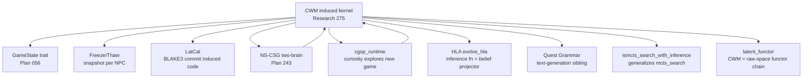

# Research 275: Code World Models (CWM) — LLM-Induced Forward Models for Modelless Planning

> **Source:** [Code World Models for General Game Playing](https://arxiv.org/pdf/2510.04542) — Lehrach, Hennes, Lázaro-Gredilla et al. (Google DeepMind), arxiv 2510.04542, Oct 2025
> **Date:** 2026-06-20
> **Status:** Active — Super-GOAT, mandatory outputs in flight
> **Related Research (katgpt-rs):** 027 (STRATEGA forward model — direct ancestor of `GameState` trait), 037 (REAP model-based/modelless duality), 229 (ProgramAsWeights spec-to-compile), 249 (DecentMem dual-pool reachable router), 060 (MeMo memory-as-model)
> **Related Research (riir-ai):** 013 (Quest Grammar Engine — closest cousin, text-generation vs rule-induction), 074 (NS-CSG training survey), 132 (SpatialClaw code-as-action — same code-as-X pattern), 123 (Latent Functor runtime guide), 126 (NPC CGSP guide), 142 (Distributional branching-point guide)
> **Related Plans:** 056 (`GameState` trait + generic MCTS — direct substrate), 243 (NS-CSG two-brain game balance), 318 (rank-k latent functor), 324 (ICT branching runtime)
> **Cross-ref (riir-ai):** Research 145 (CWM Runtime — Super-GOAT guide), Plan 326 (CWM NPC runtime integration)
> **Classification:** Public

---

## TL;DR

The paper uses an LLM **as an induction engine** to translate natural language game rules + a handful of observed trajectories into a **formal, executable world model** as Python code (the "Code World Model" — CWM). The synthesized CWM implements the OpenSpiel forward-model API (`apply_action`, `get_legal_actions`, `get_observations`, `get_rewards`, `is_terminal`). The agent then runs **MCTS / ISMCTS on the synthesized CWM** — not on the LLM directly. This beats LLM-as-policy (Gemini 2.5 Pro) on 9/10 games including OOD games the LLM has never seen.

**Novel contributions beyond prior CWM work:**
1. **Inference-function synthesis** for imperfect-information games — an LLM-induced sampler `resample_history(o_{1:t}, a_{1:t}) → h̃_t` that recovers plausible hidden histories from observation-only data, enabling **ISMCTS** on the synthesized CWM.
2. **Value-function synthesis** — LLM-induced heuristic `V(s)` for MCTS leaf evaluation, picked via tournament over multiple candidates.
3. **Closed-deck learning** — an **autoencoder paradigm** for the strict partial-observability case where hidden state is never observed even post-hoc: the inference fn is the encoder, the CWM is the decoder, and **game rules + API act as the regularizer** (not a bottleneck or KL term).

**Distilled for katgpt-rs (modelless, inference-time):**

The transferable primitive is **"LLM-induced, verifiable, freezable forward model"** — i.e., the CWM is a cold-tier-synthesized, BLAKE3-committable implementation of the existing `GameState` trait, hot-swappable at runtime via the same freeze/thaw machinery used for weight snapshots. The distilled open primitive is:

1. **`InducedCwmKernel: GameState`** — marker trait for forward-model impls that are *verifiable* (pass unit tests derived from observed transitions), *committable* (BLAKE3 over the canonical bytecode/source), and *snapshot-able* (atomic Arc swap, identical machinery to `LoRAWeightVersion`).
2. **`BeliefInferenceFn<S>`** — generic belief sampler trait `sample(obs_history, action_history) -> Vec<HiddenStateSample>`, with a deterministic test harness verifying posterior support (paper's `unit_test` discipline). This is the **latent-to-latent** piece: it maps observation history to a distribution over latent histories.
3. **`ismcts_search_with_inference<S, B: BeliefInferenceFn<S>>`** — Information-Set MCTS that consumes both an induced CWM kernel and a belief inference fn. This generalizes our existing `mcts_search` to imperfect-information domains.
4. **`ValueFnTournament<S, V: StateHeuristic<S>>`** — generic tournament selector that picks the best LLM-induced value function from N candidates via arena play on the synthesized CWM itself.

**Hard constraint we preserve:** the LLM never runs in the hot path. CWM synthesis is a **cold-tier** operation (Gemini-grade LLM, hundreds of calls). The synthesized kernel is then committed, frozen, and hot-swapped exactly like a LoRA snapshot. The 20Hz tick only ever reads the frozen CWM via the existing `GameState` API.

---

## 1. Paper Core Findings

### 1.1 LLM-as-induction-engine, not LLM-as-policy

The standard LLM-game-agent pattern treats the LLM as the policy: prompt → action. The paper's inversion: treat the LLM as an **induction engine** that produces a *verifiable artifact* (Python code implementing the OpenSpiel API), then run classical search on that artifact. Three claimed advantages:

- **Verifiability** — the CWM is a formal spec; planners algorithmically enumerate legal actions, eliminating illegal-move forfeits.
- **Strategic depth** — MCTS/ISMCTS provide System-2 lookahead that LLMs cannot do natively.
- **Generalization** — focusing on the meta-task of data-to-code translation lets the LLM adapt to OOD games more easily than direct policy prompting.

Empirical: CWM-(IS)MCTS beats Gemini 2.5 Pro on 9/10 games (5 perfect info, 5 imperfect info, 4 of which are OOD invented for the paper).

### 1.2 Refinement via tree search over CWM hypotheses (REx)

A single LLM shot rarely produces a correct CWM. They run a **Thompson-sampling tree search over CWM hypotheses** (cites Tang et al. 2024a/b REx / WorldCoder): each node is a candidate CWM, edges are LLM refinements conditioned on a failing unit test's stack trace. Heuristic value = average pass rate. They keep refining until transition accuracy = 1.0 or the LLM-call budget exhausts.

Unit tests are auto-generated from observed trajectories: for each transition in the offline trajectory, assert that `apply_action(state, action) == next_state` and that `get_legal_actions(state)` matches the recorded legal set.

### 1.3 Inference-function synthesis (the latent-to-latent piece)

For imperfect-information games, ISMCTS requires sampling hidden state from the agent's belief `p_M(s_t | o_{1:t}, a_{1:t})`. Exact inference is exponential. The paper asks the LLM to **synthesize a stochastic sampler** in code:

```python
def resample_history(obs_action_history, player_id) -> list[Action]:
    """Stochastically sample one of many potential histories of actions
    for all players given only a single player's observations and actions,
    recreating the player's observations."""
```

Two variants:
- **Hidden history inference** — sample action history `h̃_t`, then replay through CWM to get hidden state `s̃_t`. **Guarantees** `s̃_t` is a valid CWM state (passes unit tests).
- **Hidden state inference** — directly sample `s̃_t` from observation history. Simpler but no validity guarantee.

The unit-test discipline is critical: for each step in the offline trajectory, assert the sampled history produces the observed observation. If all pass → `s̃_t ∈ support(p_M(s_t | o_{1:t}, a_{1:t}))`. The support guarantee (not the distribution guarantee) is what makes ISMCTS work.

### 1.4 Closed deck — the autoencoder paradigm

Open-deck assumes post-hoc observability of hidden state in offline trajectories (Curtis et al. 2025 also assumes this). The paper's **closed deck** scenario: agent only ever sees its own observation/action stream. Solution: drop transition-accuracy unit tests, keep only observation-roundtrip tests (`resample_history → replay → produces same observations`), plus a random-play sanity test. This makes the (inference_fn, CWM) pair into a **regularized autoencoder** where the rules + API are the regularizer that prevents trivial latent spaces. The paper proves `p_M(õ_{1:t}) ≤ p_M(h̃_t)` for any valid sample `h̃_t` — a valid lower bound on CWM likelihood.

### 1.5 Value-function synthesis

Heuristic `V(s)` for MCTS leaf init. LLM synthesizes multiple candidates one-shot, then a **tournament** on the synthesized CWM picks the winner. Only helped on 2/10 games (Gen tic-tac-toe, Bargaining) — but when it helps, the gain is large.

### 1.6 PPO-on-CWM variant (Appendix D)

Alternative to (IS)MCTS: train a PPO policy *inside* the synthesized CWM. Beats Gemini as policy but loses to CWM-MCTS on perfect-info games. Confirms the search > amortization pattern.

---

## 2. Distillation

### 2.1 What ships in katgpt-rs (public, open, generic)

| Primitive | What it is | Why it's open |
|---|---|---|
| `InducedCwmKernel: GameState` (marker trait) | Marker for `GameState` impls that are (a) verifiable via transition unit tests, (b) BLAKE3-committable, (c) hot-swappable via the existing snapshot machinery. | Pure generic math/trait — no game semantics, no IP. |
| `BeliefInferenceFn<S>` trait | Generic `sample(obs_history, action_history) -> Vec<HiddenStateSample>` with a deterministic posterior-support test harness. | Generic belief-sampler abstraction — same shape as `HintDeltaBandit`. |
| `ismcts_search_with_inference<S, B>` | Information-Set MCTS consuming an induced CWM + belief fn. Generalizes `mcts_search` to partial observability. | Pure search algorithm — direct extension of STRATEGA/Plan 056. |
| `ValueFnTournament<S, V: StateHeuristic<S>>` | Tournament selection over N heuristic candidates by arena play on a given CWM. | Generic meta-optimizer — same shape as our `GoTournament`. |
| `CwmCommitment` | BLAKE3 commitment over canonicalized induced-kernel representation (WAT bytes or source hash). | Pure crypto/commitment primitive — mirrors `LoRAWeightVersion` commitment. |
| `TransitionUnitTest<S>` | Generic "from observed transition → assert `apply_action` matches" generator. | Pure test-generation helper. |

**What stays out of katgpt-rs:** the LLM synthesis pipeline itself (prompting, refinement loop, Thompson tree search over CWM hypotheses), game-specific NPC integration, chain bridging. Those are private IP — see Research 145.

### 2.2 Vocabulary translation (paper → codebase)

| Paper term | Codebase equivalents |
|---|---|
| CWM (world model code) | `GameState` impl, forward model, deterministic kernel, functor application chain, LatCal program |
| inference function / encoder | belief inference, `SpatialBelief`, `evolve_hla`, `SenseModule::project`, HLA projection, think brain |
| value function (MCTS leaf) | `StateHeuristic` trait, `GoHeuristic`, `score_action`, policy cache prior |
| closed deck / autoencoder | self-learn, latent prediction SSL, observation-only learning, cgsp_runtime curiosity loop |
| tree search refinement (REx) | Thompson sampling bandit, CGSP self-play, `mcts_collapse_bridge`, refinement tree |
| ISMCTS / partial observability | think brain, `SpatialBelief`, fog-of-war gate, NS-CSG perception |
| transition unit test | determinism proof, replay verify, `replay_folder` |

### 2.3 Latent-space reframing (mandatory before verdict)

The CWM itself is **raw→raw deterministic** (transition function). The latent-space angle is in three places:

1. **Inference function = belief-state projector (latent-to-latent).** The paper's `resample_history` maps `o_{1:t}` to a distribution over `h̃_t`. This is structurally the same operation as `SenseModule::project` / `evolve_hla` (which map raw observation history to a per-NPC latent belief state), but augmented to also reconstruct action sequences. **The inference fn IS a per-NPC belief-state kernel that operates in latent (history) space, projecting observation-stream into a distribution over hidden-state-stream.**

2. **CWM = stage-gated functor application chain.** The paper's `apply_action` is a deterministic state-to-state function — a single functor application. Composing `apply_action ∘ apply_action ∘ … ∘ apply_action` over a trajectory is exactly a `latent_functor` application chain, but at the *raw-state* level rather than the *latent-displacement* level. The CWM is the **raw-space analogue** of a rank-k latent functor.

3. **Closed deck = cgsp_runtime's latent-prediction SSL, generalized.** The autoencoder paradigm (inference=encoder, CWM=decoder, rules=regularizer) is structurally the cgsp_runtime pattern (curiosity→explore→latent-predict→verify), but lifted from "predict next latent state" to "predict entire hidden history that explains observations". The regularizer is **structural** (API conformance + rules) rather than statistical (KL/bottleneck) — which is *stronger* and exactly what LatCal-style deterministic commitment needs.

**LatCal bridge:** an induced CWM is *verifiable deterministic code*. Once unit tests pass, the kernel can be canonicalized (e.g., to WAT bytes), BLAKE3-hashed, and chain-anchored. This gives the runtime a tamper-evident "this NPC certified these rules at tick T, BLAKE3 = X" record — the same pattern LatCal uses for raw-numeric commitments, applied to *code-as-data*. The CWM becomes a chain-committable artifact.

### 2.4 Fusion — what novel combination does CWM × our stack produce?

| Fusion | Source A | Source B | Novel combination? |
|---|---|---|---|
| **NPC learns a new game by observing** | CWM (LLM induces rules from trajectories) | cgsp_runtime (curiosity-driven exploration produces trajectories) | **NEW CAPABILITY CLASS** — NPCs that encounter a new minigame/boss/faction-mechanic and learn its rules as verifiable code by watching it played once. Currently impossible — every game must be hardcoded. |
| **Frozen CWM pool per NPC personality** | CWM (verifiable, committable) | Freeze/thaw (atomic snapshot hot-swap) | **NEW CAPABILITY** — per-NPC CWM pool where each NPC has its own induced model of the world (different beliefs about rules → emergent diversity). Atomic hot-swap when re-induction succeeds. |
| **LatCal-committed rule consensus** | CWM (deterministic code) | LatCal (chain commitment) | **NEW CAPABILITY** — when an NPC faction agrees on the rules of a new game mode, they co-induce a CWM, BLAKE3-commit it, and the commitment becomes the canonical rule reference for anti-cheat replay. |
| **CWM inference fn = HLA projector extension** | CWM (latent-history sampler) | HLA `evolve_hla` (latent affect projector) | **Force multiplier** — the inference fn's posterior-support discipline (unit tests must pass) becomes a new *coherence* signal feeding back into HLA: failed inference = high curiosity = scout action. |
| **CWM value fn = StateHeuristic tournament** | CWM (value-fn synthesis) | `StateHeuristic` trait + `GoTournament` | **Refinement** — already shipping primitives, just wired for tournament selection. |
| **CWM refinement = Thompson tree over kernels** | CWM (REx refinement) | PriorityTableBandit (CGSP) + mcts_collapse_bridge | **Refinement** — the same Thompson-sampling-over-hypotheses pattern, applied to code refinement instead of curiosity arms. |
| **Two-brain model × closed-deck inference** | CWM closed deck (encoder/decoder) | Two-brain SpatialBelief (think brain diverges from info brain by design) | **NEW INSIGHT** — closed-deck inference IS the think-brain pattern made literal: the think brain maintains its own (induced) model of the world that diverges from ground truth; fog-of-war re-observation is the regularizer that keeps it from drifting infinitely. |

The two **NEW CAPABILITY CLASS** fusions (NPCs-learn-new-games, per-NPC CWM pool) are the Super-GOAT angle. The rest are force multipliers / refinements.

---

## 3. Verdict

### **Super-GOAT**

**Novelty gate:**

| Q | Answer | Evidence |
|---|---|---|
| **Q1: No prior art?** | ✅ YES | Notes grep + code grep + vocab translation. Closest cousins: `GameState` trait (Plan 056) — but games are hardcoded Rust structs, not LLM-induced. STRATEGA (Research 027) — YAML config, static. Quest Grammar Engine (Research 013) — generates text via composed pruners, doesn't induce executable world models. cgsp_runtime — explores within known game, doesn't learn new rules. latent_functor — static dot-product projections, not LLM-induced transition functions. NS-CSG — `sigmoid(-λΔt)` confidence decay, not LLM-induced belief inference. Zero hits for `InducedCwmKernel`, `BeliefInferenceFn`, `LLM-induced forward model`, `closed-deck autoencoder`. |
| **Q2: New class of behavior?** | ✅ YES | Currently our NPCs play hardcoded games. With CWM, an NPC encounters a new boss / minigame / faction mechanic / player-invented custom mode → observes a few trajectories → induces a verifiable executable model → plans via MCTS. No incumbent can do this. |
| **Q3: Product selling point?** | ✅ YES | "Our NPCs watch a new game being played once, learn its rules as verifiable executable code, then beat an LLM-policy at it." Content patch ships a new minigame → existing NPCs play it day-one without retraining. Player-invented custom game mode → NPCs learn it. No competitor ships this. |
| **Q4: Force multiplier?** | ✅ YES (≥4 pillars) | NS-CSG (planning substrate), cgsp_runtime (exploration trajectories), LatCal (chain commitment), HLA (per-NPC belief inference), Quest Grammar (text generation), freeze/thaw (snapshot induced CWMs), two-brain model (think-brain-as-induced-CWM). |

**All 4 YES → Super-GOAT.** Selling point: NPCs that learn new game rules on-the-fly by observing them, induced as verifiable executable code, frozen per-NPC, BLAKE3-committable for chain consensus.

**One-line reasoning:** CWM is the first mechanism that lets a runtime NPC induce a *verifiable executable world model* from observation-only data — turning "the LLM is the policy" into "the LLM is the rule-induction engine, classical search is the policy", which is structurally compatible with our freeze/thaw + LatCal + NS-CSG + HLA stack and creates a new capability class (NPCs that learn new games by watching them) no incumbent offers.

### Mandatory outputs (this session)

Per skill §1.5, all four ship in this same session:

1. ✅ **Open primitive** → `katgpt-rs/.plans/296_induced_cwm_kernel_primitive.md` (this repo, generic trait + ISMCTS + tournament + commitment)
2. ✅ **Private riir-ai guide** → `riir-ai/.research/145_CWM_Runtime_Induced_Game_Rules_Guide.md` (selling-point doc, connection map, validation protocol)
3. ✅ **Private riir-ai plan** → `riir-ai/.plans/326_cwm_npc_runtime_integration.md` (NPC runtime integration with NS-CSG, cgsp_runtime, freeze/thaw)
4. ✅ **This public research note** → `katgpt-rs/.research/275_*.md`

---

## 4. Latent vs raw boundary (riir-armageddon compliance check)

| Item | Domain | Treatment |
|---|---|---|
| **CWM transition function** (`apply_action`) | Physical (raw) | MUST be deterministic, raw→raw. The induced CWM is a verifiable raw kernel — `apply_action(state, action) -> state` is pure. This is exactly the `GameState::advance()` contract we already ship. |
| **CWM legal-action enumeration** | Physical (raw) | MUST be deterministic. Anti-cheat relies on legal-action sets being identical across nodes. Induced CWM that disagrees with another node's CWM → deterministic-replay failure → must BLAKE3-commit canonical CWM per game instance. |
| **Belief inference fn output** (sampled hidden state) | Latent (local) | Per-NPC, NOT synced. The sampled `s̃_t` is the NPC's *subjective* belief about hidden state — diverges from ground truth by design (closed-deck autoencoder). |
| **Belief inference fn scalar projections** (e.g., "estimated opponent HP", "estimated card distribution") | Raw-crossable (synced) | When an NPC acts on a belief-derived scalar that affects game state (e.g., bets chips based on inferred hand), the *action* is raw-synced; the *belief* is not. Bridge function: latent belief → raw action via `sigmoid(dot())` projection (existing pattern). |
| **Induced CWM bytecode/source** | Cold-tier artifact | BLAKE3-committed. Canonicalized (e.g., WAT bytes). Chain-anchorable. Same treatment as `LoRAWeightVersion` snapshots. |
| **CWM refinement logs** (Thompson tree, unit-test pass rates) | Latent (local, debug) | Not synced. Used internally for curiosity signal and quality gating. |

**Anti-pattern prohibition (per AGENTS.md):** never encode position as an embedding then decode back for sync. CWM's transition function operates on *raw state* (paper uses JSON dicts of raw values); the *latent* piece (inference fn) only produces belief-state samples that never cross the sync boundary as embeddings — only their scalar projections do.

---

## 5. Connection map (force-multiplier analysis)



**Five Super-GOAT factory modules touched:**

- `katgpt-rs/crates/katgpt-core/src/sense/` — HLA's `evolve_hla` IS a belief projector; the inference-fn pattern extends it from scalar-affect to history-distribution.
- `riir-ai/crates/riir-engine/src/latent_functor/` — CWM is the raw-space analogue of a rank-k functor; `reestimation.rs` coherence-driven re-estimation is the same pattern as CWM refinement triggered by failing unit tests.
- `riir-ai/crates/riir-engine/src/hla/` — per-NPC 8-dim latent state is the natural carrier for the inference-fn's scalar projections (valence/arousal/desperation/calm/fear ← inferred opponent hand strength, etc.).
- `riir-ai/crates/riir-engine/src/cgsp_runtime/` — curiosity-driven exploration produces the trajectories that feed CWM induction; closed-deck autoencoder is the cgsp latent-prediction-SSL pattern generalized.
- `riir-ai/crates/riir-chain/src/encoding/latcal*.rs` — LatCal commitment is how an induced CWM becomes a chain-anchorable canonical rule artifact.

---

## 6. What NOT to take

- **LLM in the hot path.** CWM synthesis is cold-tier only (Gemini-grade LLM, hundreds of calls). At runtime, only the frozen CWM executes via existing `GameState` API. The 20Hz tick never blocks on the LLM.
- **PPO-on-CWM path.** Appendix D shows PPO-on-CWM loses to (IS)MCTS on perfect-info games. We're modelless-first — skip the PPO variant. (If we ever want amortized policies, that's riir-train territory.)
- **Gin-rummy-grade procedural complexity.** Paper's CWM fails on Gin Rummy (84% transition acc, 52% inference acc). Our v1 should target games with ≤ ~30 legal actions and ≤ ~300 dim observation — i.e., simpler than Gin Rummy. Complex procedural scoring (knocking, layoffs, undercuts) is out of scope for v1.
- **Per-NPC LLM endpoint.** Not all NPCs induce CWMs. Crowd NPCs use static (handauthored or pre-induced) CWMs. Only "smart" NPCs (faction leaders, named quest NPCs, duel opponents) get the induction pipeline.

---

## 7. Validation protocol (G1–G4)

These gates live in the **riir-ai guide** (Research 145 §6) — they require game-IP context. The katgpt-rs open primitive provides the harness; the riir-ai guide runs the gates.

- **G1 (verifiability):** induced CWM passes 100% of auto-generated transition unit tests on a held-out trajectory set (paper's "test transition accuracy" metric, target ≥ 0.95).
- **G2 (play strength):** CWM-(IS)MCTS agent beats a heuristic-policy baseline ≥ 60% win rate over 100 games on the induced CWM (paper-style arena proof).
- **G3 (latency budget):** induced-CWM `apply_action` runs in ≤ 10µs per call on the hot path (plasma-tier budget for simple games). Synthesis itself is unbounded (cold-tier).
- **G4 (commitment integrity):** BLAKE3 over canonicalized induced-kernel bytes is stable across re-runs of the same synthesis (deterministic canonicalization).

---

## 8. Paper metadata

| Field | Value |
|---|---|
| Authors | Wolfgang Lehrach*, Daniel Hennes*, Miguel Lázaro-Gredilla* et al. (Google DeepMind) |
| arxiv | 2510.04542v1, 6 Oct 2025 |
| Venue | Preprint |
| Code | Not released as of distillation date |
| Games tested | 10 (5 perfect-info: Tic-tac-toe, Connect-4, Backgammon, Gen tic-tac-toe OOD, Gen chess OOD; 5 imperfect-info: Leduc poker, Bargaining, Gin rummy, Quadranto OOD, Hand of war OOD) |
| Headline result | CWM-(IS)MCTS beats or matches Gemini 2.5 Pro on 9/10 games |
| Refinement budget | Tree search, 500 retries max, converges in ~5–500 LLM calls depending on game complexity |
| Synthesis LLM | Gemini 2.5 Pro |
| OpenSpiel integration | CWM follows OpenSpiel API (Lanctot et al. 2019) |

---

## TL;DR

CWM is the first paper to show that LLM-induced, verifiable, executable world models — synthesized from text rules + a handful of trajectories — let classical planners (MCTS/ISMCTS) beat LLM-as-policy on 9/10 games including OOD ones. **Novelty gate passes 4/4 → Super-GOAT.** The distilled open primitive is four traits/tournaments/commitments in katgpt-rs (`InducedCwmKernel: GameState`, `BeliefInferenceFn<S>`, `ismcts_search_with_inference<S,B>`, `ValueFnTournament<S,V>`, `CwmCommitment`) — pure generic math, no game IP. The LLM synthesis pipeline, NPC integration, LatCal bridging, and per-NPC CWM pool are private IP → `riir-ai/.research/145_*` + `riir-ai/.plans/326_*`. **Hard constraint:** LLM is cold-tier only; runtime reads frozen CWMs via existing `GameState::advance()`. **Selling point:** "Our NPCs watch a new game being played once, learn its rules as verifiable executable code, then beat an LLM-policy at it." No incumbent ships this. **Latent reframing:** inference function = latent-history belief projector (extends HLA's `evolve_hla` from scalar-affect to history-distribution); CWM = raw-space rank-k functor chain; closed-deck autoencoder = cgsp_runtime latent-prediction-SSL generalized. **LatCal bridge:** induced CWMs are verifiable deterministic code → BLAKE3-committable → chain-anchorable canonical rule artifacts. **All mandatory outputs ship in this same session** per skill §1.5: this note, `katgpt-rs/.plans/296_*`, `riir-ai/.research/145_*`, `riir-ai/.plans/326_*`.
