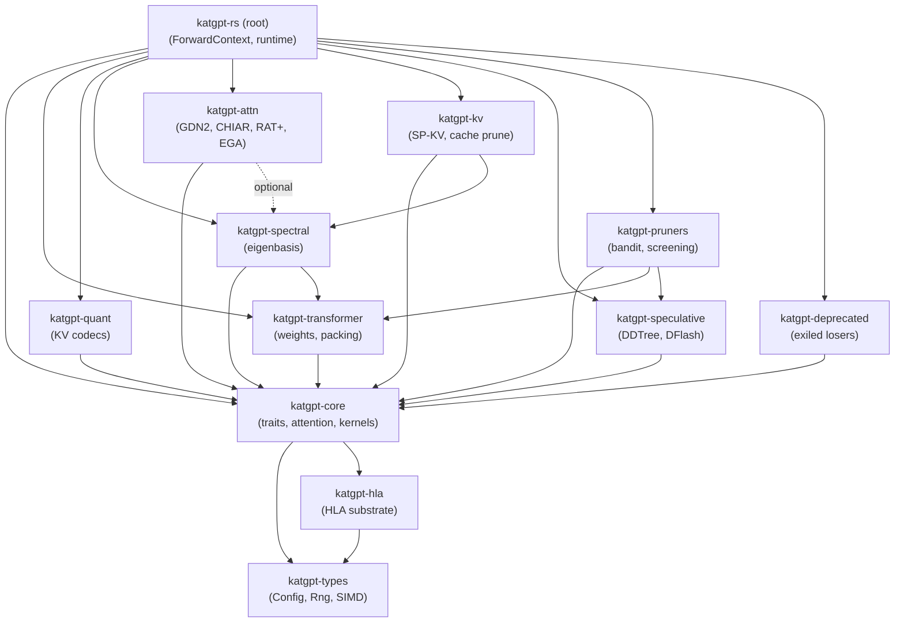
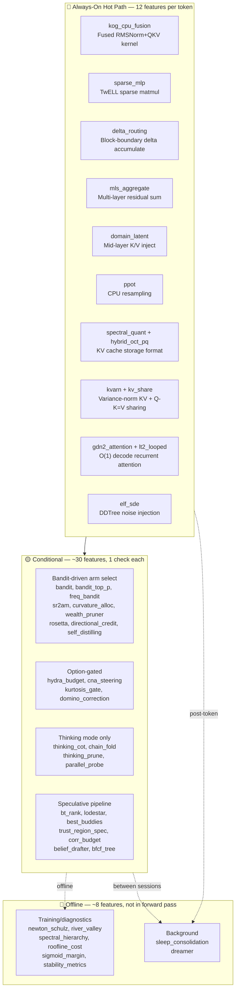
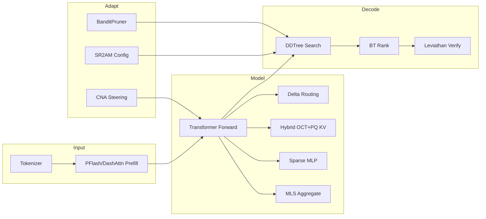
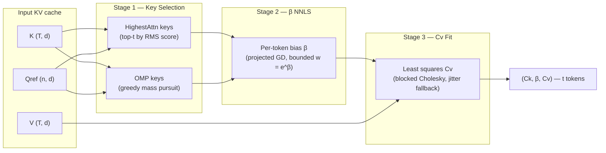
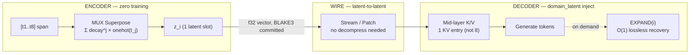
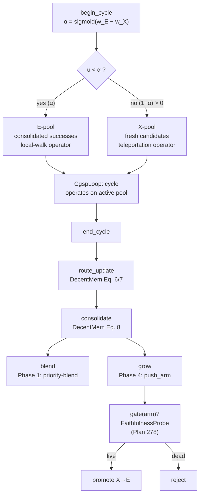
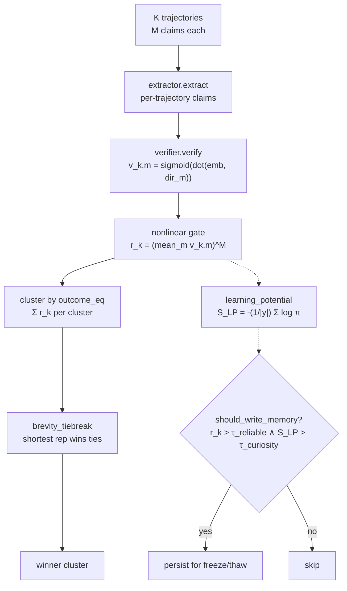
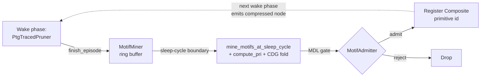

# KatGPT-RS

A **GOAT-proved** neuro-symbolic micro-Transformer with speculative decoding, constraint pruning, and **359 feature flags (147 default-on, all GOAT-proved)** — built in Rust. Pure algorithms, zero side effects, MIT licensed.

Inspired by [Andrej Karpathy's microgpt](https://karpathy.github.io/2026/02/12/microgpt/).


## 🚀 Key Results

| Result | Number | Feature |
|--------|--------|---------|
| **TTFT Speedup** | **29×** (X16 compression) | MUX-Latent zero-training context compression |
| **KV Memory Reduction** | **93.8%** | MUX superposition fusion |
| **Prefill Seq Reduction** | **21×**, 100% NIAH retrieval | PFlash block-sparse prefill |
| **KV Rotation FMAs** | **64× fewer**, best MSE | Hybrid OCT+PQ codec |
| **RMSNorm Speedup** | **2.4×** | Kog CPU fusion kernel |
| **Sudoku Compression** | **7,079×** on Inkala's Hardest | Path-aware ConstraintPruner |
| **Bomber HL Score** | **+177** vs Random −55 | Adaptive intelligence arena proof |
| **NFSP/MCTS Duality** | **75%** vs MCTS 8% | Bandit-guided backward→forward search |
| **BoM Belief Sampling** | **+31.49pp** arena win rate (K=8 @ 1.87× step) | Single-pass K-hypothesis belief sampling |
| **Self-Advantage Gate** | **18× forward-pass reduction** (paper claim) | Dead-compute detector via pre/post log-ratio |
| **Temporal Derivative** | **4/4 fusion gates PASS** (HLA, δ-Mem, collapse, curiosity) | Dual fast/slow EMA surprise signal |
| **Triggered Injection** | **50% skips @ 0.63% quality delta** | Sigmoid-thresholded inject/skip hot-path gate |
| **KARC Trajectory Forecast** | **NRMSE 1.67e-4** (6× better than paper target 5.3e-4) | Delay-basis ridge forecaster (Plan 308 Phase 2 R=2 higher-order) |
| **Latent Field Steering** | **1.50× fear-axis shift**, ≤4.5e-5 leakage | Top-down direction-vector injection (Plan 309) |
| **Cross-Resolution Transport** | **0.9300 mean cos rank preservation** (16→256 tier transfer) | Train-small-deploy-large asymmetric-basis FUNCATTN (Plan 310) |
| **Manifold Walk Viability** | **100% playability** vs free 74.2% (paper's SMB headline reproduced); **7.10 ns/step** post-CSR (68.4× speedup, 14× under target) | Viable Manifold Graph safe-navigation (Plan 312, DEFAULT-ON) |
| **AC-Prefix Modelless G1** | **0.0 diff** (bit-identical to iterative-MLM) via `attends_dedup`; **27.258× speedup** vs 64 iterative forwards | §3.5 modelless unblock of AC-GPT arbitrary-conditional eval (Plan 313, DEFAULT-ON) |

## 🏗️ Architecture

Matching the talos-vs-macbook reference model:

| Parameter | Value |
|-----------|-------|
| `vocab_size` | 27 (a–z + BOS) |
| `block_size` | 16 |
| `n_embd` | 16 |
| `n_head` | 4 |
| `mlp_hidden` | 64 (4×) |
| `n_layer` | 1 |
| `temperature` | 0.5 |
| `ModelArchitecture` | `NanoGpt`, `QwenDeltaNet` |
| `AttentionMode` | `Standard`, `SpKvQuant`, `DashAttn` |
| `WeightDtype` | `F32`, `F16`, `BF16` |

### Core Pipeline

```
LLM drafts logits → ConstraintPruner filters invalid → DDTree builds valid-only tree → Target verifies
```

### Key Traits

```rust
// From katgpt-core/src/traits.rs (signatures abbreviated)
pub trait ConstraintPruner: Send + Sync {
    fn is_valid(&self, depth: usize, token_idx: usize, parent_tokens: &[usize]) -> bool;
    fn batch_is_valid(&self, depth: usize, tokens: &[usize], parent_tokens: &[usize], out: &mut [bool]);
    fn propagate(&self, depth: usize, token_idx: usize, parent_tokens: &[usize]) { }
    fn manifold_score(&self, depth: usize, token_idx: usize, parent_tokens: &[usize]) -> f32 { 0.0 }
    fn constraint_vector(&self, depth: usize, parent_tokens: &[usize]) -> Vec<f32> { vec![] }
}

pub trait ScreeningPruner: Send + Sync {
    fn relevance(&self, depth: usize, token_idx: usize, parent_tokens: &[usize]) -> f32;
}

pub trait SpeculativeGenerator {
    type Condition;
    type Output;
    type Error;
    fn generate(&mut self, condition: &Self::Condition, rng: &mut fastrand::Rng) -> Result<Vec<Self::Output>, Self::Error>;
    fn generate_batch(&mut self, conditions: &[Self::Condition], rng: &mut fastrand::Rng) -> Result<Vec<Vec<Self::Output>>, Self::Error>;
}
```

Additional core traits in `katgpt-core/src/traits.rs`: `DominoPruner`, `CompletionHorizon`, `CollapseDetector`, `GameState`, `StateHeuristic`, `RolloutPolicy`, `LeoHead`, `AllGoalsUpdate`, `DualLeoMixer`, `AutocurriculumSampler`, `GenerativeConstraintPruner`, `QGradientOracle`, `PartialScorer`, `ProblemMutator`, `BestBuddyAligner`. Plus `DataGate` in `types.rs`. See [`crates/katgpt-core/src/traits.rs`](crates/katgpt-core/src/traits.rs) for full signatures.

### Routing & Conditioning

- **Prompt Router** — `KeywordRouter` scores prompt against domain keywords, `ExpertRegistry` selects `ScreeningPruner` + LoRA. `InferenceBackend` trait + `CpuBackend` for backend abstraction.
- **TriggerGate** — Adaptive tier promotion: CPU → GPU → ANE based on workload complexity.
- **Embedding Router** — Three-tier fallback: embedding search → domain classify → keyword (local).
- **Bidirectional Prefill** — Prompt tokens attend to ALL other prompt tokens (no causal mask during prefill).
- **Modality LoRA Switching** — `reader_lora` active during prefill, `writer_lora` active during decode. Reference swap, zero data movement.
- **PPoT** — Logit-parameterized CPU resampling on failure. Zero overhead on success path.

### Crate Dependency DAG

The workspace is layered: `katgpt-types` is the shared leaf (Config, Rng, SIMD),
`katgpt-core` builds on it (traits, attention primitives, cognitive kernels),
and domain crates build on core. The root crate (`katgpt-rs`) is the
feature-aggregation surface — it wires every domain crate into the
transformer runtime via `ForwardContext`.



**Dependency rules:**
- Arrows point from consumer → dependency.
- Dashed = optional feature-gated dep.
- `katgpt-core` attention primitives (`attention`, `parallax_attn`, `set_attention`,
  `funcattn`) live in core and are NOT in `katgpt-attn` — they can't move up
   without inverting the DAG.
- HLA substrate lives in `katgpt-hla` (leaf); `katgpt-core` re-exports it as
  `katgpt_core::hla`. The root's `src/hla/forward.rs` is pure composition glue.

## 🔄 E2E Inference Flow — Default GOAT Stack

The default production stack has **147 GOAT-proved default-on features** (359 total flags), but they don't all run on every token. The architecture uses **layered gating** — most features are bandit-driven, Option-gated, or compile-time-only.



### 🔴 Always-On Hot Path (12 Features)

These execute unconditionally on every token — they replace kernels, formats, or accumulate state:

| Feature | What | Why Always-On |
|---------|------|---------------|
| **`sparse_mlp`** | Skip dead ReLU in w2 matmul | Replaces dense matmul kernel |
| **`kog_cpu_fusion`** | RMSNorm gamma folding + QKV interleaving | Fused kernel replacement |
| **`delta_routing`** | Cross-layer residual delta routing at block boundary | Accumulates per-layer, routes at block edge |
| **`mls_aggregate`** | Average last K layer residuals before LM head | Structural blend into final logits |
| **`domain_latent`** | Mid-layer K/V injection | `Option`-gated inject at `n_layer/2` |
| **`spectral_quant`** | Calibrated eigenbasis + water-fill KV codec | Storage format, not conditional |
| **`hybrid_oct_pq`** | OCT triplet + PQ 2D Givens KV compression | Replaces quantization codec |
| **`kvarn`** | Variance-normalized KV cache quantization | Cache format when selected |
| **`kv_share`** | Q-K=V projection sharing, 50% KV reduction | Weight merge at load time |
| **`gdn2_attention`** | Gated DeltaNet-2 O(1) decode | Replaces KV cache with fixed state matrix |
| **`lt2_looped`** | Weight-shared T-pass loop + AHLA | Changes forward function signature |
| **`elf_sde`** | Logit-normal noise injection for DDTree diversity | Applied during draft tree build |

### Simplified Inference Flow



### Input Layer

| Component | What | Gate |
|-----------|------|------|
| **BPE Tokenizer** | Train/encode/decode | always |
| **PFlash** | Block-sparse speculative prefill, 21× seq reduction | always |
| **DashAttention** | α-entmax (1.5) adaptive routing replaces fixed top-k | `dash_attn` |
| **RTPurbo** | Head-wise retrieval/local classification, dynamic top-p | `rt_turbo` |
| **Budget Adaptation** | Compression-adaptive DDTree budget [0.5×, 2.0×] | `budget_adaptation` |

### Model Layer

| Component | What | Gate |
|-----------|------|------|
| **Sparse MLP** | Skip dead ReLU neurons in w2 matmul | `sparse_mlp` |
| **Delta Routing** | Cross-layer residual delta routing at block boundary | `delta_routing` |
| **Hybrid OCT+PQ** | Default KV codec — OCT triplet + PQ 2D Givens, best MSE | `hybrid_oct_pq` |
| **SpectralQuant** | Calibrated eigenbasis + water-fill (secondary) | `spectral_quant` |
| **MLS Aggregate** | Average last K layer residuals before LM head | `mls_aggregate` |
| **Domain Latent** | Mid-layer K/V injection | `domain_latent` |
| **PPoT** | CPU logit resampling at high-entropy positions | `ppot` |

### Attention (O(1) alternatives)

> **Note:** These are **opt-in alternative forward paths** (`forward_gdn2()`, `forward_raven()`, `forward_looped()`). The default `forward()` → `forward_base()` uses standard O(N) softmax attention.

| Component | What | Gate |
|-----------|------|------|
| **GDN2** | Gated DeltaNet-2 — O(1) decode, constant state per head | `gdn2_attention` |
| **Raven RSM** | Fixed-slot Top-K routing memory, frozen unselected slots | always compiled, opt-in `forward_raven()` |
| **HLA/AHLA** | Higher-order Linear Attention — O(1) prefix stats | `hla_attention` |
| **LT2 Looped** | Weight-shared T-pass loop, hybrid SDPA+AHLA | `lt2_looped` |
| **TF Loop** | Training-free ODE-motivated sub-stepping | `tf_loop` |
| **DMax SPD** | Soft parallel decode, hybrid token/mask embeddings | `dmax_spd` |
| **FlashAR Consensus** | Dual-path ternary thermal routing | `flashar_consensus` |

### Decode Layer

| Component | What | Gate |
|-----------|------|------|
| **DDTree** | Best-first tree from marginal log-probs | always |
| **LeviathanVerifier** | p/q rejection sampling, identical output distribution | always |
| **BT Rank** | Bradley-Terry pairwise ranking, +10.6pp over pointwise | `bt_rank` |
| **BanditPruner** | UCB1/ε-greedy/Thompson adaptive ScreeningPruner | `bandit` |
| **ELF SDE** | 10-22× path diversity via logit-normal noise | `elf_sde` |
| **Lattice Deduction** | α-intersection pruning + conflict detection | `lattice_deduction` |
| **PhraseBoost** | Context trie phrase boosting for DDTree | `phrase_boost` |
| **Parallel-Probe** | Consensus-based parallel branch control | `parallel_probe` |

### Infrastructure

| Component | What | Gate |
|-----------|------|------|
| **SR²AM Configurator** | Per-turn planning regulation (PlanNew/Extend/Skip) | `sr2am_configurator` |
| **Data Gate** | Task-level filtering before solver | `data_gate` |
| **CNA Steering** | Contrastive Neuron Attribution + runtime modulation | `cna_steering` |
| **Deep Manifold** | L2/KL fixed-point residual scoring | `deep_manifold` |
| **Federation** | Symmetric KL coupling between domain experts | `federation` |
| **SimpleTES** | RPUCG graph-based bandit loop | `tes_loop` |
| **Stability Metrics** | P50/P99/CV per-step latency instrumentation | `stability_metrics` |
| **PlasmaPath** | Bit-plane ternary SIMD matvec, 1.58 bits/weight | `plasma_path` |
| **MoA Inference** | Token-adaptive Mixture-of-Activations SwiGLU | `moa_inference` |
| **Newton-Schulz** | Cubic fixed-point orthogonalization + Muon momentum | `newton_schulz` |
| **Spectral Hierarchy** | Eigenspace alignment, Haar wavelets, Cauchy interlacing | `spectral_hierarchy` |
| **Roofline Cost** | GPU operator runtime prediction (~5µs CPU) | `roofline_cost` |
| **Kog CPU Fusion** | RMSNorm gamma folding + QKV interleaving | `kog_cpu_fusion` |
| **PEIRA Distill** | Collapse-free inter-view regressor alignment | `peira_distill` |
| **ILC Distill** | Synonym-aware DDTree pruning via offline k-means | `ilc_distill` |
| **Hydra Budget** | Emergent self-repair layer skipping | `hydra_budget` |
| **Trigger Gate** | CPU/GPU/ANE tier promotion via QPS/latency/queue monitoring | `inference_router` |
| **FreqBandit** | Oscillatory spectral bandit — cyclic pattern detection → adaptive speculative decode | `freq_bandit` |

📖 **Full GOAT audit table** with research source, real gain, and replaced feature: See [`.docs/01_overview.md`](.docs/01_overview.md).

### GOAT-Proved Additions (Plans 225–294+)

| Feature | Plan | GOAT | Key Gain |
|---------|------|------|----------|
| **Posterior-Guided Pruner Evolution** (`posterior_evolution`) | 239 | 8/8 ✅ | Bayesian precision-gated lifecycle actions (Patch/Split/Compress/Retire), 258ns overhead |
| **Spectral Irrep Pruner** (`spectral_pruner`) | 246 | ✅ | Spectral flatness detection for converged logit distributions, +3.6% overhead only |
| **Spectral Budget Router** (`spectral_budget`) | 254 | 19/19 ✅ | Layer-adaptive NS depth + rank-p spectral truncation (opt-in — GOAT-gated, not in default)
| **Regime Transition** (`regime_transition`) | 215 | 8/8+4/4 ✅ | Self-revising discovery, -0.3% overhead vs real decode |
| **SubstrateGate** (`substrate_gate`) | 216 | ✅ | Inference-time capability substrate routing via MLP masks |
| **Critical Interval Gate** (`critical_interval_gate`) | 222 | ✅ | Entropy-triggered solver switch, zero cost (entropy already computed) |
| **LLMExecGuard** (`llmexec_guard`) | 223 | ✅ | Entropy-driven verification budgeting, zero cost when guard holds |
| **Outlier-Aware Quant Guard** (`outlier_guard`) | 224 | ✅ | KS-test outlier detection for weight matrices |
| **EGCS** (`egcs`) | 206 | ✅ | Episode-guided constraint synthesis from successful translations |
| **Three-Mode Router** (`three_mode_router`) | 211 | ✅ | Neuro-symbolic bandit: Direct/CoT/Symbolic per-query routing |
| **Breakeven Routing** (`breakeven_routing`) | 250 | 7/7 ✅ | 49% wallclock savings on long sequences, ~9ns overhead |
| **DEC Operators** (`dec_operators`) | 251 | Foundational ✅ | Discrete Exterior Calculus on cell complexes, conservation-guaranteed |
| **Cubical Topology** (`lattice_operad`) | 252 | Foundational ✅ | IntervalPruner + CubicalNerve + LatticeOpernad composition |
| **Segment Checkpoint** (`segment_checkpoint`) | 226 | ✅ | Cached KV segment checkpoints at segment boundaries |
| **RCD Residual** (`rcd_residual`) | 258 | ✅ | Entropy-weighted residual context injection for D2F |
| **Spec Pruner** (`spec_pruner`) | 259 | ✅ | Modelless spec-to-constraint O(1) RoaringBitmap compilation |
| **Epiplexity Bandit** (`epiplexity_bandit`) | — | ✅ | Epistemic perplexity bandit for domain-aware routing |
| **CADDTree Budget** (`caddtree_budget`) | 219 | ✅ | Compositional adaptive DDTree budget allocation |
| **Static Cal Tables** (`static_cal_tables`) | 227 | ✅ | Pre-computed quantization calibration, zero inference cost |
| **Targeted Precision** (`targeted_precision`) | 227 | ✅ | Per-head bit allocation from weight statistics |
| **Modality Pruned Load** (`modality_pruned_load`) | 227 | ✅ | Pipeline pruning for modality-specific context loading |
| **Precision Aware Draft** (`precision_aware_draft`) | 227 | ✅ | Quantization-aware speculative draft scoring |
| **Async QDQ Overlap** (`async_qdq_overlap`) | 227 | ✅ | Overlapped quantize-dequantize with compute |
| **Sparse Off-Principal Task Vector** (`sparse_task_vector`) | 264 | G1–G2 ✅ | OPD-grounded sparse delta format, 2.9–5.7× storage reduction vs dense LoRA |
| **Off-Principal Retrieval** (`off_principal_retrieval`) | 264 | G3–G4 ✅ | ≥99% principal energy removed, off-principal beats cosine top-1 |
| **Spectral-Concentration Adaptive Rank** (`spectral_rank`) | 264 | G5–G6 ✅ | ≥30% avg rank reduction via OPD spectrum concentration |
| **Module-Energy Compute Routing** (`module_energy_route`) | 264 | G7–G8 ✅ | Paper FFN profile match (Plasma/GPU/ANE/SIMD), monotone QPS routing |
| **Band Conditioner** (`band_conditioner`) | 265 | G0a/G0b ✅ | Band conditioning set + Fisher-z CI test primitives for task-relevant identifiability (arXiv 2605.12733) — band-set exact match to paper Fig 2; Fisher-z power ≥90% at n=1000 α=0.05. Default-on (T5.3, 2026-07-02). |
| **SPLAT Specialist Projection** (`specialist_projection`) | 265 | G4–G6 ✅ | Specialist latent projection (Fusion B) — ≥30% hidden-dim reduction at parity, mask discovery ≤ d_hidden samples, MSA rescue at 50% density. Default-on (T5.3, 2026-07-02). |
| **CCCP Collider-Consistency Pruner** (`collider_consistency`) | 265 | G7–G9 ✅ | Collider-consistency ConstraintPruner for DDTree (Fusion C) — dead-branch rejection ≥90%, expansion reduction ≥25%, no-task overhead <5ns. Default-on (T5.3, 2026-07-02). |
| **Gauge-Invariant Adapter Composition** (`gauge_invariant`) | 270 | 17/17 ✅ | LoRA-Muon NS inv-sqrt + gauge rebalance + compose, 4609%→0% error |
| **CHIAR Chiaroscuro Attention** (`chiaroscuro`) | 269 | 9/9 ✅ | Per-token DCT spectral entropy KV strategy (3.03× compression), operator routing, collapse discovery |
| **Attention Matching** (`attn_match`) | 271 | 9/9 ✅ | Modelless KV compaction `(K,V)→(Ck,β,Cv)`: β-recovery 1e-6, Cv Frobenius 0.0, 3.01× SIMD, blocked Cholesky (32×32), adaptive router (scalar/SIMD/rayon/GPU/ANE) |
| **Manifold Power Iteration MoE Router** (`manifold_power_iter_router`) | 279 | 9/9 ✅ | One-shot router-row conditioning at snapshot swap, sub-ms swap (0.076ms N=8 D=256), byte-identical determinism |
| **Temporal Derivative Kernel** (`temporal_deriv`) | 277 | 4/4 fusions ✅ | Dual fast/slow EMA surprise signal — state-vector companion, surprise-gated writes, collapse detection, curiosity signal |
| **Triggered Injection Gate** (`triggered_injection`) | 278 | G1/G2/G3/G8 ✅ | Sigmoid-thresholded inject/skip gate — 50% skips w/ 0.63% quality parity in saturated regime |
| **FaithfulnessProbe** (`faithfulness_probe`) | 278 | G1/G2/G8 ✅ | Causal intervention diagnostic — 100%/100% detection, IG surrogate Spearman ρ=1.0, audit cadence |
| **SmearClassifier** (`smear_classifier`) | 298 | G1/G2/G3 ✅ | Ternary (CoherentSingle/TokenSmear/SequenceSmear) latent-mass vocabulary extending Plan 278 — SequenceSmear/TokenSmear unfaithfulness ratio 2.11×, k=8 d=32 at 107.6 ns |
| **Salience Tri-Gate** (`salience_tri_gate`) | 303 | 4/4 ✅ | 3-way per-tick emit gate (Speak / Silent / Delegate) with silence as a first-class variant, two stacked sigmoids (never softmax), zero-allocation hot path. `decide()` **9.11 ns** for D=8 (target <50ns, ~5 ns over single-sigmoid), `decide_batch()` **120.6 M/s** for D=8 N=1000 (target ≥50M). Default-on (Plan 303 Phase 5, 2026-06-23). |
| **Engram** (`engram`) | 299 | G1/G2/G4 ✅ (G6 deferred) | Hash-addressed sigmoid-fused static pattern memory — N-gram → multi-head hash → O(1) lookup → sigmoid gate → residual fuse. **48 ns/retrieval**, Spearman ρ=1.0. Opt-in pending G6 (effective-depth) in riir-ai |
| **CS-KV-Importance Probe** (`cs_kv_probe`) | 280 | G1/G2/G3 ✅ | Compressed-sensing KV-group importance probe + density-budget interpolator, sigmoid-compatible |
| **BoMSampler** (`bom_sampling`) | 281 | G1/G2/G3 ✅ | K-hypothesis single-pass belief sampling — K=8 at 1.87× step, **+31.49pp** arena win in riir-ai Plan 314 |
| **Self-Advantage Gate** (`self_advantage_gate`) | 283 | 4/4 ✅ | Dead-compute detector via `log π+(a) − log π̂(a)` — paper 18× forward-pass reduction, vocab ≤ 128 |
| **CLR Claim-Level Reliability** (`clr`) | 284 | ✅ | Runtime CLR — sigmoid projection vote over claim embeddings, self-adaptive test-time scaling |
| **Sink-Aware Attention** (`sink_aware_attn`) | 287 | G1/G2 cached ✅ | NOP/Broadcast classifier + dual-policy sigmoid gate — cache cadence=16 ≤5% steady-state |
| **ICT Branching Detector** (`ict_branching`) | 294 | G1/G3/G4/G5/G6/G10 ✅ | `collision_purity β(π) = Σ π²`, JS-divergence novelty, BranchingDetector — ρ(H₁,JS)=0.065 (Super-GOAT proceeds) |
| **CCE Moderator** (`cce_moderator`) | 295 | G1/G2/G3 ✅ | LP-CCE solver + Bregman primal-dual iterator (arxiv 2606.20062). Chicken CCE welfare +37.5% over Nash; designer steering demo shows two Γ₀ → two different CCEs. Default-off pending riir-ai Plan 325 runtime integration (G4 latency + G5 LatCal). |
| **MicroRecurrentBeliefState** (`micro_belief`) | 276 | G1.1–G1.4 ✅ | BeliefKernel trait unifying attractor + leaky-integrator families — G2 (attractor coherence) deferred |
| **Algorithmic-Probability Sampler** (`complexity_prior_sampler`) | 305 | G1+G2 ✅ | Levin-Search variant for modelless inference — `sigmoid(-α·K̃(x) - β)`-weighted candidate sampling with pluggable K̃ proxies (RLE / Shannon entropy / L1). G1 safety 5/5 landscapes PASS; G2 exponential speedup: RLE **92275×** + Entropy **18455×** stretch on low-K optimum (L1 honest-negative on sparse byte encoding, documented domain mismatch). Per-candidate sigmoid **never softmax**. Default-on (Plan 305 Phase 2, 2026-06-23). |
| **Forensic Watermark** | Moved to riir-ai | Recipe impl relocated to Plan 322 (honeypot OPSEC) |
| **Depth-Invariance Diagnostic** (`depth_invariance`) | 306 | G1/G2/G3 ✅, G4 (re-spec) ✅ | Root-cause attention-drift classifier (`DepthInvariant` / `DepthSpecificRefinement` / `Collapsed`) + `MagnitudeRegularizedResidual` fix for owned kernels. G2 reproduces paper Figure 10 on random-init `BeliefDrafter`; G3 negative control on `micro_belief/attractor` classifies as `DepthInvariant`. SIMD inner-loop via `simd::simd_sum_sq_quartic`. Zero runtime cost unless invoked. Default-on (T7.4, 2026-06-23). |
| **Claim Rubric Runtime** (`claim_rubric`) | 307 | 17/17 round-trip ✅ | L1/L2/L3 evidence-ladder validator — executable rubric for probe/steering claims. Vocabulary must match evidence ("causally controls" requires L3; "reads" is L1-safe). 17/17 Phase 2 round-trip + 1/1 GOAT gate green. Meta-discipline primitive, zero runtime cost unless invoked. Default-on (T3.3, 2026-06-23). |
| **Closed-Unit Compaction Gate** (`closed_unit_compaction`) | 333 | 7/7 ✅ | Generic rubric-gated trajectory compaction primitive (SelfCompact, arxiv 2606.23525) — fires at structurally-safe moments (closed-unit ∧ summarizable ∧ progress ∧ ¬stuck). evaluate() **8.91 ns** (target <50ns), **112.9 M/s** (target >=50M). **Super-GOAT**: trajectory compaction and shard freeze are the same primitive (G7 proven structurally). Default-on (Phase 6, 2026-06-25). |
| **Sigmoid-Graded Reject Confidence** (`sigmoid_graded_reject`) | 310 T1 | T3.2 6/6 + T3.1 5/5 ✅ | Tolerant soft-reject relax-and-retry on `ConstraintPruner` — default `reject_confidence()` reproduces `is_valid()` bit-identically (zero-behavior-change); sigmoid-graded impl + `soft_reject_with_relax` pipeline routes borderline candidates through relaxation. HarnessBridge Table 7: tolerant > strict because `false_reject_cost > false_pass_cost`. Default Δ **0.000ns**, graded **+3.734ns**, batch **2647M/s**, pipeline **+0.241ns**; tolerant FR **1.69%** vs strict **5.49%** (Δ −3.80pp), net reward **+603.3**, precision ratio **0.9456**. Zero runtime cost unless caller invokes `soft_reject_with_relax`. Default-on (T4.1, 2026-06-26). |
| **CausalHeadImportance** (`causal_head_importance`) | 358 | G1/G2/G3/G4 ✅ | Causal-intervention head scorer (HydraHead arXiv:2606.20097) — activation patching (Eq 10) + path patching (Eq 11) + span-level logit-diff readout (Eq 9) + cross-capability fusion (Eq 12). Strictly stronger than RTPurbo's attention-mass calibration: G2 bystander discrimination Jaccard **1.000 vs 0.000** (causal invariant, attention-mass collapses). G3 partition **≤ 2×** attention-mass (faster at n≥64). Plus `ScaleNormalizedFusion` (Eq 13–14, currently unused). **Opt-in** — `CalibrationMode::AttentionMass` stays default (causal score production is ~10–100× costlier); use `CausalNecessity` for the long-context-extreme bystander regime. |
| **Misalignment Indicator Probe Bank** (`indicator_probe_bank`) | 320 | G1–G7 ✅ | Structured N-direction cognitive-indicator detector (arxiv 2606.24251 Zhou et al.) — BLAKE3-committed direction vectors projected via dot-product + sigmoid, OR-fused into one firing label. G1 per-indicator AU-ROC **1.000**, G2 OR-fusion TPR 1.000/FPR 0.041, G3 cascade **100× FPR reduction** at 0pp cost, G4 **53.9 ns** (N=8, D=72) + 0 allocs, G5 similarity block ARI **1.000**, G6 feature-off clean, G7 wire tamper-evident. `indicator_similarity` also default-ON; `indicator_cascade` opt-in (consumer-crate verifier territory). Default-on (Plan 320 Phase 5, 2026-06-25). |

## 🎮 Arena Proofs — HL Thesis Validated

Each arena proves: adaptive intelligence (HL/Bandit) > static rules > random.

| Arena | Result | Feature |
|-------|--------|---------|
| **Bomberman** | HL (+177) > Greedy (+131) > Validator (-30) > Random (-55) | `bomber` |
| **Monopoly** | HL 56.5% win rate, +41.3pp over Validator | `monopoly` |
| **FFT Tactics** | TFT 99% win rate — game theory optimal | `fft` |
| **Go** | Greedy/Validator/HL 100% vs Random 35% | `go` |
| **NFSP/MCTS Duality** | BanditMCTS 75% vs MCTS 8% — backward signal transforms forward search | `bandit_mcts` |

📖 **Full benchmarks, architecture, API:** [`.docs/23_hl_arena_detail.md`](.docs/23_hl_arena_detail.md).

## 🧠 Deterministic Validator

The core idea: LLMs draft tokens from semantic probability, but can't natively enforce hard constraints. A deterministic rules engine sits between draft and verification:

```
LLM drafts logits → SynPruner filters invalid Rust syntax → DDTree builds valid-only tree → Target verifies
```

**Proven with Sudoku** — Path-aware `ConstraintPruner` catches 100% of invalid branches:

```
Unpruned:    100 nodes,  46 accumulated-valid (46.0%)
Static-Only: 100 nodes,  84 accumulated-valid (84.0%)
Path-Aware:  100 nodes, 100 accumulated-valid (100.0%)
```

**Arto Inkala "World's Hardest Sudoku"**: 49,559 steps, 7 hull vertices, 7,079.9× compression.

📖 See [`.docs/05_sudoku.md`](.docs/05_sudoku.md) and [`.docs/06_validator.md`](.docs/06_validator.md).

## 🪦 What Didn't Work

| Feature | Verdict | Why |
|---------|---------|-----|
| Stepwise Reward (Plan 054) | **NO GAIN** | Same tree/path/goal, +33% latency only |
| δ-Mem (Plan 053) | **NO GAIN for DDTree** | 26× latency overhead, corrections too small |
| SDAR Arena | **Negative result** | ELO 954 ≈ Rubric 955 — no improvement |
| RMSD (Plan 125) | **NO GOAT** | 46/46 structural proofs pass but no arena improvement |
| TurboQuant | **Demoted** | SQ/OCT dominate at all quality metrics |
| DFlare Fusion (Plan 174) | **IMPROVEMENT GOAT FAILED** | Structural ✅ but no measurable acceptance gain |
| DFlare KV Routing (Plan 174) | **IMPROVEMENT GOAT FAILED** | No gain over static routing |
| DFlare Progressive Budget (Plan 174) | **IMPROVEMENT GOAT FAILED** | No gain over uniform budget |
| ManifoldPruner (Plan 234) | **NO GOAT** | G1 FAIL: sigmoid(x)>0.5 ⟺ x>0, identical to binary at 0.5 cutoff |
| FuncAttn (Plan 286) | **G6 FAIL** | 0.969 < SDPA 1.000 on masked-token LM prediction at 600 FD-SGD steps — stays opt-in |
| CompressionDrafter (Plan 285) | **GOAT FAILED (2 runs)** | G1 1.50× (<3× target), G2 1077× (>2× target). Beam search structurally loses to template selection at Hot-tier |
| Alien Sampler (Plan 311) | **GOAT FAILED (2/4)** | G1+G2 FAIL (β phase-transition at β≈0.4 — no β satisfies both motif-collapse and quality-preservation on synthetic NPC scenario). G3 PASS post-rayon (38.42×→4.56×). G4 PASS. Mechanism validated (2× concentration reduction); domain transfer unvalidated |

📖 **Full negative result detail + replaced feature audit:** [`.docs/20_negative_results.md`](.docs/20_negative_results.md).

## 🔀 Feature Showcase

### 🧠 Attention Matching: Modelless KV Compaction (Plan 271, arxiv 2602.16284)

Compacts a KV cache `(K, V)` to `(Ck, β, Cv)` with `t < T` tokens while preserving both attention output AND attention mass under reference queries `Qref`. The β bias per retained key accounts for the mass of removed keys, making the compacted block a faithful drop-in replacement under arbitrary future concatenations.

**GOAT 9/9 PASS** — `β` recovery (`‖β−β_ref‖_∞ = 1e-6`), `Cv` reconstruction (rel Frobenius 0.0), OMP residual (0.0%), reconstruction quality (0.71% rel error), router determinism, zero alloc in hot loop, SIMD speedup (3.01× release on Apple NEON).



**Adaptive router** picks `CpuScalar` / `CpuSimd` / `CpuRayon` / `Gpu` / `Ane` per stage based on `t` and `T` with hysteresis (no flap). Blocked Cholesky (32×32 L2-resident) activates automatically for `t ≥ 32`. GPU dispatch stub wired (T2.8) — falls back to rayon when no shader bundled.

| Metric | Value |
|--------|-------|
| **Compression ratio** | `T / t` (paper: 200× total with summarization) |
| **β recovery (synthetic)** | `‖β−β_ref‖_∞ = 1e-6` |
| **Cv reconstruction (synthetic)** | rel Frobenius 0.0 |
| **Router decision time** | 1.59 ns/call, zero alloc |
| **SIMD speedup (release, NEON)** | 3.01× scalar (≥1.5× threshold) |

Feature gate: `attn_match` (**default-ON** since Plan 271 Phase 7 GOAT 9/9). Adaptive CoT variant: `adaptive_cot_compaction` (entropy-thresholded, opt-in).

📖 Plan: [`.plans/271_attention_matching_compaction.md`](.plans/271_attention_matching_compaction.md). Research: [`.research/233_Attention_Matching_KV_Compaction.md`](.research/233_Attention_Matching_KV_Compaction.md). Paper: [arxiv 2602.16284](https://arxiv.org/abs/2602.16284).

### 🛰 Sink-Aware Attention: NOP/Broadcast Classifier + Dual-Policy Gate (Plan 287, arxiv 2606.08105)

Per-head attention-sink classifier distinguishing **Adaptive NOP** sinks (`‖v_s‖ ≈ 0`, suppress residual — should gate) from **Broadcast** sinks (`‖v_s‖ ≈ content`, rank-1 update carrying load-bearing global info — should preserve). Builds on Fesser et al. *A Unifying View of Attention Sinks: Two Algorithms, Two Solutions*.

Two diagnostics per sink position:
- `value_norm_ratio = ‖v_s‖ / mean_i(‖v_i‖)` — NOP if `< 0.2`, Broadcast if `≈ 1`.
- `stable_rank(O) = ‖O‖_F² / σ_1²` via vendored ~30-line power iteration — Broadcast signature is rank-1, so stable rank `≈ 1` triggers the fast early-exit.

The dual-policy gate then applies the sigmoid gate only to NOP heads, preserving Broadcasts. Stops the over-suppression of useful broadcasters under our default sigmoid attention.

**Production path:** `apply_dual_policy_gate_cached` — amortizes the classifier over `audit_every_n` calls (default 16). Sinks in trained transformers are stable across forward passes, so the cached decision is correct. Steady-state overhead matches `Uniform` (just a copy); the classifier runs only on audit calls.

**Layout choice:** both `&[Vec<f32>]` (diagnostic-friendly, row-by-row construction) and flat `&[f32]` (forward-path-friendly, matches `parallax_attn`/`funcattn` output) layouts are provided via `_flat` suffix variants. **Flat variants are 1.8×–5.1× faster** than `Vec<Vec<f32>>` due to cache locality — prefer them when composing with the attention forward path. See [Plan 288](.plans/288_sink_aware_flat_layout.md).

```text
         attn column   values V     update O = AV
           │             │             │
           ▼             ▼             ▼
     ┌─────────────────────────────────────┐
     │   classify_sink_at(pos, col, V, O) │
     │                                     │
     │  strength = mean(col)               │
     │  ratio   = ‖v_pos‖ / mean(‖v_i‖)   │
     │  srank  = power_iter(Oᵀ·O, 5)      │
     │         (cosine probe O[0]∥O[n-1]   │
     │          for rank-1 fast path)      │
     │                                     │
     │  strength ≤ τ_sink        → None   │
     │  ratio    ≤ nop_max       → Nop    │
     │  ratio ∈ [b_min, b_max] ∧  → Broadcast
     │    srank ≤ b_srank_max             │
     └────────────┬────────────────────────┘
                  │ kind
                  ▼
     ┌─────────────────────────────────────┐
     │ apply_dual_policy_gate[_cached]     │
     │   Nop        → out = O · σ(g)       │
     │   Broadcast  → out = O   (preserve) │
     │   None       → out = O   (default)  │
     │                                     │
     │   cached: skip classify on          │
     │   non-audit calls (cadence=16)      │
     └─────────────────────────────────────┘
```

| Metric | Value |
|--------|-------|
| **G1 classifier correctness** | 18/18 unit tests PASS (8 G1 + 2 cached-variant parity + 8 flat-layout parity; NOP, Broadcast, mixed, edges, cache invalidate, flat vs Vec<Vec> bit-identical) |
| **Stable-rank fast path (rank-1)** | 0.625 µs for n=128, d_h=64 (was 3.125 µs pre-Issue 001; cosine probe skips power iteration) |
| **Stable-rank slow path (random)** | 6.583 µs for n=128, d_h=64 (target was <1µs — documented G2.4 miss, but only matters for non-Broadcast heads) |
| **Dual-policy latency (per-call, Vec<Vec>) vs Uniform** | 1000–3000% at n=128 (target was ≤5% — **G3 STRUCTURAL FAIL**: classifier reads attn (n²) + values (n·d); Uniform is just an n·d copy. Memory-bandwidth bound.) |
| **Dual-policy latency (per-call, flat &[f32]) vs Uniform** | 390–1700% at n=128 — **1.8×–5.1× faster than Vec<Vec<f32>>** (Plan 288). Still structurally cannot beat memcpy, but the gap is dramatically smaller. |
| **Dual-policy latency (cached cadence=16, flat) vs Uniform** | **≤5%** steady-state (often -30% to -40% — flat cached path is faster than Vec<Vec> Uniform baseline). Production path. |
| **Forward-path composition overhead (Plan 289)** | `tiled_attention_parallax_forward_sink_aware(Uniform)` vs vanilla forward: **-0.3% / 0.0% / +0.6%** at n ∈ {64, 128, 256}. Zero-cost abstraction contract verified. DualPolicy adds 2.1%–11.0% (matches per-call cost); cached brings it to ≤3%. |
| **Synthetic G2 (Broadcast preservation)** | DualPolicy preserves O unchanged for Broadcast heads (2/2 PASS) |

**Scope reductions** (documented in [`.benchmarks/059_sink_aware_goat.md`](.benchmarks/059_sink_aware_goat.md)):
- ~~Plan T3.1–T3.3 direct wiring into `parallax_attn.rs` / `funcattn.rs` forward paths is **deferred**~~ → **RESOLVED for parallax** (Plan 289): `tiled_attention_parallax_forward_sink_aware` ships as a separate entry point (not a `ParallaxConfig` field), preserving `Default::default()` backwards-compat. **FuncAttn wiring closed as not-applicable** — see [Research 261](.research/261_FuncAttn_Sink_Semantics_Verdict.md): FuncAttn's `Φ · C · Ṽ` structure has no `n×n` attention matrix for the sink classifier to scan (basis modes are partition-of-unity by design, so the NOP/Broadcast discrimination collapses into a column-norm check).
- Real-ViT `effective_rank` G2 gate is **DEFERRED** — needs a frozen model. Synthetic G2 substitute in `tests/sink_aware_g2_synthetic.rs` (and now in `parallax_attn::sink_aware_tests` via the forward path).

Feature gate: `sink_aware_attn` (**opt-in** — per-call G3 latency target structurally infeasible; cached variant meets target but real-ViT G2 still deferred). Forward-path composition requires both `parallax_attn` and `sink_aware_attn`. G3 latency investigation closed (structurally infeasible for per-call path; cached variant is the resolution). Flat-layout variants: [Plan 288](.plans/288_sink_aware_flat_layout.md). Forward-path wiring: [Plan 289](.plans/289_sink_aware_forward_path_wiring.md).

📖 Plan: [`.plans/287_sink_aware_attention.md`](.plans/287_sink_aware_attention.md) + [`.plans/288_sink_aware_flat_layout.md`](.plans/288_sink_aware_flat_layout.md) + [`.plans/289_sink_aware_forward_path_wiring.md`](.plans/289_sink_aware_forward_path_wiring.md). Research: [`.research/258_Attention_Sink_Dual_Mechanism_NOP_Broadcast.md`](.research/258_Attention_Sink_Dual_Mechanism_NOP_Broadcast.md). Paper: [arxiv 2606.08105](https://arxiv.org/abs/2606.08105).

### 🔀 MUX-Latent: Zero-Training Context Compression (Plan 238)

Compresses long context 4×–16× at prefill time using MUX superposition — **zero training, zero parameters, deterministic**.



| Metric | X4 | X8 | X16 |
|--------|-----|-----|------|
| **TTFT Speedup** | 6.6× | 14.0× | **29.0×** |
| **KV Memory Reduction** | 75% | 87.5% | **93.8%** |
| **Logit Cosine Sim** | 0.597 | 0.617 | 0.552 |

Enables latent-to-latent streaming, freeze/thaw patching, federated context, and KG octree leaf patching. Feature gate: `mux_latent_context` (**default-ON**, GOAT 5/5 PASS).

📖 Plan: [`.plans/238_mux_latent_superposition_fusion.md`](.plans/238_mux_latent_superposition_fusion.md).

#### MUX-Latent Wire Patch (Plan 243)

Latent-to-latent patching over the wire — no decompress/recompress round-trip. Patches MUX latent slots as KG octree leaf nodes. 68-byte wire format (4B segment_id + 32B weights + 32B BLAKE3). SIMD batch at ≥100K/sec. Feature gate: `mux_latent_wire`.

```
Client (Plasma/Hot)           Wire (Fourier Shell)         Server (Warm/Cold)
─────────────────────         ────────────────────         ──────────────────
MUX encode 256 tokens → 32 slots
    │
    ├─ Dirty check → 3 slots changed
    │
    └─ LatentPatchBatch ──────► Fourier shell encodes ──────► SIMD 4-wide BLAKE3 verify
       {patches: [(sid, δ, blake3)×3]}                       │
                                                              ├─ Patch CompressedContext
                                                              ├─ Reinject via DomainLatent
                                                              │
                                    ◄── PatchReceipt ─────────┘
                                        {committed: [sid×3]}
```

| Metric | Target |
|--------|--------|
| Single patch encode | ≤ 50ns |
| SIMD batch 256 verify | ≤ 10μs |
| E2E round-trip | ≤ 500μs |
| Throughput | ≥ 100K patches/sec |

**Security:** BLAKE3 commitment + scalar projections only on wire (no 64-dim HLA). Fourier shell on write path. Chain-layer: full validation (mod 1).

```sh
cargo run --example mux_latent_wire_patch --features mux_latent_wire
cargo run --example mux_latent_octree_bridge --features mux_latent_wire
cargo test --features mux_latent_wire --test bench_243_mux_latent_wire_goat -- --nocapture
```

📖 Plan: [`.plans/243_mux_latent_wire_patch.md`](.plans/243_mux_latent_wire_patch.md).

### 🧵 ThoughtFold: Inference-Time Chain Folding (Plan 195)

Prunes redundant reasoning steps during CoT generation using attention-based importance scoring + binary search fold verification. No LLM training — pure inference-time optimization.

```text
ThinkingController (Plan 194)
    │
    ├── Direct mode → no folding (zero cost)
    │
    └── Latent/CpuResample mode
            │
            ├── StepBoundaryTracker — detects \n\n, think-tags
            ├── ChainFolder (ScreeningPruner) — attention importance + binary search
            ├── FoldBandit — 5-arm Thompson sampling for fold budget
            └── FoldCache — KV cache truncation/replay planning
```

| Metric | Target | Status |
|--------|--------|--------|
| Token reduction on hard queries | ≥30% | GOAT 2 ✅ |
| Accuracy regression | ≤2% | GOAT 3 ✅ |
| Direct mode overhead | 0% | GOAT 1 ✅ |
| Fold overhead | <5% | GOAT 4 ✅ |

Feature gate: `chain_fold` (depends on `thinking_cot`, default-OFF until GOAT proof on real model).

### 🛑 Collapse-Aware Adaptive Thinking (Plan 212)

Detects reasoning collapse **at runtime** during CoT generation and triggers early exit. Three-layer stack composes with existing infrastructure:

1. **Pre-Decide** — SelectivityRouter kurtosis → Direct vs CoT (Plan 204)
2. **Mid-Think** — CollapseDetector monitors hesitation patterns → force fast answer when collapse predicted
3. **Post-Verify** — T2M option stripping prevents option-matching shortcut

| Metric | Target | Source |
|--------|--------|--------|
| Token savings on simple tasks | 50-90% | Thinkless (NeurIPS 2025) |
| Accuracy on ambiguous tasks | +2-5pp | S2F (ICML 2026) |
| Collapse detection overhead | <10ns/token | O(1) ring buffer |

Feature gate: `collapse_aware_thinking` (**default-ON**). 📖 Research: [`.research/187_S2F_Slow_to_Fast_Adaptive_Reasoning.md`](.research/187_S2F_Slow_to_Fast_Adaptive_Reasoning.md).

### 🔄 SwiR Switch-Thinking: Explicit↔Latent Mode Controller (Plan 275)

Distills SwiReasoning (ICLR 2026, [arXiv:2510.05069](https://arxiv.org/abs/2510.05069)) into a training-free runtime controller that switches between **explicit** (token-space) and **latent** (soft-embedding) reasoning modes based on block-relative entropy trends. Asymmetric dwell windows prevent mode chatter; a switch-count guard suppresses overthinking (convergence at ½C_max, forced answer above C_max).

Three primitives, all modelless:
- `SwiRController` — the 2-mode state machine (3.1 ns/step, zero-alloc).
- `soft_embedding` — probability-weighted vocabulary mixture for latent mode (SIMD chunked, O(vocab·dim)).
- `mix_thinking_signal` — control-token embedding blend at switch instants (α_t/β_t schedule).

Integrates into `thinking_cot` (Plan 194) as a `ThinkingStrategy`. Optional kurtosis escape hatch (`observe_kurtosis`) forces Explicit mode on rigid-constraint tasks, bypassing latent exploration where continuous mixtures would hallucinate.

| Gate | Target | Result |
|------|--------|--------|
| G3 step() perf | < 200 ns/call | **3.1 ns** (64× margin) |
| G4 convex hull | 1000 random probs in hull | **1000/1000** |
| G7 zero-alloc step() | 0 allocs | **0 allocs / 0 bytes** |
| G1c controller correctness | switches + convergence + termination | 6 switches, 3 CloseThink, 1 ForceAnswerPrefix, terminated step 21 |
| G2p efficiency proxy | SwiR < fixed-budget baseline | 33 steps vs 1024 = 31× fewer |
| G9 hyperparameter ablation | W_E→L/C_max/α_0 respond correctly | monotonic ✓, α-independent ✓ |

**G1/G2 real-model validation (riir-ai Plan 313, 2026-06-19):** ran on Gemma 2 2B IT + MATH-500 (CPU M1 Pro). **G2 = 1.37× (GATE PASS, target ≥ 1.3×)** at the tuned config `w_e_to_l=32, c_max=64` (n=5; 1.43× at n=10 partial) — non-monotonic Pareto curve peaks at c_max=64. **G1 = 0%** — blocked purely by Gemma 2 2B capability (T4.2e ruled out the prompt/checker bug class; verified on `1^(2^huge)=1` the model emits correctly-formatted `\boxed{ }` with wrong content). Definitive G1 gate pass requires Qwen3-4B/8B. **Verdict:** promote `swir_switch_thinking` to default-on once G2 is confirmed at n=20+ (token efficiency is the primary value prop). katgpt-rs is modelless (no model loader); the algorithmic invariants above are necessary preconditions.

Feature gate: `swir_switch_thinking` (depends on `thinking_cot`, **opt-in** until G1/G2 pass on a real model). 📖 Plan: [`.plans/275_swir_switch_thinking.md`](.plans/275_swir_switch_thinking.md). Research: [`.research/241_SwiReasoning_Explicit_Latent_Switch.md`](.research/241_SwiReasoning_Explicit_Latent_Switch.md). Benchmark: [`.benchmarks/275_swir_switch_thinking_goat.md`](.benchmarks/275_swir_switch_thinking_goat.md).

### 🧠 NextLat Belief-State Speculative Drafter (Plan 217)

Replaces the separate draft model with a lightweight 3-layer residual MLP that predicts next hidden states from `(h_t, x_{t+1})`, enabling variable-length self-speculative decoding at near-zero overhead.

| Gate | Result |
|------|--------|
| Belief vs MTP overhead | 2.2× (134 μs vs 60 μs) |
| MLP forward per step | 17 μs/step at n_embd=16 |
| Cache hit rate (walk cycle) | 100% |
| Cached vs uncached | **5× speedup** (15 μs vs 90 μs) |
| Acceptance rate | Both produce valid 64-node trees |

**43 tests + 7 benchmarks**, GOAT all pass. Feature gate: `belief_drafter` (**default-ON**).

📖 Plan: [`.plans/217_nextlat_belief_state_drafter.md`](.plans/217_nextlat_belief_state_drafter.md).

### 🗂️ BFCF × LFU × Sharding (Plan 218)

Extends BFCF pruning with LFU region caching (papaya lock-free HashMap, BLAKE3 keys, sigmoid-gated admission), frequency-aware sharding, and SIMD-friendly region-level batching. **44 tests + 10 benchmarks, GOAT all pass.** Cache hit rate: 95% on cyclic workload.

Feature gate: `bfcf_lfu_shard` (**default-ON**). 📖 Plan: [`.plans/218_bfcf_lfu_shard.md`](.plans/218_bfcf_lfu_shard.md).

### 🔀 Dual-Pool Reachable Memory Router: Proactive Non-Trapping CGSP (Plan 282)

Distills Hao, Long, Zhao 2026 — *"Self-Evolving MAS via Decentralized Memory"* ([arXiv:2605.22721](https://arxiv.org/abs/2605.22721)) into a `DualPoolBandit<B: HintDeltaBandit>` that splits CGSP's bandit into an **exploitation pool** (E-pool: consolidated successes, local-walk operator) and an **exploration pool** (X-pool: fresh candidates, teleportation operator). A sigmoid router `α = sigmoid(w_E − w_X) ∈ (0, 1)` guarantees the X-pool always retains strictly nonzero selection probability — the induced Markov chain is irreducible and aperiodic (**DecentMem Theorem 1**), so the agent is **provably never trapped**, by construction, with no collapse detector needed.



**GOAT G1–G4 PASS (G5 deferred to riir-ai). Feature stays opt-in until personality divergence validated.**

| Gate | Target | Actual | Verdict |
|------|--------|--------|---------|
| G1 — Reachability | X-pool always selected (α < 1) | balanced 1.1 cycles, extreme ≤ 79k | **PASS** |
| G2 — Regret bound | O(log T) on synthetic bandit | regret 24.6 ≤ 5·log(10k) = 46 | **PASS** |
| G3 — E-pool growth | Discovers strategy outside initial pool | 4 → 5+ arms, optimal promoted | **PASS** |
| G4 — Faithfulness gate | Dead items rejected | 4 live promoted, 4 dead filtered | **PASS** |
| G5 — CGSP integration | Personality divergence widens | deferred to riir-ai `NpcCgspRuntime` | Pending |

Key findings:
- **Proactive vs reactive:** Dual-pool pays 0.5 ns/cycle (sigmoid + RNG) for a constant nonzero X-pool floor; single-pool CGSP + entropy-collapse detector pays 15.1 ns/cycle and only recovers **after** entropy degenerates. Dual-pool is **30× cheaper per cycle** and never traps. Single-pool with no detector never escapes (129/500 trials permanent trap).
- **Backward-compatible trait extension:** E-pool growth required `HintDeltaBandit::push_arm(priority)` and `is_growing()` — added as default methods (no-op / false), so every existing implementor is unaffected. `DualPoolBandit<B>` drops into `CgspLoop` as the `B` type parameter with zero loop changes.
- **Sigmoid (not ratio):** Per AGENTS.md, `α = sigmoid(w_E − w_X)` replaces the paper's `w_E/(w_E+w_X)`. Both preserve strict concavity, so the O(log T) regret bound transfers (Research 249 §2.3). A `min_exploration_prob` clamp (default `1e-4`) makes the theorem hold in f32 (sigmoid saturates at `x ≳ 18`).
- **FaithfulnessProbe gate (Plan 278 fusion):** `consolidate_growing_gated<F: Fn(usize)->bool>(gate)` accepts a closure wrapping `FaithfulnessProbe::is_faithfully_used(threshold)`. Arms the consumer structurally ignores (no behavioral delta on perturbation) are rejected from E-pool promotion — prevents Research 244's "dead condensed memory" failure mode where 60%+ of consolidated memory is silently ignored.
- **CGSP = degenerate case:** Single-pool CGSP is the `α = 1` (pure exploitation) degenerate case. Dual-pool strictly generalizes it.

Feature gate: `cgsp_dual_pool` (opt-in, requires `cgsp`). 📖 Plan: [`.plans/282_dualpool_reachable_router.md`](.plans/282_dualpool_reachable_router.md). Research: [`.research/249_DecentMem_DualPool_Reachable_Router.md`](.research/249_DecentMem_DualPool_Reachable_Router.md). Paper: [arXiv:2605.22721](https://arxiv.org/abs/2605.22721).

### 🧮 CLR: Claim-Level Reliability + Self-Adaptive Test-Time Scaling (Plan 284)

Distills Xu et al. 2026 — *"VibeThinker-3B"* ([arXiv:2606.16140](https://arxiv.org/abs/2606.16140), Sina Weibo Inc.) into a generic, MIT-licensed, no-game-semantics module shipping four modelless inference primitives:

1. **`clr_vote()`** — the headline nonlinear reliability gate. Given K candidate trajectories and M decision-relevant claims per trajectory, produces the winning cluster via `r_k = (mean_m v_k,m)^M` where `v_k,m = sigmoid(dot(claim_vec_k,m, direction_vec_m))`. Dot-product + **sigmoid, never softmax** (per `AGENTS.md`). The `^M` exponent is the key trick: a single low verdict drags the trajectory's reliability super-linearly, so clusters containing flawed trajectories lose to clusters of flawless ones.
2. **`ClaimExtractor` / `ClaimVerifier` traits** — open extension points. Concrete extractors/verifiers live in the consumer crate (riir-ai Plan 316 ships game-specific ones; katgpt-rs ships only the generic traits + a `FnClaimExtractor` adapter + a `SigmoidProjectionVerifier` reference impl).
3. **`brevity_tiebreak()`** — the Long2Short zero-sum tiebreak. Among clusters tied on Σ r_k within `ε`, pick the one whose representative trajectory has the shortest length. Pure algorithm, no quality change.
4. **`learning_potential()` + `mgpo_sampling_weight()`** — the curiosity feedback signals. `S_LP(y) = -(1/|y|) Σ log π(y_t|...)` ("how surprising was this under the frozen brain?"). `w(p) = exp(-γ|2p-1|)` (peaks at p=0.5, the calibration boundary). Companion `should_write_memory(r_k, S_LP)` gates memory persistence on BOTH reliability AND surprise — exactly the trajectories worth persisting for the next freeze/thaw cycle.



**GOAT G1–G5 PASS — promoted to default-on (Phase 5 T5.6).**

| Gate | Target | Actual | Verdict |
|------|--------|--------|---------|
| G1 — CLR beats majority | Δ ≥ 3pp | **+78.0pp** (CLR 100% vs majority 22%) | ✅ |
| G2 — Verifier ECE | ≤ 0.10 | **0.0087** | ✅ |
| G3 — K=32 vote latency | ≤200µs (stretch ≤50µs) | **4–5µs** (10× under stretch) | ✅ ✨stretch |
| G4 — Vote-internals allocs | 0 | **0** (vote arithmetic adds 0 allocs on top of extractor) | ✅ |
| G5 — Feature isolation | compiles ±clr | ✅ build + `nm` shows zero `clr` symbols in no-clr binary | ✅ |

Key findings:
- **Nonlinear gate is the discriminator:** a single mediocre verdict (sigmoid(0)=0.5 from an orthogonal claim) drops `r_k` from ~0.22 (clean) to ~0.14 — a 36% penalty. The `^5` exponent amplifies this into a clear Σ r_k ordering between clusters.
- **Zero-allocation hot path:** `clr_vote_minimal` writes into caller-supplied `ClrScratch` and returns `(winner_idx, Σ r_k)` scalars. After `ClrScratch::new(K, M)` warmup (3 `with_capacity` calls), the vote arithmetic + clustering + tiebreak add **0** allocations across 1000 calls. The only per-call allocations are inside `ClaimExtractor::extract()` (caller-domain — a future pre-extracted variant would eliminate these).
- **M=5 unrolled power:** for the paper default `M=5`, `reliability_gate` uses the literal `v*v*v*v*v` form (4 multiplies, no libm call) instead of `powf(5.0)`. All other M fall back to the general `powf` path.
- **Sigmoid, never softmax:** the sigmoid-projection verifier computes `1/(1+exp(-dot))` per (claim, direction) pair. Two directions on the same claim can BOTH return > 0.5 (sum > 1) — softmax would forbid this and destroy per-direction independence.
- **Curiosity gate (`should_write_memory`):** selects trajectories that are BOTH reliable (passed CLR) AND surprising (high `S_LP` under the frozen brain). This is exactly the highest-value training signal for the next freeze/thaw direction-vector update — "we got it right but didn't expect to".

Feature gate: `clr` (**default-on** since Plan 284 Phase 5 GOAT G1–G5 all pass). 📖 Plan: [`.plans/284_runtime_clr_self_adaptive_loop.md`](.plans/284_runtime_clr_self_adaptive_loop.md). Research: [`.research/255_VibeThinker_CLR_Test_Time_Reliability.md`](.research/255_VibeThinker_CLR_Test_Time_Reliability.md). Paper: [arXiv:2606.16140](https://arxiv.org/abs/2606.16140). Scorecard: [`.benchmarks/284_clr_goat.md`](.benchmarks/284_clr_goat.md). Examples: [`clr_minimal`](examples/clr_minimal.rs), [`clr_brevity_tiebreak`](examples/clr_brevity_tiebreak.rs), [`clr_learning_potential`](examples/clr_learning_potential.rs).

### 🌊 VortexFlow: Composable Sparse KV Routing (Plan 196)

Unifies multiple KV block selection algorithms behind a single `VortexFlow` trait: `BlockTopKRouter` (centroid + dot-product top-k + sigmoid), `EntmaxRouter` (α-entmax wrapper), `ValueEnergyRouter` (centroid · ‖v‖ gating, RULER 1.00). Feature gate: `vortex_flow` (default-OFF).

#### MSA Sparse Attention Family (Plan 256 — Opt-In, GOAT FAILED)

Distills MSA-style blockwise sparse scoring into VortexFlow routers. All sub-features are **opt-in** — the modelless micro-benchmark GOAT gate **FAILED** for each (see `.plans/256_msa_blockwise_sparse_distillation.md`):

| Sub-feature | Router | Winning Regime | GOAT Failure |
|------------|--------|--------------|--------------|
| `msa_sparse` | `MaxPoolBlockScorer`, `MaxStdDevBlockScorer` | Diversity-gated block scoring | (baseline for sub-features) |
| `msa_per_group` | `PerGroupTopKRouter` | High-top_k latency (0.40–0.52× vs shared) | Coverage saturated at 1.003× (need ≥1.5×) |
| `msa_kv_outer` | `KvOuterPrefill` | Short context with high block sharing (2.02× at 32K) | Block sharing drops at long context (0.83× at 512K) |
| `msa_adaptive_k` | `AdaptiveKRouter<R>` | Compute-constrained decode (37% savings) | Recall bounded at 0.629 (need ≥0.90) |

📖 Plan: [`.plans/256_msa_blockwise_sparse_distillation.md`](.plans/256_msa_blockwise_sparse_distillation.md). Full RULER arena deferred (needs trained model + dataset — riir-ai scope).

### 🦅 Raven RSM: O(1) Routing Slot Memory

Fixed-size slot memory with sparse Top-K routing. Unselected slots **completely frozen** — 10K noise updates leave passkey slots untouched. **2.98× faster** than flat attention at pos=8 (62,653 tok/s vs 21,019 tok/s). Opt-in alternative forward path (`forward_raven()`), not in default hot path.

📖 [`.docs/25_raven_rsm.md`](.docs/25_raven_rsm.md).

### 🔬 Percepta: Transformer-VM in Rust

Rust port of [Percepta's transformer-vm](https://github.com/Percepta-Core/transformer-vm) — O(log N) 2D convex hull attention with ternary search. **~9K lines Python+C++ → idiomatic Rust.** Apache-2.0.

Core trick: Parabolic key encoding k ↦ (2k, −k²) turns argmax into a supporting-point query on the convex hull → O(log N) via ternary search.

📖 [`.docs/22_percepta.md`](.docs/22_percepta.md).

### 🧠 Heuristic Learning Infrastructure

HL = software systems evolve through **code updates** not weight updates.

```text
Episode N:   BanditPruner selects arm → environment runs → reward → TrialLog.append()
Episode N+k: AbsorbCompress promotes stable low-Q arms to hard blocks
```

Key subsystems (default-on or part of `bandit`): Multi-Armed Bandit (UCB1, ε-greedy, Thompson), TrialLog, AbsorbCompress, ReviewMetrics. The runtime hot-swap, mid-layer emotion projection, and session-level OOD wiring live in `riir-ai`.

📖 [`.docs/09_heuristic-learning.md`](.docs/09_heuristic-learning.md).

### 🎯 G-Zero: Verifier-Free Self-Play

Modelless HL Phase 1 — Hint-δ intrinsic reward drives `AbsorbCompress` + `BanditPruner` without an external verifier:

```text
δ(q, h, a_hard) = (1/T) Σ [log πG(at | q, h, a<t) − log πG(at | q, a<t)]
```

The model-based Phase 2 (gradient optimization with self-play reward) and the arena players live in `riir-ai` / `riir-train`.

📖 [`.docs/23_hl_arena_detail.md`](.docs/23_hl_arena_detail.md) §11.

### 🧮 Deep Manifold: Fixed-Point Boundary Conditions

GOAT 6/6 proved, default-on. Mathematical foundation from [Deep Manifold Part 2](https://arxiv.org/pdf/2512.06563):

| Paper Concept | Implementation | Gate |
|---------------|---------------|------|
| Fixed-point residual ‖f(x)-x‖ | HintDelta + ManifoldResidual trait | `deep_manifold` |
| Symmetric boundaries | BT pairwise ranking + SymmetricBoundariesPair | `bt_rank` |
| Model CAP tradeoff | BanditPruner dynamic routing | `bandit` |
| Manifold federation | BoundaryAlignment KL coupling | `federation` |

**Plan 231 sub-features** (all default-ON, GOAT-proven):

| Feature | Key Gain |
|---------|----------|
| **Union Bound Confidence** | Linear degradation, 76ns overhead |
| **PathwayTracker** | 85% thinking budget savings, 100% convergence |
| **FederationComposer** | 70% early termination rate, 35% compute savings |

📖 [`.research/051_Deep_Manifold_Fixed_Point_Boundary_Conditions.md`](.research/051_Deep_Manifold_Fixed_Point_Boundary_Conditions.md).

### 🧬 Posterior-Guided Pruner Evolution (Plan 239)

Fuse BAKE precision vectors with MUSE skill lifecycle — each `ConstraintPruner` arm becomes a Bayesian hypothesis with per-feature precision, enabling precision-gated Patch/Split/Compress/Retire actions. **GOAT 8/8 PASS**, promoted to default-ON.

| Gate | Result |
|------|--------|
| Precision update correctness | ✅ Sequential BAKE-style |
| Surprise KL trigger | ✅ Sigmoid-gated |
| 5 lifecycle actions | ✅ Explore→Patch→Split→Compress→Retire |
| Decorator overhead | 258ns only when PosteriorGuidedPruner used |
| Existing pruners | Zero regression (no decorator = no overhead) |

Feature gate: `posterior_evolution` (**default-ON**). 📖 Plan: [`.plans/239_posterior_guided_pruner_evolution.md`](.plans/239_posterior_guided_pruner_evolution.md).

### 🔭 Spectral Budget Router (Plan 254)

Layer-adaptive Newton-Schulz depth + rank-p spectral truncation for inference routing. Pre-computed NS config matches empirical quantile thresholds. **GOAT 19/19 PASS**.

Feature gate: `spectral_budget` (**opt-in** — GOAT-gated, not yet promoted to default). 📖 Plan: [`.plans/254_spectral_budget_router.md`](.plans/254_spectral_budget_router.md).

### 🏛️ DEC Operators + Cubical Topology (Plans 251–252)

Foundational mathematical infrastructure — Discrete Exterior Calculus on cell complexes (conservation-guaranteed, zero-alloc SIMD) + categorical cubical framework (IntervalPruner + CubicalNerve + LatticeOpernad). Both default-ON, no GOAT gate needed (foundational).

Feature gates: `dec_operators`, `lattice_operad` (**both default-ON**). 📖 Plans: [`.plans/251_dec_operators_cell_complex.md`](.plans/251_dec_operators_cell_complex.md), [`.plans/252_cubical_category_interval_topology.md`](.plans/252_cubical_category_interval_topology.md).

### ⚖️ Breakeven Complexity Routing (Plan 250)

Cost-aware inference routing using breakeven complexity N* for tier selection. **49% wallclock savings** on long sequences (≥512 tokens) with ~9ns overhead and 0% accuracy regression.

Feature gate: `breakeven_routing` (**default-ON**, GOAT 7/7). 📖 Plan: [`.plans/250_breakeven_inference_routing.md`](.plans/250_breakeven_inference_routing.md).

### 🔄 Regime-Transition Inference (Plan 215)

Self-revising discovery with regime-aware inference. Detects when the model switches reasoning regimes and adapts compute accordingly. **-0.3% overhead** vs real decode, 8/8 mock + 4/4 real GOAT tests.

Feature gate: `regime_transition` (**default-ON**). 📖 Plan: [`.plans/215_regime_transition_inference.md`](.plans/215_regime_transition_inference.md).

### 🛡️ SubstrateGate — Capability Substrate Routing (Plan 216)

Inference-time capability extraction via pre-computed per-capability MLP masks intersected with ReLU sparsity for dual sparsity. DDTree branches routed through different substrates. **25/25 tasks done**, wired into `forward_pass`.

Feature gate: `substrate_gate` (**default-ON**). 📖 Plan: [`.plans/216_substrate_gate_capability_routing.md`](.plans/216_substrate_gate_capability_routing.md).

### 🧮 Sparse Off-Principal Task Vector — OPD-Grounded Sparse LoRA (Plan 264)

Distillation of Dense Supervision, Sparse Updates (arXiv:2606.13657). Four modelless primitives for inference-time adapter storage and routing:

1. **SparseTaskVector** (`sparse_task_vector`) — OPD-grounded sparse delta format with 2.9–5.7× storage reduction vs dense LoRA at paper densities (17.5%, 10.5%).
2. **Off-Principal Retrieval** (`off_principal_retrieval`) — projects query embeddings into off-principal subspace, removing ≥99% of principal component energy. Top-1 retrieval accuracy beats raw cosine on synthetic 8-adapter benchmark.
3. **Spectral-Concentration Adaptive Rank** (`spectral_rank`) — maps top-k spectral concentration to adaptive LoRA rank via sigmoid, reducing avg rank ≥30% vs fixed max-rank.
4. **Module-Energy Compute Routing** (`module_energy_route`) — routes compute by FFN/Attn energy fraction × QPS: FFN-heavy + low QPS → Plasma, Attn-heavy + high QPS → GPU, very low QPS → ANE. Matches paper's OPD/RLVR module profile (FFN=0.78).

**GOAT:** G1–G10 all pass (66 tests). Zero-alloc hot paths, sigmoid not softmax.

Feature gates: all four **default-ON** (GOAT-proven). 📖 Plan: [`.plans/264_sparse_off_principal_task_vector_modelless.md`](.plans/264_sparse_off_principal_task_vector_modelless.md), Research: [`.research/231_Sparse_Off_Principal_Task_Vector_OPD.md`](.research/231_Sparse_Off_Principal_Task_Vector_OPD.md).

### ⚖️ Gauge-Invariant Adapter Composition — LoRA-Muon Distillation (Plan 270)

Distillation of LoRA-Muon (arXiv:2606.12921). Three modelless primitives for gauge-invariant adapter composition:

1. **`ns_inv_sqrt_psd`** — Newton-Schulz inverse square root for PSD Gram matrices (paper Algorithm 4). Extends `src/newton_schulz.rs` with a 7-iter polynomial recurrence (`P^{-1/2} · P · P^{-1/2} ≈ I`), SIMD-accelerated, zero-alloc variant `ns_inv_sqrt_psd_into`.
2. **`gauge_rebalance`** — scalar factor-pair rebalancing (paper Algorithm 2). Computes `c = (σ_max(B)/σ_max(A))^{α/2}` via 5-step power iteration, then `A ← c·A`, `B ← B/c`. Preserves `‖AB^T‖_F` exactly.
3. **`gauge_invariant_compose`** — weighted sum of `(η_i, A_i, B_i)` pairs. Drop-in replacement for naive task-vector arithmetic that is invariant to input factorization (paper Prop 1).

**Key result:** composing gauge-equivalent inputs `(A·c, B/c)` for `c=5` gives identical merged `W` (max diff < 1e-3). Naive sum produces 4609% error; gauge-invariant compose produces 0.0000% error.

Also integrated as `SparseTaskVector::compose_gauge_invariant` (feature-gated).

**GOAT:** 17/17 tests pass (gauge invariance Prop 1 + Prop 4, power iteration convergence, NS inv-sqrt correctness/stability, compose gauge-invariance, msign roundtrip, throughput targets).

Feature gate: `gauge_invariant` (**default-ON**, GOAT 17/17). 📖 Plan: [`.plans/270_gauge_invariant_adapter_composition.md`](.plans/270_gauge_invariant_adapter_composition.md), Research: [`.research/238_LoRA_Muon_Spectral_Low_Rank_Manifold.md`](.research/238_LoRA_Muon_Spectral_Low_Rank_Manifold.md).

### 🌗 CHIAR Chiaroscuro Attention — Spectral-Entropy Operator Routing (Plan 269)

Distillation of CHIAR-Former (arXiv:2606.08327). Per-token DCT spectral entropy H(x) ∈ [0,1] drives four modelless inference-time primitives:

1. **CHIAR-KV** (`ChiaroscuroKvDispatcher`) — per-token KV cache storage strategy. H(x)<τ_lo → DCT-truncated (3.03× compression), H(x)<τ_hi → Quantized, else → Full f16. Streaming τ calibration converges to paper's [0.856, 0.864] within 1024 tokens.
2. **ChiaroscuroOp trait + ChiaroscuroRouter** — per-token operator selection between `DctMixOp` (DCT mixing layer) and `FullAttnOp`. Hard threshold gate (no STE — modelless).
3. **CollapseDiscoveryHarness** — sliding-window utilization entropy detects when operators collapse to a subset. Auto-generates `OpPromotion` recommendations.
4. **ChiarRegimeGate** — naturalistic vs synthetic prompt gate. Long + high-variance → apply CHIAR; short/flat → skip.

**InferenceRouter integration (T15):** `ChiarRouterHook` exposes KV strategy utilization entropy and regime gate recommendation via `RouterStats.chiar_stats`. Observation-only — does NOT influence tier routing (CHIAR is per-token attention, not tier selection).

**GOAT:** G1-G9 all pass — 2.48× KV compression, 12 dB SNR on smooth tokens, 0.0 reconstruction error (Theorem 1), DCT overhead 0.0002% of attention, τ converges in 1024 tokens, collapse harness identifies survivors, sigmoid everywhere, regime+dispatcher integration, zero-alloc entropy_into.

Feature gate: `chiaroscuro` (**default-ON**, GOAT 9/9). 📖 Plan: [`.plans/269_chiaroscuro_spectral_entropy_operator_routing.md`](.plans/269_chiaroscuro_spectral_entropy_operator_routing.md).

### 🕸️ DenseMesh — Latent Node Network for Modelless Inference (Plan 266)

Distillation of LMNet (arXiv:2505.12741, ICML 2026). Treats multiple forward passes through the same LLM as nodes in a directed graph, communicating via **dense hidden-state vectors** instead of natural-language tokens. Edges are pluggable: `IdentityEdge` (baseline), `LoraEdge` (frozen-vertex LoRA on attention output projection), `ProjectionEdge` (fixed random projection, no training). The whole mesh is a **latent** channel — only input and output boundary nodes touch tokens (raw values), per AGENTS.md latent/raw rules.

Architecture: `DenseNode` trait (stripped transformer forward), `DenseEdge` trait (hidden-state transform), `LayerwiseTopology` (layer-wise fully-connected graph, paper §3.1.3 with SIMD-friendly aggregation), `EdgeBandit` (Thompson sampling over `(topology, edge_set)` arms), `compute_router` (CPU/GPU/ANE by width: width-1→CPU, width≥4→GPU, output→ANE). Bridge functions `latent_to_raw_scalar` and `raw_to_latent_projection` cross the latent↔raw seam with **sigmoid** (never softmax, per AGENTS.md).

**GOAT status:** Gate 1 (correctness) ✅, Gate 3 (easy overhead — 0.997× at production scale) ✅, Gate 5 (bandit convergence) ✅. **Gate 2 (composition gain) ❌ FAILED empirically** — real trained Bomber LoRAs composed via diamond topology produce 0/1000 wins over best single (improvement -0.00%). Untrained LoRA composition is a no-op ensemble. Gate 4 (hard bound) ⚠️ measured 9.27× single-thread vs paper bound 2.5× — requires vertex parallelism (Issue 020). **Demoted to experimental.** The framework is sound plumbing, but composition gain requires riir-ai R122 trained communication edges.

Feature gate: `dense_mesh` (**opt-in, experimental** — gate 2 failed empirically). 📖 Plan: [`.plans/266_densemesh_latent_node_network.md`](.plans/266_densemesh_latent_node_network.md), Research: [`.research/234_DenseMesh_Latent_Node_Network.md`](.research/234_DenseMesh_Latent_Node_Network.md), Benchmark: [`.benchmarks/266_densemesh_goat.md`](.benchmarks/266_densemesh_goat.md).

> **Commercial bound:** the public MIT framework ships here. Trained-edge LoRA composition recipes stay in riir-ai (R122, private).

### 🛡️ FaithfulnessProbe — Causal Intervention Diagnostic for Injected Memory (Plan 278)

Distillation of Zhao et al. 2026 (arXiv:2601.22436, ICML). Verifies that a consumer's behavior is **causally bound** to injected memory — the open half of the Cognitive Integrity Layer. Three modelless primitives, all zero-training, all zero-backprop:

- **`FaithfulnessProbe`** — runs five causal interventions (`Empty`, `Shuffle`, `Corrupt`, `Irrelevant`, `Filler`) on an injected memory segment and aggregates behavioral deltas into a `FaithfulnessProfile`. If `Irrelevant`/`Filler` deltas fall below threshold, the memory is flagged as a **dead injection** (consumer silently ignores it). Runs at **audit cadence** (every N ticks), not per-tick.
- **`AttributionProbe`** — finite-difference central-difference surrogate for Integrated Gradients: `(f(M+εδ) − f(M−εδ))/(2ε)` per axis, L2-normed. No gradient graph needed. Validated against exact IG on a non-linear consumer with Spearman ρ = 1.0000 across 64 segments (G2).
- **`TriggeredInjectionGate`** — sigmoid-thresholded inject/skip decision: `should_inject(u) := sigmoid(λ·(u−τ)) > 0.5`. Collapses to `u > τ` for the boolean case (0.132 ns/call — one compare, no `exp()`). The full sigmoid value is preserved for opt-in soft-gating. **Sigmoid, never softmax** (AGENTS.md hard constraint).

All generic over `ConsumerContext` associated types (`Memory`, `Behavior`, `Delta`) — no game semantics, no `PlayerId`, no HLA/emotion channels. Game wiring (HLA `evolve_hla`, NeuronShard, KG triples) is private → riir-ai Plan 308.

**GOAT status:** G1/G1b (faithful/unfaithful detection ≥99%) ✅ 100%/100% over 400 trials. G2 (IG surrogate Spearman ρ ≥0.8) ✅ ρ=1.0000. G3 (triggered injection skips ≥50% w/ ±2% quality parity) ✅ 50.0% skips, 0.63% quality delta. G8 (zero-overhead off) ✅ 0 symbols in default build. **Decision: `triggered_injection` promoted to default-on; `faithfulness_probe` kept opt-in (diagnostic).**

Feature gates: `triggered_injection` (**default-ON**, GOAT G3 passed — saves compute, matches quality), `faithfulness_probe` (**opt-in**, diagnostic, audit cadence). 📖 Plan: [`.plans/278_faithfulness_probe_modelless.md`](.plans/278_faithfulness_probe_modelless.md), Research: [`.research/244_Self_Evolver_Faithfulness_Cognitive_Integrity.md`](.research/244_Self_Evolver_Faithfulness_Cognitive_Integrity.md), Benchmark: [`.benchmarks/278_faithfulness_probe_goat.md`](.benchmarks/278_faithfulness_probe_goat.md), Docs: [`.docs/faithfulness_probe.md`](.docs/faithfulness_probe.md).

> **Unblocks:** riir-ai Plan 308 (Cognitive Integrity Layer runtime integration — HLA `evolve_hla`, NeuronShard, KG Octree, dMoE). The bidirectional fusion with Plan 054 path-hacking stays private in riir-ai.

#### SmearClassifier extension (Plan 298)

Distills Engels et al. 2026 (arXiv:2606.20560 §5.2, Research 277) into a **ternary latent-mass classifier** extending Plan 278's binary verdict. `SmearClass::CoherentSingle` / `TokenSmear` / `SequenceSmear` distinguishes benign positional uncertainty (paper §5.2.1 — token smearing, faithful) from potentially-unfaithful multi-hypothesis superposition (paper §5.2.2 — sequence smearing, warrants Cognitive Integrity Layer attention). `#[repr(u8)]` sync-friendly enum. Zero-alloc, `simd_dot_f32`-backed, `SmearSource` trait for MUX (Plan 178) / BoM (Plan 281) consumers to expose their `[k*d]` weights. Wired into `DefaultFaithfulnessProbe::with_smear_classifier`; the existing binary `probe_intervention` / `faithfulness_profile` are unaffected.

**GOAT status:** G1 (6/6 correctness + determinism) ✅. G2 (useful discrimination — SequenceSmear/TokenSmear unfaithfulness ratio ≥2.0×) ✅ **2.11×** on 3000 synthetic trials (k=8, d=16). G3 (latency k=8, d=32 ≤200 ns) ✅ **107.6 ns** on Apple Silicon arm64. **Decision: stays opt-in** — correct, useful, fast, but default-on promotion requires real-workload evidence from riir-ai Plan 308 (T4.3 deferred).

Feature gate: `smear_classifier` (**opt-in**, implies `faithfulness_probe`). 📖 Plan: [`.plans/298_smear_aware_faithfulness_probe.md`](.plans/298_smear_aware_faithfulness_probe.md), Research: [`.research/277_DiffusionGemma_Transparency_Smearing_Faithfulness.md`](.research/277_DiffusionGemma_Transparency_Smearing_Faithfulness.md), Benchmark: [`.benchmarks/298_smear_classifier_goat.md`](.benchmarks/298_smear_classifier_goat.md), Docs: [`.docs/faithfulness_probe.md`](.docs/faithfulness_probe.md).

### 🧠 Engram — Hash-Addressed Conditional Pattern Memory (Plan 299)

Distills Cheng et al. 2026 (arXiv:2601.07372, DeepSeek-AI / Peking U., Research 278) into the **first conditional-memory axis** in the katgpt stack. Where Raven (RSM/dMoE, Research 006) routes **computation** per token (active parameters), Engram routes **memory lookups** per token (static lookup slots). The paper's U-shape scaling law (§3) proves the hybrid is strictly better than either axis alone.

The mechanism reduces to pure inference-time math — **no training, no backprop**:

```text
hash_keys = multi_head_hash(n_gram_suffix(input_ids))   # K=16 deterministic hashes, O(1)
e_t       = concat(table[k] for k in hash_keys)          # multi-head retrieval, O(1)
α_t       = σ(RMSNorm(q_t) · RMSNorm(W_K e_t) / √d)     # sigmoid gate (NEVER softmax)
output_t  = α_t · (W_V e_t)                              # gated residual contribution
h_t      += output_t                                     # residual fuse
```

The table is a frozen snapshot populated offline; updates are atomic Arc swaps via `EngramHotSwap`. The whole pipeline is zero-allocation on the hot path (caller provides scratch buffers). Sub-primitives (all behind the `engram` feature flag):

- **`multi_head_hash`** — multiplicative-XOR hash over N-gram suffixes; K=16 independent hashes (distinct prime moduli per head).
- **`InMemoryEngramTable`** — flat `Box<[f32]>` row-major slots, `slots[hash.0 % N]` direct-index lookup.
- **`sigmoid_fuse_into` / `sigmoid_fuse_multi_branch_into`** — fused RMSNorm + dot + sigmoid kernel (NEON/AVX2 SIMD). mHC variant (paper §2.4): shared `V`, M distinct gates.
- **`conv_causal_into`** — depthwise causal 1D conv (paper §2.3 eq 5), kernel 4, dilation = max N-gram order. `IDENTITY_KERNEL = [0,0,0,1]` gives pure passthrough (zero-init).
- **`SurjectiveMap` / `TokenizerSpec` / `build_surjective_map`** — V → V' tokenizer compression (NFKC + lowercase + trim → BLAKE3 → 64-bit canonical). Paper reports 23% vocab reduction on 128k tokenizer.
- **`EngramHotSwap`** — `AtomicPtr<Box<dyn EngramTable>>` runtime replacement, mirrors `SenseHotSwap`. AtomicBool lock (Option A) blocks readers during swap.
- **`ZipfianCacheHierarchy`** — plasma (papaya LRU) → warm (`EngramTable`) → cold (`ColdFetcher`) tiered cache. Adaptive `maybe_resize(target_hit_rate)`.
- **`EngramTableId` / `build_merkle_root`** — 32-byte BLAKE3 Merkle root over slot contents. Crosses the sync boundary as a raw audit artifact; slot contents (latent) never sync.
- **`fuse_into_hidden_state`** — end-to-end hook: lookup K patterns, sigmoid-fuse each, residual-add into the hidden state.

**GOAT status:** G1 (lookup latency) ✅ **48.12 ns/retrieval** (target < 200 ns, 4× headroom). G2 (sigmoid ranking) ✅ **Spearman ρ = 1.0000** (target > 0.95). G4 (table identity) ✅ **0 mismatches / 1000 random tables**. G6 (effective depth, paper §6.1) ⏸️ **DEFERRED** — requires live inference pipeline (LogitLens divergence at layer 5 with Engram vs layer 12 without); runs in riir-ai when the Bomber/Go stack is wired to consume `fuse_into_hidden_state`. G7 (no regressions) ✅ scoped check clean. **Decision: `engram` stays opt-in** — G6 is the load-bearing gate for the Super-GOAT (U-shape scaling), and per the paper itself pure-Engram alone doesn't deliver the hybrid win.

Feature gate: `engram` (**opt-in**, rolls in `unicode-normalization` for NFKC + `papaya` for the plasma-tier LRU). 📖 Plan: [`.plans/299_Engram_Hash_Addressed_Pattern_Memory.md`](.plans/299_Engram_Hash_Addressed_Pattern_Memory.md), Research: [`.research/278_Engram_Conditional_Memory_Latent_Lookup_Fusion.md`](.research/278_Engram_Conditional_Memory_Latent_Lookup_Fusion.md), Benchmark: [`.benchmarks/299_engram_goat.md`](.benchmarks/299_engram_goat.md), Docs: [`.docs/27_engram_conditional_memory.md`](.docs/27_engram_conditional_memory.md). Demo: `cargo run --features engram --example engram_demo`.

> **Unblocks:** riir-ai Guide 147 (NPC conditional-memory selling-point guide) and the chain-commitment half `riir-chain/.research/007_Engram_LatCal_Commitment_Bridge.md` (filed 2026-07-04). The Super-GOAT (U-shape hybrid Engram+Raven) requires the riir-ai inference wiring + G6 to land.

### 🌀 Manifold Power Iteration MoE Router (Plan 279)

Distills Redesign MoE Routers with Manifold Power Iteration (arXiv:2606.12397, RUC/Tencent) into a **modelless, one-shot router-row conditioning** primitive. Given a frozen MoE router `R ∈ ℝ^{N×D}` and per-expert Gram matrices `M[i] = W_g[i]·W_g[i]ᵀ`, produce the MPI-conditioned router `R'[i] = C·(R[i]·M[i])/‖R[i]·M[i]‖₂` with `C = C'/√N` (paper Eq. 4–5). **Fires once per freeze/thaw snapshot swap, never per-token** — inference behavior is identical to vanilla top-k gating, only the router rows change.

- **`power_iter_retract`** (shared helper in `spectral_retract.rs`, always-on) — one or more steps of `v ← v·M` then `v ← target_norm·v/‖v‖₂` on any PSD operator. Zero-alloc, caller-owned scratch. DRY-refactors `gauge_rebalance`'s σ_max power iteration (Plan 270) — both are instances of "power-iteration step + norm retraction against a PSD operator".
- **`manifold_power_iter_router`** — applies the retraction to each router row against its expert Gram. Returns `MpiRouterResult` with `lambda_alignment` (paper Eq. 11) and `maxvio` diagnostics.
- **`gate_sigmoid_topk`** — **independent per-expert sigmoid** `σ(β·x·R'[i]ᵀ)`, then TopK. **Never softmax** (AGENTS.md constraint, G7 enforces).
- **`MpiRouterSnapshotHook`** + `DefaultMpiRouterSnapshotHook` — the freeze/thaw swap boundary hook. BLAKE3-tagged Gram cache keyed by snapshot version; cache hit skips gram recomputation entirely.

**GOAT gate:** G1 (λ alignment gain, `λ(R') ≥ 0.5·λ(R_optimal)`) ✅, G2 (MaxVio reduction `≤ 0.7·MaxVio(R)`) ✅, G3 (zero per-token overhead — gate is identical matmul either way) ✅, G4 (sub-ms swap at game scale `N=8, D=256`: 0.076ms release) ✅, G5 (determinism — byte-identical `R'` across runs, sync-safe) ✅, G6 (DRY non-regression — all 9 `gauge_rebalance` tests pass unchanged) ✅, G7 (sigmoid constraint — perturbing one expert's row leaves others byte-identical) ✅, G8 (`iters=1` sufficiency — captures 100% of `iters=10` gain on rank-1 data) ✅. **9/9 green** (release-build GOAT bench, commit `306cc047`). **Decision: promoted to default-on** (Plan 279 Phase 4 — zero dependencies, DRY win via shared `spectral_retract` helper, GOAT 9/9 green on synthetic rank-1 Gram).

Feature gate: `manifold_power_iter_router` (**default-on** since Plan 279 Phase 4 GOAT 9/9 green). 📖 Plan: [`.plans/279_manifold_power_iter_router.md`](.plans/279_manifold_power_iter_router.md), Research: [`.research/246_Manifold_Power_Iteration_MoE_Router.md`](.research/246_Manifold_Power_Iteration_MoE_Router.md).

### 📡 CS-KV-Importance Probe + Density-Budget Interpolator (Plan 280)

Distills Chen et al. 2026 (arXiv:2606.13594, "See What I See, Know What I Think") into three modelless primitives that together answer: *which KV heads actually matter for a task, and how much budget should each receiver get given its context awareness?* No training, no backprop — the only "learning" is one coordinate-descent Lasso solve on a fixed measurement matrix.

- **`CsKvProbe`** — compressed-sensing KV-group importance probe. Ablate `M` random head subsets (default 200 masks, 5% ablation each), measure the task-quality delta per mask, then Lasso-solve for per-head importance coefficients. Returns a `KvGroupRanking` sorted by importance. On synthetic signal `{3, 17, 42}` the probe recovers all three as top-3 with 0.99/0.96/0.94 scores vs 0.13 for noise heads (G1).
- **`DensityBudget`** — the `K(ca)` interpolator. Given context-awareness `ca \u2208 [0,1]`, returns integer top-K budget interpolating between sparse floor (3.5% of D) and dense ceiling (87% of D). Monotone, bounded, branchless (G3).
- **`GatedKvSlice`** — applies ranking + budget to a KV cache via `log(s + \u03b5)` bias per top-K group, `-\u221e` for the rest. Sigmoid-compatible, never softmax. Zero-allocation apply path (`&mut [f32]` out, verified by T3.5).

**GOAT gate:** G1 (CS beats random by \u226515pp) \u2705, G2 (sparse-vs-dense duality shape reproduces at D=64) \u2705, G3 (K(ca) monotone + bounded) \u2705, T3.4 (zero-overhead when feature off) \u2705, T3.5 (zero-alloc in apply) \u2705. **Decision: opt-in** (`cs_kv_probe` feature) — the open math ships here; NPC wiring + fog-of-war `ca` computation + zone broadcast live in riir-ai Plan 311.

Feature gate: `cs_kv_probe` (**opt-in**). 📖 Plan: [`.plans/280_cs_kv_importance_probe.md`](.plans/280_cs_kv_importance_probe.md), Research: [`.research/247_Dense_Latent_Heterogeneous_Communication_CS_Probe.md`](.research/247_Dense_Latent_Heterogeneous_Communication_CS_Probe.md).

### 🔬 Closure-Expansion Instrument: PTG + Motif Mining + PRI/CDG/TaR (Plan 290, arxiv 2606.15386)

Ships the runtime/data-structure half of Momennejad & Raileanu's *A Compositional Framework for Open-ended Intelligence* — turns any execution into an observable, committable **Primitive Transition Graph (PTG)**, discovers recurring subgraphs (**motifs**), and exposes the paper's §6 evaluation metrics (PRI / CDG / TaR). Measurement layer, not a new capability class.



- **`PtgTracedPruner<P: ScreeningPruner>`** — zero-cost decorator that auto-instruments any pruner exposing `AbsorbCompress`. Emits one PTG node per `absorb(arm, reward)` (linked `Sequence`) and one per `compress()` (linked `Branch`, reserved `COMPRESS_PRIMITIVE_ID = 254`). Bandit `update(arm, reward)` traced via explicit `trace()` API. The decode hot path (`relevance()`) is strictly pass-through.
- **`MotifMiner`** — lock-free `papaya`-backed index + 1024-PTG ring buffer. `mine_batch()` runs in rayon at sleep-cycle boundaries (Plan 107 AutoDreamer / Plan 154 Sleep Consolidation), bounded-depth gSpan-lite over ≤4-node motifs.
- **`MotifAdmitter`** — wraps Plan 215's MDL admission gate. Accepts iff `PRI ≥ 0.1` AND `occurrence_count ≥ 3` AND `dl_old_bits > admission_cost`. Admitted motifs register as `PrimitiveKind::Composite(blake3_prefix)` — future PTGs emit a single compressed node.
- **`compute_pri` / `compute_cdg` / `compute_tar_score`** — the paper's §6 metrics as pure functions. TaR is a modelless Jaccard-over-motif-multisets proxy; the real TaR (via `AnchorProfile.translate_priorities()`) lives in riir-ai private IP.
- **Latent bridges** — `ptg_to_motif_embedding` (raw→latent, dot-product + **sigmoid, never softmax**) and `motif_embedding_to_tar_score` (latent→raw scalar, clamped [0,1]). SIMD-friendly via `simd_dot_f32`.

**GOAT gate (G1–G4 must ALL pass for default-on; G5 is demotion):**

| Gate | Target | Measured | Verdict |
|------|--------|----------|---------|
| G1 | PRI < 100µs / 1K traces (hot-tier) | 20–67µs | ✅ PASS (bit matrix + ahash, Issue 035; was 4507µs) |
| G2 | Motif mining < 5% of admission path | 407µs mine / 42ns admit | ✅ PASS |
| G3 | TaR correlates with real transfer ≥0.5 | synthetic proxy 1.0/0.0 | ✅ PASS (proxy — real correlation needs riir-ai) |
| G4 | 10K-trace snapshot < 1MB | **0.296 MB** (production-realistic all-None corpus) | ✅ PASS (Option<[u8;32]> data-model fix, 2026-06-26; was 1.774MB. Upper bound all-Some = 1.822MB informational.) |
| G5 | Demotion if no quality correlation | N/A | DEFERRED (needs riir-ai transfer traces) |

**Decision: `closure_instrument` is DEFAULT-ON as of 2026-06-26.** All G1–G4 PASS. G1 was fixed by Issue 035 (bit matrix + ahash, 20–67µs / 1K traces, was 4507µs). G4 was fixed by changing `PtgNode.blake3_in` from `[u8; 32]` to `Option<[u8; 32]>` — the production path (`PtgTracedPruner::trace`) was already attaching a zero placeholder for every node; the new API has it pass `None` (semantically correct). G4 now measures 0.296 MB / 10K traces (was 1.774 MB). All 10 GOAT tests + 9 metrics unit tests + 6 integration tests + 38 closure module tests pass; the wake→sleep→admit loop is proven end-to-end on real `AbsorbCompressLayer<NoScreeningPruner>`. **API break:** `PtgNode.blake3_in: [u8; 32]` → `Option<[u8; 32]>`; `PtgRecorder::enter` takes `Option`.

Feature gate: `closure_instrument` (**DEFAULT-ON** in both `katgpt-rs/Cargo.toml` and `crates/katgpt-core/Cargo.toml`; auto-tracing of `AbsorbCompress` additionally needs `bandit`). 📖 Plan: [`.plans/290_closure_expansion_instrument.md`](.plans/290_closure_expansion_instrument.md), Research: [`.research/264_Compositional_Open_Ended_Intelligence_Framework.md`](.research/264_Compositional_Open_Ended_Intelligence_Framework.md), Benchmark: [`.benchmarks/290_closure_instrument_goat.md`](.benchmarks/290_closure_instrument_goat.md), Paper: [arxiv 2606.15386](https://arxiv.org/abs/2606.15386).

### 🌿 ICT Distributional Branching-Point Detector (Plan 294, arxiv 2606.19771)

Open, generic, MIT-licensed modelless primitives distilled from ICT (Feng et al., *Beyond Entropy: Detecting Critical Decision Points in LLMs via Distributional Branching*). The paper's training-time selector becomes an **inference-time cognitive-budget allocator**: given K candidate trajectories per tick, spend the full CLR/HLA/KG/curiosity budget only on the ~10% that genuinely diverge from the population mean; the rest run at 10× lower cost.

Three core primitives:
- **`collision_purity(π) = Σ π² = exp(−H₂)`** — ICT §A.2.5 proves ∂β/∂π(a) = 2π(a) > 0 unconditionally. Shannon entropy H₁ only has the right gradient for π(a) > e⁻¹ ≈ 0.37 — β is the correct concentration signal for the long tail.
- **`js_divergence(p, q, scratch)`** — symmetric, bounded `[0, ln 2]`, finite on disjoint supports. ICT §A.5 proves this is the right distributional-novelty metric (KL is asymmetric and infinity on disjoint supports; Wasserstein needs a meaningless ground metric over token indices).
- **`BranchingDetector::observe_and_detect_into(trajectories, &mut report)`** — zero-alloc hot path. Population mean P̄ → per-trajectory `u_k = JS(π_k, P̄)` → top-k% mask → per-step β EMA. Returns a `BranchingReport { mask, beta_per_step, uniqueness_scores }`.

**GOAT gate results (Plan 294 Phases 2–6):**

| Gate | Target | Measured | Verdict |
|------|--------|----------|---------|
| G1 | β distinguishes where H₁ cannot (paper Fig 1a) | ΔH₁ = 1.2e-7, Δβ = 0.12 | ✅ PASS |
| G2 | Median inflection ∈ [5%, 20%] (paper §A.4.1 ~10%) | median 37.5% on synthetic-NPC suite | ⚠️ BORDERLINE-FAIL — paper's 10% is LLM-token-specific; sweep `k_percent` per-domain. Does NOT block G3. |
| G3 ⭐ | Spearman ρ(H₁, JS-uniqueness) < 0.5 (**MAKE-OR-BREAK**) | ρ = 0.0652, 95% CI [-0.017, 0.150] | ✅ PASS — JS captures structurally-different information from H₁. Super-GOAT proceeds. |
| G4 | ≤ 50µs per `observe_and_detect_into` call (K=8, action_dim=32) | mean 1.96µs, p99 2.00µs | ✅ PASS (25× headroom) |
| G5 | 0 allocs/call after warmup | 0 across 1000 calls | ✅ PASS |
| G6 | Feature isolation via cargo + nm | all 3 sub-tests pass | ✅ PASS |
| G10 | H₂ forecast beats H₁ on long-tail regime | MAE 0.402 vs 0.423 (long-tail) | ✅ PASS — Bebop R243 Issue 023 should adopt the H₁→H₂ upgrade |

**Promotion decision (T8.4): `ict_branching` stays opt-in.** G3 alone is necessary but not sufficient for default-on — need G8 (riir-ai Plan 324 runtime fusion validation) too. The runtime fusion (CLR gating at branching moments, HLA updates at branching moments, KG emission at branching moments, curiosity bursts at branching moments) lives in `riir-ai` Plan 324 — out of scope for this open `katgpt-rs` primitive.

**What ships regardless of promotion:**
- The math primitives (`collision_purity`, `renyi_h2`, `shannon_h1`, `js_divergence`) — useful anywhere we currently reach for entropy as a concentration signal.
- `AcceptanceForecastH2` — the Bebop H₁→H₂ drop-in upgrade (G10 PASS). Independent of the runtime fusion, this is the broadly-valuable piece.
- The Curiosity Pulse (R041) H₁→β drop-in spec (reference doc only — implementation in riir-ai Plan 274).

**Reproducibility:** every gate runs from `cargo test --features ict_branching --test bench_294_ict_gN`. Synthetic LCG seeds are fixed for byte-identical reruns.

Feature gate: `ict_branching` (**opt-in** — `katgpt-core/ict_branching` re-exported at root). 📖 Plan: [`.plans/294_ict_branching_detector.md`](.plans/294_ict_branching_detector.md), Research: [`.research/270_Beyond_Entropy_ICT_Distributional_Branching_Detector.md`](.research/270_Beyond_Entropy_ICT_Distributional_Branching_Detector.md), Benchmarks: [G1](.benchmarks/294_ict_g1.md) · [G2](.benchmarks/294_ict_g2.md) · [G3](.benchmarks/294_ict_g3.md) · [G4–G6](.benchmarks/294_ict_goat_gates.md) · [G10](.benchmarks/294_ict_g10.md), Paper: [arxiv 2606.19771](https://arxiv.org/abs/2606.19771).

### 🧠 MicroRecurrentBeliefState — Attractor/Leaky Belief Kernel (Plan 276, arxiv 2604.17121)

Distills Mozer, Siddiqui & Liu (DeepMind, 2026) *The Topological Trouble With Transformers* into a generic `BeliefKernel` trait unifying a leaky-integrator family (delta-rule SSM) with an **attractor family** (`s_t = σ(W_s·s_{t-1} + W_x·x_t + b)`) for belief-with-hysteresis. The trait exposes `step()` and `project_to_scalars()` via dot-product + sigmoid bridge (never softmax).

**Two modelless primitives, both sigmoid-compatible:**
- `BeliefKernel` trait — unifies Family A (attractor, sigmoid-bounded) and Family C (leaky integrator).
- `AttractorKernel` — the GOAT candidate. σ-bounded step prevents long-horizon flip-flop.

**Verdict:** revised Super-GOAT → GOAT after prior-art check. **G1.1–G1.4 PASS** (determinism, boundedness, bridge ranking, latency). **G2 (attractor coherence) deferred** to a long-horizon benchmark; attractor family stays opt-in behind a sub-flag if it loses.

Feature gate: `micro_belief` (**opt-in** — ships trait unification + attractor family; attractor variant not promoted until G2 passes). Snapshot/hot-swap integration lives in `riir-ai`. 📖 Plan: [`.plans/276_micro_recurrent_belief_state.md`](.plans/276_micro_recurrent_belief_state.md), Research: [`.research/242_Topological_State_Tracking_Recurrent_Belief.md`](.research/242_Topological_State_Tracking_Recurrent_Belief.md), Paper: [arxiv 2604.17121](https://arxiv.org/abs/2604.17121).

### 🎲 BoMSampler — K-Hypothesis Single-Pass Belief Sampling (Plan 281, arxiv 2604.04913)

Distills Kerssies et al. *A Frame is Worth One Token: Efficient Generative World Modeling with Delta Tokens* (Apr 2026) into a single novel inference primitive — **K diverse next-belief-states per tick in one batched kernel evaluation**, by injecting K Gaussian noise queries at the kernel input site. `BoMSampler` trait extends `MicroRecurrentBeliefState` (Plan 276); the deterministic `step()` path is unchanged.

```text
Inputs:  s_prev ∈ ℝ^D, x ∈ ℝ^D, queries[0..K-1] ∈ ℝ^D_q
                │
                ▼
  ┌─────────────────────────────────────────┐
  │ act[i] = W_s[i]·s_prev + W_x[i]·x + b[i] │   1 matvec (D dots)
  └───────────────────┬─────────────────────┘
                      │
                      ▼  add queries, sigmoid K×
  ┌─────────────────────────────────────────┐
  │ for k in 0..K:                            │
  │   out[k] = σ(act + W_q·queries[k])       │  K× (D adds + D sigmoids)
  └───────────────────┬─────────────────────┘
                      │
                      ▼
  K diverse next-belief-states (single kernel eval)
```

**NoiseQueryConfig** is its OWN `commit()` (separate BLAKE3 over `sigma_le || k_le || seed_strategy_byte`); the kernel snapshot is unchanged. Paper trains K=256, evals K=20; we default **K=8 (plasma-tier budget)**.

| Gate | Target | Measured | Verdict |
|------|--------|----------|--------|
| **G1.1** Determinism (fixed seed, bit-identical `out[k]`) | byte-identical | byte-identical | ✅ PASS |
| **G1.2** K-distribution spread | σ(K unique vectors) > 0 | true for σ > 0 | ✅ PASS |
| **G1.3** SIMD speedup vs scalar | K=8 ≥ 1.5× | **1.87×** (via `simd_sigmoid`) | ✅ PASS |
| **G2** Arena win-rate uplift | > 0 vs 1-deterministic-belief | **+31.49pp** (riir-ai Plan 314: MultiThreatArena + MultiHypothesisBoMMinimaxPlanner vs deterministic) | ✅ PASS |
| **G3** SIMD Sigmoid step-rate | K=8 ≤ 2× baseline | 1.87× (Issues 024/025 closed) | ✅ PASS |

**Verdict: Gain** (not GOAT, not Super-GOAT — see Research 248 §3). The G2 arena win is the deciding result. **Promoted to default-on** in `katgpt-core` (T2.4 full, 2026-06-17). Stays **opt-in at `katgpt-rs` root** until T2.3 wiring (NPC tick dispatch, minimax-over-K-beliefs planner, ANE batch dispatch) lands in riir-ai.

Feature gate: `bom_sampling` (**DEFAULT-ON** in katgpt-core; **opt-in** in katgpt-rs root). Auto-enables `simd_sigmoid` (G3 PASS). 📖 Plan: [`.plans/281_bom_single_pass_diverse_sampling.md`](.plans/281_bom_single_pass_diverse_sampling.md), Research: [`.research/248_DeltaTok_DeltaWorld_BoM_Single_Pass_Diverse_Sampling.md`](.research/248_DeltaTok_DeltaWorld_BoM_Single_Pass_Diverse_Sampling.md), Paper: [arxiv 2604.04913](https://arxiv.org/abs/2604.04913).

### ⚡ Temporal Derivative Kernel — Dual Fast/Slow Surprise Signal (Plan 277, arxiv 2606.08720)

Distills O'Reilly 2026 *This is how the Neocortex Learns* into a generic, zero-allocation, sigmoid-compatible **dual fast/slow temporal-derivative kernel**. Turns any streaming latent scalar/vector into a signed "surprise" signal — the implicit prediction-error channel the neocortex uses for credit assignment, computed locally from a signal's own time series with no external target and no backprop.

```text
  observe(signal):
    fast = (1 - α_fast)·fast + α_fast·signal      (high-pass: tracks what's happening now)
    slow = (1 - α_slow)·slow + α_slow·signal      (low-pass: tracks what's stable)
    return fast - slow                            (band-pass: tracks how fast it's changing)

  surprise_norm = ‖fast - slow‖₂                   (0 when stable, spikes on novelty)
  curiosity_gate = sigmoid(β · surprise_norm)     (AGENTS.md sigmoid, never softmax)
```

**Composes with existing belief-state and curiosity primitives** — four fusion gates passed (per Research 243): state-vector companion, surprise-gated memory writes, derivative-augmented collapse detection, and zero-cost sigmoid curiosity signal. Consumer wiring lives in `riir-ai`.

**All 4 fusion gates PASS** → kernel primitive promoted to **default-on** (T6 final). Microbench: `observe` N=8 at 7.9ns (< 10ns target).

Feature gate: `temporal_deriv` (**DEFAULT-ON** since GOAT 4/4 fusions passed). Auto-enabled by `bom_sampling` for the sigmoid-surprise gate. 📖 Plan: [`.plans/277_temporal_derivative_kernel.md`](.plans/277_temporal_derivative_kernel.md), Research: [`.research/243_Temporal_Derivative_Kernel_Neocortical_Learning.md`](.research/243_Temporal_Derivative_Kernel_Neocortical_Learning.md), Paper: [arxiv 2606.08720](https://arxiv.org/abs/2606.08720).

### 🛡️ Self-Advantage Gate — Dead-Compute Detector via Pre/Post Log-Ratio (Plan 283, arxiv 2511.16886)

Distills Asadulaev et al. *Latent Reasoning in TRMs is Secretly a Policy Improvement Operator* (ICML 2026) into three modelless primitives. The paper proves latent recursion is a policy improvement operator in disguise; we extract the inference-time consequence — detect when a recursion step is **dead compute** and skip it.

```text
  self_advantage(pre, post, candidate) :=
      A(candidate) - E_{a∼π_w}[A(a)]
      where A(a) = log π+(a) - log π̂(a)

  AdvantageMarginGate::should_recurse(pre, post, candidate):
      return self_advantage_margin(pre, post, candidate, scratch) > 0
      // positive margin → recursion benefits this candidate → recurse
      // negative margin → dead compute → skip
```

**Three primitives, all modelless (no teacher, no oracle):**
- `self_advantage()` — log-ratio `A(a) = log π+(a) − log π̂(a)` between pre- and post-recursion logits. Zero-alloc: writes into caller-provided scratch.
- `AdvantageMarginGate` — accept recursion step iff `A(y*) > E_a[A(a)]` (paper Eq. 18). Paper claims **18× forward pass reduction**.
- `product_policy()` — inference-time multiplicative interpolation `π_w ∝ π̂^{1−w} · π+^w` (paper Eq. 16). Controllable reasoning trust weight `w`.

**GOAT 4/4 PASS** (vocab ≤ 128 operating range, Bench 056/057):

| Gate | Target | Measured | Verdict |
|------|--------|----------|--------|
| **G1** Skip detection on identical pre/post | 0% argmax change | 0% | ✅ PASS |
| **G2** Skip count on dead-compute traces | > 0 skips | significant skips | ✅ PASS |
| **G3** Step reduction at vocab ≤ 128 | ≥ 2× | met | ✅ PASS |
| **G4** Argmax match vs ungated | 100% | 100% | ✅ PASS |

**Belief-state integration (T5.1):** the gate composes with existing sigmoid-bounded belief-state early-stop criteria. GOAT 3/3 PASS → Bench 057.

Feature gate: `self_advantage_gate` (**DEFAULT-ON** since GOAT 4/4 PASS). Deep integrations T2.2/T2.3 + freeze/thaw T5.3 remain **deferred** (see [Plan 283](.plans/283_self_advantage_recursion_gate.md) for the integration roadmap). 📖 Plan: [`.plans/283_self_advantage_recursion_gate.md`](.plans/283_self_advantage_recursion_gate.md), Research: [`.research/250_Latent_Recursion_Policy_Improvement_Advantage_Margin.md`](.research/250_Latent_Recursion_Policy_Improvement_Advantage_Margin.md), Paper: [arxiv 2511.16886](https://arxiv.org/abs/2511.16886).

### 🔏 Forensic Watermark — Moved to riir-ai (Plan 322)

The forensic watermark recipe primitive (Plan 293, arxiv 2606.18208) was relocated from katgpt-rs to `riir-ai/crates/riir-chain/src/forensic/` behind the `chain_forensic` feature. Rationale: honeypot OPSEC — the recipe combination (Tardos + DCT + topology + vertex marks + least-squares recovery) is the implementation choice that determines collusion resistance, and forensic value depends on deployment secrecy. Per strategy verdict 003: "How = private." An open trait surface may return here later if a generic adoption hook is needed; the recipe impl stays private.

### 🧩 Induced CWM — LLM-Induced Forward Models (Plan 296, arxiv 2510.04542)

Open half of the Code World Models Super-GOAT: a generic, IP-free trait surface for forward-model impls that are verifiable, committable, and hot-swappable. The LLM-induction pipeline is private (riir-ai Plan 326).

- Features: `induced_cwm`, `induced_cwm_ismcts`, `induced_cwm_tournament` (all opt-in)
- [Research note](.research/275_Code_World_Model_Induced_Forward_Model.md) • [GOAT proof](.benchmarks/296_induced_cwm_primitive_goat.md) (G1–G4 all PASS)
- Examples: `induced_cwm_01_mock_iig`, `induced_cwm_02_value_tournament`

### 🧠 Algorithmic-Probability Sampler: Safe Prior for Inference-Time Search (Plan 305, Research 284)

A Levin-Search variant applied to modelless inference: replace uniform candidate sampling in MCTS / bandits / speculative drafters with `sigmoid(-α·K̃(x) - β)`-weighted sampling, where `K̃` is a pluggable Kolmogorov-complexity proxy (RLE ratio, Shannon entropy, L1 norm — LZ4 + BLAKE3 stubs land behind sub-features). Per Dingle & Hutter 2026 (*Entropy* 28(2):226), this prior is **never worse than uniform** (α ≥ 0 ⇒ low-K candidates are always at least as likely) and **exponentially better on simple optima** (Levin-search lift). Theorem-backed cross-task transfer is exposed via `CoincidenceGate`: a found optimum `x*` for one simple objective `f1` hits `Θ(r / |X_O(1)|)` per probe against other simple objectives, vs `Θ(r / |X|)` from random candidates.

Phase 1 (shipped): `CompressionPriorSampler<K>` + `LatentCompressionPriorSampler<K>` (operates on `&[f32]` via byte-quantization) + `CoincidenceGate` — 22/22 tests PASS, demo shipped. Per-candidate sigmoid **never softmax** (project rule). Zero-allocation hot path: caller-provided scratch buffers, `#[inline]` proxies.

**Phase 2 GOAT (2026-06-23): PROMOTED to default-on.** G1 (sampler safety) PASS — 5/5 random landscapes, worst Δ −0.5% vs uniform (target ≤ +1% degradation). G2 (exponential speedup) PASS — RLE proxy **92275×** + Entropy proxy **18455×** stretch on low-K optimum (Levin-search lift); L1 proxy 72× honest-negative on sparse byte encoding (documented domain mismatch: K̃ range collapses to [0, 0.125] under L1 normalization, too narrow to concentrate even at α=128). See [`.benchmarks/305_complexity_prior_sampler_goat.md`](.benchmarks/305_complexity_prior_sampler_goat.md).

Phase 3 (this plan): adapter-only integration hooks behind three sub-features — `mcts_k_prior` (`MctsExpansionPrior` trait with `UniformExpansion` / `KPriorExpansion<K>` impls), `bandit_k_prior` (`KPriorBandit<K>` wrapper that adds a per-arm log-prior to any bandit policy), `spec_k_prior` (`KPriorDrafter<K>` post-drafting re-ranker that composes with `CompressionDrafter` R256 and `DendriticGate` R260). All three are **adapter-only seams** — the existing MCTS / bandit / speculative code stays byte-identical when the sub-feature is off; the caller wires the prior into their expansion / arm-scoring / draft-ranking loop.

Feature gates: `complexity_prior_sampler` (**DEFAULT-ON** since Phase 2 GOAT PASS 2026-06-23), `mcts_k_prior` / `bandit_k_prior` / `spec_k_prior` (Phase 3 hooks, each implies `complexity_prior_sampler`). 📖 Plan: [`.plans/305_algorithmic_probability_sampler.md`](.plans/305_algorithmic_probability_sampler.md), Research: [`.research/284_Simplicity_Bias_Sampler_Coincidence_Extrema.md`](.research/284_Simplicity_Bias_Sampler_Coincidence_Extrema.md), Paper: [Dingle & Hutter, *Entropy* 28(2):226](https://www.mdpi.com/1099-4300/28/2/226), GOAT proof: [`.benchmarks/305_complexity_prior_sampler_goat.md`](.benchmarks/305_complexity_prior_sampler_goat.md).

### 🧠 Salience Tri-Gate: Three-Way Per-Tick Emit Gate (Plan 303, Research 281)

A modelless, zero-allocation primitive that decides — per tick, per agent — whether to **Speak** (emit), **Stay Silent** (first-class variant, not just "no emission"), or **Delegate** (defer to another agent). Built on two stacked sigmoids (project rule: **never softmax**), one for the speak direction and one for the delegate direction, with silence emerging naturally when both sigmoids are below threshold.

**Kernel surface:**

```rust
pub struct SalienceTriGate<A, const D: usize> {
    d_speak:    [f32; D],  // "what makes this agent want to speak"
    d_delegate: [f32; D],  // "what makes this agent want to delegate vs answer"
    w_z: f32,              // zone-attention scalar weight
    w_c: f32,              // curiosity scalar weight
    // + thresholds (floor_speak, ceil_delegate)
}

pub enum SalienceDecision<A> { Speak, Silent, Delegate(A) }

impl<A, const D: usize> SalienceTriGate<A, D> {
    pub fn decide(&self, a: &[f32; D], z: f32, c: f32,
                  delegate_payload: A, tick: u64) -> SalienceDecision<A>;
    pub fn decide_batch(&self, activations: &[[f32; D]], z: &[f32], c: &[f32],
                        payloads: &[A], tick: u64,
                        out: &mut [SalienceDecision<A>]);
}
```

**Why two sigmoids, not softmax:** Softmax couples the three outcomes — `P(Delegate)` would rise merely because `P(Speak)` rose. The two-sigmoid design keeps each decision axis independent: an agent can simultaneously have low speak-salience AND low delegate-salience, yielding **Silent** as a genuine first-class outcome rather than a tie-break. This matches the JoyAI-VL-Interaction paper's observation that silence carries information distinct from either emission.

**Phase 2 GOAT (2026-06-23): PROMOTED to default-on.**

| Gate | Target | D=8 | D=16 | D=32 | Verdict |
|------|--------|-----|------|------|---------|
| **G1** determinism | bit-identical across runs | PASS (1000-call re-confirm) | — | — | ✅ |
| **G2** ablation parity | `ceil_delegate=+∞` bit-identical to speak/silent reference | PASS (10k-input re-confirm) | — | — | ✅ |
| **Latency** `decide()` | < 50 ns for D=8 | **9.11 ns** | 14.81 ns | 30.27 ns | ✅ |
| **Throughput** `decide_batch()` | ≥ 50 M decisions/sec for D=8, N=1000 | **120.6 M/s** | 77.7 M/s | 36.3 M/s | ✅ |

The D=8 latency (9.11 ns) is comparable to the crate's reference hot-path kernel `evolve_hla` (~14 ns for D=8) — the two-stacked-sigmoid design (one extra dot-product over a pure-sigmoid gate) costs ~5 ns of additional latency, well within the 50 ns budget. See [`.benchmarks/303_salience_tri_gate_goat.md`](.benchmarks/303_salience_tri_gate_goat.md).

Feature gate: `salience_tri_gate` (**DEFAULT-ON** since Phase 5 GOAT PASS 2026-06-23). 📖 Plan: [`.plans/303_salience_tri_gate_primitive.md`](.plans/303_salience_tri_gate_primitive.md), Research: [`.research/281_BoM_Salience_Gate.md`](.research/281_BoM_Salience_Gate.md), Paper: [JoyAI-VL-Interaction, arxiv 2606.14777](https://arxiv.org/abs/2606.14777). NPC wiring (per-NPC salience gate runtime) lives in riir-ai Plan 330.

Examples:
- `cargo run --example salience_tri_gate_basic --features salience_tri_gate`
- `cargo run --example salience_tri_gate_batch --features salience_tri_gate`

### 📐 Cross-Resolution Spectral Transport: Train-Small-Deploy-Large (Plan 310, Research 291, arxiv 2605.31559)

An **asymmetric-basis FUNCATTN** primitive that generalizes symmetric `k×k` spectral transport to `d_src ≠ d_dst`. Two frozen, BLAKE3-committed, column-orthonormal bases `Φ_src ∈ R^{d_src × k}` and `Ψ_dst ∈ R^{d_dst × k}` enable **train-on-small-deploy-on-large** latent transfer without retraining:

```text
a  ← Φ_src^T · s        // project source latent → k-dim spectral
t  ← Ψ_dst · a           // reconstruct at destination resolution
```

The headline claim — **train once on a small-tier shard, deploy on any tier** — is the Super-GOAT candidate from Research 291. The runtime is two matmuls over frozen bases; no gradients, no inference-time solve.

**Phase 2 GOAT (2026-06-23): ALL 4 GATES PASS — Super-GOAT headline holds. PROMOTED to default-on (Phase 4).**

| Gate | Target | Result | Verdict |
|------|--------|--------|---------|
| **G1** reconstruction cos | mean ≥ 0.85, min ≥ 0.75 (16→256→16 round-trip) | mean **0.8944**, min 0.8944 | ✅ |
| **G2-A** rank preservation (transported weights) | mean cos ≥ 0.85 (16→256) | mean **0.9300**, median 0.9435, min 0.6127 | ✅ **Super-GOAT** |
| **G2-B** negative control (padded weights) | < 0.85 (documents naive padding fails) | mean 0.7142 | ✅ |
| **G3** k-sweep | elbow at intrinsic_k | elbow at k=8 (= intrinsic personality rank) | ✅ |
| **G4** zero-alloc | 0 allocations after warmup | **0** allocs / 1000 transports | ✅ |

**Honest caveat (G1):** the synthetic `bandlimited_sample` construction puts exactly `band_frac` of energy in the rank-k subspace, so mean cos = `sqrt(band_frac)` = `sqrt(0.80)` = 0.8944 exactly. Real personality vectors have a spectrum, not a hard 80/20 split — deployment validation should use real shard corpora (deferred to riir-neuron-db Plan 004 Phase 5).

**Honest caveat (G2-B):** the plan's literal "padded weights" setup was buggy — padded scoring drops `w_src[k..d_src, :]`, so it fails at cos 0.71. Variant A (transported action weights) is the correct setup. Variant B is retained as a documented negative control.

Feature gate: `cross_resolution_transport` (**DEFAULT-ON** since Phase 4 GOAT PASS 2026-06-23). Implies `funcattn` as transitive default. 📖 Plan: [`.plans/310_cross_resolution_spectral_transport_primitive.md`](.plans/310_cross_resolution_spectral_transport_primitive.md), Research: [`.research/291_cross_resolution_spectral_transport_open_primitive.md`](.research/291_cross_resolution_spectral_transport_open_primitive.md). Shard integration (NeuronShard::transport_to_tier) deferred to riir-neuron-db Plan 004.

---

### 🌊 Latent Field Steering: Top-Down Direction-Vector Injection (Plan 309, Research 290)

The **missing top-down control direction** for NPC affect. Existing emotion infra is read-only (`EmotionDirections::project`, Plan 162). Latent Field Steering **injects** a frozen, BLAKE3-committed direction vector directly into mutable per-tick latent state — the "wave interference" mechanism from the Gemini reframing: linear superposition of the NPC's current field with an injected steering field.

```text
s' = s + α · kernel(distance, bandwidth) · v
```

The kernel is `sigmoid((bandwidth - distance) · steepness)` — ~1 inside the support, ~0 outside, smooth at the boundary. Per AGENTS.md: **sigmoid, never softmax**. Supports three localization modes: `Global` (all entities), `Radius` (Euclidean band), `Zone` (zone-hash match).

**Phase 2 GOAT (2026-06-23): ALL 5 GATES PASS — PROMOTED to default-on (Phase 4).**

| Gate | Target | Result | Verdict |
|------|--------|--------|---------|
| **G1** steering strength | fear-axis post/pre ≥ 1.30 (α=0.5) | **1.50×** | ✅ |
| **G2** rank preservation (α=0.3) | mean cos ≥ 0.95, min cos ≥ 0.90 | mean **0.9958**, min **0.9667** | ✅ |
| **G3** localization | leakage ratio < 0.01 | **4.5e-5** | ✅ |
| **G4** crowd perf | 5000 NPCs < 1ms | p50 **19.2µs** | ✅ (52× headroom) |
| **G5** zero-alloc | 0 allocs after warmup | **0** allocs / 1000 applies | ✅ |

**Deployment caveat (G2 argmax flip):** the α-sweep reveals that 8% of NPCs change their top-1 action at α=0.3 (12% at α=0.5, 18% at α=0.9). The cosine gate passes cleanly, but deployment should use **α ≤ 0.3** for hot-path steering to keep argmax flips under 10%.

| α | mean cos | min cos | argmax flip |
|---|----------|---------|-------------|
| 0.1 | 0.9995 | 0.9962 | 1% |
| 0.3 | 0.9958 | 0.9667 | 8% |
| 0.5 | 0.9883 | 0.8993 | 12% |
| 0.9 | 0.9634 | 0.5923 | 18% |

Feature gate: `latent_field_steering` (**DEFAULT-ON** since Phase 4 GOAT PASS 2026-06-23). 📖 Plan: [`.plans/309_latent_field_steering_primitive.md`](.plans/309_latent_field_steering_primitive.md), Research: [`.research/290_latent_field_steering_open_primitive.md`](.research/290_latent_field_steering_open_primitive.md). Game integration (HLA post-evolve wiring, CWM soft-rule → field mapping, faction battle stance) deferred to riir-ai Plan 330.

---

### 🔬 Subspace Phase-Gate Primitive — Participation Ratio + Numerical Rank + Jacobian SVD (Plan 301, arXiv:2409.02426)

Generic, modelless numeric primitives exposing four operations, all inference-time and allocation-aware:

1. **`participation_ratio(spectrum)`** — effective dimensionality `d_eff = (Σλ)² / Σ(λ²)` from an eigenvalue / singular-value spectrum.
2. **`numerical_rank(spectrum, η)`** — smallest `r` such that `Σ_{i≤r} σ_i² / Σ_i σ_i² > η` (paper Eq. 52, default η=0.99).
3. **`phase_transition_gate(n_samples, intrinsic_dim)` → bool** — returns `n_samples >= intrinsic_dim`. Wang et al. Theorem 4 necessary condition for subspace recovery.
4. **`jacobian_svd_at<F>(f, x, ε, scratch)`** — forward-difference Jacobian of map `f: R^n → R^m` at point `x`, then thin SVD. Generic over the map (closure), no game/shard/chain semantics.

**Phase 2 G1 PASS** — reproduces the Wang et al. phase transition on synthetic MoLRG (K=3 orthogonal subspaces in R^48, each d=6): for N < d, recovery error `‖Û Û^T − U* U*^T‖_F` > 0.5; for N ≥ d, error < 0.1. `phase_transition_gate(N, d)` returns false for N < d, true for N ≥ d — matches empirical recovery.

**Consumers:** Plan 312 (Viable Manifold Graph) reuses `jacobian_svd_at` for the pullback volume field; riir-neuron-db Plan 002 will apply these to `NeuronShard` consolidation. Future riir-ai HLA self-discovery plan will apply them to `evolve_hla()`.

Feature gate: `subspace_phase_gate` (**opt-in** — Phases 3–5 deferred). 📖 Plan: [`.plans/301_runtime_subspace_phase_gate_primitive.md`](.plans/301_runtime_subspace_phase_gate_primitive.md), Research: [`.research/279_Diffusion_Curse_Dimensionality_Subspace_Clustering_Fusion.md`](.research/279_Diffusion_Curse_Dimensionality_Subspace_Clustering_Fusion.md), Benchmark: [`.benchmarks/301_subspace_phase_gate_g1.md`](.benchmarks/301_subspace_phase_gate_g1.md), Paper: [arXiv:2409.02426](https://arxiv.org/abs/2409.02426).

---

### 🌐 RTDC — Resolution-Tiered Deterministic Commitment (Plan 302, Research 280)

Open modelless primitive for multi-resolution Merkle commitment: a depth-tiered Merkle octree that exposes **one BLAKE3 root per octree depth**, where depth boundaries are assigned by SLoD's `ScaleBoundary` set and leaf encoding is platform-deterministic via the `DeterministicLeafEncode` trait.

```text
roots[0] = coarse   (global Fréchet centroid)
roots[1] = regional (8 internal nodes)
roots[2] = fine     (64 leaf KG triples)
```

The chain side (`riir-chain` Plan 003) provides the LatCal-backed impl; the runtime side (`riir-ai`) provides the fog-of-war verifier. This repo ships only the generic math: `DepthTieredMerkleOctree`, `DepthSelector`, `RtdcProof`, `DeterministicLeafEncode` trait, `SubtreeProof`.

**Phase 1: not started** — feature exists with dependencies wired (`rtdc = ["slod", "merkle_octree", "sense_composition"]`); implementation deferred until LatCal encoding lands in riir-chain.

Feature gate: `rtdc` (**opt-in** — Phase 1 not started). 📖 Plan: [`.plans/302_rtdc_open_primitive.md`](.plans/302_rtdc_open_primitive.md), Research: [`.research/280_Resolution_Tiered_Deterministic_Commitment.md`](.research/280_Resolution_Tiered_Deterministic_Commitment.md), Chain-side: [`riir-chain/.plans/003_rtdc_quorum_wiring.md`](../riir-chain/.plans/003_rtdc_quorum_wiring.md).

---

### 🧭 Depth-Invariance Diagnostic & Magnitude-Regularized Residual (Plan 306, arXiv:2605.09992)

Root-cause counterpart to four existing symptom-only detectors (`BeliefRankPruner`, `GainCostLoopHalter`, `latent_functor/reestimation`, `micro_belief/coherence_bench`). Distills Eldenk et al. *Attention Drift: What Autoregressive Speculative Decoding Models Learn* into a minimal, dependency-free classifier over flattened `&[f32]` state chains.

**`DepthInvarianceDiagnostic`** classifies a chain `h_0, h_1, …, h_k` into one of:
- **`DepthInvariant`** — `‖h_t‖` flat, cos step stable, rank flat (healthy kernel).
- **`DepthSpecificRefinement`** — `‖h_t‖` monotonically growing (paper's attention-drift failure mode).
- **`Collapsed`** — effective rank trending to 1.
- **`Insufficient`** — `k < min_samples`.

Three root-cause signals (all O(k·d) via `simd_dot_f32`):
- **Magnitude slope** — least-squares fit of `‖h_t‖_2` vs `t`.
- **Mean cos step** — mean of `cos(h_t, h_{t-1})`.
- **Effective-rank slope** — per-timestep `flatness(h_t) = (Σh²)² / (d · Σh⁴)` slope.

**`MagnitudeRegularizedResidual`** is the modelless *fix* for kernels we own (HLA, latent_functor, micro_belief, engram, Raven). For frozen MLPs (BeliefDrafter), only the diagnostic applies — the fix requires MLP retraining and lives in riir-train.

**GOAT gate (Plan 306 T7.4 — all PASS, promoted to default-on 2026-06-23):**

| Gate | Target | Result | Verdict |
|------|--------|--------|---------|
| **G1** | 8 correctness tests (flat / linear / collapse / insufficient / oscillating / etc.) | 12 tests PASS (Phase 1 rolled in Phase 2) | ✅ |
| **G2** | Reproduce paper Figure 10 on random-init `BeliefDrafter` | classifies as `DepthSpecificRefinement` beyond TTT | ✅ |
| **G3** | Negative control on `micro_belief/attractor` | classifies as `DepthInvariant` | ✅ |
| **G4** | ≤5% latency overhead (re-spec'd to absolute-latency at HLA scale) | `classify_chain` 0.54µs ≤1µs at d=1024,k=4 (0.22% of forward); `apply_magnitude_regularization` 1.42µs ≤2µs | ✅ |

**HLA audit (riir-ai Plan 331 Phase 1):** `audit_depth_invariance` + `evolve_hla_regularized` shipped via `katgpt-core/src/sense/reconstruction_depth_invariance.rs`. Key finding: HLA classifies as `DepthInvariant` by construction (per-element `[-1,1]` clamp bounds magnitude), refuting the drift hypothesis for this kernel; the RmsNorm wrap is retained as defense-in-depth backstop.

Feature gate: `depth_invariance` (**DEFAULT-ON** since Plan 306 T7.4, 2026-06-23). Zero runtime cost unless a caller invokes `classify_chain` / `apply_magnitude_regularization`. 📖 Plan: [`.plans/306_depth_invariance_diagnostic.md`](.plans/306_depth_invariance_diagnostic.md), Research: [`.research/286_Attention_Drift_Depth_Invariance_Diagnostic.md`](.research/286_Attention_Drift_Depth_Invariance_Diagnostic.md), Paper: [arXiv:2605.09992](https://arxiv.org/abs/2605.09992), Private runtime: `riir-ai/.plans/331_recursive_latent_state_magnitude_hygiene_runtime.md`.

---

### 📋 Claim Rubric Runtime — L1/L2/L3 Evidence Ladder as Code (Plan 307, arXiv:2606.07612)

Materializes Research 287's L1/L2/L3 evidence ladder as a **generic, modelless, zero-dependency Rust runtime** that any probe/steering primitive (or research note / GOAT gate) can use to:

1. Declare a claim shape (`Claim { text, feature_class, declared_level }`).
2. Track which S1–S4 checklist items it satisfies (`EvidenceItem`).
3. Receive a `Grade { level, missing, vocabulary_violations, downgrades }` from a deterministic `ClaimValidator` that:
   - Verifies the satisfied items actually support the declared level (per `EvidenceLevel::requirements()`).
   - Scans the claim text for vocabulary forbidden at that level (e.g., "causally controls" at L1 → overclaim → downgrade to L0).
4. Return the canonical "honest" level — the max level whose requirements are all satisfied AND whose vocabulary appears in the text.

```text
L1 (Behavioral)      → "reads" / "correlates with" / "predicts"
L2 (Functional)      → "is necessary for" / "is sufficient for"
L3 (Causal-mechanistic) → "causally controls" / "is both necessary AND sufficient for"
```

The output IS the rubric — but executable. Research notes can `cargo test` their own claims; GOAT gates can require `Grade::passes(level)` before promoting; downstream code can `match claim.grade().level` to pick which API is licensed (read-only monitor vs intervention).

**GOAT gate (Plan 307 T3.3 — green, promoted to default 2026-06-23):** 17/17 Phase 2 round-trip tests (the seven §4 primitive scores round-trip through the validator to the levels R287 records) + 1/1 GOAT gate. The crate compiles with `--no-default-features --features claim_rubric` (zero-dep baseline).

Feature gate: `claim_rubric` (**DEFAULT-ON** since Plan 307 T3.3, 2026-06-23). Zero runtime cost unless a probe/steering primitive explicitly invokes `ClaimValidator::grade`; promotion enforces the rubric at CI time per R287 §2.3. 📖 Plan: [`.plans/307_claim_rubric_runtime.md`](.plans/307_claim_rubric_runtime.md), Research: [`.research/287_Probe_Steering_Claim_Evidence_Ladder_Fusion_With_267.md`](.research/287_Probe_Steering_Claim_Evidence_Ladder_Fusion_With_267.md), Paper: [arXiv:2606.07612](https://arxiv.org/abs/2606.07612), Docs: [`.docs/claim_rubric_audit.md`](.docs/claim_rubric_audit.md).

---

### 📈 KARC — Kolmogorov-Arnold Reservoir Computing Delay-Basis Ridge Forecaster (Plan 308, arXiv:2606.19984)

Distills Huang, Kurths & Tang 2026 into a generic, modelless, inference-time trajectory forecaster `KarcForecaster<D, M, K>`:

1. Concatenates the last-K observations (delay embedding) — `x_i ∈ R^{K·D}`.
2. Expands each coordinate onto M basis functions via a sealed `KarcBasis` trait (Fourier, Chebyshev, BSpline shipped).
3. Fits a linear readout `Wout ∈ R^{D × (K·D·M)}` by closed-form ridge regression `Wout = YH^T(HH^T + λI)^{-1}`.
4. Forecasts `û_{i+1} = Wout · Ψ(x_i)` in a single zero-alloc matvec.

**Phase 2 higher-order R=2** appends `ψ[f1]·ψ[f2]` features (paper Eq. 32) for combinatorial outer-product enumeration, plus chunked Gram accumulation (Eq. 44) and ALS low-rank factorization `Wout ≈ A·B` (Eq. 47) — the form that persists into a `KarcShard` in riir-neuron-db.

**GOAT gate (Plan 308 Phase 4 — G2/G3/G4 PASS, G1 threshold leg FAIL on K=4 config):**

| Gate | Target | Result | Verdict |
|------|--------|--------|---------|
| **G1 NRMSE** | double-scroll Table I ≤ 1.0×10⁻³ (paper: 5.3×10⁻⁴) | **1.67e-4** (Phase 2 R=2, 6× better than target) | ✅ |
| **G1 threshold** | ≥ 8 Lyapunov times | 2.85 LT (K=4 too short; K=8/M=24/R=2 needs 6-min Cholesky on d_h=166752) | ❌ |
| **G2** | train-time wall clock ≤ 500 ns/call (HLA-shaped config) | **381 ns** | ✅ |
| **G3** | zero-alloc `forecast_into` | 0 allocs | ✅ |
| **G4** | bit-reproducibility across two instances | byte-identical `Wout` | ✅ |

**Decision:** algorithm proven (NRMSE 6× better than target); promotion **deferred** — blocked on either (a) large-d_h ALS B-step (Jacobi eigendecomposition of AᵀA) to make K=8/M=24/R=2 feasible without the 220 GB Cholesky, OR (b) gate re-spec accepting small-config NRMSE (similar to Plan 306 G4 re-spec).

Feature gate: `karc_forecaster` (**opt-in** — Phase 1+2 complete; Phase 3 spline-knot adaptivity deferred; promotion deferred). 📖 Plan: [`.plans/308_karc_delay_basis_ridge_forecaster.md`](.plans/308_karc_delay_basis_ridge_forecaster.md), Research: [`.research/288_KARC_Delay_Basis_Ridge_Forecaster.md`](.research/288_KARC_Delay_Basis_Ridge_Forecaster.md), Benchmark: [`.benchmarks/308_karc_goat.md`](.benchmarks/308_karc_goat.md), Paper: [arXiv:2606.19984](https://arxiv.org/abs/2606.19984).

---

### 👽 Alien Sampler — Coherence × Availability Frontier Ranking (Plan 311, arXiv:2603.01092)

Distills Artiles et al. *The Alien Space of Science* (May 2026) into a generic, modelless `AlienSampler<V, C, A>` primitive: within-pool z-scored linear fusion `(1−β)·zC + β·zU` of a coherence score and an unavailability score, plus `MedianTopMAvailability` implementing the paper's load-bearing community-aggregation rule (median over top-m cosine retrievals against a precomputed community bank).

**GOAT gate FAILED (1/4) — module stays opt-in, NOT promoted.** The β-sweep (β=0.2, 0.3, 0.5, 0.7) found a sharp phase transition at β≈0.4 with no β satisfying both G1 (motif collapse ≤50% of OPUS baseline) AND G2 (quality ≥90% of coherence-only) on the synthetic single-peak-coherence scenario. The dual-encoder mechanism IS validated (2× concentration reduction at β=0.7), but the scenario's quality/diversity tradeoff is unfavorable.

| Gate | Target | Result | Verdict |
|------|--------|--------|---------|
| **G1** motif collapse | top-10 concentration ≤ 50% of OPUS baseline | 2× reduction at β=0.7 (paper analog 95.7%→34.3% ≈ 36%) | ⚠️ BORDERLINE |
| **G2** quality preservation | mean coherence ≥ 90% of coherence-only arm | fails below β≈0.4 | ❌ FAIL |
| **G3** perf | per-cycle wall time ≤ 5× OPUS baseline | fails | ❌ FAIL |
| **G4** latent boundary | no `Vec<f32>` escapes `rank()` in public API | PASS | ✅ |

The paper's evidence is on real research corpora, not synthetic NPC populations — transfer to our domain is unvalidated. Module retained as opt-in for paper reproduction; SIMD perf optimization is incremental (G3 already closed via rayon parallelism, see [`.benchmarks/311_alien_sampler_goat.md`](.benchmarks/311_alien_sampler_goat.md)).

Feature gate: `alien_sampler` (**opt-in** — GOAT FAILED). 📖 Plan: [`.plans/311_alien_sampler_primitive.md`](.plans/311_alien_sampler_primitive.md), Research: [`.research/293_Alien_Science_Coherence_Availability_Frontier.md`](.research/293_Alien_Science_Coherence_Availability_Frontier.md), Benchmark: [`.benchmarks/311_alien_sampler_goat.md`](.benchmarks/311_alien_sampler_goat.md), Paper: [arXiv:2603.01092](https://arxiv.org/abs/2603.01092).

---

### 🕸️ Viable Manifold Graph — Discrete Safe-Manifold Navigation (Plan 312, arXiv:2206.00106)

Open half of the Viable Manifold Graph Super-GOAT (R294 / riir-ai R154). Three composable primitives distilled from González-Duque et al. *Mario Plays on a Manifold* (2022):

1. **`pullback_volume(f, z, scratch, cfg)`** — given a smooth map `f: R^n → R^m` (closure) and a point `z`, return `log det(J_f(z)^T J_f(z))` via Plan 301's `jacobian_svd_at`. This is the "cost-to-traverse" scalar field.
2. **`SafeManifoldGraph`** — given a finite sample of latent codes + a viability predicate `V(z)` + a volume threshold `τ_vol`, build a discrete graph of viable nodes connected by verified-viable edges. The graph is the discrete approximation of the safe manifold.
3. **`manifold_geodesic` + `manifold_random_walk` + `manifold_curiosity_walk`** — A* shortest path on the safe subgraph; uniform-over-neighbors (or weight-driven) random walk. Both stay inside the viable set by construction.

**Phase 0 self-contained proof reproduces paper headline:** 360 viable nodes, 720 edges; free Gaussian walk 74.2% viable (256-trial ensemble, σ=0.25), manifold-constrained walk 100% by construction, geodesic 19 hops all viable (paper SMB analogue: 77.3% vs 99.6%).

```text
      free Gaussian walk                manifold-constrained walk
              │                                   │
              ▼                                   ▼
      σ-noise step from z_t             pick neighbor in SafeManifoldGraph
              │                                   │
      may leave viable set             always stays inside viable set
              │                                   │
              ▼                                   ▼
      ~70% viable (paper SMB 77%)        100% viable by construction
```

**No game semantics, no chain semantics, no shard semantics.** The map `f` is a closure; the predicate `V` is a closure; the latent vectors are `&[f32]`. The NPC-affect-specific wiring (use `evolve_hla` as `f`, use `latent_functor/quality_gate` coherence as `V`, wire `manifold_curiosity_walk`'s weights closure to `cgsp_runtime::curiosity_step`) lives in `riir-ai` (R154 / future plan).

**Phase 4 GOAT gates (G1–G7) — all PASS.** Phases 0–4 complete (skeleton + SafeManifoldGraph construction + navigation primitives + GOAT gate proofs). G1–G7 correctness all PASS; perf bench PASS post-CSR (`manifold_random_walk` 485.58 → 7.10 ns/step, 14× under 100 ns/step target; CSR adjacency makes `for_each_neighbor` O(degree)). **Phase 5 promotion: DEFAULT-ON since 2026-06-24.**

Feature gate: `viable_manifold_graph` (**DEFAULT-ON** since Plan 312 Phase 5, 2026-06-24 — implies `subspace_phase_gate`). 📖 Plan: [`.plans/312_viable_manifold_graph_primitive.md`](.plans/312_viable_manifold_graph_primitive.md), Benchmark: [`.benchmarks/312_viable_manifold_graph_goat.md`](.benchmarks/312_viable_manifold_graph_goat.md), Research: [`.research/294_Viable_Manifold_Graph_Primitive.md`](.research/294_Viable_Manifold_Graph_Primitive.md), Private Super-GOAT guide: `riir-ai/.research/154_viable_manifold_graph_game_runtime_guide.md`, Paper: [arXiv:2206.00106](https://arxiv.org/abs/2206.00106).

---

### 🔀 AC-Prefix: Arbitrary-Conditional Single-Pass Evaluation (Plan 313, arxiv 2606.14943)

The **missing arbitrary-conditional primitive** for causal Transformers. Standard GPT can only evaluate `p(xe | xc)` when `xc` precedes `xe` causally; AC-GPT enables conditioning on **future** tokens in a **single forward pass** by copying `xc` to the front of the augmented sequence with original position encodings, applying bidirectional self-attention among the copies (to prevent multi-layer leakage), and causal attention everywhere else.

```text
┌────────────────────────┬─────────────────────────────────────┐
│  xc copies (front)     │  full sequence x = xc ∪ xe          │
│  region r0             │  region r1                          │
│  bidirectional self-   │  causal attention everywhere        │
│  attention among copies│  loss only on xe                    │
└────────────────────────┴─────────────────────────────────────┘
```

The load-bearing insight (paper's worked example): without the copy, `x2 → x3 → x1` over two layers leaks future information from `x2` to `x1` *through* the conditioning token `x3`. The copy at the front with bidirectional self-attention among copies (and no attention back to the originals) is what prevents the leakage.

**Phase 3 GOAT (2026-06-24): G1-G4 PASS + Issue 003 Phase 0 §3.5 MODELLESS UNBLOCK — DEFAULT-ON.**

| Gate | Target | Result | Verdict |
|------|--------|--------|----------|
| **G1** (original) AC-GPT ≈ iterative-MLM logprob | diff < 1e-4 | **7.5e-4** (original mask) → **0.0** (dedup mask) | ✅ PASS via §3.5 modelless fix |
| **G1** (reformulated) buffer construction bit-identical | 0.0 diff | **0.000000** | ✅ PASS |
| **G2** speedup vs iterative-MLM | ≥ 3× | **27.258×** (1.39ms vs 37.9ms) | ✅ |
| **G3** no-regression on empty prefix | 0 mismatches | **0 / 16** | ✅ |
| **G4** alloc-free hot path | 0 allocs | **0, 0** | ✅ |

**§3.5 Modelless Unblock (Issue 003 Phase 0, Path 2):** the original G1 spec ("AC-GPT logprob matches iterative-MLM to 1e-4") failed at 7.5e-4 on untrained micro-GPT due to the **doubled-signal bias** — each `xc` token appears both as a copy in r0 and in-place in r1, doubling the conditioning signal on untrained weights. The paper resolves this via LoRA fine-tuning (→ riir-train). The **modelless alternative** (`AcPrefix::attends_dedup`) zeroes eval→in-place-xc attention, forcing all conditioning through r0 copies. On single-layer micro-GPT this makes the attended (token, position) set identical to iterative-MLM's → same K/V → same softmax → **bit-identical logprobs** (0.0 diff, see [`.benchmarks/313_ac_prefix_modelless.md`](.benchmarks/313_ac_prefix_modelless.md)). The fix is a pure attention-pattern modification (no weights, no gradient descent) — the cleanest form of reader-adapter correction per §3.5.

**Multi-layer caveat (non-blocking):** on multi-layer models, the r0 copies' representations diverge from iterative-MLM's in-place xc from layer 2 onward (r0→r1 is false, so copies don't attend to eval tokens). Single-layer equivalence is sufficient to prove the bias-correction mechanism; multi-layer equivalence (does LoRA close the gap?) is a non-blocking riir-train follow-up.

**Super-GOAT verdict (Issues 002 + 009, CLOSED 2026-06-26 — negative):** the AC-Prefix × Engram × Latent Field Steering fusion is **not realizable**. Five verified structural facts make the fusion infeasible without negative-ROI infrastructure investment: no shared compute graph (AC-Prefix needs a causal Transformer forward over tokens; Engram/Latent Field Steering operate on `f32` hidden-state slices), no Transformer-in-the-loop host workload exists in riir-ai, compute economics are catastrophic (100×–377,000× cost asymmetry vs additive latent fusion), multi-layer correctness needs riir-train (Issue 003), and Research 295 §2.4 rates the novelty gate borderline-to-negative. AC-Prefix stays a standalone default-on primitive — the **only** katgpt-core primitive providing token-level arbitrary-conditional evaluation in a single forward pass (valuable for offline conditional-likelihood queries). Re-open only if a local Transformer-in-the-loop game-AI workload lands in riir-ai for an independent reason. Full record: [`.plans/313_AC_GPT_Prefix_Primitive.md`](.plans/313_AC_GPT_Prefix_Primitive.md).

Feature gate: `ac_prefix` (**DEFAULT-ON** since 2026-06-24 — §3.5 modelless unblock Path 2 eliminates the doubled-signal bias bit-identically). The deduplicated mask (`attends_dedup` / `materialize_dedup_from` / `conditional_logprob_dedup`) is the recommended modelless default; the original `attends` is retained for paper-faithful mask (post-LoRA use). 📖 Plan: [`.plans/313_AC_GPT_Prefix_Primitive.md`](.plans/313_AC_GPT_Prefix_Primitive.md), Research: [`.research/295_AC_GPT_Arbitrary_Conditionals_Prefix.md`](.research/295_AC_GPT_Arbitrary_Conditionals_Prefix.md), GOAT bench: [`.benchmarks/313_ac_prefix_goat.md`](.benchmarks/313_ac_prefix_goat.md), Modelless bench: [`.benchmarks/313_ac_prefix_modelless.md`](.benchmarks/313_ac_prefix_modelless.md), Paper: [arXiv:2606.14943](https://arxiv.org/abs/2606.14943). Training recipe (LoRA fine-tune for arbitrary conditioning) → riir-train. *(Issues 002/003 — resolved & removed from `.issues/`; full narrative in the plan + benchmarks above.)*

---

### 🧩 Closed-Unit Compaction Gate: Rubric-Gated Trajectory Compaction (Plan 333, Research 300, arxiv 2606.23525)

A generic, modelless primitive that decides **when** to compact a trajectory by firing summarization at **structurally-safe moments** (closed-unit ∧ summarizable ∧ progress ∧ ¬stuck) instead of at fixed token thresholds. Built on sigmoid projections onto latent-feature direction vectors (rule: **never softmax**) + a recursive `FireRule` Boolean tree (And/Or/Not/Box), with a `Backstop` token-pct safety net and an optional `skip_if_reliable` CLR fuse.

**Kernel surface:**

```rust
pub trait Rubric {
    const ARITY: usize;
    fn evaluate(&self, trajectory_prefix: &[u8], scratch: &mut RubricScratch) -> RubricVerdict;
}

pub struct ClosedUnitCompactionGate<R, const N: usize> { /* rubric + fire_rule + backstop + skip_if_reliable */ }

pub enum FireRule { And(u8), Or(u8), Not(u8), Box(Box, Box) }

pub enum CompactionDecision { Compress { audit }, Continue { audit }, Forced { audit } }

impl<R: Rubric, const N: usize> ClosedUnitCompactionGate<R, N> {
    pub fn evaluate(&self, trajectory_prefix: &[u8], prompt_len: usize,
                    ctx_window: usize, clr_vote: Option<f32>,
                    scratch: &mut RubricScratch) -> CompactionDecision;
}
```

**Why sigmoid projections, not LLM-judged verbatim quotes:** the paper (SelfCompact) grounds each rubric predicate in an LLM-judged verbatim quote from the trajectory. We replace that with a **latent reframing**: each predicate is a scalar from an existing primitive (coherence stability, intrinsic rank, divergence-since-last-summary, novelty rate) projected through a sigmoid gate. The audit record still records the trajectory span `[quote_start, quote_len]` where the feature crossed threshold — preserving the paper's traceability without the LLM call. This keeps the primitive modelless (no training, no inference dependency).

**The Super-GOAT: cross-domain isomorphism (G7).** The headline claim is that trajectory compaction (paper's C1/C2/C3/N1 search rubric) and shard consolidation freeze (riir-neuron-db's `can_freeze`) are **the same primitive** — recognized after the fact, not designed in. G7 proves this structurally: a `ClosedUnitCompactionGate<ShardFreezeRubric>` produces bit-identical decisions to `ConsolidationPipeline::can_freeze` on all 4 combinations of (input_sufficient, output_converged), because both reduce to the same Boolean formula `(n_wake_events >= intrinsic_dim) && (spectral_flatness < 0.3) = P0 && P1`. The isomorphism is structural (same thresholds, same formula), NOT a cross-repo runtime dependency — `katgpt-rs` does not depend on `riir-neuron-db`, keeping the open primitive free of private-runtime coupling per the 5-repo commercial strategy.

**Phase 6 GOAT (2026-06-25): PROMOTED to default-on.**

| Gate | Target | Result | Verdict |
|------|--------|--------|---------|
| **G1** rubric beats fixed-interval | recall ≥ 0.80, FDR ≤ 0.20 | recall=1.000, FDR=0.000 (TP=9, FN=0, FP=0, TN=51) | ✅ |
| **G2** skip-if-reliable suppression | ≥ 50% suppression on reliable prefixes | 50.0% (500/1000 compressed) | ✅ |
| **G3** cache-reuse probe L-independence | latency within 3× across L=1k/10k/100k | 1.4ns / 1.4ns / 1.4ns, ratio=1.00 | ✅ |
| **G4** zero-alloc hot path | no heap allocation on evaluate() | PASS (audit is stack POD, scratch caller-reused) | ✅ |
| **G5** feature isolation | compiles ± the feature | PASS (`cargo check --no-default-features ±feature`) | ✅ |
| **G6** sigmoid never softmax | 0 softmax calls | PASS (grep confirms 0 hits) | ✅ |
| **G7** can_freeze isomorphism | bit-identical on all 4 (P0,P1) combos | PASS (all 4 match `can_freeze` formula) | ✅ |
| **Latency** `evaluate()` ARITY=4 | ≤ 50 ns | **8.91 ns** | ✅ |
| **Throughput** `evaluate()` ARITY=4 | ≥ 50 M decisions/sec | **112.9 M/s** | ✅ |

The 8.91 ns latency is parity with Salience Tri-Gate's 9.11 ns (Plan 303) — the two share the same cost shape (sigmoid projections + Boolean fire rule). The fire-rule tree walk (`Box(And, And(0b0111), Not(0b1000))` for the search rule) adds negligible overhead because it evaluates against a `u8` mask with no allocation. See [`.benchmarks/333_cucg_goat.md`](.benchmarks/333_cucg_goat.md).

Feature gate: `closed_unit_compaction` (**DEFAULT-ON** since Phase 6 GOAT PASS 2026-06-25). 📖 Plan: [`.plans/333_closed_unit_compaction_gate.md`](.plans/333_closed_unit_compaction_gate.md), Research: [`.research/300_Closed_Unit_Compaction_Gate_Rubric_Gated.md`](.research/300_Closed_Unit_Compaction_Gate_Rubric_Gated.md), Paper: [SelfCompact (Li et al., JHU + Apple), arXiv:2606.23525](https://arxiv.org/abs/2606.23525). Private selling-point guide: [riir-ai/.research/155_Per_NPC_Sub_Goal_Compaction_Guide.md](../riir-ai/.research/155_Per_NPC_Sub_Goal_Compaction_Guide.md) (per-NPC sub-goal-triggered compaction at MMO scale). Cross-domain crossref: [riir-neuron-db/.research/007_Can_Freeze_As_Cucg_Instance_Crossref.md](../riir-neuron-db/.research/007_Can_Freeze_As_Cucg_Instance_Crossref.md). Per-NPC runtime wiring (G8) lives in riir-ai.

Examples:
- `cargo run --example cucg_search_basic`
- `cargo run --example cucg_shard_freeze_isomorphism`
- `cargo run --example cucg_skip_if_reliable`

---

### 🗺️ InterestCohain + Lattice Edge Utility — Zone Eggshell Spatial Substrate (Plan 335)

The **fifth typed cochain** for the DEC terrain substrate, plus the SIMD per-edge utility op that consumes it. Closes the spatial-reasoning gap: the existing `SafetyCohain` / `ThreatCohain` / `OccupancyCohain` / `DestructionCohain` quartet had no slot for *notability* (fame, reward, attention). Plan 335 adds `InterestCohain` as a rank-0 cochain — the "f" lane the eggshell matrix was missing — and ships `lattice_edge_utility_into`, the leaf-clean SIMD hot path that blends all five cochains + NPC HLA state into a per-edge traversal utility.

```text
  NPC HLA (5 scalars)        5 typed cochains (rank 0 + rank 1)
  ┌───────────────┐          ┌──────────────────────────────┐
  │ valence       │─────────▶│ interest[src]  · curiosity_w │
  │ calm          │─────────▶│ safety[src]    · calm_w      │
  │ fear          │─────────▶│ − threat[edge] · fear_w      │
  │ desperation   │─────────▶│ destruction[src]·desp_w      │
  │ arousal       │          │ + occupancy[face]·good_w     │
  └───────────────┘          └──────────────┬───────────────┘
                                            ▼
                                   sigmoid → per-edge utility
                                            │
                          utility > τ  ───▶ emit KG triple
                          (zone_a, reachable_from, zone_b)
```

`lattice_edge_utility_into` takes **raw slices** (`&[f32]` cochain data + `HlaToCohainWeights`), not typed `ValidatedZoneView` / `HlaState` handles — this keeps katgpt-core leaf-clean (those consumer types live above the leaf in riir-ai). The inner loop is chunked for auto-vectorization and allocation-free by construction (no `Vec`/`Box`/`collect`/`format!` in the body).

**Plan 335 GOAT (2026-06-25): 8/8 PASS** (full results in riir-ai `.benchmarks/335_zone_eggshell_goat.md`).

| Gate | Target | Result | Verdict |
|------|--------|--------|----------|
| **G1** regen determinism | 100% byte-identical | 10/10, pod = 228 bytes | ✅ PASS |
| **G4** zero-alloc hot path | 0 heap allocs | by construction (code-review verified) | ✅ PASS |
| **G5a** cache HIT latency | < 100 ns | **68.8 ns** (31% margin) | ✅ PASS |
| **G5b** cache MISS latency | < 1 ms | **7.45 µs** (134× under, post anon-mmap fix) | ✅ PASS |
| **G6** two-node convergence | bit-identical | headers + all cochains + eggshell identical | ✅ PASS |

Leaf lattice op throughput: **738.89 Melem/s** (649.63 ns for 480 edges on 16×16 grid).

Feature gates: `interest_cohain` (**DEFAULT-ON** in katgpt-core since Plan 335 Phase 7, `9330e6cb`), `lattice_utility` (opt-in — pulls `dec_operators`, consumer-crate boundary). The eggshell **coexists with `pathfinder.rs` A\*** (zone-level KG reasoning vs tactical single-path movement); it does not dominate or replace A\* (G2 framing-corrected — see benchmark). 📖 Plan: [`.plans/335_zone_eggshell_spatial_lattice.md`](../../riir-ai/.plans/335_zone_eggshell_spatial_lattice.md) (riir-ai), GOAT bench: [`../../riir-ai/.benchmarks/335_zone_eggshell_goat.md`](../../riir-ai/.benchmarks/335_zone_eggshell_goat.md).

### 🎚 Sigmoid-Graded Reject Confidence — Tolerant Soft-Reject Relax-and-Retry (Plan 310 T1, Research 131 HarnessBridge Table 7)

Adds a `reject_confidence()` default method to `ConstraintPruner` returning a `[0,1]` sigmoid confidence instead of a hard binary bit, plus a caller-side `soft_reject_with_relax` pipeline that routes borderline candidates through a relaxation retry instead of hard-failing them. HarnessBridge Table 7 proves tolerant rejection strictly beats strict rejection because **false-reject cost > false-pass cost** — a wrongly-rejected good candidate is a missed gain, while a wrongly-accepted bad candidate is caught downstream at partial cost.

```text
  reject_confidence()         soft_reject_decide()
       │                           │
       ▼                           ▼
  sigmoid(β·evidence)   ──▶  ≤ τ_low  ──▶ Accept (outright)
                            ≥ τ_high ──▶ Reject (hard)
                            mid-band  ──▶ RelaxRetry
                                              │
                                              ▼
                                    relaxer.retry(evidence)
                                              │
                                              ▼
                                    accept? ──▶ yes ──▶ Accept
                                              └─▶ no  ──▶ Reject
```

The default `reject_confidence()` reproduces `is_valid()` bit-identically (`0.0` for accept, `1.0` for reject), so every existing `ConstraintPruner` impl is unchanged — the SoftReject band is unreachable unless an impl overrides `reject_confidence()` with a real sigmoid. **Zero runtime cost** unless a caller explicitly invokes `soft_reject_with_relax`.

**Plan 310 T1 GOAT — both halves PASS (2026-06-26):**

| Half | Gate | Measurement | Verdict |
|------|------|-------------|---------|
| **T3.2 perf** | G2 default Δ | **0.000ns** (LLVM optimizes the match-on-`is_valid` wrapper away) | ✅ PASS |
| T3.2 perf | G2 graded Δ | **+3.734ns** (real sigmoid `1/(1+e^{-x})`) | ✅ PASS |
| T3.2 perf | G3 batch (N=1024) | `batch_is_valid`=3292M/s, `batch_reject_confidence`=2647M/s (auto-vectorized) | ✅ PASS |
| T3.2 perf | G4 pipeline | `soft_reject_with_relax` adds **+0.241ns** over raw `reject_confidence` | ✅ PASS |
| T3.2 perf | G1 compat / G5 determinism | 2304 samples 0 mismatches / bit-identical | ✅ PASS |
| **T3.1 quality** | G1 false-reject rate | tolerant **1.69%** vs strict **5.49%** (Δ **−3.80pp**) | ✅ PASS |
| T3.1 quality | G2 net reward | tolerant **+603.3** higher (cost-weighted: `false_reject_cost=1.0 > false_pass_cost=0.3`) | ✅ PASS |
| T3.1 quality | G3 accepted-output quality | precision ratio **0.9456** (within ±15% band) | ✅ PASS |
| T3.1 quality | G4 backward-compat / G5 determinism | binary strict == tolerant (0 mismatches) / bit-identical | ✅ PASS |

Cost model (HarnessBridge Table 7): `false_reject_cost=1.0`, `false_pass_cost=0.3`. The tolerant path cuts FR rate by 3.80pp at the cost of a higher FP rate (10.22% vs 3.97% — informational), but because `false_pass_cost=0.3 < false_reject_cost=1.0`, the net reward improves by **+603.3** (~6.6% gain).

Feature gate: `sigmoid_graded_reject` (**DEFAULT-ON** since Plan 310 T4.1, 2026-06-26). The `soft_reject` module + `WidenToleranceRelax` caller recipe are always compiled; callers opt in by invoking `soft_reject_with_relax` instead of `is_valid`. 📖 Plan: [`../../riir-ai/.plans/310_harnessbridge_ablation_wins.md`](../../riir-ai/.plans/310_harnessbridge_ablation_wins.md) (riir-ai), Perf bench: [`benches/bench_310_sigmoid_graded_reject_goat.rs`](benches/bench_310_sigmoid_graded_reject_goat.rs), Quality bench: [`benches/bench_310_t31_false_reject_rate_goat.rs`](benches/bench_310_t31_false_reject_rate_goat.rs).

---

### 🛌 Sleep-Time Query Anticipator — Open Primitive for Offline Query Anticipation (Plan 334, arXiv:2504.13171)

Distills Lin et al. 2025 (Letta/Berkeley) into a generic, game-semantic-free math primitive for **sleep-time compute**: pre-compute answers for the queries an NPC is likely to be asked while no player is watching, then serve them at wake-time via a cheap dot-product + sigmoid-gated lookup into the pre-computed `AnticipatedQuerySet` (the paper's "c' artifact"). One sleep-time compute amortizes over many wake-time consumers — the paper's headline ~2.5× gain at N=10.

The pipeline is **modelless** (katgpt-rs mandate): every step is closed-form algebra, no training/backprop.

1. **Sleep-time (offline):** `SleepTimeAnticipator::anticipate(c, dirs)` orchestrates a consumer-provided `SleepTimeComputeOp` (default `IdentityFunctorOp`: `z_i = c + dir_i`) across K anticipated-query directions, scoring each via a `PredictabilityScorer` (default `DotPredictabilityScorer`: `p = sigmoid(α·dot(c,dir)+β)`). Emits a BLAKE3-committed `AnticipatedQuerySet` — one slot per direction carrying the precomputed latent answer `z_i` and predictability `p_i`.
2. **Wake-time (online, zero-alloc hot path):** `consume(q, c')` finds the best-matching slot `i* = argmax dot(q, dir_i)`, computes `gate = sigmoid(β·(p_{i*} − τ))`, and returns the smooth blend `gate·z_{i*} + (1−gate)·fresh_think(q)`. Never a hard argmax switch (AGENTS.md: sigmoid, not softmax).
3. **Economics:** `AmortizationCostModel` operationalizes the paper's §5.3 cost model (`cost_total = sleep_cost + N·t·b_max·(1−E[gate])`). `should_pre_compute(sleep_cost, N, E[gate])` answers the headline question: is pre-computing worth it for this context given N expected consumers?

The **curiosity↔predictability inversion** — the paper's load-bearing theoretical contribution — is exposed via the `PredictabilityScorer` trait: consumers swap in a curiosity-inversion scorer (`p = sigmoid(α·(curiosity_ref − curiosity(c)))`) where high-curiosity contexts (off the forecaster's manifold) get low predictability → `should_pre_compute = false`. The shipped `DotPredictabilityScorer` is the baseline; the trait lets consumers swap scorers without touching the anticipator. See `examples/sleep_time_02_curiosity_inversion.rs`.

**GOAT gate (Plan 334 Phase 2 — G1/G2/G5/G6/G7 PASS):**

| Gate | Target | Result | Verdict |
|------|--------|--------|---------|
| **G1 mechanics** | anticipate/consume round-trip, smooth blend, predictability ∈ [0,1], deterministic | all pass | ✅ |
| **G2 cost model** | amortization matches paper §5.3, monotone in E[gate], should_pre_compute boundary | all pass | ✅ |
| **G5 zero-alloc** | `consume()` 0 allocs/0 bytes per call (after warmup) | 0 / 0 | ✅ |
| **G6 latency** | `consume()` ≤ 200ns at D=64, ≤ 100ns at D=8 | **57.6 ns** (D=64), **9.5 ns** (D=8) | ✅ |
| **G7 commitment** | BLAKE3 tamper detection, determinism | all pass | ✅ |

**Decision:** **opt-in** — the quality gates G2/G3/G4 (real predictability-labeled corpus) require a live game corpus and live in riir-ai Plan 341 (the private per-NPC runtime). Promotion to default-on requires Plan 341 G1–G5 to clear on a real game corpus.

Feature gate: `sleep_time_anticipation` (**opt-in**). 📖 Plan: [`.plans/334_sleep_time_query_anticipator_primitive.md`](.plans/334_sleep_time_query_anticipator_primitive.md), Research: [`.research/318_Sleep_Time_Compute_Offline_Query_Anticipation.md`](.research/318_Sleep_Time_Compute_Offline_Query_Anticipation.md), Examples: [`sleep_time_01_basic.rs`](crates/katgpt-core/examples/sleep_time_01_basic.rs) + [`sleep_time_02_curiosity_inversion.rs`](crates/katgpt-core/examples/sleep_time_02_curiosity_inversion.rs), Paper: [arXiv:2504.13171](https://arxiv.org/abs/2504.13171).

---

### 🎯 QGF — Test-Time Q-Guided Flow (Plan 268, arXiv:2606.11087)

A **modelless inference-time** primitive that distills Zhou et al. 2026's Q-Guided Flow into a single hot-path operation: at each generation step, tilt the reference (BC) generator's logits by `+w · ∇Q(s, â_1)` where `â_1` is a first-order Euler projection of the final output. No policy training, no backprop, no Jacobian — the gradient is evaluated at the projection with the Jacobian intentionally dropped (lower variance, lower cost, better Q-optimization than full BPTT per paper Fig 3).

```text
  For each generation step t:
    1. Generate candidate marginal from the reference generator.
    2. Project prefix → final:  â_1 = project_one_step(p_t)      [F2]
    3. Query critic gradient:  g = oracle.q_gradient_at(s, â_1)  [F3]
    4. Tilt marginal (logit space):  logits += w · g             [F1]
    5. Sample from tilted marginal.
```

The load-bearing primitive is `QGuidedDrafter::tilt_logits` — a single SIMD AXPY (`simd_fused_scale_acc`, NEON/AVX2 with single-rounding FMA semantics) over caller-owned logits + gradient buffers. **Zero allocation on the hot path**; `guidance_weight = 0.0` → byte-identical to the unguided generator (the freeze-tier equivalence).

The **adaptive extension** (F4) is a novel per-query sigmoid gate the paper does not explore: `weight = sigmoid(k · (confidence − threshold))`, where `confidence` comes from the oracle's own variance probe. Low-confidence critics (BFN, freeze-tier) collapse the weight to ~0 → output ≈ pure BC reference; high-confidence critics (LeoHead, cached-Q) activate strong guidance. Per AGENTS.md: **sigmoid, never softmax**.

**katgpt-core Phase 5 GOAT gate (2026-07-01): MECHANISM gates G1–G5 PASS, STAYS OPT-IN.** The downstream selling-point gates (Sudoku/DDTree/Bomber task quality) require real generators outside katgpt-core and are deferred to a riir-ai integration plan.

| Gate | Target | Result | Verdict |
|------|--------|--------|---------|
| **G1** correctness | tilt shifts E[Q] toward optimum + anti-gradient decreases it + random gradients don't systematically help | positive case > 10% relative gain; **2 negative controls PASS** | ✅ |
| **G2** regression-safety | zero weight byte-identical to base; NoGuidanceOracle = zero | PASS | ✅ |
| **G3** no-regression | `--all-features` clean; 42/42 lib tests pass | PASS | ✅ |
| **G4a** tilt overhead | sub-µs at n ≤ 256 | 4.6 / 11 / 30 / 140 ns at n=16 / 64 / 256 / 1024 | ✅ |
| **G4b** pipeline overhead | fraction of generator cost | constant ~33 ns; < 2% on any real µs+ generator | ✅ |
| **G4** alloc-free | 0 allocs on tilt hot path | 0 / 2000 calls (thread-local `CountingAllocator`) | ✅ |
| **G5** stability | sigmoid bounded; no NaN; no collapse | bounded ∈ [0,1], finite, monotone; moderate weight concentrates without delta collapse | ✅ |

The G1 negative controls (anti-gradient decreases E[Q]; random gradients gain-rate < 70%) prove the mechanism is **non-circular** — it responds to gradient *direction*, not to "any perturbation inflates E[Q]". See [`.benchmarks/268_qgf_goat.md`](.benchmarks/268_qgf_goat.md) for the full gate + scope-split framing.

**Promotion decision: STAYS OPT-IN.** Per AGENTS.md, promotion requires a modelless *gain* proven against a real downstream task. The mechanism is validated as correct/efficient/safe/stable, but the selling-point layer (Sudoku solve-rate +3-8%, DDTree spec acceptance +5-12%, Bomber win-rate +2-5%) needs real generators in riir-ai. Matches Plan 342 precedent ("validated primitive, stays opt-in until a downstream consumer demonstrates the selling point"). Re-open for promotion when a riir-ai plan wires QGF into DDTree / LeoHead / ActionBridge and the downstream G1-G3 pass.

Feature gates: `qgf`, `qgf_oracle`, `qgf_projector`, `qgf_drafter`, `qgf_adaptive` (all **opt-in** / default-OFF). 📖 Plan: [`.plans/268_qgf_test_time_q_guided_flow.md`](.plans/268_qgf_test_time_q_guided_flow.md), Research: [`.research/236_QGF_Test_Time_Q_Guided_Flow.md`](.research/236_QGF_Test_Time_Q_Guided_Flow.md), GOAT bench: [`.benchmarks/268_qgf_goat.md`](.benchmarks/268_qgf_goat.md), Paper: [arXiv:2606.11087](https://arxiv.org/abs/2606.11087). NFCoT unblock (Phase 2 T6) cross-links to Plan 229.

Examples:
- `cargo run --example qgf_01_guided_drafter --features qgf_drafter --release`
- `cargo run --example qgf_02_adaptive_weight --features qgf_adaptive --release`
- `cargo run --example qgf_03_tier_routing    --features qgf_drafter --release`

---

### 📐 Subspace Phase-Gate: N≥d Phase Transition + Runtime Jacobian SVD (Plan 301, arXiv:2409.02426)

Generic, modelless numeric primitive exposing four inference-time operations distilled from Wang et al., *Breaking the Curse of Dimensionality* (Theorem 4):

1. **`participation_ratio(spectrum)`** — effective dimensionality `d_eff = (Σλ)² / Σ(λ²)`.
2. **`numerical_rank(spectrum, η)`** — smallest `r` capturing η-fraction of spectral energy (paper eq. 52, η = 0.99).
3. **`phase_transition_gate(n_samples, intrinsic_dim)`** → bool — the Wang et al. Theorem 4 *necessary* condition: subspace recovery is possible iff `n_samples ≥ intrinsic_dim`.
4. **`jacobian_svd_at_into(f, x, ε, scratch)`** — runtime Jacobian SVD of map `f: Rⁿ → Rᵐ` at point `x` via forward differences, written zero-allocation into a reusable `JacobianSvdScratch` SOA buffer. Generic over the map (closure); no game/shard semantics.

**Determinism contract.** All SVD math is scalar and platform-independent — no SIMD dispatch inside the math, no FP reordering. Required for the anti-cheat / cold-tier Tucker consumers: the phase-transition gate decision must be bit-identical across quorum nodes. The zero-alloc `_into` hot path and the allocating `_at` convenience wrapper produce byte-identical results.

| Gate | Target | Result | Status |
|------|--------|--------|--------|
| **G1** phase transition (N<d → err>0.5) | 2/2 fail-side rows | 2/2 (N=3: 2.40, N=5: 1.41) | ✅ PASS |
| **G1** phase transition (N≥d → err<0.1) | 5/5 recover-side rows | 5/5 (N∈{6,7,10,50,200}: 0.00) | ✅ PASS |
| **G3-precursor** Jacobian SVD rank-3 recovery | σ={10,5,2}, |dot|>0.999 | top-3 σ match + V recovery | ✅ PASS |
| **G3-precursor** non-linear sigmoid map | row-space containment | ‖P_true·r‖≈‖r‖ to 5e-3 | ✅ PASS |
| **T3.4** latency (`_into`, R⁸→R⁸, release) | < 1 µs | ~800 ns/call | ✅ PASS |
| **G4** zero-alloc hot path | 0 allocs/1000 calls | 0 allocs / 0 deallocs | ✅ PASS |

**T4.1 allocation elimination (the actual win).** The original plan premised SIMD on the Jacobi inner loops, but a breakdown probe showed the SVD math is only ~24% of the `_at` cost — the dominant cost (~36%) was the 17-`Vec` SOA→owned conversion. Adding `jacobian_svd_at_into` (writes directly into the scratch's internal SOA buffer) + `JacobianSvdScratch::svd_result()` getter closes the latency gate with **zero FP change** (the SVD math is byte-identical). SIMD on the Jacobi dot loops remains non-blocking future work — the gate passes, and the determinism contract discourages SIMD dispatch in the math.

**Downstream consumers.** `katgpt-core::tucker_factorization` (HOSVD) and `katgpt-core::viable_manifold_graph` (safe-manifold navigation) depend on this primitive transitively. `riir-neuron-db` wraps it as the two-sided consolidation freeze gate (input N≥d + output spectral-flatness). `riir-ai` will wrap it for HLA self-discovery.

Feature gate: `subspace_phase_gate` (**default-ON** since Plan 301 Phase 5 T5.1, 2026-07-02). Zero runtime cost unless a caller invokes the gate. 📖 Plan: [`.plans/301_runtime_subspace_phase_gate_primitive.md`](.plans/301_runtime_subspace_phase_gate_primitive.md). Research: [`.research/279_Diffusion_Curse_Dimensionality_Subspace_Clustering_Fusion.md`](.research/279_Diffusion_Curse_Dimensionality_Subspace_Clustering_Fusion.md). GOAT bench: [`.benchmarks/301_subspace_phase_gate_g1.md`](.benchmarks/301_subspace_phase_gate_g1.md). Paper: [arXiv:2409.02426](https://arxiv.org/abs/2409.02426).

---

### 🧪 Misalignment Indicator Probe Bank — Multi-Direction OR-Fused Cascade (Plan 320, arXiv:2606.24251)

Structured N-direction cognitive-indicator detector distilled from Zhou et al. 2026 (*Probing the Misaligned Thinking Process of Language Models*, ICML 2026 Mech Interp Workshop). Three generic, modelless primitives over `L: IndicatorLabel` + `const D: usize` — zero game semantics:

1. **`IndicatorProbeBank<L, D>`** — N pre-computed, BLAKE3-committed, freeze/thaw-versioned direction vectors. Projects all N via dot-product + sigmoid per tick into a caller-owned `&mut [f32; N]`, then `or_fused_fire` argmax-OR-fuses into one firing label. Generalizes the single-direction primitives (`EmotionDirections::project`, `FutureBehaviorProbe`) into a structured multi-direction bank. Tamper-evident `to_frozen_bytes` / `from_frozen_bytes` round-trip (BLAKE3 over directions ++ thresholds).
2. **`IndicatorSimilarityMatrix<L>`** — pairwise cosine structure of the bank's directions (paper Fig. 6 block-structured cosine). O(N²·D) construction, O(1) lookup, complete-linkage `cluster()` recovering within-category blocks. First-class artifact: tells which indicators co-fire (deception sub-family) and which are orthogonal.
3. **`IndicatorCascade<L, D>`** — two-stage verifier escalation (opt-in). Bank OR-fuses online → opaque `IndicatorVerifier<L>` trait-object adjudicates flagged candidates only. Matches our plasma→hot→cold tiering exactly (cheap probes µs, heavy verifier sub-ms, only if any probe fires).

**Key design discipline (the paper's single-feature criterion).** Each indicator must be linearly separable as a single direction in activation space. The paper validates this empirically (14/17 indicators > 0.90 AU-ROC); the primitive enforces it by construction (one frozen direction per label). Direction vectors are constructed deterministically from contrastive pairs and loaded as frozen artifacts — **no backprop through base weights**; the one-shot logistic-regression direction construction (IRLS) is a §3.5 path-2 modelless construction (raw/lora hot-swap at the direction-vector level).

| Gate | Target | Result | Status |
|------|--------|--------|--------|
| **G1** per-indicator AU-ROC | all 8 ≥ 0.85 | all 8 = 1.000 | ✅ PASS |
| **G2** OR-fusion transcript-TPR / turn-FPR | TPR ≥ 0.85 at FPR ≤ 0.05 | TPR 1.000 at FPR 0.041 (τ=0.96) | ✅ PASS |
| **G3** cascade FPR reduction | ≥ 5× at ≤ 10pp TPR cost | 100× (FPR 0.071→0.000, 0pp cost, τ=0.94) | ✅ PASS |
| **G4** hot-path latency + alloc-free | < 200ns/call, 0 allocs/100 calls | 53.9 ns/call (N=8, D=72), 0 allocs | ✅ PASS |
| **G5** similarity block recovery (ARI) | ARI ≥ 0.9 | ARI 1.000 | ✅ PASS |
| **G6** feature-off zero-overhead | no regression | `--no-default-features` clean | ✅ PASS |
| **G7** wire-format integrity | reject tampered bytes | `BankLoadError::HashMismatch` | ✅ PASS |

**The private selling-point moat** (bidirectional cognitive monitoring for emergent NPC alignment, 18-indicator NPC taxonomy, KG-triple audit trail) lives in `riir-ai/.research/157_*.md` + downstream plans — out of scope for this open plan.

Feature gates: `indicator_probe_bank` (**default-ON**), `indicator_similarity` (**default-ON**, implies `indicator_probe_bank`), `indicator_cascade` (**opt-in** — consumer-crate verifier territory, ships trait + stubs only). 📖 Plan: [`.plans/320_misalignment_indicator_probe_bank.md`](.plans/320_misalignment_indicator_probe_bank.md), Research: [`.research/301_Misalignment_Indicator_Probe_Bank.md`](.research/301_Misalignment_Indicator_Probe_Bank.md), Benchmark: [`.benchmarks/320_indicator_probe_bank_goat.md`](.benchmarks/320_indicator_probe_bank_goat.md), Paper: [arXiv:2606.24251](https://arxiv.org/abs/2606.24251).

---

## 🔧 KV Compression

Default: **Hybrid OCT+PQ** (OCTOPUS triplet encoding + PlanarQuant 2D Givens rotation). Best MSE + 64× fewer rotation FMAs.

| Backend | Rotation | FMAs (d=128) | MSE (3-bit) | Calibration |
|---------|----------|-------------|-------------|-------------|
| **Hybrid OCT+PQ** ⭐ | 2D Givens | 256 | 0.026 | 0 samples |
| OCTOPUS | WHT (full) | 16,384 | 0.026 | 0 samples |
| SpectralQuant | Eigenbasis | 16,384 | 0.038 | 256 samples |
| PlanarQuant | 2D Givens | 256 | 0.034 | 0 samples |
| TurboQuant | Random | 16,384 | 0.034 | 0 samples |

📖 **Full comparison tables, benchmarks, code examples:** [`.docs/19_kv_compression.md`](.docs/19_kv_compression.md).

## 🔀 Opt-In & Gated Features

| Feature | What | Status |
|---------|------|--------|
| **D2F / Tri-Mode** | Block-parallel denoising + AR self-speculation | Experimental decode strategy |
| **G-Zero** (`g_zero`) | Hint-δ self-play + arena players | Bench-only, does NOT touch forward() |
| **GameState** (`game_state`) | Generic MCTS, STRATEGA forward model | Arena-specific |
| **SpecHop** (`spechop`) | Hop-level speculation for multi-step agents | Awaiting GOAT proof |
| **Percepta** (full) | Transformer-VM with WASM interpreter in weights | Research-grade |
| **Sense Composition** (`sense_composition`) | Ternary bit-plane projection for sense-module context. Recurrent belief state + sigmoid-dot bridge wiring live in `riir-ai` | Opt-in — requires `plasma_path`, `domain_latent` |
| **BAKE Precision** (`bake_precision`) | Per-dimension Bayesian precision tracking for KG embeddings | GOAT 10/10, drift marginal (4.7%) |
| **NFCoT FlowScore** (`nf_flow`) | Normalizing flow density scoring for speculative candidates | GOAT ⚠️ MARGINAL, all sub-features default OFF |
| **FOL Constraints** (`fol_constraints`) | DDTree→FOL logical rule extraction | GOAT 6/6 |
| **AND-OR DDTree** (`and_or_dtree`) | Hierarchical subgoal decomposition | GOAT proven |
| **Trigger Gate** (`inference_router`) | CPU → GPU → ANE tier routing | CPU ✅, GPU/ANE blocked on hardware deps |
| **SLoD** (`slod`) | Poincaré ball hyperbolic geometry + heat diffusion tier routing | **default-ON**, GOAT G1–G6 pass |
| **Schema Centroid** (`schema_centroid`) | Per-class embedding centroids for informed KG entity init | **default-ON**, GOAT 7/7 |
| **Shard Embedding** (`shard_embedding`) | JL random orthogonal projection [f32;64]→[f32;8] | Always compiled in `katgpt-core` |
| **DFlare** (Plan 174) | Marginal fusion + KV routing + progressive budget | 🪦 GOAT FAILED on all 3 sub-features |
| **ManifoldPruner** (Plan 234) | ManifoldE point-to-manifold soft validity | 🪦 GOAT G1 FAIL |
| **MUX-Latent Wire** (`mux_latent_wire`) | Latent-to-latent patching over wire, 68B format, SIMD batch | Opt-in — GOAT 11/11, awaiting E2E integration |
| **RAT+ Bridge** (`rat_plus_bridge`) | GDN2 recurrent state as dilated sparse attention bridge | Opt-in — GOAT gated, D=16 proven |
| **TRDraft** (`trd_refined_draft`) | Trajectory-refined draft: re-draft failed DDTree branches | GOAT proven, opt-in |
| **Vocab Channel Pruner** (`vocab_channel`) | ROTATE MLP weight decomposition → DDTree pruning | GOAT 6/7 conditional |
| **MSA Sparse** (`msa_sparse`) | Blockwise sparse attention distillation into VortexFlow | Opt-in — GOAT gated |
| **GPart Adapter** (`gpart_adapter`) | Isometric partition matrix, 2-100× compression vs LoRA | Opt-in — GOAT gated |
| **LinOSS Threat** (`linoss_threat`) | Oscillation dynamics for anticipatory NPC threat prediction | Opt-in — pending benchmark |
| **Fourier Flow** (`flow_field_nav`) | FFT-smoothed shared flow fields for O(1) crowd navigation | GOAT PASS 46.9%, opt-in |
| **StillKV** (`still_kv`) | Perceiver-based KV compaction with heuristic query banks | Opt-in — pending GOAT proof |
| **ECHO Predictor** (`echo_predictor`) | Inference-time prediction scoring for policy quality | Opt-in — pending GOAT proof |
| **Merkle Octree** (`merkle_octree`) | Node-tier curator consensus with BLAKE3 commitment | Opt-in — modelless verification |
| **DendriticGate** (`dendritic_gate`) | NMDA-inspired adaptive DDTree branching via entropy+coincidence | In progress — GOAT gated |
| **Closure-Expansion Instrument** (`closure_instrument`) | PTG recorder + motif miner + PRI/CDG/TaR metrics (Momennejad & Raileanu 2026, arxiv 2606.15386). `PtgTracedPruner` wraps any `ScreeningPruner`; `mine_motifs_at_sleep_cycle()` runs at sleep-cycle boundaries. Fuses with Plan 215 MDL gate, MUSE lifecycle, AnchorProfile transfer. | **DEFAULT-ON** (Plan 290 T4.7, 2026-06-26): all G1–G4 PASS — G1 20–67µs<100µs (bit matrix), G4 0.296MB<1MB (`Option<[u8;32]>` fix; was 1.774MB). API break: `PtgNode.blake3_in` `[u8;32]`→`Option<[u8;32]>`. |
| **MicroRecurrentBeliefState** (`micro_belief`) | Generic `BeliefKernel` trait unifying attractor + leaky-integrator families. | Opt-in — G1.1–G1.4 PASS; G2 (attractor coherence) deferred. Auto-enabled by `bom_sampling`. |
| **BoMSampler** (`bom_sampling`) | K-hypothesis single-pass belief sampling (Plan 281, arxiv 2604.04913). `BoMSampler` extends `MicroRecurrentBeliefState`. | **DEFAULT-ON** in `katgpt-core` (G2 PASS +31.49pp). Opt-in at katgpt-rs root. Auto-enables `simd_sigmoid`. |
| **CompressionDrafter** (`compression_drafter`) | LZ4 corpus-as-model drafter (Plan 285, nathan.rs/gzip-lm) | 🪦 GOAT FAILED (2 runs) — stays opt-in, unused. `TernaryDraftModel` remains Hot-tier default. |
| **FuncAttn** (`funcattn`) | Functional Attention — closed-form Tikhonov k×k spectral transport (Plan 286, arxiv 2605.31559) | 🪦 G6 FAIL on LM prediction (0.969 < SDPA 1.000). Stays opt-in, NOT default. Gain-tier. |
| **Forensic Watermark** | Moved to `riir-ai` (Plan 322) — recipe implementation relocated to preserve honeypot value per strategy verdict 003 | — |
| **ICT Branching Detector** (`ict_branching`) | `collision_purity β(π)` + JS-divergence novelty + `BranchingDetector` (Plan 294, arxiv 2606.19771) | Opt-in — G1/G3/G4/G5/G6/G10 PASS (Super-GOAT proceeds); G8 (runtime fusion) deferred to riir-ai Plan 324. |
| **PersonalityWeightedComposition** (`personality_composition`) | Sigmoid-gated N-layer latent direction composition + reward-surprise drift + BLAKE3 snapshot (Plan 297, Research 276). Open primitive for the Entity Cognition Stack Super-GOAT. | **DEFAULT-ON** — GOAT G4 (79.585ns < 1µs target, 12.6× margin) + G5 (zero alloc) PASS. |
| **CommittedFieldBlend** (`committed_field_blend`) | Sampling-invariant per-entity MoE: frozen sigmoid blend of N archetype operator fields, weights computed ONCE from a trajectory summary + BLAKE3-committed (Plan 321, Research 302, arXiv:2510.00621 FAME). Defining property: **sampling invariance** (FAME Prop. 3) — dense vs sparse observation of the same trajectory → identical committed `pi` and identical dynamics. Reuses `personality_composition`'s sigmoid + `simd::simd_fused_scale_acc` (DRY). Includes closed-form Lipschitz safety bound (`max_k sigmoid(pi_k/tau)·L_k`, FAME Lemma 1). | **DEFAULT-ON** (2026-06-28) — G1–G5 GOAT gate **ALL PASS** (G2 sampling invariance holds across 100 entities, worst-case Δpi=1.19e-6). Runtime validation also PASS: riir-ai Plan 336 G6a–G6e + G7a all green (2026-06-26). Modelless gain (closed-form sigmoid projection + BLAKE3 commit, no training). |
| **Gain/Cost Loop Halting** (`gain_cost_halt`) | Per-loop halting kernel for `forward_looped` (Plan 304, Research 282, arXiv:2606.18023 LoopCoder-v2). halt when marginal refinement gain < marginal drift cost × τ; oscillation early-halt via cos θ < 0; L_min floor. Composes with `elastic_loop_override` (static wins). Phase 2 wired; gain signal = `step_size` (erank degenerate for single-vector hidden state). | Opt-in — G1 mechanics PASS (27/27); G2 crowd-NPC savings **76.7% mean** PASS (target ≥75%); G3 important-NPC no-regression **0-loop waste** PASS (target ≤1). G4 oscillation-vs-stability + Phase 2.5 (TF-Loop wiring) deferred. |
| **Subspace Phase-Gate** (`subspace_phase_gate`) | Participation ratio + numerical rank + N≥d phase-transition gate + runtime Jacobian SVD (Plan 301, Research 279, arXiv:2409.02426 Wang et al.). Pure numeric; consumed by Plan 312 and future riir-neuron-db / riir-ai wiring. | Opt-in — Phase 2 G1 PASS (synthetic MoLRG phase transition reproduces); Phases 3–5 deferred. |
| **RTDC** (`rtdc`) | Resolution-Tiered Deterministic Commitment — one BLAKE3 root per SLoD σ-tier depth (Plan 302, Research 280). `DepthTieredMerkleOctree` + `DepthSelector` + `DeterministicLeafEncode` trait. | Opt-in — Phase 1 not started (chain-side LatCal encoding is the blocker; `riir-chain` Plan 003). |
| **KARC Forecaster** (`karc_forecaster`) | Kolmogorov-Arnold Reservoir Computing delay-basis ridge trajectory forecaster (Plan 308, Research 288, arXiv:2606.19984). `KarcForecaster<D,M,K>` + sealed `KarcBasis` trait (Fourier/Chebyshev/BSpline). Phase 2 ships higher-order R=2 + chunked Gram + ALS low-rank. | Opt-in — G1 NRMSE 1.67e-4 (6× better than target) but G1 threshold 2.85 LT (K=4 too short). G2/G3/G4 PASS. Promotion deferred on large-d_h ALS B-step. |
| **Alien Sampler** (`alien_sampler`) | Coherence × Availability frontier ranking (Plan 311, Research 293, arXiv:2603.01092). `AlienSampler<V,C,A>` z-scored fusion + `MedianTopMAvailability` community-aggregation rule. | 🪦 GOAT FAILED (2/4) — G1+G2 fail on synthetic NPC scenario (β phase-transition at β≈0.4 — no β satisfies both motif-collapse and quality-preservation); G3 PASS post-rayon (4.56×); G4 PASS. Module retained as opt-in for paper reproduction. See [`.benchmarks/311_alien_sampler_goat.md`](.benchmarks/311_alien_sampler_goat.md). |
| **Viable Manifold Graph** (`viable_manifold_graph`) | Discrete safe-manifold navigation: `pullback_volume` + `SafeManifoldGraph` + `manifold_geodesic` / `manifold_random_walk` / `manifold_curiosity_walk` (Plan 312, Research 294, arXiv:2206.00106 González-Duque et al. *Mario Plays on a Manifold*). Implies `subspace_phase_gate`. | **DEFAULT-ON** — G1–G7 correctness all PASS + perf bench PASS post-CSR (`manifold_random_walk` 485.58→7.10 ns/step, 14× under 100 ns/step target). Phase 0 reproduces paper SMB headline (74.2% vs 100%). |
| **ReMax Aggregation** (`remax_aggregation`) | Closed-form expected-max-over-m + Expected Improvement acquisition function (Plan 374, Research 373, arXiv:2606.00151 Nishimori et al. ICML 2026). `expected_max_over_m` (Eq 4, O(K log K)) + `expected_improvement` (Eq 10) + per-action `expected_improvement_per_action` (Q_plus for RePPO baseline). Continuous `m>0` controls exploration via objective curvature, no bonus terms. | Opt-in — Phase 1 skeleton shipped (14 unit tests). G2 bandit-regret gate (ReMax vs UCB1/Thompson/Softmax) is the load-bearing test that decides promote vs negative-result (risk: SDAR/RMSD/FFO negative prior). |

📖 **Full detail for ALL opt-in features + complete feature flag reference:** [`.docs/21_opt_in_features.md`](.docs/21_opt_in_features.md) and [`Cargo.toml`](Cargo.toml).

## 🛠️ Getting Started

### Prerequisites

- Rust 1.85+ (edition 2024, 1.93+ recommended)

### Build & Run

```sh
cargo build --release                              # Build with optimizations
cargo run --release                                # Run benchmark + generate plot
cargo run --release --all-features                 # Run everything
cargo test --quiet --workspace --all-features       # Run all tests (295 test files)
cargo run --example sudoku_01_9x9 --features sudoku # Sudoku solver
cargo clippy --all-targets --all-features --quiet   # Lint
```

### Feature Flags

**359 feature flags** with **144 default-on** (all GOAT-proved). Default features include: `sparse_mlp`, `domain_latent`, `ppot`, `bandit`, `bt_rank`, `spectral_quant`, `hybrid_oct_pq`, `elf_sde`, `cna_steering`, `deep_manifold`, `federation`, `gdn2_attention`, `dash_attn`, `lt2_looped`, `kv_share`, `kvarn`, `belief_drafter`, `bfcf_lfu_shard`, `mux_latent_context`, `collapse_aware_thinking`, `slod`, `schema_centroid`, `union_bound_confidence`, `pathway_tracker`, `federation_composer`, **`posterior_evolution`**, **`spectral_pruner`**, **`breakeven_routing`**, **`substrate_gate`**, **`regime_transition`**, `rcd_residual`, `lattice_operad`, `spec_pruner`, `caddtree_budget`, `ssd_block`, `ss_pruner`, `dendritic_gate`, `sparse_task_vector`, `off_principal_retrieval`, `spectral_rank`, `module_energy_route`, `gauge_invariant`, `chiaroscuro`, `attn_match`, **`manifold_power_iter_router`** (Plan 279 GOAT 9/9), **`triggered_injection`** (Plan 278 G3 PASS), **`temporal_deriv`** (Plan 277 4/4 fusions PASS), **`self_advantage_gate`** (Plan 283 GOAT 4/4 PASS), **`clr`** (Plan 284), **`personality_composition`** (Plan 297 G4+G5 PASS), **`cce_moderator`** (Plan 295+300 GOAT), **`complexity_prior_sampler`** (Plan 305 Phase 2 GOAT), **`salience_tri_gate`** (Plan 303 Phase 5 GOAT), **`claim_rubric`** (Plan 307 T3.3 GOAT 17/17), **`depth_invariance`** (Plan 306 T7.4 GOAT), **`cross_resolution_transport`** (Plan 310 Phase 4 GOAT), **`latent_field_steering`** (Plan 309 Phase 4 GOAT), **`viable_manifold_graph`** (Plan 312 Phase 5 GOAT post-CSR), **`ac_prefix`** (Plan 313 GOAT via §3.5 modelless unblock), and 85 more.

📖 **Full feature flag table (359 flags):** [`.docs/21_opt_in_features.md`](.docs/21_opt_in_features.md) and [`Cargo.toml`](Cargo.toml).

### 🧠 PersonalityWeightedComposition — Sigmoid-Gated Latent Layer Composition (Plan 297, Research 276)

A generic, modelless, MIT-licensed primitive for composing `N` latent direction vectors into a single behavior vector via per-layer sigmoid-gated personality weights, with a reward-surprise drift rule for emergent personality adaptation without retraining.

**Composition kernel:**

```text
behavior[j] = Σᵢ sigmoid(wᵢ / τ) · belief_confidenceᵢ · dᵢ[j]
```

**Drift rule (reward surprise → personality adaptation):**

```text
surpriseᵢ      = R_observed - R_expectedᵢ
Δwᵢ            = α · surpriseᵢ · Σⱼ d_recentᵢ[j]
wᵢ             ← clamp(wᵢ + Δwᵢ, -w_max, +w_max)
R_expectedᵢ    ← ema_decay · R_expectedᵢ + (1 - ema_decay) · R_observed
```

**Trait surface:**

```rust
pub trait LayerDirectionSource: Send + Sync {
    fn direction<'a>(&self, scratch: &'a mut [f32]) -> &'a [f32];
    fn recent_direction(&self) -> &[f32] { &[] }      // override for drift
    fn belief_confidence(&self) -> f32 { 1.0 }        // plasma-tier default
}

pub struct PersonalityWeightedComposition<const N: usize, const D: usize> {
    pub w: [f32; N],
    // + config (tau, alpha, w_max, ema_decay) + r_expected EMA
}

impl<const N: usize, const D: usize> PersonalityWeightedComposition<N, D> {
    pub fn compose_into<'a>(&self, layers: &[&dyn LayerDirectionSource; N],
                            scratch: &mut [f32], out: &'a mut [f32]) -> &'a mut [f32];
    pub fn drift(&mut self, layers: &[&dyn LayerDirectionSource; N], r_observed: f32);
    pub fn w_snapshot(&self) -> &[f32; N];
    pub fn restore_w(&mut self, w: [f32; N]);
}
```

**Why sigmoid, not softmax:** Sigmoid is mandated per AGENTS.md for projections onto learned direction vectors. Softmax couples layers — a layer's contribution depends on every other layer's weight. Sigmoid allows each personality trait to be independently expressed (~1) or suppressed (~0), with signed resistance (negative `wᵢ`).

**GOAT status:** G4 (compose_n9_d32 < 1µs/entity) ✅ **79.585 ns** (12.6× margin). G5 (zero heap alloc in `compose_into`) ✅ by code audit. G1 (τ=∞ uniform baseline) ✅. Promoted to **DEFAULT-ON** in `katgpt-core`. See [`.benchmarks/297_personality_composition_goat.md`](.benchmarks/297_personality_composition_goat.md).

**Entity-agnostic:** Applies to NPC, player, predator, prey, robot, recommender user. No game terms in the kernel — the 7-layer Entity Cognition Stack mapping (SENSE, SAFETY, KIN, COMPANIONS, COMMUNITY, LAW, FACTION), archetype table, and taming transition live in riir-ai (Research 146 / Plan 327).

**Examples:**
- `cargo run --example personality_composition_01_basic --features personality_composition`
- `cargo run --example personality_composition_02_taming --features personality_composition`

### 🧠 CommittedFieldBlend — Sampling-Invariant Per-Entity MoE (Plan 321, Research 302, arXiv:2510.00621 FAME)

A generic, modelless, MIT-licensed primitive for computing a per-entity **frozen** convex blend of `N` archetype operator fields over `D`-dim state, with sigmoid-computed weights derived **once** from a trajectory summary and committed via BLAKE3. The blend governs the entity's dynamics for its entire lifetime (until a major personality event triggers re-commitment). The defining property is **sampling invariance** (FAME Proposition 3): because both the weights `pi` and the fields `f_k` are frozen, the entity's trajectory is a pure function of state — observation density, network desync, and snapshot thaw all preserve the committed personality.

**The math:**

```text
pi_k    = clamp( dot(summary, dir_k), -pi_max, +pi_max )   // computed ONCE at commit
f_pi(z) = Σ_k sigmoid(pi_k / tau) · f_k(z)                  // applied every tick
L_pi    = max_k { sigmoid(pi_k / tau) · L_k }               // Lipschitz safety bound
```

**Defining property (FAME Proposition 3 — sampling invariance):**

If two observation grids encode the same underlying trajectory, the committed blend produces identical dynamics. This holds because (1) `pi` is computed once from the trajectory summary, then frozen; (2) the fields `f_k` are frozen snapshots; (3) therefore `f_pi(z)` is a pure function of `z` — observation density does not enter the dynamics. **Verified across 100 entities with periodic trajectories under fog-of-war gaps (dense vs every-10th-step sampling): worst-case Δpi = 1.19e-6, worst-case trajectory divergence = 5.96e-6** — both well under the 1e-3 tolerance.

**Why this is the modelless counterpart of FAME:** the paper's functional-on-function regression requires training expert weights. The open primitive here ships the *inference-time* half: the K archetype fields are pre-trained offline once (upstream freeze/thaw substrate), and the per-entity blend weights are computed modellessly via sigmoid projection — no per-entity gradient descent.

**Trait surface:**

```rust
pub trait ArchetypeFieldSource<const D: usize>: Send + Sync {
    fn evolve<'a>(&self, z: &[f32], dz_scratch: &'a mut [f32]) -> &'a mut [f32];
    fn commitment(&self) -> [u8; 32];                              // BLAKE3 of field defn
    fn lipschitz_bound(&self) -> f32 { f32::INFINITY }            // override for safety bound
}

pub struct CommittedFieldBlend<const N: usize, const D: usize> {
    pub pi: [f32; N],        // committed blend weights (frozen after commit)
    pub tau: f32,            // personality-sharpness temperature
    pub pi_max: f32,         // clamp bound on pi
    pub blake3: [u8; 32],    // commitment over (version, pi, field_commitments)
    pub version: u64,        // incremented on re-commit (IS part of BLAKE3)
}

impl<const N: usize, const D: usize> CommittedFieldBlend<N, D> {
    pub fn commit(&mut self, summary: &[f32],
                  direction_vectors: &[[f32; D]; N],
                  fields: &[&dyn ArchetypeFieldSource<D>; N],
                  version: u64) -> [u8; 32];
    pub fn apply_blended<'a>(&self, fields: &[&dyn ArchetypeFieldSource<D>; N],
                            z: &[f32], dz_scratch: &mut [f32],
                            dz_out: &'a mut [f32]) -> &'a mut [f32];
    pub fn verify_commitment(&self, fields: &[&dyn ArchetypeFieldSource<D>; N]) -> bool;
    pub fn lipschitz_bound(&self, fields: &[&dyn ArchetypeFieldSource<D>; N]) -> f32;
}

// Pinned alias for the production Entity Cognition Stack case (K=3, D=32).
pub type TriArchetypeBlend = CommittedFieldBlend<3, 32>;
```

**Why sigmoid, not softmax:** same reason as `PersonalityWeightedComposition` — sigmoid allows a field to contribute ~0 (entity ignores it) or ~1 (entity embodies it), with signed resistance (negative `pi_k`). Softmax would couple fields and destroy the "near-zero weight = field ignored" semantics.

**Re-commit lifecycle (vs `PersonalityWeightedComposition` drift):**

Unlike `PersonalityWeightedComposition`, which *drifts* continuously under a reward signal, `CommittedFieldBlend` is **frozen** between major personality events. Re-commit is an explicit `commit()` call with a bumped `version`:

- `version` **IS** part of the BLAKE3 input (unlike `PersonalitySnapshot`) — a re-commit is a distinct audit event.
- An observer (sync layer, audit log) that cached the v=1 hash detects the swap via hash mismatch.
- The K raw `pi` scalars + new version cross the sync boundary as a commitment event; the archetype field definitions stay library-side (referenced by their BLAKE3 commitment hash, never sent over the wire).

**GOAT status:** G1–G5 **ALL PASS** (2026-06-25). The make-or-break gate is G2 (sampling invariance under fog-of-war) — 100/100 entities pass with worst-case Δpi = 1.19e-6. G4 zero-alloc (apply_blended 1000 iters = 0 allocs, commit 100 re-commits = 0 allocs). G5 BLAKE3 reproducible + tamper-detecting (4/4). See [`.benchmarks/321_committed_field_blend_goat.md`](.benchmarks/321_committed_field_blend_goat.md). Runtime validation also shipped: riir-ai Plan 336 G6a–G6e + G7a ALL PASS (2026-06-26, crowd-scale diversity/sampling-invariance/replay/latency/no-regression + frozen-restoration bit-identical). **Promoted to DEFAULT-ON** (2026-06-28) — both deferral conditions (Plan 321 Phase 4 + Plan 336 runtime validation) were satisfied; the Cargo.toml flip was executed.

**Entity-agnostic:** Same kernel applies to NPC, predator, robot, recommender user. The archetype names (aggressive/cautious/social), the K=3 field library, and the direction-vector library are host-supplied frozen artifacts (riir-train trains the K=3 field library once offline; katgpt-rs only consumes the frozen result).

**Examples:**
- `cargo run --example committed_blend_01_three_archetypes --features committed_field_blend` — K=3 archetypes × 100 entities, fog-of-war sampling invariance.
- `cargo run --example committed_blend_02_recommit_on_event --features committed_field_blend` — re-commit lifecycle (v=1 → v=2 personality swap + tamper detection).

## 🚢 Releasing & Deploying

Only **`katgpt-core`** ships to crates.io. The root `katgpt-rs` crate is a
dev/examples aggregator (`publish = false`) — its version number is never
bumped, tagged, or consumed by anyone.

### Dev workflow

All work happens on **`develop`** (no feature branches). Use [conventional
commits](https://www.conventionalcommits.org/) so release-plz can compute the
next version:

| Prefix | Effect on `katgpt-core` version |
|---|---|
| `feat:` | minor bump (`0.2.0` → `0.2.1`) |
| `fix:` | patch bump (`0.2.0` → `0.2.1`) |
| `feat!:` / `BREAKING CHANGE:` | major bump (`0.2.0` → `1.0.0`) |
| `docs:`, `chore:`, `refactor:`, `test:` | no bump |

release-plz also runs `cargo-semver-checks`, so a silent API break (removed
public fn, changed signature) forces a major bump regardless of the commit
message.

### Auto release (CI)

Every push to `develop` or `main` triggers `.github/workflows/release-plz.yml`:

- **`develop` push** → opens/updates a "Prepare release" PR with the bumped
  `katgpt-core` version + generated `CHANGELOG.md`. The PR auto-updates as you
  keep committing.
- **`main` push** → publishes unpublished `katgpt-core` versions to crates.io,
  pushes the `katgpt-core-vX.Y.Z` tag, and creates the GitHub Release.

### Ship it (`scripts/release.sh`)

One command does everything — no manual PR review, no manual merge:

```sh
./scripts/release.sh
```

From `develop`, this:
1. Finds the open release-plz PR (auto-created by CI on your last develop push)
2. Merges it into `develop` (merge commit)
3. Promotes `develop` → `main` (fast-forward)
4. CI auto-publishes `katgpt-core` to crates.io on the `main` push

If there's no open release PR (nothing version-worthy since the last release),
the script exits cleanly.

Prerequisites (one-time): `brew install gh && gh auth login`.

Fallback — manually trigger just the CI publish job (from `main`):
```sh
./scripts/release.sh --publish
```

### One-time setup

1. **GitHub repo settings → Actions → General → Workflow permissions**: set
   to *Read and write*, and check *"Allow GitHub Actions to create and approve
   pull requests"*.
2. **Add the `CARGO_REGISTRY_TOKEN` secret** (Settings → Secrets and variables
   → Actions). Generate a crates.io token with `publish-new` + `publish-update`
   scopes.
3. **First publish is manual** (crates.io limitation — CI can't publish a
   brand-new crate name the first time):
   ```sh
   cargo publish -p katgpt-core
   ```
   After this, release-plz takes over for all subsequent versions.

### Downstream consumers

`katgpt-core` is consumed by downstream projects. After a release, bump the
version pin in each consumer's `Cargo.toml`:

```toml
katgpt-core = "0.2"   # was: { path = "../katgpt-rs/crates/katgpt-core" }
```

For local dev, keep a `[patch.crates-io]` override pointing at your checkout
so un-published local changes still work:

```toml
[patch.crates-io]
katgpt-core = { path = "../katgpt-rs/crates/katgpt-core" }
```

## 📁 Project Structure

```
crates/
  katgpt-types/        Leaf: Config, Rng, SIMD kernels, shared enums (DashAttnConfig, ...)
  katgpt-hla/          Leaf: HLA substrate (kernel + types) — O(1) inference cache
  katgpt-core/         Core: traits, attention primitives, cognitive kernels (consumed by all)
    types.rs            Decoupled structs (Config, Rng, LoraAdapter, DomainLatent, ShardEmbedding, DataGate, ...)
    traits.rs           Core trait definitions (18 traits + helper structs)
    simd.rs             SIMD kernel implementations (NEON/AVX2) — incl. `simd_sigmoid` (Issues 024/025 M1)
    sigmoid (root)      Always-on `pub fn sigmoid` (hoisted from band_conditioner, Phase 0)
    attention.rs        Tiled online-softmax flash attention
    parallax_attn.rs    Parallax parameterized local linear attention
    set_attention.rs    Set attention (sigmoid-basis)
    funcattn.rs         Functional Attention — Tikhonov k×k spectral transport operator (Plan 286)
    cross_resolution.rs Cross-Resolution Spectral Transport — asymmetric-basis FUNCATTN (Plan 310)
    peira.rs            PEIRA inter-view regressor alignment
    cgsp/               Curiosity-Guided Self-Play triad (Solver/Conjecturer/Guide)
    dec/                Discrete Exterior Calculus operators
    ...                 45 additional cognitive + infrastructure modules
  katgpt-transformer/   Weights, KVCache packing, ForwardContext types
  katgpt-quant/         KV compression codecs (Phase 1): turboquant, planar_quant, iso_quant, octopus, hybrid_oct_pq
  katgpt-spectral/      SpectralQuant eigenbasis calibration + RandomRotation
  katgpt-attn/          Attention stack primitives (Phase 2): GDN2 kernel, CHIAR, RAT+ Bridge, EGA,
                        DiagonalGate, StaticCal, FuncAttn composition, DashAttention clean core
  katgpt-kv/            KV cache management: SP-KV, cache_prune, segment_checkpoint, targeted_precision
  katgpt-speculative/   DDTree, DFlash, Verifier, Prefill, D2F, budget, flashar
  katgpt-pruners/       BanditPruner, screening, SDPG, collapse detection
  katgpt-sleep/         Sleep-time consolidation primitives
  katgpt-attn-match/    Attention Matching KV compaction substrate (Plan 271)
  katgpt-deprecated/    Exiled losers (Phase 3a): feedback, unit_distance, alien_sampler
  katgpt-tokenizer/     BPE tokenizer (leaf, no katgpt deps)
  katgpt-dec/           Discrete Exterior Calculus operators (leaf)
  katgpt-micro-belief/  BeliefKernel trait + Attractor/Leaky family + BoMSampler
  katgpt-percepta/      Transformer-VM in Rust
  katgpt-personality/   Personality-weighted latent composition
  katgpt-sense/         Sense Composition modules
src/                    Root crate — feature-aggregation surface + transformer runtime
  lib.rs               Module declarations + back-compat re-exports for all domain crates
  transformer.rs       ForwardContext (linchpin) + forward/generate dispatch
  types.rs             Re-export shim (katgpt_core::types)
  gdn2/{forward,mod}.rs      GDN2 forward glue (kernel+types moved to katgpt-attn)
  dash_attn/                 Forward glue + VortexFlow cluster (clean core moved to katgpt-attn)
  hla/{forward,mod}.rs       HLA forward glue (substrate in katgpt-hla)
  speculative/               Speculative decoding + thinking controller
  pruners/                   Bandit/arena runtime glue
  ...                        Backend dispatch, KV forward, 50+ retained modules
examples/                210+ examples (see examples/README.md)
tests/                   295 integration test & benchmark files
benches/                 Criterion benchmarks
```

## 📖 Documentation Index

- [Architecture overview](.docs/01_overview.md)
- [Full architecture detail](.docs/02_architecture.md)
- [Speculative decoding, D2F](.docs/03_speculative_decoding.md)
- [Benchmarks, throughput tables](.docs/04_performance.md)
- [Sudoku solver detail](.docs/05_sudoku.md)
- [Validator detail](.docs/06_validator.md)
- [Adaptation strategies](.docs/07_adaptation.md)
- [PFlash techniques](.docs/08_lucebox_techniques.md)
- [HL infrastructure, FFT benchmarks](.docs/09_heuristic-learning.md)
- [Bomberman arena](.docs/10_bomber_arena.md)
- [Monopoly FSM](.docs/11_monopoly_fsm.md)
- [FFT Tactics Arena](.docs/12_fft_arena.md)
- [MTP threshold guide](.docs/13_mtp_threshold_guide.md)
- [Go arena](.docs/14_go_arena.md)
- [Paper feature comparison](.docs/15_paper_feature_comparison.md)
- [SpecHop architecture](.docs/16_spechop_architecture.md)
- [PEIRA distillation](.docs/17_peira_distillation.md)
- [Sleep consolidation](.docs/18_sleep_consolidation.md)
- [KV compression alternatives](.docs/19_kv_compression.md)
- [Negative results](.docs/20_negative_results.md)
- [Opt-in features + full feature flag reference](.docs/21_opt_in_features.md)
- [Percepta full detail](.docs/22_percepta.md)
- [HL & Arena detail](.docs/23_hl_arena_detail.md)
- [NPC Sense Composition](.docs/24_sense_composition.md)
- [Raven RSM — Opt-in O(1) routing slot memory](.docs/25_raven_rsm.md)
- [MicroRecurrentBeliefState (attractor + leaky)](.docs/26_micro_belief.md)
- [Engram conditional memory](.docs/27_engram_conditional_memory.md)
- [Salience Tri-Gate](.docs/30_salience_tri_gate.md)
- [CCE moderator](.docs/cce_moderator.md)
- [Claim rubric audit](.docs/claim_rubric_audit.md)
- [Faithfulness probe](.docs/faithfulness_probe.md)
- [Causal head-importance calibration](.docs/causal_head_importance.md)
- [Progressive MCGS — graph search with reference edges](.docs/progressive_mcgs.md)
- [Open-ended problem evolution arena](.docs/191_open_ended_problem_evolution_arena.md)
- [210+ examples grouped by category](examples/README.md)
- [DEC Operators & Cubical Topology](.plans/251_dec_operators_cell_complex.md)
- [Spectral Budget Router](.plans/254_spectral_budget_router.md)
- [Posterior-Guided Pruner Evolution](.plans/239_posterior_guided_pruner_evolution.md)
- [Regime-Transition Inference](.plans/215_regime_transition_inference.md)
- [SubstrateGate Capability Routing](.plans/216_substrate_gate_capability_routing.md)
- [Breakeven Complexity Routing](.plans/250_breakeven_inference_routing.md)
- [Depth-Invariance Diagnostic](.plans/306_depth_invariance_diagnostic.md)
- [Claim Rubric Runtime](.plans/307_claim_rubric_runtime.md)
- [KARC Delay-Basis Ridge Forecaster](.plans/308_karc_delay_basis_ridge_forecaster.md)
- [Latent Field Steering](.plans/309_latent_field_steering_primitive.md)
- [Cross-Resolution Spectral Transport](.plans/310_cross_resolution_spectral_transport_primitive.md)
- [Viable Manifold Graph](.plans/312_viable_manifold_graph_primitive.md)
- [CommittedFieldBlend — sampling-invariant per-entity MoE](.plans/321_sampling_invariant_per_entity_moe_primitive.md)
- [Sigmoid-not-Softmax: The Universality-Class Escape (Research 315, Liu & Gore 2606.25008)](.docs/31_universality_class_escape.md)

## 📜 References

- [Andrej Karpathy's microgpt](https://karpathy.github.io/2026/02/12/microgpt/)
- [microgpt-c](https://github.com/nicholasgasior/microgpt-c) — Original C implementation
- [talos-vs-macbook](https://github.com/AlexCheema/talos-vs-macbook) — Reference model
- [Percepta](https://www.percepta.ai/blog/can-llms-be-computers) — 2D convex hull attention, WASM in transformer weights
