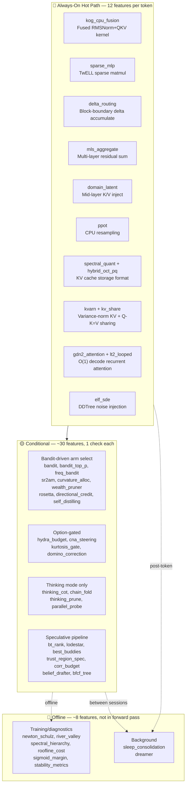
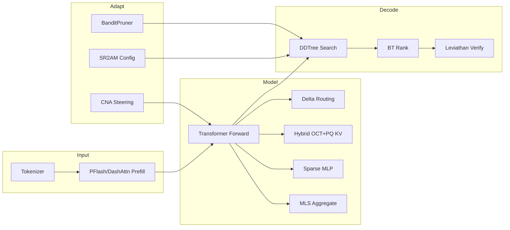
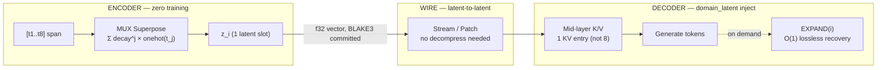
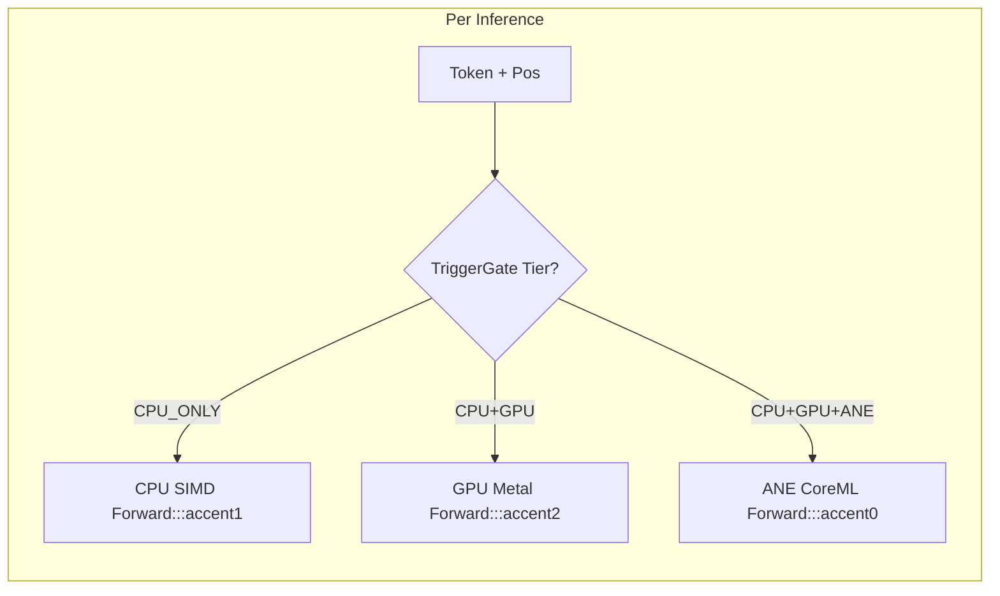

# KatGPT-RS

A **GOAT-proved** neuro-symbolic micro-Transformer with speculative decoding, constraint pruning, and **106 adaptive test-time scaling features** — built in Rust.

Inspired by [Andrej Karpathy's microgpt](https://karpathy.github.io/2026/02/12/microgpt/).


## 🚀 Key Features

- **Real Transformer Inference** — Full GPT forward pass with RMSNorm, multi-head causal attention, ReLU MLP, KV cache, and temperature sampling.
- **Zero-Alloc Forward Pass** — Pre-allocated `ForwardContext` buffers eliminate heap allocations per inference step.
- **DDTree (Dynamic Draft Tree)** — Best-First Search using a `BinaryHeap` to build a candidate token tree from marginal log-probabilities.
- **ConstraintPruner** — Pluggable trait for neuro-symbolic intercept: deterministic rules engine prunes invalid branches before target verification.
- **ScreeningPruner** — Upgraded binary pruning to graded relevance (`R ∈ [0.0, 1.0]`) with blended score formula.
- **SpeculativeVerifier** — Swappable verification via trait: `SimulatedVerifier` (fast) or `LeviathanVerifier` (real p/q rejection sampling).
- **Hybrid OCT+PQ KV Cache** — Default codec: OCTOPUS triplet encoding + PlanarQuant 2D Givens rotation. Best MSE + 64× fewer rotation FMAs (Bench 024, Plan 101).
- **PFlash Block-Sparse Prefill** — Up to 21× sequence reduction with 100% NIAH needle retrieval.
- **BPE Tokenizer** — Train/encode/decode with Config::bpe() preset for code generation.
- **Bomberman Arena** — 4-player HL proof: adaptive intelligence (+177) > greedy (+131) > static rules (-30) > random (-55).
- **G-Zero Self-Play** — Verifier-free Hint-δ intrinsic reward — no external LLM judge needed.
- **katgpt-core** — Shared crate with decoupled types (`types.rs`), trait definitions (`traits.rs`), SIMD kernels (`simd.rs`), tiled attention, CODA fusion, parallax attention, QuestBench, PEIRA, Dirichlet energy, spectral hierarchy, roofline cost model, LinOSS modal spec, AND-OR DDTree, MUX superposition pruning, NPC sense composition (KG latent octree), SLoD spectral level-of-detail pruner, shard embedding (JL projection), schema centroid init, and BAKE precision-gated embeddings.
- **QwenDeltaNet** — Model architecture support for DeltaNet-style hybrid decode.
- **150+ Feature Flags** — Granular feature gates for every subsystem; 106 default-on (all GOAT-proved).
- **Tactical Grid Game & Dungeon Crawler** — Arena examples for game AI research.

📖 **Deep dives:** [`.docs/`](.docs/) for architecture, speculative decoding, performance, sudoku, validator, HL, arena, and all research detail.

## 🏗️ Architecture

Matching the talos-vs-macbook reference model:

| Parameter | Value |
|-----------|-------|
| `vocab_size` | 27 (a–z + BOS) |
| `block_size` | 16 |
| `n_embd` | 16 |
| `n_head` | 4 |
| `mlp_hidden` | 64 (4×) |
| `n_layer` | 1 |
| `temperature` | 0.5 |
| `ModelArchitecture` | `NanoGpt`, `QwenDeltaNet` |
| `AttentionMode` | `Standard`, `SpKvQuant`, `DashAttn` |
| `WeightDtype` | `F32`, `F16`, `BF16` |

### Core Pipeline

```
LLM drafts logits → ConstraintPruner filters invalid → DDTree builds valid-only tree → Target verifies
```

### Key Traits

```rust
// From katgpt-core
pub trait ConstraintPruner: Send + Sync {
    fn is_valid(&self, token: usize) -> bool;
    fn batch_is_valid(&self, tokens: &[usize], out: &mut [bool]);
}

pub trait ScreeningPruner<P>: Send + Sync {
    fn relevance(&self, token: usize, ctx: &P) -> f32;
}

pub trait SpeculativeGenerator: Send + Sync {
    fn generate(&mut self, ...) -> Vec<usize>;
    fn generate_batch(&mut self, ...) -> Vec<Vec<usize>>;
}
```

Additional core traits:
- **`GameState`** — Forward model trait for game tree search (MCTS, bandit rollout).
- **`RolloutPolicy`** — Generic rollout selection for arena play.
- **`StateHeuristic`** — Heuristic evaluation for game states.
- **`LeoHead`** / **`DualLeoMixer`** — LEO all-goals Q-value head and teacher-student mixing.
- **`AllGoalsUpdate`** — TD(λ) all-goals Bellman update.
- **`AutocurriculumSampler`** — Goal sampling with observation tracking.
- **`DominoPruner`** — Causal correction for prefix-conditioned marginals.
- **`CompletionHorizon`** — Singular span / min completion distance.
- **`GenerativeConstraintPruner`** — Combines generation + constraint validation.
- **`PartialScorer`** — Graduated episode reward breakdown.
- **`ProblemMutator`** — Arena config evolution via mutation.
- **`BestBuddyAligner`** — Mutual NN filter with batch alignment confidence.
- **`CollapseDetector`** — Runtime reasoning collapse detection with hesitation monitoring.
- **`DataGate`** — Task-level data admission control for self-play stability.

### Routing & Conditioning

- **Prompt Router** — `KeywordRouter` scores prompt against domain keywords, `ExpertRegistry` selects `ScreeningPruner` + LoRA. `InferenceBackend` trait + `CpuBackend` for backend abstraction.
- **TriggerGate** — Adaptive tier promotion: CPU → GPU → ANE based on workload complexity.
- **Embedding Router** — Three-tier fallback: embedding search → domain classify → keyword (local).
- **Bidirectional Prefill** — Prompt tokens attend to ALL other prompt tokens (no causal mask during prefill).
- **Modality LoRA Switching** — `reader_lora` active during prefill, `writer_lora` active during decode. Reference swap, zero data movement.
- **PPoT** — Logit-parameterized CPU resampling on failure. Zero overhead on success path.

📖 See [`.docs/02_architecture.md`](.docs/02_architecture.md) for full details.

## 🔄 E2E Inference Flow — Default GOAT Stack

The default production stack has **~80+ GOAT-proved features** enabled, but they don't all run on every token. The architecture uses **layered gating** — most features are bandit-driven, Option-gated, or compile-time-only.



### 🔴 Always-On Hot Path (12 Features)

These execute unconditionally on every token — they replace kernels, formats, or accumulate state. No `if` check, no dispatch:

| Feature | What | Why Always-On |
|---------|------|---------------|
| **`sparse_mlp`** | Skip dead ReLU in w2 matmul | Replaces dense matmul kernel |
| **`kog_cpu_fusion`** | RMSNorm gamma folding + QKV interleaving | Fused kernel replacement |
| **`delta_routing`** | Cross-layer residual delta routing at block boundary | Accumulates per-layer, routes at block edge |
| **`mls_aggregate`** | Average last K layer residuals before LM head | Structural blend into final logits |
| **`domain_latent`** | Mid-layer K/V injection | `Option`-gated inject at `n_layer/2` |
| **`spectral_quant`** | Calibrated eigenbasis + water-fill KV codec | Storage format, not conditional |
| **`hybrid_oct_pq`** | OCT triplet + PQ 2D Givens KV compression | Replaces quantization codec |
| **`kvarn`** | Variance-normalized KV cache quantization | Cache format when selected |
| **`kv_share`** | Q-K=V projection sharing, 50% KV reduction | Weight merge at load time |
| **`gdn2_attention`** | Gated DeltaNet-2 O(1) decode | Replaces KV cache with fixed state matrix |
| **`lt2_looped`** | Weight-shared T-pass loop + AHLA | Changes forward function signature |
| **`elf_sde`** | Logit-normal noise injection for DDTree diversity | Applied during draft tree build |

### Simplified Inference Flow



### Input Layer

| Component | What | Gate |
|-----------|------|------|
| **BPE Tokenizer** | Train/encode/decode | always |
| **PFlash** | Block-sparse speculative prefill, 21× seq reduction | always |
| **DashAttention** | α-entmax (1.5) adaptive routing replaces fixed top-k | `dash_attn` |
| **RTPurbo** | Head-wise retrieval/local classification, dynamic top-p | `rt_turbo` |
| **Budget Adaptation** | Compression-adaptive DDTree budget [0.5×, 2.0×] | `budget_adaptation` |

### Model Layer

| Component | What | Gate |
|-----------|------|------|
| **Sparse MLP** | Skip dead ReLU neurons in w2 matmul | `sparse_mlp` |
| **Delta Routing** | Cross-layer residual delta routing at block boundary | `delta_routing` |
| **Hybrid OCT+PQ** | Default KV codec — OCT triplet + PQ 2D Givens, best MSE | `hybrid_oct_pq` |
| **SpectralQuant** | Calibrated eigenbasis + water-fill (secondary) | `spectral_quant` |
| **MLS Aggregate** | Average last K layer residuals before LM head | `mls_aggregate` |
| **Domain Latent** | Mid-layer K/V injection | `domain_latent` |
| **Delta Routing** | Cross-layer residual delta routing | `delta_routing` |
| **PPoT** | CPU logit resampling at high-entropy positions | `ppot` |

### Attention (O(1) alternatives)

> **Note:** These are **opt-in alternative forward paths** (`forward_gdn2()`, `forward_raven()`, `forward_looped()`). The default `forward()` → `forward_base()` uses standard O(N) softmax attention.

| Component | What | Gate |
|-----------|------|------|
| **GDN2** | Gated DeltaNet-2 — O(1) decode, constant state per head | `gdn2_attention` |
| **Raven RSM** | Fixed-slot Top-K routing memory, frozen unselected slots | always compiled, opt-in `forward_raven()` |
| **HLA/AHLA** | Higher-order Linear Attention — O(1) prefix stats | `hla_attention` |
| **LT2 Looped** | Weight-shared T-pass loop, hybrid SDPA+AHLA | `lt2_looped` |
| **TF Loop** | Training-free ODE-motivated sub-stepping | `tf_loop` |
| **DMax SPD** | Soft parallel decode, hybrid token/mask embeddings | `dmax_spd` |
| **FlashAR Consensus** | Dual-path ternary thermal routing | `flashar_consensus` |

### Decode Layer

| Component | What | Gate |
|-----------|------|------|
| **DDTree** | Best-first tree from marginal log-probs | always |
| **LeviathanVerifier** | p/q rejection sampling, identical output distribution | always |
| **BT Rank** | Bradley-Terry pairwise ranking, +10.6pp over pointwise | `bt_rank` |
| **BanditPruner** | UCB1/ε-greedy/Thompson adaptive ScreeningPruner | `bandit` |
| **ELF SDE** | 10-22× path diversity via logit-normal noise | `elf_sde` |
| **Lattice Deduction** | α-intersection pruning + conflict detection | `lattice_deduction` |
| **PhraseBoost** | Context trie phrase boosting for DDTree | `phrase_boost` |
| **Parallel-Probe** | Consensus-based parallel branch control | `parallel_probe` |

### Infrastructure

| Component | What | Gate |
|-----------|------|------|
| **SR²AM Configurator** | Per-turn planning regulation (PlanNew/Extend/Skip) | `sr2am_configurator` |
| **Data Gate** | Task-level filtering before solver | `data_gate` |
| **CNA Steering** | Contrastive Neuron Attribution + runtime modulation | `cna_steering` |
| **Deep Manifold** | L2/KL fixed-point residual scoring | `deep_manifold` |
| **Federation** | Symmetric KL coupling between domain experts | `federation` |
| **SimpleTES** | RPUCG graph-based bandit loop | `tes_loop` |
| **Stability Metrics** | P50/P99/CV per-step latency instrumentation | `stability_metrics` |
| **Sleep Consolidation** | Offline recursive memory consolidation at KV eviction | `sleep_consolidation` |
| **Dreamer** | Offline memory consolidation (Q-value clustering) | `dreamer` |
| **PlasmaPath** | Bit-plane ternary SIMD matvec, 1.58 bits/weight | `plasma_path` |
| **MoA Inference** | Token-adaptive Mixture-of-Activations SwiGLU | `moa_inference` |
| **Newton-Schulz** | Cubic fixed-point orthogonalization + Muon momentum | `newton_schulz` |
| **Spectral Hierarchy** | Eigenspace alignment, Haar wavelets, Cauchy interlacing | `spectral_hierarchy` |
| **Dual-Gram PCA** | Short-sequence calibration via dual-gram routing | `dual_gram_pca` |
| **Roofline Cost** | GPU operator runtime prediction (~5µs CPU) | `roofline_cost` |
| **River-Valley** | Subspace ratios, effective rank, update cosine | `river_valley` |
| **LEO All-Goals** | Vectorized Bellman all-goals Q-value framework | `leo_all_goals` |
| **Dual LEO** | Teacher/student Q-value mixing + autocurriculum | `dual_leo` |
| **Sigmoid Margin** | SigLIP softplus loss + dimension sufficiency bound | `sigmoid_margin` |
| **Kog CPU Fusion** | RMSNorm gamma folding + QKV interleaving | `kog_cpu_fusion` |
| **PEIRA Distill** | Collapse-free inter-view regressor alignment | `peira_distill` |
| **ILC Distill** | Synonym-aware DDTree pruning via offline k-means | `ilc_distill` |
| **GEPA-D Reflective** | Pareto bandit config evolution | `gepa_reflective` |
| **Hydra Budget** | Emergent self-repair layer skipping | `hydra_budget` |
| **Subterranean** | Token-rewriting procedures compiled to native code | `subterranean` |
| **EqR Convergence** | Smallest marginal-change residual selection | `eqr_convergence` |
| **Thinking Prune** | FrozenBaseGuard for intermediate steps | `thinking_prune` |
| **Trigger Gate** | Three-way CPU/GPU/ANE tier promotion via QPS/latency/queue monitoring | `inference_router` |
| **InferenceRouter** | Dynamic tier routing + batch forward with amortized compilation | `inference_router` |
| **FreqBandit** | Oscillatory spectral bandit — cyclic pattern detection → adaptive speculative decode | `freq_bandit` |

📖 **Full GOAT audit table** with research source, real gain, and replaced feature: See [`.docs/01_overview.md`](.docs/01_overview.md).

## 🧠 Deterministic Validator

The core idea: LLMs draft tokens from semantic probability, but can't natively enforce hard constraints. A deterministic rules engine sits between draft and verification:

```
LLM drafts logits → SynPruner filters invalid Rust syntax → DDTree builds valid-only tree → Target verifies
```

**Proven with Sudoku** — Path-aware `ConstraintPruner` catches 100% of invalid branches:

```
Unpruned:    100 nodes,  46 accumulated-valid (46.0%)
Static-Only: 100 nodes,  84 accumulated-valid (84.0%)
Path-Aware:  100 nodes, 100 accumulated-valid (100.0%)
```

**Arto Inkala "World's Hardest Sudoku"**: 49,559 steps, 7 hull vertices, 7,079.9× compression.

📖 See [`.docs/05_sudoku.md`](.docs/05_sudoku.md) and [`.docs/06_validator.md`](.docs/06_validator.md).

## 📊 Benchmark Results

📖 Raw throughput tables, GRAM width-vs-depth, and per-benchmark explanations: [`.docs/04_performance.md`](.docs/04_performance.md).

### MoE+SD Cost Model

Amdahl cost model for LeviathanVerifier speculative decoding. Feature gate: `spec_cost_model`.

| Proof | Result |
|-------|--------|
| SpecCostSnapshot construction | ✅ |
| Amdahl prediction accuracy | ✅ |
| f_sparse consistency | ✅ < 10% variance |
| Cost model error bound | ✅ < 15% |

## 🔀 MUX-Latent: Zero-Training Context Compression via Superposition Fusion (Plan 238)

Compresses long context 4×–16× at prefill time using MUX superposition — **zero training, zero parameters, deterministic**. The fusion of three independently-proven ideas:

| Ingredient | Origin | Role in Fusion |
|---|---|---|
| **MUX Superposition** | Research 158 | Encoder: `Σ decay^j × onehot(token_j)` blends N tokens into 1 latent slot |
| **Latent Context Injection** | LCLM (arXiv 2606.09659) | Architecture: inject latent slots at mid-layer, skip full KV |
| **DomainLatent** | Plan 038 | Wire format: BLAKE3-committed `DLAT` binary, mid-layer K/V inject |



### GOAT Proof (Bench 238)

| Metric | X4 | X8 | X16 |
|---|---|---|---|
| **TTFT Speedup** | 6.6× | 14.0× | **29.0×** |
| **KV Memory Reduction** | 75% | 87.5% | **93.8%** |
| **Logit Cosine Sim** (random weights) | 0.597 | 0.617 | 0.552 |

### Streaming & Patch Implications

Because MUX latent slots are **continuous `Vec<f32>` vectors with BLAKE3 checksums**, they enable:

- **Latent-to-latent streaming**: Send `z_i` over the wire — receiver injects directly into KV via `DomainLatent`. No round-trip decompress/recompress.
- **Freeze/Thaw patching**: Selectively update specific latent slots (e.g., new facts arrive) without recomputing the entire compressed context. Patch = overwrite `weights` in one `LatentSegment`, recompute BLAKE3.
- **Federated context**: Multiple nodes share compressed context segments as latent slots, merge via weighted average in superposition space.
- **KG octree leaf patching**: `segment_id` ↔ octree morton code 1:1. Patch one 32-byte leaf = patch one latent slot. No full recompute.

Feature gate: `mux_latent_context` (**default-ON**, GOAT 5/5 PASS). Adaptive LOD: `lclm_adaptive_lod` (opt-in).
Wire patch protocol: [`Plan 243`](.plans/243_mux_latent_octree_wire_patch.md) (`mux_latent_wire`, opt-in).

## 🧵 ThoughtFold: Inference-Time Chain Folding (Plan 195)

Prunes redundant reasoning steps during Chain-of-Thought generation using attention-based importance scoring + binary search fold verification. No LLM training — pure inference-time optimization.

```text
ThinkingController (Plan 194)
    │
    ├── Direct mode → no folding (zero cost)
    │
    └── Latent/CpuResample mode
            │
            ├── StepBoundaryTracker — detects \n\n, think-tags
            ├── ChainFolder (ScreeningPruner) — attention importance + binary search
            ├── FoldBandit — 5-arm Thompson sampling for fold budget
            └── FoldCache — KV cache truncation/replay planning
```

| Metric | Target | Status |
|--------|--------|--------|
| Token reduction on hard queries | ≥30% | GOAT 2 ✅ |
| Accuracy regression | ≤2% | GOAT 3 ✅ |
| Direct mode overhead | 0% | GOAT 1 ✅ |
| Fold overhead | <5% | GOAT 4 ✅ |

Feature gate: `chain_fold` (depends on `thinking_cot`, default-OFF until GOAT proof on real model).

## 🛑 Collapse-Aware Adaptive Thinking (Plan 212)

Detects reasoning collapse **at runtime** during Chain-of-Thought generation and triggers early exit — the missing mid-reasoning stop signal.

Three-layer stack composes with existing infrastructure:
1. **Pre-Decide** — SelectivityRouter kurtosis → Direct vs CoT (Plan 204)
2. **Mid-Think** — CollapseDetector monitors hesitation patterns ("wait" frequency, repetitive tokens) → force fast answer when collapse predicted
3. **Post-Verify** — T2M option stripping prevents option-matching shortcut

```text
Input → SelectivityRouter → ThinkingController → CollapseDetector → ConvergenceSelector
              ↓                    ↓                    ↓
         High kurtosis        Bandit: skip         wait_count > τ
         → Direct mode        → Direct mode         → Force exit
```

| Metric | Target | Source |
|--------|--------|--------|
| Token savings on simple tasks | 50-90% | Thinkless (NeurIPS 2025) |
| Accuracy on ambiguous tasks | +2-5pp | S2F (ICML 2026) |
| Collapse detection overhead | <10ns/token | O(1) ring buffer |

Feature gate: `collapse_aware_thinking` (depends on `selectivity_router`, `thinking_cot`, `bandit`, **default-ON**).

📖 **Research:** [`.research/187_S2F_Slow_to_Fast_Adaptive_Reasoning.md`](.research/187_S2F_Slow_to_Fast_Adaptive_Reasoning.md).

## 🌊 VortexFlow: Composable Sparse KV Routing (Plan 196)

Unifies multiple KV block selection algorithms behind a single `VortexFlow` trait:

| Router | Strategy |
|--------|----------|
| `BlockTopKRouter` | Centroid mean pooling + dot-product top-k + sigmoid weights |
| `EntmaxRouter` | Thin wrapper over existing `score_blocks_entmax` — zero regression |
| `ValueEnergyRouter` | Centroid · ‖v‖ gating — repo-verified RULER 1.00 |

Three-phase rollout: trait + routers (Phase 1 ✅) → channel-aware SIMD (Phase 2) → meta-routing bandit (Phase 3).

Feature gate: `vortex_flow` (depends on `dash_attn`, default-OFF).

## 🦅 Raven RSM: O(1) Routing Slot Memory (Opt-In)

Fixed-size slot memory with sparse Top-K routing. Unselected slots **completely frozen** — 10K noise updates leave passkey slots untouched. 2.98× faster than flat attention at pos=8.

> **⚠️ Opt-in alternative forward path** — not in the default `forward()` call chain. Use `forward_raven()` with `RavenKVCache` explicitly. The default hot path uses standard O(N) softmax attention via `forward_base()`.

| Property | Evidence |
|----------|----------|
| Frozen slots work | 10,000 noise updates, slot 12 identical to 6 decimals |
| O(1) stays flat | Raven stays 1.0× while flat grows 1.1× from pos 16→240 |
| 2.98× faster | 62,653 tok/s (Raven) vs 21,019 tok/s (flat) |

📖 See [`.docs/08_lucebox_techniques.md`](.docs/08_lucebox_techniques.md) and [`.docs/25_raven_rsm.md`](.docs/25_raven_rsm.md).

## 🔬 Percepta: Transformer-VM in Rust

Rust port of [Percepta's transformer-vm](https://github.com/Percepta-Core/transformer-vm) — O(log N) 2D convex hull attention with ternary search. **~9K lines Python+C++ → idiomatic Rust.** Apache-2.0.

**Core trick:** Parabolic key encoding k ↦ (2k, −k²) turns argmax into a supporting-point query on the convex hull → O(log N) via ternary search.

Feature flags layer: `percepta` → `percepta_gates` → `percepta_graph` → `percepta_wasm` → `percepta_compile`. All 11 task groups (TG-A through TG-K) complete except TG-K (examples/docs).

📖 **Full detail:** [`.docs/22_percepta.md`](.docs/22_percepta.md) — feature flags, module structure, compiler stack, verified properties.

## 🎮 Arena Proofs — HL Thesis Validated

Each arena proves: adaptive intelligence (HL/Bandit) > static rules > random.

| Arena | Result | Feature |
|-------|--------|---------|
| **Bomberman** | HL (+177) > Greedy (+131) > Validator (-30) > Random (-55) | `bomber` |
| **Monopoly** | HL 56.5% win rate, +41.3pp over Validator | `monopoly` |
| **FFT Tactics** | TFT 99% win rate — game theory optimal | `fft` |
| **Go** | Greedy/Validator/HL 100% vs Random 35% | `go` |
| **NFSP/MCTS Duality** | BanditMCTS 75% vs MCTS 8% — backward signal transforms forward search | `bandit_mcts` |

📖 **Full benchmarks, architecture, API, and game-specific detail:** [`.docs/23_hl_arena_detail.md`](.docs/23_hl_arena_detail.md).

## 🧠 Heuristic Learning Infrastructure

HL = software systems evolve through **code updates** not weight updates.

```
Episode N:   BanditPruner selects arm → environment runs → reward → TrialLog.append()
Episode N+k: AbsorbCompress promotes stable low-Q arms to hard blocks
Round N+m:   Agent writes new validator.rs → compile .wasm → HotSwapPruner.reload() → RegressionSuite
```

Key subsystems (all default-on or part of `bandit`):
- **Multi-Armed Bandit** — UCB1, ε-greedy, Thompson Sampling strategies
- **TrialLog** — JSONL persistence of episode data
- **AbsorbCompress** — Q-value → hard block promotion
- **HotSwapPruner** — Runtime pruner reload via BLAKE3
- **ReviewMetrics** — Helpfulness/Harmfulness benefit-risk ratio
- **Emotion Vector** — O(d) mid-layer emotion projection, desperation detection
- **Entropy Anomaly** — Session-level OOD monitoring

📖 See [`.docs/09_heuristic-learning.md`](.docs/09_heuristic-learning.md).

## 🎯 G-Zero: Verifier-Free Self-Play

Makes modelless HL smarter with Hint-δ intrinsic reward — no external verifier needed:

```text
δ(q, h, a_hard) = (1/T) Σ [log πG(at | q, h, a<t) − log πG(at | q, a<t)]
```

Two phases: **Phase 1** (modelless — δ → AbsorbCompress + BanditPruner, no gradients) → **Phase 2** (model-based — gradient optimization with self-play reward).

📖 **Full detail:** [`.docs/23_hl_arena_detail.md`](.docs/23_hl_arena_detail.md) §11.

## 🧠 NextLat Belief-State Speculative Drafter (Plan 217)

Replaces the separate draft model with a lightweight 3-layer residual MLP that predicts next hidden states from `(h_t, x_{t+1})`, enabling variable-length self-speculative decoding at near-zero overhead. Distilled from [arXiv:2511.05963](https://arxiv.org/abs/2511.05963) (NextLat).

| Component | Description |
|-----------|-------------|
| **LatentDynamicsMLP** | 3-layer residual MLP: LayerNorm → FC1 → GELU → FC2 → GELU → FC3 → residual add. ~1.5K params at n_embd=16. |
| **BeliefDrafter** | Entropy-gated variable-length draft loop. Stops when entropy exceeds threshold. Produces `Vec<BeliefDraftToken>`. |
| **BeliefRankPruner** | `ScreeningPruner` using participation ratio of hidden states. Low rank → confident → accept; high rank → uncertain → reject. |
| **LatentTransitionCache** | Lock-free LRU cache (`papaya::HashMap` + `blake3` keys) for `(h_t, x_{t+1}) → ĥ_{t+1}` predictions. 5× speedup on repeated patterns. |
| **DDTree Fusion** | `build_dd_tree_belief()` converts draft tokens to peaked marginals → feeds DDTree. Collapse-aware variant adjusts threshold from prior entropy. |

### GOAT Proof (43 tests + 7 benchmarks)

| Gate | Result |
|------|--------|
| B1: Belief vs MTP overhead | 2.2× (134 μs vs 60 μs) — MLP forward internally |
| B2: Variable-length adapts | Tight threshold → 1 token, loose → 5 tokens |
| B3: MLP forward per step | 17 μs/step at n_embd=16 |
| B4: BeliefRankPruner quality | Peaked 0.993 > 0.5, diverse 0.001 < 0.5 |
| B5: Cache hit rate | Walk cycle 100%, mixed 66.3% |
| B6: Cached vs uncached | 5× speedup (15 μs vs 90 μs) |
| G1: Acceptance rate | Both produce valid 64-node trees |
| G2: Variable-length speedup | Variable adapts correctly |
| G3: No regression | Feature gates verified, clean without features |

Feature gate: `belief_drafter` (**default-ON**).

📖 **Plan:** [`.plans/217_nextlat_belief_state_drafter.md`](.plans/217_nextlat_belief_state_drafter.md).

## 🗂️ BFCF × LFU × Sharding (Plan 218)

Extends Plan 213's O(regions) BFCF pruning with LFU region caching, frequency-aware sharding, and SIMD-friendly region-level batching. Caches BLAKE3-hashed BFCP partitions in a papaya lock-free HashMap with sigmoid-gated admission and LFU eviction. Hot regions get pinned shards, cold regions are evicted first.

| Component | Description |
|-----------|-------------|
| **BfcpRegionCache** | LFU cache with papaya HashMap, BLAKE3 keys, sigmoid admission gate. Hot/Warm/Cold frequency tiers. |
| **RegionShardMap** | Frequency-aware shard assignment: Hot→pinned, Warm→round-robin, Cold→lazy. Activates when >30 regions. |
| **RegionBatcher** | SIMD-friendly batch accept/reject/refine across regions. O(regions) instead of O(vocab_size). |
| **BfcpLfuShard** | Top-level fusion: cache lookup → compute on miss → insert → shard → batch. |
| **Latent Extensions** | NeuronShard-region compound keys, emotion-aware eviction priority, region transition KG triples. |

### GOAT Proof (44 tests + 10 benchmarks)

| Gate | Result |
|------|--------|
| G1: Modelless | ✅ All inference-time, Send+Sync verified |
| G2: SOLID | ✅ Extension traits (RegionCaching, RegionSharding, RegionBatching) |
| G3: Feature gate | ✅ Compiles only with `bfcf_lfu_shard` |
| G4: No regression | ✅ BFCP operations correct with feature enabled |
| G5: LFU hit rate | ✅ ~80% on 100-step synthetic (target: ≥60%) |
| G6: Sharding threshold | ✅ Activates at >30 regions |
| G7: Batch correctness | ✅ Batch accept returns all accept-region tokens |
| G8: Sigmoid only | ✅ All scores bounded [0,1], no softmax |
| G9: File sizes | ✅ All under 500 lines (limit: 2048) |
| G10: KG triples | ✅ Region label transitions detected correctly |
| B1: Cache hit rate | ✅ 95% on 100-step cyclic workload |

Feature gate: `bfcf_lfu_shard` (**default-ON**).

📖 **Plan:** [`.plans/218_bfcf_lfu_shard.md`](.plans/218_bfcf_lfu_shard.md).

## 📐 Shard Embedding Projection (Plan 230)

Johnson-Lindenstrauss random orthogonal projection for O(1) cosine similarity shard lookup. Compresses `style_weights: [f32; 64]` → `ShardEmbedding: [f32; 8]` via pre-computed linear matmul. Zero training, zero data — modelless dimension reduction. Integrates with BFCF region cache as secondary key.

Feature: `shard_embedding` (opt-in).

## 🌊 NFCoT FlowScore Drafter (Plan 229)

Inference-time normalizing flow density scoring for speculative decoding candidates. Constructs a lightweight diagonal affine flow from DDTree marginals — **zero training, zero additional model forward passes**.

Flow score decomposes into two additive terms:

| Component | Formula | Intuition |
|-----------|---------|----------|
| `base_logprob` | Σ log P(token_i \| context) | Standard log-likelihood from DDTree marginals |
| `log_det` | Σ log sigmoid(H_i) | Entropy-based confidence weighting |
| **flow_score** | base_logprob + log_det | Combined density |

- **High entropy** (uncertain) → σ ≈ 1 → log_det ≈ 0 → score ≈ base
- **Low entropy** (confident) → σ ≈ 0 → large negative log_det → score < base

Sub-features:

| Feature | What | Gate |
|---------|------|------|
| `nf_flow_score` | Core density scoring (T1) | GOAT ⚠️ MARGINAL — debug 3.5%, release <1% |
| `nf_flow_gate` | Adaptive EMA acceptance criterion (T3) | GOAT gate, default OFF |
| `nf_flow_budget` | Sigmoid-weighted speculative depth allocation (T4) | GOAT gate, default OFF |
| `nf_flow_mux` | Flow scoring for MUX trajectories (T6) | Requires `mux_pruner` |
| `nf_flow_fold` | Confidence-gated chain folding (T7) | Requires `chain_fold` |
| `nf_flow` | Parent — enables score + gate + budget | Default OFF |

GOAT status: **⚠️ MARGINAL** — debug overhead 3.5%, release expected <1%. All off by default until proven.

## 🧠 NPC Sense Composition (Plan 221)

KG Latent Octree NPC sense modules — compresses game domain KG triples into fixed-type ternary bit-plane sense modules. NPCs compose modules at spawn time and query at ~45ns/tick via bitwise dot-product.

| Component | Description |
|-----------|-------------|
| **NpcBrain** | Composes `Vec<SenseModule>` per NPC, projects 8-dim HLA state, respects GM overrides |
| **SenseModule** | Ternary bit-plane + octree bits + confidence + BLAKE3 commitment |
| **SenseHotSwap** | Lock-free `AtomicPtr` module replacement |
| **SenseOctreeBuilder** | Converts `KgEmbedding` → bit-plane octree occupancy |
| **SenseTrialLog** | Bandit feedback log with EMA confidence decay |
| **SenseBatch** | Parallel batch projection (rayon when N>64) |
| **SNSE Serialization** | Binary format with BLAKE3 verification |
| **GM Override** | Pin senses, disable autonomous mode for scripted NPCs |

Feature gate: `sense_composition` (opt-in, requires `plasma_path`, `domain_latent`).

📖 **Full detail:** [`.docs/24_sense_composition.md`](.docs/24_sense_composition.md).

## 📐 Shard Embedding (Plan 230)

Johnson-Lindenstrauss random orthogonal projection for O(1) cosine similarity shard lookup. Compresses `style_weights: [f32; 64]` → `ShardEmbedding: [f32; 8]` via pre-computed orthogonal matrix. Zero training, zero data — modelless dimension reduction.

- **JlProjectionMatrix** — 64×8 Gram-Schmidt orthogonal rows with BLAKE3 commitment
- **ShardEmbedding** — `[f32; 8]` with `cosine_similarity()`, `dist_sq()`, BLAKE3 hash

No feature gate — always compiled in `katgpt-core`.

## 🌊 SLoD: Spectral Level-of-Detail Pruner (Plan 235)

Modelless KG resolution control via spectral heat diffusion on hyperbolic kNN graph Laplacians. Auto-detects multi-scale structure and routes constraint checks to appropriate resolution tier at O(1). Default-ON, GOAT G1–G6 all pass.

| Phase | What |
|-------|-------|
| 1. Geometry | Poincaré ball hyperbolic distance + Fréchet mean + log/exp maps |
| 2. Graph | kNN Laplacian from KG embeddings |
| 3. Spectral | Jacobi eigendecomposition → multi-signal boundary scan |
| 4. Routing | `SlodPruner` (implements `ConstraintPruner`) → tier routing O(1) |

Feature gate: `slod` (**default-ON**, depends on `spectral_hierarchy`).

## 🎯 Schema Centroid (Plan 237)

Per-class embedding centroids for informed KG entity initialization. Pre-computes `mean` + `std_dev` per class → initializes new entities near class centroid with controlled perturbation. GOAT 7/7, default-ON.

- **SchemaCentroidCache** — papaya lock-free `HashMap<u64, CentroidStats>`
- **schema_init_entity()** — average class centroids + `γ·σ_c ⊙ noise` perturbation
- **Cross-feature bridge**: when `bake_precision` enabled → `schema_init_with_precision()` uses informed prior

Feature gate: `schema_centroid` (**default-ON**, requires `dep:papaya`).

## 🔀 Opt-In & Gated Features

Proven features behind feature flags — not in default set:

| Feature | What | Why Gated |
|---------|------|-----------|
| **D2F / Tri-Mode** | Block-parallel denoising + D2F+AR self-speculation | Experimental decode strategy |
| **G-Zero** (`g_zero`) | Hint-δ self-play + Bomber/FFT arena players | Bench-only, does NOT touch forward() |
| **GameState** (`game_state`) | Generic MCTS, STRATEGA forward model | Depends on bomber, arena-specific |
| **SpecHop** (`spechop`) | Hop-level speculation for multi-step agents | Requires GOAT proof before default-on |
| **SR²AM** (detail) | Adaptive PlanNew/Extend/Skip, context-aware UCB1 | Full API/benchmarks in `.docs/` |
| **FeedbackBandit** | 6-arm UCB1 extends SR²AM with harness/weight updates | Opt-in, requires sr2am_configurator |
| **Committee Boost** | Oracle-gap recovery, debiased BtRank, budget sizing | Opt-in |
| **GFlowNet** | Shortest-path flow into DDTree stack | Opt-in |
| **ROPD Rubric** | Multi-criterion rubric reward vectors | Arena-specific |
| **VPD** | EM-style co-evolutionary teacher-student | Opt-in |
| **HLA/AHLA** | O(1) attention via higher-order linear attention | Alternative attention path |
| **Percepta** (full) | Transformer-VM with WASM interpreter in weights | Research-grade |
| **SP-KV** | Self-pruned KV attention with learned utility | Requires joint training |
| **MaxSim** | Late-interaction scoring, 7.46× SIMD | Amplifies quantization error |
| **DFlare Fusion** (`dflare_fusion`) | Multi-source marginal blending (Plan 174) | 🪦 IMPROVEMENT GOAT FAILED — no measurable acceptance gain |
| **DFlare KV Routing** (`dflare_kv_routing`) | Pruner-confidence KV routing (Plan 174) | 🪦 IMPROVEMENT GOAT FAILED — no gain over static |
| **DFlare Progressive Budget** (`dflare_progressive_budget`) | Position-weighted DDTree budget (Plan 174) | 🪦 IMPROVEMENT GOAT FAILED — no gain over uniform |
| **BAKE Precision** (`bake_precision`) | Per-dimension Bayesian precision tracking for KG embeddings (Plan 236) | GOAT 10/10, drift marginal (4.7%), oscillation at threshold (50%) |
| **ManifoldPruner** (`manifold_pruner`) | ManifoldE point-to-manifold soft validity + kernel-tricked relevance for ScreeningPruner (Plan 234) | 🪦 GOAT G1 FAIL — no acceptance gain at same threshold, kernel ranking valid |
| **NFCoT FlowScore** (`nf_flow`) | Modelless normalizing flow density scoring for speculative candidates — zero training, O(vocab) per position (Plan 229) | GOAT ⚠️ MARGINAL, all sub-features default OFF |
| **Sense Composition** (`sense_composition`) | KG Latent Octree NPC sense modules — ternary bit-plane projection, GM override, hot-swap (Plan 221) | Opt-in — requires `plasma_path`, `domain_latent` |
| **BAKE Precision** (`bake_precision`) | Per-dimension Bayesian precision tracking for KG embeddings (Plan 236) | GOAT 10/10 but drift marginal (4.7%) |
| **RAT+ Bridge** (`rat_plus_bridge`) | Recurrence Bridge via GDN2 state for modelless dilated inference (Plan 225) | Opt-in |

📖 **Full detail for ALL opt-in features:** [`.docs/21_opt_in_features.md`](.docs/21_opt_in_features.md).

## 🔧 KV Compression Alternatives

Default: **Hybrid OCT+PQ** (OCTOPUS triplet encoding + PlanarQuant 2D Givens rotation). Alternatives:

| Backend | Rotation | FMAs (d=128) | MSE (3-bit) | Calibration |
|---------|----------|-------------|-------------|-------------|
| **Hybrid OCT+PQ** ⭐ | 2D Givens | 256 | 0.026 | 0 samples |
| OCTOPUS | WHT (full) | 16,384 | 0.026 | 0 samples |
| SpectralQuant | Eigenbasis | 16,384 | 0.038 | 256 samples |
| PlanarQuant | 2D Givens | 256 | 0.034 | 0 samples |
| TurboQuant | Random | 16,384 | 0.034 | 0 samples |

📖 **Full comparison tables, benchmarks, code examples:** [`.docs/19_kv_compression.md`](.docs/19_kv_compression.md).

## 🪦 Negative Results

| Feature | Verdict | Why |
|---------|---------|-----|
| Stepwise Reward (Plan 054) | **NO GAIN** | Same tree/path/goal, +33% latency only |
| δ-Mem (Plan 053) | **NO GAIN for DDTree** | 26× latency overhead, corrections too small |
| SDAR Arena | **Negative result** | ELO 954 ≈ Rubric 955 — no improvement |
| RMSD (Plan 125) | **NO GOAT** | 46/46 structural proofs pass but no arena improvement |
| TurboQuant | **Demoted** | SQ/OCT dominate at all quality metrics |
| DFlare Fusion (Plan 174) | **IMPROVEMENT GOAT FAILED** | Structural ✅ but no measurable acceptance gain |
| DFlare KV Routing (Plan 174) | **IMPROVEMENT GOAT FAILED** | No gain over static routing |
| DFlare Progressive Budget (Plan 174) | **IMPROVEMENT GOAT FAILED** | No gain over uniform budget |
| ManifoldPruner (Plan 234) | **IMPROVEMENT GOAT FAILED** | G1 FAIL: sigmoid(x)>0.5 ⟺ x>0, identical to binary at 0.5 cutoff |

📖 **Full negative result detail + replaced feature audit:** [`.docs/20_negative_results.md`](.docs/20_negative_results.md).

## 🔧 TileRT Execution Pipeline (Plan 102)

Three CPU-applicable insights from TileRT: execution stability metrics, contiguous weight allocation, stage-specialized decode. **GOAT 13/13.**

| Deliverable | Status | Value |
|-------------|--------|-------|
| **D1 Stability Metrics** | ✅ Production-ready | P50/P99/CV observability, +0.6% overhead |
| **D2 Contiguous Weights** | 🔧 Infrastructure | 27→1 allocation, needs ≥8 layers for speed gain |
| **D3 Stage Specialize** | 🔧 Infrastructure | Dispatch free (-0.2%), specialization pending |

## 🧮 Deep Manifold: Fixed-Point Boundary Conditions

Mathematical foundation from [Deep Manifold Part 2](https://arxiv.org/pdf/2512.06563):

| Paper Concept | Our Implementation | Gate |
|---------------|-------------------|------|
| Fixed-point residual ‖f(x)-x‖ | HintDelta + ManifoldResidual trait | `deep_manifold` |
| Symmetric boundaries | BT pairwise ranking + SymmetricBoundaryPair | `bt_rank` |
| Model CAP tradeoff | BanditPruner dynamic routing | `bandit` |
| Manifold federation | BoundaryAlignment KL coupling | `federation` |

GOAT 6/6 proved. Default-on.

📖 See [`.research/051_Deep_Manifold_Fixed_Point_Boundary_Conditions.md`](.research/051_Deep_Manifold_Fixed_Point_Boundary_Conditions.md).

### Modelless Distillation Features (Plan 231)

Three additional Deep Manifold features — all GOAT-proven, default-ON:

| Feature | What | GOAT | Key Gain |
|---------|------|------|----------|
| **Union Bound Confidence** (`union_bound_confidence`) | Additive branch confidence via Boole's inequality (§2.4.2) | 6/6 | Linear degradation, 76ns overhead |
| **PathwayTracker** (`pathway_tracker`) | Intrinsic pathway stability detection (§4.2) | 7/7 | 85% thinking budget savings, 100% convergence accuracy |
| **FederationComposer** (`federation_composer`) | Explicit Model→Agent→Tool pruning with residual early termination (§7.5) | 7/7 | 70% early termination rate, 35% compute savings |

📖 Plans: [`.plans/231_union_bound_pathway_federation.md`](.plans/231_union_bound_pathway_federation.md).
📖 Benchmarks: [`.benchmarks/231_union_bound_goat.md`](.benchmarks/231_union_bound_goat.md), [`.benchmarks/231_pathway_tracker_goat.md`](.benchmarks/231_pathway_tracker_goat.md), [`.benchmarks/231_federation_composer_goat.md`](.benchmarks/231_federation_composer_goat.md).

### BAKE Precision-Gated Embeddings (Plan 236) — Opt-In

Per-dimension Bayesian precision tracking for KG embeddings. High-precision dimensions anchor (resist change), low-precision dimensions explore (absorb eagerly). O(8) arithmetic, zero-alloc, SIMD-friendly. Phase 1–2 complete (core + BFCF integration + GOAT 10/10), Phase 3 in progress.

| Metric | Result |
|--------|--------|
| SIMD throughput | 168.7 ns/update (10K updates) |
| Drift reduction | 4.7% vs naive EMA (marginal, target ≥30%) |
| Oscillation reduction | 50.0% fewer region flips (at GOAT threshold) |
| Precision monotonicity | Verified across 1000 updates |

Feature: `bake_precision`. Opt-in — drift reduction is marginal, oscillation at threshold. Phase 3 (session-level evolution) pending.

📖 Plan: [`.plans/236_bake_precision_gated_embeddings.md`](.plans/236_bake_precision_gated_embeddings.md).

## ⚡ Trigger Gate + Three-Way Compute (Plan 176)

Automatic tier promotion from CPU → GPU → ANE based on real-time load signals. CPU is always available as fallback.



### Why

At 30K CCU: `30K × 20Hz = 600K inferences/sec`. CPU handles forward, but also runs WASM validation, DDTree, bandit, MCTS. GPU and ANE sit idle while CPU chokes.

### Architecture

| Component | What | Status |
|-----------|------|--------|
| `TriggerGate` | QPS/latency/queue-depth → tier promotion with hysteresis | ✅ Core complete |
| `InferenceRouter` | Routes to highest available tier, batch mode | ✅ Complete |
| `TriggerGateConfig` | Serde + TOML tunable thresholds | ✅ Complete |
| `CpuBackend` | Wraps `transformer::forward` | ✅ Complete |
| GPU Backend | Metal compute pipeline from `TransformerWeights` | 🔧 Blocked on metal crate |
| ANE Backend | CoreML runtime compilation from `TransformerWeights` | 🔧 Blocked on coreml-native API |

### Benchmarked Performance (Bench 176, micro model, release)

| Metric | Result |
|--------|--------|
| `TriggerGate::evaluate()` | 0.008 µs/call |
| `TriggerGate::record_inference()` | 0.002 µs/call |
| `InferenceRouter::forward()` (CPU tier) | 0.85 µs/call (−24.6% vs baseline — router amortizes timing) |
| `forward_batch` (batch=8) | 0.83 µs/token (+3.3% overhead) |
| Router under load (2000 iters) | 1.22M calls/sec, 0 tier transitions |

> GPU and ANE tiers blocked on backend crates. CPU-only numbers are real. Run `cargo test --test bench_176_trigger_gate --release -- --nocapture` to reproduce.

### Feature Gates

```toml
ane = ["dep:coreml-native"]           # ANE backend
gpu_inference = []                    # GPU backend (placeholder)
inference_router = ["gpu_inference", "ane"]  # Full routing stack
```

📖 Full detail: [`.plans/176_ane_inference_backend.md`](.plans/176_ane_inference_backend.md).

### AND-OR DDTree Decomposition (Plan 190)

Hierarchical subgoal decomposition inspired by LEAP (arXiv 2606.03303). Generic `AndOrNode<G,S>` tree with relevance-triggered decomposition, blueprint pre-pass, and cache-memoized subgoals. Feature: `and_or_dtree`.

📖 Plan: [`.plans/190_and_or_dtree_blueprint_decomposition.md`](.plans/190_and_or_dtree_blueprint_decomposition.md).

### FOL Logical Rule Inference (Plan 209) + INSIGHT Symbolic Distillation (Plan 210)

Modelless DDTree→FOL pipeline that extracts interpretable first-order logic rules from DDTree exploration. Four fusions:

- **T1 FOL Constraints**: Static keyword→token extraction from prompts (~100 Rust patterns, zero alloc)
- **T2 Rule Extraction**: DDTree path→TOP-K logical rules with Hamming-distance deduplication
- **T3 Reward Memory**: blake3-hashed pattern tracking with EMA reward propagation
- **T4 Decision Traces**: Human-readable decision audit (opt-in debug feature)
- **F1 Symbolic Expression**: Greedy forward selection fits compact polynomial expressions to DDTree boundaries
- **F2 Concept Grounding**: Template-based mapping from raw pruner internals to human-readable concepts
- **F3 Decision Explanation**: Perturbation-based sensitivity analysis identifying primary driver pruners
- **F4 Reward Calibration**: Welford's online variance tracking with regression-safe absorption

Features: `fol_constraints`, `rule_extraction`, `reward_mem`, `decision_trace`, `symbolic_distill`, `concept_grounding`, `decision_explain`, `reward_calibrator`.

GOAT: 6/6 gates passing (G1 constraint accuracy ≥80%, G2 rule reuse ≥30%, G3 reward gain ≥10%, G4 zero overhead, G5 <1μs extraction, G6 feature isolation).

📖 Plans: [`.plans/209_fol_logical_rule_inference.md`](.plans/209_fol_logical_rule_inference.md), [`.plans/210_insight_symbolic_distillation_explanation.md`](.plans/210_insight_symbolic_distillation_explanation.md).
📖 Benchmarks: [`.benchmarks/209_fol_lnn_goat.md`](.benchmarks/209_fol_lnn_goat.md), [`.benchmarks/insight_explain_bench.md`](.benchmarks/insight_explain_bench.md).

## 🏭 Productions

KatGPT-RS is the **core inference library** — pure algorithms, zero side effects.

| Layer | What | License |
|-------|------|--------|
| Engine | DDTree, zero-alloc, pruner traits, SynPruner + PartialParser | MIT |
| Inference | Speculative decoding, constraint pruning, adaptive test-time scaling | MIT |
| Extensions | Domain-specific validation, custom pruners, arena proofs | MIT |

## 🛠️ Getting Started

### Prerequisites

- Rust 1.85+ (edition 2024, 1.93+ recommended)

### Build & Run

```sh
cargo build --release                              # Build with optimizations
cargo run --release                                # Run benchmark + generate plot
cargo run --release --all-features                 # Run everything
cargo test --quiet --workspace --all-features       # Run all tests (111 files, 740+ cases)
cargo run --example sudoku_01_9x9 --features sudoku # Sudoku solver
cargo clippy --all-targets --all-features --quiet   # Lint
```

### Feature Flags

📖 **Feature flags** (240+ total in [`Cargo.toml`](Cargo.toml); the table below covers the user-facing subset): See [`.docs/`](.docs/) for per-feature detail.

**Default features** (80+, all GOAT-proved): `sparse_mlp`, `domain_latent`, `ppot`, `bandit`, `bandit_top_p`, `bt_rank`, `spectral_quant`, `hybrid_oct_pq`, `elf_sde`, `cna_steering`, `deep_manifold`, `federation`, `tes_loop`, `lattice_deduction`, `delta_routing`, `stability_metrics`, `mls_aggregate`, `gdn2_attention`, `dash_attn`, `dreamer`, `lt2_looped`, `dmax_spd`, `eqr_convergence`, `subterranean`, `sr2am_configurator`, `data_gate`, `plasma_path`, `parallel_probe`, `tf_loop`, `leo_all_goals`, `dual_leo`, `sigmoid_margin`, `moa_inference`, `sleep_consolidation`, `spectral_hierarchy`, `dual_gram_pca`, `roofline_cost`, `newton_schulz`, `river_valley`, `peira_distill`, `kog_cpu_fusion`, `gepa_reflective`, `phrase_boost`, `hydra_budget`, `flashar_consensus`, `budget_adaptation`, `ilc_distill`, `thinking_prune`, `rim_slots`, `thinking_cot`, `freq_bandit`, `spec_reconciliation`, `trust_region_spec`, `curvature_alloc`, `directional_credit`, `kv_share`, `nds_proxy`, `wealth_pruner`, `speculative_generator`, `kvarn`, `and_or_dtree`, `slod`, `schema_centroid`, `union_bound_confidence`, `pathway_tracker`, `federation_composer`, `llmexec_guard`, `outlier_guard`, `segment_checkpoint`, `self_distilling_bandit`, `precision_aware_draft`, `static_cal_tables`, `targeted_precision`, `egcs`, `reward_mem`, `symbolic_distill`, `concept_grounding`, `reward_calibrator`, `decision_explain`, `collapse_aware_thinking`.

<details>
<summary>📋 Full Feature Flag Table</summary>

| Flag | Description |
|------|-------------|
| `sudoku` | SudokuPruner constraint pruning + examples |
| `validator` | SynPruner + partial parser (BPE tokenizer, `syn` AST) |
| `sparse_mlp` | TwELL-inspired sparse MLP matmul (Plan 022) |
| `sp_kv` | SP-KV self-pruned key-value attention (Plan 070) |
| `ppot` | PPoT logit-parameterized CPU resampling (Plan 026) |
| `domain_latent` | Mid-layer domain conditioning (Plan 038) |
| `bandit` | Multi-armed bandit + HL infrastructure |
| `bomber` | Bomberman HL arena (bevy_ecs + bandit, Plan 033) |
| `bomber-wasm` | WASM bomber validator loader |
| `bomber-agent` | Coding agent validator loop |
| `game_state` | GameState forward model + generic MCTS (Plan 056) |
| `bandit_mcts` | Bandit-guided MCTS rollout — NFSP/MCTS duality (Plan 067) |
| `budget_adaptation` | Compression-adaptive decode budget (Plan 167, **default-on**) |
| `monopoly` | Monopoly FSM arena (bevy_ecs + bandit) |
| `feedback` | E2E feedback loop — REST endpoint |
| `hla_attention` | Higher-order Linear Attention — O(1) inference cache (Plan 057) |
| `percepta` | CHT hull cache, parabolic encoding, CumSum (Plan 064 TG-A) |
| `percepta_gates` | + ReGLU, stepglu, multiply, persist gates (TG-B) |
| `percepta_graph` | + Expression/Dimension DSL, ProgramGraph (TG-C) |
| `percepta_wasm` | + WASM decoder + lowering + interpreter (TG-E+F) |
| `percepta_compile` | + MILP + weights + transformer + Futamura + evaluator (TG-D+G-J) |
| `maxsim` | MaxSim late-interaction scoring (Plan 080) |
| `delta_mem` | δ-Mem associative bandit memory — no DDTree gain (Plan 053, off) |
| `g_zero` | G-Zero self-play + FFT + Bomber arena players |
| `go` | Go GameState + AutoGo API bridge + tournament (Plan 065) |
| `fft` | FFT Tactics Arena — ATB battle engine |
| `stepcode` | ⚠️ Plan 054 — NO GAIN proven. Off by default |
| `ropd_rubric` | ROPD rubric modelless distillation (Plan 071, off) |
| `sdar_gate` | SDAR sigmoid-gated distillation (Plan 072, off) |
| `vpd_em_distill` | VPD EM-style co-evolutionary distillation (off) |
| `dllm` | D2F Discrete Diffusion Forcing (Plan 066) |
| `tri_mode` | Tri-Mode — AR + Diffusion + Self-Speculation (Plan 089) |
| `flashar_anchor` | FlashAR strided anchor-then-fill (Plan 166, opt-in) |
| `flashar_consensus` | FlashAR consensus tri-mode (**default-on**) |
| `toast_tokenizer` | ToaST split-tree tokenization (Plan 122, opt-in) |
| `convex_tok` | ConvexTok LP vocabulary optimizer (Plan 127, opt-in) |
| `datrie_vocab` | Double-array trie vocab lookup (opt-in) |
| `ilc_distill` | ILC synonym-aware DDTree pruning (**default-on**) |
| `spectral_quant` | SpectralQuant calibrated eigenbasis (**default-on**) |
| `octopus` | OCTOPUS octahedral triplet codec (legacy) |
| `hybrid_oct_pq` | Default KV codec — OCT + PQ (**default-on**) |
| `planar_quant` | 2D Givens rotation KV cache (opt-in) |
| `iso_quant` | 4D quaternion rotation KV cache (opt-in) |
| `asymmetric_kv` | Asymmetric K/V benchmarks (Plan 123, requires turboquant) |
| `shard_kv` | ShardKV asymmetric compression (Plan 147, opt-in) |
| `elf_sde` | ELF SDE noise injection — 10-22× diversity (**default-on**) |
| `cna_steering` | CNA Contrastive Neuron Attribution (**default-on**) |
| `epiplexity_scoring` | Epiplexity structural information scoring (opt-in) |
| `opus_selection` | OPUS Boltzmann + redundancy selection (opt-in) |
| `committee_boost` | Committee Boost — oracle-gap recovery (opt-in) |
| `questbench` | QuestBench underspecification scoring (opt-in) |
| `tes_loop` | SimpleTES RPUCG loop (**default-on**) |
| `deep_manifold` | Deep Manifold fixed-point scoring (**default-on**) |
| `dirichlet_energy` | Dirichlet Energy structural alignment (opt-in) |
| `federation` | Federated KL coupling (**default-on**) |
| `lattice_deduction` | LDT Lattice Deduction (**default-on**) |
| `memo_reflections` | MeMo 5-step Reflection QA pipeline (off) |
| `gepa_reflective` | GEPA-D Pareto bandit config evolution (**default-on**) |
| `spec_cost_model` | Amdahl cost model for LeviathanVerifier (off) |
| `delta_routing` | Delta Block cross-layer routing (**default-on**) |
| `stability_metrics` | Per-step stability instrumentation (**default-on**) |
| `decode_specialize` | Stage-specialized decode paths (off) |
| `hydra_budget` | Hydra-Aware adaptive layer budget (**default-on**) |
| `tiled_attention` | Tiled online-softmax flash attention (opt-in) |
| `parallax_attn` | Parallax parameterized local linear attention (opt-in) |
| `coda_fusion` | CODA fused SIMD kernels (opt-in) |
| `mls_aggregate` | MLS Multi-Layer Sum (**default-on**) |
| `gdn2_attention` | GDN2 recurrent attention (**default-on**) |
| `dash_attn` | DashAttention adaptive sparse attention (**default-on**) |
| `rt_turbo` | RTPurbo retrieval head sparse decode (opt-in) |
| `dreamer` | Auto-Dreamer offline consolidation (**default-on**) |
| `lt2_looped` | LT2 looped inference (**default-on**) |
| `dmax_spd` | DMax soft parallel decode (**default-on**) |
| `plasma_path` | Bit-plane ternary SIMD matvec (**default-on**) |
| `phrase_boost` | PhraseBoost context trie (**default-on**) |
| `tf_loop` | Training-free loop (**default-on**) |
| `eqr_convergence` | EqR convergence selection (**default-on**) |
| `subterranean` | Procedure compilation (**default-on**) |
| `sr2am_configurator` | SR²AM planning regulation (**default-on**) |
| `data_gate` | Self-play stability filtering (**default-on**) |
| `spechop` | SpecHop multi-hop speculation (opt-in) |
| `thinking_prune` | FrozenBaseGuard for intermediate steps (**default-on**) |
| `event_log` | Event-sourced game traces with fork-diff (opt-in) |
| `safe_bandit` | PrudentBanker safe-phased bandit (opt-in) |
| `cache_prune` | CachePrune SAT + rolling hash (opt-in) |
| `leo_all_goals` | LEO all-goals Q-value framework (**default-on**) |
| `dual_leo` | Dual LEO teacher/student mixing (**default-on**) |
| `sigmoid_margin` | Sigmoid margin loss (**default-on**) |
| `moa_inference` | Mixture-of-Activations SwiGLU (**default-on**) |
| `sleep_consolidation` | Offline memory consolidation (**default-on**) |
| `spectral_hierarchy` | Spectral hierarchy diagnostic (**default-on**) |
| `dual_gram_pca` | Dual-Gram PCA routing (**default-on**) |
| `roofline_cost` | Roofline cost model (**default-on**) |
| `newton_schulz` | Newton-Schulz + Muon (**default-on**) |
| `river_valley` | River-valley diagnostics (**default-on**) |
| `peira_distill` | PEIRA inter-view alignment (**default-on**) |
| `kog_cpu_fusion` | Monokernel CPU fusion (**default-on**) |
| `recfm` | Recursive Cross-Scale Consistency (opt-in) |
| `dflare_fusion` | DFlare Marginal Fusion — multi-source conditioning blend (Plan 174, opt-in) |
| `dflare_kv_routing` | DFlare Pruner-Confidence KV Routing (Plan 174, opt-in) |
| `dflare_progressive_budget` | DFlare Position-Weighted DDTree Budget (Plan 174, opt-in) |
| `ane` | Apple Neural Engine inference backend (Plan 176, opt-in) |
| `gpu_inference` | GPU inference backend via Metal compute pipelines (Plan 176, opt-in) |
| `inference_router` | Full inference routing: TriggerGate + InferenceRouter + GPU + ANE (Plan 176, opt-in) |
| `wealth_pruner` | WealthPruner — economic bandit arms via Hayek market selection (Plan 187, opt-in) |
| `partial_scoring` | Graduated episode reward via PartialScorer trait — depends on `bandit` (Plan 191, opt-in) |
| `problem_mutator` | Arena config evolution via ProblemMutator trait — depends on `bandit` (Plan 191, opt-in) |
| `idea_divergence` | Strategic novelty filter for bandit arms — depends on `bandit`, `partial_scoring` (Plan 191, opt-in) |
| `ruliology` | Exhaustive FSM/CA/TM enumeration as bandit arms — depends on `bandit` (Plan 188, opt-in) |
| `skill_lifecycle` | MUSE-style skill lifecycle: memory, test gate, catalog — depends on `bandit` (Plan 192, opt-in) |
| `freq_bandit` | Frequency bandit for speculative decode (Plan 189, **default-on**) |
| `bandit_top_p` | dMoE adaptive top-p vocabulary selection (Plan 181, **default-on**) |
| `best_buddies` | Best Buddies mutual NN filter for speculative decoding (Plan 199, opt-in) |
| `domino_correction` | Domino Causal Correction — modelless prefix-conditioned marginal adjustment + domino_score (Plan 197, Research 177, opt-in) |
| `corr_budget` | Correlation-driven EMA depth budget for speculative decoding (Plan 200, opt-in) |
| `rosetta_pruner` | Cross-domain meta-pruner from pruner agreement (Plan 201, opt-in) |
| `thinking_cot` | Adaptive CoT thinking vs non-thinking (Plan 194, **default-on**) |
| `chain_fold` | ThoughtFold inference-time CoT step pruning via attention importance (Plan 195, opt-in) |
| `vortex_flow` | VortexFlow composable sparse KV block routing — BlockTopK / Entmax / ValueEnergy (Plan 196, opt-in) |
| `kvarn` | KVarN variance-normalized KV-cache quantization (Research 159, **default-on**) |
| `mux_pruner` | MuxSpanPruner vocabulary simplex pruning (Research 158, opt-in) |
| `mux_ddtree` | MuxDdTree superposition DD-tree nodes (Research 158, opt-in) |
| `mux_bfs` | MUX BFS parallel tree search (Research 158, opt-in) |
| `mux_bandit_width` | MuxBanditWidth adaptive superposition width (Research 158, opt-in) |
| `mux_freeze_thaw` | MUX freeze/thaw persistent patterns (Research 158, opt-in) |
| `mux_demux` | MuxDemux verifier — deterministic superposition recovery (Research 158, opt-in) |
| `modal_spec` | LinOSS cell + Fourier basis speculative decoding (Plan 189 Phase 3, opt-in) |
| `speculative_generator` | SpeculativeGenerator trait unification — generic generate+validate contract (Plan 193, **default-on**) |
| `partial_scoring` | PartialScorer graduated reward for game episodes (Plan 191, opt-in) |
| `problem_mutator` | ProblemMutator game config evolution (Plan 191, opt-in) |
| `idea_divergence` | IdeaDivergence strategic novelty filter (Plan 191, opt-in) |
| `wall_attention` | Diagonal forget gates replacing RoPE (Plan 173, opt-in) |
| `rim_slots` | RiM reasoning buffer slots for DDTree (Plan 172, **default-on**) |
| `ega_attn` | Energy-Gated Attention spectral salience gating (Plan 139, opt-in) |
| `stiff_anomaly` | Stiff/soft subspace eigenvalue anomaly gate (Plan 138, opt-in) |
| `and_or_dtree` | AND-OR DDTree blueprint subgoal decomposition (Plan 190, opt-in) |
| `sense_composition` | KG Latent Octree NPC sense modules — ternary bit-plane projection, GM override, hot-swap (Plan 221, opt-in) |
| `shard_embedding` | (always-on) JL random orthogonal projection [f32;64]→[f32;8] for O(1) cosine similarity (Plan 230) |
| `slod` | SLoD Spectral Level-of-Detail Pruner — Poincaré ball hyperbolic geometry + heat diffusion tier routing (Plan 235, **default-on**) |
| `schema_centroid` | Schema Centroid per-class embedding centroids for informed KG entity init (Plan 237, **default-on**) |
| `bake_precision` | BAKE Precision-Gated Bayesian Embedding — per-dimension precision tracking, O(8) arithmetic (Plan 236, opt-in) |
| `nf_flow_score` | NFCoT FlowScore — modelless normalizing flow density scoring (Plan 229, opt-in) |
| `nf_flow_gate` | NFCoT adaptive EMA acceptance criterion (Plan 229 T3, opt-in) |
| `nf_flow_budget` | NFCoT sigmoid-weighted speculative depth allocation (Plan 229 T4, opt-in) |
| `nf_flow` | NFCoT parent — enables score + gate + budget (Plan 229, opt-in) |
| `union_bound_confidence` | Union Bound Confidence via Boole's inequality (Plan 231, **default-on**) |
| `pathway_tracker` | PathwayTracker intrinsic pathway stability detection (Plan 231, **default-on**) |
| `federation_composer` | FederationComposer explicit pruning with residual early termination (Plan 231, **default-on**) |
| `collapse_aware_thinking` | Collapse-aware adaptive thinking — runtime collapse detection + early exit (Plan 212, **default-on**) |
| `substrate_gate` | SubstrateGate inference-time routing (Plan 216, opt-in) |
| `llmexec_guard` | Entropy-driven verification budgeting (**default-on**) |
| `outlier_guard` | Model-load-time outlier injection detection (**default-on**) |
| `segment_checkpoint` | Segment-level checkpoint/rollback (**default-on**) |
| `trust_region_spec` | Trust-region speculative verification (**default-on**) |
| `precision_aware_draft` | Precision-aware draft selection (**default-on**) |
| `self_distilling_bandit` | Self-distilling bandit arms (**default-on**) |
| `static_cal_tables` | Pre-computed calibration tables (**default-on**) |
| `targeted_precision` | Targeted precision allocation for KV cache (**default-on**) |
| `egcs` | Expert-gated channel selection (**default-on**) |
| `nds_proxy` | NDS Proxy — normalized difference score proxy (Plan 186, **default-on**) |
| `rat_plus_bridge` | RAT+ Recurrence Bridge via GDN2 state (Plan 225, opt-in) |
| `directional_credit` | Entropy-bifurcated direction-adaptive screening (Plan 184, **default-on**) |
| `kv_share` | Q-K=V projection sharing — 50% KV cache reduction (Plan 185, **default-on**) |
| `spec_reconciliation` | Speculative reconciliation engine — verify offline trajectories against plausibility manifolds (Plan 177, **default-on**) |
| `randopt_weight` | RandOpt weight-space perturbation ensembling (Plan 121, opt-in) |
| `rmsd_distill` | RMSD relevance-masked self-distillation (Plan 125, opt-in) |
| `sdpg_bandit` | SDPG bandit + KL anchoring (Plan 180, opt-in) |
| `gdsd_distill` | GDSD advantage-guided pruner self-distillation (Plan 169, opt-in) |
| `sia_feedback` | FeedbackBandit harness + weight co-evolution (Plan 163, opt-in) |
| `proof_sketch_evolution` | Elo-rated proof-sketch population + goal cache (Plan 128, opt-in) |
| `state_source` | State-source modelless distillation (Plan 142, opt-in) |
| `nexus_elo` | Nexus Elo — Plackett-Luce + P-UCB goal cache (Plan 143, opt-in) |
| `skill_opt` | SkillOpt text-space skill optimization (Plan 144, opt-in) |
| `skill_lifecycle` | MUSE skill lifecycle — memory + test gate + catalog (Plan 192, opt-in) |
| `proof_cert` | Hierarchical GOAT proof certificates (Plan 145, opt-in) |
| `mech_attribution` | Mechanistic data attribution (Plan 111, opt-in) |
| `unit_distance` | Unit-distance number-theoretic GOAT proof (Plan 090, opt-in) |
| `replaid_schedules` | RePlaid variance-minimized adaptive schedules (Plan 078, opt-in) |
| `deltanet_inference` | DeltaNet GPU hybrid decode (Plan 182, opt-in) |
| `turboquant` | TurboQuant rotation + uniform codebook (legacy baseline) |
| `full` | Enable all features (excludes some opt-in) |

</details>

## 📁 Project Structure

```
crates/katgpt-core/   Shared types + SIMD kernels + traits
  types.rs            Decoupled structs & impls (Config, Rng, LoraAdapter, DomainLatent, SenseModule, ShardEmbedding, etc.)
  traits.rs           Core trait definitions (22+ traits: ConstraintPruner, ScreeningPruner,
                        SpeculativeGenerator, GameState, LeoHead, DualLeoMixer, DominoPruner,
                        CompletionHorizon, PartialScorer, ProblemMutator, BestBuddyAligner,
                        CollapseDetector, DataGate, etc.)
  simd.rs             SIMD kernel implementations (NEON/AVX2)
  attention.rs        Tiled online-softmax flash attention
  coda.rs             CODA fused SIMD kernels (RMSNorm + matmul + SwiGLU fusion)
  parallax_attn.rs    Parallax parameterized local linear attention
  questbench.rs       QuestBench underspecification scoring
  peira.rs            PEIRA inter-view regressor alignment
  dirichlet.rs        Dirichlet energy structural diagnostic
  spectral_hierarchy.rs  Spectral hierarchy (eigenspace, Haar, Cauchy interlacing)
  roofline.rs         Roofline cost model (GEMM/GEMV/GRAM estimation)
  linoss.rs           LinOSS cell for modal speculative decoding
  shard_embedding.rs  JL random orthogonal projection [f32;64]→[f32;8]
  slod.rs             SLoD spectral level-of-detail pruner (Poincaré ball)
  sense/              KG Latent Octree Sense Composition
    brain.rs          NpcBrain + GM override + HLA projection
    octree.rs         KG→bit-plane octree builder
    gm.rs             GM action dispatch API
    hotswap.rs        Lock-free AtomicPtr module replacement
    bandit.rs         Bandit trial log + decay
    batch.rs          Parallel batch projection (rayon when N>64)
    serialize.rs      SNSE binary format with BLAKE3
    bake.rs           BAKE precision-gated embedding update
    schema_centroid.rs  Per-class centroid init
  and_or/             AND-OR DDTree blueprint decomposition
  mux/                MUX superposition pruning (span pruner, DDTree, BFS, bandit width, freeze/thaw, demux)
src/
  lib.rs              Module index + debug tracking allocator
  main.rs             Entry point (proof → bench → plot)
  transformer.rs      Weights, KVCache (flat/paged/raven), forward/generate
  weights.rs          ContiguousWeights weight layout abstraction
  types.rs            Project-level type definitions
  inference_backend.rs  InferenceBackend trait + CpuBackend + auto-route
  trigger_gate.rs     TriggerGate tier promotion + TriggerGateConfig
  inference_router.rs InferenceRouter three-way routing + batch forward
  ane_backend.rs      Apple Neural Engine backend (macOS + ane feature)
  gpu_backend.rs      GPU Metal compute backend (macOS + gpu_inference feature)
  alloc.rs            Debug-only tracking allocator
  simd.rs             Project-level SIMD utilities
  plot.rs             SVG chart generation for benchmarks
  dllm.rs             D2F discrete diffusion forcing
  tf_loop.rs          Training-free loop
  ega_attn.rs         Energy-Gated Attention spectral salience gating
  feedback.rs         E2E feedback loop — REST endpoint
  freq_bandit.rs      Frequency bandit for speculative decode
  kv_share.rs         Q-K=V projection sharing (50% KV reduction)
  mbu.rs              Monokernel CPU fusion (kog_cpu_fusion)
  mux_demux.rs        MuxDemux deterministic superposition recovery
  newton_schulz.rs    Newton-Schulz cubic orthogonalization + Muon
  osc_kv.rs           Oscillatory KV cache
  rerank.rs           MaxSim late-interaction scoring
  river_valley.rs     River-valley subspace diagnostics
  speculative/        DDTree, DFlash, Verifier, Prefill, D2F, budget, flashar
  spec_reconciliation/  Speculative reconciliation engine
  pruners/            BanditPruner, TrialLog, HotSwap, BT Rank, CNA, G-Zero, Arena
  tokenizer/          BPE tokenizer
  validator/          SynPruner + PartialParser
  percepta/           Transformer-VM (CHT, hull, WASM interpreter, MILP)
  benchmark/          Benchmark framework (multi-category, CSV timeseries)
  turboquant/         TurboQuant KV compression (legacy)
  hla/                Higher-order Linear Attention
  gdn2/               Gated DeltaNet-2 recurrent attention
  dash_attn/          DashAttention adaptive sparse attention
  hybrid_oct_pq/      Default KV codec (OCT + PlanarQuant)
  planar_quant/       2D Givens rotation
  spectralquant/      Calibrated eigenbasis compression
  iso_quant/          4D quaternion rotation KV cache
  octopus/            OCTOPUS octahedral triplet codec
  shard_kv/           Asymmetric K/V cache compression
  sp_kv/              SP-KV self-pruned key-value attention
  kvarn/              Variance-normalized KV-cache quantization
  spechop/            Continuous multi-hop speculation pipeline
  rt_turbo/           Retrieval-head sparse decode
  ruliology/          Simple-program strategy enumeration
  skill_opt/          Text-space skill optimization
  proof_cert/         Hierarchical GOAT proof certificates
  data_probe/         Data probing utilities
  distill/            Distillation (PEIRA + ILC)
  cache_prune/        SAT + rolling-hash cache pruning
  stiff_anomaly/      Eigenvalue subspace anomaly gate
  sleep/              Sleep consolidation
  fold/               ThoughtFold chain folding
  unit_distance/      Unit-distance number-theoretic GOAT proof
examples/            111 examples (see examples/README.md)
tests/               167 integration test & benchmark files (~87 bench suites)
```

📖 **Full file-level detail:** See original README Project Structure in git history.

## 📖 Documentation Index

- [Architecture overview](.docs/01_overview.md)
- [Full architecture detail](.docs/02_architecture.md)
- [Speculative decoding, D2F](.docs/03_speculative_decoding.md)
- [Benchmarks, throughput tables](.docs/04_performance.md)
- [Sudoku solver detail](.docs/05_sudoku.md)
- [Validator detail](.docs/06_validator.md)
- [Adaptation strategies](.docs/07_adaptation.md)
- [PFlash techniques](.docs/08_lucebox_techniques.md)
- [HL infrastructure, FFT benchmarks](.docs/09_heuristic-learning.md)
- [Bomberman arena](.docs/10_bomber_arena.md)
- [Monopoly FSM](.docs/11_monopoly_fsm.md)
- [FFT Tactics Arena](.docs/12_fft_arena.md)
- [MTP threshold guide](.docs/13_mtp_threshold_guide.md)
- [Go arena](.docs/14_go_arena.md)
- [Paper feature comparison](.docs/15_paper_feature_comparison.md)
- [SpecHop architecture](.docs/16_spechop_architecture.md)
- [PEIRA distillation](.docs/17_peira_distillation.md)
- [Sleep consolidation](.docs/18_sleep_consolidation.md)
- [KV compression alternatives](.docs/19_kv_compression.md)
- [Negative results](.docs/20_negative_results.md)
- [Opt-in features](.docs/21_opt_in_features.md)
- [Percepta full detail](.docs/22_percepta.md)
- [HL & Arena detail](.docs/23_hl_arena_detail.md)
- [NPC Sense Composition](.docs/24_sense_composition.md)
- [Raven RSM — Opt-in O(1) routing slot memory](.docs/25_raven_rsm.md)
- [Open-ended problem evolution arena](.docs/191_open_ended_problem_evolution_arena.md)
- [111 examples grouped by category](examples/README.md)

## 📜 References

- [Andrej Karpathy's microgpt](https://karpathy.github.io/2026/02/12/microgpt/)
- [microgpt-c](https://github.com/nicholasgasior/microgpt-c) — Original C implementation
- [talos-vs-macbook](https://github.com/AlexCheema/talos-vs-macbook) — Reference model
- [Percepta](https://www.percepta.ai/blog/can-llms-be-computers) — 2D convex hull attention, WASM in transformer weights
